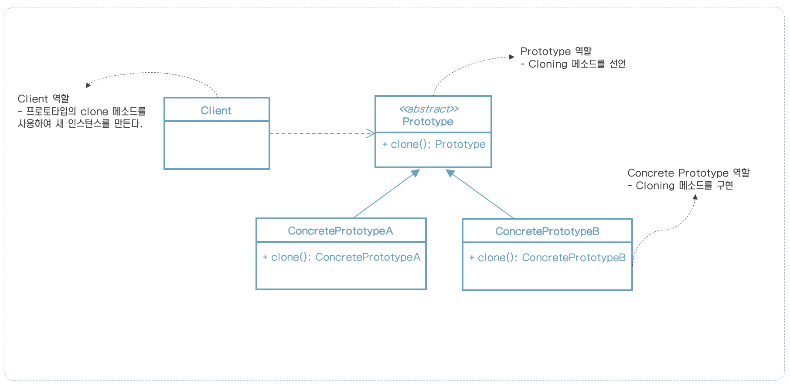
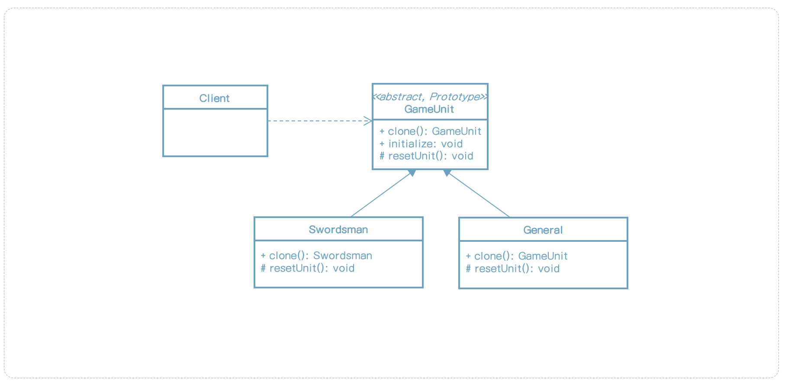

> 이 내용은 udemy의 design pattern 강의를 정리한 것입니다.
>
> https://www.udemy.com/course/design-patterns-in-java-concepts-hands-on-projects/


# 프로토타입 패턴

## 프로토타입은 무엇인가?

* 우리는 생성하기 값비싼 복잡한 객체를 가지고 있다. 그런 클래스 인스턴스를 만들기 위해서 프로토타입으로 기존 인스턴스를 사용한다.
* 프로토타입은 기존 객체의 복사를 허용하며 처음부터 객체를 재생성을 하지 않아도 되게 한다.


## UML




## 프로토타입 구현방법

* 프로토타입에 대한 클래스를 생성함으로서 시작한다.
    * 클래스는 Cloneable 인터페이스를 구현해야 한다.
    * 클래스는 clone 메소드를 오버라이드하고 복사본을 리턴한다.
    * 메소드는 서브클래스가 cloning을 지원할지 판단하도록 예외를 던지는 CloneNotSupportedException을 정의해야한다.

* clone 메소드 구현은 깊은(deep) 복사와 shallow(얕은) 복사와 적용할 지점을 고려해야 한다.


## 예제: UML




## 프로토타입 구현

* GameUnit이 있고 Swordsman, General을 만든다고 가정해보자.
* Swordsman은 clone을 통해 복사를 할 것이고 General은 복사를 허용하지 않을 것이다.

```java
/**
 * 이 클래스는 추상 프로토타입을 나타내고 clone 메소드를 정의한다.
 */
@Getter
public abstract class GameUnit implements Cloneable {

    private Point3D position;

    public GameUnit() {
        this.position = Point3D.ZERO;
    }

    @Override
    protected GameUnit clone() throws CloneNotSupportedException {
        GameUnit unit = (GameUnit) super.clone();
        unit.initialize();
        return unit;
    }

    protected void initialize() {
        this.position = Point3D.ZERO;
        reset();
    }

    protected abstract void reset();

    public GameUnit(float x, float y, float z) {
        this.position = new Point3D(x, y, z);
    }

    public void move(Point3D direction, float distance) {
        Point3D finalMove = direction.normalize();
        finalMove = finalMove.multiply(distance);
        this.position = this.position.add(finalMove);
    }
}
```

```java
public class Swordsman extends GameUnit {

    private String state = "idle";

    public void attack() {
        this.state = "attacking";
    }

    @Override
    public String toString() {
        return "Swordsman " + state + " @ " + getPosition();
    }

    @Override
    protected void reset() {
        this.state = "idle";
    }
}
```

```java
// clone을 허용하지 않는다.
public class General extends GameUnit {

    private String state = "idle";

    public void boostMorale() {
        this.state = "MoralBoost";
    }

    @Override
    public String toString() {
        return "General " + state + " @ " + getPosition();
    }

    @Override
    protected GameUnit clone() throws CloneNotSupportedException {
        throw new CloneNotSupportedException("Generals are unique");
    }

    @Override
    protected void reset() {
        throw new UnsupportedOperationException("Reset not supported");
    }
}
```

이를 이용하는 클라이언트 코드를 만들어보자.

```java
public class Client {

    public static void main(String[] args) throws CloneNotSupportedException {
        Swordsman s1 = new Swordsman();
        s1.move(new Point3D(-10, 0, 0), 20);
        s1.attack();

        System.out.println(s1);

        Swordsman s2 = (Swordsman) s1.clone();
        System.out.println(s2);
    }
}
```

결과는 아래와 같다.

````sh
Swordsman attacking @ Point3D [x = -20.0, y = 0.0, z = 0.0]
Swordsman idle @ Point3D [x = 0.0, y = 0.0, z = 0.0]
````


## 구현 시 고려사항

* 깊은 복사와 얕은 복사를 유심히 살펴봐야 한다. Clone 시 immutable 필드가 있으면 shallow copy를 사용하고 mutable하다면 deep copy를 사용해야 할지도 모른다.
* 프로토타입을 리턴하기 전에 객체의 상태를 초기화하는 것을 명심하라. 서브클래스에서 스스로 초기화하도록 메소드를 구현하는 방법이 좋다.
* clone() 메소드는 Object 클래스에서는 protected이지만 클래스 외부에서 호출될수 있도록 public으로 오버라이드 되어야 한다.
* Cloneable은 "마커" 인터페이스이고 cloning을 지원하는 클래스를 나타내는 것이다.


## 디자인 고려사항

* 프로토타입은 대부분의 상태가 인스턴스 사이에서 변화되지 않고 상태를 쉽게 확인할 수 있는 큰 객체일 때 유용하다.
* 프로토타입 저장소는 인스턴스를 복사하도록 있게 접근할 수 있는 다양한 프로토타입을 등록할 수 있는 클래스이다. 이것은 최초 인스턴스를 접근하는 이슈를 해결해준다.
* 프로토타입은 컴포지트와 데코레이터 패턴과 같이 사용할 때 유용하다.


## 프로토타입 예제

* Object.clone() 메소드가 프로토타입의 예이다.
* 이 메소드는 Java에서 제공되고 기존 객체를 복사할 수 있고, 객체가 프로토타입으로 동작하도록 한다. 클래스는 여전히 Cloneable될 필요가 있고 메소드는 복사된 객체의 역할을 한다.


## 싱글톤과 비교

| 프로토타입                                                   | 싱글톤                                       |
| ------------------------------------------------------------ | -------------------------------------------- |
| 인스턴스의 복사본을 리턴한다. 이는 다른 인스턴스를 의미한다. | 매번 동일한 인스턴스를 리턴한다.             |
| 프로토타입으로 생성된 인스턴스의 상태는 다를 수 있다.        | 리턴되는 객체가 동일하므로 상태는 항상 같다. |


## 위험요소

* immutable한 상태에 대한 프로퍼티 수가 따라 사용성이 달라지고 얕은(shallow) 복사로 사용될 수도 있다. 상태가 많은 수의 mutable 객체로 구성되어 있는 객체라면 복사하는 작업이 복잡해질 수도 있다.
* Java에서 기본 clone 작업은 얕은 복사이므로 깊은 복사가 필요하면 구현해야 한다.
* 서브 클래스는 clone을 지원하지 않을 수도 있기 때문에 clone을 지원하지 않는 경우에 코드가 복잡해질 수도 있다.


## 빠른 요약

* 프로토타입 패턴은 인스턴스 생성작업이 비용이 많이 들거나 불가능할 때 고려해볼만한 패턴이다.
* Java에서 일반적으로 clone 메소드로 이 패턴을 구현한다.
* 대부분의 상태가 immutable한 객체가 프로토타입으로 사용하기 좋은 예이다.
* clone을 구현할 때 객체 상태에 대한 깊은/얕은 복사에 대한 요구사항을 잘 확인해야 한다.
* 복사되는 객체가 초기화(initialized)되었다는 것은 외부에 리턴하기 전에 적절한 상태로 초기화가 되었다는 것이다.
