# 1. 도메인 주도 설계란?

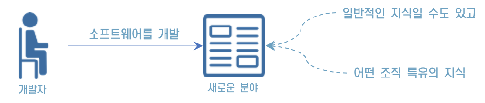

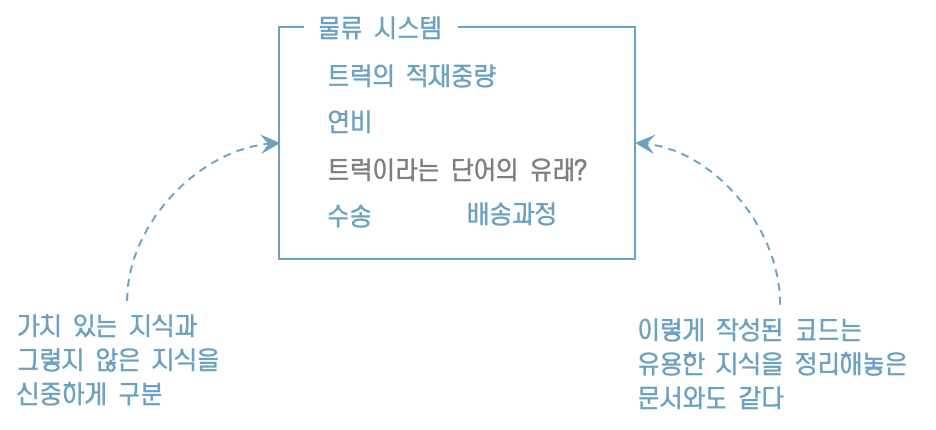

## **도메인 주도 설계의 개념**

* 개발자가 소프트웨어를 개발하면서 가치 있는 지식과 그렇지 않은 지식을 구분하려면 어떤 능력이 필요할까? 
* 당연한 말이지만, 먼저 소프트웨어 이용자의 세계를 이해해야 한다. 
* 유용한 소프트웨어를 만들려면 이용자의 문제가 무엇인지 파악하고, 이를 해결할 수 있는 최선의 수단을 생각해야 한다. 
* 도메인 주도 설계는 이러한 고찰을 반복하는 설계를 통해 이용자의 세계와 소프트웨어 구현을 연결 짓는 것이 그 목적이다.

* 내가 익힌 지식은 그것이 무엇이든 내 삶의 시간을 어느 정도 들인 소중한 것이다. 

* 지식을 코드로 녹여내 소프트웨어를 만들고, 그 소프트웨어가 직접 누군가를 돕는 것을 보며 느끼는 보람을 맛보지 못한 개발자는 없을 것이다. 

* 도메인 주도 설계는 지식을 코드에 녹여 넣을 수 있게 하는 개념이다.

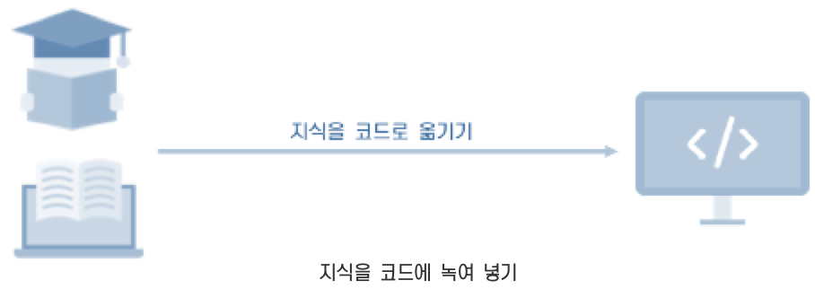

## **도메인 지식에 초점을 맞춘 설계 기법**

* 도메인 주도 설계는 이름 그대로 도메인 지식에 초점을 맞춘 설계 기법이다.

* 이 설명을 들으면 다시 '도메인이란 무엇인가?'라는 의문이 생길 것이다. 

* 도메인은 '영역'이라는 뜻이다. 소프트웨어 개발에서 말하는 도메인은 '프로그램이 쓰이는 대상 분야'라는 의미로 쓰인다.

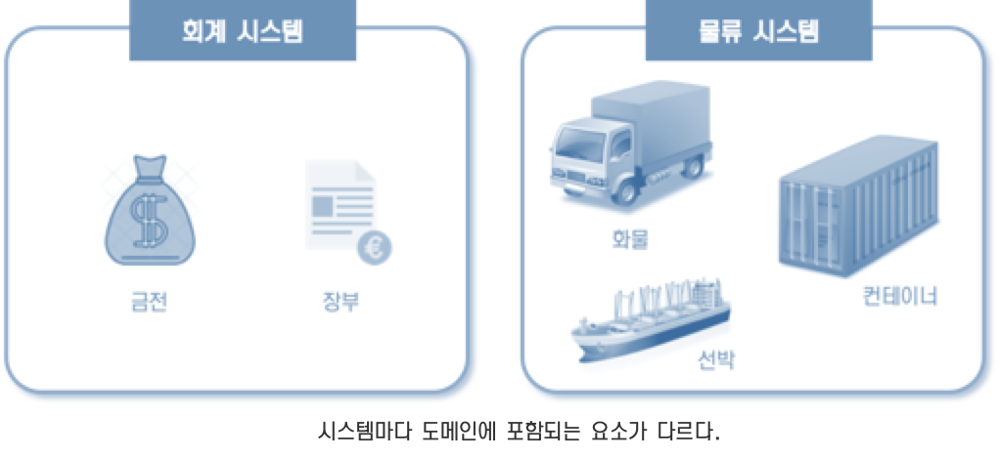

## **소프트웨어 개발의 목적**

**소프트웨어어의 목적**

 -> 도메인에서 이용자들이 직면한 문제를 해결하는 것이다

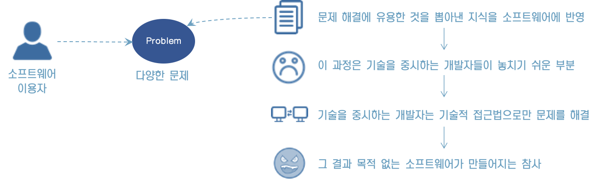

> “이런 비참한 결과를 피하기 위해서라도 소프트웨어가 사용될 분야(도메인)의 지식에 초점을 맞춰야 한다”

## **모델링이란 무엇인가****?**

“모델링”이 무엇인가요?

* 모델은 현실에 일어나는 사건 혹은 개념을 추상화한 개념이다
* 추상이란 여러 사물 혹은 개념에서 공통적인 것을 뽑아 파악하는 것으로, 현실의 모든 것을 반영하는 것이 아니다
* 무엇을 버리고 무엇을 취할지는 도메인에 따라 결정된다

## **펜을 바라보는 관점**

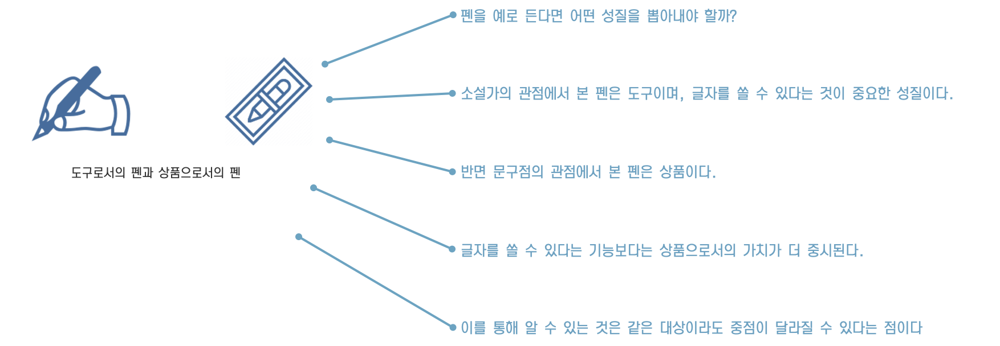

## **도메인 모델링이란 무엇인가**?

사람이 하는 일은 기본적으로 복잡하다.

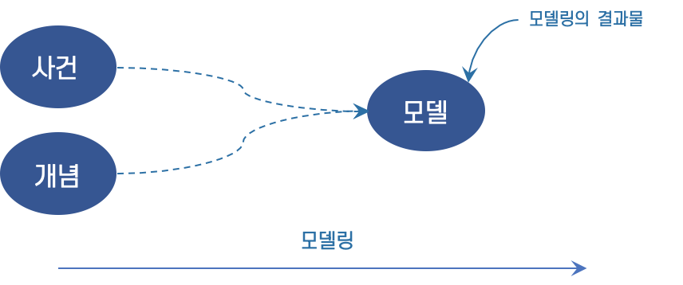

이렇게 사건 혹은 개념을 추상화하는 작업을 모델링이라고 한다. 

그리고 모델링의 결과를 모델이라고 한다. 

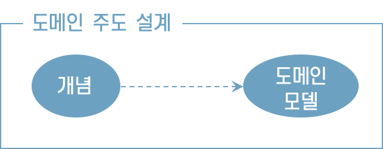

도메인 주도 설계에서는 도메인 개념을 모델링한 모델을 도메인 모델이라고 한다.

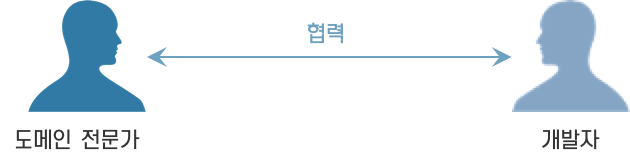

도메인 분야의 관계자는 도메인의 개념에 대한 지식은 있어도 소프트웨어에 대한 지식은 없다.

반면 개발자는 소프트웨어에 대한 지식은 있어도 도메인 개념에 대한 지식이 없다.

## **지식을 코드로 나타내는 도메인 객체**

* 도메인 모델은 어디까지나 개념을 추상화한 지식이다. 아쉽게도 이것만 가지고는 문제를 해결할 수 없다. 

* 도메인 모델은 어떤 매체를 통해 표현돼야만 문제를 해결할 수 있는 힘을 갖는다.

* 도메인 모델을 소프트웨어 형태의 동작하는 모듈로 나타낸 것이 도메인 객체다.

* 어떤 도메인 모델을 도메인 객체로 구현 할지도 중요한 문제다. 

* 개발자는 정말로 유용한 모델과 그렇지 않은 모델을 구분해야 한다. 

* 오랜 시간을 들여 만든 도메인 모델이 있어도 해당 모델이 이용자의 문제를 해결하는 것과 관계가 없다면 이를 도메인 객체로 구현하는 것은 쓸데없는 작업일 뿐이다

## **도메인 객체는 반복적으로 개발**

* 소프트웨어 이용자가 처한 세계는 항상 같은 상태로만 존재하지 않는다. 

* 이럴 때 도메인 객체가 도메인 모델을 충실히 반영하고 있다면 도메인의 변화를 코드로 쉽게 옮길 수 있다.

* 도메인 객체는 도메인 모델이 구현된 표현이므로 변화한 도메인 모델과 아직 변화하지 않은 도메인 객체를 비교하면 어디를 고쳐야 할지 알 수 있다. 도메인에 일어난 변화는 도메인 모델을 통해 연쇄적으로 도메인 객체까지 전달된다.

* 도메인 개념과 도메인 객체는 도메인 모델을 통해 연결되며, 서로 영향을 주고받는 반복적 개발로 실현된다.

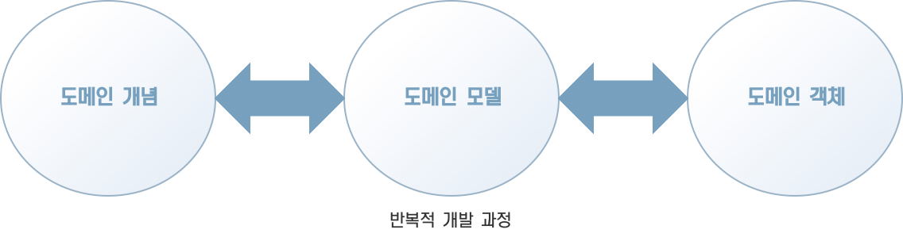

## **이 책에서 설명하는 패턴에 대해서**

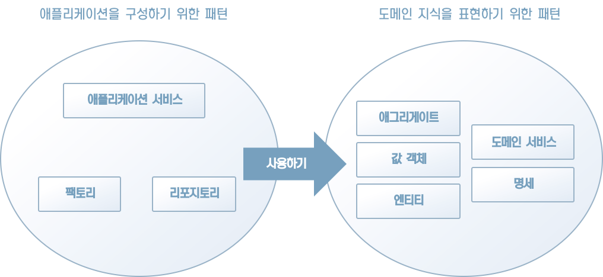

