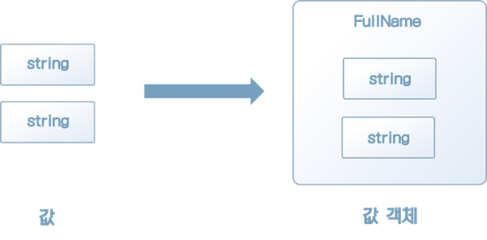
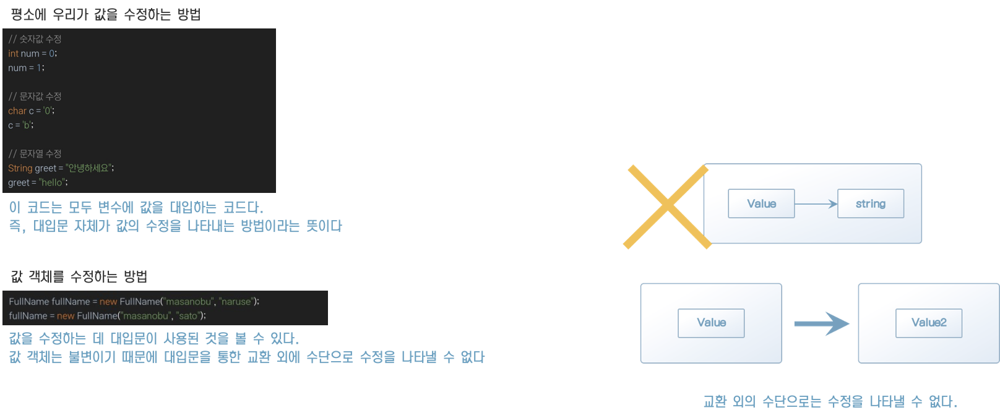

# 2. 시스템 특유의 값을 나타내기 위한‘값 객체’

## **값 객체란 무엇인가**?

* 프로그램 언어에는 원시 데이터 타입이 있다. 
* 이 원시 데이터 타입만 사용해 시스템을 개발할 수도 있지만, 때로는 시스템 특유의 값을 정의해야 할 때가 있다. 
* 이러한 시스템 특유의 값을 표현하기 위해 정의하는 객체를 값 객체라고 한다.

## **값 객체도 값을 표현한다**

* 객체지향 프로그래밍에서는 이런 문제를 해결하기 위해 일반적으로 클래스를 사용한다

시스템에서 어떤 처리를 해야 하는지에 따라 값을 나타내는 적합한 표현이 정해진다.

FullName 클래스는 이 시스템의 필요에 맞는 성명을 나타내는 표현이다. 

객체이기도 하고 동시에 값이기도 하다. 따라서 값 객체라고 부른다.

> “도메인 주도 설계에서 말하는 값 객체는 이렇듯 시스템 특유의 값을 나타내는 객체다”

## **값의 설정과 값 객체 구현**

값의 대표적 성질

1. 변하지 않는다
2. 주고받을 수 있다
3. 등가성을 비교할 수 있다

## **1)** **값의 불변성**

## **2)** **교환 가능하다**

* 값은 불변이다. 그러나 값을 수정하지 않고서도 목적을 달성할 수 있는 소프트웨어를 만들기는 어렵다.
* 값은 불변일지라도 값을 수정할 필요는 있다. 모순처럼 들리지만, 코딩을 할 때 이런 사항은 고민하지 않는다. 

## **3)** **등가성** **비교 가능**

## **어떤 것을 값 객체로 만들어야 하나**?

* FullName 클래스를 구성하는 firstName이나 lastName 등의 속성은 값 객체가 아니라 원시 타입인 문자열로 정의돼 있다.

* 사실 시스템에서 사용되는 개념 중 어디까지 값 객체로 만들어야 하는가도 어려운 문제다. 단순히 도메인 모델로 정의되는 개념은 값 객체로 정의할 수 있지만, 그렇지 않은 경우에는 혼란을 낳는다.
    

## **값 객체의 기준**

* 이 코드를 보고 정도가 '지나치다'고 보는 사람도 있는가 하면,  '괜찮다'고 보는 사람도 있다. 
* 이 코드가 적당한지에 대한 기준은 상황에 따라 달라지기 때문이다. 
* 어느 한쪽이 항상 옳은 것도 아니고, 다른 쪽이 항상 틀린 것도 아니다.

성명: '성과 이름으로 구성된다'는 규칙이 있다 <- 값 객체 (O)

성/이름: 낱개로 다뤄어져야 한다 <- 값 객체 (X)

## **값 객체가 되기 위한 기준**

“값 객체로 정의할 만한 가치가 있는 개념을 구현 중에 발견했다면 그 개념은 도메인 모델로 피드백해야 한다. 도메인 주도 설계의 목적인 반복적 개발은 이렇게 구현 중에 발견된 새로운 사실을 통해 이루어진다”

## **값 객체는 행동이 정의된다**

* 값 객체에서 중요한 점 중 하나는 독자적인 행위를 정의할 수 있다는 점이다. 

* 돈을 나타내는 돈 객체를 예로 생각해보자.

* 돈에는 액수와 화폐 단위(원 혹은 달러). 이렇게 2가지 속성이 있다. 

* 이를 아래와 같이 값 객체로 정의할 수 있다.

## **값 객체는 규칙을 정의할 수 있다**

* 값 객체는 데이터만으로 저장하는 컨테이너가 아니라 행동을 가질 수도 있는 객체다. 

> “값 객체는 결코 데이터를 담는 것만이 목적인 구조체가 아니다. 값 객체는 데이터와 더불어 그 데이터에 대한 행동을 한곳에 모아둠으로써 자신만의 규칙을 갖는 도메인 객체가 된다”

## **값 객체는 정해진 동작만 수행한다**

* 객체에 정의된 행위를 통해 이 객체가 어떤 일을 할 수 있는지 알 수 있다. 이를 반대로 생각하면 객체는 자신에게 정의되지 않은 행위는 할 수 없다는 말도 된다.
* 다시 돈을 예를 들어보면, 돈을 나타내는 값 객체끼리 덧셈을 할 수 있지만, 곱셈은 불가능하다. 즉, '100원 + 100원 = 200원'은 가능해도 '100원 * 100원 = 10,000원'은 가능하지 않다.

## **값 객체를 도입했을 때의 장점**

* 값 객체의 장점은 크게 다음 네 가지다.
    * 1.표현력이 증가한다.
    * 2.무결성이 유지된다.
    * 3.잘못된 대입을 방지한다.
    * 4.로직이 코드 이곳저곳에 흩어지는 것을 방지한다.

## 정리

* 이번 장에서 값 객체의 성질과 값 객체를 사용할 때의 구체적인 장점을 살펴보고 값의 본질에 대해 알아봤다.

* 값 객체의 개념은 '시스템 고유의 값을 만드는' 단순한 것이다. 

* 시스템에는 해당 시스템에서만 쓰이는 값이 반드시 있기 마련이다. 그러나 원시 타입은 지나치게 범용적이기 때문에 아무래도 표현력이 빈약하다.

* 도메인에는 다양한 규칙이 포함된다. 

* 값 객체를 정의하면 이러한 규칙을 값 객체 안에 기술해 코드 자체가 문서의 역할을 할 수 있다. 

* 시스템 명세는 일반적으로 문서에 정리되는데, 이때 코드로 규칙을 나타낼 수 있다면 더 나을 것이다. 

* 캐비닛에 쌓인 문서를 끄집어내는 수고를 줄이자면 지속해서 수고를 들여야 한다.

* 값 객체는 도메인 지식을 코드로 녹여내는 도메인 주도 설계의 기본 패턴이다. 

* 도메인의 개념을 객체로 정의할 때는 우선 값 객체에 적합한 개념인지 검토해 보기 바란다.

