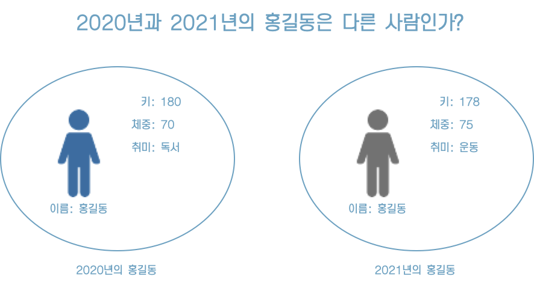
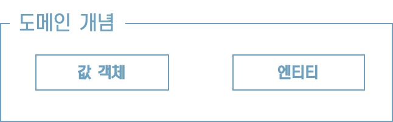
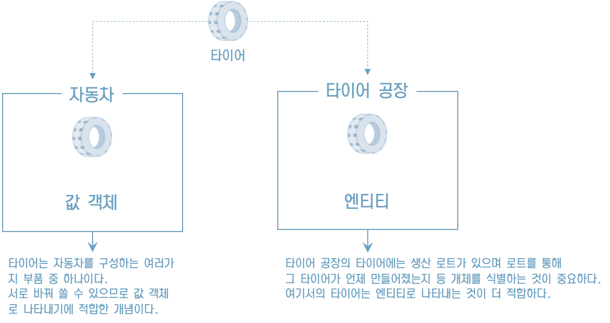

# 3. 생애주기를 갖는 객체 - 엔티티

## **엔티티란**?

* 도메인 주도 개발에서 말하는 엔티티는 도메인 모델을 구현한 도메인 객체를 의미한다.
* 앞장에서 다룬 값 객체도 도메인 모델을 구현한 도메인 객체다. 
* 이 두 가지 객체의 차이는 동일성을 통해 식별이 가능한지 아닌지에 있다.

## **엔티티의** **성질**

* 엔티티는 속성이 아닌 동일성으로 식별되는 객체다. 이와 반대로 동일성이 아닌 속성으로 식별되는 객체도 있다.

* 예를 들어 성과 이름의 두 가지 속성으로 구성되는 성명은 두 속성 중 어느 한쪽이 수정되면 전혀 다른 존재가 된다. 

* 반대로 속성이 모두 같으면 완전히 같은 것으로 취급된다. 

* 말 그대로 성명은 속성을 통해 식별되는 객체다. 이러한 객체를 뭐라고 부르는지는 이미 앞에서 확인했다. 성명은 '값 객체’다.

* 엔티티와 값 객체는 모두 도메인 모델을 구현한 도메인 객체라는 점에서 비슷하지만, 성질에는 차이가 있다.

엔티티의 성질은 다음과 같다.

* 가변이다.
* 속성이 같아도 구분할 수 있다.
* 동일성을 통해 구별된다.

## **엔티티** **판단 기준** **-** **생애주기와 연속성**

==> 생애주기의 존재 여부와 그 생애주기의 연속성 여부

* 사용자는 말 그대로 생애주기를 가지며 연속성을 갖는 개념이다. 엔티티로 판단하기에 문제가 없다.

* 생애주기를 갖지 않거나 생애주기를 나타내는 것이 무의미한 개념이라면 우선 값 객체로서 다루는 것이 좋다. 

## **값 객체도 되고** **엔티티도** **될 수 있는 모델**

>  “같은 대상이라도 어떤 환경에 있느냐에 따라 모델링 방법이 달라진다. 값 객체와 엔티티 모두 될 수 있는 개념도 있으니 소프트웨어에 따라 어느 쪽으로 모델링하는 것이 더 적합한지 생각하기 바란다”

## **도메인 객체를 정의할 때의 장점**

* 엔티티와 값 객체는 서로 성질은 달라도 두 가지 모두 도메인 모델을 나타내는 도메인 객체다. 도메인 모델을 도메인 객체로 정의하면 어떤 장점이 있는지 알아보자.

* 도메인 객체를 정의할 때의 장점은 다음 2가지다.

* 자기 서술적인 코드가 된다.

* 도메인에 변경사항이 있을 시 코드에 반영하기 쉽다.

* 이 장점은 최초 개발 시점보다는 개발 완료 후 유지보수 시점에 빛을 발한다. 잠시 내가 만든 소프트웨어의 미래를 생각하며 읽어나가기 바란다.

## 정리

* 다양한 행동이 기술된 객체는 그 소프트웨어가 어떤 도메인 지식에 관심이 있는지, 또 그 지식을 어떻게 식별하는지를 드러낸다.

* 이들 객체는 나중에 참여하는 개발자들이 도메인을 이해하는 데도 유용한 힌트가 된다.

* 도메인에 대한 날카로운 통찰은 구현 시에도 나타난다. 

* 특히 소프트웨어가 사람의 특성인 애매모호함을 받아들이기 어려울 때 더욱더 그러하다. 

* 엔티티를 구현하려 할 때 애매함을 느꼈다면 도메인을 파악하는 방법을 바꿀 때가 된 것이다.