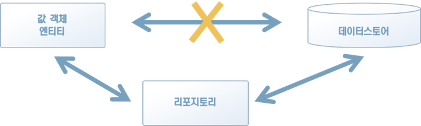

# 5. 데이터와 관계된 처리를 분리하자 - 리포지토리

## **리포지토리란** **무엇인가**?

리포지토리의 일반적인 의미는 보관창고다. 소프트웨어 개발에서 말하는 리포지토리 역시 데이터 보관창고를 의미한다

## **리포지토리를 분리하자**

* 객체를 다시 이용하려면 데이터스토어에 있는 객체 데이터를 저장 및 복원할 수 있어야 한다. 

* 리포지토리는 데이터를 저장하고 복원하는 처리를 추상화하는 객체다.

* 객체 인스턴스를 저장할 때는 데이터스토어에 기록하는 처리를 직접 실행하는 대신 리포지토리에 객체의 저장을 맡기면 된다.

* 또 저장해 둔 데이터에서 다시 객체를 읽어 들일 때도 리포지토리에 객체의 복원을 맡긴다

> “이런 방법으로 리포지토리를 거쳐 간접적으로 데이터를 저장 및 복원하는 방식을 취하면 소프트웨어의 유연성이 놀랄 만큼 향상된다”

## **도메인 객체를 저장하고 복원**

리포지토리의 책임은 도메인 객체를 저장하고 복원하는 퍼시스턴시다.

## **리포지토리에 정의되는 행동**

**1)** **객체의 저장과 관련된 행위**

**2)** **저장된 객체의 복원과 관계된 행위**

## 정리

* 로직이 특정한 인프라스트럭처 기술에 의존하면 소프트웨어가 경직되는 현상이 일어난다. 

* 코드의 대부분이 데이터스토어를 직접 다루는 내용으로 오염되며 코드의 의도가 잘 드러나지 않는다.

* 리포지토리를 이용하면 데이터 퍼시스턴시와 관련된 처리를 추상화할 수 있다. 

* 이 정도의 변화만으로도 소프트웨어의 유연성을 놀랄 만큼 향상시킬 수 있다.