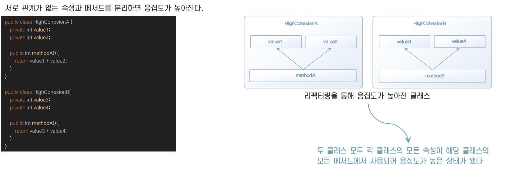

# 6. 유스케이스를 구현하기 위한 ‘애플리케이션 서비스’

## **애플리케이션 서비스란 무엇인가**

* 애플리케이션 서비스를 한마디로 표현하면 유스케이스를 구현하는 객체라고 할 수 있다.

* 예를 들어 사용자 등록을 해야 하는 시스템에서 사용자 기능을 구현하려면 '사용자 등록하기' 유스케이스와 '사용자 정보 수정하기' 유스케이스가 필요하다. 

* 사용자 기능에 대한 애플리케이션 서비스는 유스케이스를 따라 '사용자 등록하기' 행위와 '사용자 정보 수정하기' 행위를 정의한다. 

* 이들 행위는 도메인 객체를 실제로 조합해 실행되는 스크립트 같은 것이다.

## **유스케이스** **수립하기**

* 이용자는 시스템을 이용하기 위해 먼저 사용자 등록을 해야 한다. 

* 여기서 말하는 사용자는 시스템상의 이용자 자신에 해당한다. 

* 이용자는 이전에 등록한 사용자 정보를 참조하기도 하고, 때에 따라서는 정보를 수정할 수도 있다. 

* 만약 이용자가 더이상 시스템이 필요하지 않게 됐을 때는 탈퇴를 통해 시스템 이용을 중지할 수 있다.

## **사용자 정보 수정 처리 구현하기**

사용자 정보 수정 처리를 개개의 정보 항목마다 별도의 유스케이스를 둘 것인지, 아니면 단일 유스케이스로 여러 항목을 한꺼번에 수정할 수 있게 할지는 결정하기 까다로운 문제다

## **도메인 규칙의 유출**

* 애플리케이션 서비스는 도메인 객체가 수행하는 태스크를 조율하는 데만 전념해야 한다. 
* 따라서 애플리케이션 서비스에 도메인 규칙을 기술해서는 안된다. 
* 도메인 규칙이 애플리케이션 서비스에 기술되면 같은 코드가 여러 곳에서 중복되는 현상이 나타난다.

## **응집도**

* 프로그램에는 응집도라는 개념이 있다. 

* 응집도는 모듈의 책임 범위가 얼마나 집중되어 있는지 나타내는 척도다.

* 응집도가 높으면 모듈이 하나의 관심사에 집중하고 있다는 의미이므로 모듈의 견고성, 신뢰성, 재사용성, 가독성의 측면에서 바람직하다.

* 이 응집도를 측정하는 방법에는 LCOM(Lack of Cohesion in Methods)라는 방식이 있다. 

* 간단히 설명하면 모든 인스턴스 변수가 모든 메서드에서 사용돼야 한다는 관점에서 인스턴스 변수의 개수와 메서드의 수를 통해 응집도를 계산하는 것이다.

## **높아진 응집도**

## 정리

* 도메인 모델을 표현하는 것만으로 애플리케이션이 완성되지는 않는다. 

* 애플리케이션 서비스는 도메인 객체를 다루는 데 전념하며 유스케이스를 구현한다.

* 애플리케이션 서비스를 구현할 때는 도메인 규칙에 대한 기술이 포함되지 않게 주의해야 한다. 

* 애플리케이션 서비스에 도메인 지식이 담기면 단기적으로는 문제가 없겠지만 장기적으로는 도메인 지식이 변경됐을 때 한곳에서 수정하기가 어렵다. 

* 도메인 규칙은 도메인 객체에만 기술하는 것이 좋다.