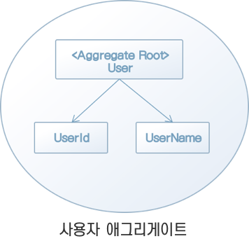
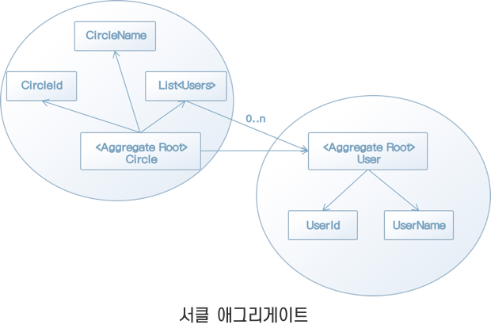

# 8. 도메인 규칙을 지키는 ‘애그리게이트’

## **애그리게이트란**?

* 객체 지향 프로그래밍에서는 여러 갱의 객체가 모여 한 가지 의미를 갖는 하나의 객체가 된다. 

* 이렇게 객체가 모여 이룬 객체는 어떤 불변 조건을 유지해야 한다.

* 이 불변 조건은 언제나 유지돼야 하지만, 객체가 가진 데이터를 변경하는 조작을 무제한 적용하면 이를 유지하기 어렵다.

* 따라서 객체를 다루는 데도 질서가 필요하다.

* 애그리게이트는 경계와 루트를 갖는다. 

* 애그리게이트의 경계는 말 그대로 애그리게이트에 포함되는 대상을 결정하는 경계다. 

* 그리고 루트는 애그리게이트에 포함되는 특정한 객체다.

* 외부에서 애그리게이트를 다루는 조작은 모두 루트를 거쳐야 한다. 

* 애그리게이트에 포함되는 객체를 외부에 노출하지 않음으로써 불변 조건을 유지할 수 있다.

## **애그리게이트의** **기본 구조**

* 애그리게이트는 서로 연관된 객체를 감싸는 경계를 통해 정의된다.
* 예를 들어 사용자를 나타내는 User 클래스를 애그리게이트로 보면 아래와 같이 나타낼 수 있다.

## **애그리게이트의** **경계를 어떻게 정할 것인가**

* 애그리게이트의 경계를 어떻게 정할 것인가는 상당히 어려운 주제다.

* 애그리게이트의 경계를 정하는 원칙 중 가장 흔히 쓰이는 것은 '변경의 단위’다. 
* 변경의 단위가 애그리게이트의 경계로 이어지는 이유는 그 원칙을 어겨보면 이해하기 쉽다.

## **애그리게이트의** **크기와 조작의 단위**

* 트랜잭션은 데이터에 락(lock)을 건다. 

* 애그리게이트의 크기가 크면 클수록 이 락의 적용 범위도 비례해 커진다.

* 애그리게이트의 크기가 지나치게 커지면 그만큼 애그리게이트를 대상으로 하는 처리가 실패할 가능성도 높다.

* 따라서 애그리게이트의 크기는 가능한 한 작게 유지하는 것이 좋다. 

* 만약 지나치게 비대해진 애그리게이트를 발견했다면 한번쯤 애그리게이트의 범위를 재검토해야 한다.

* 또, 한 트랜잭션에서 여러 애그리게이트를 다루는 것도 가능한 한 피해야 한다. 

* 여러 애그리게이트션에 걸친 트랜잭션은 범위가 큰 애그리게이트와 마찬가지로 광범위한 데이터에 락을 걸 가능성이 높다.

## **정리**

* 애그리게이트는 정해진 규칙대로 정의되는 것이 아니다. 

* 도메인의 개념은 애초부터 서로 밀접하게 엮여 있는 개념이며 이들을 구분하는 경계선을 정의하는 것도 간단하지는 않다.

* 애그리게이트의 경계선을 정하는 일은 도메인 개념을 잘 파악하고 여기에 따르는 불변 조건을 제대로 유도한 다음, 도메인과 시스템이 균형을 이루는 최적의 지점을 찾는 과정이다. 

* 어느 한쪽으로 지나치게 기울지 않는 균형 잡힌 지점을 찾는다.