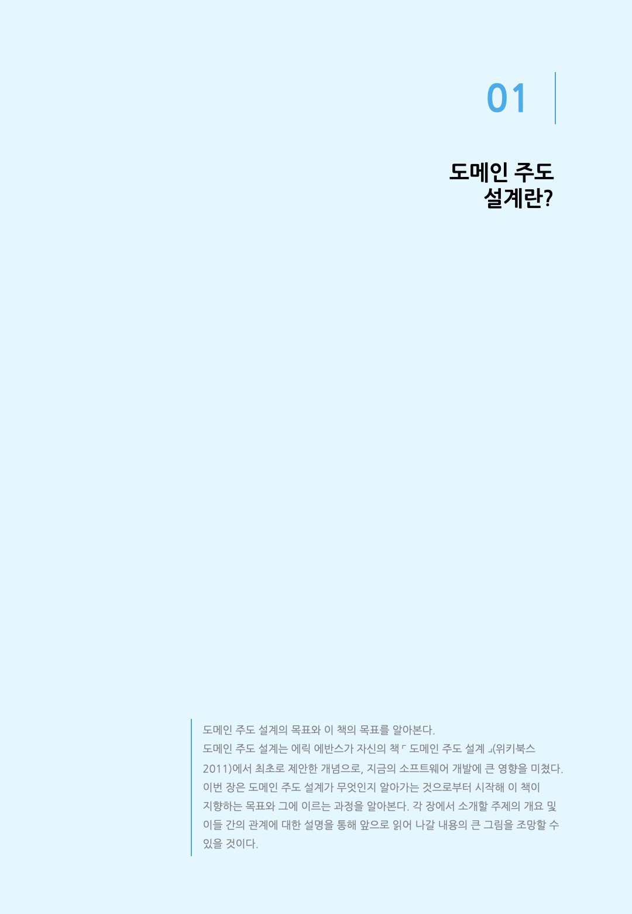
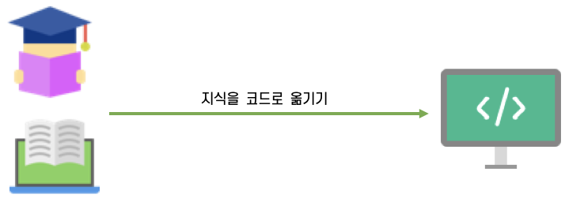
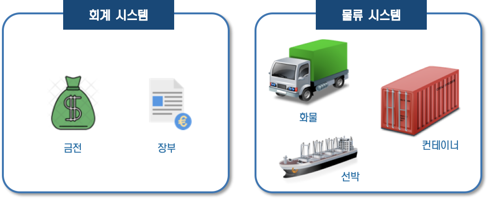
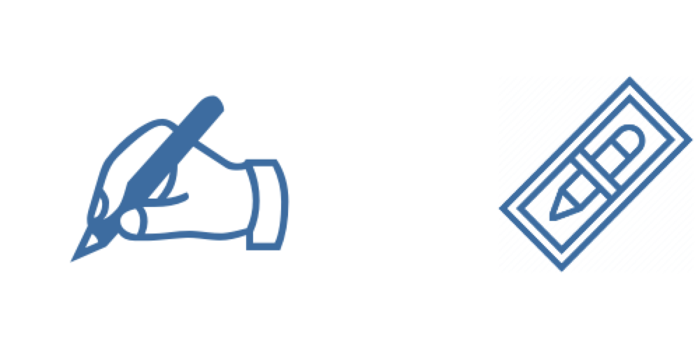
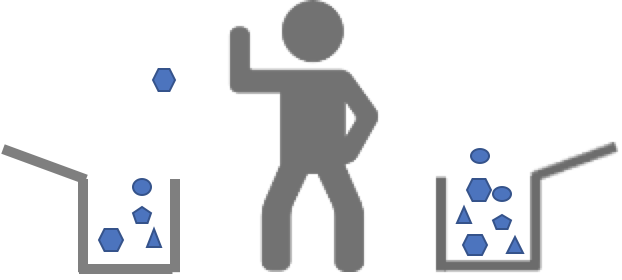
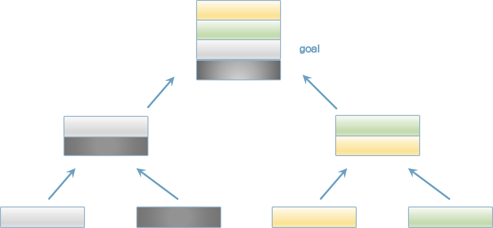

### 1.1 도메인 주도 설계란 무엇인가?

소프트웨어를 개발하다 보면 새로운 분야를 익히게 된다. 예를 들어 회계 시스템을 개발할 때는 경리 업무에 대해 배우게 되고, 물류 시스템을 개발할 때는 수송이나 배송 과정에 대해 배운다. 소프트웨어 시스템을 개발하며 배운 지식은 일반적인 지식일 수도 있고, 어떤 조직 특유의 지식일 수도 있다.

개발자는 소프트웨어 이용자의 세계에 대해 기본적으로 무지하다. 개발자가 이용자들이 겪는 문제를 해결하려면 당연히 이용자의 세계에 대해 배워야 한다. 그러나 이렇게 배운 지식이 소프트웨어 개발에서 유용한 경우는 드물다.

다시 물류 시스템을 예로 들어보자. 트럭의 적재중량이나 연비 같은 개념은 물류 시스템에서 매우 이용 가치가 높은 지식이다. 그러나 트럭이라는 단어의 어원이 쇠바퀴를 의미하는 라틴어 trochus에서 온 것이라는 지식은 물류 시스템을 개발할 때 그리 가치가 없다. 따라서 지식을 취사선택할 필요가 있다.

이용자에게 유용한 소프트웨어를 개발하려면 가치 있는 지식과 그렇지 않은 지식을 신중하게 구분해서 가치 있는 지식만 코드에 녹여 넣어야 한다. 이렇게 작성된 코드는 유용한 지식을 정리해놓은 문서와도 같다.

개발자가 소프트웨어를 개발하면서 가치 있는 지식과 그렇지 않은 지식을 구분하려면 어떤 능력이 필요할까? 당연한 말이지만, 먼저 소프트웨어 이용자의 세계를 이해해야 한다. 유용한 소프트웨어를 만들려면 이용자의 문제가 무엇인지 파악하고, 이를 해결할 수 있는 최선의 수단을 생각해야 한다. 도메인 주도 설계는 이러한 고찰을 반복하는 설계를 통해 이용자의 세계와 소프트웨어 구현을 연결 짓는 것이 그 목적이다.

내가 익힌 지식은 그것이 무엇이든 내 삶의 시간을 어느 정도 들인 소중한 것이다. 지식을 코드로 녹여내 소프트웨어를 만들고, 그 소프트웨어가 직접 누군가를 돕는 것을 보며 느끼는 보람을 맛보지 못한 개발자는 없을 것이다. 도메인 주도 설계는 지식을 코드에 녹여 넣을 수 있게 하는 개념이다.

[그림 1-1] 지식을 코드에 녹여 넣기

### 1.2 도메인 지식에 초점을 맞춘 설계 기법

도메인 주도 설계는 이름 그대로 도메인 지식에 초점을 맞춘 설계 기법이다. 이 설명을 들으면 다시 '도메인이란 무엇인가?'라는 의문이 생길 것이다. 우선 도메인이 무엇인지부터 확실히 알아보자.

도메인은 '영역'이라는 뜻이다. 소프트웨어 개발에서 말하는 도메인은 '프로그램이 쓰이는 대상 분야'라는 의미로 쓰인다. 여기서 더 중요한 것은 도메인이 무엇인지보다는 도메인에 포함되는 것이 무엇인가 하는 것이다.

다시 회계 시스템을 예로 들면, 회계 분야에는 금전 혹은 장부와 같은 개념이 등장한다. 이 개념은 회계 시스템의 도메인에 속한다. 물류 시스템에는 회계 시스템에 없는 화물이나 창고, 운송수단 등의 개념이 있을 것이고, 이 개념 역시 물류 시스템의 도메인에 속한다. 이렇듯 도메인에 포함되는 개념은 시스템의 대상 분야가 무엇인지에 따라 크게 달라진다(그림 1-2).

[그림 1-2] 시스템마다 도메인에 포함되는 요소가 다르다.

이번에는 '지식에 초점을 맞춘다'라는 말의 의미에 대해 알아보자.

소프트웨어에는 반드시 소프트웨어를 이용하는 이용자가 있다. 소프트웨어어의 목적인 도메인에서 이용자들이 직면한 문제를 해결하는 것이다. 그렇다면 이용자들이 직면한 문제를 해결하려면 무엇이 필요할까? 말할 필요도 없이 '이용자들의 문제를 정확히 이해하는 것'이다. 다른 말로 하면, 이용자의 도메인을 접해야 한다.

도메인에 속하는 개념과 사건을 이해하고, 그중에서 문제 해결에 유용한 것을 뽑아낸 지식을 소프트웨어에 반영하는 과정은 소프트웨어 개발에 꼭 필요한 과정이다. 그러나 이 과정은 기술을 중시하는 개발자들이 놓치기 쉬운 부분이기도 하다.

최신 프레임워크나 개발 기법, 최신 기술 등의 키워드는 개발자를 흥분시키는 단어다. 문제를 제대로 해결하려면 먼저 문제를 파악하는 과정이 필요하지만, 기술을 중시하는 개발자는 기술적 접근법으로만 문제를 해결하려 들기 쉽다. 그 결과 목적 없는 소프트웨어가 만들어지는 참사가 발생한다. 반짝거리는 새 망치는 눈앞의 모든 것을 못으로 보이게 만들어 개발자의 판단력을 흐리기 때문이다.

이런 비참한 결과를 피하기 위해서라도 소프트웨어가 사용될 분야(도메인)의 지식에 초점을 맞춰야 한다. 주의 깊게 관찰하고 관찰을 통해 알게 된 지식을 제대로 표현하는 것은 소프트웨어 개발 과정의 일부다. 도메인 주도 설계에서 소개하는 프랙티스는 이를 실천하는 과정을 보조하는 수단이다. 다시 말해, 당연히 할 일을 할 수 있게 돕는 수단이라는 말이다.

#### 1.2.1 도메인 모델링이란 무엇인가?

모델링이라는 단어는 개발자에게 친숙하다. 소프트웨어 개발과 관련된 수많은 문헌에서 자주라는 말로는 부족할 정도로 흔하게 볼 수 있는 단어다. 에릭 에반스의 책『도메인 주도 설계』에서도 1부의 제목(동작하는 도메인 모델 만들기)부터 도메인이라는 단어를 볼 수 있다.

모델링이 개발자에게 친숙한 단어라고는 하나, 새삼 모델링의 정의를 묻는다면 의외로 쉽게 답하기 어렵다.

모델은 현실에 일어나는 사건 혹은 개념을 추상화한 개념이다. 추상이란 여러 사물 혹은 개념에서 공통적인 것을 뽑아 파악하는 것으로, 현실의 모든 것을 반영하는 것이 아니다. 상황에 따라 취사선택이 필요하다. 무엇을 버리고 무엇을 취할지는 도메인에 따라 결정된다.

펜을 예로 든다면 어떤 성질을 뽑아내야 할까? 소설가의 관점에서 본 펜은 도구이며, 글자를 쓸 수 있다는 것이 중요한 성질이다. 반면 문구점의 관점에서 본 펜은 상품이다. 글자를 쓸 수 있다는 기능보다는 상품으로서의 가치가 더 중시된다. 이를 통해 알 수 있는 것은 같은 대상이라도 중점이 달라질 수 있다는 점이다(그림 1-3).

[그림 1-3] 도구로서의 펜과 상품으로서의 펜

사람이 하는 일은 기본적으로 복잡하다. 도메인의 개념을 빠짐없이 표현하는 것은 매우 어렵다. 표현에 제약이 많은 코드로 나타내야 한다면 더욱더 그렇다. 그러나 코드로 나타낼 대상을 소프트웨어가 맡은 바 역할을 다하기 위해 필요한 정보로 한정한다면, 현실적으로 실현하는 데 문제가 없다. 물류 시스템을 예를 들면, 트럭은 '화물을 나를 수 있다'는 성질만 표현해도 충분하다. '차 키를 돌리면 엔진에 시동이 걸린다'와 같은 정보까지 나타낼 필요는 없다.

이렇게 사건 혹은 개념을 추상화하는 작업을 모델링이라고 한다. 그리고 모델링의 결과를 모델이라고 한다. 도메인 주도 설계에서는 도메인 개념을 모델링한 모델을 도메인 모델이라고 한다.

도메인 모델은 처음부터 정해진 것이 아니다. 도메인 분야의 관계자는 도메인의 개념에 대한 지식은 있어도 소프트웨어에 대한 지식은 없다. 반면 개발자는 소프트웨어에 대한 지식은 있어도 도메인 개념에 대한 지식이 없다. 도메인 문제를 해결하는 소프트웨어를 만들려면 각 분야의 두 사람이 협력하여 도메인 모델을 만들어야 한다.

#### 1.2.1 지식을 코드로 나타내는 도메인 객체

도메인 모델은 어디까지나 개념을 추상화한 지식이다. 아쉽게도 이것만 가지고는 문제를 해결할 수 없다. 도메인 모델은 어떤 매체를 통해 표현돼야만 문제를 해결할 수 있는 힘을 갖는다.

도메인 모델을 소프트웨어 형태의 동작하는 모듈로 나타낸 것이 도메인 객체다.

어떤 도메인 모델을 도메인 객체로 구현할지도 중요한 문제다. 개발자는 정말로 유용한 모델과 그렇지 않은 모델을 구분해야 한다(그림 1-4). 오랜 시간을 들여 만든 도메인 모델이 있어도 해당 모델이 이용자의 문제를 해결하는 것과 관계가 없다면 이를 도메인 객체로 구현하는 것은 쓸데없는 작업일 뿐이다.

[그림 1-4] 문제 해결에 유용한 도메인 모델 선택하기

소프트웨어 이용자가 처한 세계는 항상 같은 상태로만 존재하지 않는다. 사람이 하는 일은 바뀌기 쉽고, 시간에 따라 변화하기 쉽다. 그 대부분은 경미한 변화가 쌓인 것이지만, 때로는 상식조차 뒤바뀌는 경우도 있다. 이럴 때 도메인 객체가 도메인 모델을 충실히 반영하고 있다면 도메인의 변화를 코드로 쉽게 옮길 수 있다.

도메인에 발생한 변화는 우선 도메인 모델로 전달돼야 한다.

도메인 개념이 투영된 도메인 모델은 이 변호를 충실하게 반영할 수 있다. 도메인 객체는 도메인 모델이 구현된 표현이므로 변화한 도메인 모델과 아직 변화하지 않은 도메인 객체를 비교하면 어디를 고쳐야 할지 알 수 있다. 도메인에 일어난 변화는 도메인 모델을 통해 연쇄적으로 도메인 객체까지 전달된다.

반대로, 도메인 객체가 도메인에 대한 태도를 변화시키는 경우도 있다. 프로그램은 사람만큼 애매함을 용납하지 못한다. 도메인에 대한 어중간한 이해는 도리어 구현을 방해한다. 이를 해결하려면 도메인 모델을 직시하고, 더 나아가 개념을 추상화하는 방법을 바꿔야 한다. 도메인에 대한 날카로운 통찰은 구현 과정에서도 얻을 수 있다.

이렇듯 도메인 개념과 도메인 객체는 도메인 모델을 통해 연결되며, 서로 영향을 주고받는 반복적 개발로 실현된다(그림 1-5).

[그림 1-5] 반복적 개발 과정

### 1.3 이 책의 접근법과 목표

도메인 주도 설계를 이해하기는 쉽지 않다. 도메인 주도 설계를 공부하다 보면 수많은 개념과 용어에 놀아나는 기분마저 들 것이다. 도메인 주도 설계의 이러한 점은 초심자를 혼란스럽게 하며 공포에 빠지게 한다.

지식은 연쇄적으로 연결돼 있다. 어떤 지식을 이해하려면 그 전제가 되는 다른 지식이 필요한 경우가 많다. 도메인 주도 설계와 관련된 개념 혹은 용어를 이해하려면 그 결론에 이르는 과정을 이해하기 위해 더 많은 배경지식이 필요하다. 그 하나하나는 사소한 지식일 수 있지만, 여러 개가 모이면 모두를 한 번에 이해하기 어렵다.

또 큰 문제가 한 가지 더 있다. 도메인 주도 설계의 프랙티스 자체에 애초 실천하기 어려운 것이 있다는 점이다. 백 번 듣는 것보다 한 번 보는 것이 낫다는 말이 있듯이, 지식을 이해하는 가장 좋은 방법은 그 지식을 실천하는 것이다. 그러나 도메인 주도 설계의 프랙티스 중에는 어느 정도의 환경을 갖추지 못하면 실천이 어려운 것들이 있다.

하지만 이해하기도 어렵고 실천하기도 어렵다면 발전이 없을 것이다. 그래서 이 책에서는 이해와 실천이 힘든 것들은 일단 제쳐 놓고, 상대적으로 이해하기 쉽고 실천하기도 쉬운 구현 패턴에 집중해 상향식(Bottom-up)으로 설명하는 방식을 택했다. 개념에서 전제가 되는 지식 역시 그때그때 필요한 내용을 설명할 것이다. 이런 식으로 이해의 영역을 조금씩 넓혀가며 도메인 주도 설계의 본질에 접근할 준비를 하는 것이 이 책의 목표다(그림 1-6)

[그림 1-6] 구체적인 내용부터 추상적인 내용으로 진행하는 보텀업 방식

[칼럼] 도메인 주도 설계를 실천하기 어려운 이유

> 도메인 주도 설계는 소프트웨어 개발 분야의 테마다. 소프트웨어 개발 현장에는 직접 업무를 수행하느냐 아니냐의 차이는 있어도 개발과 관련된 사람이 여럿 있다. 따라서 도메인 주도 설계라는 주제는 구현 뿐만 아니라 개발 관계자들 사이의 커뮤니케이션이나 팀 빌딩과도 밀접한 관계가 있다. 다시 말하면 개발자 개인 외에도 수많은 관계가 엮여 있다는 말이다.
>
> 예를 들면, 도메인 모델을 확립하는 작업은 개발자가 자기 업무만 수행해서 마칠 수 있는 작업이 아니다. 도메인에 존재하는 개념을 포착하는 과정은 해당 도메인에 종사하는 실무자의 관점 없이는 불가능하며, 그들의 도움이 꼭 필요하다. 그러나 안타깝게도 이것이 불가능한 현장도 많다.
>
> 하지만 이러한 환경에 처했더라도 비관할 필요는 없다. 도메인 주도 설계의 모든 세부 주제가 도메인 실무자의 조력 없이 성립할 수 없는 것은 아니기 때문이다. 간혹 개발자 개인이 재량으로 실천할 수 있는 프랙티스도 있다. 이 책에서 소개하는 패턴 역시 지금 바로 실천할 수 있는 것들이다.
>
> 도메인 주도 설계 뿐만 아니라 설계라는 활동에는 어떤 이상과도 같은 측면이 있다. 중요한 것은 이 이상을 현실에 억지로 끼워 맞추는 것이 아니라 현실적으로 사용 가능한 수단을 잘 골라 선택하는 것이다. 이상을 좇되, 현실과 타협해야 하는 상황에 어느 부분에서 타협할 것인가를 고민하는 것도 소프트웨어 개발의 즐거움 중 하나다.
>
> 도메인 주도 설계는 어찌 보면 당연히 해야 할 일을 하기 위한 프랙티스다. 하지만 당연히 해야 할 일이 무엇이고 이를 실현할 방법을 아는 것과 모르는 것의 차이는 매우 크다. 혹여 독자 여러분이 도메인 주도 설계의 모든 것을 실천할 수 있는 환경에 있지 못하더라도 더 많은 배움을 얻기 위해 도메인 주도 설계를 선택한 것은 옳은 선택이다.

### 1.4 이 책에서 설명하는 패턴에 대해서

목적지를 모른 채 길을 나서는 것은 마치 미로를 헤매는 것과 같다. 도메인 주도 설계에서도 목적지까지 남은 거리가 얼마나 되는지, 현재 위치를 안다면 학습 페이스를 자신에게 맞게 조절할 수 있다. 그런 의미에서 이 책에서 다룰 도메인 주도 설계 패턴의 큰 그림을 조망해 보자.

* 지식 표현을 위한 패턴
  값 객체
  엔티티
  도메인 서비스
* 애플리케이션을 구성하는 패턴
  리포지토리
  애플리케이션 서비스
  팩토리
* 지식 표현을 위한 고급 패턴
  애그리게이트
  명세

이들은 도메인 주도 설계의 대표적인 패턴이다. 이 책에서 지금 언급한 순서대로 각 패턴을 설명한다.

패턴은 도메인 지식을 설명하기 위한 것과 애플리케이션을 구성하기 위한 것으로 나뉜다. 이 패턴은 그림 1-7과 같은 관계를 갖는다.

[그림 1-7] 용어 간의 관계

#### 1.4.1 지식 표현을 위한 패턴

먼저 지식 표현을 위한 패턴을 알아보자. 그 중에서도 우선 객체 형태로 도메인 지식을 나타내는 도메인 객체를 이해하는 것부터 시작하겠다.

값 객체(2장)는 그 도메인만의 고유의 개념(금전, 제조번호 등)을 값으로 나타내는 패턴이다. 개념과 목적 모두 이해하기 쉽게 때문에 도메인 주도 설계에서 배우는 첫 번째 개념으로 적당하다.

그다음 패턴은 엔티티(3장)다. 엔티티도 값 객체와 마찬가지로 도메인 개념을 나타내기 위한 객체지만, 값 객체와는 차이가 있다. 값 객체에서 배운 내용은 그대로 엔티티를 이해하는 데도 유용하므로 값 객체를 소개한 바로 다음에 엔티티를 소개하는 것이 가장 효율적이다.

도메인 서비스(4장)는 값 객체나 엔티티만으로는 잘 표현할 수 없는 지식을 다루기 위한 패턴이다. 값 객체와 엔티티가 무엇이며, 어떤 지식을 나타내기에 효율적인가를 이해한 다음에 도메인 서비스를 배우는 것이 이해하기 쉬우므로 값 객체와 엔티티에 이어 배우게 배치했다.

#### 1.4.2 애플리케이션을 구성하기 위한 패턴

도메인 지식을 표현한 것은 도메인을 그대로 코드로 옮긴 것일 뿐 소프트웨어가 가져야할 유용한 점은 아직 없다. 따라서 지식을 표현하는 방법을 익힌 다음에는 이용자의 필요를 만족시킬 수 있는 애플리케이션을 구성하는 방법을 학습해야 한다.

리포지토리(5장)는 데이터의 저장과 복원을 의미하는 데이터 퍼시스턴시(Data persistency)를 담당하는 객체다. 데이터 퍼시스턴시라고 하면 관계형 데이터베이스와 같은 구체적인 데이터스토어를 떠올리기 쉬운데, 리포지토리는 이들을 추상화한 개념이다. 데이터 퍼시스턴시를 추상화하면 유연한 애플리케이션을 만들 수 있다.

값 객체, 엔티티, 도메인 서비스, 리포지토리 이렇게 4가지 요소를 익히면 애플리케이션을 구성하기 위해 필요한 최소한의 개념을 이해한 것이다. 애플리케이션 서비스(6장)는 이 4가지 요소가 서로 협조하며 애플리케이션으로서 기능하는 장소가 된다. 이 책에서는 애플리케이션 서비스까지 소개한 다음, 실제로 동작하는 웹 애플리케이션에 적용해 볼 것이다.

웹 애플리케이션을 만들고 동작까지 확인이 끝나면 팩토리(9장)을 학습할 차례다. 팩토리는 객체를 만드는 데 필요한 지식에 특화된 객체다. 구조가 복잡한 객체는 객체를 만드는 방법도 복잡하게 마련이다. 이 점은 도메인 객체도 마찬가지이므로 복잡한 객체를 만드는 방법도 일종의 지식으로 취급한다. 객체 생성은 애플리케이션 어디서든 일어나는 일이다. 대책을 마련하지 않으면 번잡한 객체 생성 절차가 코드 이곳저곳에 중복되며 해당 코드의 의도를 파악하기 어려워진다. 팩토리 패턴을 이용해 객체 생성에 대한 지식을 한곳에 모아 놓으면 도메인 객체가 더 잘 드러나며 그만큼 코드의 의도를 쉽게 이해할 수 있다.

#### 1.4.3 지식 표현을 위한 고급 패턴

애그리게이트와 명세는 지식을 표현하기 위한 고급 패턴이다. 책의 앞쪽에서 소개한 내용을 잘 이해한 다음 읽기 바란다.

애그리게이트(12장)는 무결성을 유지하는 경계다. 값 객체나 엔티티 같은 도메인 객체를 한데 묶어 복잡한 도메인 개념을 나타낸다. 요구되는 배경지식이 많기 때문에 이해하기도 어렵고 그만큼 바르게 실천하기도 어려운 개념이다. 물론 이 배경지식은 모두 앞서 설명한 내용이다. 11장까지 잘 읽었다면 어렵지 않게 이해할 수 있을 것이다.

그다음에 배울 명세(13장)는 객체를 평가하기 위한 지식이다. 객체가 어떤 특정한 조건을 만족하는지 판정하는 평가 기준을 객체 내에 구현하면 객체가 이런 내용의 코드로 인해 불필요하게 복잡해질 수 있다. 명세 패턴을 적용하면 객체를 평가하는 기준을 모듈로 분리할 수 있다.

이 책의 각 장은 구성상 앞뒤가 서로 연결되어 있다. 각 장을 단독으로 읽어도 이해할 수 있지만, 순서에 맞춰 읽는다면 내용을 연결 짓기가 더 수월할 것이다.

[칼럼] 왜 지금 도메인 주도 설계가 필요한가?

> 도메인 주도 설계는 2003년에 처음 제안됐지만, IT 분야는 발전이 매우 빨라 최신 기술이라도 10년 후에는 진부한 기술이 되는 경우가 많다. 그런데도 최근에서 시스템 개발 현장에서 도메인 주도 설계라는 용어가 오르내리게 된 데는 어떤 배경이 있었을까?
>
> 종전에는 서비스를 하루라도 빨리 출시하는 것이 가장 중요시됐다. 그래서 모델링에 중점을 두어 개발 극초기에 비용이 들어가는 도메인 주도 설계는 기만하지 못한 개발 기법으로 오해를 받고 기피하게 됐다.
>
> 서비스를 빠르게 출시하는 것은 편도 로켓에 타는 것과 비슷하다. 일단 발사 후에는 돌아올 수 없다는 단점을 제외하면 시스템 개발 업종의 가혹한 생존경쟁에서 살아남을 수 있는 최선의 선택지이기도 하다. 이와 달리 꼼꼼한 모델링을 거쳐 장기적인 운영을 염두에 둔 설계 기법은 항공기를 운항하는 것과 비슷하다고 볼 수 있다. 항공기는 로켓과 달리 왕복 운행이 가능하지만, 속도는 로켓보다 압도적으로 느리다. 그런데도 편도 로켓을 발사하는 경쟁을 멈추고 항공기로 안정적인 운항을 원하게 된 이유는 무엇일까?
>
> 소프트웨어는 항상 진화하는 존재다. 개발 극초기 잠깐 동안의 개발 속도를 우선시한 소프트웨어는 유연성이 떨어지며 변화에 대응하기 어렵다. 소프트웨어가 변화에 제대로 대응하려면 개발자가 지속해서 소프트웨어를 수정해야 한다. 이렇게 여러 해가 지나다 보면 소프트웨어는 복잡하고 이리저리 기워진 누더기가 되기 일쑤다. 그런데도 시대의 변화에 뒤처지지 않기 위해서 힘들지만 개발자는 수정을 계속해 나간다. 끝없는 땜질식 수정 업무에서 벗어나기 위한 수단 중 하나가 도메인 주도 설계인 것이다.
>
> 도메인 주도 설계는 도메인에 주목해 요구사항 분석부터 설계, 개발에 이르기까지 소프트웨어 개발 과정에 상호작용이 필요하다. 개발 극초기에도 어느 정도 효과를 볼 수 있지만, 도메인 주도 설계의 진정한 가치가 드러나는 것은 변화에 대응해 소프트웨어를 수정할 때다. 그런 이유로 도메인 주도 설계 도입 초기에는 체감 효과가 그다지 크지 않았다. 그러다가 시간이 흘러 인정을 받게 된 것은 위대한 선배들이 뿌려 놓은 씨앗에 싹이 텃기 때문이다.
>
> 지금 당장 동작하는 프로그램을 만드는 것은 어렵지 않다. 그러나 앞으로도 계속 동작한 프로그램을 만들기는 어렵다. 시스템을 장기적으로 운영하기를 원한다면, 다시 말해 로켓 대신 항공기 같은 안정적인 운항을 원한다면 도메인 주도 설계를 익혀야 한다.

  

  

 