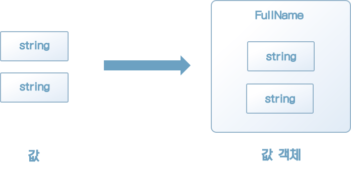
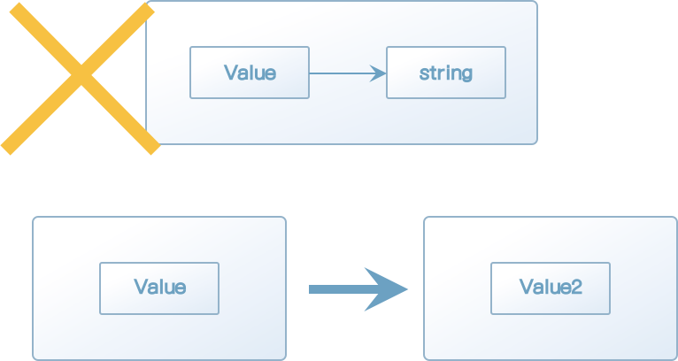

### 2.1 값 객체란?

프로그램 언어에는 원시 데이터 타입이 있다. 이 원시 데이터 타입만 사용해 시스템을 개발할 수도 있지만, 때로는 시스템 특유의 값을 정의해야 할 때가 있다. 이러한 시스템 특유의 값을 표현하기 위해 정의하는 객체를 값 객체라고 한다.

값 객체를 좀 더 확실히 이해하기 위해 우선 짧은 예제 코드를 통해 '값'이 무엇인지 경험해보자. 리스트 2-1의 코드를 보자.

[리스트 2-1] 원시 데이터 타입이 값으로 '성명' 나타내기

```java
String fullName = "naruse mananobu";
System.out.println(fullName); // naruse mananobu라는 값을 출력

프로그램 언어에는 원시 데이터 타입이 있다. 이 원시 데이터 타입만 사용해 시스템을 개발할 수도 있지만, 때로는 시스템 특유의 값을 정의해야 할 때가 있다. 이러한 시스템 특유의 값을 표현하기 위해 정의하는 객체를 값 객체라고 한다.
```

fullName은 문자열 타입의 값을 저장하는 변수로 '이름'을 나타낸다. 위의 프로그램을 실행하면 콘솔에 이름이 출력된다.

잠시 성명에 대해 얘기해보자. 시스템마다 다양한 방법으로 이 성명을 다룰 것이다. 예를 들면 우리나라에서는 성명을 성과 이름 순서로 출력하며, 외국이라면 성만 표시하는 시스템도 있을 것이다. 리스트 2-2는 이렇게 서로 다른 요구 사항에 대응하기 위해 변수 fullName을 사용해 성씨만 출력하는 예제다.

[리스트 2-2] 이름 중 성씨만 출력하기

```java
String fullName = "naruse mananobu";
String[] tokens = fullName.split(" "); // ["naruse", "mananobu"]와 같은 배열이 만들어짐
String lastName = tokens[0];
System.out.println(lastName); // naruse가 출력됨
```

이 코드는 우리가 의도한 대로 fullName의 값에서 성씨 부분만 떼어내 출력한다. 조금 번잡스러워 보이기는 해도 어쨌든 fullName 변수가 단순한 문자열 타입이기 때문에 다른 방법이 없다. 다른 곳에서도 성씨만 출력할 일이 생긴다면 이 부분의 로직을 붙여넣으면 되니 문제가 없을 것이다.

과연 정말 그럴까?

이 로직이 제대로 동작하지 않는 상황이 있다. 리스트 2-3의 코드를 살펴보자.

[리스트 2-3] 성씨만 출력할 때 문제가 생기는 경우

```java
String fullName = "john smith";
String[] tokens = fullName.split(" "); // ["john", "smith"]와 같은 배열이 만들어짐
String lastName = tokens[0];
System.out.println(lastName); // john이 출력됨
```

"John smith"씨의 성은 'smith'다. 리스트 2-3은 리스트 2-2에서 성씨를 출력하는 코드르 그대로 사용하는데, 이 코드를 사용하면 실제 성씨인 'smith'가 아닌 'john'이 출력된다. 리스트 2-2의 '성씨를 출력하는 코드'가 제대로 동작하지 않는 것이다. 이는 이름을 쓰는 관습에 따라 성씨가 앞에 오는 경우도 있고 뒤에 오는 경우도 있기 때문이다.

객체지향 프로그래밍에서는 이런 문제를 해결하기 위해 일반적으로 클래스를 사용한다. (리스트 2-4)

[리스트 2-4] 이름을 나타내기 위한 FullName 클래스

```java
@Getter
public class FullName {
    private String firstName;
    private String lastName;

    public FullName(String firstName, String lastName) {
        this.firstName = firstName;
        this.lastName = lastName;
    }
}
```

앞에서는 성명을 문자열 타입을 다뤘지만, 새로 FullName 클래스를 정의했다. 성씨 값이 필요하다면 FullName 클래스의 lastName 프로퍼티를 사용하면 된다(리스트 2-5).

[리스트 2-5] FullName 클래스의 lastName 프로퍼티 사용하기

```java
FullName fullName = new FullName("masanobu", "naruse");
System.out.println(fullName.getLastName()); // naruse가 출력됨
```

변수 fullName은 이름 그대로 성명을 나타내는 객체로, 값을 표현한다.

앞서 본 예제를 통해 시스템에서 필요로 하는 값이 원시 데이터 타입이 아닐 수도 있다는 것을 알았다. 시스템에서 어떤 처리를 해야 하는지에 따라 값을 나타내는 적합한 표현이 정해진다. FullName 클래스는 이 시스템의 필요에 맞는 성명을 나타내는 표현이다(그림 2-1). 객체이기도 하고 동시에 값이기도 하다. 따라서 값 객체라고 부른다. 도메인 주도 설계에서 말하는 값 객체는 이렇듯 시스템 특유의 값을 나타내는 객체다.



[그림 2-1] 시스템 특유의 값


### 2.2 값의 설정과 값 객체 구현

개발자는 '값'을 자주 사용한다. 숫자나 문자, 문자열 등 값에는 여러 종류가 있다. 값에도 일정한 성질이 있다. 값의 이 성질이 값 객체를 이해하는 열쇠다.

물론 '값이 어떤 성질을 갖는지' 매번 따져보며 코드를 작성하지 않는다. 이런 철학적인 생각을 하지 않아도 프로그래밍하는 데는 문제가 없기 때문이다. 값을 너무 당연하게 사용해왔기 때문에 '값의 성질이 무엇인지'에 대해 의문을 품어볼 기회가 거의 없을 것이다.

값의 성질을 아는 것은 값 객체를 이해하기 위해 중요한 사항이다. 여기서 값의 성질에는 어떤 것이 있는지 한번 짚고 넘어가자.

값의 성질로는 대표적으로 다음 세 가지를 꼽을 수 있다.

* 변하지 않는다.
* 주고받을 수 있다.
* 등가성을 비교할 수 있다.

값 객체는 시스템 특유의 값에 대한 표현이며, 값의 한 종류다. 값의 성질은 값 객체에도 그대로 적용된다.

이제 값의 성질을 확인하고 값 객체를 구현하는 방법을 알아보자.


#### 2.2.1 값의 불변성

값은 변화하지 않는 성질을 갖는다. 프로그래밍에서 값을 수정하는 것은 일상적인 일인데, 값이 변화하지 않는다니 모순이 아닌가 하는 생각이 들 것이다. 도대체 이것이 무슨 뜻일까?

리스트 2-7은 값을 수정하는 한 예다.

[리스트 2-7] 값을 수정하는 예

```java
String greet = "안녕하세요";
System.out.println(greet); // 안녕하세요가 출력됨
greet = "Hello";
System.out.println(greet); // Hello가 출력됨
```

greet의 값은 처음에는 "안녕하세요"였다가 값을 출력하고 난 다음 "Hello"로 수정됐다. 이렇게 값을 수정할 수 있는데, 값이 변하지 않는다니? 정말로 그런지 천천히 확인해 보자.

우리가 값을 수정할 때는 새로운 값을 대입한다. 사실 대입은 값을 수정하는 과정이 아니다. 대입을 통해 수정되는 것은 변수의 내용이지, 값 자체가 수정되는 것은 아니다.

값은 처음부터 끝까지 변하지 않는다. 값이 변했다면 어떤 일이 일어날까?

실제 코드로 확인해 보자. 리스트 2-8은 값을 수정하는 내용을 담은 의사 코드다.

[리스트 2-8] '값을 수정'하는 의사 코드

```java
String greet = "안녕하세요";
greet.changeTo("Hello"); // 실제로는 이런 메서드가 없다.
System.out.println(greet); // Hello가 출력된다.
```

이렇게 값을 수정할 때 재미있는 일이 일어난다.

```java
"안녕하세요".changeTo("Hello"); // 실제 이런 메서드는 없다.
System.out.println("안녕하세요"); // Hello가 출력된다.
```

변수 greet에는 선언과 동시에 "안녕하세요"라는 값이 대입된다. 그다음 줄에서 greet의 값을 수정한다. greet의 실체는 "안녕하세요"라는 값이므로 이 값이 "Hello"로 수정된다. 리스트 2-8은 말 그대로 '값을 수정'하는 코드다.

리스트 2-8을 봐서는 깨닫기 어렵지만, 이렇게 값을 수정할 때 재미있는 일이 일어난다. 즉 리스트 2-8과 같은 코드가 허용된다면 리스트 2-9와 같은 코드도 가능하다는 말이 된다.

[리스트 2-9] 값이 수정 가능하다는 성질을 이용한 코드

```java
"안녕하세요".changeTo("Hello"); // 실제로는 이런 메서드가 없다.
System.out.println("안녕하세요"); // Hello가 출력된다.
```

changeTo 메서드는 값을 수정하는 역할을 한다. changeTo 메서드를 호출하면 값 자체가 수정되므로 "안녕하세요"가 "Hello"가 되며, 따라서 콘솔에도 "Hello"가 출력된다. 만약 이런 동작이 가능하다면 개발자는 매우 혼란스러울 것이다.

값을 수정할 수 있다면 안심하고 값을 사용할 수 없다. 1이라는 숫자가 갑자기 0이 된다면 얼마나 많은 혼란을 일으키겠는가? 1이라는 숫자는 항상 1이어야 한다. 값은 변하지 않기 때문에 안심하고 사용할 수 있는 것이다.

이제 값이 변하지 않는 것이 미덕이라는 것을 알았으니 다시 리스트 2-10의 코드를 살펴보자.

[리스트 2-10] 일반적으로 볼 수 있는 값 수정

```java
String fullName = new FullName("masanobu", "naruse");
fullName.changeLastName("sato");
```

한 번쯤은 위와 같은 코드를 본 적이 있을 것이다. 이 코드는 대부분의 개발자에게 자연스럽게 받아들여진다. 그러나 fullName 클래스를 값으로 간주할 경우 부자연스러운 부분이 생긴다. 바로 값이 수정되기 때문이다.

FullName은 시스템 특유의 값을 표현하는 값 객체다. 그러므로 변하지 않아야 한다. FullName 클래스에 값을 수정하는 기능을 제공하는 changeLastName같은 메서드는 정의되어서는 안 된다.


[칼럼] 불변하는 값의 장점

> 소프트웨어를 개발하다 보면 버그와 싸울 일이 많다. 버그의 원인은 다양하지만, 상태의 변화가 그중 하나다.
>
> 객체를 생성하고 메서드에 인자로 넘기니 자기도 모르는 사이에 상태가 수정되어 의도하지 않은 동작은 보이거나 버그를 일으켰다는 이야기는 자주 들었을 것이다.
>
> 상태 변화가 원인인 버그를 방지하는 가장 단순한 방법은 상태가 변화하지 않게 하는 것이다. 모르는 사이에 상태가 바뀌는 것이 문제라면 처음부터 상태가 변화하지 않게 하면 된다. 단순하지만 강력한 방어책이다.
>
> 상태가 변화하지 않게 하는 것은 프로그램을 단순하게 만들 가능성이 있는 제약이다. 예를 들어 병렬 혹은 병행 처리가 일어나는 프로그램에서는 상태가 변화할 수 있는 객체를 어떻게 다뤄야 할지가 과제가 된다. 객체의 상태가 변화하지 않는다면 값이 변하는 상황을 고려할 필요가 없기 때문에 병렬 및 병행 처리를 비교적 쉽게 구현할 수 있다.
>
> 그 외에 컴퓨터의 메모리가 부족할 때도 객체를 캐싱하는 전략을 취할 수 있다. 객체의 상태가 변화하지 않다면 완전히 같은 상태를 갖는 객체를 여러 개 준비할 필요 없이 하나의 객체를 캐시로 돌려쓸 수 있어 리소스를 절약할 수 있다.
>
> 물론 상태가 변하지 않는 객체의 단점도 있다. 그중 대표적인 것은 객체의 일부 값만 바꾸고 싶을 때도 객체를 아예 새로 생성해야 한다는 점이다. 이 점은 상태가 변할 수 있는 객체에 비해 성능 면에서 불리하기 때문에 아주 심각한 상황이 아니고서야 값 객체라도 상태를 바꿀 수 있게 하는 전략을 취하기도 한다.
>
> 하지만 가변 객체를 불편 객체로 바꾸는 것보다는 불편 객체를 가변 객체로 만드는 것이 노력이 적게 들기 때문에 가변 객체와 불변 객체 중 결정을 내리기가 어려울 때는 일단 불편 객체를 적용하는 것이 낫다.


#### 2.2.2 교환 가능하다.

값은 불변이다. 그러나 값을 수정하지 않고서도 목적을 달성할 수 있는 소프트웨어를 만들기는 어렵다. 값은 불변일지라도 값을 수정할 필요는 있다. 모순처럼 들리지만, 코딩을 할 때 이런 사항은 고민하지 않는다. 우리가 평소에 값을 수정하는 방식을 살펴보자(리스트 2-11).

[리스트 2-11] 평소에 우리가 값을 수정하는 방법

```java
// 숫자값 수정
int num = 0;
num = 1;

// 문자값 수정
char c = '0';
c = 'b';

// 문자열 수정
String greet = "안녕하세요";
greet = "hello";
```

리스트 2-11의 코드는 모두 변수에 값을 대입하는 코드다. 즉, 대입문 자체가 값의 수정을 나타내는 방법이라는 뜻이다(리스트 2-12).

'변하지 않는'성질을 갖는 값 자체를 수정할 수 없다. 이것은 값 객체 또한 마찬가지다. 값 객체의 수정 역시 값과 마찬가지로 대입문을 통해 교환의 형식으로 표현된다.

[리스트 2-12] 값 객체를 수정하는 방법

```java
FullName fullName = new FullName("masanobu", "naruse");
fullName = new FullName("masanobu", "sato");
```

리스트 2-12에서도 값을 수정하는 데 대입문이 사용된 것을 볼 수 있다. 값 객체는 불변이기 때문에 대입문을 통한 교환 외에 수단으로 수정을 나타낼 수 없다(그림 2-2).




[그림 2-2] 교환 외의 수단으로는 수정을 나타낼 수 없다.


#### 2.2.3 등가성 비교 가능

리스트 2-13에서 보듯이, 숫자끼리 혹은 문자끼리 처럼 같은 종류의 값끼리는 비교할 수 있다.

[리스트 2-13] 같은 종류의 값끼리 비교하기

```java
System.out.println(0 == 0); // true
System.out.println(0 == 1); // false
System.out.println('a' == 'a'); // true
System.out.println('a' == 'b'); // false
System.out.println("hello" == "hello"); // true
System.out.println("hello" == "안녕하세요"); // false
```

예를 들어 표현식 0==0에서 좌변의 0과 우변의 0은 인스턴스로서는 별개의 존재지만, 값은 값으로 취급된다. 이것이 의미하는 바는 값은 값 자신이 아니라 값을 구성하는 속성을 통해 비교된다는 점이다. 시스템 고유의 값인 값 객체도 이와 마찬가지로 값 객체를 구성하는 속성(인스턴스 변수)을 통해 비교된다(리스트 2-14).


[리스트 2-14] 값 객체 간의 비교

```java
FullName nameA = new FullName("masanobu", "naruse");
FullName nameB = new FullName("masanobu", "naruse");

// 두 인스턴스를 비교
System.out.println(nameA.equals(nameB)); // 인스턴스를 구성하는 속성이 같으므로 true
```

그러나 객체끼리의 비교에서 리스트 2-15에서 보듯이 속성값을 꺼내 직접 비교하는 경우가 있다.

[리스트 2-15] 속성값을 꺼내 직접 비교하기

```java
FullName nameA = new FullName("masanobu", "naruse");
FullName nameB = new FullName("john", "smith");

boolean compareResult = nameA.getFirstName() == nameB.getFirstName()
  && nameA.getLastName() == nameB.getLastName();
System.out.println(compareResult);
```

실행 가능한 모듈이라는 면에서 이 코드는 틀린 점이 없으며 언뜻 보면 자연스럽게 보인다. 그러나 FullName 객체가 값이라는 사실을 생각하면 부자연스러운 코드다. 숫자로 예를 들어 리스트 2-15와 같은 방식으로 비교한다면 다음과 같을 것이다.

[리스트 2-16] 속성을 꺼내 직접 비교하는 방식을 숫자에 적용한 코드

```java
System.out.println(1.value == 0.value); // false ?
```

대개 리스트 2-16과 같은 코드는 본 적이 없을 것이다. 값의 값(Value)을 꺼낸다니 아무리 생각해도 자연스럽지 못하다.

값 객체는 시스템 고유의 값이다. 결국 값이다. 따라서 값의 속성을 꺼내 비교하는 것이 아니라, 값과 마찬가지로 직접 값끼리 비교하는 방식이 자연스럽다(리스트 2-17).

[리스트 2-17] 값끼리 직접 비교하기

```java
FullName nameA = new FullName("masanobu", "naruse");
FullName nameB = new FullName("john", "smith");

boolean compareResult = nameA.equals(nameB);
System.out.println(compareResult);

// 연산자들 오버라이드를 활용할 수도 있다.
boolean compareResult2 = nameA == nameB;
System.out.println(compareResult2);
```

이렇게 자연스러운 코드를 사용하려면 값 객체를 비교하는 메서드를 제공해야 한다.

[리스트 2-18] 비교 메소드를 제공하는 FullName 클래스

```java
@Getter
public class FullName {
    private String firstName;
    private String lastName;

    public FullName(String firstName, String lastName) {
        this.firstName = firstName;
        this.lastName = lastName;
    }

    public static void main(String[] args) {
        FullName fullName = new FullName("masanobu", "naruse");
        System.out.println(fullName.getLastName()); // naruse가 출력됨
    }

    @Override
    public boolean equals(Object o) {
        if (this == o) return true;
        if (o == null || getClass() != o.getClass()) return false;
        FullName fullName = (FullName) o;
        return Objects.equals(firstName, fullName.firstName) &&
                Objects.equals(lastName, fullName.lastName);
    }

    @Override
    public int hashCode() {
        return Objects.hash(firstName, lastName);
    }
}
```

위 코드는 java에서 비교를 구현하는 전형적인 코드다. 두 값 객체를 비교하려면 값 객체의 속성을 꺼내 비교하는 대신 equals 메서드를 쓰면 된다. 이런 방법으로 값 객체도 값과 같은 방법으로 비교할 수 있다.

'객체를 비교하는 코드를 자연스럽게' 만든다는 목적만으로 이만큼의 코드를 작성하는 게 찜찜할 수도 있다. 그러나 안심해도 된다. 이 방법은 코드가 자연스러워지는 것 말고도 명확한 장점이 있다. 값 객체에 인스턴스 변수를 추가할 때 이 장점을 알 수 있을 것이다.


###### 속성을 추가해도 수정이 필요 없다

성과 이름 사이에 미들네임이 있는 경우가 있다. 이 미들네임을 표현하기 위해 FullName 클래스에 속성을 추가해야 하는 상황을 생각해 보자.

값 객체에 비교를 위한 메서드가 없어서 코드에서 속성을 직접 꺼내 비교해야 할 경우, 새로 추가된 속성이 생겼을 때 비교하는 코드를 모두 수정해야 한다(리스트 2-19).

[리스트 2-19] 속성을 직접 비교할 경우 새로운 속성 추가하기

```java
boolean compareResult = nameA.getFirstName() == nameB.getFirstName()
  && nameA.getLastName() == nameB.getLastName()
  && nameA.getMiddleName() == nameB.getMiddleName()
```

이 정도 수정이라면 간단하다고 생각할지도 모르겠다. 하지만 FullName 객체를 비교하는 곳이 여기뿐일까? 이 외에도 FullName 객체를 비교하는 곳이 여기뿐일까? 이 외에도 FullName 객체를 비교하는 코드가 프로그램 여러 곳에 있다면?

한곳을 수정하기는 쉽지만, 개수가 누적되면 수정 난도도 크게 상승한다. 리스트 2-19와 같이 코드가 작성된 곳을 모두 찾아 실수 없이 모두 수정하려면 매우 번거롭고 신경이 쓰일 것이다. 

값 객체에서 직접 비교수단을 제공하면 이렇게 단순하기 지루한 작업을 피할 수 있다(리스트 2-20).

[리스트 2-20] 비교수단을 객체에서 제공할 경우 새로운 속성 추가하기

```java
@Getter
public class FullName {
    ...

    @Override
    public boolean equals(Object o) {
        if (this == o) return true;
        if (o == null || getClass() != o.getClass()) return false;
        FullName fullName = (FullName) o;
        return Objects.equals(firstName, fullName.firstName) &&
                Objects.equals(lastName, fullName.lastName);
                Objects.equals(middleName, fullName.middleName);
    }
}
```

FullName 객체를 비교하려면 equals 메서드만 호출하면 된다. 따라서 값 객체에 새로운 속성이 추가돼도 수정할 곳은 equals 메서드 내부로 제한된다. 비교 뿐만 아니라, 값의 속성을 다루는 처리 역시 값 객체에서 제공하게 하면 수정할 곳을 줄일 수 있다.


### 2.3 값 객체가 되기 위한 기준

FullName 클래스를 구성하는 firstName이나 lastName 등의 속성은 값 객체가 아니라 원시 타입인 문자열로 정의돼 있다. 사실 시스템에서 사용되는 개념 중 어디까지 값 객체로 만들어야 하는가도 어려운 문제다. 단순히 도메인 모델로 정의되는 개념은 값 객체로 정의할 수 있지만, 그렇지 않은 경우에는 혼란을 낳는다.

예를 들어 리스트 2-21의 코드는 가능한 한 모든 속성을 값 객체로 만든 FullName 클래스다.

[리스트 2-21] 가능한 모든 속성을 값 객체로 갖는 FullName 클래스

```java
public class FullName
{
    private final FirstName firstName;
    private final LastName lastName;

    public FullName(FirstName firstName, LastName lastName) {
        this.firstName = firstName;
        this.lastName = lastName;
    }
  
  	(...생략...)
}
```

생성자 메서드에 전달되는 인자는 값 객체다(리스트 2-22, 2-23).

[리스트 2-22] 이름을 나타내는 값 객체

```java
public class FirstName
{
    private String value;

    public FirstName(String value) {
        if (StringUtils.isEmpty(value)) {
            throw new IllegalArgumentException("최소 1글자 이상이어야 함: " + value);
        }

        this.value = value;
    }

}
```

[리스트 2-23] 성을 나타내는 값 객체

```java
public class LastName
{
    private String value;

    public LastName(String value) {
        if (StringUtils.isEmpty(value)) {
            throw new IllegalArgumentException("최소 1글자 이상이어야 함: " + value);
        }

        this.value = value;
    }
}
```

이 코드를 보고 정도가 '지나치다'고 보는 사람도 있는가 하면, '괜찮다'고 보는 사람도 있다. 이 코드가 적당한지에 대한 기준은 상황에 따라 달라지기 때문이다. 어느 한쪽이 항상 옳은 것도 아니고, 다른 쪽이 항상 틀린 것도 아니다.

하지만 '판단기준이 있었으면 좋겠다' 싶은 마음도 이해할 수 있다. 그래서 참고를 위해 필자의 개인적인 기준을 언급하겠다.

도메인 모델로 선정되지 못한 개념을 값 객체로 정의해야 할지에 대한 기준으로 필자는 '규칙이 존재하는가'와 '낱개로 다루어야 하는가'라는 점을 중요하게 본다.

성명을 예로 들면, '성과 이름으로 구성된다'는 규칙이 있다. 또 앞서 본문에서 봤듯이 '낱개로 다뤄지는' 정보다. 필자의 판단기준에 비춰보면 성명은 값 객체로 정의해야 할 개념이 된다.

성 혹은 이름은 어떻게 될까? 현재로서는 시스템상에 성과 이름에 대한 제한은 없다. 성만 사용하거나 이름만 사용하는 화면도 아직은 없다. 필자라면 성과 이름을 값 객체로 만들지는 않을 것이다.

전제를 살짝 바꿔서 만약 성과 이름에서 사용 가능한 문자에 제약이 있다면 어떻게 될까? 결론부터 말하자면 값 객체로 정의하지 않고도 규칙을 강제할 수 있다(리스트 2-24).

[리스트 2-24] FullName에 규칙을 추가하기

```java
public class FullName {
    private final String firstName;
    private final String lastName;

    public FullName(String firstName, String lastName) {
        if (firstName == null)
            throw new IllegalArgumentException("firstName: " + firstName);
        if (lastName == null)
            throw new IllegalArgumentException("lastName: " + lastName);
        if (!validateName(firstName))
            throw new IllegalArgumentException("lastName: " + lastName);
        if (!validateName(lastName))
            throw new IllegalArgumentException("lastName: " + lastName);

        this.firstName = firstName;
        this.lastName = lastName;
    }
  
  	public boolean validateName(String value) {
        return value.matches("^[a-zA-Z]+$");
    }
  
  	(...생략...)
}
```

리스트 2-24의 FullName 클래스처럼 속성이 원시 타입이어도 인자를 전달받은 시점에 검사를 하면 규칙을 강제할 수 있다.

물론 값 객체로 정의해도 문제는 없다. 속성을 값 객체로 만들기로 했다면 그다음에 생각해야 할 것은 성과 이름을 별도의 타입으로 나눌지 말지다. 성과 이름을 따로 다룰 필요가 없다면 하나의 타입으로 다룰 수도 있다.

[리스트 2-25] 이름을 나타내는 클래스

```java
public class Name {
    private final String value;

    public Name(String value) {
        if (value == null)
            throw new IllegalArgumentException("value: " + value);
        if (!value.matches("^[a-zA-Z]+$"))
            throw new IllegalArgumentException("허가되지 않은 문자가 사용됨: " + value);

        this.value = value;
    }
}
```

[리스트 2-26] Name 클래스를 이용해 구현한 FullName 클래스

```java
public class FullName
{
    private final Name firstName;
    private final Name lastName;

    public FullName(Name firstName, Name lastName) {
        if (firstName == null)
            throw new IllegalArgumentException("firstName: " + firstName);
        if (lastName == null)
            throw new IllegalArgumentException("lastName: " + lastName);

        this.firstName = firstName;
        this.lastName = lastName;
    }
  
  	(...생략...)
}
```

중요한 것은 값 객체 정의를 피하는 것이 아니다. 값 객체로 정의할 필요가 있는지를 판단하고, 만약 그렇다면 대담하게 행동으로 옮기는 것이 중요하다.

그리고 값 객체로 정의할 만한 가치가 있는 개념을 구현 중에 발견했다면 그 개념은 도메인 모델로 피드백해야 한다. 도메인 주도 설계의 목적인 반복적 개발은 이렇게 구현 중에 발견된 새로운 사실을 통해 이루어진다.


### 2.4 행동이 정의된 값 객체

값 객체에서 중요한 점 중 하나는 독자적인 행위를 정의할 수 있다는 점이다. 돈을 나타내는 돈 객체를 예로 생각해보자.

돈에는 액수와 화폐 단위(원 혹은 달러). 이렇게 2가지 속성이 있다. 이를 리스트 2-27과 같이 값 객체로 정의할 수 있다.

[리스트 2-27] 액수와 화폐 단위를 속성으로 하는 돈 객체

```java
public class Money {
    private BigDecimal amount;
    private String currency;

    public Money(BigDecimal amount, String currency) {
        if (currency == null)
            throw new IllegalArgumentException(currency);

        this.amount = amount;
        this.currency = currency;
    }
}
```
값 객체는 데이터만으로 저장하는 컨테이너가 아니라 행동을 가질 수도 있는 객체다. 실제로 행동을 추가해 보자.

돈은 덧셈이 가능하다. 돈의 덧셈을 add 메서드로 구현해 보자(리스트 2-28).

[리스트 2-28] 금액을 더하는 처리를 구현하기

```java
public class Money {
    private BigDecimal amount;
    private String currency;

    (...생략...)

    public Money add(Money arg) {
        if (arg == null)
            throw new IllegalArgumentException("arg : " + arg);
        if (currency != arg.currency)
            throw new IllegalArgumentException("화폐 단위가 다름: " + currency + ", " + arg.currency);

        return new Money(amount.add(arg.getAmount()), currency);
    }
}
```
돈을 더하려면 화폐 단위가 일치해야 한다. 그러므로 화폐 단위가 같은지 확인한다. 또 값 객체는 불변이므로 계산된 결과는 새로운 인스턴스로 반환된다.

덧셈의 결과를 받으면 변수에 대입한다. 리스트 2-28의 코드를 이용해 덧셈을 처리하는 코드가 리스트 2-29다.

[리스트 2-29] 계산 결과 받기

```java
Money myMoney = new Money(new BigDecimal(1000), "KRW");
Money allowance = new Money(new BigDecimal(3000), "KRW");
Money result = myMoney.add(allowance);
```

이것은 원시 타입끼리의 계산과 같은 방식이다(리스트 2-30).

[리스트 2-30] 원시 타입끼리의 덧셈

```java
BigDecimal myMoney = new BigDecimal(1000);
BigDecimal allowance = new BigDecimal(3000);
BigDecimal result = myMoney.add(allowance);
```

화폐 단위가 일치하지 않는 경우에는 예외를 발생시키므로 잘못된 계산을 예방할 수도 있다.

[리스트 2-31]

```java
Money krw = new Money(new BigDecimal(1000), "KRW");
Money usd = new Money(new BigDecimal(10), "USD");
Money result = krw.add(usd); // 예외 발생
```

버그는 착각에서 발생하는 경우가 많다. 계산 과정에서 규칙을 명시하고 이에 어긋나지 않게 따져가며 계산을 수행하며 규칙적인 오류를 방지할 수 있다면 이를 활용하는 것이 좋다.

값 객체는 결코 데이터를 담는 것만이 목적인 구조체가 아니다. 값 객체는 데이터와 더불어 그 데이터에 대한 행동을 한곳에 모아둠으로써 자신만의 규칙을 갖는 도메인 객체가 된다.


#### 2.4.1 정의되지 않았기 때문에 알 수 있는 것

객체에 정의된 행위를 통해 이 객체가 어떤 일을 할 수 있는지 알 수 있다. 이를 반대로 생각하면 객체는 자신에게 정의되지 않은 행위는 할 수 없다는 말도 된다.

다시 돈을 예를 들어보면, 돈을 나타내는 값 객체끼리 덧셈을 할 수 있지만, 곱셈은 불가능하다. 즉, '100원 + 100원 = 200원'은 가능해도 '100원 * 100원 = 10,000원'은 가능하지 않다.

돈에 곱셈이 필요한 경우라면 금리를 계산할 때 정도일 것이다. 금리를 계산하기 위한 시그니처라면 리스트 2-32와 같은 코드를 생각해 볼 수 있다.

[리스트 2-32] 금액을 곱하는 행위

```java
class Money {
  	(...생략...)
  
  	public Money multiply(Rate rate);
		// public Money multiply(Money money)은 정의하지 않음
}
```

돈 객체끼리의 곱셈은 정의되지 않았으므로 묵시적으로 곱셈이 가능하지 않음을 알 수 있다.


### 2.5 값 객체를 도입했을 때의 장점

당연한 일이지만 시스템 고유의 값을 객체로 나타내면 그만큼 정의하는 클래스의 수도 늘어난다. 원시 타입 값을 '잘 활용하는' 방법으로 개발해왔기 때문에 많은 수의 클래스를 정의하는 것을 껄끄러워하는 개발자도 많다.

원래대로라면 모듈성을 위해 코드를 적절한 크기로 나누고 분산시켜 정의 해야겠지만, 이런 것에 신경 쓰지 않는 프로젝트도 많다. 이런 상황에 처한 개발자는 값 객체를 도입해 많은 수의 클래스 파일을 만들기 어렵다. 무엇이든 처음은 어렵게 마련이다. 값 객체를 도입하려면 여기에 따르는 심리적 장애물을 넘어야 한다.

바로 이 최초의 벽을 넘기 위한 용기를 내는 데 도움이 되도록 값 객체를 도입했을 때의 장점을 소개하고자 한다. 어떤 이유로 값 객체가 필요한지 이해한다면 좀 더 많은 사람이 값 객체의 필요성을 느끼고 프로젝트에 도임하게 될 것이다.

값 객체의 장점은 크게 다음 네 가지다.

* 표현력이 증가한다.
* 무결성이 유지된다.
* 잘못된 대입을 방지한다.
* 로직이 코드 이곳저곳에 흩어지는 것을 방지한다.

네 가지 모두 간단하지만, 시스템을 보호하는 데는 크게 도움이 된다.


#### 2.5.1 표현력의 증가

공산품에는 로트 번호나 일련번호, 제품번호 등 식별을 위한 다양한 번호가 부여된다. 이들 번호는 숫자만으로 구성되기도 하고 알파벳이 섞인 문자열 형태도 있다. 제품번호를 원시 타입으로 나타낸 프로그램은 어떨까(리스트 2-33)?

[리스트 2-33] 원시 타입으로 정의된 제품번호

```java
String modelNumber = "a20421-100-1";
```

modelNumber는 원시 타입인 문자열 타입의 변수다. 대입된 값을 직접 확인해 보면 제품번호가 3종류의 번호로 구성돼 있음을 알 수 있다. 그러나 코드상에서 갑자기 modelNumber라는 변수를 맞닥뜨리게 되면 제품번호의 내용이 어떤 것인지 예측하기 어렵다(리스트 2-34).

[리스트 2-34] 제품번호의 내용을 알 수 없다

```java
void method(String modelNumber) { // 타입이 문자열이라는 것만 알 수 있다.
  	(...생략...)
}
```

제품번호의 내용을 알려면 modelNumber 변수가 어디서 만들어져 어떻게 전달됐는지 따라가 보는 수밖에 없다.

제품번호를 나타내는 값 객체를 사용했다면 어땠을까(리스트 2-35)?

[리스트 2-35] 제품번호를 나타내는 값 객체

```java
public class ModelNumber {
    private String productCode;
    private String branch;
    private String lot;

    public ModelNumber(String productCode, String branch, String lot) {
        if (productCode == null)
            throw new IllegalArgumentException("productCode: " + productCode);
        if (branch == null)
            throw new IllegalArgumentException("branch: " + branch);
        if (lot == null)
            throw new IllegalArgumentException("lot: " + lot);

        this.productCode = productCode;
        this.branch = branch;
        this.lot = lot;
    }

    public String toString() {
        return productCode + "-" + branch + "-" + lot;
    }
}
```

ModelNumber 클래스의 정의를 살펴보면 제품번호가 제품코드(productCode)와 지점번호(branch), 로트번호(lot)로 구성됨을 알 수 있다. 아무 정보를 제공하지 않는 문자열과 비교하면 큰 진보다.

값 객체는 자기 정의를 통해 자신이 무엇인지에 대한 정보를 제공하는 자기 문서화를 돕는다.


#### 2.5.2 무결성 유지

시스템에는 각 값이 준수해야 할 규칙이 있다. 사용자명을 예로 들어보자.

사용자명은 간단히 말하면 문자열이다. 그러나 시스템에 따라서 'N글자 이상 M글자 이하'와 같은 제한이나 '알파벳 문자만을 포함할 것'과 같은 규칙이 있을 수 있다.

'사용자명은 세 글자 이상일 것'이라는 규칙이 있다면 리스트 2-36의 코드는 바른 코드라고 할 수 있을까?

[리스트 2-36] 존재할 수 없는 값의 예

```java
String userName = "me";
```

사용자명을 의미하는 변수 userName은 길이가 2인 문자열이다. 그러므로 '사용자명은 세 글자 이상일 것'이라는 규칙을 위반하는 이상값이다. 그러나 프로그램상에 길이가 2인 문자열이 존재하는 데는 아무런 문제가 없다. 컴파일러의 관점에서 길이가 2인 문자열이 정상인 것은 당연한 일이고 프로그램을 실행해도 문제없이 동작한다. 따라서 세 글자 이하로 유효하지 않은 사용자명임에도 이 값이 존재할 수 있다.

유효하지 않은 값은 효과가 늦게 나타나는 독과 같이 다루기 까다로운 상태다. 유효하지 않은 값을 허용하는 경우 값을 사용할 때 값이 항상 유효한지 확인을 거쳐야 한다.

[리스트 2-37] 값을 사용하기 전 값이 유효한지 확인하기

```java
if (userName.length() >= 3) {
  // 유효한 값으로 처리를 계속한다.
} else {
  throw new IllegalArgumentException("유효하지 않은 값");
}
```

값의 유효성을 매번 확인하면 급한 불을 끌 수 있지만, 그로 인해 코드 여기저기에 유효성을 검사하는 코드가 반복될 것이다. 유효성 검사를 위한 코드를 여기저기 반복적으로 작성하는 것은 귀찮기도 하고 한곳이라도 잘못되면 시스템 오류로 이어질 수 있다.

값 객체를 잘 이용하면 유효하지 않은 값을 처음부터 방지할 수 있다. 리스트 2-38의 UserName 클래스는 사용자명을 나타내는 값 객체다.

[리스트 2-38] 사용자명을 나타내는 값 객체

```java
public class UserName {
    private String value;

    public UserName(String value) {
        if (value == null)
            throw new IllegalArgumentException("value : " + value);
        if (value.length() < 3)
            throw new IllegalArgumentException("사용자명은 3글자 이상어야함: " + value);
        this.value = value;
    }
}
```

UserName 클래스는 방어 코드를 통해 길이가 세 글자 미만인 사용자명을 허용하지 않는다. 시스템상 유효하지 않은 값은 이런 방식의 확인을 거쳐 허용하지 않는 것이다. 결과적으로 규칙을 위반하는 유효하지 않은 값을 걱정할 필요가 없다.


#### 2.5.3 잘못된 대입 방지하기

대입문을 잘못 사용한 적이 있는가? 대입은 코드에서 매우 자주 사용되는 문법으로, 개발자라면 일상적으로 사용할 것이다. 그만큼 일상적인 행위이기 때문에 개발자도 가끔(혹은 자주) 대입문을 잘못 사용하는 경우가 있다.

리스트 3-29에 실린 간단한 대입문을 예로 들어보자.

[리스트 2-39] 간단한 대입문의 예

```java
User createUser(String name) {
	  User user = new User();
	  user.setId(name);
	  return user;
}
```

위의 코드를 보면 User클래스의 id 속성에 인자로 전달한 name의 값을 대입했다. 이 코드는 실행에는 문제가 없겠지만 올바른 코드라고 할 수 없다.

사용자의 ID는 시스템에 따라 다르다. 사용자명이 그대로 ID인 경우도 있고, 이메일 주소처럼 별도의 값을 ID로 삼는 경우도 있다. 전자라면 리스트 2-39의 코드는 올바른 코드가 될 것이고, 후자라면 바르지 못한 코드가 된다. 컨텍스트가 없이는 이 코드가 올바른 코드인지 판단하기 어렵다. 이를 판단하려면 시스템의 동작 명세를 깊이 파악해야 한다.

코드가 올바른지 아닌지를 판단하기 위해 관계자의 기억이나 문서를 뒤지는 것보다는 자기 문서화의 힘을 빌리는 것이 바람직하다. 코드가 올바른지 아닌지를 코드로 나타낼 수 있다면 그보다 더 나은 방법은 없다. 값 객체를 통해 이를 실현할 수 있다. 값 객체를 실제로 적용해 보자.

우선 값 객체가 있어야 한다. 사용자 ID와 사용자명을 나타내는 값 객체를 각각 정의한다(리스트 2-40, 2-41).

[리스트 2-40] 사용자 ID를 나타내는 값 객체

```java
public class UserId {
    private final String value;

    public UserId(String value) {
        if (value == null)
            throw new IllegalArgumentException("value : " + value);
      
        this.value = value;
    }
}
```

[리스트 2-41] 사용자명을 나타내는 값 객체

```java
public class UserName {
    private final String value;

    public UserName(String value) {
        if (value == null)
            throw new IllegalArgumentException("value : " + value);
      
        this.value = value;
    }
}
```

UserId와 UserName 클래스는 각각 원시 타입인 문자열을 래핑한 단순한 객체다. 행동은 아직 정의되지 않았지만, 지금 다루는 문제를 해결하기에는 이 정도면 충분한다.

이제 User 객체의 속성 타입을 이들 값 객체로 수정하자(리스트 2-42).

[리스트 2-42] 값 객체를 사용하도록 수정된 User 클래스

```java
@Getter
@Setter
public class User {
    private UserId id;
    private UserName name;
}
```

이제 리스트 2-39의 코드를 수정할 차례다. 함수의 인자로 문자열이 아닌 UserName 객체를 전달받게 한다(리스트 2-43).

[리스트 2-43] 원시 타입 대신 값 객체를 사용한 예

```java
User createUser(UserName name) {
	  User user = new User();
	  user.setId(name); // 컴파일 에러 발생
	  return user;
}
```

User 클래스의 id 속성은 UserId 타입의 값 객체다. 여기에 대입을 시도한 name은 UserName 타입의 변수다. 컴파일러는 대입문에서 타입 불일치를 발견해 에러를 발생시킨다. 리스트 2-43의 코드는 잘못된 코드일 경우 컴파일러가 에러를 검출해준다.

숨어있는 에러가 발생한 곳을 예측하기는 어렵다. 에러를 실행 전이나 실행 후에 발견하는 것을 선택하라면 실행 전에 발견하는 것이 낫다. 값 객체를 정의해 타입 시스템에서 의존하면 예측하기 어려운 에러가 숨을 곳을 줄일 수 있다.

정적 타이핑 프로그래밍 언어를 사용한다면 이 특성을 적극적으로 활용하기 바란다. 또 정적 타이핑 프로그래밍 언어가 아니더라도 타입 헌팅 기능 등을 통해 IDE가 에러를 잡아낼 수 있다.


#### 2.5.4 로직을 한곳에 모아두기

DRY 원칙을 밝혔듯이 코드 중복을 방지하는 일은 매우 중요하다. 중복된 코드가 많아지면 코드를 수정하는 난도가 급상승한다.

> DRY: Do not Repeat Yourself의 머리글자를 딴 것이다. 지식을 정리, 정돈하고 중복을 제거해 신뢰할 수 있도록 하자는 주장이다.

예를 들어 값 객체를 적용하지 않은 사용자 생성 처리에는 리스트 2-44와 같이 입력값을 검증하는 과정이 필요하다.

[리스트 2-44] 입력값 검증이 포함된 사용자 생성 처리

```java
void createUser(String name) {
  if (name == null)
    throw new IllegalArgumentException("value : " + name);
  if (name.length() < 3)
    throw new IllegalArgumentException("사용자명은 3글자 이상어야함. value: " + name);
  
  user user = new User(name);
  
  (...생략...)
  
}
```

사용자 정보를 수정하는 부분이 이곳 하나라면 이 코드는 문제가 없다. 그러나 이 외에 사용자 정보를 수정하는 처리가 있다면 어떻게 될까(리스트 2-45).

[리스트 2-45] 사용자 정보 수정 시에도 같은 검증이 필요하다

```java
void updateUser(String id, String name) {
  if (name == null)
    throw new IllegalArgumentException("value : " + name);
  if (name.length() < 3)
    throw new IllegalArgumentException("사용자명은 3글자 이상어야함. value: " + name);

  (...생략...)
}
```

리스트 2-44에 나온 인자를 검증하는 코드가 사용자 정보 수정 시에도 중복된다. 이런 중복 코드의 단점은 규칙이 수정됐을 때 드러난다.

예를 들어 '사용자명의 최소 길이'가 변경된 상황을 가정해 보자. 개발자는 우선 사용자를 신규 생성하는 리스트 2-44의 코드에서 name의 길이를 확인하는 코드를 수정할 것이다. 그다음 사용자 정보 수정에 해당하는 리스트 2-45의 코드에서도 같은 수정을 해야 한다.

아직은 수정할 곳이 두 군데 뿐이니 크게 어려운 일은 아니지만, 그렇게 단순히 치부할 문제는 아니다. 이런 종류의 코드는 이 외에도 시스템 어딘가에 숨어있을 가능성이 있다. 이는 상당한 신중함과 헛된 수고가 들어가는 작업이 될 것이다.

이상을 따지자면 말한 것도 없이 한 곳만 수정하면 되는 상황일 것이다. 값 객체를 정의해 그 안에 규칙을 정리하면 이를 실현할 수 있다(리스트 2-46).

'사용자명 최소 길이'가 변경된 상황에서는 모두 수정해야 한다.

[리스트 2-46] 값 객체 안에 정리된 규칙

```java
public class UserName {
    private final String value;

    public UserName(String value) {
        if (value == null)
            throw new IllegalArgumentException("value : " + value);
        if (value.length() < 3)
            throw new IllegalArgumentException("사용자명은 3글자 이상어야함. value: " + value);
        
        this.value = value;
    }
}
```

이 값 객체를 이용하면 사용자 신규 생성과 사용자 정보 수정 처리를 리스트 2-47과 같이 구현할 수 있다.

[리스트 2-47] 값 객체를 이용해 구현한 사용자 신규 생성과 사용자 정보 수정

```java
void createUser(String name) {
  UserName userName = new UserName(name);
  User user = new User(userName);
  
  (...생략...)
}

void updateUser(String id, String name) {
  UserName userName = new UserName(name);

  (...생략...)
}
```

규칙은 UserName 클래스 안에 기술되어 있으므로 '사용자명의 최소 길이'를 변경할 때 수정할 곳은 UserName 클래스 안으로 국한된다. 규칙을 기술한 코드가 한곳으로 모여 있다면 수정할 곳도 한곳 뿐이라는 의미다. 소프트웨어가 변경을 받아들일 수 있는 유연성을 갖기 위해서는 이러한 작업이 중요하다.


### 2.6 정리

이번 장에서 값 객체의 성질과 값 객체를 사용할 때의 구체적인 장점을 살펴보고 값의 본질에 대해 알아봤다.

값 객체의 개념은 '시스템 고유의 값을 만드는' 단순한 것이다. 시스템에는 해당 시스템에서만 쓰이는 값이 반드시 있기 마련이다. 그러나 원시 타입은 지나치게 범용적이기 때문에 아무래도 표현력이 빈약하다.

도메인에는 다양한 규칙이 포함된다. 값 객체를 정의하면 이러한 규칙을 값 객체 안에 기술해 코드 자체가 문서의 역할을 할 수 있다. 시스템 명세는 일반적으로 문서에 정리되는데, 이때 코드로 규칙을 나타낼 수 있다면 더 나을 것이다. 캐비닛에 쌓인 문서를 끄집어내는 수고를 줄이자면 지속해서 수고를 들여야 한다.

값 객체는 도메인 지식을 코드로 녹여내는 도메인 주도 설계의 기본 패턴이다. 도메인의 개념을 객체로 정의할 때는 우선 값 객체에 적합한 개념인지 검토해 보기 바란다.

다음 장에서는 값 객체와 함께 도메인 주도 설계의 주요 요소인 엔티티를 설명하겠다.

  

  

 