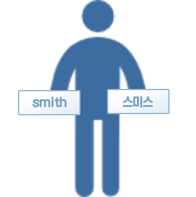
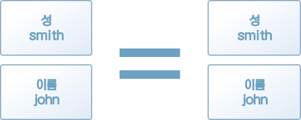
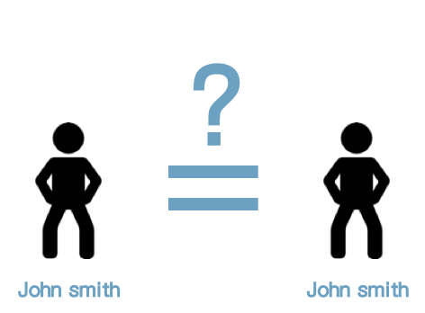
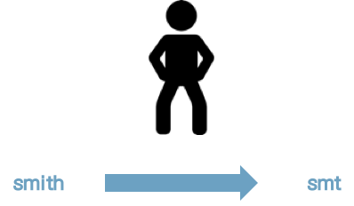
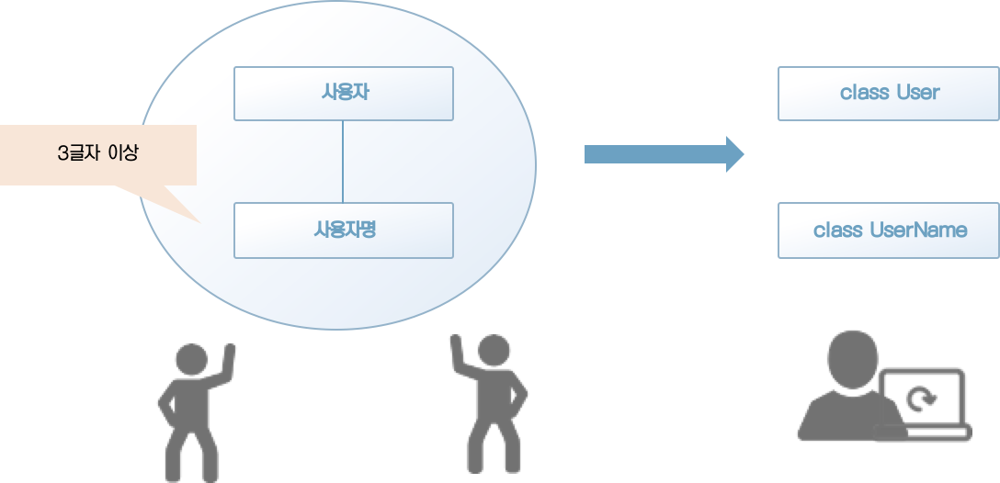
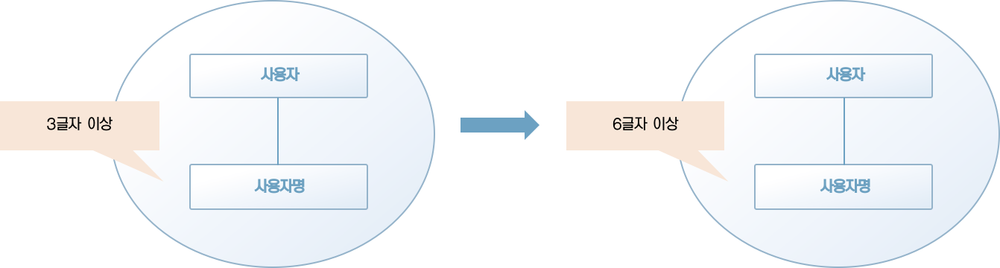

### 3.1 엔티티란?

도메인 주도 개발에서 말하는 엔티티는 도메인 모델을 구현한 도메인 객체를 의미한다. 앞서 2장에서 다룬 값 객체도 도메인 모델을 구현한 도메인 객체다. 이 두 가지 객체의 차이는 동일성을 통해 식별이 가능한지 아닌지에 있다. 동일성이라는 말이 낯설게 느껴질 것이다. 우선은 동일성이 무엇인지부터 알아보자.

사람은 이름, 키, 체중, 취미 등 다양한 속성을 갖는다. 이 속성은 고정된 값이 아니며 여러 가지 요인에 의해 변화한다. 예를 들면 나이는 해마다 생일이 돌아오면 변화하는 속성이다. 여기서 생각해야 할 부분은 생일을 맞은 사람은 생일 전과 후가 서로 다른 사람인가 하는 것이다.

당연하지만 나이를 먹는다고 해서 어떤 사람이 전혀 다른 사람이 되는 일은 없다. 마찬가지로 키와 체중도 늘어나거나 줄기는 하지만, 그렇다고 다른 사람이 되지는 않는다. 이것은 어떤 사람이 그 사람이 되는 이유는 속성과는 무관하며 동일성을 지켜주는 무언가가 있다는 것을 보여준다.

소프트웨어 시스템에서도 마찬가지로 속성으로 구별되지 않는 객체가 있다. 시스템의 사용자가 그 전형적인 예다.

시스템 사용자는 최초 사용자 등록 시에 자신의 개인정보를 사용자 정보로 등록한다. 사용자 정보는 대부분의 경우 임의로 수정할 수 있다. 그러나 사용자 정보로 등록된 데이터가 수정됐다고 해서 해당 사용자가 다른 사용자가 되는 일은 없다. 사용자는 이름이 변경됐다 하더라도 사용자 정보가 수정된 것뿐이지 사용자 자체가 수정된 것이 아니다. 이렇듯 사용자는 속성이 아닌 동일성(identity)으로 식별된다.

소프트웨어 시스템에는 수많은 엔티티가 존재한다. 그야말로 소프트웨어 개발과는 떼려야 뗄수 없는 관계다. 이번 장에서는 값 객체와 쌍벽을 이루는 도메인 객체이자 도메인 주도 설계의 핵심을 담당하는 엔티티에 대해 알아보자.


### 3.2 엔티티의 성질

엔티티는 속성이 아닌 동일성으로 식별되는 객체다. 이와 반대로 동일성이 아닌 속성으로 식별되는 객체도 있다.

예를 들어 성과 이름의 두 가지 속성으로 구성되는 성명은 두 속성 중 어느 한쪽이 수정되면 전혀 다른 존재가 된다. 반대로 속성이 모두 같으면 완전히 같은 것으로 취급된다. 말 그대로 성명은 속성을 통해 식별되는 객체다. 이러한 객체를 뭐라고 부르는지는 이미 앞에서 확인했다. 성명은 '값 객체'다.

엔티티와 값 객체는 모두 도메인 모델을 구현한 도메인 객체라는 점에서 비슷하지만, 성질에는 차이가 있다. 엔티티의 성질은 다음과 같다.

* 가변이다.
* 속성이 같아도 구분할 수 있다.
* 동일성을 통해 구별된다.

엔티티의 성질 중에는 값 객체의 성질과 반대인 것도 있다. 앞으로 설명할 내용은 엔티티와 값 객체의 차이에 주의하며 읽으면 이해하기 쉽다. 값 객체에 대해 이해하지 못한 내용이 있다면 2장으로 돌아가 해당 설명을 확인하고 오기 바란다.


#### 3.2.1 가변이다.

값 객체는 불변성을 갖는 객체였다. 그에 비해 엔티티는 가변성을 갖는 객체다. 사람이 시간이 지남에 따라 나이나 키 등의 속성이 달라지듯이 엔티티의 속성도 변화할 수 있다.

인생에서 이름이 바꾸는 경우는 그리 많지 않지만, 시스템상의 사용자명을 바꾸고 싶은 경우는 그보다 많다. 사용자명 변경을 예로 '가변성'이 무엇인지 알아보자.

리스트 3-1은 사용자를 나타내는 User 클래스다. 현재는 사용자명을 수정할 수 없게 구현돼 있다.

[리스트 3-1] 사용자를 나타내는 클래스

```java
public class User {
    private String name;

    public User(String name) {
        if (name == null)
            throw new IllegalArgumentException("value : " + name);
        if (name.length() < 3)
            throw new IllegalArgumentException("사용자명은 3글자 이상어야함. value: " + name);
      
        this.name = name;
    }
}
```

처음에는 사용자명이 마음에 들었어도 시스템을 이용하다가 나중에 더 나은 사용자명을 떠올릴 수도 있다. 그러나 모처럼 떠올린 마음에 드는 사용자명을 사용할 수 없다면 매우 아쉬운 경험이 될 것이다. 새로 떠올린 사용자명을 사용할 수 있게 User 객체를 가변 객체로 만들어 보자(리스트 3-2).

[리스트 3-2] 가변 객체로 수정된 User 클래스

```java
public class User {
    private String name;

    public User(String name) {
        changeName(name);
    }

    public void changeName(String name) {
        if (name == null)
            throw new IllegalArgumentException("value : " + name);
        if (name.length() < 3)
            throw new IllegalArgumentException("사용자명은 3글자 이상어야함. value: " + name);
      
        this.name = name;
    }
}
```

User 객체는 changeName 메서드를 이용해 이름에 해당하는 속성을 수정할 수 있다. 무미건조한 느낌의 세터 메서드 대신 역할을 잘 나타내는 이름을 가진 메서드를 만들고 방어 코드를 추가해 유효하지 않은 값이 설정되는 것을 막았다.

값 객체는 불변성을 갖기 때문에 객체를 교환(대입)해 수정했지만, 엔티티는 수정을 위해 객체를 교환하지 않는다. 엔티티의 속성을 수정하려면 객체의 행동을 통해 수정하면 된다.



[그림 3.1] 가변 객체

단, 모든 속성이 반드시 가변일 필요는 없다. 엔티티는 필요에 따라 속성을 가변으로 만들 수 있는 객체일 뿐이다. 가변 객체는 기본적으로 다루기 까다로운 존재다. 가능한 한 객체는 불편으로 남겨두는 습관을 들이는 것이 좋다.


[칼럼] 안전망 역할을 하는 유효성 검증

> 모델을 나타낸 객체의 값이 도메인 규칙에 부합하는지는 중요한 문제다. 따라서 도메인 규칙을 위반하는 대상은 제거해야 한다. 앞서 설명한 User 객체는 이를 실제로 구현해 유효하지 않은 값(null이나 최소 길이에 미달하는 사용자명)을 인자로 받으면 예외를 발생시켜 프로그램을 종료한다.
>
> 이 예외는 안전장치로 기능하기 위한 예외다.
>
> 따라서 예외가 발생하는 것을 전제로 해서는 안되며, 유효성 검사를 사전에 마쳐야 한다. 사용자명 수정을 다시 예로 들면, 새로운 사용자명으로 유효하지 않은 값이 전달됐다면 클라이언트 쪽에서 미리 검증한다. 이러한 검증을 통해 '새로운 사용자명에 유효하지 않은 값이 많다'라는 의도를 명확히 할 수 있다.


#### 3.2.2 속성이 같아도 구분할 수 있다.

값 객체는 속성이 같다면 같은 것으로 취급됐다. 이와 달리 엔티티는 속성이 같아도 두 엔티티를 서로 다른 것으로 취급한다. 이러한 성질을 이해하기 위해 값 객체와 어떻게 다른지 확인해 보자.

여기서 예시로 드는 성명을 나타내는 값 객체는 성과 이름의 2개 속성으로 구성된다. 값 객체는 등가성을 통해 비교되므로 성과 이름의 값이 모두 같다면 두 값 객체는 완전히 같은 것으로 취급된다(그림 3-2).



[그림 3-2] 값 객체는 속성이 같다면 같은 것으로 취급한다.


이러한 성질은 이를테면 사람에게는 들어맞지 않는다. 사람에게도 이러한 성질을 적용하면 이름과 성이 같은 사람은 모두 같은 사람이라는 말이 된다(그림 3-3).



[그림 3-3] 성명이 같으면 동일 인물이 된다?


당연하지만 이름이 같다고 같은 사람이 되는 일은 없다. 동명이인이라는 말이 있듯이 성이 같다고 해서 반드시 같은 사람인 것은 아니기 때문이다(그림 3-4).


[그림 3-4] 성명이 같다고 해서 동일 인물은 아니다


사람은 속성만으로 구별하지 않는다. 사람을 구별하는 것은 속성 외의 다른 무언가다. 여기에서 사람이 바로 엔티티로 표현하는 대상이다.

사람은 무엇으로 구별하느냐고 질문한다면 철학적인 질문이 되겠지만, 서로 다른 엔티티를 구별하는 데는 식별자(identity)가 쓰인다.

사람과 마찬가지로 시스템을 사용하는 사용자 또한 등가성이 아닌 동일성을 통해 식별해야 한다. 이제 User 객체에 식별자를 추가해 보자. 다음 코드는 식별자 역할을 하는 UserId가 추가된 User 클래스다.

[리스트 3-4] 식별자가 추가된 사용자 객체

```java
public class UserId {
    private String value;

    public UserId(String value) {
        if (value == null)
            throw new IllegalArgumentException("value: " + value);

        this.value = value;
    }
}
```

```java
public class User {
    private UserId id;
    private String name;

    public User(UserId id, String name) {
        this.id = id;
        changeName(name);
    }

    public void changeName(String name) {
        if (id == null)
            throw new IllegalArgumentException("value : " + id);
        if (name == null)
            throw new IllegalArgumentException("value : " + name);

        this.id = id;
        this.name = name;
    }
}
```

이름이 완전히 같은 두 사용자가 있을 때 두 사용자가 같은 사람인지 아닌지를 이 식별자를 통해 구별한다.


#### 3.2.3 동일성

사용자명을 변경한 경우를 예로 들어 생각해보자(그림 3-5).



[그림 3-5] 사용자명을 변경하는 경우

사용자명 변경 이전의 사용자와 이후의 사용자가 동일한 사용자로 판단돼야 할까, 아니면 다른 사용자로 판단돼야 할까? 

대부분의 시스템에서는 사용자명이 변경되어도 변경 이전과 이후의 사용자를 같은 사용자로 인식해야 할 것이다. 사용자에는 동일성이 있다.

객체 중에도 속성이 달라지더라도 같은 대상으로 판단해야 하는 것들이 있다. 이들은 모두 동일성을 통해 식별되는 객체다.

물론 프로그램은 사용자가 동일한지 판단할 수 없으므로 동일성을 판단할 수단이 필요하다. 그 수단으로 식별자가 사용된다(리스트 3-5).

[리스트 3-5] 동일성을 판단하는 식별자를 추가한다

```java
public class User {
    private final UserId id; // 식별자
    private String name;

    public User(UserId id, String name) {
        this.id = id;
        changeName(name);
    }

    public void changeName(String name) {
        if (name == null)
            throw new IllegalArgumentException("value : " + name);
				if (name.length() < 3)
            throw new IllegalArgumentException("사용자명은 3글자 이상이어야 함: " + name);
		

        this.name = name;
    }
}
```

식별자는 동일성의 실체다. 그러므로 식별자를 가변으로 할 필요는 없다. java에서는 final 한정자를 이용해 이 변수에 대한 재대입을 금지하는 방법으로 인스턴스가 생성된 이후에도 ID가 변화하지 않게 한다.

이렇게 정의한 식별자는 필드 상태로 저장하는 것만으로는 의미가 없다. 동일성을 비교하는 행위가 따로 정의돼야 한다. 리스트 3-4에 나오는 equals 메소드가 비교 행위의 전형적인 구현 예다.

[리스트 3-6] 비교 행위의 구현 예

```java
public class User {
    private UserId id;
    private String name;

	  ... (생략)
      
    @Override
    public boolean equals(Object o) {
        if (this == o) return true;
        if (o == null || getClass() != o.getClass()) return false;
        User user = (User) o;
        return id.equals(user.id);
    }

    @Override
    public int hashCode() {
        return Objects.hash(id);
    }
}
```

2장에서 소개한 값 객체는 모든 속성이 비교 대상이었지만, 엔티티 비교는 동일성을 나타내는 식별자(id)만을 대상으로 한다. 이런 방법으로 엔티티는 속성의 차이와 상관없이 동일성을 비교할 수 있다(리스트 3-7).

[리스트 3-7] 엔티티를 비교하는 방법

```java
void check(User leftUser, User rightUser) {
    if (leftUser.equals(rightUser)) {
        System.out.println("동일한 사용자임");
    }
}
```


### 3.3 엔티티 판단 기준 - 생애주기와 연속성

값 객체와 엔티티는 모두 도메인 개념을 나타내는 객체로서 서로 유사한 점이 많다. 그렇다면 어떤 값을 값 객체로 정의하고 어떤 값을 엔티티로 정의할 것인지 판단 기준이 필요할 것이다. 여기에는 생애주기의 존재 여부와 그 생애주기의 연속성 여부가 중요한 판단 기준이 된다.

지금까지 예로 들어왔던 사용자 개념에는 생애주기가 있을까?

사용자는 시스템을 이용하려는 사람에 의해 생성된다. 시스템을 이용하는 중에 사용자명을 변경하는 경우도 있을 것이다. 이렇게 시간이 흘러 시스템을 더이상 이용할 필요가 없게 되면 사용자를 삭제한다.

사용자를 생성하면 동시에 태어나 삭제와 함께 죽음을 맞는다. 사용자는 말 그대로 생애주기를 가지며 연속성을 갖는 개념이다. 엔티티로 판단하기에 문제가 없다.

생애주기를 갖지 않거나 생애주기를 나타내는 것이 무의미한 개념이라면 우선 값 객체로서 다루는 것이 좋다. 생애주기를 갖는 객체는 태어나서 죽을 때까지 변화를 겪을 수 있다. 정확함이 필요한 소프트웨어를 만들려고 할 때 가변 객체는 신중히 다뤄야 할 성가신 존재다. 불변으로 남겨둘 수 있는 것은 최대한 불변 객체로 남겨둬야 시스템을 단순하게 유지할 수 있다.


### 3.4 값 객체도 되고 엔티티도 될 수 있는 모델

대체로 사물은 한 가지 면만 갖지 않는다. 완전히 같은 개념이라도 시스템에 따라 값 객체로 만들어야 할 수도 있고 엔티티로 만들어야 할 때도 있다.

타이어를 예로 들어 보겠다. 타이어는 자동차를 구성하는 한 부품이다. 특성에는 세세한 차이가 있어도 서로 바꿔 쓸 수 있으므로 값 객체로 나타내기에 적합한 개념이다.  그러나 타이어를 만드는 공장이라면 어떻게 될까? 타이어 공장의 타이어에는 생산 로트가 있으며 로트를 통해 그 타이어가 언제 만들어졌는지 등 개체를 식별하는 것이 중요하다. 여기서의 타이어는 엔티티로 나타내는 것이 더 적합하다.

같은 대상이라도 어떤 환경에 있느냐에 따라 모델링 방법이 달라진다. 값 객체와 엔티티 모두 될 수 있는 개념도 있으니 소프트웨어에 따라 어느 쪽으로 모델링하는 것이 더 적합한지 생각하기 바란다.


### 3.5 도메인 객체를 정의할 때의 장점

엔티티와 값 객체는 서로 성질은 달라도 두 가지 모두 도메인 모델을 나타내는 도메인 객체다. 도메인 모델을 도메인 객체로 정의하면 어떤 장점이 있는지 알아보자.

도메인 객체를 정의할 때의 장점은 다음 2가지다.

* 자기 서술적인 코드가 된다.
* 도메인에 변경사항이 있을 시 코드에 반영하기 쉽다.

이 장점은 최초 개발 시점보다는 개발 완료 후 유지보수 시점에 빛을 발한다. 잠시 내가 만든 소프트웨어의 미래를 생각하며 읽어나가기 바란다.


#### 3.5.1 자기 서술적인 코드가 된다.

개발자도 자신이 손대고 있는 소프트웨어에 대한 모든 것을 알지는 못한다. 프로젝트 중간에 참여했을 수도 있고, 전임자로부터 새로 인수인계를 받는다거나 하는 이유로 전혀 내부를 알지 못하는 소프트웨어를 다루는 경우가 많다. 사전 지식이 없는 개발자는 소프트웨어가 만족해야 할 사항을 어떻게 파악할까?

대부분의 경우라면 기능명세서 같은 문서를 통해 파악한다. 그러나 기능명세서는 굵직굵직한 사항을 파악하기에는 유용해도 세세한 사항을 파악하기는 어려운 경우가 많다. 운 나쁜 경우에는 문서와 코드가 서로 어긋나서 문서의 내용을 지키지 않아도 소프트웨어가 그대로 동작하는 경우도 있다.

소프트웨어가 만족해야 할 사항을 파악하는 데 문서가 도움을 주지 못한다면 개발자는 코드에 의존하는 수밖에 없다. 그러나 예를 들어 사용자명에 대한 명세를 알아보려고 할 때 User 클래스의 코드가 리스트 3-8과 같다면 어떨까?

[리스트 3-8] 아무것도 알려주지 않는 코드

```java
@Getter
@Setter
class User {
    public String name;
}
```

이 코드는 자신의 내용에 대해 아무것도 알려주지 않는다. 이런 코드를 읽어봐야 개발자는 사용자명과 관련된 기능에 대한 아무런 힌트를 얻을 수 없다.

이와 비교해 리스트 3-9의 코드를 보자.

[리스트 3-9] 많은 힌트를 주는 코드

```java
class UserName {
    private final String value;
  
    public UserName(String value) {
        if (value == null)
            throw new IllegalArgumentException("value : " + value);
        if (value.length() < 3)
            throw new IllegalArgumentException("사용자명은 3글자 이상어야함: " + value);
    
        this.value = value;
    }
  
 	(...생략...)
}
```

UserName 클래스의 코드를 보면 사용자명은 3글자 이상이어야 한다는 것을 알 수 있다. 자신의 내용을 잘 전달하는 코드를 작성하면 개발자는 코드를 힌트 삼아 코드에 녹아있는 규칙을 확인할 수 있다.



[그림 3-6] 도메인 모델을 도메인 객체로

도메인 모델과 관련된 규칙은 모두 도메인 객체로 옮겨지며 이들 규칙이 도메인 객체의 유효성을 보장한다.

예를 들면 그림 3-6의 ''사용자명의 최소 길이는 3글자 이상'이라는 규칙은 코드에 그대로 옮겨져 있다.

개발자는 코드를 보고 사용자명의 최소 길이가 3글자라는 규칙이 지켜지고 있음을 알 수 있다. 그러므로 프로그래밍에 대한 지식이 없는 사람에게도 한 줄씩 코드의 내용을 설명하며 도메인 객체의 유효성을 이해시킬 수 있는 것이다.


#### 3.5.2 도메인에 일어난 변경을 코드에 반영하기 쉽다.

도메인 객체의 행동이나 규칙을 코드로 작성했을 때의 두 번째 장점은 도메인에 일어난 변경을 코드에 반영하기 쉽다는 점이다.

예를 들어 도메인의 규칙에 변경이 일어난 상황을 생각해 보자. 그림 3-6의 '사용자명의 최소 길이는 3글자 이상'이라는 규칙이 '최소 길이는 6글자 이상'으로 바뀌었다고 가정하자.

도메인 모델도 도메인의 변경에 따라 그림 3-7과 같이 변화한다.




[그림 3-7] 도메인의 변경은 도메인 모델의 변화로 이어진다.

이러한 규칙 변화는 코드에도 반영돼야 한다. 이때 사용자를 나타내는 User 클래스의 코드가 리스트 3-8과 같이 단순한 데이터 구조체 형태라면 변화한 규칙을 코드에 반영하는 과정이 매우 어려울 것이다. 수정이 필요한 부분이 프로그램 이곳 저곳에 흩어져 이들을 모두 직접 찾아야 하기 때문이다.

반대로 리스트 3-9의 코드처럼 구현된 규칙을 직접 보여주는 코드라면 어떨까? 도메인 모델의 규칙이 기술된 코드를 명확히 구현할 수 있으므로 수정도 그만큼 쉬울 것이다.

도메인 객체에 이와 관련된 행동이나 규칙을 코드로 작성해 두면 도메인 모델로 전달된 도메인의 변화를 쉽게 객체까지 전달할 수 있다.

사람의 일은 변화하기 쉬우며 도메인 또한 그러하다. 또한 소프트웨어는 도메인 속에서 사는 사용자를 위한 것이다. 그러므로 도메인이 변화할 때마다 소프트웨어도 그에 맞춰 자주 변화해야 한다. 소프트웨어가 미래에도 건강하게 성장해 나가려면 코드에 많은 정보를 담자.


### 3.6 정리

이번 장에서는 값 객체와 쌍벽을 이루는 주요 모델링 객체인 엔티티에 대해 배웠다.

다양한 행동이 기술된 객체는 그 소프트웨어가 어떤 도메인 지식에 관심이 있는지, 또 그 지식을 어떻게 식별하는지를 드러낸다. 이들 객체는 나중에 참여하는 개발자들이 도메인을 이해하는 데도 유용한 힌트가 된다.

도메인에 대한 날카로운 통찰은 구현 시에도 나타난다. 특히 소프트웨어가 사람의 특성인 애매모호함을 받아들이기 어려울 때 더욱더 그러하다. 엔티티를 구현하려 할 때 애매함을 느꼈다면 도메인을 파악하는 방법을 바꿀 때가 된 것이다.

  

  

 