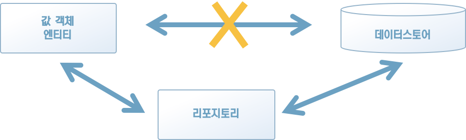

### 5.1 리포지토리란 무엇인가?

리포지토리의 일반적인 의미는 보관창고다. 소프트웨어 개발에서 말하는 리포지토리 역시 데이터 보관창고를 의미한다(그림 5-1).


[그림 5-1] 데이터 보관창고


소프트웨어로 도메인 개념을 표현했다고 해서 그대로 애플리케이션이 되는 것은 아니다. 프로그램을 실행할 때 메모리에 로드된 데이터는 프로그램을 종료하면 그대로 사라져버린다. 특히 엔티티는 생애주기를 갖는 객체이기 때문에 프로그램의 종료와 함께 객체가 사라져서는 안 된다.

객체를 다시 이용하려면 데이터스토어에 있는 객체 데이터를 저장 및 복원할 수 있어야 한다. 리포지토리는 데이터를 저장하고 복원하는 처리를 추상화하는 객체다.

객체 인스턴스를 저장할 때는 데이터스토어에 기록하는 처리를 직접 실행하는 대신 리포지토리에 객체의 저장을 맡기면 된다. 또 저장해 둔 데이터에서 다시 객체를 읽어 들일 때도 리포지토리에 객체의 복원을 맡긴다(그림 5-2).




[그림 5-2] 리포지토리를 통한 객체의 저장 및 복원


이런 방법으로 리포지토리를 거쳐 간접적으로 데이터를 저장 및 복원하는 방식을 취하면 소프트웨어의 유연성이 놀랄 만큼 향상된다.

이번 장에서 먼저 리포지토리를 구현하는 구체적인 방법을 익힌 후 리포지토리의 사용법을 알아본다. 그리고 리포지토리의 장점을 체감해본 다음 앞 장에서 발생했던 문제를 해결한다.


[칼럼] 도메인 객체에 스포트라이트를 비추는 리포지토리

> 리포지토리는 지금까지 배운 도메인 객체와 달리, 도메인 개념으로부터 유래한 객체가 아니라는 점에서 도메인 객체와는 큰 차이가 있다. 그러면 리포지토리라는 도메인과 전혀 무관한가 하면 그것도 사실과 거리가 있다.
>
> 도메인 객체를 이용해 프로그램을 구성하고 문제를 해결하기 위해서는 기술적 요소와 관계 깊은 코드가 함께 필요하다. 그러나 자칫하면 문제 해결을 위한 코드가 이 기술적 요소와 관련된 코드에 침식당하기 때문에 코드의 원래 의도를 알아보기 어려워진다. 리포지토리는 이런 기술적 요소와 관련된 코드를 모아 문제 해결을 위한 코드가 침식 되는 것을 막는 역할을 한다.
>
> 리포지토리는 도메인 개념에서 유래한 객체가 아닌 만큼 도메인 객체라고는 할 수 없지만, 그 대신 도메인 객체가 더욱 돋보이게 하는 역할을 한다. 따라서 리포지토리라는 도메인을 잘 나타내는 것이 목표인 도메인 설계에서 빼놓을수 없는 구성요소다.


### 5.2 리포지토리의 책임

리포지토리의 책임은 도메인 객체를 저장하고 복원하는 퍼시스턴시다.

퍼시스턴시라고 하면 무조건 관계형 데이터베이스를 떠올리는 사람이 많지만, 퍼시스턴시의 기반 기술은 관계형 데이터베이스 외에도 다양하다. 단적으로 관계형 데이터베이스만 따져도 여러 가지 종류가 있으며, 파일에 데이터를 저장하는 간단한 것부터 NoSQL 데이터베이스를 이용하는 경우도 있다.

어떤 기술을 채용하든지 퍼시스턴시를 구현하는 코드는 특정 데이터스토어를 사용하기 위한 구체적인 절차를 따라야 하기 때문에 조금 까다롭다. 이 까다로운 절차를 그대로 도메인 코드에 노출시키면 어떤 일이 벌어지는지 알아보자.

리스트 5-1은 4장에서 이미 봤던 사용자 생성 처리 코드다.

[리스트 5-1] 4장에 나왔던 사용자 생성 처리 코드

```java
public class Program {
    public void createUser(String userName) throws Exception {
        User user = new User(new UserName(userName));
        UserService userService = new UserService();
        if (userService.exists(user)) {
            throw new IllegalArgumentException(user.getName().getValue() + "은 이미 존재하는 사용자명임");
        }

        Connection conn = DriverManager.getConnection("url", "user", "password");
        PreparedStatement pstmt = conn.prepareStatement("INSERT INTO users (id, name) VALUES (?, ?)");
        pstmt.setString(1, user.getId().getValue());
        pstmt.setString(2, user.getName().getValue());
        pstmt.executeUpdate();
    }
}
```

코드의 앞부분은 사용자 생성 및 사용자명 중복 확인을 맡은 코드임을 쉽게 알 수 있다. 그러나 후반부의 코드는 어떠한가? 관계형 데이터베이스에 접근한다는 것을 알 수 있다. 그러나 그 내용이 User 객체 인스턴스를 저장하는 내용이라는 것까지 파악하려면 코드를 자세히 읽지 않으면 안 된다.

이번에는 리스트 5-1의 코드에서 사용된 UserService 구현 코드를 살펴보자(리스트 5-2).

[리스트 5-2] UserService의 구현 코드

```java
public class UserService {
    public boolean exists(User user) throws SQLException {
        Connection conn = DriverManager.getConnection("url", "user", "password");
        PreparedStatement pstmt = conn.prepareStatement("SELECT * FROM users WHERE name = ?");
        pstmt.setString(1, user.getName().getValue());
        ResultSet resultSet = pstmt.executeQuery();
        if (resultSet.next()) {
            return true;
        }

        return false;
    }
}
```

userService의 exists 메서드는 처음부터 끝까지 관계형 데이터베이스를 다루는 코드로 돼 있다. 사용자명 중복을 어떻게 판단하는지 그 과정을 이해할 수 있을 것이다. 사용자명 중복 금지 규칙은 이 처리 내용을 자세히 읽고 어떤 쿼리를 전송하는지까지 봐야 알 수 있는 정보다.

사용자 생성 처리와 사용자명 중복 확인 처리 모두 바르게 동작하지만, 코드의 대부분이 데이터스토어를 조작하는 코드로 가득 차 있어 코드의 의도를 이해하기가 어렵다. 데이터스토어를  직접 다루는 퍼시스턴스 관련 처리를 추상적으로 뽑아내면 이 코드의 의도를 좀 더 잘 드러낼 수 있다. 퍼시스턴시를 리포지토리를 통해 추상화해서 다루게 수정해 보자.

먼저 사용자 생성  처리부터 리포지토리를 이용하게 수정한다(리스트 5-3).

[리스트 5-3] 리포지토리를 이용하는 사용자 생성 처리

```java
public class Program {
    private IUserRepository userRepository;

    public Program(IUserRepository userRepository) {
        this.userRepository = userRepository;
    }

    public void createUser(String userName) {
        User user = new User(new UserName(userName));
        UserService userService = new UserService(userRepository);
        if (userService.exists(user)) {
            throw new IllegalArgumentException(user.getName().getValue() + "은 이미 존재하는 사용자명임");
        }

        userRepository.save(user);
    }
}
```

User 객체의 퍼시스턴시는 리포지토리 IUserRepository 객체가 맡아 수행한다. 데이터스토어가 관계형 데이터베이스든 NoSQL 데이터베이스든, 아니면 그냥 파일이라도 도메인 입장에서는 중요한 문제가 아니다. 중요한 것은 인스턴스를 어떤 수단을 통해 저장하냐는 것이다. 데이터스토어에 대한 명령을 추상화함으로써 데이터스토어를 직접 다루는 까다로운 코드에서 해방되고 사용자 생성과 관련된 순수한 로직만 남은 코드가 된다. 따라서 코드가 의도하는 바가 뚜렷해지고 굳이 주석을 통해 부연 설명할 필요도 사라진다.

이번에는 도메인 서비스의 구현 코드가 어떻게 변화했을 지 살펴보자(리스트 5-4).

[리스트 5-4] 리포지토리를 이용하는 도메인 서비스의 구현 코드

```java
public class UserService {
    private IUserRepository userRepository;
    public UserService(IUserRepository userRepository) {
        this.userRepository = userRepository;
    }

    public boolean exists(User user) {
        User found = userRepository.find(user.getName().getValue());
        return found != null;
    }
}
```

데이터베이스를 다루는 코드로 절반 이상이 채워졌던 도메인 서비스 코드가 리포지토리를 거쳐 인스턴스를 복원해 'User 객체의 중복 확인은 사용자명을 기준으로 한다'라는 의도를 더 명확히 드러냈다. 사용자 생성 처리가 그랬듯이 더는 눈이 빠지게 코드를 들여다볼 필요가 없다.

지금까지 살펴봤듯이 리포지토리는 객체의 현재 상태를 저장 및 복원하는 퍼시스턴시를 담당하는 객체다. 객체의 퍼시스턴시와 관련된 처리를 리포지토리에 맡기면 비즈니스 로직을 더욱 순수하게 유지할 수 있다.


### 5.3 리포지토리의 인터페이스

리포지토리를 이용하는 코드와 이러한 코드의 장점을 살펴봤으니 이번에는 리포지토리의 정의를 살펴볼 차례다. 리포지토리는 인터페이스로 정의된다(리스트 5-5).

[리스트 5-5] User 클래스의 리포지토리 인터페이스

```java
public interface IUserRepository {
    void save(User user);
    User find(String userName);
}
```

사용자 생성 처리를 구현하려면 인스턴스를 저장하는 처리와 사용자명 중복 확인을 위한 객체 복원 처리가 필요하다. 따라서 IUserRepository도 인스턴스를 저장하기 위한 행동과 사용자명으로 인스턴스를 복원하는 행동을 제공한다. 복원을 시도할 때 대상이 되는 객체가 발견되지 않은 경우에는 null을 반환해 해당 객체가 발견되지 않았다는 것을 나타낸다.

사용자명 중복 확인과 같은 목적이 있다면 exists 메서드를 리포지토리에 구현하는 게 어떨까 하는 생각도 할 수 있다(리스트 5-6).

[리스트 5-6] 리포지토리에 사용자명 중복 확인 메서드 추가하기

```java
public interface IUserRepository {
    void save(User user);
    User find(String userName);
    boolean exists(User user);
}
```

그러나 리포지토리의 책임은 객체의 퍼시스턴시까지다. 사용자명의 중복 확인은 도메인 규칙에 가까우므로 이를 리포지토리에 구현하는 것은 리포지토리의 책임을 벗어난다.  만약 리포지토리에 exists 메서드가 정의된다면 리포지토리의 구현에 따라 동작 내용이 바뀔 가능성이 있다. 사용자명 중복 확인은 도메인 서비스가 주체가 되는 것이 옳다(리스트 5-7).

[리스트 5-7] 리스트 5-6의 코드로는 사용자명 중복 확인의 주체가 도메인 서비스가 아니게 된다.

```java
public class UserService {
    private IUserRepository userRepository;
  
  	(...생략...)

    public boolean exists(User user) {
        // 중복 확인이 사용자명 기준이라는 지식이 도메인 객체에서 누락된다.
        return userRepository.exists(user);
    }
}
```

인프라를 다루는 처리를 도메인 서비스에 두는 것이 꺼려져 리포지토리에 사용자명 중복 확인을 정의하고 싶다면 리스트 5-8과 같이 구체적인 중복 확인 키를 전달하는 형태가 좋다.

[리스트 5-8] 리포지토리에 사용자명 중복 확인을 정의한 경우

```java
public interface IUserRepository {
    
  	(...생략...)
   
  	boolean exists(UserName name);
}
```

이 외에도 리포지토리에 정의할 만한 행동으로, User의 식별자인 UserId를 이용한 사용자 검색 메서드 등을 생각해 볼 수 있다. 그러나 지금부터 서둘러 준비할 필요는 없다. 미리 메서드를 갖춘다 해도 결국 사용하지 않는 경우도 있다. 현시점에서 필요한 최소한의 정의만 작성하면 된다.


[칼럼] null에 대한 시시비비와 Optional 타입

> java에서는 객체의 유무를 나타내는 데 null을 이용한다. 그러나 null을 이런 의미로 사용하는 데 거부감을 갖는 사람도 있다. 그리고 아마 그렇게 생각하는 것이 옳을 것이다.
>
> null은 인류가 이해하기 어려운 개념이다. null이 존재하는 프로그래밍 언어를 다뤄본 개발자라면 다들 한 번쯤은 null을 참조했다가 오류를 발생시킨 적이 있을 것이다. 그만큼 null로 인해 발생하는 버그는 많은 개발자의 골칫거리였다.
>
> null로 인한 버그를 방지하기 위한 최선의 방책은 null을 사용하지 않는 것이다. 아예 null이 없는 프로그래밍 언어도 있다. 이런 언어에서는 객체의 유무를 나타내기 위해 Optional 타입(또는 이에 준하는 타입)을 이용한다(리스트 5-9).
>
> [리스트 5-9] Optional 타입을 도입한 리포지토리
>
> ```java
> public interface IUserReposistory {
>     void save(User user);
>     Optional<User> find(UserName name);
> }
> ```
>
> Optional 타입은 반환되는 객체가 있을 수도 있고 없을 수도 있다는 것을 의미하는 타입이다. 반환 값의 타입이 Optional인 메서드는 이 타입 정보만으로 반환되는 객체가 '없을 수도 있음'을 알려준다. 따라서 Optional 타입을 사용하면 '없는 경우 null이 반환됨'과 같은 주석을 달 필요가 없다.


### 5.4 SQL을 이용하는 리포지토리 구현하기

인터페이스를 준비했으니 리포지토리를 구현할 차례다. 원래 코드는 관계형 데이터베이스를 데이터스토어로 사용하고 있었다. 첫 번째로 구현하는 리포지토리는 이 관계형 데이터베이스를 다루는 리포지토리다(리스트 5-10).

[리스트 5-10] SQL을 이요하는 리포지토리 구현

```java
public class UserRepository implements IUserRepository {
    @Override
    public void save(User user) {
        try {
            Connection conn = new SqlConnection().getConnection();
            PreparedStatement pstmt = conn.prepareStatement(
              "MERGE INTO users " +
              "USING ( " +
              "		SELECT :id AS id, :name AS name " +
              ") AS data " +
              "ON users.id = data.id " +
              "WHEN MATCHED THEN " +
              " 	UPDATE SET name = data.name" +
              "WHEN NOT MATCHED THEN" +
              " 	INSERT (id, name) " +
              " 	VALUES(data.id, data.name)"
            );
            pstmt.setString(1, user.getId().getValue());
            pstmt.setString(2, user.getName().getValue());
            pstmt.executeUpdate();
        } catch (SQLException e) {
            e.printStackTrace();
        }
    }
  
  	(...생략...)
}
```

UserRepository 클래스의 save 메서드는 User 클래스의 인스턴스를 관계형 데이터베이스에 저장하기 위해 UPSERT(기존 데이터가 있다면 UPDATE, 없다면 INSERT) 한다. UPSERT 처리를 구현하는 방법은 자신을 찾는 SELECT 쿼리를 전달해 데이터가 존재하는지 여부를 따져 분기해도 좋고, 예제 코드에서 보듯이 데이터베이스 고유의 문법(MERGE)을 사용해도 된다. 비즈니스 로직에서 특정한 기술에 의존하는 구현은 바람직하지 않지만, 리포지토리의 구현 클래스라면 특정 기술에 의존하는 구현도 문제가 없다.

다음으로 find 메서드의 구현을 살펴보자(리스트 5-11).

[리스트 5-11] SQL을 이용하는 리포지토리 구현(find 메서드)

```java
public class UserRepository implements IUserRepository {
    @Override
    public User find(UserName userName) {
        try {
            Connection conn = new SqlConnection().getConnection();
            PreparedStatement pstmt = conn.prepareStatement("SELECT * FROM users WHERE name = ?");
            pstmt.setString(1, userName.getValue());
            ResultSet resultSet = pstmt.executeQuery();
            if (resultSet.next()) {
                String userId = resultSet.getString("user_id");
                String name = resultSet.getString("user_name");

                return new User(
                        new UserId(userId),
                        new UserName(name)
                );
            }
        } catch (SQLException e) {
            e.printStackTrace();
        }
      	return null;
    }
}
```

find 메서드는 인자로 받은 데이터로 user 테이블을 조회한 다음 user 객체의 인스턴스를 복원해 반환한다. 해당하는 데이터가 없다면 null을 반환한다.

이렇게 구현된 리포지토리는 리스트 5-12와 같이 생성자 메서드를 통해 Program 클래스에 전달된다.

[리스트 5-12] Program 클래스에 리포지토리를 인자로 전달하기

```java
UserRepository userRepository = new UserRepository();
Program program = new Program(userRepository);
program.createUser("john");
```

Program 클래스는 IUserRepository를 다루지만, 실제 객체는 UserRepository()다. 따라서 IUserRepository의 save 메서드가 호출되면 UserRepository의 save 메서드로 제어가 넘어가면서 insert 처리가 실행된다. UserDomainService도 마찬가지로 IUserRepository의 find 메서드를 호출하면 UserRepository의 find 메서드가 실행되며 관계형 데이터베이스에서 객체를 복원한다(그림 5-3).


[그림 5-3] UserRepository가 동작하는 구도


이렇듯 인터페이스를 잘 활용하면 Program 클래스에서 퍼시스턴시와 관련된 구체적인 처리를 구현하지 않아도 객체 인스턴스를 데이터스토어에 저장할 수 있다.


### 5.5 테스트로 구현 검증하기

소프트웨어를 개발할 때 테스트는 필수적이다. 개발자는 프로그램이 자신의 의도대로 동작하리라 기대하지만, 프로그램은 개발자의 의도가 아닌 코드를 따라 동작한다.

프로그램이 개발자의 의도대로 동작하는지 항상 확인할 필요가 있다. 이를 확인하는 대표적인 방법이 테스트다. 직접 실행해 보면 의도대로 동작하는지 확인할 수 있다.

또한 테스트는 동작을 확인하는 목적 외에 소프트웨어의 유연성을 향상시키기도 한다.

소프트웨어를 변경하는 것은 간단한 일이 아니다. 요구 조건을 따라 변경할 부분을 찾고 신중하게 코드를 변경하면서도 원래 있던 기능을 망가뜨려서는 안 된다. 이때 테스트가 미리 갖춰져 있다면 코드를 변경한 후에 테스트를 실행해 보고 원래 있던 기능이 제대로 동작하는지(아니면 동작하지 않는지)를 확인할 수 있다. 이러한 테스트는 소프트웨어 변경에 따른 검증 비용을 줄여준다.

도메인의 변화에 맞춰 소프트웨어를 변경하려면 테스트를 미리 갖춰 두는 것이 중요하다.


#### 5.5.1 테스트가 필요한 작업 확인하기

사용자 생성 처리가 의도대로 동작하는지 확인하기 위해 테스트를 작성하는 상황을 생각해 보자.

테스트를 수행하려면 우선 관계형 데이터베이스가 필요하다. 설치 파일을 내려받아 설치를 진행하자. 무사히 설치가 끝났다면 접속 문자열을 로컬 데이터베이스 접속용으로 교체한다. 설정 파일을 조금 수정하면 된다 .데이트베이스의 준비가 끝나면 쿼리의 대상이 될 테이블도 만들어야 한다. 코드를 보면 'SELECT * FROM users'와 같은 쿼리문이 보인다. 이로부터 user 테이블이 필요하다는 것을 알 수 있다. 테이블을 만들려면 테이블 정의가 필요하다. 한 번 더 코드를 확인하니 문자열로 된 사용자 ID와 사용자명 칼럼이 있으면 될 것 같다. 수집한 정보를 바탕으로 테이블을 생성한다. 또 코드에는 사용자명의 중복을 확인하는 처리가 있다. 중복 확인이 제대로 동작하는지 확인할 수 있게 데이터를 미리 넣어둔다.

데이터베이스는 한 번 설치해 두면 어지간한 일이 아니면 다시 설치할 필요가 없다. 그러나 테이블은 그렇지 않다. 로직마다 다른 테이블이 필요하므로 로직이 늘어남에 따라 테이블도 추가해야 한다. 여러 가지 기능이 있는 처리는 더 어렵다. 확인이 필요한 항목마다 테스트에 필요한 데이터를. 하나하나 넣어두지 않으면 안 된다. 경우에 따라서는 이전 테스트에서 사용한 데이터를 지워야 할 수도 있다.

자, 이제 대략 상황을 상상할 수 있다. 이 작업을 하루에도 몇 번씩 해야 한다면 어떻겠는가?


#### 5.5.2 기도하는 자의 테스트 이론

테스트에 드는 수고가 점점 커지면 개발자는 테스트를 성실히 하지 않게 된다.

개발자의 업무는 다양하다. 그만큼 다양한 업무를 수행하기 위한 효율 개선에 주력하며 작업에 들어가는 비용과 편익에 민감하다. 동시에 어느 정도 경험을 쌓은 개발자라면 작성한 코드가 의도한 대로 동작할지 '감을 잡을'수도 있다. 효율 개선을 열심히 하는 개발자라면 '어지간하면' 잘 돌아갈 코드에 큰 노력을 들여 테스트를 수행하는 것은 가성비가 좋지 않다고 생각할 것이다. 결과적으로 '잘 돌아가겠지!' 싶은 코드가 제품에 포함되는 것이다.

테스트를 거치지 않은 코드에 개발자가 할 수 있는 일은 그저 기도뿐이다.

'부디 이 코드가 문제없이 동작하게 해주세요.'

기도는 곧 불안감의 방증이다. 개발자는 코드가 릴리스 된 후로 불안감에 휩싸인다. 짧게는 며칠에서 몇 주, 가끔은 더 긴 시간이 지나서야 겨우 안심하며 생각한다.

'역시 그 코드는 문제가 없었어.'

이런 잘못된 성공 경험은 개발자를 더욱더 테스트로부터 멀어지게 한다. '잘 돌아가겠지!' 싶은 코드를 작성하고 문제없기를 기도만 하는 것이다. 물론 기도가 최선책일 수는 없다. 기도한다고 프로그램의 오류가 고쳐질 리가 없기 때문이다.


#### 5.5.3 기도는 이제 그만

기도에만 의존해 온 개발자가 기도를 그만두고 테스트에 나서게 하는 방법은 크게 두 가지다. 첫 번째는 공포에 의한 통제고 두 번째는 효율적인 테스트를 만드는 것이다. 시스템을 개발하는 사람이라면 후자를 택해야 한다. 이번에는 테스트를 만드는 방법에 대해 알아보자.

지금의 문제는 테스트를 위해 데이터베이스를 설치하고, 테이블을 만드는 등 준비 작업이 너무 복잡하다는 것이다. 이 문제를 해결하는 방법은 간단하다. 데이터베이스를 사용하지 않으면 된다. 즉, 데이터베이스가 없는 테스트용 리포지토리를 쓰는 것이다.


### 5.6 테스트용 리포지토리 만들기

테스트만을 위해 특정한 인프라를 갖추는 것은 매우 번거롭다. 이 문제를 해결하는 방법으로 메모리를 데이터스토어 삼는 방법이 있다. 인스턴스를 저장하는 매체로 메모리를 이용하고 싶을 때 가장 쉬운 방법이 맵이다. 리스트 5-13은 맵을 기반으로 구현한 리포지토리다.

[리스트 5-13] 해시맵 기반으로 구현한 리포지토리

```java
public class InMemoryUserRepository implements IUserRepository {
  	// 테스트케이스에 따라 데이터를 확인해야 하는 경우도 있다
  	// 확인을 위해 외부에서 접근할 수 있게 public으로 둔다.
    public Map<UserId, User> store = new HashMap<>();

    @Override
    public void save(User user) {
        // 저장시에도 깊은 복사를 수행
        this.store.put(user.getId(), clone(user));
    }

    @Override
    public User find(UserName userName) {
        User target = store.values().stream()
                .filter(user -> user.getName().equals(userName)).findAny()
                .orElseThrow(() -> new NoSuchElementException("userName not found: " + userName));

        if (target != null) {
            return clone(target);
        }
        return null;
    }

    // 깊은 복사를 담당하는 메서드
    private User clone(User user) {
        return new User(user.getId(), user.getName());
    }
}
```

먼저 데이터가 저장될 곳을 살펴보자. 데이터는 평범한 맵에 저장된다. 인덱스는 객체의 식별자 역할을 하는 값 객체를 사용한다. 값 객체를 맵의 인덱스로 사용하면 equals와 hashCode 메서드를 오버라이드해야 한다. 이들 메서드를 오버라이드할 수 없는 상황이라면 래핑된 실제 값을 인덱스로 써도 된다.

다음으로 find 메서드를 살펴보자. 이 메서드는 맵에서 목표하는 인스턴스를 검색하는 역할을 한다.

[리스트 5-14] 반복문으로 구현한 리스트 5-13의 find 메서드

```java
public User find(UserName userName) {
        User target = store.values().stream()
                .filter(user -> user.getName().equals(userName)).findAny()
                .orElseThrow(() -> new NoSuchElementException("userName not found: " + userName));

        if (target != null) {
            return clone(target);
        }
        return null;
    }
```

검색 결과로 찾은 인스턴스는 그대로 반환하는 것이 아니라 깊은 복사를 통해 만든 새로운 객체를 반환한다. 이렇게 하는 이유는 인스턴스를 조작했을 때 리포지토리에 저장된 객체에 그 영향이 미치지 않게(리스트 5-15) 하기 위해서다.

[리스트 5-15] 객체에 대한 조작이 리포지토리의 객체에도 영향을 미치는 경우

```java
// 객체를 복원할 때 깊은 복사를 하지 않으면
User user = userRepository.find(new UserName("John"));
// 복원된 객체에 대한 조작이 리포지토리에 저장된 객체에도 영향을 미친다.
user.changeUserName(new UserName("John"));
```

같은 이유로 save 메서드에서도 인스턴스를 저장할 때 깊은 복사를 한다. 그래서 리포지토리에 저장된 인스턴스가 영향을 받지 않게(리스트 5-16) 한다.

[리스트 5-16] 리포지토리 내부의 객체가 저장 후에도 영향을 받는 경우

```java
// 여기서 인스턴스를 바로 리포지토리에 저장하면
userRepository.save(user);
// 인스턴스에 대한 조작이 리포지토리에 저장된 객체에도 영향을 미친다.
user.changeUserName(new UserName("john"));
```

데이터베이스에 데이터를 저장하는 운영용 리포지토리에서는 최적화 등의 이유로 현재 데이터와의 차이를 탐지해 변경된 부분만 수정하는 경우도 있지만, InMemoryUserRepository는 테스트에만 사용될 예정이므로 여기까지는 고려할 필요가 없다.

테스트용 리포지토리에 대한 설명은 이것으로 끝이다. 사용자 생성 처리를 실제로 테스트해 보자(리스트 5-17).

[리스트 5-17] 사용자 생성 처리 테스트

```java
InMemoryUserRepository userRepository = new InMemoryUserRepository();
Program program = new Program(userRepository);
program.createUser("john");

User user = userRepository.store.get(new UserId("john"));
Assert.assertEquals("john", user.getName().getValue());
```

데이터베이스에 접속할 필요가 없으니 테스트가 놀랄 만큼 간단해졌다. 이제 불안에 가득 찬 밤을 보내며 릴리스 일정을 맞을 필요가 없다. 코드가 제대로 동작하리라는 확인이 들 때까지 마음껏 테스트하기 바란다.


### 5.7 객체-관계 매핑이 적용된 리포지토리 구현하기

오늘날에는 SQL 문을 직접 코드에 작성해 실행하는 대신 객체-관계 매핑(ORM, O-R mapper)을 사용하는 스타일이 주류를 이룬다. 이번 절에서는 객체-관계 매핑을 적용한 리포지토리를 구현해본다.

java에서 사용되는 객체-관계 매핑 라이브러리로는 JPA가 잘 알려져 있다. 리스트 5-18은 JPA를 이용해 구현한 리포지토리다.

[리스트 5-18] 객체-관계 매핑 라이브러리  JPA를 이용해 구현한 리포지토리

```java
@Repository
@RequiredArgsConstructor
public class EFUserRepository implements IUserRepository {

    private final UserJpaRepository context;

    @Override
    public User find(UserName name) {
        User target = context.findById(name.getValue()).orElse(null);
        return target;
    }

    @Override
    public List<User> findAll() {
        return StreamSupport.stream(context.findAll().spliterator(), false)
                .collect(Collectors.toList());
    }

    @Override
    public void save(User user) {
        context.save(user);
    }

    @Override
    public void delete(User user) {
        context.delete(user);
    }
}
```

네임스페이스를 이용해 EFUserRepository라는 이름의 클래스를 만들어도 무방하다. 이 책에서는 가독성을 위해 클래스명을 EFUserRepository로 했다.

JPA에서 데이터 스토리지로 이용하는 객체(데이터 모델)를 엔티티라고 부른다. UserDataModel은 JPA의 엔티티다(리스트 5-19).

[리스트 5-19] JPA가 직접 사용하는 데이터 모델

```java
@AllArgsConstructor
@Table(name = "users")
public class UserDataModel {
  	@Id
    private String id;
    private String name;
}
```

이 엔티티는 이름만 같을 뿐 2장에서 배웠던 도메인 주도 설계의 엔티티와는 전혀 다른 것이다. UserDataModel이라는 이름에서 이를 강조하고 있다. 물론 네임스페이스를 이용해 User라는 이름으로 데이터 모델을 만들어도 된다(리스트 5-20).

```java
package infrastructure.datamodel.users;

@AllArgsConstructor
@Table(name = "users")
public class UserDataModel {
  	@Id
    private String id;
    private String name;
}
```

중요한 것은 도메인 객체가 도메인 지식을 나타내는 데 집중하게 하는 것이다. 특정한 기술에서만 사용될 게터와 세터를 도메인 객체에 추가하는 것은 바람직하지 못하다.

이제 EFUserRepository를 사용해 볼 차례다. EFUserRepository는 IUserRepository 인터페이스를 구현하므로 Program 클래스에 그대로 인자로 전달할 수 있다(리스트 5-21).

[리스트 5-21] JPA를 이용해 구현한 리포지토리로 테스트하기

```java
UserRepository userRepository = new EFUserRepository(myContext);
Program program = new Program(userRepository);
program.createUser("smith");

// 리포지토리에서 데이터를 꺼내 확인한다.
User head = myContext.getUsers.first();
Assert.assertEquals("smith", head.getName());
```

리포지토리의 구현체만 바뀌었을 뿐 Program 클래스의 인스턴스가 생성된 뒤의 처리 내용은 인메모리 리포지토리를 이용한 테스트 코드(리스트 5-17)와 완전히 같다.


### 5.8 리포지토리에 정의되는 행동

리포지토리에 정의되는 행위는 객체의 저장 및 복원에 대한 것이다. 이 행위를 한번 살펴보자.


#### 5.8.1 객체의 저장과 관련된 행위

객체를 저장하는 행위는 이미 예제 코드에서 등장했던 save 메서드다(리스트 5-22).

[리스트 5-22] 객체를 저장하는 행동

```java
public interface IUserRepository {
    void save(User user);
  	(...생략...)
}
```

save라는 메서드 이름은 강제되는 것이 아니다. store라고 이름을 지어도 무방하다.

객체를 저장하려면 저장 대상 객체를 인자로 전달받아야 한다. 따라서 리스트 5-23과 같이 대상 객체의 식별자 및 수정 항목을 인자로 받게 메서드를 정의해서는 안 된다.

[리스트 5-23] 수정할 항목만을 인자로 받는 수정 처리 (나쁜 예)

```java
public interface IUserRepository {
  void updateName(UserId id, UserName name);
  (...생략...)
}
```

리스트 5-23과 같이 메서드를 정의하면 리포지토리에 수많은 수정 메서드가 생기는 결과를 낳는다(리스트 5-24).

[리스트 5-24] 불필요하게 많은 수정 메서드가 정의된 리포지토리(나쁜 예)

```java
public interface IUserRepository {
  void updateName(UserId id, UserName name);
	void updateEmail(UserId id, Email email);
	void updateAddress(UserId id, Address address);
  (...생략...)
}
```

객체가 저장하고 있는 데이터를 수정하려면 애초부터 객체 자신에게 맡기는 것이 옳다. 위와 같은 코드는 피해야 한다.

마찬가지로 객체를 생성하는 처리도 리포지토리에 정의해서는 안된다.

이 외에도 퍼시스턴시와 관련된 행동으로 객체의 파기를 들 수 있다. 생애주기를 갖는 객체는 필요를 다하면 파기해야 한다. 이를 지원하는 것도 리포지토리의 역할이다. 리스트 5-25와 같이 객체를 파기하는 메서드도 리포지토리에 정의한다.

[리스트 5-25] 객체를 파기하는 행위가 정의된 리포지토리

```java
public interface IUserRepository {
  void delete(User user);
  (...생략...)
}
```


#### 5.8.2 저장된 객체의 복원과 관계된 행위

저장된 객체를 복원하는 행위 중에 가장 자주 쓰이는 것은 식별자로 검색을 수행하는 메서드다.

[리스트 5-26] 식별자로 객체를 검색하는 메서드

```java
public interface IUserRepository {
  User find(UserName userName);
  (...생략...)
}
```

기본적으로 식별자를 키로 삼는 검색 메서드를 이용하지만, 사용자명 중복 여부를 확인하는 이유로 모든 객체를 받아와야 할 경우도 있다. 이런 경우를 위해 저장된 모든 객체를 복원해 오는 메서드를 정의한다(리스트 5-27).

[리스트 5-27] 저장된 모든 객체를 복원하는 메서드

```java
public interface IUserRepository {
  List<User> findAll();
  (...생략...)
}
```

다만 이 메서드를 정의할 때는 조금 신중해야 한다. 복원되는 객체의 숫자에 따라 컴퓨터의 리소스가 바닥나는 상황이 벌어질 수 있기 때문이다.

성능에서 기인한 심각한 문제를 회피하려면 검색에 적합한 메서드를 정의해야 한다(리스트 5-28).

[리스트 5-28] 검색에 적합한 메서드의 예

```java
interface IUserRepository {
  User find(UserName name);
  // 오버로딩을 지원하지 않는 언어라면 이름을 바꿔가며 베리에이션을 만든다.
  // User findByUserName(UserName name);
  (...생략...)
}
```

위와 같은 메서드라면 검색의 키가 될 데이터를 인자로 전달받기 때문에 리포지토리의 구현체도 최적화된 검색을 수행할 수 있다.


### 5.9 정리

로직이 특정한 인프라스트럭처 기술에 의존하면 소프트웨어가 경직되는 현상이 일어난다. 코드의 대부분이 데이터스토어를 직접 다루는 내용으로 오염되며 코드의 의도가 잘 드러나지 않는다.

리포지토리를 이용하면 데이터 퍼시스턴시와 관련된 처리를 추상화할 수 있다. 이 정도의 변화만으로도 소프트웨어의 유연성을 놀랄 만큼 향상시킬 수 있다.

예를 들어 개발 초기에 어떤 데이터스토어를 채용할지 결정하기 전이라도 인메모리 리포지토리 등을 이용해 먼저 로직 구현 작업을 할 수 있다. 이 외에도 더 성능이 높은 데이터스토어가 출시된다면 이를 위한 리포지토리를 구현해 데이터스토어를 교체할 수 있다. 그리고 원한다면 언제든지 테스트도 실시할 수 있다.

도메인 규칙과 비교하면 어떤 데이터스토어를 사용할지는 사소한 문제에 지나지 않는다. 리포지토리를 잘 활용해 코드의 의도를 명확히 하면 뒷날 개발자에게 큰 도움이 될 것이다.

  

  

 