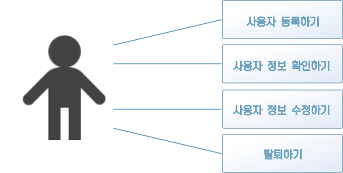
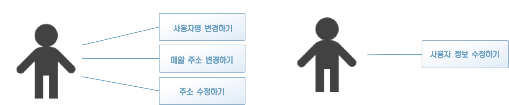
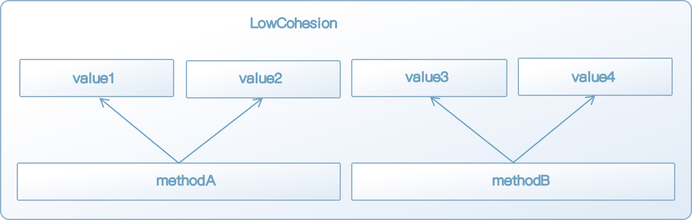
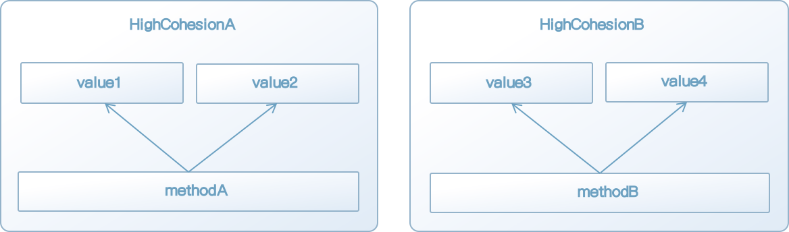
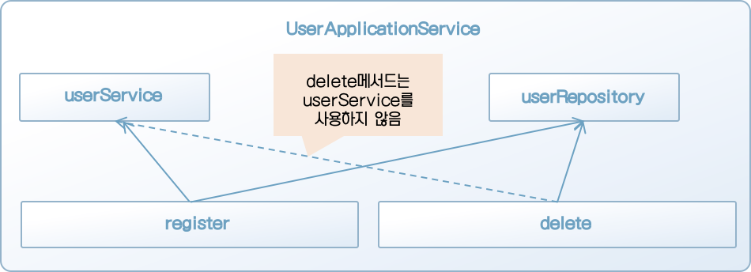
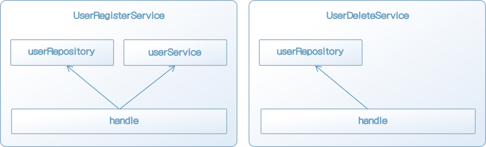
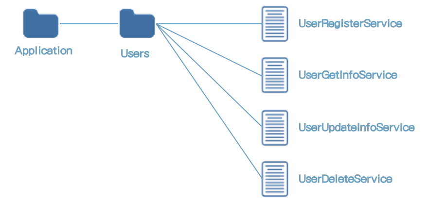
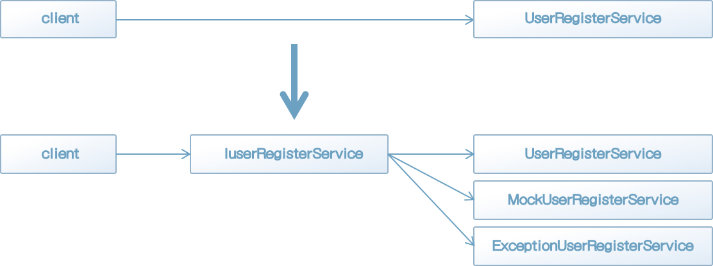

### 6.1 애플리케이션 서비스란 무엇인가

이번 장에서는 4장에서 소개했던 두 가지 서비스 중 애플리케이션 서비스를 설명한다. 애플리케이션 서비스를 한마디로 표현하면 유스케이스를 구현하는 객체라고 할 수 있다.

예를 들어 사용자 등록을 해야 하는 시스템에서 사용자 기능을 구현하려면 '사용자 등록하기' 유스케이스와 '사용자 정보 수정하기' 유스케이스가 필요하다. 사용자 기능에 대한 애플리케이션 서비스는 유스케이스를 따라 '사용자 등록하기' 행위와 '사용자 정보 수정하기' 행위를 정의한다. 이들 행위는 도메인 객체를 실제로 조합해 실행되는 스크립트 같은 것이다.

이번 장에서는 사용자 기능에 필요한 유스케이스를 작성하는 과정을 살펴보며 애플리케이션 서비스가 무엇인지 알아본다.


[칼럼] 애플리케이션 서비스의 의미

> 애플리케이션 서비스의 의미를 알기 위해서는 애플리케이션이 무엇인지부터 알아야 한다.
>
> 애플리케이션은 일반적으로 이용자의 목적에 부응하는 프로그램을 의미한다. 애플리케이션의 목표는 이용자의 필요를 만족시키고 목적을 달성하게 하는 것이다.
>
> 도메인 객체는 도메인을 코드로 옮긴 것이다. 도메인을 코드로 나타냈다고 해도 그것만으로는 이용자가 당연한 문제나 필요가 해결되지 않는다. 이용자의 필요를 만족시키거나 문제를 해결하려면 도메인 객체의 힘을 하나로 엮어 올바른 방향으로 이끌어야 한다.
>
> 도메인 객체를 조작해서 이용자의 목적을 달성하게 이끄는 객체인 애플리케이션 서비스의 이름에 애플리케이션이라는 단어가 들어가는 것은 어찌 보면 당연한 일이다.


### 6.2 유스케이스 수립하기

이번 장에서 다룰 애플리케이션 서비스의 소재는 SNS의 사용자 기능이다. 하나의 시스템을 이루기 위해 반드시 개발이 필요한 요소를 골라내기 위해 우선 사용자 기능이 어떤 것인지부터 살펴보겠다.

이용자는 시스템을 이용하기 위해 먼저 사용자 등록을 해야 한다. 여기서 말하는 사용자는 시스템상의 이용자 자신에 해당한다. 이용자는 이전에 등록한 사용자 정보를 참조하기도 하고, 때에 따라서는 정보를 수정할 수도 있다. 만약 이용자가 더이상 시스템이 필요하지 않게 됐을 때는 탈퇴를 통해 시스템 이용을 중지할 수 있다.

이러한 기능을 갖는 시스템의 유스케이스를 그림 6-1에 나타냈다.




[그림 6-1] 사용자 기능을 구현하는 유스케이스 다이어그램

사용자 기능을 구현하기 위해 필요한 '사용자 등록하기', '정보 받아오기', '정보 수정하기', '탈퇴하기' 등의 유스케이스는 소위 말하는 CRUD(CREATE, READ, UPDATE, DELETE) 처리에 해당한다. 이 네 가지 처리는 시스템을 개발하기 위한 기본으로, 애플리케이션 서비스를 만들어보는 튜토리얼로 적합한 소재가 될 수 있다.


#### 6.2.1 도메인 객체 준비하기

우선 애플리케이션 서비스가 다룰 도메인 객체를 준비한다.

이번에 소재가 된 사용자 개념은 생애주기를 갖는 모델이므로 엔티티로 구현된다(리스트 6-1).

[리스트 6-1] 사용자를 나타내는 엔티티

```java
@Getter
public class User implements Cloneable {
    private UserId id;
    private UserName name;

    public User(UserName name) {
        if (name == null)
            throw new IllegalArgumentException("name : " + name);

        this.id = new UserId(UUID.randomUUID().toString());
        this.name = name;
    }

    public User(UserId id, UserName name) {
        if (id == null)
            throw new IllegalArgumentException("id : " + id);
        if (name == null)
            throw new IllegalArgumentException("name : " + name);

        this.id = id;
        this.name = name;
    }

    public void changeName(UserName name) {
        this.name = name;
    }
}
```

사용자는 동일성을 식별하기 위한 속성 UserId를 가지며, 사용자 정보에 해당하는 속성은 사용자명뿐이다. 모든 속성이 값 객체로 정의되어 있으나, 지금은 특별한 행위가 없으므로 거의 원시 타입을 단순히 래핑한 상태나 마찬가지다(리스트 6-2).

[리스트 6-2] User 클래스가 사용하는 값 객체 타입의 정의

```java
@Getter
public class UserId
{
    private String value;

    public UserId(String value) {
        if (StringUtils.isEmpty(value))
            throw new IllegalArgumentException("value: " + value);

        this.value = value;
    }
}

@Getter
public class UserName {
    private String value;

    public UserName(String value) {
        if (value == null)
            throw new IllegalArgumentException("value: " + value);
        if (value.length() < 3)
            throw new IllegalArgumentException("사용자명은 3글자 이상이어야 함");
        if (value.length() > 3)
            throw new IllegalArgumentException("사용자명은 20글자 이하이어야 함");

        this.value = value;
    }
}
```

그리고 사용자명 중복 여부를 확인해야 하니 도메인 서비스도 갖춰야 한다(리스트 6-3).

[리스트 6-3] 사용자 도메인 서비스

```java
public class UserService
{
    private IUserRepository userRepository;
    public UserService(IUserRepository userRepository) {
        this.userRepository = userRepository;
    }

    public boolean exists(User user) {
        User duplicatedUser = userRepository.find(user.getName());

        return duplicatedUser != null;
    }
}
```

여기에 추가로 사용자 객체의 퍼시스턴시를 구현해야 한다. 이를 위해 리포지토리를 구현한다(리스트 6-4).

[리스트 6-4] 사용자 리포지토리

```java
public interface IUserRepository {
    User find(UserId id);
    User find(UserName name);
    void save(User user);
    void delete(User user);
}
```

리포지토리에는 리스트 6-3의 코드에서 사용되는 메서드 외에도 CRUD 처리를 수행하는 퍼시스턴시 및 객체 파기 메서드가 정의된다. 그리고 리포지토리를 구현한 클래스는 아직 만들지 않아도 된다. 로직을 작성하기 위해서는 인터페이스만으로도 충분하다.

지금까지 소개한 객체는 모두 앞서 설명했다. 이어서 사용자 기능을 구현해 보겠다.


#### 6.2.2 사용자 등록 처리 구현하기

첫 번째로 구현할 유스케이스는 사용자 등록 처리다. 사용자 등록 처리를 리스트 6-5와 같이 애플리케이션 서비스의 행위로  구현할 수 있다.

[리스트 6-5] 사용자 등록 처리 구현 코드

```java
public class UserApplicationService {
    private final IUserRepository userRepository;
    private final UserService userService;

    public UserApplicationService(IUserRepository userRepository, UserService userService) {
        this.userRepository = userRepository;
        this.userService = userService;
    }

    public void register(String name) {
        User user = new User(new UserName(name));

        if (userService.exists(user)) {
            throw new CanNotRegisterUserException("이미 등록된 사용자임: " + user);
        }

        userRepository.save(user);
    }
}
```

register 메서드를 보면 먼저 user 객체를 생성한 다음 사용자명 중복 체크를 도메인 서비스 UserService에 문의한다. 문의 결과를 통해 사용자명이 중복되지 않음을 확인하고 나면 IUserRepository 인스턴스에 해당 사용자 객체를 저장할 것을 요청하고 사용자 등록을 끝낸다.

5장에서 리포지토리에 대한 설명을 다 읽은 독자라면 이상한 점을 발견했을 것이다. 방금 본 코드는 이전의 설명에도 나왔던 Program 클래스와 거의 내용이 같다. 사실 Program 클래스가 바로 애플리케이션 서비스다.


#### 6.2.3 사용자 정보 확인 처리 구현하기

사용자 등록이 끝나면 등록된 사용자 정보를 확인해야 한다. UserApplicationService에 사용자 정보 확인 처리를 추가해보자.

사용자 등록과 달리 사용자 정보 확인 처리는 확인된 결과를 반환해야 한다. 이때 도메인 객체를 그대로 반환 값으로 사용할지 말지에 대한 선택이 중요한 분기점이 된다.

리스트 6-6의 코드는 도메인 객체를 공개하기로 한 경우의 구현이다.

[리스트 6-6] 도메인 객체를 그대로 반환하는 사용자 정보 확인 메서드

```java
public class UserApplicationService {
    private final IUserRepository userRepository;
    private final UserService userService;

  	(...생략...)

    public User get(String userId) {
        UserId targetId = new UserId(userId);
        User user = userRepository.find(targetId);

        return user;
    }
}
```

도메인 객체를 공개하기로 했다면 애플리케이션 서비스의 코드가 비교적 간단해진다. 그러나 이로 인해 약간의 위험성이 생긴다. 애플리케이션 서비스를 이용하는 클라이언트의 입장에서 생각해보자.

애플리케이션 서비스를 이용하는 클라이언트는 결과로 받은 도메인 객체의 속성 정보를 파일이나 화면에 출력한다. 여기까지는 문제가 없다. 문제가 되는 것은 리스트 6-7과 같이 의도하지 않은 도메인 객체의 메서드 호출이 가능하다는 점이다.

[리스트 6-7] 의도하지 않은 도메인 객체의 메서드 호출

```java
public class Client {
    private UserApplicationService userApplicationService;

	  (...생략...)
  
    public void changeName(String id, String name) {
        User target = userApplicationService.get(id);
        UserName newName = new UserName(name);
        target.changeName(newName);
    }
}
```

리스트 6-7은 사용자명 변경을 목적으로 하는 코드다. 이 코드를 실행해도 데이터 퍼시스턴시가 수행되지 않으므로 원하는 목적을 달성할 수 없다.

그러나 여기서 문제 삼아야 할 점은 그것이 무의미한 코드라는 점이 아니다. 진짜 문제는 애플리케이션 서비스가 아닌 객체가 도메인 객체의 직접적인 클라이언트가 되어 도메인 객체를 자유롭게 조작하고 있다는 점이다. 도메인 객체의 행동을 호출하는 것은 애플리케이션 서비스의 책임이다. 이 구조가 지켜진다면 도메인 객체의 행동을 호출하는 코드가 모두 애플리케이션 서비스 안에 모여 있지만, 그렇지 않다면 여러 곳에 코드가 흩어질 수 있다.

이 외에 도메인 객체에 대한 의존이 많이 발생하는 것도 문제다. 도메인의 변화가 즉시 객체에 반영돼야 하는데, 복잡한 의존 관계의 핵심이 되는 코드를 수정하는 것은 숙련된 개발자에게도 조심스러운 작업이다.

도메인 객체를 외부에 공개한다는 선택은 각 처리의 코드를 단순하게 만들 수는 있지만, 그 대가로 많은 위험성을 안게 된다.

이를 방지하기 위한 수단으로 접근제어 수정자를 이용해 메서드의 호출을 제한하는 방법이 있지만, 클라이언트와 애플리케이션 서비스, 도메인 객체가 모두 같은 패키지에 있다면 이 방법도 사용하기 어렵다. 또 개발팀 내의 합의를 통해 도메인 객체의 메서드 호출에 대한 제약을 두는 방법도 있으나 이 방법은 강제력이 없다는 점을 잊어서는 안된다. 어떤 방법도 완벽한 대책은 되지 못한다.

필자는 도메인 객체를 직접 공개하지 않는 쪽을 권한다. 도메인 객체는 비공개로 남겨두고 클래스에 대한 데이터 전송을 위한 객체(DTO, data transfer object)를 만들어 여기에 데이터를 옮겨 넣어 반환하는 방법이다.

그럼, 구체적인 구현 코드를 살펴보자. 우선 User 클래스의 데이터를 전달할 DTO를 만든다(리스트 6-8).

[리스트 6-8] User 클래스의 데이터를 공개하기 위한 목적으로 정의한 DTO

```java
@Getter
public class UserDataModel {
    private String id;
    private String name;

    public UserDataModel(String id, String name) {
        this.id = id;
        this.name = name;
    }
}
```

DTO에 데이터를 옮겨 넣는 처리는 애플리케이션 서비스에서 수행한다(리스트 6-9).

[리스트 6-9] 도메인 객체에서 DTO로 데이터 옮겨 넣기

```java
public class UserApplicationService {
    private final IUserRepository userRepository;
    private final UserService userService;

    public UserApplicationService(IUserRepository userRepository, UserService userService) {
        this.userRepository = userRepository;
        this.userService = userService;
    }

  	(...생략...)
  
    public UserData get(String userId) {
        UserId targetId = new UserId(userId);
        User user = userRepository.find(targetId);

        UserData userData = new UserData(user.getId().getValue(), user.getName().getValue());
        return userData;
    }
}
```

User 클래스의 인스턴스가 외부로 공개되지 않으므로 UserApplicationService의 클라이언트는 User 객체의 메서드를 직접 호출할 수 없다.

그리고 외부로 공개할 파라미터가 추가될 경우에는 리스트 6-10과 같이 코드를 수정해야 한다.

[리스트 6-10] 외부로 공개할 파라미터가 추가될 경우 코드의 수정

```java
public class UserApplicationService {
    private final IUserRepository userRepository;
    private final UserService userService;

    public UserApplicationService(IUserRepository userRepository, UserService userService) {
        this.userRepository = userRepository;
        this.userService = userService;
    }

  	(...생략...)
  
    public UserData get(String userId) {
        UserId targetId = new UserId(userId);
        User user = userRepository.find(targetId);

      	// 생성자 메서드의 인자가 늘어남
        UserData userData = new UserData(user.getId().getValue(), user.getName().getValue(), user.getMailAddress().getValue());
        return userData;
    }
}
```

간단한 수정이므로 기계적으로 할 수도 있지만, UserData 객체를 생성하는 곳은 모두 수정이 필요하다. 정적 타입 언어라면 컴파일 에러가 발생하니 수정할 곳을 찾기가 비교적 쉽고 정규표현식이나 문자열 치환 등을 사용해 수정할 수도 있지만, 그리 즐거운 작업은 아닐 것이다. 수정이 필요한 곳은 적을수록 좋다.

DTO 생성자 메서드에서 User 객체를 인자로 받는 방법도 코드 수정이 필요한 곳을 줄일 수 있다(리스트 6-11).

[리스트 6-11] 도메인 객체를 인자로 받는 DTO의 생성자 메서드

```java
@Getter
public class UserData {
    private String id;
    private String name;

    public UserData(User source) {
        this.id = source.getId().getValue();
        this.name = source.getName().getValue();
    }
}
```

UserData는 생성자 메서드의 인자로 받는 User와 밀접한 관계가 있다. UserData 타입의 목적이 User객체의 데이터를 공개하는 것인 만큼 UserData가 User에 의존하는 것은 큰 문제가 되지 않는다.

전용 생성자 메서드를 이용할 때 데이터를 옮겨 넣는 코드는 리스트 6-12와 같다.

[리스트 6-12] 전용 생성자 메서드를 이용할 때 데이터를 옮겨 넣는 코드

```java
UserData userData = new UserData(user);
```

이러면 파라미터를 나중에 더 추가하더라도 UserData 클래스만 수정하면 된다(리스트 6-13).

[리스트 6-13] 파라미터를 추가하더라도 UserData 클래스만 수정하면 된다

```java
@Getter
public class UserData {
    public UserData(User source) {
        this.id = source.getId().getValue();
        this.name = source.getName().getValue();
        this.mailAddress = source.getMailAddress().getValue(); // 속성에 대입
    }
}
```

마지막으로 리스트 6-13의 UserData 클래스를 이용한 사용자 정보 확인 처리 구현을 살펴보자(리스트 6-14).

[리스트 6-14] 리스트 6-13의 UserData 클래스를 이용한 사용자 정보 확인 처리 구현 코드

```java
public class UserApplicationService {
    private final IUserRepository userRepository;

    public UserData get(String userId) {
        UserId targetId = new UserId(userId);
        User user = userRepository.find(targetId);

        if (user == null) {
            return null;
        }

        return new UserData(user);
    }
}
```

DTO를 적용하면 DTO를 정의하는 데 필요한 수고와 데이터를 옮겨 담는 데서 오는 약간의 성능 저하가 따르지만, 어지간히 많은 양의 데이터를 옮겨 넣는 것이 아닌 이상 성능 저하는 미미한 수준이다. 오히려 불필요한 의존을 줄이고 도메인 객체의 변경을 방해받지 않는 편익이 더 크다.

도메인 객체를 외부에 공개하느냐 마느냐에 대한 판단은 큰 분기점이다. 도메인 객체를 공개했다고 해서 바로 문제가 발생하지는 않는다. 또 도메인 객체를 공개하지 않기 위해 추가로 작성한 코드가 작업량을 늘리는 결과를 낳기도 한다. 어느 쪽을 선택하든지 프로젝트의 정책을 따르는 것이 좋다. 중요한 것은 이 선택에 소프트웨어의 미래를 좌우할 수도 있다는 결정사항임을 인식하고 결정을 내려야 한다는 점이다.


[칼럼] 번거로운 작업을 줄이자

> 도메인 객체를 외부에 공개하지 않기로 했다고 하더라도 개발팀 멤버의 이해를 구하지 못할 가능성이 있다. 일단 코드량이 증가하는 것을 곤란해하는 개발자가 어느 정도 있기 때문이다. 이럴 때는 늘어나는 작업량 만큼 다른 귀찮은 작업을 덜어주는 방법이 유용하다.
>
> 구체적으로 소개하면 도메인 객체를 지정해주면 해당 클래스의 DTO 역할을 하는 클래스 코드를 자동으로 생성해주는 도구를 만드는 것이다.
>
> 개발자 중에는 귀찮은 일을 싫어하는 사람이 많다. 그렇기 때문에 효율 개선을 위해 노력을 아끼지 않는다. 귀찮은 작업을 강요해 이러한 노력을 헛되이 할 것이 아니라 대체 수단을 마련해 주는 편이 훨씬 더 건설적인 방법이다.


#### 6.2.4 사용자 정보 수정 처리 구현하기

사용자 정보 수정 처리를 개개의 정보 항목마다 별도의 유스케이스를 둘 것인지, 아니면 단일 유스케이스로 여러 항목을 한꺼번에 수정할 수 있게 할지는 결정하기 까다로운 문제다(그림 6-2).



[그림 6-2] 사용자 정보 수정의 유스케이스


받아들이기에 따라서 어느 쪽이든 정답이 될 수 있지만, 이번에는 여러 항목을 한꺼번에 수정하는 유스케이스(그림 6-2의 오른쪽)를 예제로 할 것이다.

우선 리스트 6-15에 실린 사용자명 변경 코드를 살펴보자.

[리스트 6-15] 사용자명 변경 처리 코드

```java
public class UserApplicationService {
    private final IUserRepository userRepository;
    private final UserService userService;

  	(...생략...)
  
    public void update(String userId, String name) {
        UserId targetId = new UserId(userId);
        User user = userRepository.find(targetId);

        if (user == null) {
            throw new UserNotFoundException(targetId.getValue());
        }

        UserName newUserName = new UserName(name);
        user.changeName(newUserName);
        if (userService.exists(user)) {
            throw new CanNotRegisterUserException("이미 존재하는 사용자명임: " + user.getName());
        }

        userRepository.save(user);
    }
}
```

User 객체의 파라미터는 사용자명뿐이므로 사용자명을 인자로 받는다. 그러나 앞으로도 사용자 정보가 사용자명으로 구성될 가능성은 낮다. 사용자 정보의 항목이 늘어나면 코드가 어떻게 변화할까?

사용자 정보에 이메일 주소가 추가된 상황의 사용자 정보 수정 처리를 예로 살펴보자(리스트 6-16).

[리스트 6-16] 사용자 정보의 항목이 늘어난 경우의 사용자 정보 수정 처리

```java
public class UserApplicationService {
    private final IUserRepository userRepository;
    private final UserService userService;

  	(...생략...)
  
    public void update(String userId, String name, String mailAddress) {
        UserId targetId = new UserId(userId);
        User user = userRepository.find(targetId);

        if (user == null) {
            throw new UserNotFoundException(targetId.getValue());
        }

        if (name != null) {
            UserName newUserName = new UserName(name);
            user.changeName(newUserName);
            if (userService.exists(user)) {
                throw new CanNotRegisterUserException("이미 존재하는 사용자명임: " + user.getName);
            }
        }

        // 이메일 주소를 수정하는 경우
        if (mailAddress != null) {
            MailAddress newMailAddress = new MailAddress(mailAddress);
            user.changeMailAddress(newMailAddress);
        }
        
        userRepository.save(user);
    }
}
```

사용자 정보를 수정할 때 사용자명만 변경하고 싶은 경우도 있고, 이메일 주소만 변경하고 싶은 경우도 있을 것이다. 인자 지정 여부에 따라 다르게 동작하게 한다.

이 방식으로는 사용자 정보 항목이 추가될 때마다 애플리케이션 서비스가 갖는 메서드의 시그너처가 수정돼야 한다. 커맨드 객체를 사용하면 시그니처를 매번 수정할 필요가 없다. 커맨드 객체는 리스트 6-17과 같이 정의할 수 있다.

[리스트 6-17] 커맨드 객체의 구현 예

```java
@Getter
public class UserUpdateCommand {
    private String id;
    private String name;
    private String mailAddress;

    public UserUpdateCommand(String id) {
        this.id = id;
    }

    public UserUpdateCommand(String id, String name, String mailAddress) {
        this.id = id;
        this.name = name;
        this.mailAddress = mailAddress;
    }
}
```

커맨드 객체를 사용해 파라미터가 추가되더라도 메서드의 시그니처를 바꿀 필요가 없게 한다(리스트 6-18).

[리스트 6-18] 커맨드 객체를 이용하게 구현한 사용자 정보 수정 처리

```java
public class UserApplicationService {
    private final IUserRepository userRepository;
    private final UserService userService;

  	(...생략...)

    public void update(UserUpdateCommand command) {
        UserId targetId = new UserId(command.getId());
        User user = userRepository.find(targetId);

        if (user == null) {
            throw new UserNotFoundException(targetId.getValue());
        }

        String name = command.getName();
        if (name != null) {
            UserName newUserName = new UserName(name);
            user.changeName(newUserName);
            if (userService.exists(user)) {
                throw new CanNotRegisterUserException("이미 존재하는 사용자명임: " + user.getName());
            }
        }

        String mailAddress = command.getMailAddress();
        if (mailAddress != null) {
            MailAddress newMailAddress = new MailAddress(mailAddress);
            user.changeMailAddress(newMailAddress);
        }

        userRepository.save(user);
    }
}
```

커맨드 객체를 만든다는 것은 간접적으로 애플리케이션 서비스의 처리 내용을 제어하는 것과 같다(리스트 6-19).

[리스트 6-19] 커맨드 객체를 이용한 애플리케이션 서비스 제어하기

```java
// 사용자명만 변경함
UserUpdateCommand updateNameCommand = new UserUpdateCommand(id, "john", null);
userApplicationService.update(userNameCommand);

// 이메일 주소만 변경함
UserUpdateCommand updateMailAddressCommand = new UserUpdateCommand(id, null, "xxxx@example.com");
userApplicationService.update(updateMailAddressCommand);
```

이런 식으로 커맨드 객체는 어떤 처리의 파사드 역할을 한다.


[칼럼] 에러냐 예외냐

> 사용자 정보 수정 처리 중에 수정 대상 사용자를 찾을 수 없을 때 예외를 발생시키는 것에 대한 의문을 품는 독자도 있었을 것이다. 처리 수행 중 실패했을 대 에러를 반환해야 하는지 아니면 예외를 발생시켜야 하는지는 논의할 만한 가치가 있는 문제다.
>
> 에러를 반환하는 쪽을 택한 경우 결과 객체를 반환한다. 결과 객체는 개발자에게 강제력을 미치지 못한다. 다시 말해 처리 실패에 대한 핸들링을 어떻게 할지를 클라이언트에 전적으로 위임하게 되는데, 이는 자칫 의도치 않게 실패를 그냥 지나쳐 버리는 결과를 낳는다.
>
> 반대로 예외를 발생하는 쪽을 택하면 반환 값을 반환하지 않는다.예외를 발생시키고 아무것도 하지 않으면 프로그램이 종료되고, 프로그램이 종료되지 않게 하려면 발생한 예외를 catch 문을 통해 해결해야 하기 때문에 개발자에게 에러 핸들링을 강제할 수 있다 .그 결과로 실패를 그냥 지나쳐 후속 처리로 넘어가는 상황을 방지할 수 있다. 
>
> 어느 쪽을 선택하든지 장단점이 있다.


#### 6.2.5 탈퇴 처리 구현하기

시스템을 더 이상 이용하지 않는 이유는 다양하겠지만, 사용자 입장에서 선택할 수 있는 선택지는 그리 많지 않다. 서서히 이용 빈도가 줄어들다가 이용을 멈추거나 탈퇴 처리를 요청하는 정도다. 리스트 6-20는 후자를 선택한 사용자의 탈퇴처리를 구현한 코드다.

[리스트 6-20] 탈퇴 처리 구현 코드

```java
public class UserApplicationService {
    private final IUserRepository userRepository;
  
    (...생략...)
  
    public void delete(UserDeleteCommand command) {
        UserId targetId = new UserId(command.getId());
        User user = userRepository.find(targetId);

        if (user == null) {
            throw new UserNotFoundException(targetId.getValue());
        }

        userRepository.delete(user);
    }
}
```

탈퇴 처리는 리포지토리에서 탈퇴할 사용자의 인스턴스를 복원한 다음, 다시 리포지토리에 해당 사용자의 삭제를 요청하는 간단한 내용이다. 탈퇴 대상 사용자가 발견되지 않았을 때 예외를 발생시키고 있는데, 탈퇴 대상 사용자가 발견되지 않으면 탈퇴 처리 성공으로 간주하고 예외 발생없이 정상적으로 종료하게 할 수도 있다.

```java
public class UserApplicationService {
    private final IUserRepository userRepository;
  
    (...생략...)
  
    public void delete(UserDeleteCommand command) {
        UserId targetId = new UserId(command.getId());
        User user = userRepository.find(targetId);

        if (user == null) {
            // 탈퇴 대상 사용자가 발견되지 않았다면 탈퇴 처리 성공으로 간주한다.
            return;
        }

        userRepository.delete(user);
    }
}
```


### 6.3 도메인 규칙의 유출

애플리케이션 서비스는 도메인 객체가 수행하는 태스크를 조율하는 데만 전념해야 한다. 따라서 애플리케이션 서비스에 도메인 규칙을 기술해서는 안된다. 도메인 규칙이 애플리케이션 서비스에 기술되면 같은 코드가 여러 곳에서 중복되는 현상이 나타난다.

예를 들어 사용자명의 중복을 금지하는 규칙은 도메인에 있어 중요도가 높은 규칙이다. 이 도메인 규칙이 애플리케이션 서비스에 기술됐을 때 사용자 등록 처리의 구현 코드는 리스트 6-22와 같다.

[리스트 6-22] 사용자명 중복 금지에 대한 도메인 규칙이 애플리케이션 서비스에 기술된 사용자 등록 처리 구현

```java
public class UserApplicationService {
    private final IUserRepository userRepository;
    private final UserService userService;

    (...생략...)
  
    public void register(String name) {
        // 사용자명 중복 여부를 확인하는 코드
        UserName userName = new UserName(name);
        User duplicateUser = userRepository.find(userName);
        if (duplicateUser != null) {
            throw new CanNotRegisterUserException("이미 존재하는 사용자명임: " + duplicateUser.getName());
        }

        User user = new User(userName);
        userRepository.save(user);
    }
}
```

''사용자명 중복 금지'' 규칙은 사용자 정보를 수정할 때도 같은 방식으로 중복 여부를 확인해야 한다(리스트 6-23).

[리스트 6-23] 사용자 정보 수정 처리에서도 사용자명 중복을 확인해야 한다.

```java
public class UserApplicationService {
    private final IUserRepository userRepository;
    private final UserService userService;

    (...생략...)
  
    public void update(UserUpdateCommand command) {
        UserId targetId = new UserId(command.getId());
        User user = userRepository.find(targetId);

        if (user == null) {
            throw new UserNotFoundException(targetId.getValue());
        }

        String name = command.getName();
        if (name != null) {
            // 사용자명 중복 여부를 확인
            UserName newUserName = new UserName(name);
            User duplicateUser = userRepository.find(newUserName);
            if (duplicateUser != null) {
                throw new CanNotRegisterUserException("이미 존재하는 사용자명임: " + duplicateUser.getName());
            }

            user.changeName(newUserName);
        }

        String mailAddress = command.getMailAddress();
        if (mailAddress != null) {
            MailAddress newMailAddress = new MailAddress(mailAddress);
            user.changeMailAddress(newMailAddress);
        }

        userRepository.save(user);
    }
}
```

모든 메서드에서 각각 사용자명 중복 확인이 일어나고 의도대로 동작한다. 그렇다면 '사용자명 중복 금지' 규칙이 변경된다면 어떻게 될까?

예를 들어 시스템의 이용자가 증가해 원하는 사용자명을 다른 사용자가 이미 사용하고 있는 경우가 늘어났다고 하자. 이를 해결하기 위해 '사용자명 중복 금지' 규칙이 '이메일 주소 중복 금지' 규칙으로 바뀌었다고 하자.

중복을 방지하는 키가 사용자명에서 이메일 주소로 바뀌었으므로 이메일 주소 검색을 새로 지원해야 한다. 우선 이메일 주소로도 검색할 수 있게 리포지토리를 수정한다(리스트 6-24).

[리스트 6-24] 리포지토리에 이메일 주소로 사용자를 검색할 수 있게 메서드 추가

```java
public interface IUserRepository {
   	(...생략...)
    User find(MailAddress mailAddress);
}
```

해당 인터페이스를 이용하는 사용자 등록 처리도 이에 맞춰 변경해야 한다.

[리스트 6-25] 사용자 등록 처리도 인터페이스의 변경에 맞춰 수정하기

```java
public class UserApplicationService {
    private final IUserRepository userRepository;
  
  	(...생략...)

    public void register(String name, String rawMailAddress) {
        // 이메일 주소의 중복을 확인하도록 변경되었다.
      	MailAddress mailAddress = new MailAddress(rawMailAddress);
      	User duplicatedUser = userRepository.find(mailAddress);
      	if (duplicatedUser != null) {
          throw new CanNotRegisterUserException(mailAddress);
        }
      
      	UserName userName = new UserName(name);
      	User user = new User(
              userName,
          		mailAddress
        );

        userRepository.save(user);
    }
}
```

이 정도만 변경해서 끝난다면 좋겠지만, 사용자 정보 수정 처리에서도 사용자명 중복을 확인했던 것이 기억난다. 사용자명 중복 금지가 이메일 중복 금지로 바뀌었으니 그곳도 수정해야 할 것이다(리스트 6-26).

[리스트 6-26]

```java
public class UserApplicationService {
    private final IUserRepository userRepository;
  
  	(...생략...)

    public void update(UserUpdateCommand command) {
        UserId targetId = new UserId(command.getId());
        User user = userRepository.find(targetId);

        if (user == null) {
            throw new UserNotFoundException(targetId.getValue());
        }

        MailAddress mailAddress = command.getMailAddress();
        if (mailAddress != null) {
            // 대신 이메일 주소의 중복이 금지된다.
            MailAddress newMailAddress = new MailAddress(mailAddress);
            User duplicateUser = userRepository.find(newMailAddress);
            if (duplicateUser != null) {
                throw new CanNotRegisterUserException("이미 존재하는 사용자명임: " + duplicateUser.getName());
            }

            user.changeMailAddress(newMailAddress);
        }

        userRepository.save(user);
    }
}
```

수정 내용 자체는 단순하지만, 이번 변경은 큰 문제를 안고 있다. 아직은 코드량이 적어 전체 코드를 훑어볼 수 있기 때문에 수정이 필요한 곳을 쉽게 찾을 수 있다. 그러나 앞으로 코드량이 증가하고 나면 어떨까? 사용자 중복을 확인하는 곳이 그때도 이 두 곳 뿐일까? 결국 수정할 곳을 빠뜨려 버그가 발생하게 될 것이다.

이 문제를 해결하는 방법은 간단하다. 이메일 주소 중복을 금지하는 도메인 규칙을 애플리케이션 서비스에 구현하지 않는 것이다. 도메인 규칙은 도메인에 구현하고 애플리케이션 서비스는 이 도메인 객체를 사용하는 역할만 맡는다.

리스트 6-27의 코드는 이메일 주소 중복 확인을 도메인 서비스에 맡기게 수정한 예다.

[리스트 6-27] 도메인 서비스를 이용하게 수정한 사용자 등록 처리

```java
public class UserApplicationService {
    private final IUserRepository userRepository;
    private final UserService userService;

    (...생략...)

    public void register(String name, String mailAddress) {
        User user = new User(
                new UserName(name),
                new MailAddress(mailAddress)
        );

      	// 도메인 서비스를 통해 중복 확인
        if (userService.exists(user)) {
            throw new CanNotRegisterUserException("이미 등록된 사용자명임: " + user.getName());
        }
        
        userRepository.save(user);
    }
}
```

이 코드는 사용자 등록 처리를 구현한 최초 코드와 같다. 이메일 주소 중복 금지 규칙에 따라 중복을 확인하는 코드가 도메인 서비스에 숨겨져서 애플리케이션 서비스는 처음부터 끝까지 도메인 객체를 다루는 데만 전념할 수 있게 됐다.

사용자 정보 수정 처리도 마찬가지로 도메인 서비스를 이용하게끔 수정한다(리스트 6-28).

[리스트 6-28] 도메인 서비스를 이용하게 수정한 사용자 정보 수정 처리

```java
public class UserApplicationService {
    private final IUserRepository userRepository;
    private final UserService userService;
  
  	(...생략...)
  
  	public void update(UserUpdateCommand command) {
        UserId targetId = new UserId(command.getId());
        User user = userRepository.find(targetId);

        if (user == null) {
            throw new UserNotFoundException(targetId.getValue());
        }

        String name = command.getName();
        if (name != null) {
            // 사용자명 중복 여부를 확인
            UserName newUserName = new UserName(name);
          	user.changeName(newuserName);
          	if (userService.exists(user)) {
                throw new CanNotRegisterUserException("이미 등록된 사용자임: " + duplicateUser.getName());
            }
        }

        String mailAddress = command.getMailAddress();
        if (mailAddress != null) {
            MailAddress newMailAddress = new MailAddress(mailAddress);
            user.changeMailAddress(newMailAddress);
        }

        userRepository.save(user);
    }
}
```

이제 사용자 정보 수정 처리도 처음부터 끝까지 도메인 객체만 다룬다. 사용자 중복에 대한 규칙이 변경되면 도메인 서비스인 UserService를 수정하면 된다.

[리스트 6-29] 도메인 서비스에서 사용자 중복에 대한 규칙을 변경

```java
public class UserApplicationService {
    private final IUserRepository userRepository;
  
  	(...생략...)
  
  	public boolean exists(User user) {
      	// 사용자 중복 기준을 사용자명에서 이메일 주소로 변경
      	// User duplicatedUser = userRepository.find(user.getName());
      	User duplicatedUser = userRepository.find(user.getMailAddress());
      
      	return duplicatedUser != null;
    }
}
```

이제 UserService의 exists 메서드가 쓰인 곳을 확인해 이곳을 필요에 따라 수정하면 빠짐없이 수정을 마칠 수 있다. IUserRepository의 find 메서드가 쓰인 곳을 모두 뒤지는 것보다 훨씬 간단한 작업이다.

도메인 객체에 규칙을 구현하면 같은 규칙을 구현한 코드가 여러 곳에 반복되는 것을 방지하고 향후 수정 시에도 수정이 필요한 곳을 빠뜨려 발생하는 버그를 막을 수 있다.


### 6.4 애플리케이션 서비스와 프로그램의 응집도

프로그램에는 응집도라는 개념이 있다. 응집도는 모듈의 책임 범위가 얼마나 집중되어 있는지 나타내는 척도다. 응집도가 높으면 모듈이 하나의 관심사에 집중하고 있다는 의미이므로 모듈의 견고성, 신뢰성, 재사용성, 가독성의 측면에서 바람직하다.

이 응집도를 측정하는 방법에는 LCOM(Lack of Cohesion in Methods)라는 방식이 있다. 간단히 설명하면 모든 인스턴스 변수가 모든 메서드에서 사용돼야 한다는 관점에서 인스턴스 변수의 개수와 메서드의 수를 통해 응집도를 계산하는 것이다.

계산식 자체는 이 책의 주제를 벗어나므로 여기서는 응집도가 무엇인지 구체적인 코드를 살펴보며 이해할 것이다. 리스트 6-30에 실린 LowCohesion 클래스는 이름 그대로 응집도가 낮은 클래스다.

[리스트 6-30] 응집도가 낮은 클래스의 예

```java
public class LowCohesion {
    private int value1;
    private int value2;
    private int value3;
    private int value4;

    public int methodA() {
        return value1 + value2;
    }

    public int methodB() {
        return value3 + value4;
    }
}
```

LowCohesion 클래스의 value1은 methodA 메서드에는 사용됐지만, methodB에는 사용되지 않았다. 이를 볼 때 value1과 methodB는 본질적으로 관계가 없다고 볼 수 있다. 다른 속성에도 이런 논리를 적용할 수 있다. 이들을 분리하면 응집도가 더 높아진다(리스트 6-31).




[그림 6-3] 응집도가 낮은 클래스에서 속성과 메서드의 관계


[리스트 6-31] 서로 관계가 없는 속성과 메서드를 분리하면 응집도가 높아진다.

```java
public class HighCohesionA {
    private int value1;
    private int value2;

    public int methodA() {
        return value1 + value2;
    }
}

public class HighCohesionB{
    private int value3;
    private int value4;

    public int methodA() {
        return value3 + value4;
    }
}
```

두 클래스 모두 각 클래스의 모든 속성이 해당 클래스의 모든 메서드에서 사용되어 응집도가 높은 상태가 됐다(그림 6-4).




[그림 6-4] 리팩터링을 통해 응집도가 높아진 클래스

물론 무조건 응집도를 높이는 것이 능사는 아니다. 코드가 처한 맥락과 환경에 따라 오히려 응집도가 낮아지는 선택이 정답일 수도 있다. 그러나 응집도는 클래스를 설계할 때 한 번쯤 고려해볼 만한 가치가 있는 척도임은 틀림없다.


#### 6.4.1 응집도가 낮은 애플리케이션 서비스

응집도를 염두에 두고 애플리케이션 서비스의 코드를 다시 한번 읽어보자. 다음 코드는 사용자 등록 처리와 탈퇴 처리 관련 코드다(리스트 6-32).

[리스트 6-32] 사용자 등록 처리와 탈퇴 처리 관련 코드

```java
public class UserApplicationService {
    private final IUserRepository userRepository;
    private final UserService userService;

  	(...생략...)
  
    public void register(String name, String mailAddress) {
        User user = new User(
                new UserName(name)
        );

        if (userService.exists(user)) {
            throw new CanNotRegisterUserException("이미 등록된 사용자명임: " + user.getName());
        }

        userRepository.save(user);
    }

    public void delete(UserDeleteCommand command) {
        UserId targetId = new UserId(command.getId());
        User user = userRepository.find(targetId);

        if (user == null) {
            throw new UserNotFoundException(user.getId().getValue());
        }

        userRepository.delete(user);
    }
}
```

우선 userRepository 속성에 주목하기 바란다. UserRepository는 모든 메서드에 사용되므로 응집도 관점에서 봤을 때 바람직한 상태에 있다. 이와 달리 userService 속성은 어떠한가? userService는 현재 사용자의 중복 확인에만 사용된다. 사용자를 삭제할 때는 중복 확인이 불필요하므로 결국 사용자 등록 처리에만 사용되는 셈이다. 이를 봤을 때 UserApplicationService는 응집도 관점에서 볼 때 그리 바람직한 상태가 아니다(그림 6-5).




[그림 6-5] UserApplicationService의 속성이 사용되는 상태


응집도를 높이려면 간단히 클래스를 분리하면 된다. 응집도를 높이기 위해 UserApplicationService 클래스를 분리해 보겠다. 우선 사용자 등록 처리를 분리한다(리스트 6-33).

[리스트 6-33] 사용자 등록 처리를 분리해 만든 클래스

```java
public class UserRegisterService {
    private final IUserRepository userRepository;
    private final UserService userService;

    public UserRegisterService(IUserRepository userRepository, UserService userService) {
        this.userRepository = userRepository;
        this.userService = userService;
    }

    public void handle(UserRegisterCommand command) {
        UserName userName = new UserName(command.getName());

        User user = new User(userName);

        if (userService.exists(user)) {
            throw new CanNotRegisterUserException("이미 등록된 사용자명임: " + user.getName());
        }

        userRepository.save(user);
    }
}
```

생성자 메서드를 통해 필요한 객체를 전달받는 것과 처리 내용은 그대로이지만, 사용자 등록 처리만을 담당하는 클래스이므로 클래스명도 그에 걸맞게 변경한다. register라는 의도는 이미 클래스명에 반영되어 있으므로 메서드명은 간단하게 할 수 있다.

마찬가지 방법으로 탈퇴 처리만 분리해 낸 클래스를 살펴보자(리스트 6-34)

[리스트 6-44] 탈퇴 처리를 분리해 만든 클래스

```java
public class UserDeleteService {
    private final IUserRepository userRepository;

    public UserDeleteService(IUserRepository userRepository) {
        this.userRepository = userRepository;
    }

    public void handle(UserDeleteCommand command) {
        UserId userId = new UserId(command.getId());
        User user = userRepository.find(userId);

        if (user == null) {
            throw new UserNotFoundException(userId.getValue());
        }

        userRepository.delete(user);
    }
}
```

이번에도 생성자 메서드를 통해 필요한 객체를 전달받고 메서드명도 수정됐다. 특별히 언급할만한 변화라면 UserService 객체가 탈퇴 처리에서 쓰이지 않는다는 점이다.

이제 사용자 등록 클래스와 탈퇴 클래스가 모든 메서드에서 모든 속성을 사용하게 됐으므로 응집도가 높아졌다(그림 6-6). 클래스의 가독성은 어떨까? 사용자 등록 클래스는 사용자 등록 처리만을 수행하며 탈퇴 클래스는 탈퇴 처리만을 수행한다.




[그림 6-6] 분리를 통해 응집도가 높아진 클래스

애초에 사용자 등록 처리와 탈퇴 처리는 '사용자' 라는 개념을 통해 묶여 있었을 뿐 그 목적과 처리 내용은 정반대다. 책임을 분명하게 나눈다면 클래스를 분리하는 것이 당연하다고 할 수 있다.

하지만 사용자와 관련된 처리에 어떤 것이 있는지 전체적인 파악도 가능해야 한다. 지금의 코드는 클래스를 세세하게 분리했기 때문에 한번에 파악이 어렵다. 이런 경우에 한꺼번에 관련된 코드를 모아두기 위한 기능이 바로 패키지다. 사용자 등록 처리와 탈퇴 처리는 다음과 같이 같은 패키지에 모아둔다.

* application.users.UserRegisterService
* application.users.UserDeleteService

패키지 구조는 디렉토리 구조에 그대로 반영되는 경우가 많다. 그림 6-7은 소스 파일을 패키지에 대응하는 디렉토리에 배치한 예다.




[그림 6-7] 소스 파일의 디렉토리 구조

패키지를 이용해 클래스를 모아두면 사용자와 관련된 처리가 한 패키지, 같은 디렉토리 안에 모이게 된다. 이렇게 구성해두면 개발자가 사용자와 관련된 처리를 찾기도 쉬울 것이다.

그러나 여기서 말하고자 하는 바는 '유스케이스마다 클래스를 반드시 분리하라'는 말이 아니다. 속성과 메서드로부터 계산되는 응집도의 관점에서 보면 이러한 클래스 구성 방법도 가능하다는 것을 말하고 싶은 것이다. 사용자와 관련된 유스케이스라고 해서 꼭 UserApplicationService 클래스에 모두 모아둘 필요는 없다.

응집도가 절대적인 지표가 되는 것도 아니다. 클래스를 구성하는 인스턴스 변수와 메서드의 대응 관계가 건전한 상태인지를 나타내는 응집도는 코드를 정돈하기 위한 참고사항으로 기억해두면 된다.


### 6.5 애플리케이션 서비스의 인터페이스

더 유연한 코드를 위해 애플리케이션 서비스의 인터페이스를 만드는 경우가 있다. 리스트 6-35는 애플리케이션 서비스의 인터페이스를 정의한 예다.

[리스트 6-35] 사용자 등록 처리의 인터페이스 정의 예

```java
public interface IUserRegisterService {
    void handle(UserRegisterCommand command);
}
```

애플리케이션 서비스를 호출하는 클라이언트는 애플리케이션 서비스의 구현체를 직접 호출하는 것이 아니라 인터페이스를 통해 호출한다(리스트 6-36).

[리스트 6-36] 클라이언트가 다루는 것은 인터페이스

```java
public class Client {
    private IUserRegisterService userRegisterService;

  	(...생략...)
  
    public void register(String name) {
        UserRegisterCommand command = new UserRegisterCommand(name);
        userRegisterService.handle(command);
    }
}
```

애플리케이션 서비스의 인터페이스를 정의하면 클라이언트 측의 편의성이 높아진다.

예를 들어 개발자가 클라이언트 측과 애플리케이션 측으로 나뉘어 분업의 형태로 개발이 진행중이라면 클라이언트 측 개발자는 애플리케이션 서비스의 구현이 끝나야 클라이언트의 구현을 시작할 수 있다. 클라이언트 구현이 끝나기를 기다리는 동안 다른 작업을 할 수 있다면 문제가 없겠지만, 그렇지 않다면 아까운 시간을 낭비하게 된다.

애플리케이션 서비스의 인터페이스를 미리 만들어 두면 이를 구현한 목업 객체를 이용해 애플리케이션 서비스의 실제 구현이 완료되기를 기다릴 필요 없이 클라이언트의 구현을 진행할 수 있다(리스트 6-37).

[리스트 6-37] 애플리케이션 서비스의 인터페이스를 구현한 목업 객체

```java
public class MockUserRegisterService implements IUserRegisterService {
    @Override
    public void handle(UserRegisterCommand command) {
        // nop
    }
}
```

목업 객체는 이 외에 애플리케이션 서비스에서 예외가 발생했을 때 이 예외에 대한 클라이언트측 처리를 실제로 테스트하고자 할 때도 유용하다(리스트 6-38).

[리스트 6-38] 예외를 발생시키는 목업 객체

```java
public class MockUserRegisterService implements IUserRegisterService {
    @Override
    public void handle(UserRegisterCommand command) {
        throw new ComplexException();
    }
}
```

무결성을 유지하면서도 오류를 일으키는 데이터를 직접 만드는 작업은 아무리 프로그래밍에 숙달했더라도 귀찮은 일이다. 처리 내용과 상관없이 예외가 발생했을 대 어떻게 예외를 처리하는지를 확인하는 것이 목적이라면 인터페이스를 통해 애플리케이션 서비스 구현체를 교체하는 방법으로 목적을 달성할 수 있다 (그림 6-8).




[그림 6-8] 모듈 구성의 변화 및 처리의 흐름을 나타낸 다이어그램


### 6.6. 서비스란 무엇인가

앞서 4장에서는 도메인 서비스에 대해 배웠고, 이번 장에서는 애플리케이션 서비스에 대해 알아봤다. 새삼스럽지만 여기서 다시 한번 서비스가 무엇인지 알아보자.

서비스는 클라이언트를 위해 무언가를 해주는 존재다. 값 객체와 엔티티는 자신을 위한 행동을 갖고 있지만, 서비스의 행동은 자신을 위한 것이 아니다. 따라서 서비스는 어떤 사물보다는 활동이나 행동인 경우가 많다.

서비스는 어떤 영역에도 존재할 수 있다. 도메인과 관련된 활동은 도메인 서비스가 되고, 애플리케이션이 되기 위한 서비스는 애플리케이션 서비스가 된다.

예를 들어 4장에서 살펴본 사용자명 중복 확인은 도메인의 활동이다. 따라서 이를 제공하는 서비스 객체는 도메인의 서비스, 다시 말해 도메인 서비스가 되는 것이다. 도메인 서비스는 도메인 지식을 나타낸 객체다.

그렇다면 애플리케이션 서비스는 어떨까? 애플리케이션은 이용자의 문제를 해결하기 위한 것이다. 소프트웨어라면 반드시 그 애플리케이션만의 기능이 있다.

이번 장의 예제에서 본 사용자 등록과 탈퇴 처리는 소프트웨어가 애플리케이션으로서 가능하기 위한 것이다. 따라서 이들 처리는 애플리케이션 고유의 행동이며 이들이 정의한 서비스도 애플리케이션 서비스, 다시 말해 애플리케이션 서비스가 된다.

도메인 서비스와 애플리케이션 서비스는 대상 영역이 다르지만, 본질적으로 같은 것이다. 같은 서비스지만, 그 방향이 도메인이냐 애플리케이션이냐에 따라 나뉜다.


#### 6.6.1 서비스는 무상태다

서비스는 자신의 행동을 변화시키는 것을 목적으로 하는 상태는 갖지 않는다. 서비스가 상태를 갖지 않으면 현재 상태를 신경 쓸 필요가 없다는 장점이 있다. 하지만 이를 서비스가 전혀 상태를 갖지 않는다고 이해하면 잘못 이해한 것이다.

예를 들어 이번 장에서 살펴본 UserApplicationService도 상태를 갖는 서비스다(리스트 6-39).

[리스트 6-39] 상태를 갖는 서비스의 예

```java
public class UserApplicationService {
    private final IUserRepository userRepository;
  	(...생략...)
}
```

UserApplicationService는 IUserRepository 타입의 userRepository를 속성을 갖는데, userRepository는 직접 서비스의 행동을 변화시키지는 않는다. 따라서 자신의 행동을 변화시키기 위한 목적의 상태라고 할 수 없다.

반대로 리스트 6-40의 상태는 행동을 변화시키기 위한 상태다.

[리스트 6-40] 자신의 행동을 변화시키는 것이 목적인 상태를 갖는 서비스의 예

```java
public class UserApplicationService {
    private boolean sendMail;

    public void register() {
			
      (...생략...)
      
      if (sendMail) {
        MailUtility.send("user registered");
      }
    }
}
```

register 메서드는 변수 sendMail의 값에 따라 처리 내용이 달라진다. sendMail의 값은 서비스의 행동에 직접 영향을 미친다. register 메서드를 사용할 때는 서비스 인스턴스의 상태에 주의할 필요가 있다.

상태가 만들어내는 복잡성은 개발자를 혼란스럽게 한다. 상태를 만들지 않을 방법을 먼저 생각해 보는 것이 좋다.


### 6.7 정리

이번 장에서 도메인 객체의 힘을 끌어내고 그것으로 도메인의 문제를 해결하는 애플리케이션 서비스에 대해 배웠다.

도메인 모델을 표현하는 것만으로 애플리케이션이 완성되지는 않는다. 애플리케이션 서비스는 도메인 객체를 다루는 데 전념하며 유스케이스를 구현한다.

애플리케이션 서비스를 구현할 때는 도메인 규칙에 대한 기술이 포함되지 않게 주의해야 한다. 애플리케이션 서비스에 도메인 지식이 담기면 단기적으로는 문제가 없겠지만 장기적으로는 도메인 지식이 변경됐을 때 한곳에서 수정하기가 어렵다. 도메인 규칙은 도메인 객체에만 기술하는 것이 좋다.

지금까지 배운 내용을 통해 이용자의 문제를 실제로 해결해주는 애플리케이션을 만들 수 있게 됐다. 다음 장에서는 소프트웨어의 유연성을 결정하는 의존성을 다루는 방법을 알아보자.

  

  

 