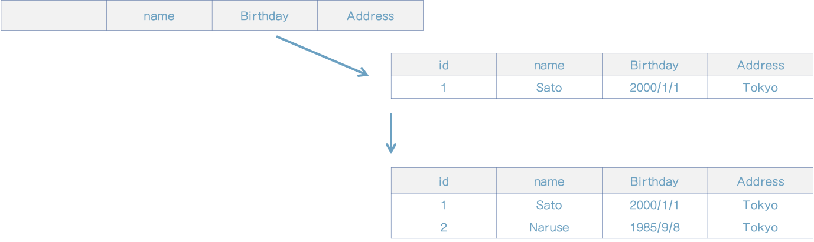

### 9.1 팩토리의 목적

지금 주변을 둘러보면 시야에 다양한 도구가 보일 것이다. 책상, 의자, 종이, 펜... 사람은 이렇 듯 온갖 도구에 둘러싸여 생활한다. 세상에는 수많은 도구가 있으나, 지금도 끊임없이 새로운 도구가 고안되고 있다.

사람이 상상하는 모든 것에 대한 도구가 고안되는 이유는 도구를 사용하는 방법만 알면 대부분 구조를 몰라도 도구의 장점을 그대로 누릴 수 있기 때문이다. 도구의 이러한 편리함은 강력한 힘이다. 프로그램에서도 도구의 힘은 강력하다.

객체 지향 프로그래밍에 쓰이는 클래스는 도구 그 자체다. 메서드의 사용 방법만 알면 클래스의 내부 구조를 몰라도 누구든 사용할 수 있다. 클래스의 이런 점은 개발자에게도 큰 도움이 된다.

그러나 도구는 그 편리함만큼이나 복잡한 구조를 갖는다.

컴퓨터를 예로 들면, 컴퓨터는 편리한 도구지만 매우 복잡한 구조를 갖는다. 여기서 말하고자 하는 바는 '복잡한 도구는 그만큼 만드는 과정도 복잡하다'는 것이다.

독자 여러분은 컴퓨터가 어떻게 만들어지는지 얼마나 알고 있는가?

복잡한 도구는 만드는 과정도 복잡하다. 그렇다면 도구를 만든 과정도 일종의 지식이라고 할수 있다. 프로그램에서도 이 점은 마찬가지여서 복잡한 객체는 객체를 생성하는 처리도 그만큼 복잡하다. 복잡한 객체를 생성하기 위한 복잡한 처리는 도메인 모델을 나타낸다는 객체의 애초 취지를 불분명하게 만든다. 하지만 그렇다고 객체 생성을 무작정 클라이언트에만 맡기는 것도 좋은 방법이 아니다. 객체를 생성하는 과정 자체는 도메인에 큰 의미가 없을지 몰라도, 도메인을 나타내기 위한 계층의 책임임에는 변함이 없기 때문이다.

여기서 바로 객체 생성 과정을 객체로 정의할 필요가 생긴다. 이렇게 객체 생성과 책임지는 객체를 마치 도구를 만드는 공장 과도 같다고 해서 '팩토리'라고 부른다. 팩토리는 객체의 생성 과정과 관련된 지식이 정리된 객체다.


### 9.2 번호 매기기를 구현한 팩토리의 구현 예

팩토리가 제 역할을 하는 간단한 예로 번호 매기기를 들 수 있다.

지금까지는 User 클래스의 인스턴스를 생성할 때 객체의 식별자로 GUID(globally unique identifier)를 사용했다(리스트 9-1).

[리스트 9-1] 사용자 객체의 식별자는 생성자 메서드에서 생성된다

```java
@Getter
public class User
{
    private UserId id;
    private UserName name;

    // 사용자를 최초 생성할 때 실행되는 생성자 메서드
    public User(UserName name) {
        if (name == null)
            throw new IllegalArgumentException("name : " + name);

        id = new UserId(UUID.randomUUID().toString());
        this.name = name;
    }

    // 사용자 객체를 복원할 때 실행되는 생성자 메서드
    public User(UserId id, UserName name) {
        if (id == null)
            throw new IllegalArgumentException("id : " + id);
        if (name == null)
            throw new IllegalArgumentException("name : " + name);

        this.id = id;
        this.name = name;
    }
  
  	(...생략...)
}
```

User 클래스는 생성자 메서드를 2개 갖추고 있다. UserId 객체를 인자로 받는 생성자 메서드는 사용자 객체를 복원하기 위한 용도이며, 나머지 다른 생성자 메서드는 사용자 객체를 최초 생성할 때 사용한다. 사용자 객체를 최초 생성할 때 함께 생성하는 UUID는 유일한 식별자로 사용할 수 있는 무작위 문자열만으로 생성자 메서드를 통해 객체를 만들어도 유일 식별자임이 보장된다.

그러나 시스템에 따라 식별자가 매겨지는 과정을 통과해야 하는 경우가 있다. 이렇게 번호를 매기는 처리는 어떻게 구현할까?

전통적인 방법으로는 시퀀스나 테이블을 이용하는 방법이 있다. 시퀀스를 이용해 번호를 매기게 User 클래스를 수정해 봤다(리스트 9-2).

[리스트 9-2] 번호 매기기 테이블을 이용해 식별자를 생성하는 예

```java
@Getter
public class User
{
    private UserId id;
    private UserName name;

    // 사용자를 최초 생성할 때 실행되는 생성자 메서드
    public User(UserName name) throws SQLException {
        String seqId;

        Connection conn = DriverManager.getConnection("url", "user", "password");
        PreparedStatement pstmt = conn.prepareStatement("SELECT seq = (NEXT VALUE FOR useSeq)");
        ResultSet resultSet = pstmt.executeQuery();
        if (resultSet.next()) {
            seqId = resultSet.getString("seq");
        } else {
            throw new SQLException();
        }

        id = new UserId(seqId);
        this.name = name;
    }
}
```

리스트 9-2는 그리 바람직한 코드가 아니다. 추상화 수준이 높은 개념이 User에 데이타베이스를 다루는 낮은 추상화 수준의 처리가 작성돼 있기 때문이다. 이러한 코드로 인해 발생하는 폐해는 이루 말할 수 없다. 단지 User 클래스의 인스턴스를 만드는 작업만으로 데이터베이스와 번호 매기기용 테이블이 필요하다. 직관적이지도 못하고 번거로운 작업이다.

테스트 목적으로 대충 인스턴스를 생성하고 싶을 때는 적당히 식별자를 붙여주고, 그렇지 않은 경우에는 데이터베이스에서 제대로 된 식별자를 매겨주게 하고 싶다. 팩토리는 바로 이런 경우에 유용하다.

번호 매기기를 상황에 따라 다르게 하고 싶다면 먼저 리스트 9-3과 같이 팩토리 인터페이스를 정의한다.

[리스트 9-3] 팩토리 인터페이스

```java
public interface IUserFactory {
    User create(UserName name) throws SQLException;
}
```

팩토리에는 UserName을 인자로 받아 User의 인스턴스를 반환하는 메서드가 정의되어 있는데, 앞으로 User 객체를 새로 만들 때는 생성자 메서드 대신 이 메서드를 사용한다.

User를 생성하는 처리는 리스트 9-3의 코드를 구현한 클래스가 맡아 줄 것이다. 리스트 9-4는 시퀀스를 이용해 번호를 매기는 팩토리의 구현이다.

[리스트 9-4] 시퀀스를 이용하는 팩토리

```java
public class UserFactory implements IUserFactory {
    @Override
    public User create(UserName name) throws SQLException {
        String seqId;

        Connection conn = DriverManager.getConnection("url", "user", "password");
        PreparedStatement pstmt = conn.prepareStatement("SELECT seq = (NEXT VALUE FOR useSeq)");
        ResultSet resultSet = pstmt.executeQuery();
        if (resultSet.next()) {
            seqId = resultSet.getString("seq");
        } else {
            throw new SQLException();
        }

        UserId id = new UserId(seqId);
        return new User(id, name);
    }
}
```

인스턴스를 생성하는 처리를 팩토리로 옮겼으니 User 클래스를 만들려면 반드시 외부에서 UserId를 전달받아야 한다. 이로 인해 UserId를 생성하던 User의 생성자 메서드가 불필요하게 됐다(리스트 9-5).

[리스트 9-5] User의 생성자 메서드가 하나로 줄어들었다

```java
@Getter
public class User
{
    private UserId id;
    private UserName name;

    public User(UserId id, UserName name) {
        if (id == null)
            throw new IllegalArgumentException("id : " + id);
        if (name == null)
            throw new IllegalArgumentException("name : " + name);

        this.id = id;
        this.name = name;
    }
  
  	(...생략...)
}
```

이제 User 클래스의 생성자 메서드에서 데이터베이스에 접속하는 코드가 사라졌다.

그리고 팩토리를 사용하면 UserApplicationService의 사용자 등록 처리 역시 인스턴스 생성을 팩토리에 위임하게 된다(리스트 9-6).

[리스트 9-6] 팩토리를 통한 인스턴스 생성

```java
public class UserApplicationService {
    private final IUserFactory userFactory;
    private final IUserRepository userRepository;
    private final UserService userService;

  	(...생략...)
  
    public void register(UserRegisterCommand command) throws SQLException {
        UserName userName = new UserName(command.getName());
        // 팩토리를 이용한 인스턴스 생성
        User user = userFactory.create(userName);

        if (userService.exists(user)) {
            throw new CanNotRegisterUserException("user: " + user);
        }

        userRepository.save(user);
    }
}
```

register 메서드를 테스트할 때는 데이터베이스 없이 인메모리로 동작하게 하면 좋을 것 같다. 그렇다면 리스트 9-7과 같이 팩토리를 구현한다.

[리스트 9-7] 인메모리로 동작하는 팩토리

```java
public class InMemoryUserFactory implements IUserFactory {
    private int currentId;

    @Override
    public User create(UserName name) throws SQLException {
        currentId++;

        return new User(
                new UserId(currentId+""),
                name
        );
    }
}
```

이 팩토리를 의존 관계 해소 설정에 포함시키면 테스트를 수행할 수 있다.


[칼럼] 팩토리의 존재감 인식시키기

> 팩토리를 만들었으니 앞으로는 객체를 생성할 때 팩토리를 이용할 거라고 생각할 것이다. 그러나 User 클래스의 코드만 봐서는 팩토리의 존재감을 느끼기 어렵다.
>
> [리스트 9-8] User 클래스의 정의만으로는 팩토리의 존재감을 느끼기 어렵다.
>
> ```java
> public class User {
> 	// 생성자 메서드가 있다는 것만 알 수 있다.
> 	public User(UserId id, UserName name);
> 	(...생략...)
> }
> ```
>
> 팩토리의 존재감을 좀 더 확실하게 느끼게 할 수 있는 방법이 있다. 먼저 패키지를 다음과 같이 구성한다.
>
> * snsdomain.models.users.User
> * snsdomain.models.users.IUserFactory
>
> 나중에 참여한 개발자가 snsdomain.models.users 패키지를 열어보면 User와 IUserFactory 클래스가 함께 있는 것을 보게 될 것이다.


#### 9.2.1 자동 번호 매기기 기능 활용하기

번호 매기기 기능을 구현할 때 데이터베이스에서 제공하는 자동 번호 매기기 기능을 무시하기가 어렵다.

SQL Server를 예로 들면, IDENTITY 속성을 적용한 칼럼은 레코드가 추가될 때마다 자동으로 번호가 매겨진다.




[그림 9-1] 자동 번호 매기기 기능

이 강력한 기능을 활용하면 코드가 어떻게 변화할까?

자동 번호 매기기는 데이터베이스에 객체를 저장할 때 ID가 부여된다. 그러므로 객체가 최초 생성될 때는 ID가 없는 상태로 생성된다. 그리고 객체가 데이터베이스에 저장될 때 ID가 생성되므로 식별자에 대한 세터가 필요하다. 이러한 요소는 객체를 불안정하게 만든다.

[리스트 9-9] 세터를 가진 클래스

```java
public class User {
  private UserName name;
  
  public User(UserName name) {
    this.name = name;
  }
  
  public void setUserId(UserId id) {
    this.id = id;
  }
}
```

엔터티는 식별자를 통해 식별되는 객체다. 객체를 데이터베이스에 저장할 때까지 이 식별자가 부여되지 않는다는 것은 자연스럽지 않고 범해서는 안되는 금기사항이다. 식별자가 부여되지 않은 상태에서 객체를 잘못 다루면 의도하지 않은 동작을 보일 것이다. 객체가 데이터베이스에 저장될 때까지 식별자가 부여되지 않았다는 점을 항상 의식하며 개발자가 세심하게 주의를 기울이는 수밖에 없다.

주의할 점은 또 있다. 식별자에 대한 세터가 있다는 점이다. 리스트 9-9에 나온 User 클래스의 id 속성에 대한 세터는 리포지토리에서만 식별자를 다룬다는 것을 전제로 만들어진 것이다. 그러나 코드만으로 이런 규칙을 알 수 없으니 사정을 모르는 개발자가 식별자를 바꾸는 코드를 작성할 가능성은 언제나 존재한다.

이들 문제점에서 공통적인 것은 개발자의 암묵적인 이해를 필요로 한다는 점이다. 그러나 이 암묵적인 이해는 강한 자제심을 발휘해야 지켜질 수 있다. 한마디로 '넘어서는 안될 선을 항상 신경써야' 하는 것이다.

자동 번호 매기기 기능을 사용하면 개발자가 지켜야 할 사항이 여럿 발생한다. 물로 이들 사항을 모두 감수하고 자동 번호 매기기 기능을 통해 식별자를 부여받는 선택지도 가능하다. 주의사항을 모두 숙지하고 팀 내 합의를 이룬다면 문제가 일어날 가능성은 그리 높지 않을 것이다.


#### 9.2.2 번호 매기기 메서드를 리포지토리에 두기

주제를 조금 벗어나지만, 리포지토리에 번호 매기기 메서드를 두는 패턴도 가능하다.

[리스트 9-10] 리포지토리에 번호 매기기 메서드 정의하기

```java
public interface IUserRepository {
    User find(UserId id);
    void save(User user);
    UserId nextIdentity();
}
```

nextIdentity 메서드는 새로운 생성자 UserId를 생성한다. 이 메서드를 사용하면 코드가 9-11과 같이 변경된다.

[리스트 9-11] 리포지토리의 번호 매기기 메서드를 이용한 사용자 등록 처리 구현

```java
public class UserApplicationService {
    private final IUserRepository userRepository;
  
    public void register(UserRegisterCommand command) throws SQLException {
        UserName userName = new UserName(command.getName());
        User user = new User(
                userRepository.nextIdentity(),
                userName
        );
    }
}
```

리포지토리에 번호 매기기 메서드를 두는 방법은 마음이 개운한 선택지다. 팩토리를 만들 정도로 수고롭지는 않으면서 식별자가 없는 불안정한 엔티티의 존재를 허용하지도 않는다.

그러나 리스트 9-12에서 보듯이 번호 매기기와 객체를 저장하기 위한 기술이 서로 어긋날 경우 조금 사정이 달라진다.

[리스트 9-12] 자동 번호 매기기와 객체 저장에 서로 다른 기술을 사용하는 경우

```java
public class UserRepository implements IUserRepository {
    private final NumberingApi numberingApi;

    // 객체 저장에 관계형 데이터베이스를 사용하지만
    @Override
    public User find(UserId id) throws SQLException {
        Connection conn = DriverManager.getConnection("url", "user", "password");
        PreparedStatement pstmt = conn.prepareStatement("SELECT * FROM users WHERE id = ?");
        pstmt.setString(1, id.getValue());
        ResultSet resultSet = pstmt.executeQuery();
        if (resultSet.next()) {
            String name = resultSet.getString("name");
            return new User(
                    id,
                    new UserName(name)
            );
        } else {
            throw null;
        }
    }

    // 자동 번호 매기기는 다른 기술을 사용함
    @Override
    public UserId nextIdentity()
    {
        Response response = numberingApi.request();
        return new UserId(response.getNextId());
    }
}

```

한 클래스의 정의 안에 여러 가지 기술 기반이 섞여 사용되고 있다. 이를 자연스럽지 않다고 보는 독자도 있을 것이고, 크게 신경 쓸 수준까지는 아니라고 판단하는 독자도 있을 것이다.

간편하다는 점에서 이러한 패턴을 쉽게 받아들일 수 있다는 것도 사실이다. 개발팀 내 합의가 이뤄진다면 이런 패턴을 적용한다고 해도 문제가 되지 않는다.

필자의 개인적인 느낌으로는 리포지토리는 애초 객체를 저장하고 복원하기 위한 객체라는 점에서 번호 매기기까지 리포티토리의 책임으로 확장하는 것은 좀 지나치다는 생각이다.


### 9.3 팩토리 역할을 하는 메서드

클래스 자체가 아닌 메서드가 팩토리 역할을 하는 경우도 있다. 이런 방법은 객체 내부의 데이터를 이용해 인스턴스를 생성할 필요가 있을 때 흔히 쓰인다.

서클 기능을 예로 들어보자. 서클은 동아리나 팀처럼 사용자가 소속되어 취미 등에 대한 의견을 나누는 모임이다. 서클에는 서클장의 역할을 맡는 사용자가 있다. 어떤 서클의 서클장이 누구인지에 대한 정보를 그 사용자의 사용자 ID를 통해 나타낸다고 하자. 이때의 코드는 리스트 9-13과 같을 것이다.

[리스트 9-13] 그룹 생성하기

```java
Circle circle = new Circle(
  user.getId(), // 게터를 통해 사용자 ID를 받아옴
  new CircleName("my circle")
)
```

서클의 서클장을 맡은 사용자 ID를 Circle 객체에 전달하려면 게터를 이용해야 한다. 게터는 이미 잘 알려져 있듯이 마냥 편하게 사용할 만한 것이 못된다.

내부 정보를 사용하지만 외부로 공개는 하지 않는다니 이 무슨 소리인가 싶지만, 의외로 아주 간단한 방법으로도 가능하다. 게터를 공개하는 대신 메서드로 인스턴스를 생성하고 반환값으로 내놓으면 된다(리스트 9-14).

[리스트 9-14] User 클래스의 메서드에서 Circle 클래스의 인스턴스 생성하기

```java
public class User {
    // 외부로 공개하지 않아도 된다
    private UserId id;

    public Circle createCircle(CircleName circleName) {
        return new Circle(
                id,
                circleName
        );
    }
}
```

이런 방법으로 인스턴스의 내부 정보를 전달할 수 있다.

이 방법이 옳은 것인지는 도메인을 어떤 관점에서 모델링했는지에 따라 달라진다. 사용자가 서클을 생성하는 것을 도메인 객체의 행위로 정의해야 한다면 이를 정당화할 수 있다.


### 9.4 복잡한 객체 생성 절차를 캡슐화하기

다형성의 장점을 누릴 수 있게 팩토리를 만들기도 하지만, 이와 달리 단순히 생성 절차가 복잡한 인스턴스를 만드는 코드를 모아둔 팩토리를 만드는 것도 좋은 습관이다.

원래대로라면 객체의 초기화는 생성자 메서드의 역할이다. 그러나 생성자 메서드는 단순함을 유지해야 한다. 생성자 메서드가 복잡해진다면 팩토리를 정의한다.

'생성자 메서드 안에 다른 객체를 생성하는가'라는 질문은 팩토리의 필요성을 나타내는 좋은 지표라고 할 수 있다. 만약 생성자 메서드가 다른 객체를 생성하고 있다면 이 객체가 변경됐을때 생성자 메서드도 함께 변경해야 할 우려가 있다. 그냥 다른 객체의 인스턴스를 생성하는 것뿐이라도 복잡도를 상승시킨다.

물론 모든 인스턴스를 팩토리에서 만들어야 한다는 말은 아니다. 생성 절차가 간단하다면 그냥 생성 메서드를 호출하는 쪽이 더 낫다. 여기서 말하는 '그냥 하던 대로 객체를 생성하지 말고 팩토리가 필요하지는 않은가 검토하는 습관을 들이자'는 것이다.


[칼럼] 도메인 설계를 완성하기 위해 필요한 요소

> 팩토리는 도메인에서 유래한 객체가 아니다. 이 점은 리포지토리와 같다. 그렇다면 팩토리나 리포지토리는 도메인과는 무관한 존재일까? 그렇지 않다.
>
> 객체의 생성은 도메인에서 유래한 것은 아니지만, 도메인을 표현하기 위해 필요한 요소다. 도메인을 표현하는 데 도움을 주는 팩토리와 리포지토리 등의 요소는 도메인 설계를 구성하는 요소가 된다.
>
> 도메인을 모델에 녹여내고 코드로 다시 모델을 표현하는 과정인 도메인 설계를 완성하려면 도메인 모델을 표현하지 않는 요소도 필요하다는 점을 알아두자.


### 9.5 정리

이번 장에서 번호 매기기를 소재로 팩토리의 유용함에 대해 알아봤다. 팩토리는 객체의 생애 주기의 시작 단계에서 자신의 역할을 수행한다.

팩토리를 통해 생성 절차가 복잡한 객체를 생성하면 코드의 의도를 더 분명히 드러낼 수 있다. 그리고 똑같은 객체 생성 코드가 이곳저곳 중복되는 것도 막을 수 있다.

팩토리를 이용해 객체 생성 절차를 캡슐화하는 것도 로직의 의도를 더 명확히 드러내면서 유연성을 확보할 수 있는 좋은 방법이다.

  

  

 