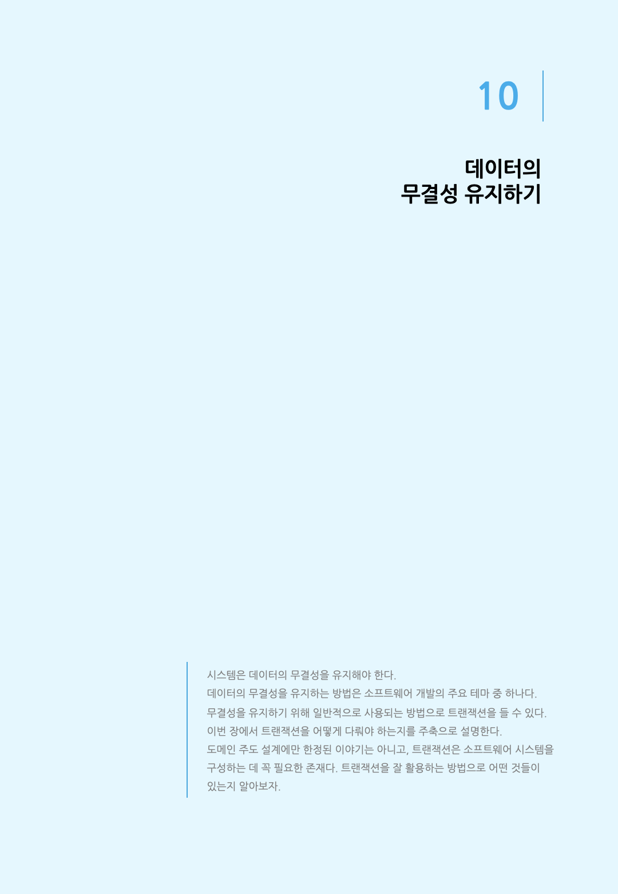
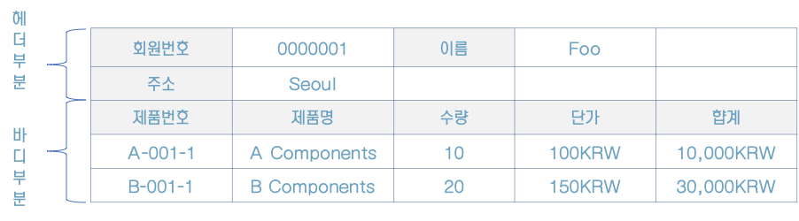
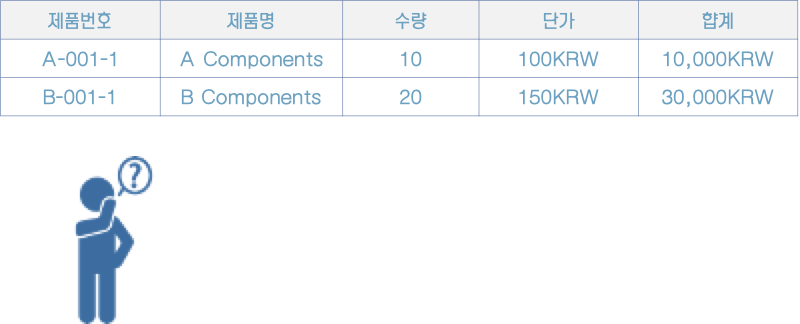
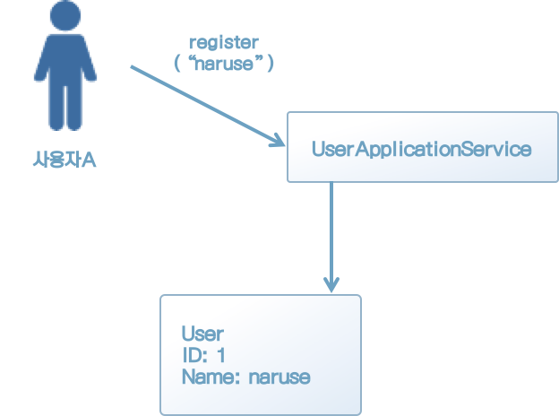
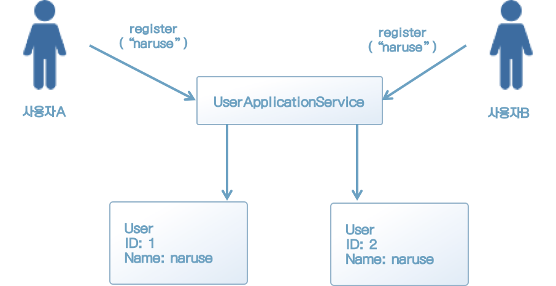
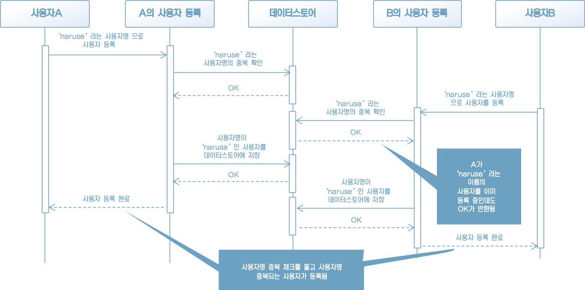
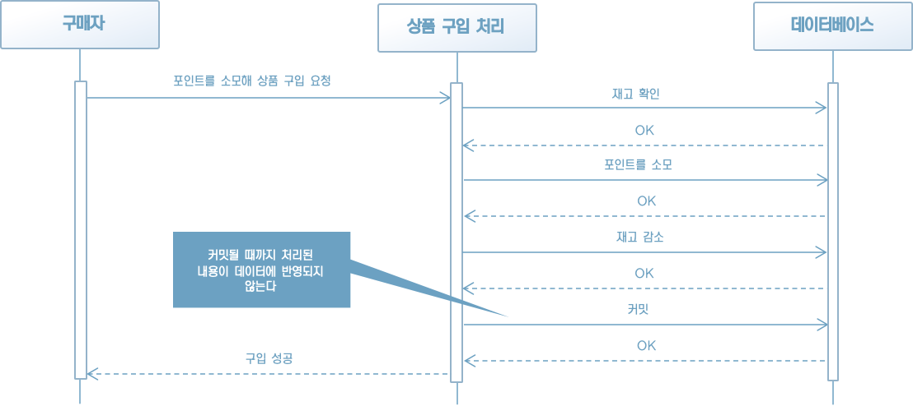

### 10.1 무결성이란 무엇인가

시스템이 수행하는 처리중에는 테이터의 무결성을 필요로 하는 것이 있다. 여기서 말하는 무결성이란 '서로 모순이 없고 일과적'이라는 뜻이다.

상품을 주문할 때 발생하는 주문 내역을 예로 들어 보자. 주문 내역은 헤더 부분과 바디 부분으로 구성되는데, 헤더 부분에는 주문자명, 주소 등의 정보가 기재되고 바디 부분에는 주문한 상품의 종류 및 수량이 기재된다(그림 10-1).




[그림 10-1] 주문 내역의 전체 내용

이때 헤더 부분과 바디 부분 중 어느 한쪽이라도 누락된다면 정상적인 주문서가 되지 못한다. 헤더 부분이 없으면 상품을 주문한 사람이 누구인지 알 수 없고, 바디 부분이 없으면 주문자에게 어떤 상품이 전달해야 하는지 알 수 없기 때문이다(그림 10-2). 주문 내역의 헤더와 바디는 항상 함께 존재해야 한다는 일관성이 필요하며 이것이 바로 무결성이다.




[그림 10-2] 바디 부분만 남은 주문 내역

물론 프로그램이 정상적으로 동작하는 한 주문 내역에서 헤더나 바디가 누락되는 일은 없을 것이다. 문제가 발생하는 것은 프로그램이 비정상 종료됐을 때다. 예를 들어 주문서를 작성하는 도중 헤더 부분을 저장하다가 프로그램이 종료됐다면 바디 부분이 저장되지 않았으니 데이터 스토어에는 바디 부분이 빠져 손상된 데이터만 남는다.

이번 장에서는 이런 문제를 방지하기 위해 데이터의 무결성을 유지하는 방법을 배운다. 데이터의 무결성은 도메인 주도 설계와 직접 관련된 주제는 아니지만, 소프트웨어를 만들 때는 반드시 데이터의 무결성을 유지해야 하는 만큼 배워둘 만한 가치가 있는 주제다.


### 10.2 치명적인 버그

지금까지 우리가 만든 소프트웨어에 사실 치명적인 버그가 있었다. UserApplicationService는 데이터 무결성을 망가뜨릴 수 있는 심각한 문제를 안고 있다.

이 버그는 사용자 등록 처리에 숨어있다. 사용자 등록 처리의 구현 코드를 다시 한번 살펴보자(리스트 10-1).

[리스트 10-1] 사용자 등록 처리 코드

```java
public class UserApplicationService {
    private final IUserFactory userFactory;
    private final IUserRepository userRepository;
    private final UserService userService;
  
  	(...생략...)

    public void register(UserRegisterCommand command) throws SQLException {
        UserName userName = new UserName(command.getName());
        User user = userFactory.create(userName);

        if (userService.exists(user)) {
            throw new CanNotRegisterUserException("user: " + user);
        }

        userRepository.save(user);
    }
}
```

사용자 등록 처리에는 '사용자명 중복을 허용하지 않음'이라는 중요한 규칙이 있다. 언뜻 보면 지금의 코드도 이 규칙을 준수하는 것처럼 보인다. 그러나 이 코드는 본래 의도대로 동작하지 않는 특정한 조건이 있다.

어떤 사람이 새로 사용자 등록을 하려 한다고 하자. 이 사람이 등록하기를 원하는 사용자명은 'naruse'다. 첫 단계에서는 'naruse'라는 사용자명을 갖는 사용자가 없기 때문에 코드가 제대로 동작한다.




[그럼 10-3] 사용자 등록 성공

이때, 도시에 또 다른 사용자가 사용자 등록을 시도한다. 정말 우연히도 이 사람이 등록하려는 사용자명도 'naruse'다.

첫 번째 사용자가 사용자 등록 처리를 실행하면 먼저 사용자명 중복 체크를 한 다음 리포지토리에 인스턴스 저장을 요청한다. 리포지토리에 인스턴스를 저장하는 도중 두 번째 사용자가 사용자명 중복 체크를 시도하면 아직 인스턴스 저장이 끝나지 않았으므로 중복 체크에서 걸리지 않는다. 결과적으로 'naruse'라는 사용자명을 갖는 사용자가 여러 명 등록되는 일이 벌어진다.




[그림 10-4] 사용자명이 중복되는 사용자가 생긴다.


지금 일어난 일을 다시 정리해 보자. 그림 10-5는 이 문제가 발생하는 과정을 시간 순서대로 나타낸 것이다.




[10-5] 문제가 발생한 과정


치명적 버그의 내용을 살펴봤다.

사용자가 순서대로 한 명씩 사용자 등록을 시도한다면 문제가 발생하지 않겠지만, 웹 애플리케이션에서 한 번에 한 명씩만 시스템을 사용한다는 것은 불가능하다. 데이터의 무결성을 유지할 별도의 방법을 강구해야 한다.


### 10.3 방법1 - 유일 키 제약

사용자명이 중복되지 않게 데이터 무결성을 유지할 수 있는 방법으로 유일 키를 이용한 방법을 들 수 있다.

유일키(unique key) 제약은 데이터베이스의 특정 칼럼값이 각각 유일한 값이 되게 보장하는 기능이다. 유일 키 제약을 위반하는 레코드를 추가하려고 하면 에러가 발생한다.

유일 키 제약은 데이터의 무결성을 유지하기 위한 매우 편리한 기능이다.


#### 10.3.1 유일 키 제약에 중복 확인을 맡겼을 경우의 문제점

유일 키 제약은 소프트웨어가 파국을 맞을 수 있는 위험을 제거해주는 강력한 수단이다. 그러나 잘못 사용하면 코드의 표현력이 저하된다. 다음 사례를 한번 살펴보자.

유일 키 제약을 적용하면 프로그램이 유효하지 않은 사용자명을 탐지하고 강제 종료되므로 중복 확인할 필요가 없어진다. 따라서 사용자 등록 처리에 대한 코드를 리스트 10-2와 같이 간단하게 할 수 있지 않을까 하는 생각이 들 것이다.

[리스트 10-2] 유일 키 제약을 통해 사용자명의 중복이 사라져 중복 확인이 불필요한 상황

```java
public class UserApplicationService {
    private IUserFactory userFactory;
    private IUserRepository userRepository;

    public void register(UserRegisterCommand command) throws SQLException {
        UserName userName = new UserName(command.getName());
        User user = userFactory.create(userName);

        userRepository.save(user);
    }
}
```

유일 키 제약을 적용했기 때문에 이 코드에서는 사용자명 중복이 없다는 것이 보장된다. 결과만 보자면 리스트 10-2의 코드는 데이터 무결성을 잘 지키는 코드라고 할 수 있다. 리스트 10-2의 코드와 비교하면 분량 면에서도 더 짧다. 이것이 이해하기 쉽다는 생각이 들었다면 위험 신호다.

사용자명 중복을 확인하는 과정은 중요도가 높다. 리스트 10-2의 코드를 보고 사용자명 중복이 허용되지 않는다는 정보를 얻을 수 있겠는가? 아무리 숙련된 개발자라도 코드에 드러나지 않는 매커니즘을 알아챌 수는 없다.

문제는 이것뿐만이 아니다. 유일 키 제약 기능은 특정 데이터베이스의 기술이므로 특정 기술 기반에 의존하는 부분이 생기는 것도 문제다.

7장에서 비즈니스 로직이 특정한 기술에 의존해서는 안 된다고 설명했다. 사용자명의 중복이 없음을 보장받기 위한 수단으로 관계형 데이터베이스의 유일 키 제약을 이용하는 것이 바로 특정 기술에 의존하는 것이다. 리스트 10-2는 도메인에 있어 매우 중요한 규칙과 관련된 처리가 원래 있어야 할 장소에서 이탈한 상태다.

이로 인해 일어날 수 있는 문제는 어떤 것이 있을까? 중복의 기준이 사용자명에서 이메일 주소로 바뀐 경우를 다시 떠올려 보자. 리스트 10-2의 코드만 봐서는 관계형 데이터베이스의 테이블 제약을 변경해야 한다는 것을 알 수 없다.


#### 10.3.2 유일 키 제약의 올바른 활용

도메인 규칙 준수를 위해 유일 키 제약을 이용하는 것은 좋은 방법이 아니다. 그렇다면 유일 키 제약은 전혀 쓸모가 없는 것일까? 그렇게 생각하는 것도 옳지 않다.

버그는 대부분 개발자의 착각에서 비롯된다. 예를 들어 사용자 중복의 기준을 사용자명이 아니라 이메일 주소라고 잘못 알고 있었다고 생각해 보자(리스트 10-3).

[리스트 10-3] 사용자 중복 기준을 이메일 주소로 잘못 알고 구현한 코드

```java
public class UserApplicationService {
    private final IUserRepository userRepository;

    (...생략...)
  
  	public boolean exists(User user) {
      User duplicatedUser = userRepository.find(user.getMail());
      return duplicatedUser != null;
    }
}
```

이때 사용자명 칼럼에 유일 키 제약을 걸었다면 사용자명이 중복된 경우 프로그램이 예외를 발생시키며 종료된다. 이는 시스템을 강력하게 보호하는 힘이 될 수 있다.

유일 키 제약은 규칙을 준수하는 주 수단이 아니라 안전망 역할로 활용해야 한다. 유일 키 제약만 믿고 리스트 10-2와 같이 중복 확인을 게을리해서는 안 된다.

소프트웨어의 안전성을 더 향상시킬 수 있게 리스트 10-1과 같은 코드와 유일 키 제약을 함께 사용하자.


### 10.4 방법2 - 트랜잭션

데이터의 무결성을 유지하기 위한 수단으로 데이터베이스의 트랜잭션 기능이 더 일반적이다. 트랜잭션은 서로 의존하는 조작을 한꺼번에 완료하거나 취소하는 방법으로 데이터의 무결성을 지킨다.

전자상거래 사이트에서 사용자가 포인트를 소모해 상품을 구입하는 처리를 예로 생각해 보자. 시스템은 먼저 사용자의 포인트를 소모량만큼 감소시킨다. 이때 주문하려는 상품의 재고가 부족하다면 이 시점에서 처리에 실패한다. 결과적으로 사용자의 포인트만 감소하고 주문은 실패한다. 곧 고객센터에 클레임이 들어올 것이다.

트랜잭션은 바로 이런 문제를 해결해준다. 트랜잭션 기능 적용 중에는 데이터베이스에 대한 조작이 데이터에 바로 반영되지 않는다. 실제로 데이터에 반영하려면 커밋해야 한다.

전자상거래 사이트에서 사용자가 포인트를 소모해 상품을 구입하는 예를 트랜잭션에 적용해 다시 설명하면, 구입을 해도 사용자의 포인트가 즉시 소모되지 않는다. 그러므로 처리 도중에 프로그램이 비정상 종료해도 사용자가 보유한 포인트가 소모되지 않는다. 실제로 포인트가 소모되는 시점은 커밋 후 처리 결과가 데이터에 반영될 때다(그림 10-6).




[그림 10-6] 커밋해야 실제 데이터에 반영된다.


#### 10.4.1 트랜잭션을 사용한 패턴

트랜잭션을 이용하면 사용자 등록 처리 코드의 문제를 해결할 수 있을 듯 하다. 바로 코드를 수정해 보자. 트랜잭션은 데이터베이스 커넥션을 통해 사용해야 한다. 리포지토리가 데이터베이스 커넥션 객체를 전달받고 사용하는 역할을 맡는다(리스트 10-4).

[리스트 10-4] 트랜잭션이 시작된 커넥션 사용하기

```java
public class UserRepository implements IUserRepository {
	// 인자로 전달받은 데이터베이스 커넥션
    private final Connection connection;

    public UserRepository(Connection connection) {
        this.connection = connection;
    }

    public void save(User user) throws SQLException {
		connection.setAutoCommit(false);
        PreparedStatement pstmt = connection.prepareStatement(
                "MERGE INTO users USING (" +
                        "   SELECT :id AS id, :name AS name" +
                        ") AS data " +
                        "ON users.id = data.id" +
                        "WHEN MATCHED THEN" +
                        "   UPDATE SET name = data.name " +
                        "WHEN NOT MATCHED THEN" +
                        "   INSERT (id, name)" +
                        "   VALUES (data.id, data.name)"
        );
        pstmt.setString(1, user.getId().getValue()));
        pstmt.setString(2, user.getName().getValue()));
        pstmt.executeUpdate();
      	connection.commit();
    }
    
    (...생략...)
}
```

트랜잭션 시작 및 커밋을 제어하기 위해 UserApplicationService 역시 Connection을 전달받게 한다(리스트 10-5).

[리스트 10-5] 생성자 메서드를 통해 트랜잭션을 전달 받는다.

```java
public class UserApplicationService {
  	// 리포지토리가 가진 것과 같은 커넥션 객체
    private final Connection connection;
    private final IUserFactory userFactory;
    private final IUserRepository userRepository;
    private final UserService userService;

    public UserApplicationService(
            Connection connection,
            UserService userService,
            IUserFactory userFactory,
            IUserRepository userRepository
    ) {
        this.connection = connection;
        this.userService = userService;
        this.userFactory = userFactory;
        this.userRepository = userRepository;
    }
  
	(...생략...)
}
```

이제 준비가 끝났다. 사용자 등록 처리에 트랜잭션을 적용해 데이터의 무결성을 확보하자(리스트 10-6).

[리스트 10-6] 트랜잭션을 적용하게 수정된 사용자 등록 처리

```java
public class UserApplicationService {
    private final Connection connection;
    private final IUserFactory userFactory;
    private final IUserRepository userRepository;
    private final UserService userService;

  	(...생략...)

    public void register(UserRegisterCommand command) throws SQLException {
        connection.setAutoCommit(false);

        UserName userName = new UserName(command.getName());
        User user = userFactory.create(userName);

        if (userService.exists(user)) {
            throw new CanNotRegisterUserException("user: " + user);
        }

        userRepository.save(user);
        //처리가 완료되면 커밋
        connection.commit();
    }
  
	  (...생략...)
}
```

리스트 10-6의 코드는 트랜잭션을 통해 데이터의 무결성을 확보한다. 동시에 같은 사용자명으로 사용자 등록을 시도하는 일이 벌어져도 한쪽만 등록되고 다른 한쪽은 등록에 실패할 것이다. 

그러나 새로운 문제도 생긴다. UserApplicationService가 인프라의 객체 Connection에 대해 의존하게 됐다는 점이다.

Connection은 관계형 데이터베이스에 기초한 객체다. UserApplicationService가 관계형 데이터베이스를 사용하는 동안에는 어색함이 없지만, IUserRepository의 구현채로 InMemoryUserRepository를 사용한다면 관계형 데이터베이스의 사용을 전제로 하는 Connection은 활용할 수 없게 된다.

특정 기술에 의존하는 코드의 위험성은 지금까지 여러 번 강조했다. 이제 와서 어떤 위험성을 순순히 받아들일 수는 없다. 이번에는 데이터 무결성을 유지하면서도 특정 기술에 의존하지 않는 패턴을 소개하겠다.


#### 10.4.2 트랜잭션 범위를 사용하는 패턴

트랜잭션을 통해 데이터 무결성을 확보하는 방법이 데이터베이스에만 한정되는 것은 아니다.

데이터 무결성을 확보하는 것 자체는 분명히 추상화 수준이 낮은 특정 기술 기반의 역할이다. 그러나 비즈니스 로직의 입장에서 생각하면 무결성을 지키는 수단이 무엇이냐는 그리 중요하지 않다. 데이터 무결성 자체가 특정 기술에 뿌리를 둘 만큼 추상화 수준이 낮은 개념이 아니다. 따라서 비즈니스 로직에는 데이터 무결성을 확보하기 위한 구체적인 구현 코드보다는 '이 부분에서 데이터 무결성을 확보해야 한다'는 것을 명시적으로 보여주는 코드가 담겨야 한다.


#### 10.4.3 AOP를 사용하는 패턴

"C# 외의 프로그래밍 언어에서는 어떻게 해야 하지?" 라는 의문을 품은 사람도 당연히 있을 것이다. 이런 걱정은 할 필요가 없다. 객체 지향 프로그래밍 언어의 주류라고 할 수 있는 자바에서도 관점 지향 프로그래밍(aspect oriented programming, AOP)을 적용해 똑같은 방법을 사용할 수 있다.

AOP에서는 소스 코드를 수정하지 않고도 새로운 처리를 추가할 수 있다. 구체적인 예를 한번 살펴보자. 리스트 10-8은 UserApplicationService를 자바로 구현한 코드다.

[리스트 10-8] Transactional 애노테이션을 사용해 자바로 구현한 UserApplicationService

```java
public class UserApplicationService {
    private final IUserFactory userFactory;
    private final IUserRepository userRepository;
    private final UserService userService;

  	(...생략...)

    @Transactional
    public void register(UserRegisterCommand command) throws SQLException {
        UserName userName = new UserName(command.getName());
        User user = userFactory.create(userName);

        if (userService.exists(user)) {
            throw new CanNotRegisterUserException("user: " + user);
        }

        userRepository.save(user);
    }
}
```

@Transactional 애노테이션은 트랜잭션 범위와 같은 기능을 제공한다. 메서드가 정상적으로 종료되면 커밋을 실행하며 실행 도중 예외가 발생하면 롤백이 실행된다.

필자는 개인적으로 트랜잭션 범위보다 AOP를 이용한 이 코드가 더 낫다고 생각한다. 왜냐면 트랜잭션 범위는 해당 부분에서 데이터 무결성이 필요하다는 것을 메서드의 처리 내용을 확인해야만 알 수 있다. 반면 애노테이션을 이용한 방법은 애노테이션만 봐도 그 메서드가 데이터 무결성을 필요로 한다는 것을 알 수 있다.


#### 10.4.4 유닛오브워크를 사용하는 패턴

유닛오브워크(UnitOfWork) 패턴도 트랜잭션을 다루기 위한 목적으로 사용할 수 있다.

유닛오브워크는 어떤 객체의 변경 사항을 기록하는 객체다. 객체를 읽어 들일 때 유닛오브워크가 객체의 상태를 기록한다. 대상 객체가 변경되거나 삭제돼도 유닛오브워크가 이를 모르는 상태에서는 데이터스토어에 객체의 변화가 반영되지 않는다. 커밋을 호출해야 그때까지 있었던 변경 사항이 데이터스토어에 반영된다. 이러한 패턴을 적용하면 퍼시스트턴시 대상이 되는 객체의 생성, 변경, 삭제 등의 동작이 모두 유닛오브워크를 통하게 된다.

유니오브워크는 리스트 10-9와 같이 정의된다.

[리스트 10-9] 유닛오브워크의 정의 예

```java
public class UnitOfWork {
    public void registerNew(Object value);
    public void registerDirty(Object value);
    public void registerClean(Object value);
    public void registerDeleted(Object value);
    public void commit(Object value);
}
```

리스트 10-9에서 이름이 reigster로 시작하는 메서드는 인스턴스의 상태가 변경될 때마다 그 내용을 기록한다. 그 다음 commit 메서드가 호출되면 그때까지 기록했던 변경 사항을 정리해 데이터스토어에 반영한다.

유닛오브워크를 사용하려면 리스트 10-10과 같이 엔티티의 기반 클래스를 만들어 마킹할 수 있게 한다.

[리스트 10-10] 마킹 기능을 제공하는 엔티티의 기반 클래스

```java
public abstract class Entity {
    protected void markNew() {
        unitOfWork.getCurrent().registerNew(this);
    }

    protected void markClean() {
        unitOfWork.getCurrent().registerClean(this);
    }

    protected void markDirty() {
        unitOfWork.getCurrent().registerDirty(this);
    }

    protected void markDeleted() {
        unitOfWork.getCurrent().registerDeleted(this);
    }
}
```

엔티티는 리스트 10-10의 기반 클래스를 상속하며 데이터가 변경될 때 그 변경에 해당하는 마킹을 한다(리스트 10-11).

[리스트 10-11] 데이타가 변경될 때 그 변경에 해당하는 마킹을 한다.

```java
// 엔티티는 리스트 10-10의 클래스를 상속한다
public class User extends Entity {
    private UserName name;

    public User(UserName name) {
        if (name == null)
            throw new IllegalArgumentException("name : " + name);
        this.name = name;

        markNew();
    }

    public void changeName(UserName name) {
        if (name == null)
            throw new IllegalArgumentException("name : " + name);
        this.name = name;
        markDirty();
    }
}
```

이렇게 객체의 변경 이력을 수집하고 커밋을 호출할 때 이 내용을 정리해 실행한다. 이런 과정이 적용된 사용자 등록 처리 코드는 리스트 10-12와 같다.

[리스트 10-12] 유닛오브워크 패턴이 적용된 사용자 등록 처리

```java
public class UserApplicationService {
  	// 유닛오브워크 객체
    private final UnitOfWork unitOfWork;
    private final IUserFactory userFactory;
    private final IUserRepository userRepository;
    private final UserService userService;

    public UserApplicationService(
            UnitOfWork unitOfWork,
            UserService userService,
            IUserFactory userFactory,
            IUserRepository userRepository
    ) {
        this.unitOfWork = unitOfWork;
        this.userService = userService;
        this.userFactory = userFactory;
        this.userRepository = userRepository;
    }

    public void register(UserRegisterCommand command) throws SQLException {
        UserName userName = new UserName(command.getName());
        User user = userFactory.create(userName);

        if (userService.exists(user)) {
            throw new CanNotRegisterUserException("user: " + user);
        }

        userRepository.save(user);

        // 변경 결과가 반영되었음을 유닛오브워크에 알림
        unitOfWork.commit();
    }
  
  	(...생략...)
}
```

유닛오브워크의 커밋은 예제 코드에서 보듯이 개발자가 명시적으로 호출하는 경우도 있지만 처리가 실행된 후 묵시적으로 실행할 수도 있다. 커밋 처리가 여러 곳에서 사용될 것임을 생각하면 묵시적으로 실행되는 쪽이 더 나을 수 있다. 이런 경우에는 AOP를 적용해 메서드를 실행한 후 자동으로 커밋하게 한다.

...


#### 10.4.5 트랜잭션으로 인한 락(lock)

데이터베이스가 제공하는 트랜잭션은 일관성 유지를 위해 데이터에 락(lock)을 건다. 트랜잭션을 사용할 때는 이때 일어나는 락의 범위를 항상 염두에 둬야 한다.

트랜잭션으로 인한 락은 범위를 최소한으로 해야 한다. 락의 범위가 너무 넓어지면 그에 비례해 처리의 실패 가능성이 높아진다.

1개의 트랜잭션으로 저장하는 객체의 수를 1개로 제한하고 객체의 크기를 가능한 한 줄이는 방법으로 락의 범위를 최소화할 수 있다.


### 10.5 정리

이번 장은 데이터 무결성을 유지할 수 있는 트랜잭션을 다루는 방법을 배웠다.

본문에서 다양한 선택지를 제시했는데, 어느 것을 사용하더라도 원하는 목적을 달성할 수 있다. 만약 작업하는 환경에서 본문에서 소개한 방법이 제공되지 않는다고 해도 방법 자체를 이해한다면 직접 구현할 수 있다. 현재 프로젝트에 어떤 방법이 더 적합한지 고려해 좋은 선택을 하기 바란다.

다음 장에서는 지금까지 배운 내용을 복습하며 새로운 기능을 구현해 볼 것이다.

  

  

 