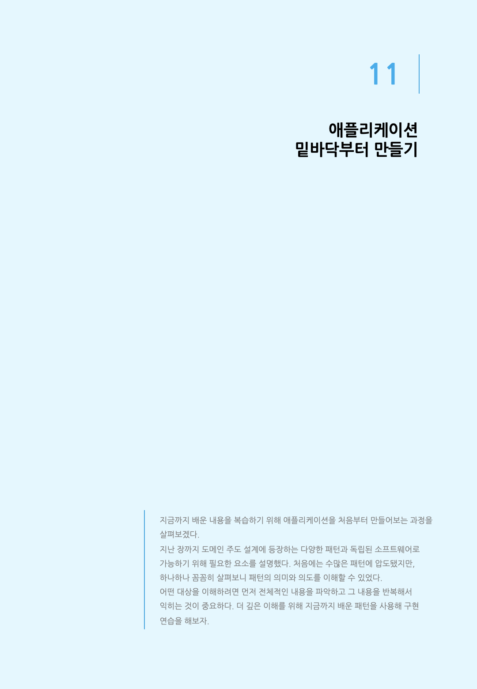
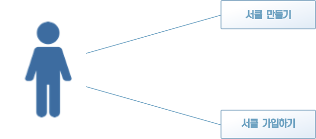
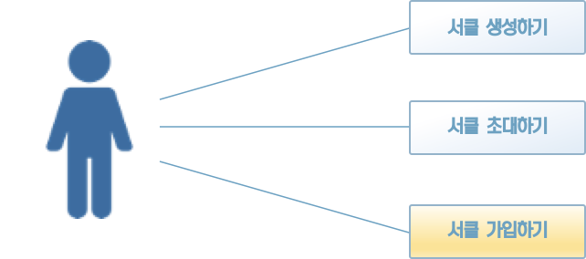

### 11.1 애플리케이션을 만드는 과정

이번 장에서 지금까지 배운 패턴을 사용해 새로운 기능을 애플리케이션에 추가해 볼 것이다. 그 전에 애플리케이션을 만들면서 따를 과정을 가볍게 훑어보자.

가장 먼저 확인할 것은 어떤 기능이 필요한가 하는 것이다. 어떤 기능이 필요한지를 알아야 개발을 시작할 수 있다. 요구 사항에 따라 어떤 기능이 추가로 필요한지 고민해 본다.

추가할 기능을 결정했다면 그 다음에는 그 기능의 기반이 될 유스케이스를 수립한다. 때에 따라서는 기능을 구현하기 위해 여러 개의 유스케이스가 필요할 수도 있다.

필요한 유스케이스를 모두 수립한 다음, 도메인 개념과 규칙으로부터 다시 애플리케이션에 필요한 지식을 추출해 도메인 객체를 정의한다.

그리고 도메인 객체로 유스케이스를 실제 기능으로 제공할 애플리케이션 서비스를 구현한다.

다른 과정으로도 애플리케이션을 만들 수 있지만, 여기서는 이 과정을 따를 것이다.


### 11.2 어떤 기능을 구현할까

지금까지는 SNS의 사용자 기능을 소재 삼아 내용을 설명했다. 이 기능에서는 사용자 등록을 마치고 나면 더이상 할 일이 없다. 그래서 이번에는 사용자끼리의 교류를 활성화하게 서클 기능을 만들어보려고 한다.

서클은 같은 취미를 갖는 사용자끼리 교류하기 위해 결성하는 그룹이다. 스포츠를 같이 하기 위한 서클부터 보드게임을 함께 하기 위한 서클까지 다양한 목적으로 서클을 만들 수 있다. 서클을 다른 말로 하면 클럽, 길드, 팀이라고 부를 수 있다.


#### 11.2.1 서클 기능 분석하기

서클 기능을 구현하기 위해 필요한 유스케이스는 '서클 만들기'와 서클 가입하기'다(그림 11-1).




[그림 11-1] 서클 기능과 관련된 유스케이스

'서클 탈퇴하기'와 '서클 해체하기'같은 유스케이스도 가능하겠지만, 여기서는 그림 11-1의 유스케이스만 구현한다.

그다음 서클의 전제조건을 살펴보자. 서클에는 다음과 같은 규칙이 적용된다.

* 서클명의 길이는 3글자 이상 20글자 이하여야 한다.
* 서클명은 중복되지 않아야 한다.
* 서클에 소속된 사용자의 수는 서클장과 사용자를 포함해 최대 30명이다.

이 규칙에 어긋나지 않게 두 가지 유스케이스를 구현할 것이다.


### 11.3 서클에 대한 지식을 담은 객체 만들기

서클과 관련된 지식과 규칙이 정해졌으니 이들을 코드로 나타낼 차례다.

우선 서클을 구성하는 요소부터 정의한다. 서클은 생애주기를 갖는 객체이므로 엔티티가 된다. 생애주기를 표현하려면 식별자가 있어야 한다. 식별자는 값이므로 값 객체로 구현한다(리스트 11-1).

[리스트 11-1] 서클의 식별자 역할을 할 값 객체의 정의

```java
@Getter
public class CircleId {
    private String value;

    public CircleId(String value) {
        if (value == null)
            throw new IllegalArgumentException("value: " + value);

        this.value = value;
    }
}
```

그리고 서클에는 이름을 붙일 수 있다. 서클명을 나타낼 값 객체도 정의하자. 서클명에 대한 규칙을 위반하는 이상값을 발견하면 예외를 발생시킨다(리스트 11-2).

[리스트 11-2] 서클명을 나타내는 값 객체의 정의

```java
@Getter
@EqualsAndHashCode
public class CircleName {
    private String value;

    public CircleName(String value) {
        if (value == null)
            throw new IllegalArgumentException("value: " + value);
        if (value.length() < 3)
            throw new IllegalArgumentException("서클명은 3글자 이상어야야 함: " + value);
        if (value.length() > 20)
            throw new IllegalArgumentException("서클명은 20글자 이하어야야 함: " + value);

        this.value = value;
    }
}
```

서클명 클래스는 '서클명의 길이는 3글자 이상 20글자 이하여야 한다'는 규칙을 포함하고 있다. 또 '서클명은 중복되지 않아야 한다'는 규칙을 준수하도록 미리 다른 서클명과 비교하게 되어 있다.

이들 값 객체를 이용해 다시 생애주기를 갖는 서클 엔티티를 정의한다(리스트 11-3).

[리스트 11-3] 서클을 나타내는 엔티티

```java
@Getter
@Setter
public class Circle {
    private CircleId id;
    private CircleName name;
    private User owner;
    private List<User> members;

    public Circle(CircleId id, CircleName name, User owner, List<User> members) {
        if (id == null)
            throw new IllegalArgumentException("id : " + id);
        if (name == null)
            throw new IllegalArgumentException("name : " + name);
        if (owner == null)
            throw new IllegalArgumentException("owner : " + owner);
        if (members == null)
            throw new IllegalArgumentException("members : " + members);

        this.id = id;
        this.name = name;
        this.owner = owner;
        this.members = members;
    }
}
```

서클은 서클장에 해당하는 사용자를 나타내는 Owner 속성과 서클에 소속한 사용자의 목록을 나타내는 Members 속성을 갖는다.

그 다음 서클 객체에 퍼시스턴시를 제공할 리포지토리를 정의한다(리스트 11-4).

[리스트 11-4] 서클 리포지토리

```java
public interface ICircleRepository {
    void save(Circle circle);
    Circle find(CircleId id);
    Circle find(CircleName name);
}
```

유스케이스를 로직으로 구현하는 단계에서 리포지토리를 벌써 구현할 필요는 없다. 리포지토리 구현은 뒤로 미루고 로직을 구현하는데 집중한다.

서클 객체의 생성을 맡을 팩토리도 같은 방법으로 정의한다(리스트 11-5).

[리스트 11-5] 서클 팩토리

```java
public interface ICircleFactory {
    Circle create(CircleName name, User owner);
}
```

또 서클은 서클명이 중복되지 않아야 한다. 중복에 대한 기준 및 처리를 리스트 11-3에서 본 Circle 클래스에 맡기는 것은 자연스럽지 못하다. 지금껏 예제로 삼았던 사용자 기능에서처럼 중복 기준 및 처리는 도메인 서비스로 정의한다(리스트 11-6).

[리스트 11-6] 서클 중복 확인 및 처리를 맡는 도메인 서비스

```java
public class CircleService {
    private final ICircleRepository circleRepository;

    public CircleService(ICircleRepository circleRepository) {
        this.circleRepository = circleRepository;
    }

    public boolean exists(Circle circle) {
        Circle duplicated = circleRepository.find(circle.getName());
        return duplicated != null;
    }
}
```

이것으로 값 객체, 엔티티, 도메인 서비스까지 객체 정의가 끝났다. 이들 객체를 사용해 유스케이스를 구현하자.


### 11.4 유스케이스 구현하기

이제 본격적으로 유스케이스를 구현할 차례다. 서클을 생성하는 처리부터 구현하겠다.

커맨드 객체를 먼저 정의한다(리스트 11-7).

[리스트 11-7] 서클 생성을 위한 커맨드 객체

```java
@Getter
public class CircleCreateCommand {
    private String userId;
    private String name;

    public CircleCreateCommand(String userId, String name) {
        this.userId = userId;
        this.name = name;
    }
}
```

클라이언트는 이 커맨드 객체를 이용해 서클을 생성하는 사용자(서클장)의 식별자와 서클명을 지정한다.

커맨드 객체를 받아 실제로 서클 생성 처리를 수행하는 코드는 리스트 11-8과 같다.

[리스트 11-8] 애플리케이션 서비스에 서클 생성 처리 구현하기

```java
public class CircleApplicationService {
    private final ICircleFactory circleFactory;
    private final ICircleRepository circleRepository;
    private final CircleService circleService;
    private final IUserRepository userRepository;

    public CircleApplicationService(
            ICircleFactory circleFactory,
            ICircleRepository circleRepository,
            CircleService circleService,
            IUserRepository userRepository) {
        this.circleFactory = circleFactory;
        this.circleRepository = circleRepository;
        this.circleService = circleService;
        this.userRepository = userRepository;
    }

    public void create(CircleCreateCommand command) {
        UserId ownerId = new UserId(command.getUserId());
        User owner = userRepository.find(ownerId);

        if (owner == null) {
            throw new UserNotFoundException("서클장이 될 사용자가 없음: " + ownerId);
        }

        CircleName name = new CircleName(command.getName());
        Circle circle = circleFactory.create(name, owner);

        if (circleService.exists(circle)) {
            throw new CanNotRegisterCircleException("이미 등록된 서클임: " + circle.getName());
        }

        circleRepository.save(circle);
    }
}
```

서클 생성의 첫 단계는 서클장 역할을 맡을 사용자를 찾는 것이다. 서클장의 존재가 확인되면 서클을 생성하고 중복 확인에 들어간다. 서클명이 중복되지 않음이 확인되면 리포지토리에 서클 객체의 저장을 요청하고 서클 생성이 끝난다. 서클 생성 처리는 트랜잭션 범위를 적용해 데이터 무결성을 유지한다.

그 다음으로 CircleApplicationService에 사용자의 서클 가입 처리를 추가한다. 이번에도 먼저 커맨드 객체를 정의한다(리스트 11-9).

[리스트 11-9] 서클 가입 처리를 위한 커맨드 객체

```java
@Getter
public class CircleJoinCommand {
    private String userId;
    private String circleId;

    public CircleJoinCommand(String userId, String circleId) {
        this.userId = userId;
        this.circleId = circleId;
    }
}
```

서클에 가입하려는 사용자의 식별자와 가입 대상 서클의 식별자로 서클 가입에 필요한 정보를 지정한다.

이 객체를 사용해 구현한 서클 가입 코드를 리스트 11-10에 실었다.

[리스트 11-10] 애플리케이션 서비스에 구현한 서클 가입 처리

```java
public class CircleApplicationService {

		(...생략...)
  
  	public void join(CircleJoinCommand command) {
        UserId memberId = new UserId(command.getUserId());
        User member = userRepository.find(memberId);
        if (member == null) {
            throw new UserNotFoundException("서클에 가입할 사용자를 찾지 못했음: " + member.getName());
        }

        CircleId id = new CircleId(command.getCircleId());
        Circle circle = circleRepository.find(id);

        if (circle == null) {
            throw new UserNotFoundException("가입할 서클을 찾지 못했음: " + circle.getName());
        }

        // 서클에 소속된 사용자가 서클장을 포함 30명 이하인지 확인
        if (circle.getMembers().size() >= 29) {
            throw new CircleFullException(id + "");
        }

        circle.getMembers().add(member);
        circleRepository.save(circle);
    }
}
```

먼저 서클에 가입할 사용자를 찾은 다음, 가입 대상 서클을 찾는다. 그리고 '서클의 최대 인원은 서클장을 포함 30명 이하여야 한다'는 규칙을 위반하지 않는지 확인한 다음 해당 사용자를 서클의 구성원에 추가한다. 서클 생성 처리와 마찬가지로 트랜잭션 범위를 적용해 데이터 무결성을 유지한다.

리스트 11-10은 사용자의 서클 가입이라는 유스케이스를 구현하기는 했지만, 자연스럽지 못한 부분이 있다. if (circle.getMembers().size() >= 29) 부분이 이에 해당한다. 이 코드의 어떤 점이 자연스럽지 못한지 설명하겠다.


#### 11.4.1 말과 어긋나는 코드가 일으킬 수 있는 일

서클에 대한 규칙 중 '서클에 소속된 사용자의 수는 서클장과 사용자를 포함해 최대 30명이다'라는 규칙이 있었다. 이 규칙은 리스트 11-10의 코드에서 if (circle.getMembers().size() >= 29)와 같이 구현됐는데, 이 코드는 말로 표현된 규칙과 조금 어긋나는 부분이 있다. 규칙에는 소속 가능한 최대 사용자 수가 30이라고 돼 있는데, 코드에는 29라는 숫자가 사용됐다.

코드에 사용된 29라는 숫자는 Circle 클래스 내부에서 서클장에 해당하는 사용자가 별도로 관리되고 있어서 사용된 것이다(리스트 11-11).

[리스트 11-11] 서클장과 소속 사용자가 별도로 관리된다

```java
public class Circle {
  	(...생략...)
    private User owner;
    private List<User> members;
}
```

규칙에 나오는 30이라는 숫자를 코드에도 그대로 사용하는 것이 바람직하다.

리스트 11-10의 코드는 Circle 클래스의 구현 세부사항을 모르는 개발자가 if (circle.getMembers().size() > 29)라는 코드를 보고 규칙을 제대로 반영하지 못했다고 생각해 if (circle.getMembers().size() > 30)으로 수정할 우려가 있다. 클래스의 구현 세부사항을 외부로 노출하는 것은 가능한 한 피해야 한다.


#### 11.4.2 규칙이 도메인 객체를 이탈했을 때 생기는 일

'서클에 소속된 사용자의 수는 서클장과 사용자를 포함해 최대 30명이다'라는 규칙은 도메인에서 중요도가 높은 규칙이다. 원래 이런 규칙은 도메인 객체에 구현돼야 한다. 이를 위반하고 도메인 서비스에 이러한 규칙이 구현되면 같은 규칙을 나타내는 코드가 중복 작성된다. 이런 코드의 중복은 그 코드를 변경할 일이 생겼을 때 문제가 된다.

예를 들어 다른 사용자를 서클에 초대하는 유스케이스를 추가했다고 하자.




[그림 11-2] 다른 사용자를 서클에 초대하는 유스케이스


[리스트 11-12] 서클에 초대하기 처리를 구현한 코드

```java
public class CircleApplicationService {
		(...생략...)
  
    public void invite(CircleInviteCommand command) {
        UserId fromUserId = new UserId(command.getFromUserId());
        User fromUser = userRepository.find(fromUserId);
        if (fromUser == null) {
            throw new UserNotFoundException("초대한 사용자를 찾지 못했음: " + fromUser);
        }

        UserId invitedUserId = new UserId(command.getInvitedUserId());
        User invitedUser = userRepository.find(invitedUserId);
        if (invitedUser == null) {
            throw new UserNotFoundException("초대받은 사용자를 찾지 못했음: " + invitedUser);
        }

        CircleId circleId = new CircleId(command.getCircleId());
        Circle circle = circleRepository.find(circleId);
        
        if (circle == null) {
            throw new CircleNotFoundException("초대받은 서클을 찾지 못했음: " + circle.getName());
        }
        
        // 서클에 소속된 사용자가 서클장을 포함 30명 미만인지 확인
        if (circle.getMembers().size() >= 29) {
            throw new CircleFullException(circleId + "");
            
            CircleInvitation circleInvitation = new CircleInvitation(circle, fromUser, invitedUser);
            circleInvitationRepository.save(circleInvitation);
        }
    }
}
```

여기서 문제가 되는 것은 리스트 11-10에도 나왔던 서클 최대 인원에 대한 조건문 if (circle.getMembers.size() >= 29)이 invite 메서드에서도 나온다는 점이다.

만약 서클 최대 인원에 대한 규칙이 변경된다면 어떤 일이 일어날까? 아마도 Circle 객체의 members 속성에 접근하는 코드를 모두 검색해서 해당 부분이 최대 인원과 관련된 코드일 경우 수정하는 작업이 이루어질 것이다. 또한 수정을 빠뜨리는 부분이 있어서도 안된다. 최대 인원에 해당하는 숫자를 검색해 찾는 방법도 유용할 것이다. 다만 숫자는 다른 의미로 사용된 곳이 있을 수 있다. 검색을 통해 찾아낸 29라는 숫자가 서클 최대 인원으로 쓰인 것인지 아니면 다른 개념을 나타내는 값인지 구별해가며 수정해야 한다면 매우 신경 쓰이는 작업이 될 것이다.

규칙을 나타내는 코드가 프로그램 여기저기에 중복돼 있다면 규칙이 변경됐을 때 수정할 코드도 여기저기 중복돼 있을 것이다. 그만큼 수정 작업의 난도가 올라가고 버그가 발생하기 쉽다. 이러한 상황은 실제 경험담으로 자주 들을 수 있다. CircleApplicationService가 바로 이런 위기에 처해 있다.

이 문제의 원인은 원래 한곳에 모아 관리해야 할 규칙이 여러 곳에 중복된 코드로 남아있다는 점이다. 이렇게 된 이유는 매우 단순하다. 규칙과 관련된 코드가 서비스에 작성됐기 때문이다. 이 문제를 해결하기 위해 필요한 것이 애그리게이트(aggregate)라는 개념이다.


### 11.5 정리

이번 장에서는 독립적으로 동작할 수 있는 하나의 기능을 개발하는 과정을 통해 지금까지 배웠던 패턴을 복습하며 실제로 활용해 봤다. 실제 소프트웨어를 개발할 때도 하향식으로 필요한 기능을 발굴한 다음 구현은 상향식(Bottom-up)으로 도메인 지식을 나타낼 도메인 객체를 정의하고 유스케이스를 구현해 나가는 과정을 거친다.

배운 것을 실제로 활용해봐야 이론이 실천으로 이어질 수 있다. 주제로 삼을 기능을 정하고, 이 기능에 어떤 유스케이스가 필요한지, 어떤 지식이 필요한지 고려해 코드로 구현한다. 이런 연습을 반복해야 개념을 더 깊게 이해할 수 있다.

다음 장에서는 이번 장 말미에서 다뤘던 로직 구현 코드가 프로그램 여기저기에 흩어져 중복되는 문제를 해결할 수 있는 애그리게이트라는 개념을 다룬다. 애그리게이트란 도메인 주도 설계의 요소 중에서도 비교적 어려운 개념에 속한다. 그러나 미리 움츠러들 필요는 없다. 객체 지향 프로그래밍에서 당연히 할 일을 하는 것만으로도 애그리게이트의 개념에 다가갈 수 있다.

  

  

 