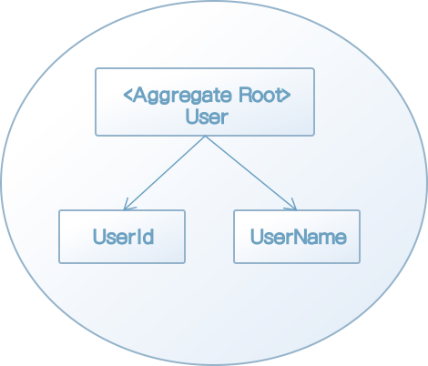
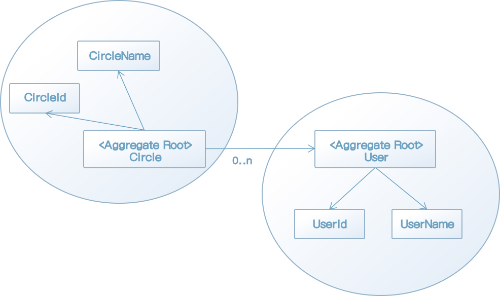
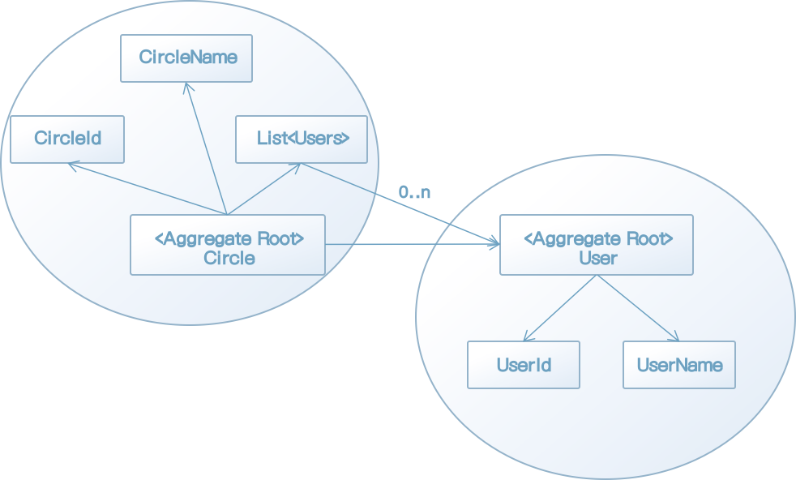
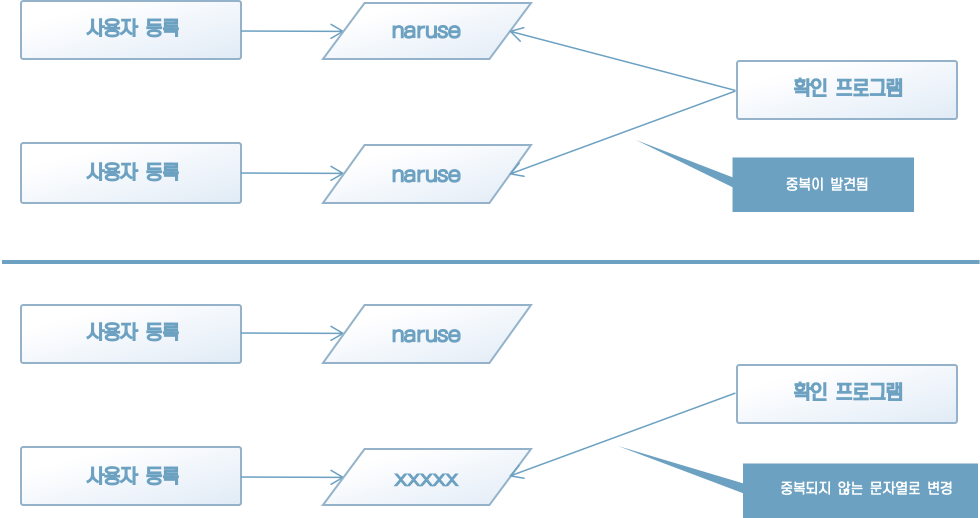

### 12.1 애그리게이트란?

객체 지향 프로그래밍에서는 여러 갱의 객체가 모여 한 가지 의미를 갖는 하나의 객체가 된다. 이렇게 객체가 모여 이룬 객체는 어떤 불변 조건을 유지해야 한다.

이 불변 조건은 언제나 유지돼야 하지만, 객체가 가진 데이터를 변경하는 조작을 무제한 적용하면 이를 유지하기 어렵다. 따라서 객체를 다루는 데도 질서가 필요하다.

애그리게이트는 경계와 루트를 갖는다. 애그리게이트의 경계는 말 그대로 애그리게이트에 포함되는 대상을 결정하는 경계다. 그리고 루트는 애그리게이트에 포함되는 특정한 객체다.

외부에서 애그리게이트를 다루는 조작은 모두 루트를 거쳐야 한다. 애그리게이트에 포함되는 객체를 외부에 노출하지 않음으로써 불변 조건을 유지할 수 있다.

애그리게이트를 말로만 설명하자니 어려운 개념처럼 느껴지지만, 사실 우리는 애그리게이트를 이미 접한 적이 있다. User와 Circle 같은 객체가 이미 애그리게이트의 정의를 만족한다.


#### 12.1 애그리게이트의 기본 구조

애그리게이트는 서로 연관된 객체를 감싸는 경계를 통해 정의된다. 예를 들어 사용자를 나타내는 User 클래스를 애그리게이트로 보면 그림 12-1과 같이 나타낼 수 있다.



[그림 12-1] 사용자 애그리게이트

외부에서는 애그리게이트 내부에 있는 객체를 조작할 수 없다. 애그리게이트를 조작하는 직접적인 인터페이스가 되는 객체는 애그리게이트 루트(aggregate root)뿐이다. 따라서 사용자명 변경도 User 객체에 요청하는 형태를 취해야 한다(리스트 12-1).

[리스트 12-1] 사용자명 변경은 User 객체에 요청하는 형태가 된다.

```java
UserName userName = new UserName("newName");

// NG
user.setName(userName);

// OK
user.changeName(userName);
```

어떤 방식을 취하던지 그 결과는 같지만, changeName 메서드를 만들면 메서드를 통해 전달받은 것을 확인(null 체크 등)할 수 있다. 즉, 사용자명이 아닌 유효하지 않은 데이터의 존재를 방지할 수 있다.

이번에는 서클 애그리게이트를 살펴보자. 사용자 애그리게이트와 같이 그림으로 나타낼 수 있다.

서클 애그리게이트에 포함되는 서클명 등을 다루게 허용된 것은 애그리게이트의 루트에 해당하는 Circle 객체뿐이다. 서클에 새로운 사용자를 추가하는 것도 마찬가지로 애그리게이트 루트를 통해야 한다.

그림 12-2에는 사용자 애그리게이트가 함께 나온다. 서클의 구성원은 사용자이므로 애그리게이트끼리의 관계가 나타나 있다. 사용자 애그리게이트는 서클 애그리게이트에 포함되지 않으므로 사용자 애그리게이트의 정보를 수정하는 조작은 서클 애그리게이트를 통하지 않는다. 그러나 서클에 사용자를 구성원으로 추가하는 처리는 서클 애그리게이트가 담당한다. 앞서 11장에서 서클에 사용자를 추가하는 처리를 리스트 12-2와 같은 코드로 처리했다.



[그림 12-2] 서클 애그리게이트


[리스트 12-2] 서클에 사용자를 추가하는 코드

```java
circle.getMembers.add(member);
```

이 코드는 애그리게이트의 규칙을 위반하는 코드다. 서클 애그리게이트에 포함되는 Members에 대한 조작은 애그리게이트의 루트인 circle 객체를 통해야 한다. 그러므로 원래대로라면 리스트 12-3과 같이 Circle 객체의 메서드를 추가하는 것이 옳다.

[리스트 12-3] 서클에 새로운 사용자를 추가하는 메서드를 엔티티에 추가하기

```java
public class Circle {
    private CircleId id;
    private User owner;
  	// 소속된 사용자 목록을 비공개로 돌린다.
    private List<User> members;
  
  	(...생략...)
  
  	public void join(User member) {
      	if (member == null) 
          throw new IllegalArgumentException("member: " + member);
      
      	if (members.length >= 29) {
          throw new CircleFullException("member.length: " + member.length);
        }
      
      	members.add(member);
    }
}
```

join 메서드는 새로운 사용자를 서클에 추가할 때 최대 인원 초과 여부를 먼저 확인한다. Members 속성이 외부에 공개되지 않으므로 서클에 새로운 사용자를 추가하려면 join 메서드를 호출하는 방법뿐이다. 결과적으로 서클에 사용자를 추가할 때 항상 최대 인원 초과 여부 확인이 이루어지며 '서클의 최대 인원은 서클장을 포함 최대 30명'이라는 불변 조건이 항상 유지될 수 있다.

[리스트 12-4] 서클에 사용자 추가를 위해 Circle 객체의 메서드를 호출하기

```java
circle.join(user);
```

속성에 직접 접근해 사용자를 추가하는 방식과 비교해 코드의 어감이 바뀐 것을 알 수 있다. 리스트 12-2는 '서클의 멤버에 새로운 사용자를 추가한다'는 구체적인 처리 내용이 읽히는 데 비해, 리스트 12-4는 '서클에 새로운 사용자를 참여시키는' 직관적인 내용으로 바뀌었다.

이렇듯 객체 지향 프로그래밍에서는 외부에서 내부 객체를 직접 다루는 대신, 내부 객체를 감싸는 객체에 요청하는 형태를 취한다. 이런 방법으로 불변 조건을 유지하면서도 직관과 좀 더 일치하는 코드를 만들 수 있다. 이른바 '데메테르의 법칙'으로 알려진 규칙이다.

[칼럼] 애그리게이트를 담은 컬렉션은 다이어그램으로 나타내야 할까?

> 서클 애그리게이트를 더 정확히 나타내려고 그림 12-3에서 보듯이 User 객체를 담는 컬렉션 객체를 다이어그램에 표시하는 경우가 있다.
>
> 
>
> [그림 12-3] User 객체가 담긴 컬렉션 객체가 표시된 서클 애그리게이트
>
> 그러나 이런 표현은 항상 좋은 것은 아니다. 예를 들어 실제로는 컬렉션 객체가 없이 데이터스토어에서 직접 컬렉션을 생성하는 경우도 있을 수 있다.
>
> 애그리게이트를 다이어그램으로 나타내는 것은 애그리게이트의 경계와 경계 안에 포함되는 모델이 무엇인지 나타내는 것이 목적으로, 코드를 정확히 나타내기 위한 것이 아니다.


#### 12.1.2 객체를 다루는 조작의 기본 원칙

객체 간의 어떤 질서 없이 메서드를 호출하면 불변 조건을 유지하기 어렵다. '데메테르의 법칙'은 객체 간의 메서드 호출에 질서를 부여하기 위한 가이드라인이다.

데메테르의 법칙은 어떤 컨텍스트에서 다음 객체의 메서드만을 호출할 수 있게 제한한다.

* 객체 자신
* 인자로 전달받은 객체
* 인스턴스 변수
* 해당 컨텍스트에서 직접 생성한 객체

예를 들어 자동차를 운전할 때 타이어에 직접 명령을 내리지 않듯이, 객체의 속성에도 직접 명령을 내리는 대신 그 속성을 갖는 객체에 명령을 내려 해당 객체가 자신의 속성을 관리하게 하는 것이다.

앞서 살펴본 리스트 12-2 코드 circle.getMembers.add(member);도 Circle 객체의 인스턴스 변수인 Members를 직접 조작하기 때문에 데메테르의 법칙에 어긋난다. 이와 달리 리스트 12-4의 코드 circle.join(user)는 데메테르의 법칙을 잘 지킨 코드다.

법칙을 이해하지 못한 채 무조건 지킨다고 좋은 것은 아니다. 모든 규칙에는 반드시 그 규칙이 만들어진 이유가 있다. 그 이유까지 이해할 수 있어야 정말로 법칙을 이해했다고 할 수 있다. 데메테르의 법칙이 해결하려던 문제가 무엇인지 살펴보자.

리스트 12-6은 11장에서 본 코드로 서클에 새로운 사용자를 멤버로 추가하기 위해 최대 인원 초과 여부를 확인하는 코드다.

[리스트 12-6] 서클의 멤버 추가를 위해 최대 인원 초과 여부를 확인하는 코드

```java
if (circle.getMembers.size() >= 29) {
  throw new CircleFullExcepition(id);
}
```

이 코드는 서클에 소속된 사용자의 수가 규칙에 정해진 최대 인원을 초과하는지 확인하는 코드로, Circle 객체의 속성은 members에 직접 접근해 length 메서드를 호출한다. 이는 데메테르의 법칙에서 명시한 '메서드를 사용할 수 있는 객체의 범위'를 벗어나기 때문에 데메테르의 법칙을 위반한 코드다.

이 코드의 문제는 서클의 최대 인원에 대한 로직이 여기저기 흩어지게 만든다는 점이다. 뒤에 작업할 개발자가 서클의 최대 인원에 대한 코드를 작성할 때 리스트 12-6의 코드를 참고로 한다면 최대 인원을 확인하는 로직의 코드가 중복될 것이다. 이렇게 애플리케이션이 만들어진 후, 서클 최대 인원수를 변경해야 할 경우가 생기면 코드를 몇 군데나 수정해야 할까? 상상만 해도 등골이 오싹한 얘기다.

규칙에 대한 코드가 원래 있을 곳에 벗어나 여러 곳에 흩어지는 것을 못 본 체하는 것은 결국 자신의 목을 조르는 것과 같다. 그 자리는 일단 모면하더라도 나중에 누군가의 고생 거리가 되며, 심지어 그 누군가가 내가 될 수도 있다.

리스트 12-7의 코드는 데메테르의 법칙을 잘 준수한 코드다.

[리스트 12-7] 데메테르의 법칙을 잘 준수한 코드

```java
public class Circle {
    private final CircleId id;
    // 멤버 목록을 비공개로 함
    private List<User> members;

  	(...생략...)
  
    public boolean isFull() {
        return this.members.size() >= 29;
    }

    public void join(User user) {
        if (user == null) {
            throw new IllegalArgumentException(user.getId().getValue());
        }

        if (isFull()) {
            throw new CircleFullException(id.getValue());
        }

        this.members.add(user);
    }
}
```

최대 인원에 도달했는지 여부는 isFull 메서드를 통해 확인한다. 최대 인원 초과를 확인하는 코드는 모두 isFull을 사용하게 수정한다.

[리스트 12-8] isFull 메서드를 이요한 최대 인원 초과 확인

```java
if (circle.isFull()) {
  throw new CircleFullException(circleId);
}
```

서클의 최대 인원수와 관련된 지식은 모두 isFull 메서드에 집중돼 있다. 추후 최대 인원이 변경돼도 리스트 12-9와 같이 isFull 메서드만 수정하면 된다.

[리스트 12-9] 서클의 최대 인원을 변경

```java
public class Circle {
		(...생략...)
  
    public boolean isFull() {
        //return this.members.size() >= 29;
        return this.members.size() >= 49;
    }
}
```

이런 방식이라면 서클의 최대 인원 규칙이 아무리 자주 바뀌어도 안심이다. 게터를 만들지 말아야 할 이유가 바로 여기에 있다. 게터를 통해 필드를 공개하면 객체에 구현돼야 할 규칙이 다른 곳에서 중복 구현되는 일을 완전히 막을 수 없다.

데메테르의 법칙은 소프트웨어의 유지 보수성을 향상시키고 코드를 더욱더 유연하게 한다. 애그리게이트의 목표와도 부합한다.


#### 12.1.3 내부 데이터를 숨기기 위해

객체 내부의 데이터는 함부로 외부에 공개돼서는 안된다. 그러나 데이터를 외부에 전혀 공개하지 않으면 리포지토리가 객체를 데이터스토어에 저장할 수가 없다(리스트 12-10).

[리스트 12-10] 리포지토리의 객체 저장

```java
public class EFUserRepository implements IUserRepository {
  public void save(User user) {
    // 게터를 이용해 데이터를 옮겨담는다.
    UserDataModel userDataModel = new UserDataModel(user.getId().getValue(), user.getName().getValue());
    context.getUsers.add(userDataModel);
    context.saveChanges();
  }
}
```

EFUserRepository는 User 클래스의 객체를 저장할 때 프레임워크에서 사용되는 데이터 모델인 UserDataModel로 데이터를 옮겨 담는다. UserDataModel 객체를 생성하려면 User 클래스의 id와 name에 접근해야 하므로 User 클래스가 id와 name을 완전히 비공개로 하면 이 코드는 컴파일 에러를 일으킨다. 그렇다면 이 문제는 어떻게 접근해야 할까?

가장 단순하고 일반적인 해결책으로는 규칙을 이용한 보호를 들 수 있다. 즉, 리포지토리 객체외에는 애그리게이트의 내부 데이터에 접근하는 코드를 함부러 작성하지 않는(다시 말해 게터를 사용하지 않는) 것이다. 이 방법은 팀 내 공감대를 잘 형성한다면 가장 적은 비용으로도 효과를 거둘 수 있다. 반면 이런 류의 합의는 강제력이 없기 때문에 개발자가 실수 혹은 고의로 규칙을 깨는 상황이 벌어질 수 있다.

또 다른 방법은 노티피케이션 객체를 이용하는 것이다. 노티피케이션 객체를 이용하면 먼저 인터페이스를 정의해야 한다(리스트 12-11).

[리스트 12-11] 노티피케이션을 위한 인터페이스

```java
public interface IUserNotification {
    void id(UserId id);
    void name(UserName name);
}
```

그 다음에는 인터페이스를 구현하는 노티피케이션 객체를 구현한다(리스트 12-12).

[리스트 12-12] 리스트 12-11의 인터페이스를 구현한 노티피케이션 객체

```java
public class UserDataModelBuilder implements IUserNotification {
    private UserId id;
    private UserName name;

    @Override
    public void id(UserId id) {
        this.id = id;
    }

    @Override
    public void name(UserName name) {
        this.name = name;
    }

    // 전달받은 데이터로 데이터 모델을 생성하는 메서드
    public UserDataModel build() {
        return new UserDataModel(
                this.id,
                this.name
        );
    }
}
```

User 클래스는 노티피케이션 객체의 인터페이스를 통해 내부 정보를 전달한다(리스트 12-13).

[리스트 12-13] 노티피케이션 객체에 내부 정보를 전달하는 메서드 추가하기

```java
public class User
{
  	// 인스턴스 변수는 모두 비공개
    private final UserId id;
    private final UserName name;

    public void notify(IUserNotification note) {
      	// 내부 데이터를 전달
        note.id(id);
        note.name(name);
    }
}
```

이런 방법으로 객체의 내부 데이터는 비공개로 그대로 두면서 외부에 데이터를 전달할 수 있다(리스트 12-14).

[리스트 12-14] 노티피케이션 객체를 이용해 데이터 모델을 받아옴

```java
public class EFUserRepository implements IUserRepository {
    @Override
    public void save(User user) {
        // 노티피케이션 객체를 전달했다가 다시 회수해 내부 데이터를 입수한다.
        UserDataModelBuilder userDataModelBuilder = new UserDataModelBuilder();
        user.notify(userDataModelBuilder);

        // 전달받은 내부 데이터로 데이터 모델을 생성
        UserDataModel userDataModel = userDataModelBuilder.build();

        // 데이터 모델을 ORM에 전달한다.
        context.getUsers().add(userDataModel);
        context.saveChanges();
    }
    
   	(...생략...)
}
```

하지만 이 경우 작성할 코드 양이 크게 늘어난다는 것이 단점이다. 그리고 리스트 12-11과 12-12와 같이 노티피케이션 객체 및 관련 코드를 한꺼번에 생성해주는 도구를 만들어 사용하면 이러한 문제를 피할 수 있다.


### 12.2 애그리게이트의 경계를 어떻게 정할 것인가

애그리게이트의 경계를 어떻게 정할 것인가는 상당히 어려운 주제다. 애그리게이트의 경계를 정하는 원칙 중 가장 흔히 쓰이는 것은 '변경의 단위'다. 변경의 단위가 애그리게이트의 경계로 이어지는 이유는 그 원칙을 어겨보면 이해하기 쉽다.

그럼 이 원칙을 실제로 위반해 보겠다. 현재 서클 애그리게이트는 그림 12-4와 같이 경계가 정해져 있다.


[그림 12-4] 서클 애그리게이트(그림 12-2와 같음)

서클과 사용자는 별개의 애그리게이트다. 그리고 애그리게이트는 변경의 단위다. 그러므로 서클을 변경할 때는 서클 애그리게이트 내부로 변경이 제한돼야 하고, 사용자를 변경할 때도 사용자 애그리게이트 내부의 정보만 변경돼야 한다. 만약 이러한 규칙을 위반하고 서클 애그리게이트에서 자신의 경계를 넘어 사용자 애그리게이트까지 변경하려고 하면 프로그램에 어떤 일이 일어날까?

리스트 12-16은 서클 애그리게이트에서 억지로 사용자 애그리게이트까지 변경하려고 하는 코드다.

[리스트 12-16] 서클 애그리게이트에서 사용자 애그리게이트의 행위 호출하기

```java
public class Circle {
    private List<User> members;

  	(...생략...)
  
    public void changeMemberName(UserId id, UserName name) {
        User target = members.stream().filter(user -> user.getId().equals(id)).findFirst().orElse(null);
        if (target != null) {
            target.changeName(name);
        }
    }
}
```

코드의 좋고 나쁨은 나중에 따지기로 하고, 이 코드는 서클에 소속된 사용자의 사용자명을 변경하는 코드다. 여기서 문제가 되는 것은 변경의 범위가 서클을 벗어난다는 점이다. 서클 애그리게이트의 경계를 넘어 사용자 애그리게이트를 조작하면 그 영향이 리포지토리에 나타난다.

먼저 이전 코드부터 살펴보자. 리스트 12-17은 서클 애그리게이트의 퍼시스턴시 처리를 담당하는 코드다.

[리스트 12-17] 서클 애그리게이트의 퍼시스턴시 처리 코드

```java
public class CircleRepository implements ICircleRepository {
    public void save(Circle circle) throws SQLException {
        PreparedStatement pstmt = connection.prepareStatement(
                "MERGE INTO circles USING (" +
                        "   SELECT :id AS id, :name AS name, :ownerId AS ownerId" +
                        ") AS data " +
                        "ON circles.id = data.id" +
                        "WHEN MATCHED THEN" +
                        "   UPDATE SET name = data.name, owenerId = data.ownerId " +
                        "WHEN NOT MATCHED THEN" +
                        "   INSERT (id, name, ownerId)" +
                        "   VALUES(data.id, data.name, data.ownerId)"
        );
        pstmt.setString(1, circle.getId().getValue());
        pstmt.setString(2, circle.getName().getValue());
        pstmt.setString(3, circle.getOwnerId().getValue());
        pstmt.executeUpdate();
        pstmt.close();

        PreparedStatement pstmt2 = connection.prepareStatement(
                "MERGE INTO userCircles USING (" +
                        "   SELECT :userId AS userId, :circleId AS circleId" +
                        ") AS data " +
                        "ON userCircles.userId = data.userId AND userCircles.circleId = data.circleId " +
                        "WHEN NOT MATCHED THEN" +
                        "   INSERT (userId, circleId)" +
                        "   VALUES(data.userId, data.circleId)"
        );
        pstmt2.setString(1, circle.getId().getValue());
        pstmt2.setString(2, circle.getMembers().get(0).getId().getValue());
        pstmt2.executeUpdate();
      	pstmt2.close();
    }
}
```

서클 애그리게이트가 자신의 내부 데이터만을 변경한다는 규칙을 준수한다면 이 코드는 문제가 없다. 그러나 여기서는 애그리게이트의 경계를 넘어 사용자 애그리게이트의 데이터를 변경한다. 이 상태로는 경계 너무 사용자 애그리게이트를 변경한 내용이 저장되지 않는다. 애그리게이트 경계를 넘어선 변경을 허용하려면 리포지토리에도 수정이 필요하다(리스트 12-18).

[리스트 12-18] 서클 애그리게이트의 경계를 넘어 사용자 애그리게이트에 대한 변경까지 지원하는 리포지토리

```java
public class CircleRepository implements ICircleRepository {

    public void save(Circle circle) throws SQLException {
      	// 사용자 애그리게이션에 대한 업데이트 처리
      	PreparedStatement pstmt = connection.prepareStatement(
                "UPDATE users SET username = :username WHERE id = :id"
        );
        
      	// 서클 애그리게이션에 대한 업데이트는 그 다음
    }
}
```

서클 애그리게이트의 경계를 넘어 사용자 애그리게이트까지 변경할 수 있게 리포지토리를 수정한 결과, 서클 리포지토리의 로직 대부분이 사용자의 정보를 수정하는 코드로 오염됐다. 더불어 서클 리포지토리에 새로 추가된 코드의 대부분이 사용자 리포지토리의 코드와 중복된다. 정말 어쩔 수 없는 경우가 아니면 코드의 중복은 피하는 편이 좋다.

이것은 변경의 단위를 넘어서는 변경을 시도했다가 발생한 문제다. 애그리게이트에 대한 변경은 해당 애그리게이트 자신에게만 맡기고, 퍼시스턴시 요청도 애그리게이트 단위로 해야 한다. 지금까지 리포지토리를 만드는 단위가 무엇인지 언급하지 않았는데, 지금 본 것과 같은 이유로 리포지토리는 애그리게이트마다 하나씩 만든다.


#### 12.2.1 식별자를 이용한 컴포지션

전에도 몇 번 설명했듯이, 발생할 수밖에 없는 일을 문제로 생각하는 사고방식이 있다. Circle 객체는 User 클래스의 인스턴스를 컬렉션 객체에 저장하고 프로퍼티를 통해 객체에 접근해 메서드를 호출할 수 있는데, 그것 자체를 문제로 보는 시각이 그렇다.

애그리게이트의 경계를 넘지 않는다는 불문율을 만드는 것보다 더 나은 방법은 없을까?

물론 있다. 그것은 아주 단순한 방법이다. 그 방법은 바로 인스턴스를 갖지 않는 것이다. 인스턴스를 실제로 갖지는 않지만 그런 것처럼 보이게끔 하는 것, 엔티티에 그런 것이 있다. 바로 식별자다.

서클 애그리게이트가 사용자 애그리게이트를 직접 포함하는 대신, 사용자 애그리게이트의 식별자를 포함하게 코드를 수정해 보자(리스트 12-19).

[리스트 12-19] 인스턴스 대신 식별자를 갖고 있기

```java
public class Circle {
    private final CircleId id;
    private CircleName name;
    //private List<User> members;
    private List<UserId> members;
    
    (...생략...)
}
```

이런 방법을 사용하면 설사 Member 프로퍼티를 공개하더라도 User 객체의 메서드를 호출하는 일은 없을 것이다. 굳이 User 객체의 메서드를 호출해야겠다면 UserRepository에서 UserId를 키로 해서 해당하는 User 객체를 복원 받은 뒤 이 객체의 메서드를 호출하는 방법뿐이다. 이런 절차가 강제된다면 적어도 부주의하게 메서드를 호출해 애그리게이트 너머의 영역을 변경하는 일은 일어나지 않는다.

또 이 방법은 메모리를 절약하는 부수적인 효과도 있다. 서클명을 변경하는 처리를 예로 들어보겠다(리스트 12-20).

[리스트 12-20] 서클명을 변경하는 코드

```java
public class CircleApplicationService {
    
    private final ICircleRepository circleRepository;
    
    (...생략...)
    
    public void update(CircleUpdatecommand command) {
        CircleId id = new CircleId(command.getId());
        // 이 지점에서 User 객체가 복원되지만,
        Circle circle = circleRepository.find(id);
        if (circle == null) 
            throw new CircleNotFoundException(id);
        
        if (command.getName() != null) {
            CircleName name = new CircleName(command.getName());
            circle.changeName(name);
            
            if (circleService.exists(circle)) {
                throw new CanNotRegisterCircleException("circle: " + circle);
            }
        }
        
        circleRepository.save(circle);
        // User 객체를 사용하지 않고 처리가 끝남
    }
}
```

서클명을 변경하는 처리이니 당연히 사용자 객체를 다룰 일은 없다. Circle 객체가 소속 사용자를 User 객체 형태로 포함하는 경우에는 리포지토리가 사용자 객체를 복원해도 전혀 사용되지 않고 버려진다. 이는 명백한 리소스 낭비다. User 객체를 직접 포함하는 대신 UserId를 포함하면 소속 사용자의 모든 User 객체를 복원할 만큼의 처리 능력을 절약할 수 있을 것이고 인스턴스를 저장하기 위한 메모리도 절약될 것이다.

[칼럼] 식별자의 게터에 대한 시시비비

> 지금까지 게터는 가능한 한 두지 말아야 하는 것으로 주로 설명했다. 그러나 게터의 대상이 식별자라면 조금 이야기가 달라진다.
>
> [리스트 12-21] 게터를 통해 식별자 공개하기
>
> ```java
> public class Circle {
>       private CircleId id;
>       private CircleName name;
>       private UserId owner;
>       private List<UserId> members;
>   
>   	public Circle(CircleId id, CircleName name, UserId owner, List<UserId> members) {
>            if (id == null) 
>                throw new IllegalArgumentException(id+"");
>            if (name == null) 
>                throw new IllegalArgumentException(id+"");
>            if (owner == null) 
>                throw new IllegalArgumentException(owner+"");
>            if (members == null) 
>                throw new IllegalArgumentException(members+"");
>    
>            this.id = id;
>            this.name = name;
>            this.owner = owner;
>            this.members = members;
>       }
>   
> 	public void notify(ICircleNotification note) {
>        	note.id(id);	
>            note.name(name);
>            note.owner(owner);
>            note.members(members);
>    
>            (...생략...)
>       }
> }
> ```
>
> 이 Circle 클래스는 식별자를 게터로 통해 공개한다. 이상적으로 보면 이 게터도 만들지 않는 쪽이 좋지만, 식별자는 엔티티를 나타내기 위한 필연적 속성으로, 그 자체로 애그리게이트를 대체할 수 있는 편리한 수단이다. 유일 식별자 자체에 관심을 두는 경우도 있지만(택배 송장 번호 등), 식별자를 직접 대상으로 하는 비즈니스 규칙은 그리 많지 않다. 이런 경우 식별자를 공개하는 이점이 단점보다 크다.


### 12.3 애그리게이트의 크기와 조작의 단위

트랜잭션은 데이터에 락(lock)을 건다. 애그리게이트의 크기가 크면 클수록 이 락의 적용 범위도 비례해 커진다.

애그리게이트의 크기가 지나치게 커지면 그만큼 애그리게이트를 대상으로 하는 처리가 실패할 가능성도 높다.

따라서 애그리게이트의 크기는 가능한 한 작게 유지하는 것이 좋다. 만약 지나치게 비대해진 애그리게이트를 발견했다면 한번쯤 애그리게이트의 범위를 재검토해야 한다.

또, 한 트랜잭션에서 여러 애그리게이트를 다루는 것도 가능한 한 피해야 한다. 여러 애그리게이트션에 걸친 트랜잭션은 범위가 큰 애그리게이트와 마찬가지로 광범위한 데이터에 락을 걸 가능성이 높다.

[칼럼] 결과 무결성

> 수정을 애그리게이트 단위로 하는 것이 최선이라고 설명했지만, 때로는 여러 애그리게이트에 걸친 수정이 꼭 필요하다. 이런 경우 유용한 것이 결과 무결성이다.
>
> 트랜잭션 무결성이 모든 순간에 유지되는 무결성인 데 비해, 결과 무결성(eventual consistency)은 처리 도중에 한해 특정 시점의 모순 발생이 허용된다.
>
> 극단적인 예를 들자면, 하루 1번 동작하는 cron 작업(작업을 자동으로 실행하는 데몬)으로 사용자를 모두 검사해 사용자명이 중복되는 사용자가 있으면 해당 사용자의 사용자명을 중복되지 않는 무작위 문자열로 변경하는 것과 같다. 그림 12-5는 조금 거친 방법이기는 해도 결과적으로 전체 시스템의 무결성을 유지할 수 있다.
>
> 
>
> 
>
> [그림 12-5] 결과 무결성의 예
>
> 시스템이 어떤 무결성을 필요로 하는지 잘 따져보면 모든 순간에 유지되는 무결성이 필요한 경우는 생각보다 적다. 만약 트랜잭션 무결성을 적용하는 데 문제가 있다면 결과 무결성을 한 번 고려해 보기 바란다.


### 12.4 언어 표현과의 모순 제거하기

서클에 대한 규칙 중에 '서클에 소속되는 인원은 서클장에 포함해 최대 30명까지 허용된다'라는 것이 있었다. 30이라는 구체적인 수치가 규칙에 실려 있지만, 정작 코드에 나오는 수치는 29다(리스트 12-22).

[리스트 12-22] 같은 규칙이지만 코드와 언어 표현의 수치가 다른 경우

```java
public class Circle {
  	private User owner;
		private List<User> members;
  
  	(...생략...)
  
    public boolean isFull() {
        return this.members.size() >= 29;
    }
}
```

표면적인 수치에 차이가 있어도 코드에 오류가 있는 것은 아니다. Circle 객체는 소속된 사용자와 서클장을 각각 다른 필드를 통해 관리하므로 리스트 12-22에 나온 isFull 메서드도 30에서 1을 뺀 29라는 숫자를 비교 대상으로 한다.

그러나 코드에 문제가 없다고 해서 언어 표현 과의 모순을 그대로 두면 오해를 일으키기 쉽다. 오해를 막기 위해 Circle 클래스에 서클장을 포함한 소속 사용자 수를 구하는 메서드를 추가하자(리스트 12-23).

[리스트 12-23] 서클의 서클장과 소속 사용자의 정의

```java
public class Circle {
  	private User owner;
		private List<User> members;
  
  	(...생략...)
  
    public boolean isFull() {
        return countMembers() >= 30;
    }
  
  	public int countMembers() {
      return this.members.size() + 1;
    }
}
```


### 12.5 정리

이번 장에서는 객체의 불변 조건을 유지하기 위한 경계 역할을 하는 애그리게이트에 대해 배웠다.

애그리게이트는 정해진 규칙대로 정의되는 것이 아니다. 도메인의 개념은 애초부터 서로 밀접하게 엮여 있는 개념이며 이들을 구분하는 경계선을 정의하는 것도 간단하지는 않다.

애그리게이트의 경계선을 정하는 일은 도메인 개념을 잘 파악하고 여기에 따르는 불변 조건을 제대로 유도한 다음, 도메인과 시스템이 균형을 이루는 최적의 지점을 찾는 과정이다. 어느 한쪽으로 지나치게 기울지 않는 균형 잡힌 지점을 찾는다.

  

  

 