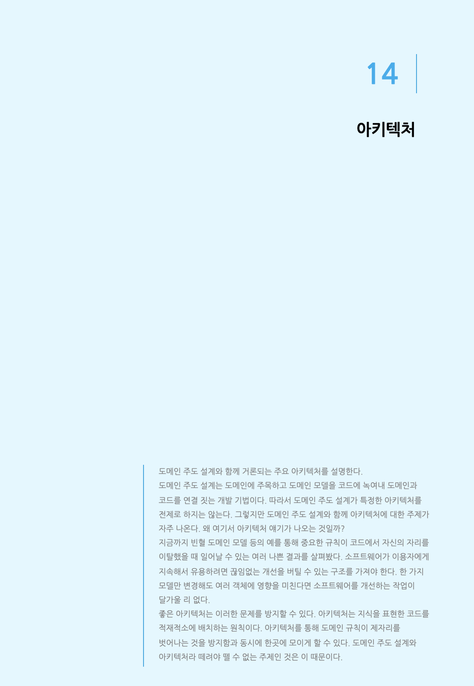
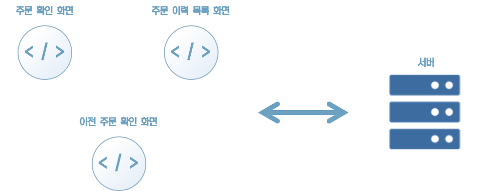
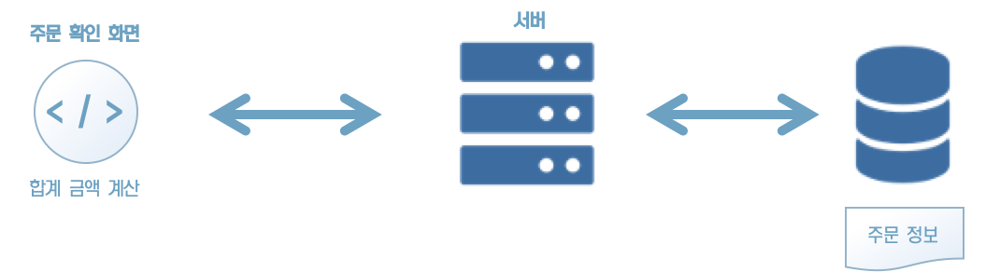
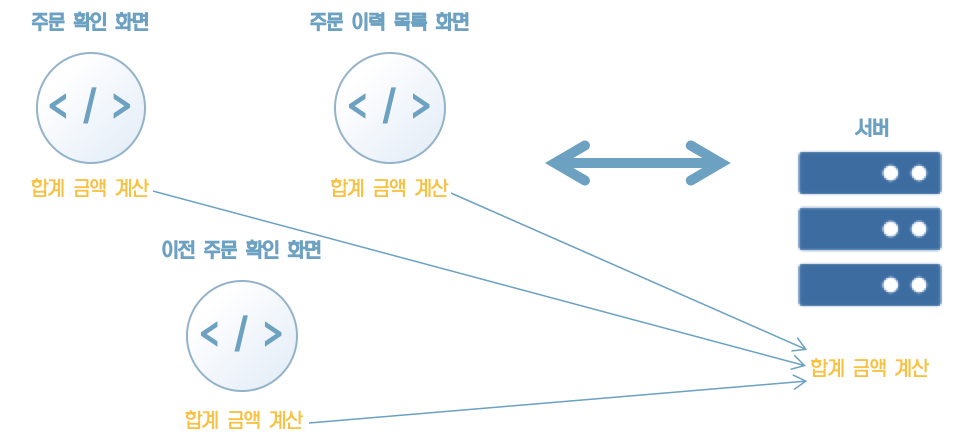
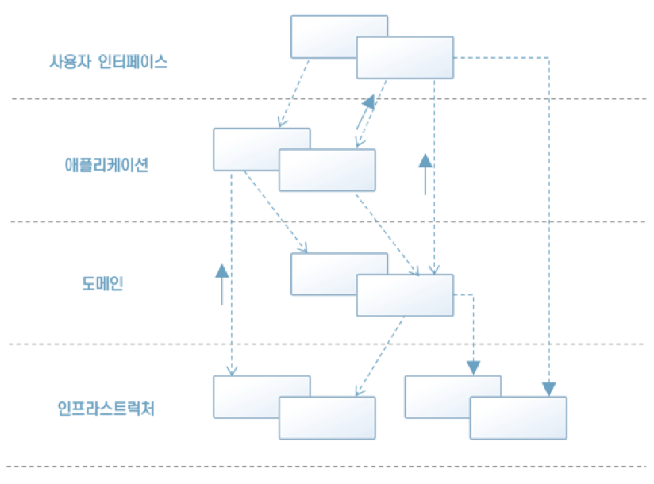
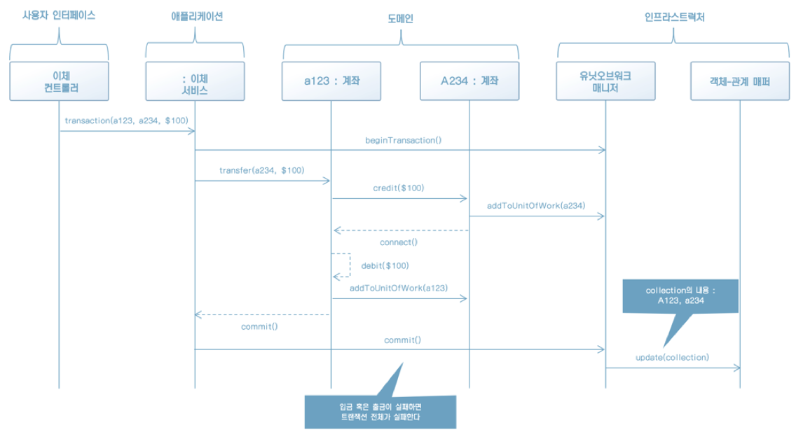
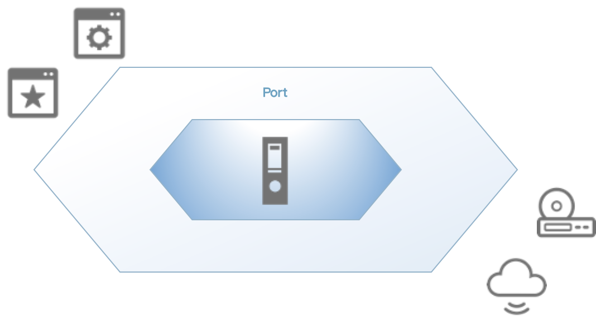
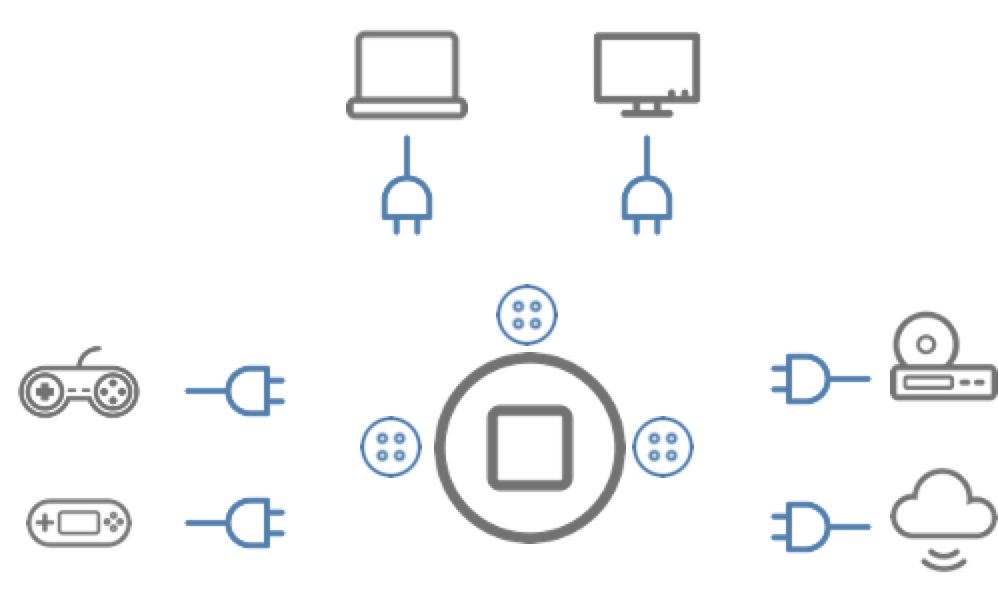
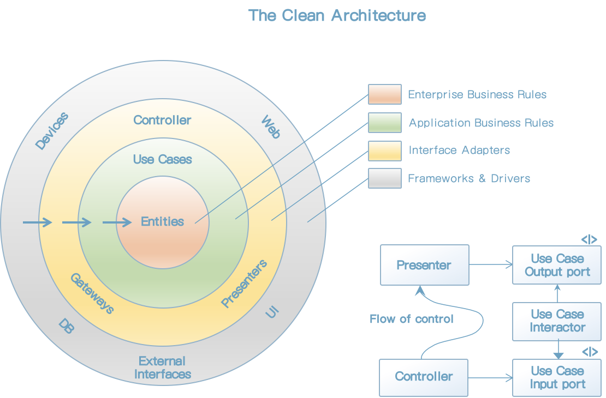
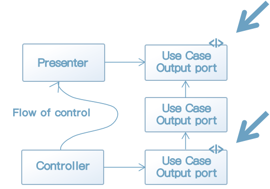

### 14.1 아키텍처의 역할

아키텍처는 개발자의 가슴을 뛰게 하는 단어다. 개발자는 언제나 논리 정연한 이론과 이를 바르게 구현한 코드에 가슴 뛰는 존재다.

기대에 찬물을 끼얹는 것 같아 미안하지만, 바로 이런 이유 때문에라도 아키텍처에 대한 태도를 짚고 넘어가지 않을 수 없다. 여기서 하고자 하는 말은, '도메인 주도 설계에서 아키텍처는 결코 주역이 아니다'라는 점이다.

이 말의 숨은 뜻을 이해하려면 아키텍처를 배우기 전에 먼저 도메인 주도 설계에서 아키텍처가 어떤 자리에 있는가를 봐야 한다.


#### 14.1.1 안티패턴 - 스마트 UI

시스템의 유연성을 치명적으로 저해하는 안티패턴 중 하나가 바로 '스마트 UI'다. 스마트 UI는 원래대로라면 도메인 객체에 위치해야 할 중요 규칙 구현 코드가 사용자 인터페이스까지 끌려 나오게 만드는 주범이다.

스마트 UI는 도메인을 분리하기에 적합하지 않은 애플리케이션에서 자주 발견된다. 이런 시스템은 개선 비용이 매우 높으며 결과적으로 유연성을 크게 잃는다.

일반적인 전자 상거래 시스템을 예로 들어 보겠다.




[그림 14-1] 일반적인 전자상거래 시스템

전자상거래 사이트 사용자는 웹 사이트에서 상품을 주문한다. 그림 14-1은 사용자가 상품을 주문할 때 이용하는 시스템의 주요 부분을 나타낸 것이다.

이 화면에는 공통된 비즈니스 로직이 있다. 시스템 사용자의 행적을 좇아가며 이 로직을 하나씩 살펴보자.

우선 사용자는 주문하려는 상품을 선택한 다음 다음 주문을 위해 '주문 확인 화면'으로 이동한다. '주문확인 화면'에서는 앞으로 확정할 주문의 '합계 금액'을 보여준다. '주문 확인 화면'에서 확인한 내용에 문제가 없다면 사용자는 주문을 확정한다.

자신이 주문한 내용에 잘못된 점이 없는지 확인하기 위해 사용자는 '주문 이력 목록 화면'을 연다. 이 화면에는 이전에 주문했던 주문의 개요가 목록 형식으로 나타난다. 이때 주문마다 해당 주문의 '합계 금액'이 표시되면 편리하다. '주문 이력 목록 화면'에는 '합계 금액'이 표시된다.

'주문 이력 목록 화면'만으로는 각 주문의 상세한 내용을 알 수 없다. 사용자는 상세한 주문 내용을 확인하기 위해 '이전 주문 확인 화면'을 연다. 물론 이 화면에도 '합계 금액'이 표시된다.

지금 살펴본 화면에는 모두 '합계 금액'이 표시된다. 따라서 이들 화면은 '합계 금액 계산'이 필요하다. 그렇다면 '합계 금액을 계산하는' 코드는 어디에 작성해야 할까?


[그림 14-2] UI에 작성된 비즈니스 로직

그림 14-2는 앞날을 생각하지 않은 근시안적인 구성이다. 3개의 화면이 제각기 '합계 금액'을 계산해 화면에 표시한다.

이런 구성은 문제가 많다. 예를 들어 '합계 금액'을 계산하는 방법에 변화가 생긴 상황을 생각해보자.

가장 먼저 떠오르는 문제점은 '합계 금액을 계산'하는 방법은 한 가지인데, 이를 수정하려면 코드의 세 곳이나 수정해야 한다는 점이다. 로직이 정상적으로 한곳에 모여 있었다면 한곳의 수정으로 끝났을 일의 작업량이 3배로 증가했다.

또, 각 화면이 언뜻 보기에도 비슷해도 사정이 서로 다르다. 시스템은 성장하는 생물과 같다. 세월이 흐르면 처음에는 '합계 금액'의 계산 과정이 완전히 같았더라도 화면마다 서로 다른 사정에 따라 독자적으로 성장한다. 비슷해 보이는 코드지만, 미세한 차이가 있어 자세히 들여다보며 수정하지 않으면 안된다.

물론 개발자 한 사람이 이 세 화면을 한꺼번에 작업한다면 같은 처리를 화면마다 따로따로 구현하지는 않을 것이다. 게다가 일반적인 개발자는 로직을 한곳에 모아 놓는 습성이 있다. 세 화면에서 쓰이는 '합계 금액 계산'이 똑같은 과정으로 계산된다는 것을 깨닫고 공통으로 사용하게 구현했을 것이다.

정말 문제가 되는 것은 처음에 화면이 하나뿐이었을 경우다. 앞서 본 예에 적용하면, 처음에는 '주문 확인 화면'만 있었다가 나중에 주문 이력을 확인하는 기능이 추가되면서 '주문 이력 목록 화면'과 '이전 주문 확인 화면'이 개발된 상황이다.

로직을 한곳에 모아두는 데만 관심이 있는 개발자는 '주문 확인 화면'만 있기 때문에 '합계 금액 계산'을 ''주문 확인 화면'에 구현해도 문제가 없다고 생각하게 된다. 같은 계산이 다른 곳에서도 사용될 수 있겠다는 생각이 들 수도 있지만, 그건 그때 가서 보자고 낙관적으로 생각하기 쉽다.




[그림 14-3] 중복이 발생하기 쉬운 상태

개발자는 '모든 일이 다 중요하다'는 말을 외면하고 언젠가 리팩토링을 할 날이 오려니 생각하기 쉽다. 또한 겉으로 보기에 크게 잘못된 것이 없으니 무슨 일이 있더라도 쉽게 수정할 수 있으리라 근거 없는 자신감을 갖는다. 물론 리팩토링을 할 날 따위는 오지 않는다. 근시안적인 해결책으로 가득한 코드는 복잡기괴한 형태로 진화해 개발자의 눈앞에 다시 나타날 것이다.

UI는 사용자의 입력을 받고 출력을 보여주는 것이 맡은 바 책임이다. 비즈니스 로직이 UI에 구현되어서는 안된다. UI에는 최소한의 로직만 존재해야 한다. UI가 똘똘해 질수록 수정 비용이 높아지며 수정 작업도 괴로워진다. 개발자가 이 괴로움 때문에 수정하기를 꺼리면 시스템의 유연성은 사라진다.




[그림 14-4] 비즈니스 로직을 한곳에 모으기

똑똑한 UI 대신 비즈니스 로직을 한곳에 모으면 그림 14-4와 같다. 이 구성대로라면 '합계 금액 계산'에 화면마다 제각기 다른 사정이 끼어들 여지가 사라진다. 또한 계산 방법이 변경되더라도 한곳만 수정하면 된다. 수정 난이도도 그리 어렵지 않을 것이다.

먼저 해야 할 일은 지금 만들고 있는 소프트웨어가 매우 단순한 것이라는 선입견을 버리는 것이다. 사용자 인터페이스에 비즈니스 로직을 구현해도 되겠다고 생각한 순간, 도메인 모델을 풍성하게 키워가는 밝은 미래는 사라진다.


#### 14.1.2 도메인 주도 설계가 아키텍처에게서 원하는 것

똑똑한 UI를 만들지 않겠다고 결심했더라도 이를 실제로 실천하기는 그리 간단치 않다. 비즈니스 로직을 있어야 할 자리에 배치하는 것은 비즈니스 로직의 중요성을 익히 알고 있는 개발자로서도 쉬운 일이 아니다. 그러므로 개발자는 자신의 자제심 외에 이를 관철할 방법을 강구해야 한다. 이 해결책이 바로 아키텍처다.

아키텍처는 간단히 말해 코드를 구성하는 원칙이다. 어떤 내용을 구현한 코드가 어디에 배치돼야 하는지에 대한 답을 명확히 제시하며 로직이 무질서하게 흩어지는 것을 막는다. 개발자는 아키텍처가 제시하는 원칙에 따르면서 '어떤 로직을 어디에 구현할 지인지'를 고민하지 않아도 된다. 이것은 개발자가 도메인 주도 설계의 본질인 '도메인을 파악하고 잘 표현하는'것에 집중할 수 있게 해준다.

도메인 주도 설계가 아키텍처에게서 원하는 것은 도메인 객체가 서로 얽힌 레이어를 분리해 소프트웨어 구현에 필요한 사정으로부터 도메인 객체를 지켜내는 것이다. 이것이 가능하다면 어떤 아키텍처를 사용해도 무방하다.


### 14.2 아키텍처

다음은 도메인 주도 설계와 함께 자주 언급되는 아키텍처다.

* 계층형 아키텍처
* 헥사고날 아키텍처
* 클린 아키텍처

이 책에서 지면 관계상 이 아키텍처만 다루지만, 도메인 주도 설계에서 가장 중요한 것은 도메인을 분리하는 것이지, 이들 중 어떤 아키텍처를 반드시 써야 한다는 것은 아니다. 또한 이들 아키텍처를 잘 준수했다고 해서 반드시 도메인 주도 설계를 제대로 실천한 것은 아니라는 점도 기억해두기 바란다.

중요한 것은 도메인의 본질에 집중할 수 있는 환경을 만드는 것이다.


#### 14.2.1 계층형 아키텍처

계층형 아키텍처는 도메인 주도 설계와 함께 언급되는 아키텍처 중에서 가장 전통적이면서 유명한 아키텍처다.

계층형 아키텍처는 이름 그대로 여러 층이 쌓인 구조로 나타낼 수 있다.

에릭 에반스(Eric Evans)의 저서『도메인 주도 설계』를 보면 계층형 아키텍처의 예로 그림 14-5가 제시돼 있다.




[그림 14-5] 에릭 에반스의 저서에 제시된 계층형 아키텍처의 예

도메인 주도 설계에서 말하는 계층형 아키텍처는 그림 14-5에서 보듯 4개의 계층으로 구성되는 경우가 많다. 그림을 함께 보며 알아보자.

계층형 아키텍처를 구성하는 4개의 계층은 다음과 같다.

* 프레젠테이션 계층 (사용자 인터페이스 계층)
* 애플리케이션 계층
* 도메인 계층
* 인프라스트럭처 계층

이 중에서도 가장 중요한 것은 도메인 계층이다. 도메인 계층은 소프트웨어가 적용될 분야에서 문제 해결에 필요한 지식을 담는 계층이다. 이 계층에 도메인 객체를 분리해 두고, 다른 계층으로 벗어나지 않게 한다.

애플리케이션 계층은 도메인 계층의 요소를 지휘하는 요소가 모인 계층이다. 이 층에 속하는 요소로는 애플리케이션 서비스가 있다. 애플리케이션 서비스는 도메인 객체의 직접적인 클라이언트가 되며 유스케이스를 구현하는 진행자 역할을 한다. 도메인 계층에 속하는 요소는 도메인을 나타내는 데 전념하므로 애플리케이션으로서 독립적으로 기능하려면 애플리케이션 계층 요소가 도메인 객체를 이끌어야 한다.

프레젠테이션 계층은 사용자 인터페이스와 애플리케이션이 연결되는 곳이다. 이 층의 주요 책임은 출력의 표시와 입력의 해석이다. 시스템 사용자가 이해할 수 있게 출력을 표시하고 사용자의 입력을 해석한다. 구체적인 접근법은 다양하며 그중 무엇이라도 사용할 수 있다. 사용자 인터페이스와 애플리케이션을 연결하기만 한다면 그것은 웹 프레임워크거나 CLI라도 무방하다.

인프라스트럭처 계층은 자신 외의 계층을 지탱하는 기술적 기반에 대한 접근을 제공한다. 애플리케이션을 위한 메시지 송신, 도메인을 위한 퍼시스턴시 제공 모듈 등이 이 계층에 포함된다.

여기서 원칙은 의존의 방향이 위에서 아래를 향한다는 점이다. 상위에 있는 계층은 자신보다 하위에 있는 계층에 의존할 수 있다. 이 방향을 거스르는 의존은 허용되지 않는다.

의존의 관점에서 보면, 도메인 계층에서 인프라스트럭처 계층으로 의존을 나타내는 화살표가 뻗어있는 것이 의아해 보일 것이다. 이 화살표는 도메인 계층의 객체가 인프라스트럭처 계층의 객체를 다루고 있다는 뜻이 아니다. 그림 14-5의 오른쪽 아래에 위치한 속이 빈 화살표를 보면 추상화가 포함돼 있음을 알 수 있다. 리포지토리의 인터페이스와 구현 클래스 간의 관계가 여기 해당할 것이다.

또, 에릭 에반스의『도메인 주도 설계』를 보면 계층을 넘어서는 객체 간의 연결을 나타낸 그림이 나온다.

'a234: 계좌'에서 addToUnitOfWork(a234)라는 메시지를 '유닛오브워크 매니저'에 보내는 것으로 봐서 고전적인 유닛오브워크의 구현을 상정하고 있는 것을 알 수 있다. 현재는 그리 많이 쓰이는 패턴은 아니지만, 도메인 객체가 인프라스트럭처 계층의 객체에 의존하는 예로 들 수 있다.




[그림 14-6] 객체 간의 연결을 나타낸 그림


###### 계층형 아키텍처의 구현 예제

이번 장에서 설명과 함께 구현했던 애플리케이션은 사실 이 계층형 아키텍처를 염두에 두고 구현한 것이다. 이 코드를 다시 계층형 아키텍처 관점에서 살펴보겠다.

먼저 살펴볼 부분은 프레젠테이션 계층에 속하는 UserController 클래스다(리스트 14-1).

[리스트 14-1] 프레젠테이션 계층에 속하는 컨트롤러

```java
@RestController
@RequestMapping("api/users")
@RequiredArgsConstructor
public class UserController {
    private final UserApplicationService userApplicationService;

    @GetMapping
    public UserIndexResponseModel index() {
        UserGetAllResult result = userApplicationService.getAll();
        List<UserResponseModel> users = result.getUserModels().stream()
                .map(userData -> new UserResponseModel(userData.getUser()))
                .collect(Collectors.toList());
        return new UserIndexResponseModel(users);
    }

    @GetMapping("${id}")
    public UserGetResponseModel get(@PathVariable String id) {
        UserGetCommand command = new UserGetCommand(id);
        UserGetResult result = userApplicationService.get(command);

        UserResponseModel userModel = new UserResponseModel(result.getUser());
        return new UserGetResponseModel(userModel);
    }

    @PostMapping
    public UserPostResponseModel post(@RequestBody UserPostRequestModel request) {
        UserRegisterCommand command = new UserRegisterCommand(request.getUserName());
        UserRegisterResult result = userApplicationService.register(command);

        return new UserPostResponseModel(result.getCreatedUserId());
    }

    @PutMapping("${id}")
    public void put(@PathVariable String id, @RequestBody UserPutRequestModel request) {
        UserUpdateCommand command = new UserUpdateCommand(id, request.getName());
        userApplicationService.update(command);
    }

    @DeleteMapping("${id}")
    public void delete(@PathVariable String id) {
        UserDeleteCommand command = new UserDeleteCommand(id);
        userApplicationService.delete(command);
    }
}
```

MVC 프레임워크의 컨트롤러는 사용자의 입력 데이터인 HTTP 요청을 애플리케이션에 전달할 수 있게 변환하는 역할을 하므로 프레젠테이션 계층에 걸맞는 요소다. 애플리케이션 계층의 요소인 애플리케이션 서비스의 클라이언트이기도 하므로 그림 14-5에 나온 의존의 방향성에도 어긋나지 않는다.

그 다음으로 애플리케이션 계층에 속하는 애플리케이션 서비스의 코드를 살펴보자(리스트 14-2).

[리스트 14-2] 애플리케이션 계층에 속하는 애플리케이션 서비스

```java
@RequiredArgsConstructor
@Service
public class UserApplicationService {
    private final IUserFactory userFactory;
    private final IUserRepository userRepository;
    private final UserService userService;

    public UserGetResult get(UserGetCommand command) {
        UserId id = new UserId(command.getId());
        User user = userRepository.find(id);
        if (user == null) {
            throw new UserNotFoundException("사용자를 찾지 못했음: " + id);
        }

        UserData data = new UserData(user);

        return new UserGetResult(data);
    }

    public UserGetAllResult getAll() {
        List<User> users = userRepository.findAll();
        List<UserData> userModels = users.stream().map(UserData::new).collect(Collectors.toList());
        return new UserGetAllResult(userModels);
    }

    public UserRegisterResult register(UserRegisterCommand command) {
        UserName name = new UserName(command.getName());
        User user = userFactory.create(name);
        if (userService.exists(user)) {
            throw new CanNotRegisterUserException("이미 등록된 사용자임" + user.getName());
        }

        userRepository.save(user);

        return new UserRegisterResult(user.getId().getValue());
    }

    public void update(UserUpdateCommand command) {
        UserId id = new UserId(command.getId());
        User user = userRepository.find(id);
        if (user == null) {
            throw new UserNotFoundException(id+"");
        }

        if (command.getName() != null) {
            UserName name = new UserName(command.getName());
            user.changeName(name);

            if (userService.exists(user)) {
                throw new CanNotRegisterUserException("이미 등록된 사용자임: " + user.getName());
            }
        }

        userRepository.save(user);
    }

    public void delete(UserDeleteCommand command) {
        UserId id = new UserId(command.getId());
        User user = userRepository.find(id);
        if (user == null) {
            return;
        }

        userRepository.delete(user);
    }
}
```

애플리케이션 서비스라는 이름에 걸맞게 애플리케이션 계층에 속하는 요소다. 자신보다 하위에 있는 도메인 계층과 인프라스트럭처 계층에 의존한다. 

애플리케이션 계층의 목적은 애플리케이션 서비스의 목적과 같다. 즉, 문제를 해결하기 위해 도메인 객체의 과업을 진행하고 관리하는 것이다. 상황에 따라 필요하다면 다른 서비스와 협조할 수도 있다.

이 계층에서 주의할 점은 도메인 규칙이나 동작을 직접 구현해서는 안 된다는 것이다. 이 구현은 도메인 계층에 있어야 한다.

이번에 살펴볼 도메인 계층은 가장 중요한 계층이다. 사용자를 코드로 나타낸 User 클래스와 도메인 서비스인 UserService 클래스가 이 계층에 속한다(리스트 14-3).

[리스트 14-3] 도메인 계층에 속하는 엔티티와 도메인 서비스

```java
@Getter
@NoArgsConstructor
@ToString
public class User {
    private UserId id;
    private UserName name;
    private UserType type;

    public User(UserId id, UserName name, UserType type) {
        if (id == null)
            throw new IllegalArgumentException("id: " + id);
        if (name == null)
            throw new IllegalArgumentException("name: " + name);

        this.id = id;
        this.name = name;
        this.type = type;
    }

    public boolean isPremium() {
        return this.type == UserType.Premium;
    }

    public void changeName(UserName name) {
        if (name == null)
            throw new IllegalArgumentException("name: " + name);
        this.name = name;
    }

    public void downgrade() {
        this.type = UserType.Normal;
    }
}

@Service
@RequiredArgsConstructor
public class UserService {
    private final IUserRepository userRepository;

    public boolean exists(User user) {
        User duplicatedUser = userRepository.find(user.getName());
        return duplicatedUser != null;
    }
}
```

도메인 모델을 표현하는 코드는 모두 이 계층에 존재한다. 또한 도메인 객체를 지원하는 팩토리나 리포지토리의 인터페이스도 이 계층에 포함된다.

마지막으로 살펴볼 것은 인프라스트럭처 계층에 속하며 객체의 퍼시스턴시를 담당하는 리포지토리다(리스트 14-4).

[리스트 14-4] 인프라스트럭처에 속하는 리포지토리

```java
@Repository
@RequiredArgsConstructor
public class EFUserRepository implements IUserRepository {
    private final UserJpaRepository context;
    
    @Override
    public User find(UserId id) {
        User target = context.findById(id.getValue()).orElse(null);
        return target;
    }

    @Override
    public List<User> findAll() {
        return StreamSupport.stream(context.findAll().spliterator(), false)
                .collect(Collectors.toList());
    }

    @Override
    public User find(UserName name) {
        User target = context.findById(name.getValue()).orElse(null);
        return target;
    }

    @Override
    public void save(User user) {
        context.save(user);
    }

    @Override
    public void delete(User user) {
        context.delete(user);
    }
}
```

인프라스트럭처 계층에서 리스트 14-4와 같이 도메인 객체를 지원하는 기술적 기능 외에도 애플리케이션 계층이나 프레젠테이션 계층에 기술적 기능을 제공하는 객체도 포함된다.


#### 14.2.2 헥사고날 아키텍처

핵사고날 아키텍처(hexagonal architecture)는 육각형이 모티브인 아키텍처다. 아키텍처의 콘셉트는 애플리케이션과 그 외 인터페이스나 저장 매체를 자유롭게 탈착 가능하게 하는 것이다. 헥사고날 아키텍처의 목적을 설명하기 좋은 예가 게임기다.




[그림 14-7] 헥사고날 아키텍처

게임기는 게임 컨트롤러와 모니터 등 사용자와 직접 접하는 인터페이스를 갖는다. 게임 컨트롤러는 제조사에서 판매하는 순정품도 있지만, 사용자의 취향에 따라 서드파티 제품을 연결해도 그대로 사용이 가능하다. 모니터 역시 제조사의 방식에 따라 LCD, CRT 등 다양한 선택지가 있지만, 게임기 입장에서는 화면을 보여준다는 의미에서 동등하다.

저장매체는 또 어떤가? 최근 게임기는 내장 하드디스크에 게임 데이터를 설치하기도 하지만, 클라우드에 저장할 수도 있다. 게임기의 입장에서 보면 데이터 자정만 가능하다면 실제 저장되는 매체가 무엇인지는 상관이 없다.




[그림 14-8] 게임기와 게임기에 탈착 가능한 어댑터

이러한 관계를 애플리케이션에 적용하면 어떻게 될까(그림 14-9)?

인터페이스에도 CLI, GUI 등이 있다. 최근에는 음성인식 기술이 발달해 음성 인터페이스도 가능하다. 인터페이스의 종류는 다양하지만, 애플리케이션에서 보면 사용자의 입력을 전달하고 처리 결과를 사용자에게 다시 알려줄 수만 있다면 그 종류가 무엇이든 상관이 없다.

저장매체도 마찬가지다. 이미 여러 번 설명했듯이, 애플리케이션의 저장매체는 자유로이 교체가 가능한 요소다. 애플리케이션이 필요로 하는 것은 객체를 저장했다가 복원하는 수단이다. 그것이 가능하다면 저장매체가 데이터베이스, 자기 테이프라도 그리 중요한 문제가 못 된다.


[그림 14-9] 게임기의 상황을 애플리케이션에 적용한 그림

헥사고날 아키텍처는 이러한 개념을 애플리케이션 구조에 도입한 것이다. 애플리케이션 외의 모듈은 마치 게임 컨트롤러처럼 다른 것으로 바꿔 끼울 수 있는 요소다. 이러한 준비가 되어 있다면 인터페이스나 저장매체가 바뀌는 상황이 생겨도 코어가 되는 애플리케이션에는 그 여파가 미치지 않는다.

헥사고날 아키텍처는 어댑터가 포트 모양만 맞으면 동작하는 것과 같다고 해서 포트앤어댑터(ports-and-adapters)라고 부르기도 한다. 이때 애플리케이션에 대한 입력을 받는 포트 및 어댑터를 각각 프라이머리 포트, 프라이머리 어댑터라고 한다. 반대로 애플리케이션이 외부와 상호작용하는 포트를 세컨더리 포트라고 하며, 이를 구현한 객체를 세컨더리 어댑터라고 한다.

지금까지 살펴본 예제 코드는 이 헥사고날 아키텍처를 따르는 코드다. 계층형 아키텍처를 설명할 때 예로 들었던 애플리케이션 서비스, UserApplicationService의 코드를 통해 확인해보자(리스트 14-5).

[리스트 14-5] 사용자 애플리케이션 서비스 UserApplicationService의 코드

```java
public class UserApplicationService {
    private final IUserRepository userRepository;
    private final UserService userService;

    public void update(UserUpdateCommand command) {
        UserId id = new UserId(command.getId());
        User user = userRepository.find(id);
        if (user == null) {
            throw new UserNotFoundException(id+"");
        }

        if (command.getName() != null) {
            UserName name = new UserName(command.getName());
            user.changeName(name);

            if (userService.exists(user)) {
                throw new CanNotRegisterUserException("이미 등록된 사용자임: " + user.getName());
            }
        }

      	// 세컨더리 포트만 IUserRepository의 메서드를 호출
      	// 실제 처리는 세컨더리 어댑터가 수행
        userRepository.save(user);
    }
}
```

사용자 정보를 수정하는 update 메서드를 호출하는 클라이언트는 프라이머리 어댑터가 되고, update 메서드는 프라이머리 포트가 된다. 프라이머리 어댑터는 새로운 사용자 정보 값을 프라이머리 포트에서 요구하는 UserUpdateCommand 타입으로 변환해 애플리케이션을 호출한다.

애플리케이션은 IUserRepository라는 세컨더리 포트를 호출해 이를 구현한 구현체에(세컨더리 어댑터) 인스턴스 복원이나 저장을 요청한다.

앞서 설명했던 계층형 아키텍처와의 차이점은 인터페이스를 이용해 의존관계를 관리한다는 점이다. 계층형 아키텍처에서는 논리적 계층 분리만 되어 있을 뿐 인터페이스를 사용할지 여부는 강제되지 않는다. 그러나 실무에서는 계층형 아키텍처를 채택하더라도 대부분 인터페이스를 이용한 의존관계 역전을 적용한다. 따라서 양자 간의 실질적인 차이는 없다.


#### 14.2.3 클린 아키텍처

클린 아키텍처는 4개의 동심원이 있는 특징적인 그림으로 설명되는 아키텍처다.




[그림 14-10] 클린 아키텍처


그림 14-10의 요점은 비즈니스 규칙을 캡슐화한 모듈을 중심에 두는 컨셉이다. 그러나 나오는 Entity는 우리가 배운 엔티티를 가리키는 것이 아니다. 클린 아키텍처에서 말하는 엔티팉는 비즈니스 규칙을 '캡슐화한 객체' 혹은 '데이터 구조와 함수를 묶은 것'을 가리키는 것으로 굳이 따지만 우리가 배운 도메인 객체에 가까운 개념이다.

클린 아키텍처는 사용자 인터페이스나 데이터스토어 같은 세부사항은 가장자리로 밀어내고 의존관계의 방향을 안쪽을 향하게 함으로써 세부사항이 추상에 의존하는 의존관계 역전 원칙을 달성한다.

감이 좋은 독지라면 여기까지만 설명해도 알 수 있을 것이다. 즉, 헥사고날 아키텍처와 목적하는 바가 같다. 컨셉이 같다면 구체적인 차이점은 무엇인지가 궁금해진다.

헥사고날 아키텍처와 클린 아키텍처의 가장 큰 차이점은 구현 내용이 언급되는지 여부에 있다. 헥사고날 아키텍처에서는 포트와 어댑터를 이용해 탈착이 가능하게 하라는 원칙만 있었다. 이에 비해 클릭 아키텍처에는 컨셉을 실현하기 위한 구체적인 구현 방법이 명시된다.

그림 14-10의 오른쪽 아래를 주목하라. 이 그림이 바로 구현 방식을 구체적으로 지시하는 부분이다.

우선 화살표부터 살펴보자. 화살표를 잘 보면 2종류가 있다. 한 가지는 일반적인 화살표고 의존관계를 나타내며, 다른 하나는 속이 빈 화살표고 추상화를 의미한다. 설명을 듣고 그림을 다시 보면 그림 14-11에서 굵은 화살표가 가리키는 < I >라는 기호가 눈에 들어올 것이다. 추상화를 의미하는 화살표가 뻗어가는 방향에서 짐작했듯이 < I >는 해당 모듈이 인터페이스임을 의미한다. Flow of control은 프로그램이 실행될 때의 제어 흐름을 가리킨다.




[그림 14-11] 클린 아키텍처의 오른쪽 아래 그림

그림 14-11을 따라 실제 코드를 구현해 보자. 먼저 InputPort 역할을 한 인터페이스다.

[리스트 14-6] InputPort 구현

```java
public interface IUserGetInputPort {
  void handle(UserGetInputData inputData);
}
```

InputPort는 클라이언트에서 사용하는 인터페이스로, 컨트롤러에서 호출된다.

Interactor는 InputPort를 구현해 유스케이스를 실현한다(리스트 14-7).

[리스트 14-7] Interactor 구현

```java
@RequiredArgsConstructor
public class UserGetInteractor implements IUserGetInputPort {
  private final IUserRepository userRepository;
  private final IUserGetPresenter presenter;
  
  public void handle(UserGetInputData inputData) {
    UserId targetId = new UserId(inputData.getUserId());
    User user = userRepository.find(targetId);
    
    UserData userData = new UserData(user.getId().getvalue(), user.getName.getValue());
    UserUpdateOuptutData outputData = new UserUpdateOutputData(userData);
    presenter.output(outputData);
  }
}
```

UserGetInteractor는 애플리케이션 서비스의 메서드를 그대로 클래스로 만든 것이다. 기존 애플리케이션 서비스에서 달라진 것은 presenter 객체가 출력을 받는다는 점이다.

UserGetInteractor는 IUserGetInputPort를 구현하므로 리스트 14-8과 같이 스텁을 만들 수 있다.

[리스트 14-8] 테스트를 위한 스텁

```java
@RequiredArgsConstructor
public class UserGetInteractor implements IUserGetInputPort {
  private final IUserGetPresenter presenter;
  
  public void handle(UserGetInputData inputData) {
    UserData userData = new UserData("test-id", "test-user-name");
    UserUpdateOuptutData outputData = new UserUpdateOutputData(userData);
    presenter.output(outputData);
  }
}
```

클라이언트는 IUserGetInputPort를 통해 Interactor를 호출하므로 구현체를 스텁으로 교체해서 테스트를 실시할 수 있다. 이런 방법으로 원하는 모듈의 테스트를 수행할 수 있다는 점도 클린 아키텍처의 중요한 특징이다.

클린 아키텍처의 컵셉에서 가장 중요한 것은 비즈니스 모듈을 캡슐화한 모듈을 중심에 두고 의존관계의 방향을 절대적으로 통제하는 데 있다. 이는 헥사고날 아키텍처의 콘셉과도 일맥 상통하는 부분이다.

어느 아키텍처를 사용하든지 도메인 주도 설계에서 가장 중요한 것은 도메인을 적절히 분리하는 것이다. 모든 세부사항이 도메인에 의존하게 하면 소프트웨어의 주도권을 중요도가 높은 도메인이 쥐게 할 수 있다.


### 14.3 정리

아키텍처에서 공통으로 지적하는 것이 있다. 한 번에 너무 많은 것을 생각하려고 하지 말라는 것이다.

사람은 많은 것을 동시에 생각하기 어렵다. 여러 작업을 하려면 그 작업을 한꺼번에 병렬로 진행하는 것보다는 하나씩 순서대로 처리하는 쪽이 작업 효율이 훨씬 높다. 아키텍처는 원칙을 제시해준다. 따라서 같은 고민을 할 필요 없이 선택지를 줄여주므로 개발자가 더 중요한 일에 집중할 수 있다.

할 일이 명확해질 때 생각의 여지도 생긴다. 아키텍처를 선정하면 모델을 고찰하는 시간을 더 확보할 수 있다.

이번 장에서 소개한 아키텍처만 고집할 필요는 없다. 무슨 일을 하든지 방법은 여러 가지가 있을 수 있다. 도메인을 적절히 분리할 수 있는 수단이라면 무엇이든 가져다 써도 된다.

소프트웨어에서 가장 중요한 것은 사용자의 필요를 만족시키는 것과 문제를 해결하는 것이다. 이러한 본일에 집중할 수 있게 적절한 아키텍처를 선택하기 바란다.

  

  

 f