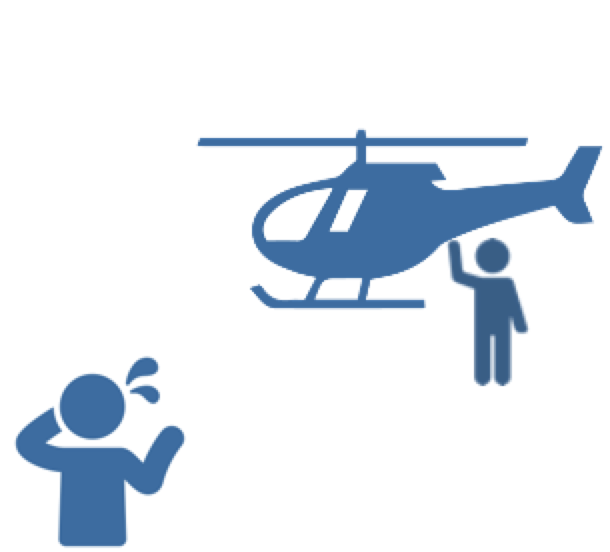
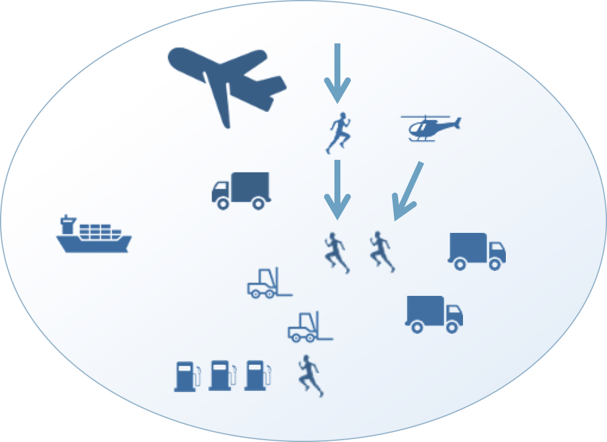
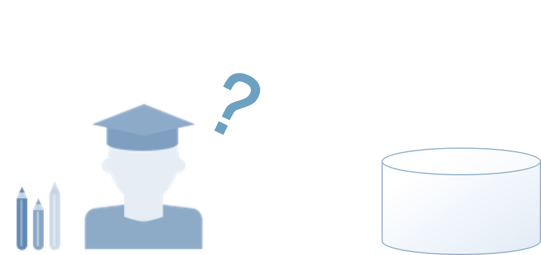
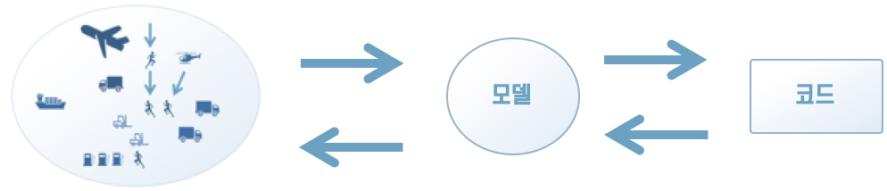
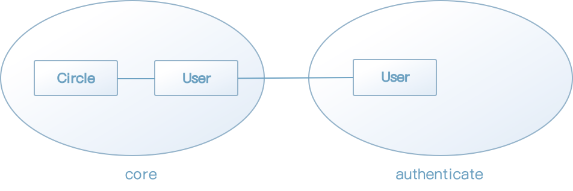

### 15.1 경량 DDD에 머무르지 않기 위해

도메인 주도 설계에 쓰이는 패턴만 도입하는 것을 경량 DDD라고 한다.

경량 DDD의 주제는 코드 스타일로 한정되기 때문에 개발자들 선에서 실천하기 쉽고, 단기적으로 제품에 일정 수준 이상의 질서를 갖추게 할 수 있다. 이 때문에 비용 대비 효과가 높게 느껴지며 패턴을 그저 답습하는 것만으로 만족하는 경우도 생긴다.

하지만 도메인 주도 설계의 진짜 목표는 그저 패턴을 적용하는 것만이 아니다. 패턴을 모든 문제의 해결책으로 삼는 것은 기술만으로 모든 문제를 해결하려는 자세와 다를 바가 전혀 없다.

가장 중요한 것은 도메인의 본질을 파악하는 것이다. 패턴은 절대적인 답이 아니라 도메인을 잘 파악하고 이를 코드로 제대로 표현하기 위한 기술적 보조 수단에 지나지 않는다.

항상 '어떻게 구현할 것인가' 혹은 '어떻게 표현할 것인가'만을 고민해서는 도메인을 제대로 파악할 여유가 생기지 않는다. 패턴은 이런 고민에 빼앗길 시간을 절약해 준다. 그리고 패턴을 통해 얻은 여력으로 도메인에 집중해야 한다.

도메인과 구현을 연결하는 모델링 기법도 도메인 주도 설계의 주요 테마다. 이 책의 역할은 패턴을 소재로 도메인 주도 설계를 배우기 위한 토대로서 기초적 지식을 전달하는 것이지, 경량 DDD에서 만족하게 하는 것이 아니다. 도메인 주도 설계의 모델링 기법을 모두 다루지는 못해도 대표적인 개념을 이번 장에서 살펴볼 것이다.

[칼럼] 패턴의 남용, 그리고 패턴을 버려야 할 때

> 망치를 손에 들면 모든 것이 못으로 보인다는 말이 있다. 마찬가지로 패턴을 익히고 나면 패턴을 적용할 곳을 찾아 다니는 자신을 발견한다.
>
> 망치로 친 자리에 있는 것이 모두 못이라면 문제가 없겠지만, 볼트라면 도구를 잘못 선택한 셈이 된다. 패턴에도 보이는 것 모두를 못으로 보이게 하는 마력이 있다.
>
> 도메인을 잘 나타내기 위한 수단으로 패턴을 자유로이 구사할 수 있게 됐다면, 때로는 패턴을 버릴 줄 아는 결단도 필요하다.


#### 15.2 도메인 전문가와 함께 모델링하기

친구와 함께 여행 가기로 한 날, 친구가 헬리콥터를 타고 당신을 만나러 온다면 당황스러울 것이다.

어떤 대상에 관해 이야기할 때 두 사람의 인식이 서로 어긋나는 경우가 자주 있다. 실제로는 헬리콥터를 타고 친구가 만나러 나올 만큼 서로의 인식이 극단적으로 어긋나는 경우는 드물겠지만, 시스템 개발에서는 이와 별 차이가 없는 황당무계한 오해가 비일비재하다.



[그림 15-1] 서로 인식이 어긋나는 경우

예를 들어 '사용자 등록하기'와 '사용자 새로 저장하기'라는 표현이 있다고 하자. 두 표현은 결과는 같아도 표현에서 오는 어감에 차이가 있다. 전자는 직관적이며, 후자는 좀 더 시스템 관점에 가깝다. 이 정도의 차이라면 대화에서도 "'새로 저장하기'는 '등록하기'라는 뜻이겠지"라고 서로 이해할 수 있을 것이다. 사람은 대화의 전문가다. 대화 중 처음 듣는 단어가 나와도 자신의 경험에 비추어 어느 정도 그 의미를 추측할 수 있다.

그러나 더 복잡한 섬세한 개념에 대한 대화라면 약간 사정이 다르다. 개발자가 쓰는 언어가 시스템의 관점에 더 가까울수록, 이를 듣는 도메인 전문가는 대화를 포기하고 싶어질 것이다. '이 사람들 하는 말이 너무 어렵다. 시스템 개발은 이 사람들이 전문가일 테니 전부 다 맡겨버리는 게 낫겠어'와 같이 생각하는 상황이 벌어진다.

언어의 차이 때문에 서로 간의 이해를 포기하면 결국 도메인과 코드가 단절되는 결과를 낳는다. 도메인의 개념이 왜곡돼도 이 단절 탓에 왜곡을 눈치채지 못하고 수정조차 불가능해진다. 제품의 코드는 개발자의 이해와 언어 위에 쌓아 올려지는 것이므로 소프트웨어가 엉뚱한 길로 나가게 된다.

개발자는 도메인 전문가와 반드시 대화를 나눠야 한다. 도메인 전문가란 도메인을 실제로 실천하는 사람으로, 그저 이해관계자를 의미하는 것이 아니다. 도메인을 이해하려면 이들 도메인 전문가가 속하는 세계가 어떠한지 그들의 관점에서는 무엇이 보이는지를 알아야 한다. 이왕 같은 노력을 들인다면, 시스템 관점의 언어를 도메인 전문가의 언어로 변환하기 보다는 도메인 개념을 왜곡하지 않는 개발자와 도메인 전문가 사이의 공통 언어로 소통한다는 마음을 가져야 한다.



[그림 15-2] 도메인을 실천하는 도메인 전문가


#### 15.2 해결이 필요한 진짜 문제 찾기

도메인 전문가와 대화를 나누면 소프트웨어의 방향성을 결정하는 데 도움을 받을 수 있다. 그렇다고 개발자가 도메인 전문가와 무조건 같은 입장에서라는 말은 아니다.

도메인 전문가가 문제로 보는 사안은 실제로 사소한 것에 불과하고 진짜 문제는 전혀 다른 곳에 있는 경우도 있다. 도메인 전문가와 무조건 같은 입장에 서기만 해서는 이 차이를 깨닫기 어렵다. 정말 해결이 필요한 문제는 개발자와 도메인 전문가의 대화를 통해 발견된다.

개발자는 도메인 전문가와 협력해 유익한 도메인의 개념을 뽑아내야 한다. 이렇게 뽑아낸 개념이 도메인 모델이다. 여기서 주의할 점은 도메인 전문가가 모든 도메인 개념을 안다고 생각해서는 안 된다는 것이다.

의외로 사람은 자신이 원하는 것이 무엇인지 모르는 경우가 많다. 시스템에 대한 지식이 없는 도메인 전문가 역시 새로운 소프트웨어가 도메인 활동에 어떤 도움을 줄 수 있는지 알지 못한다. 평생 종이와 연필만 사용했던 사람이 데이터베이스의 유용함을 이해하기 어려운 것과 마찬가지다.



[그림 15-3] 상상도 하지 못했던 세계

또 도메인 전문가는 방대한 지식을 갖고 있지만, 그 중 어떤 지식이 시스템에 유용할 것인지는 알지 못한다. 이것을 알려면 시스템이 어떤 일을 할 수 있는지 이해해야 한다.

그렇다고 개발자가 도메인 전문가의 말을 듣기만 해서도 안 된다. 개발자의 임무는 도메인 전문가와의 대화에서 시스템에 유용한 개념과 지식을 뽑아내는 것이다. 때에 따라서는 개발자가 시스템에 필요한 것이 무엇인지 도메인 전문가를 이해시켜야 할 수도 있다. 대화란 서로 주고 받는 것이다. 도메인 전문가와 개발자가 협력하며 도메인 개념 중에서 유용한 지식을 골라내 도메인 모델로 승화시켜야 한다.

그러나 도메인 전문가를 보조하는 소프트웨어를 만드는 프로젝트임에도 도메인 전문가가 전혀 관여하지 않는(혹은 못 하는) 프로젝트도 있다. 도메인 전문가 없이 개발자와 이해관계자만 회의에 참석하거나 심하면 이해관계자 선에서 모든 사항이 결정되는 경우도 있다. 소프트웨어를 사용할 당사자에 대한 인터뷰도 이해관계자를 거쳐 간접 인터뷰가 되기 십상이다. 당연하지만 이런 경우에는 가치 있는 도메인 모델을 뽑아내기 어려우며, 그 모델로 만들어진 소프트웨어도 부족한 기능 탓에 사용자들에게 뒤로 타박을 당하기 일쑤다. "새 시스템이 쓸 만한 게 못된다."라고 말이다.

지식을 증류하는 작업은 개발자와 도메인 전문가의 공동 작업이어야 한다. 그래야만 개발자가 겉핥기 수준을 넘어 도메인 전문가가 겪는 진짜 문제를 이해하고 애플리케이션이 할 일이 무엇인지 알 수 있다. 그래야만 비로소 문제 해결에 한 발짝 다가설 수 있는 것이다.

만약 프로젝트 책임자 혹은 이해관계자로서 프로젝트를 성공시켜야 하는 입장에 있다면 한 가지 조언을 하고 싶다. 도메인 전문가와 대화를 중개하는 역할을 맡을 것이 아니라 개발자가 도메인 전문가와 더 많은 대화를 나눌 수 있게 돕는 역할을 맡아야 한다. 비즈니스의 관점을 개발자와 공유하고 주체가 되어 이해하게 하는 방법으로 이보다 나은 것은 없다.


#### 15.2.2 도메인과 코드를 연결하는 모델

소프트웨어 개발의 최종 성과물은 코드다. 모델은 이러한 코드와 도메인을 연결하는 다리 역할을 한다.

간혹 전문가가 자신이 만든 모델을 있는 그대로 개발자에게 강요하는 경우가 있다. 이런 모델은 구현을 위한 배려가 결여되거나 아예 구현이 불가능한 경우가 많다. 개발자는 이런 모델을 받은 다음, 이 무책임한 모델을 참고해 기술적으로 구현 가능한 모델을 새로이 만드는 작업을 한다. 그러나 이렇게 만든 새로운 모델에는 중요한 지식이 빠져 있거나 불필요한 지식이 많이 섞여 있기 쉽다. 설계 및 구현 단계에서도 도메인의 새로운 면을 이해하고 발견하는 경우가 있다. 모델이 설계와 단절돼 있다면 이때 발견된 내용을 피드백해서 모델을 개선하는 것이 불가능하다.

도메인과 코드는 모델을 통해 연결된다. 도메인과 코드는 모델을 통해 항상 소통하면서 소프트웨어가 도메인을 더 잘 나타내는 모델을 가질 수 있게 해야 한다.




[그림 15-4] 모델과 코드의 상호 피드백


### 15.3 보편 언어

사람은 언어를 통해 의사소통한다. 프로그래밍의 패턴도 그 대표적인 예다. 이 책을 여기까지 읽었다면 '엔티티'가 가리키는 대상이 어떤 것인지 잘 이해하고 있을 것이다. 사람은 사물이나 개념에 이름을 붙이고 그 대상에 대한 인식을 공유함으로써 의사소통을 할 수 있다.

한 가지 개념에 여러 이름이 붙어 있다면 당연히 의사소통에 혼란이 올 것이다. 소프트웨어 개발 현장에서도 이런 일이 자주 일어난다. 앞서 예로 들었듯이, 도메인 전문가는 '사용자 등록하기'라는 표현을 쓰는데, 개발자가 '사용자를 새로 저장하기'라는 표현을 사용하는 경우가 바로 이런 경우다. 같은 기능인데도 도메인 전문가와 개발자의 표현이 서로 다르다.


[그림 15-5] 이름을 통한 인식의 공유

개발자는 항상 기술적인 일을 생각한다. '사용자 등록하기'라는 말을 들으면 곧장 관계형 데이터베이스에 사용할 SQL 쿼리가 머리를 스치고, 사용자를 등록한다는 기능의 본질 대신 '사용자 정보를 데이터스토어에 새로 저장하기'라는 구체적인 처리 과정에 집중하기가 쉽다. 이런 경향은 직업병에 가까운 것으로, 개발자를 탓할 거리는 못 된다.

그러나 도메인 전문가와 개발자가 사용하는 언어가 완전히 다르다면 의사소통에 심각한 장애가 발생한다. 개발자는 도메인 전문가로부터 가치 있는 도메인 모델이 무엇인지 알아내야 한다. 이 목적을 달성하려면 도메인 전문가와 같은 언어로 대화해야 한다.

물론 개발자 사이에서도 언어의 불일치가 의사소통에 방해되는 경우가 있다. 예를 들어 다음과 같이 '사용자 등록하기'라는 유스케이스가 변경된 경우를 생각해 보자.

[리스트 15-1] 사용자 등록 처리는 무엇일까?

```java
public class UserApplicationService {
  public void saveNew(UserSaveNewCommand command);
  public void update(UserUpdateCommand command);
  public void remove(UserRemoveCommand command);
}
```

클래스 정의를 훑어봐도 '사용자 등록하기'가 보이지 않는다. 물론 프로젝트를 속속들이 아는 개발자라면 UserApplicatoinService.saveNew 메서드가 '사용자 등록하기' 기능임을 알 테니 바로 해당 메서드를 찾아갈 수 있을 것이다. 그러나 프로젝트에 참여한 지 얼마 안 된 개발자라면 '사용자 등록하기'에 해당하는 메서드명을 찾지 못하니 우선 코드를 일일이 읽어볼 수밖에 없다.

이런 미묘한 언어의 차이가 불러오는 작은 스트레스가 쌓여 막대한 비용으로 돌아온다. 서로의 언어를 변환하는 노력을 더욱 본질적인 곳에 집중할 수 있다면 더욱더 건설적인 결과를 얻을 수 있을 것이다. 개발자 간의 의사소통에도 공통의 언어를 사용하는 것이 바람직하다.

이렇게 언어의 차이로 인한 비용을 절감하려면 프로젝트 참가자의 공통 언어를 만들 필요성이 있다. 여기서 말하는 공통 언어를 보편 언어라도 한다. 보편이란 '널리 두루 미치는 것, 모든 것에 공통되는 것'이라는 의미다. 즉, 보편 언어는 프로젝트 내 모든 곳에서 사용해야할 언어라는 의미를 갖는다. 도메인 전문가와의 대화는 물론이고 개발자 간의 의사소통이나 코드에도 보편 언어를 사용해야 한다.

도메인 전문가의 언어가 자주 보이므로 언뜻 보면 보편 언어는 개발자가 양보해 도메인 전문가의 언어를 받아들인 것으로 보이기 쉬우나, 상황이 그렇게 단순하지는 않다. 보편 언어는 프로젝트에서 사용하기 위해 만든 공통 언어이므로 도메인 전문가의 언어를 그대로 가져온 것이 아니다. 도메인 전문가의 언어는 시스템에 적합하지 않은 부분이 있다. 

대화 중에 단어의 정의가 정확하지 않거나 애매한 경우를 발견하면 더 적합한 표현을 찾는다. 도메인 전문가와 개발자 누구라도 이런 단어를 지적하고 새로운 표현으로 수정할 수 있다.

이렇게 양방향에서 보편 언어를 다듬어 나가는 과정을 통해 개발자는 도메인을 더 깊게 이해할 수 있고, 도메인 전문가는 개발자가 필요로 하는 지식이 어떤 것인지에 대한 감각을 키워나갈 수 있다.

언어는 문화다. 서로의 대화가 헛돌지 않을 수 있는 언어 기반을 만들어가는 것은 말 그대로 서로의 문화를 알아가는 교류다.


#### 15.3.1 깊은 통찰을 얻으려면

모델에 대한 깊은 통찰을 얻으려면 보편 언어에 기반한 대화가 중요하다.

모국어가 아닌 언어로 대화하려면 번역이 필요하다. 언어 자체보다는 대화의 내용에 집중해야함에도 특정 단어의 의미에 함몰되기 일쑤다. 이렇게 낭비되는 노력은 무의식적으로 지출되는 비용이 된다. 같은 언어로 대화할 수 있다면 이러한 비용은 불필요했을 것이다. 통역은 커뮤니케이션을 정체하게 하는 원인의 하나다.

보편 언어가 충분히 보급되지 않았거나 전혀 사용되지 않은 프로젝트는 항상 통역을 거쳐야 하는 상황과 같다. 도메인 전문가는 기술적 전문 용어나 시스템을 이해하지 못하며 독자적인 전문 용어로 대화한다. 반면 개발자는 이 전문 용어를 다시 개발자의 언어로 번역해야 한다. 여기에 들어가는 비용이 얼마나 될까?

논의 과정에서 말의 뉘앙스는 찰나에 지나가지만, 때로는 이 뉘앙스가 중요한 개념의 힌트가 된다. 문서에도 나오지 않는 힌트를 놓치지 않으려면 항상 대화에 집중해야 한다. 통역을 기다릴 여유가 없다.

개발자도 자신이 잘 알지 못하는 도메인을 이해하기 위해 노력하지만, 도메인 전문가의 협력을 받지 못하면 이러한 노력도 어중간한 이해나 오해로 이어지기 쉽다. 잘못된 이해가 다시 개발팀 내에서 공유되고 결국 도메인 개념과 동떨어진 객체로 구현된다. 남의 일이라면 좋겠지만, 내 일이라면 그만한 비극이 없다.

이런 일을 막으려면 쌍방이 같은 언어를 쓴다고 생각해도 두 가지 다른 방언을 쓰고 있다는 것을 깨달아야 한다. 단절은 필연적으로 존재한다.

어중간한 이해나 오해는 프로젝트가 진행됨에 따라 심각한 문제를 일으킨다. 같은 비용을 들인다면 통역 비용 대신 프로젝트 내 공용 언어인 보편 언어를 만들고 유지하는 것이 훨씬 더 건설적이다. 

물론 처음에는 마음먹은 대로 잘 되지 않는다. 새로운 외국어를 배울 때처럼 갑갑할 때가 많다. 그러나 익숙해지기만 하면 통역 없이 외국어로 대화하는 것보다 훨씬 유창하게 대화할 수 있을 것이다

보편 언어로 대화하다 보면 도메인 개념을 설명할 때 제대로 전달하기 어려운 용어, 애매한 단어 등을 발견하게 될 것이다. 바로 이런 것들이 깊은 통찰로 이어지는 계기가 된다. 왜 전달하기 어려운지, 어떤 부분이 애매한지, 이런 것으로 개발자와 도메인 전문가가 서로 지적해 나가는 과정에서 모델이 좀 더 정제되고 도메인 지식을 제대로 표현할 수 있게 된다.


#### 15.3.2 코드에서 사용되는 보편 언어

보편 언어는 어느 곳에서든 이용된다. 대화는 물론이고 문서에서도 보편 언어를 사용하며, 최종 성과물인 코드에도 사용할 수 있다.

'사용자명 변경하기'라는 표현이 도메인에서 자연스러운 표현이라면 코드에도 '이름 변경하기'라는 말이 충실히 표현돼야 한다.

[리스트 15-2] 코드에 사용된 도메인의 자연스러운 표현

```java
public class User {
  public void changeName(UserName name) {
    (...생략...)
  }
}
```

개발자가 '변경하기'라는 자연스러운 표현을 무시하고 구현 내용에 가까운 '데이터 수정'이라는 표현을 사용했다면 다음과 같은 코드가 됐을 것이다.

[리스트 15-3] 도메인의 표현으로 부자연스러운 표현이 사용된 코드

```java
public class User {
  public void updateName(UserName name) {
    (...생략...)
  }
}
```

결과적으로 User 클래스의 정의에서 '변경하기'라는 표현이 사라졌다. 이 코드를 제대로 이해하려면 도메인 전문가가 이름 '변경'이라는 표현을 쓸 때마다 개발자가 의식적으로 이름 '수정'으로 머릿속으로 고쳐 생각해야 한다. 지금 같은 간단한 코드라면 문제가 없겠지만, 클래스명부터 이러한 차이가 시작되는 경우라면 머릿속에서 바꿔 생각하는 것도 한계에 봉착한다.

또 보편 언어를 따라 '이름 변경'이라는 표현을 사용하지 않는다면 코드 수정의 정당성을 모든 관계자가 이해할 수 있는 기회를 잃게 된다. 예를 들어 '이름 변경'에 대한 규칙이 바뀌었다면 updateName 메서드를 수정하는 정당성은 개발자만 알 수 있다. 이 메서드의 이름이 '이름 변경'이 아니라 '이름 수정'이기 때문이다.

코드가 도메인 모델을 잘 반영한다면 도메인에 일어난 변화도 그대로 코드에 적용할 수 있다. 모델을 코드로 옮길 때 보편 언어를 사용하는 것은 설계와 코드를 연결 짓는 중요한 작업이다.


[그림 15-6] 도메인에 일어난 변화가 코드에 적용되는 과정

[칼럼] 보편 언어와 우리말의 관계

> 클래스 정의와 메서드 정의는 프로그램 코드인 만큼 영문자로 작성된다. 여기서 우리말과 영어 사이의 벽이 문제가 될 수 있다.
>
> 앞서 본문에서도 언급했던 '사용자명 변경하기'라는 표현을 코드로 정확히 옮기면 리스트 15-4와 같은 코드가 돼야 한다.
>
> [리스트 15-4] 우리말로 작성한 사용자 엔티티 정의
>
> ```java
> public class 사용자 {
>   	private 사용자명 name;
>   
>   public 사용자(사용자명 name) {
>    	this.name = name;
>   }
>   
>   public void 이름변경하기(사용자명 name) {
>    	if (name == null) {
>    		throw new IllegalArgumentException("name: " + name);
>    	 }
>    	 	this.name = name;
>   	}
> }
> ```
>
> 리스트 15-4의 코드가 아무리 보편 언어의 표현을 따른다고 해도, 우리말로 코드를 작성한다는 것은 꽤 강한 제약이다. 영문자가 아니면 에디터의 자동완성 기능을 사용할 수 없는 경우도 있고, 프로그래밍 언어 중에서 아예 멀티바이트 문자를 코드에 사용할 수 없는 것도 있다.
>
> 반대로 도메인 전문가와 영어만으로 대화한다는 것도 불가능하다. 그들에게도 나름의 업무가 있다. 무조건적인 협력을 얻을 수는 없다.
>
> 결국 대화는 우리말로 하되, 이 내용을 영어로 번역해서 클래스명과 메서드명을 짓는 현실적인 타협안을 택하게 된다. 하지만 적절한 영어 번역이 무엇이냐 하는 과제는 아직도 남아있다.


### 15.4 컨텍스트의 경계 정하기

보편 언어만큼 중요한 주제가 컨텍스트의 경계를 정하는 것이다. 컨텍스트의 경계는 도메인의 국경과 견줄 만하다. 국경을 넘으면 사용되는 언어도 달라지듯 도메인에도 경계가 있어서 이 경계를 넘어서면 보편 언어도 달라질 수 있다.

비즈니스가 동질적인 한 덩어리인 경우는 드물다. 보편 언어를 만들고 비즈니스에 대한 이해를 깊게 하다 보면, 같은 대상을 가리키는 서로 다른 단어가 있다거나 반대로 같은 단어가 하나 이상의 의미를 갖는 상황을 마주치게 된다. 그러나 이런 현상이 꼭 단어의 정의가 불분명하기 때문에 일어나는 것은 아니다. 이런 현상을 겪고 있다면 여러 컨텍스트의 경계 위에 있을 가능성이 높다.

이번에도 우리가 만들 애플리케이션을 예로 들어 보겠다. 이 애플리케이션에는 지금 사용자와 서클, 이렇게 2가지 모델이 있다. 사용자는 사람이 소프트웨어를 처음 이용하기 위해 반드시 등록하는, 말하자면 시스템상의 분신이다. 서클은 취미를 공유하는 등 일정한 목적을 가진 사용자들의 모임이다. 사용자는 서클을 만들거나 원하는 서클에 소속될 수 있다. 여기까지는 아무 문제가 없다.

그러나 시스템을 이용하기 위한 로그인은 어떨까? 사람이 사용자로 로그인해 시스템 이용을 시작한다. 로그인하려면 ID와 패스워드가 필요하다. ID로는 사용자명을 쓸 수도 있겠지만, 패스워드는 별도의 필드가 있어야 한다. 리스트 15-5의 코드는 User 클래스에 새로운 패스워드 속성을 추가하고 패스워드를 이용한 인증을 거칠 수 있게 한 것이다.

[리스트 15-5] 패스워드 인증을 위한 메서드 추가하기

```java
public class User {
    private UserId id;
    private UserName name;
    private Password password;

    public User(UserId id, UserName name, Password password) {
        if (id == null)
            throw new IllegalArgumentException("id: " + id);
        if (name == null)
            throw new IllegalArgumentException("name: " + name);
        if (password == null)
            throw new IllegalArgumentException("password: " + password);

        this.id = id;
        this.name = name;
        this.password = password;
    }

    public void changeName(UserName name) {
        if (name == null)
            throw new IllegalArgumentException("name: " + name);
        this.name = name;
    }

    public boolean isSamePassword(Password password) {
        return this.password.equals(password);
    }
}
```

패스워드는 평문 패스워드의 해시값을 저장한 값 객체로서, 패스워드 일치 여부는 이 해시값을 비교하는 방식으로 확인한다. 여기서 패스워드가 일치하는지 비교하는 메서드를 사용자를 나타내는 User 객체의 행위로 정의해야 하는가다.

서클을 만들거나 서클에 소속되는 사용자와 시스템에서 말하는 사용자는 같은 단어지만, 그 배경과 목적은 전혀 다르다. 본래 사용자의 활동에 패스워드라는 개념은 없었다. 이 같은 일이 벌어진 이유는 관점이 바뀌면 무엇이 중요한지도 바뀌기 때문이다.

이런 상황에서 서로 다른 개념을 같은 객체에 꼭 억지로 욱여 넣을 필요는 없다. 이름은 같지만, 별개의 객체로 정의하는 쪽이 더 낫다.

[리스트 15-6] 서로 다른 객체로 정의한 두 가지 사용자 개념

```java
package core.model.users;

public class User {
    private UserId id;
    private UserName name;

    public User(UserId id, UserName name) {
        if (id == null)
            throw new IllegalArgumentException("id: " + id);
        if (name == null)
            throw new IllegalArgumentException("name: " + name);

        this.id = id;
        this.name = name;
    }

    public void changeName(UserName name) {
        if (name == null)
            throw new IllegalArgumentException("name: " + name);
        this.name = name;
    }
}

package authenticate.model.users;

public class User {
    private UserId id;
    private Password password;

    public User(UserId id, Password password) {
        if (id == null)
            throw new IllegalArgumentException("id: " + id);
        if (password == null)
            throw new IllegalArgumentException("password: " + password);

        this.id = id;
        this.password = password;
    }

    public boolean isSamePassword(Password password) {
        return this.password.equals(password);
    }
}
```

한 패키지 안에 같은 이름의 클래스를 2개 만들 수는 없으므로 패키지를 서로 다르게 한다. core 패키지와 authenticate 패키지는 같은 도메인이지만, 서로 다른 시스템이다. 이런 방법으로 2개의 사용자 개념을 별개의 모델로 만들 수 있다.

덧붙이자면, 서로 다른 컨텍스트는 별개의 시스템이므로 같은 데이터 소스를 이용하더라도 구체적인 기술 기반은 서로 다른 것을 사용할 수 있다. 어느 한쪽이 SQL을 직접 실행하면서 다른 쪽은 ORM을 적용할 수도 있다. 이런 구성은 레거시 시스템을 유지하는 시스템에서 자주 볼 수 있다.

시스템이 규모가 커지면 통일된 모델을 유지하기가 어렵다. 통일된 모델을 억지로 유지하는 코드는 거대하고 제약이 많은 객체가 되는 경우가 많다. 서로 다른 컨텍스트의 사정에 따라 복잡해진 객체 탓에 변경에 어려움이 많을 것이다.

변경에 어려움이 생기지 않게 하려면 모델을 포착하는 방식이 달라지는 지점에서 시스템을 분할한다. 그리고 이렇게 분할된 영역마다 언어를 통일한다. 영역을 분할한다는 것은 달리 말하면 경계를 긋는 것이며 이 경계가 바로 컨텍스트의 경계다.


### 15.5 컨텍스트맵

경계를 긋고 이에 따라 컨텍스트를 분할하면 각 컨텍스트는 쉽게 이해할 수 있지만, 거꾸로 모든 컨텍스트가 연결된 전체 도메인의 큰 그림이 보이지 않는다. 소프트웨어를 변경할 때 특정 한 컨텍스트에 너무 집중하면 나머지 컨텍스트와의 관계를 놓치기 쉽다. 

예를 들어 시스템 리소스 문제가 있어 리소스를 절약해야 하는 상황에서 authenticate 패키지를 개발하는 팀이 사용자 객체의 식별자를 userId 대신 userName으로 바꾸려 한다고 생각해 보자. Authenticate 패키지의 User 클래스는 리스트 15-7고 같이 변경될 것이다.

[리스트 15-7] 식별자를 사용자명으로 변경하기

```java
package authenticate.model.users;

public class User {
    private UserName id;
    private Password password;

    public User(UserName id, Password password) {
        if (id == null)
            throw new IllegalArgumentException("id: " + id);
        if (password == null)
            throw new IllegalArgumentException("password: " + password);

        this.id = id;
        this.password = password;
    }

    public boolean isSamePassword(Password password) {
        return this.password.equals(password);
    }
}
```

리스트 15-7만으로는 문제가 없어 보이지만, core 패키지의 User 클래스에서 문제가 발생한다.

[리스트 15-8] core 패키지도 변경해야 한다.

```java
package core.model.users;

public class User {
    private UserId id;
    private UserName name;

    public User(UserId id, UserName name) {
        if (id == null)
            throw new IllegalArgumentException("id: " + id);
        if (name == null)
            throw new IllegalArgumentException("name: " + name);

      	this.id = id;
        this.name = name;
    }

  	// 이젠 userName이 식별자인데 식별자를 변경한다.
    public void changeName(UserName name) {
        if (name == null)
            throw new IllegalArgumentException("name: " + name);
        this.name = name;
    }
}
```

core 패키지는 userName을 User 클래스의 식별자로 삼도록 수정되지 않았다. 결국 authenticate 패키지를 담당하는 팀의 변경한 내용이 core 패키지까지 전달되지 않아 User 클래스의 명세가 서로 다르게 된다. 컨텍스트가 분리되면서 다른 컨텍스트에 대한 영향을 놓친 것이다.

이런 혼란을 피하려면 컨텍스트 간의 관계를 정의하고 전체 도메인을 내려다 볼 수 있는 컨텍스트맵을 만들어야 한다.




[그림 15-7] core 패키지와 authenticate 패키지의 관계를 나타낸 컨텍스트맵

개발자는 컨텍스트맵을 보고 모델 간의 관계를 파악한 다음 작업을 시작한다.


#### 15.5.1 팀과 팀 사이의 가교 역할을 하는 테스트

시스템이 성장함에 따라 개발팀의 규모도 커진다. 모든 개발자가 똑같이 거대한 도메인을 상대하기에는 효율이 떨어지므로 팀을 분할하게 된다. 컨텍스트의 경계는 팀을 나누는 윤곽 역할도 한다.

자신의 컨텍스트에서 변경이 필요할 때는 먼저 컨텍스트맵을 확인한 다음, 인접한 컨텍스트에 미치는 영향이 있다면 해당 컨텍스트를 관리하는 팀과 교섭을 진행한다.

상황에 따라서는 한쪽이 관리하는 컨텍스트의 모듈을 대신 수정해야 할 수도 있으며, 컨텍스트의 관계에 상류와 하류가 생기는 경우도 있다. 이런 경우 상류에 해당하는 컨텍스트를 담당하는 팀의 상황이 여유롭다면 문제가 없지만, 하류에 해당하는 컨텍스트와 이를 담당하는 팀이 여럿 있는 경우에는 들어오는 요청을 모두 처리하지 못해 문제가 생긴다.

상류 팀은 항상 자신들의 위치가 크리티컬 경로상에 있음을 인식하며 하류 팀의 요청을 들어줄 의무가 있다는 것을 알아야 한다. 그러나 현실적인 문제로 인원이 부족하다면 모든 팀의 요청을 동시에 만족시키기는 불가능하다. 이런 상황에서 팀과 팀 사이의 가교 역할을 하는 것이 바로 테스트다.

부연하자면, 하류 팀은 먼저 상류 팀과 협력해 원하는 명세를 검증하는 테스트를 만든다. 상류팀은 수정에 따른 영향이 의도치 않게 프로그램을 파괴하더라도 이 테스트로 조기에 영향을 발견할 수 있다.

이상적인 상황은 하류 팀이 상류 팀을 의식하지 않고 자유롭게 집중하는 것이다. 이런 상황이 실현되지 않으면 지속해서 모델을 수정하는 작업은 그저 허황된 꿈에 지나지 않는다.

프로바이더 측에서 작업 중이라면 클라이언트 측에 먼저 협력을 요청하기 바란다. 클라이언트 측에서 작업하는 입장이라면 프로바이더 측에 먼저 협력을 제의하기 바란다. 테스트가 두 팀을 연결하는 가교가 되어줄 것이다.


### 15.6 상향식 도메인 주도 설계

어떤 대상에 대한 접근법은 크게 상향식(Bottom-up)과 하향식(Top-down) 두 가지로 나뉜다. 도메인 주도 설계는 이 중 어떤 쪽일까?

개인적으로 도메인 주도 설계는 상향식에 가깝다고 본다.

도메인 주도 설계의 주역은 도메인이다. 어떤 소프트웨어를 만들지는 그다음 문제다. 실제로, 도메인 전문가가 필요하다고 판단했던 요소가 결국 판단 착오로 결론 나는 경우가 있다. 산출물 중심이 아니라 먼저 어떤 문제를 해결할지부터 시작하는 접근법은 상향식 스타일에 가깝다.

이 책에 적용된 접근법 역시 상향식이다. 도메인 주도 설계를 구성하는 요소 중 가장 밑바탕에 해당하는 것부터 하나씩 설명했다. 그리고 설명 내용 자체도 정의부터 시작하는 하향식이 아니라 먼저 실무에서 부닥칠 수 있는 문제를 제시한 다음, 그 문제를 풀어가는 작업을 통해 설명했다. 이 책은 도메인 주도 설계의 패턴을 가르치며 동시에 이를 실천하는 교본의 역할을 하고 새로운 지식을 마주하는 요령을 알려준다.

어떤 지식을 얻기 위해 사전 지식이 필요한 경우가 많다. 지식은 사슬과도 같이 이어진다. 상향식으로 지식을 쌓아 올리다 보면 반드시 이해에 도달할 수 있다.


### 15.7 정리

지금까지 설명했듯이 상향식으로 도메인 주도 설계를 적용하는 것만으로도 코드가 놀랄 만큼 변화하는 것을 알 수 있다. 소프트웨어의 앞날도 그만큼 밝아졌을 것이다.

도메인 주도 설계의 목적인 모델을 통해 도메인과 코드를 연결하고 이를 반복적으로 개선해 나가는 것이지, 패턴을 맹목적으로 따르는 것이 아니다. 사용자에게 정말로 유용한 소프트웨어를 만들려면 우선 그 사용자에 대해 잘 알아야 한다. 도메인에 관한 문제는 도메인을 둘러싼 환경을 이해하지 못하는 한 완전히 이해했다고 할 수 없다.

이번 장에서 설명한 '보편 언어'와 '컨텍스트의 경계 정하기'는 그 주제의 개요를 설명한 것에 지나지 않는다. 이들 주제를 설명하는 것은 필자의 역할이 아니기 때문이다.

이 책을 읽고 도메인 주도 설계를 조금이라도 친근하게 느껴 더 높은 경지를 향하겠다고 마음 먹었다면 에릭 에반스의 ⌜도메인 주도 설계⌟를 꼭 읽어 보기 바란다. 이 책의 내용은 한 개발자의 이야기다. 이 책에서 미처 설명하지 못한 내용은 에릭에게서 직접 듣기 바란다.

독자 여러분의 눈앞에 있는 문은 잠긴 문이 아니다. 도메인 주도 설계로 가는 물을 지금 활짝 열어젖히기 바란다.

  

  

 