# 1장. 모놀리식 지옥에서 벗어나라

FTGO의 CTO인 메리의 고민
 
* 개발팀이 주요 릴리스 날짜를 못맞추게 된 이유 고민
* 모놀리식 지옥에 빠져 고통받는 사례
* 마이크로서비스 아키텍처 및 최신 개발방법론이 왠지 먼 나라 이야기처럼 들림

## 1.1 서서히 모놀리식 지옥에 빠져들다.

FTGO는 무슨 회사?

* 온라인 음식 배달업체
* 소비자가 웹사이트/모바일앱에서 주문 -> 음식 픽업하여 소비자에게 배달
* 배달원과 음식점에 대금 지불(스트라이프), 메뉴 편집, 메시지 전송(트릴리오), 이메일 전송(AWS SES)
* 시간이 지날수록 애플리케이션은 복잡해지고 진흙탕집(Big Ball of Mud)패턴으로 변함 -> [참고 링크](https://m.blog.naver.com/PostView.nhn?blogId=muchine98&logNo=220253889434&proxyReferer=https:%2F%2Fwww.google.com%2F)

### 1.1.1 FTGO 애플리케이션 아키텍처
코어가 비즈니스 로직으로 구성된 육각형 아키텍처(hexagonal architecture), port/adapter 아키텍처
- outbound adapter (db access, 외부 서비스 호출)
- inbound adapter (rest api)

논리적으로는 모듈화한 아키텍처이지만 애플리키에션은 WAR 파일 하나로 패키징 한다.

https://getoutsidedoor.com/2018/09/03/ports-adapters-architecture/


### 1.1.3 모놀리식 지옥의 실상
FTGO는 왜 모놀리식 지옥에 빠져 있는 것일까요?

1. 너무 복잡해서 개발자가 주눅이 든다.
    * 이해할 수 없을 정도로 내용이 방대하고 버그 고치고 새 기능을 구현하기 힘들고 오래 걸린다.
    * 메리는 컨퍼런스에서 jar파일 수천개의 디펜던시를 분석하는 툴의 개발자를 알게 됨. 뭔가 성과(?) --> **결국 MSA로 갈아타는 것이 낫다.**
2. 개발이 더디다.
    * IDE 실행속도도 느리고 빌드 시간도 오래 걸린다.
3. 커밋부터 배포에 이르는 길고 험난한 여정
    * 배포는 한달에 한번
    * 테스트 시간 오래 걸림 (한 사이클 2~3일)
4. 확장하기 어렵다.
    * 리소스 사용형태가 다르다. (예: RAM vs CPU)
5. 모놀리스는 확실하게 전달하기 어렵다. --> 신뢰성 보장 어려움
    * 특정 모듈의 메모리 누수로 인한 시스템 전체 다운
6. 갈수록 한물간 기술 스택에 발목이 붙잡히다.
    * 기술 변경이 어렵다.
    * 점차 안쓰는 기술스택으로 울며 겨자 먹기로 유지
    
## 1.4 마이크로 서비스 아키텍처가 답이다
마이크로 서비스의 기준? 
아주 작은(코드 주 수가 100 미만) 서비스?, 개발하는 데 2주?

필자는 확장 큐브라는 3차원 확장 모델


**X축 확장**: 다중 인스턴스에 고루 요청 분산

부하분산기 뒤에 인스턴스를 N개 띄워 놓고 요청을 분배


**Z축 확장**: 요청 속성별 라우팅

요청 헤더에 포함된 userId를 보고 N개의 동일한 애플리케이션 중 선택


**Y축 확장**: 기능에 따라 서비스로 분해

기능 분해


### 1.4.2 마이크로서비스는 모듈성을 갖고 있다.
여러 사람이 이해하고 개발할 수 있게 여러 모듈로 분해한다.
마이크로서비스 아키텍처는 서비스를 모듈성의 단위로 사용한다. 각 서비스간에는 API라는 경계로 구분

### 1.4.3 서비스마다 DB가 따로 있다.
여기서 DB는 database라는 개념보다는 store의 개념이다.

### 1.5.1 마이크로서비스 장점
1. 크고 복잡한 애플리케이션을 지속적으로 전달/배포할 수 있다.
    * 테스트성: 자동화 테스트
    * 배포성: 자신이 담당한 서비스 변경분 배포
    * 자율성, 느슨한 결합: 독립적으로 개발, 배포, 확장 가능
2. 서비스가 작아 관리하기 용이하다.
    * 개발자가 코드를 이해하기 쉽다. 생산성 올라감
3. 서비스를 독립적으로 배포/확장할 수 있다.
    * 리소스 요건에 따라 하드웨어 배포 가능
4. 결함 격리가 잘 된다.
    * 메모리 누수에도 다른 서비스 영향 없음
5. 신기술을 시험/도입하기 쉽다.
    1. 언어, 기술 선택이 자유롭다.

### 1.5.2 마이크로서비스 단점
1. 딱 맞는 서비스를 찾기가 쉽지 않다.
    * 서비스 분해에 정해진 규칙이 없다.
2. 분산 시스템은 복잡하다.
    * IPC는 메서드 호출보다 복잡
    * 사용불능, 지연시간, 부분실패 서비스 처리
    * 트랜잭션, 여러서비스 데이타 조회 고려
    * IDE툴, 서비스간 테스트 자동화
3. 여러 서비스에 걸친 공통 기능은 배포할 때 잘 살펴야 한다.
    * 서비스 배포 계획 필요
4. 도입 시기를 결정하기 어렵다.
    * 모놀리식 -> 마이크로서비스로 개발하는 것이 좋다.
    
## 1.6 마이크로서비스 아키텍처 패턴 언어

### 1.6.1 마이크로서비스 아키텍처도 만병통치약은 아니다.
* 생산성 10배인 기법/기술 같은 것은 없다.
* 동기/리액티브, 객체지향/함수형, 자바/자바스크립트, REST/메시징
* 무조건 마이크로서비스로 해야 한다는 것은 아니다.

### 1.6.2 패턴 및 패턴 언어
* 패턴이란 특정 상황에 발생한 문제에 대한 재사용 가능한 해법
* 전략 패턴
* 상용 패턴 구조
    * 강제 조항 (forces)
    * 결과 맥락 (resulting context)
    * 연관 패턴 (related patterns)
    
1. 강제 조항: 문제 해결을 위해 반드시 처리해야 할 이슈
* 어느 조항이 더 중요한지 맥락에 따라 다르므로 욱선순위를 정행 ㅑ한다.
* 코드는 이해학 쉬워야 하는 동시에 성능도 우수해야 한다. --> 리액티브 스타일 코드는 성능은 우수하지만 개발자가 이해하기 어렵다.

2. 결과 맥락: 패턴 적용 결과
* 장점: 패턴의 좋은 점
* 단점: 패턴의 나쁜 점
* 이슈: 패턴 적용 시 발생한 새로운 문제점

3. 연관 패턴: 다섯 가지 관계 유형
* 선행자: 이 패턴을 필요하게 만든 선행 패턴. 마이크로서비스 패턴은 모놀리식 아키텍처 패턴을 제외한 나머지 패턴들의 선행자이다.
* 후행자: 이 패턴으로 야기된 이슈를 해결하는 패턴. 마이크로서비스 패턴을 적용하려면 서비스 디스커버리, 회로 차단기 패턴 등을 적용해야 한다.
* 대안: 이 패턴의 대체 솔루션을 제공하는 패턴 (msa or monolith)
* 일반화: 문제를 해결하는 일반적인 솔루션에 해당하는 패턴
* 세분화: 특벙 패턴을 더 세부적으로 나타낸 형
 

### 1.6.3 마이크로서비스 아키텍처 패턴 언어 개요
1. 인프라 패턴: 주로 개발 영역 밖의 인프라 문제 해결
    * 배포, 디스커버리, 외부 API
2. 애플리케이션 인프라: 개발에도 영향을 미치는 인프라 문제를 해결
    * 횡단 관심사, 보안, 트랜잭셔널 메시징, 통신 스타일, 신뢰성, 관측성
3. 애플리케이션 패턴: 개발자가 맞닥뜨리는 문제를 해결
    * 분해, DB 아키텍처, 쿼리, 데이터 일관성 유지, 테스트

1. 애플리케이션을 여러 서비스로 분해하는 패턴
    1. 비즈니스 능력에 따라 분해
    2. 하위 도메인에 따라 분해
2. 통신 패턴
    1. 통신 스타일: 어떤 종류의 IPC를 사용하는가?
        * 메시징/원격 프로시저 호출
    2. 디스커버리: 서비스의 IP주소를 어떻게 가져오는가?
        * 서비스 레지스트리
    3. 신뢰성: 서비스 불능 시 서비스간 통신의 신뢰성은 어떻게 보장?
        * 회로 차단기
    4. 트랜잭셔널 메시징: DB 트랜잭션에 메시지 송신하고 이벤트 발행하는 행위를 어떻게 통합
    5. 외부 API: 애플리케이션 클라이언트는 서비스와 어떻게 통신하는가?
        * API Gateway/BFF (Back-end for Front-end)
        * [BFF pattern 링크](https://medium.com/@giljae/back-end-for-front-end-pattern-bff-4b73f29858d6)
3. 트랜잭션 관리를 위한 데이터 일관성 패턴
    * 2PC/Saga
4. 데이터 쿼리 패턴
    * API 조합(Composition) / CQRS(Command Query Responsibility Segregation)
5. 서비스 배포 패턴
    * VM이나 컨테이너에 배포/서버리스 방식
6. 관측성 패턴
    * 헬스 체크 API
    * 로그 수집
    * 분산 추적
    * 예외 추적
    * 애플리케이션 지표
    * 감사 로깅
7. 서비스 테스트 자동화 패턴
    * 컨슈머 주도 계약 테스트
    * 컨슈머 쪽 계약 테스트
    * 서비스 컴포넌트 테스트
8. 횡단 관심사 처리 패턴
    * 마이크로서비스 섀시 패턴(Microservice Chassis)
9. 보안 패턴
    * JWT
    
### 프로세스와 조직
* 팀당 인원: 8~12명 (2 pizza)
* 콘웨이 법칙: 애플리케이션 아키텍처는 그것을 개발하는 조직의 구조를 그대로 반영한다.

---
### [Q&A]

> Q. 처음부터 msa 방식을 사용하는 것이 좋을까요? 어차피 시스템은 거대해지고 확대될 것으로 예상이 된다면.. (34 page)

* 이 책 534p에 마이크로서비스로 리팩터링 하는 방법이 나와있다.
* 여러분이 개발 책임자라면 EER의 차기버전을  MSA로 갈 것인가? 아님 모노리스로 할 것인가?
    * 비즈니스 문제를 마이크로 서비스로 해결할 수 있을 때만 마이크로서비스를 도입을 해야 한다.
* 완전히 뜯어 고치기 보다는 단계적으로 리팩터링 하는 것이 좋다.
    * 전체 구조에서 비즈니스적으로 문제가 되는 부분(가치가 있는)을 뽑아서 선택적으로 서비스로 구현한다. --> 결국 단계적으로 모두 서비스로 대체된다.
    * 이런 형태를 strangler 패턴이라고 한다.

* 모노리스 -> 마이크로 서비스 전략
    1. 새 기능을 서비스로 구현한다.
        * 새로 작성되는 코드는 서비스로 구현하라.
        1.1.새 서비스를 모놀리스에 연계
            * API 게이트웨이: 새 기능 요청은 새 서비스로, 기존 요청은 모놀리스로 라우팅
            * 통합 글루 코드(integration glue code): 서비스가 모놀리스 데이터에 접근하고 모놀리스에 구현된 기능을 호출할 수 있게 서비스를 모놀리스에 통합 (REST-API, 도메인 이벤트) 
    2. 표현 계층과 백엔드를 분리한다.
        * 표현 계층, 비즈니스 로직, 데이터 접근 로직 분리
    3. 기능을 여러 서비스로 추출한다.
        * 모놀리스가 가진 비즈니스 능력을 하나씩 서비스로 옮기는 분해 전략을 구사해야 한다.
        3.1 도메인 모델 분리
        3.2 DB 리팩터링
        3.3 변경 범위를 줄이기 위해 데이타를 복제

> Q. 모놀리식, ms 각각이 예를들면 어떤 시스템에 어울릴까요? (34 page)

어떤 시스템이라기 보다는 어떤 비즈니스 요구사항인지? 조직구성, 일정의 영향으로 분리하는 것이 맞을 것 같다.

[모놀리스]
* 작은팀
* mvp version 신제품
* 자본금이 많지 않음
* 주요기능에 대한 성능병목 현상이 없음
* microservice가 유행이라고 생각

[마이크로서비스]
* 연구, 아키텍처 계획을 필요로 하는 일정이 없는 경우
* 다양한 언어에 대한 지식을 가진 팀이 있는 경우
* 확장성, 신뢰성에 대한 고민
* 몇개의 개발 부서가 있는 경우
* 기존 모놀리스 앱이 있고 여러 microservice에 분리될 수 있는 application이 있는 경우

참고자료: https://dev.to/alex_barashkov/microservices-vs-monolith-architecture-4l1m


> Q. attic의 경우 share를 통해 어차피 각 서비스는 share를 dependency 하고 있으니 아무리 서비스가 분리되어 있다고 해도 share에 대한 지속적 배포 위험성과 테스트는 복잡할 수 있지 않을까요? (34 page)

microservice에서 shared library는 결국 없어지거나 최소화 되어야 한다.
attic에서도 shared를 사용하고 있지만 business 영역이 아닌 기술단위로만 사용되고 있다.

아래 내용은 shared library 사용에 대한 blog글이니 참고

https://phauer.com/2016/dont-share-libraries-among-microservices/

* microservice간 shared library를 사용하지 마라
    * 공통코드를 library로 뽑아내는 것은 최선의 선택인것 같다.
    * 재사용성은 빠른 개발을 할수 있다?
    * 하지만 micoservice에서는 서비스간 결합도를 증가시킨다.
* TL;DR
    * 단기간에 개발속도 향상시키지만 결국 coupling을 증가시킨다.
    * 결국 개발속도 증가, 코디네이션 노력, 현대화 방해
    * business logic, model에 shared library를 사용하지 마라.
    * 대신 중복. shared service or service를 더 쪼개라.
* Drawbacks
    * microservice의 큰 장점은 서비스간 독립성이다. (개발, 조합, 기술)
    * 다른 서비스의 변화, 릴리스와 무관하게 진행 가능함.
    * 2개의 서비스가 library를 공유한다면 더 이상 독립적이지 않다.
* Increased Coordination
    * library 작업은 팀간 협업이 필요하다. 이로 인해 개발속도가 느려진다.
    * library 변화가 모든 microservice에 변화를 필요로 한다.
* Errors and Side-Effects
    * library의 변화는 필요하지 않은 서비스에도 영향을 준다. (error, side effect)
* Mental Barrier to refactoring and modernization
    * 개발자들이 shared library 변경을 꺼려하는 경향이 있다.
        * Fear: 다른 서비스에 어떤 영향이 있는지 모르겠어요. 다른 서비스 도메인을 잘 몰라서 어떤 영향인지 예측이 안되요.
        * Avoided effort: library update하기 위해 많은 일을 해야 한다.
            * library 변경, 테스트, jenkins build, release, 모든 microservice에 library 버전 update. 모든 microservice build, 모든 microservice test... 이 많은 것을 할 시간이 없다.
* Exceptions
    * Spring, Apache, Lombok 같은 open source는 충분한 가치가 있다.
    * 기술적 관심으로 library를 가지는 것은 괜찮다. (logging, monitoring 등)
    * business나 domain logic을 library로 이동하지 마라.
    * 예를 들어 도메인 모델이 library에 있다면 새로운 요구사항이 들어왔을때 이 모델을 사용하는 모든 microservice를 update해야 한다.
    * 모든 service는 bounded context를 가지고 있다.
    * library를 사용하는 모든 service가 같은 팀에서 유지된다면 괜찮다.
    * 변화가 한팀 내에서 관리될 수 있다. 
* Alternatives
    * 중복을 수용하라. 
    * shared service를 사용하라. 
* Conclusion
    * shared nothing 접근을 따라야 한다.


> Q. 확장큐브의 X축 확장은 EER 이중화가 이에 해당하는건가요? (38 page)

X축은 동일역할을 하는 여러대의 서비스를 의미하며 EER의 이중화와 동일하다.
EER과 같이 2대 구성이 아닌 N대로 무한 확장 가능한 구조이며 이를 위해 service discovery 및 api gateway가 필요하다.

> 59 page 장애처리 시 msa가 모놀리식보다 에러원인을 찾기 어려울 것 같은데 어떤 시스템을 이용하여 어떻게 해결하는지 설명해주세요~

이 책 461p 참고

* 로그 수집 패턴
    * 서비스에 로그파일로 저장되면 로그를 확인하기 어렵다. AWS 람다는 영구적인 파일 시스템 자체가 없다.
    * 로그 수집 인프라가 필요하다.
        * ELK(elastic search/logstash/kibana)
        * fluentd, apache flume
        * aws cloudwatch
* 분산 추적 패턴
    * 특정 api가 느려진 원인? 어디를 봐야 할까? api gateway?, service
    * 분산 추적 서버: open zipkin
    * 인스트루멘테이션 라이브러리: 스프링 클라우드 슬루스(spring cloud sleuth)
* 예외 추적 패턴
    * 서비스에서 예외가 발생하면 무조건 예외 추적 서비스에 보고하도록 구성
    * 예외 추적 서비스 라이브러리: 허니배저(HoneyBadger)

> Q. 1.6.2 상용 패턴 구조의 예시를 보여주실 수 있을까요? (52 page)

없습니다~


# 11장. 프로덕션 레디 서비스 개발

## 11.1 보안 서비스 개발
 - 애플리케이션은 아래와 같이 4가지 보안 요소를 구현함
    1) 인증 : 접근 권한 (ex. ID/PW, API key 등 자격 증명)
    2) 인가 : Data에 어떤 작업을 요청하여 수행할 수 있는 권한
    3) 감사 : 보안 이슈 탐지 등.
    4) 보안 IPC : 서비스간 통신 보안. TLS(Transport Layer Security)를 두어 경유 하도록 하는게 이상적
 - MSA에서의 보안 구현
    1) API G/W에서 인증/인가 처리
      - 인가 처리는 각 서비스에서 구현하는걸 추천
      - API G/W와 서비스와의 결합도 때문
    2) JWT를 통한 신원/역할 관리
      - 토큰이 탈취 되면 보안상 문제 있음
      - 만료를 짧게 잡아 토큰을 발행해서 해당 문제를 회피 하지만 근본적인 해결책 아님
    3) OAuth
      - OAuth 2.0 
        1) 인증 서버 (Authorization Server) : 액세스/리프레시 토큰 획득 API 제공
        2) 액세스 토큰 (Access Token) : 리소스 서버 접근 허가 토큰
        3) 리프레시 토큰 (Refresh Token) : 액세스 토큰을 얻기 위한 토큰이며, 수명은 길지만 취소 가능 함.
        4) 리소스 서버 (Resource Server) : 서비스
        5) 클라이언트 (Client) : 서비스(리소스 서버)에 접근 하는 클라이언트
      - 액세스/리프레시 2개의 토큰이 발행 됨.
      - 액세스 토큰이 만료되는 경우 리프레시 토큰을 이용하여 새로운 액세스 토큰을 방행함.
    
## 11.2 구성 가능한 서비스 설계
 - 구성값 서비스 전달
    1) Push model : 배포 인프라에서 서비스로 전달
    2) Pull model : 서비스에서 구성서버에 접속하여 읽어 옴.

## 11.3 관측 가능한 서비스 설계
 - 관측 서비스 설계 패턴
    1) 헬스 체크 (health check)
      - 서비스 인스턴스는 자신이 서비스 가능한 상태인지 배포 인프라에 알려야 함. (호출)
      - 서비스 인스턴스는 서비스 가능한 상태인지 헬스 체크 끝점을 구현 해야 함. (구현)
    2) 로그 수집 (log aggregation)
      - 로그를 수집, 검색 함 (ex. elasticsearch, logstash, kibana)
    3) 분삭 추적 (distributed tracing)
      - 서비스별 ID를 부여하여 AOP등을 상용하여 수집한 후 추적 서버에 전달하여 관리 함.
    4) 예외 추적 (exception tracing)
      - 예외를 감시하여 출현 하면 알림을 보내고 로깅함.
    5) 애플리케이션 지표 (application metrics)
      - 정의된 지표를 수집하여 push,pull 방식으로 전달 함.
      - 알려진 오픈 소스로는 prometheus 가 있음. 
    6) 감사 로깅 (audit logging)
      - 사용자 액션을 기록하는 것으로 아래와 같이 3가지 방식이 있음.
        1) 코드에 구현
        2) AOP 사용
        3) event sourcing

## 11.4 서비스 개발: 마이크로서비스 섀시 패턴
 - MSA의 횡단 관심사를 처리 하기 위한 F/W
 - 서비스 매시는 특정 언어 종속성이 없는 표준 기술 기반의 횡단 관심사를 처리 하기 위한 F/W (ex. 이스티오, 링커드, 콘듀이트)

## 11.5 마치며
 - 서비스는 본연의 기능을 충종은 당연하고, 관측 가능 해야 함.
 - 일반 적으로 MSA에서는 API G/W에서 인증,인가를 담당 하며, OAuth2.0은 이를 위한 훌륭한 수단 임.
 - 공통 프로퍼티가 존재 하고, 이를 분산 서비스에게 전달 하기 위해 push/pull 방식으로 프로퍼트를 전달 함.
 - 횡단 관심사에 대해서는 "마이크로서비스 섀시"를 사용하여 비지니스 구현에 집중 할 수 있도록 함.

## Q&A
 1. attic에서 인증과 인가는 어떤 시스템에서 어떻게 구현되어있나요? (441)
    - UAA에서 Manage 되고 있으며, G/W에서 기능을 담당 하고 있음
 
 2. 보안 컨텍스트를 정적 스레드 로컬 변수에 저장한다는게 무슨말인가요? (443)
    - SecurityContextHolder와 Authentication
    - SecurityContext 제공
    - 하나의 Thread에서 Authentication 공유하기 위해서 ThreadLocal 사용
    - Authentication는 Principal과 GrantAuthority 제공
    - Principal은 사용자에 대한 정보
    - GrantAuthority는 권한 정보 (인가 및 권한 확인할 때 사용)
    ```
       Authentication authentication = SecurityContextHolder.getContext().getAuthentication();
       // 사용자 정보
       Object principal = authentication.getPrincipal();
       // 사용자 권한
       Collection<? extends GrantedAuthority> authorities = authentication.getAuthorities();
       // 인증 여부
       boolean authenticated = authentication.isAuthenticated();
    ```
    
 3. 해시코프 볼트와 AWS 파라미터 스토어 설명 해주세요. (454)
    - AWS 파라미터 : 발급된 key로 그에 mapping 되어 있는 property 값을 리턴해주는 방식 
 4. 지표전달 방식 푸시와 풀 방식 중 어떤게 좋을까요? (470)
    - 책에 나와 있는 예제 지표는 Push 방식이 더 적합해 보인다.
      응용 서비스에서 발생하는 data로 발생 즉시 중앙 서버에 발송 하는것이 좋아 보이며, 중앙 서버에서 취합 및 배치 작업이 있어야 할 것으로 보임.
      반대의 경우(pull) 방식으로 구현 된다면 응용 서비스에서 pull 텀마다 data를 모았다가 넘겨주는 추가 로직이 필요 할 것으로 보임.
 5. 감사로깅은 사용자의 액션을 기록하여 DB에 저장한다고 했는데, 영구적으로 누적되어 저장되는건가요? 그렇다면 데이터가 너무 많아지지않을까요? (472)
    - 서비스별로 보관 주기 설정이 필요 할 것으로 보임.
 
 6. 헬스 체크 끝점 구현에서 jdbc 데이터소스를 사용하는 서비스에는 테스트 쿼리를 실행하는 헬스 체크를, RabiitMQ 메시지 브로커를 쓰는 서비스에는 RabiitMQ 서버가 가동중인지 확인하는 헬스 체크 로직을 자동으로 구성하는 내용(예제)을 보여주세요. 이 장에서 얘기하는 헬스체크, 로그수집, 분산수집, 예외추적 지표, 감사 등을 현재 attic 교육 코드에 적용해서 보여줄 수 있을까요? (461)
 
 7. oauth1과 oauth2의 차이점이 뭔가요? (450)
 
 8. 세션 배수(session draining) 매커니즘에 대해 설명해주세요. (444)
 
 9. 같은 언어와 플랫폼의 시스템이라면 섀시와 메시의 차이가 없을까요? (473)
    - 섀시와 메시는 다른 개념으로 보여 집니다.
      섀시 : 서비스 내에서 구현 해야 하는.
      메시 : 서비스로 제공 되는.
# 12장. 마이크로서비스 배포

## 주요내용
- 프로덕션 환경 구성
- 서비스 배포
- 쿠버네티스

## 프로덕션 환경


1. 서비스 관리 인터페이스 \
: 개발자가 서비스를 생성, 수정, 구성 할 수 있는 인터페이스를 제공
2. 런타임 서비스 관리 \
: 서비스 인스턴스가 항상 적정한 개수만큼 실행되도록 함. 서비스 인스턴스가 깨지면, 프로덕션 환경은 해당 인스턴스를 재시동해야 함
3. 모니터링 \
: 서비스가 무슨일을 하고 있는지, 로그 파일 및 지표를 개발자가 관찰 할 수 있게 함. 프로덕션 환경에 문제가 있으면 개발자에게 알림 역할
4. 요청 라우팅 \
: 사용자 요청을 서비스로 보냄.


## 서비스 배포
```
- 언어에 특정한 패키지로 서비스를 배포
- 서비스를 가상 머신으로 배포
- 서비스를 컨테이너로 배포
- 서비스를 서버리스 배포 기술로 배포
```

### 언어에 특정한 패키징(JAR/WAR 파일) 포맷 패턴
: 프로덕션에 배포할 코드와 필요한 런타임을 모두 언어에 특정한 패키지에 넣고 배포하는 것. 서비스 인스턴스는 개별 JVM 프로세스로 실행됨.

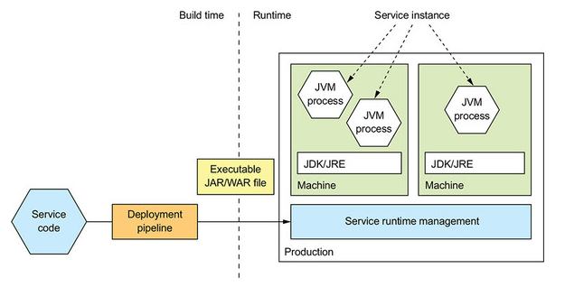

- 장점
    - 배포가 빠르다.
    - 리소스를 효율적으로 활용할 수 있다.
  
- 단점
    - 기술 스택을 캡슐화할 수 없다.
    - 서비스 인스턴스가 소비하는 리소스를 제한할 방법이 없다.
    - 여러 서비스 인스턴스가 동일 머신에서 실행될 경우 서로 격리할 수 없다.
    - 서비스 인스턴스를 어디에 둘지 자동으로 결정하기 어렵다.

### 가상 머신 패턴
: 서비스를 가상 머신 이미지로 묶어 배포하는 방식. \
서비스를 VM  이미지로 묶어 프로덕션에 배포한다. 각 서비스 인스턴스가 하나의 VM 이다.


- 장점
    - VM 이미지로 기술 스택을 캡슐화 함
    - 서비스 인스턴스가 격리됨
    - 성숙한 클라우드 인프라를 활용함
    
- 단점
    - 리소스를 효율적으로 활용할 수 없음
    - 배포가 비교적 느림
    - 시스템 관리 오버헤드가 발생함

### 컨테이너 패턴
: VM 장점은 유지한 채 더 가볍게 마이크로서비스를 배포하는 방법. \
서비스를 컨테이너 이미지로 묶어 프로덕션에 배포한다. 각 서비스 인스턴스가 곧 하나의 컨테이너이다. \
이 책에서는 도커로 배포하는 방법 설명


- 장점
    - 기술 스택의 캡슐화
    - 서비스 인스턴스 격리
    - 서비스 인스턴스의 리소스 제한
    - VM 보다 가벼운 기술, 컨테이너 이미지 빌드가 빠름
    
- 단점
    - 컨테이너 이미지를 직접 관리해야 하는 부담이 있음.
    - OS와 런타임 패치도 정기적으로 해주어야 함.


참고) VM과 컨테이너의 차이


- VM
    - VM은 컴퓨터 환경을 가상화하여 소프트웨어로 구현한 것
- Container
    - Container는 VM에 비교했을 때 한 층 더 애플리케이션 중심으로 설계됨.
    - Container는 별도의 OS나 드라이버 없이 Host OS를 공유하는 형태로 실행됨.
    
### 서버리스 패턴
퍼블릭 클라우드에서 제공하는 서버리스 배포 메커니즘을 이용하여 서비스를 배포한다. \
책에서는 AWS 람다를 예시로 들었고, AWS 람다를 사용하면 개발자는 서버, 가상 머신, 컨테이너 관련 부분은 신경쓰지 않아도 된다.

## 쿠버네티스
컨테이너를 쉽고 빠르게 배포/확장하고 관리를 자동화해주는 오픈소스 플랫폼이다.

- 쿠버네티스 개요
    - 리소스 관리: 여러 머신을 CPU, 메모리, 스토리지 볼륨을 묶어 놓은 하나의 리소스 풀로 취급
    - 스케줄링: 컨테이너를 실행할 머신을 선택
    - 서비스 관리: 마이크로서비스에 직접 매핑되는 서비스를 명명하고 버저닝함

- 쿠버네티스 아키텍처
    - 쿠버네티스는 전체 클러스터를 관리하는 마스터와 컨테이너가 배포되는 노드로 구성되어 있습니다.모든 명령은 API 서버를 호출하고 노드는 마스터와 통신하면서 필요한 작업을 수행합니다.
    - API 서버: kubectl CLI에서 사용하는 서비스 배포/관리용 REST API
    - etcd: 클러스터 데이터를 저장하는 키-값 NoSQL DB
    - 스케줄러: 노드가 배정되지 않은 새로 생성된 pod를 감지하고, 실행할 노드를 선택한다.
    - 컨트롤러 매니저: 노드가 다운되었을 때 통지와 대응에 관한 책임을 가진다.
    - 큐블릿: 노드에 할당된 pod의 생명주기를 관리함. pod를 생성하고 pod 안의 컨테이너에 이상이 없는지 확인하면서 주기적으로 마스터에 상태를 전달 함
    - 큐브 프록시: 큐블릿이 pod를 관리한다면 프록시는 pod로 연결되는 네트워크를 관리함.
    
    
    
    
    
- 쿠버네티스 핵심 개념
    - 쿠버네티스의 핵심은 상태이며 쿠버네티스를 사용하려면 어떤 상태가 있고 어떻게 상태를 선언하는지 알아야 함
    - 쿠버네티스는 상태를 관리하기 위한 대상을 오브젝트로 정의함
    - 파드: 쿠버네티스에서 배포할 수 있는 가장 작은 단위로 컨테이너와 스토리지, 네트워크 속성을 가집니다.
    
        
        
    - ReplicaSet: pod를 여러 개 복제하여 관리하는 오브젝트입니다. pod를 생성하고 개수를 유지하려면 반드시 ReplicaSet을 사용합니다. ReplicaSet 명세를 yml 파일로 정의합니다.
    
        
    
    - 서비스: 네트워크와 관련된 오브젝트입니다. pod를 외부 네트워크와 연결해주고 여러 개의 pod를 바라보는 내부 로드밸런서를 생성할 때 사용합니다.
    - volume: 저장소와 관련된 오브젝트 입니다. 
    
- 쿠버네티스 배포 방식
    - 쿠버네티스는 Deployment, StatefulSets, DaomonSet, Job, CronJob 등 다양한 배포방식을 지원합니다.
    - Deployment: 새로운 버전의 애플리케이션을 다양한 전략으로 무중단 배포할 수 있습니다.
    - StatefulSets: 실행 순서를 보장하고 호스트 이름과 볼륨을 일정하게 사용할 수 있어 순서나 데이터가 중요한 경우에 사용할 수 있습니다.
    - DaemonSet: 로그나 모니터링 등 모든 노드에 설치가 필요한 경우에 사용합니다.
    - Job, CronJob: 배치성 작업에 이용합니다.

- 하나의 pod가 생성되는 과정
        
    

    
## 참고
- https://subicura.com/2019/05/19/kubernetes-basic-1.html

## Q&A
1. (485p) 그림 12-5처럼 1개의 스프링부트에서 여러개의 서비스 인스턴스로 띄우는 방법이 가능한가요? \
=> 네. 가능합니다. 

    

2. (487p) 아마존 EC2에서 서비스를 운영한다면 AMI로 배포하는 것과 docker로 배포하는 것 중 어느방법이 좋을까요? \
=> AMI 보다 Docker container Image로 배포하는 것이 좋은 방법인 것 같습니다. AWI는 OS까지 포함된 이미지고, 
docker는 OS가 포함되지 않고 관련 라이브러리와 서비스만으로 구성된 이미지입니다. \
각각 장단점이 있을 수 있겠지만, 이미지 빌드 시간과 리소스 효율적으로 활용할 수 있기 때문에 docker 배포가 좋아보입니다.

3. attic을 사이트에 배포할때 어느 방식이 좋을까요? (패키징 포맷, 가상머신, 컨테이너 패턴) \
(금융권, aws, 일본, 그 외) \
=> 컨테이너 패턴이 좋을 것 같습니다. 2번에서 말했듯 가상머신보다 배포가 빠르고, 리소스를 효율적으로 활용할 수 있습니다. \
OS와 런타임 패치만 잘 이루어진다면, 가볍고 각각의 서비스에만 집중할 수 있으니 좋을 듯 합니다.

4. (490~497p) 가상머신 패턴의 단점중 "리소스 효율적 활용, 시스템 관리 오버해드" 가 있는데 컨테이너 패턴의 단점으로 지목되어 있지 않아 이를 해소 할수 있어 보입니다. 
"컨테이너 패턴"은 "가상머신 패턴"의 단점 해결 방안은 어떤것들이 있을까요? 아니면 다른 패턴으로 해결하는 걸까요? \
=> 컨테이너 패턴은 OS를 제외한 관련 라이브러리와 서비스만으로 구성된 이미지를 배포합니다. \
따라서 각 컨테이너가 OS를 공유하므로 리소스를 효율적으로 활용할 수 있습니다.\
시스템 관리 오버헤드는 컨테이너 패턴에서도 해결되지 않습니다. 공유하는 OS, 런타임을 관리해야하며, 이는 서버리스 패턴으로 해소할 수 있습니다.

5. (518p) 조금 이상한 질문 일수 있겠는데.... "서버리스 패턴"은 배포 파일을 AWS에 올리고 배포되면 사용하는 리소스 만큰 "돈"을 내고 서비스를 이용하면 된다는건데 이것을 패턴이라 지칭 할 수 있는걸 까요? 사람과 장비를 "돈"을 내고 구입/고용 하는거랑 무슨 차이가 있을까요? "특정 유료 서비스가 패턴으로 지칭 할 수 가 있는걸까요?" \
=> 책에서는 AWS 람다를 이용한 서버리스 패턴을 예로 들었고, 서버리스 패턴은 주요 퍼블릭 클라우드는 모두 제공합니다. \
제 생각엔 패턴이라기 보다는 시스템 관리를 하지 않아도 된다는 솔루션인 것 같고, 책에서는 서비스를 배포하는 방법에 대한 것을 패턴으로 설명한 것 같습니다.

6. MSA 로 고객사 인프라에 구축할 경우, 운영 부담을 줄이기 위해 어떤 것이 가장 필요할까요? \
=> 업무를 분리하여 전문성을 키우는 것이 제일 중요할 것 같습니다. 모든 인프라를 알기는 어렵고, docker, OS, runtime 등에 대한 업무 분리가 필요할 듯 합니다. # 13. 마이크로서비스로 리팩터링

- strangler application

## 13.1 마이크로서비스 리팩터링 개요

### 1. 모놀리스를 왜 리팩터링 하는가?

- 모놀로식 어플리케이션의 문제
  - 느린 전달(slow delivery)
  - 버그 투성이 소프트웨어 릴리스
  - 나쁜 확장성

### 2. 모놀리식 옥죄기

- 어플리케이션 현대화(application modernization)
- "완전히 뜯어고치기(big bang rewrite)" 를 삼가하라.
- strangler application 개발로 단계적 리팩터링 → 스트랭글러 어플리케이션 패턴(마틴 파울러)
  - 값을 조기에 자주 검증: 핵심 가치를 먼저 전환. 전환 가치를 빨리 입증하면 경영진의 지원도 증가.
  - 모놀리스 변경 최소화: 변경 범위 줄일 수 있는 전략을 통해 작업량 최소화.
  - 기술 배포 인프라: 모든 것이 다 필요한 것은 아니다

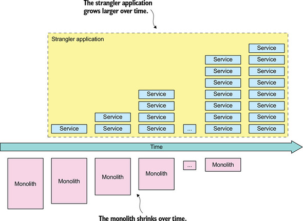


 ## 13.2 모놀리스 → 마이크로서비스 리팩터링 전략

### 1. 새 기능을 서비스로 구현한다

>  구멍의 법칙(Law of Holes): 구멍에 빠졌다는 것을 알았다면 땅은 그만 파라

- 새 서비스를 모놀리스에 연계
  - API 게이트웨이: 새 기능은 새 서비스로, 기존 요청은 모놀리스로 라우팅
  - 통합 글루 코드(integration glue code): 서비스가 모놀리스 데이터와 구현 기능을 호출할 수 있게 서비스를 모놀리스에 통합
- 새 기능을 서비스로 구현하는 시점
  - 새 기능을 서비스로 구현 할 수 없으면 모놀리스에 구현하고 나중에 이하의 전략으로 스트랭글러 어플리케이션으로 이전

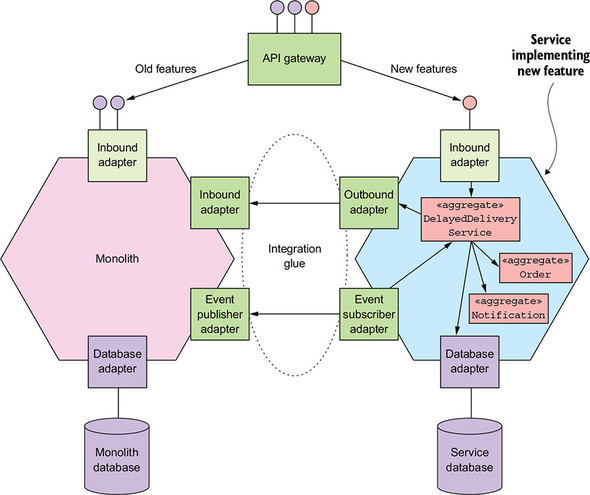

### 2. 표현 계층과 백엔드를 분리한다

- 표현 계층을 비즈니스 로직과 데이터 접근 계층에서 분리 ; 프론트엔드와 백엔드 분리
- 퍼사드 로 구성된 대단위(coarse-grained) API 가 분리 틈새
- 이를 통해,
  - 두 어플리케이션을 서로 독립적으로 개발, 배포, 확장 할 수 있다
  - 나중에 개발할 마이크로서비스가 호출할 수 있는 원격 API 가 표출된다


### 3. 기능을 여러 서비스로 추출한다

- 비즈니스 능력 분해
  - API 끝점이 구현된 인바운드 어댑터
  - 도메인 로직
  - DB 접근 로직 등이 구현된 아웃바운드 어댑터
  - 모놀리스의 DB 스키마

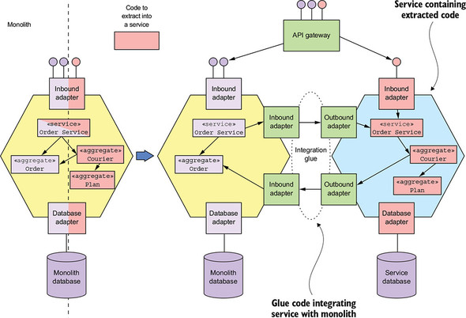

- 도메인 모델 분리
  - aggregate 관점으로 서비스의 도메인 모델 추출; 객체 레퍼런스를 기본키로 대체
- DB 리팩터링
  - 엔터티에 따라 DB 테이블로 분리해서 이전
- 변경 범위를 줄이기 위해 데이터를 복제
  - 데이터를 복제하여 DB 클라이언트가 새 스키마를 사용하도록 단계적 업데이트
  - 이전하는 동안 원본과 신규 스키마의 동기화 트리거 사용
  - 서비스에도 적용 가능
- 어떤 서비스를 언제 추출하나
  - 시간별로 구획된 아키텍처(time-boxed archichecture) 정의를 통해 목적 시스템 정의
  - 서비스 추출 순서 결정 전략
    - 모놀리스 개발을 동결하고 요건이 있을 때마다 서비스를 추출
    - 서비스 추출 시 기대되는 혜택을 어플리케이션 모듈별로 순위를 매겨 추출
      - 기대 효과: 개발 가속화, 성능,확장성,신뢰성 문제 해결, 다른 서비스로 추출할 수 있게 만듬
      - 순위를 정해 리팩터링 태스크를 백로그에 추가
      - 좀 더 전략적이고 비즈니스 니즈를 충족

## 13.3 서비스와 모놀리스 간 협동 설계

- 서비스와 모놀리스 상호 작용은 통합 글루 코드가 관장한다

### 1. 통합 글루 설계

- 통합 글루 API 설계
- 상호 작용 스타일과 IPC 선택
- 부패-방지 계층 구현
- 모놀리스가 도메인 이벤트를 발행/구독하는 방법

### 2. 서비스와 모놀리스에 걸쳐 데이터 일관성 유지

- 보상 트랜잭션을 지원하도록 모놀리스를 고치기는 어렵다
- 사가 적용 시 모놀리스는 보상 트랜잭션을 지원할 필요가 없다
- 서비스 추출 순서를 조정하면 보상 트랜잭션을 모놀리스에 구현하지 않아도 된다

### 3. 인증/인가 처리

- 모놀리스의 보안 메커니즘과 JWT 기반의 보안 메커니즘 동시 지원이 관건
- 모놀리스의 로그인 핸들러에 ID/역할 등 사용자 정보가 포함된 추가 쿠키 반환하여, API 게이트웨이가 요청에 정보(Authorization 헤더)를 포함하여 서비스를 호출하고 서비스는 사용자 정보를 사용할 수 있다.

## 13.4 새 기능을 서비스로 구현: 배달 실패한 주문 처리

## 13.5 모놀리스 분해: 배달 관리 추출


-----------


## Q&A

#### 1. 그림 13-7 설명 해주세요 (p.549)

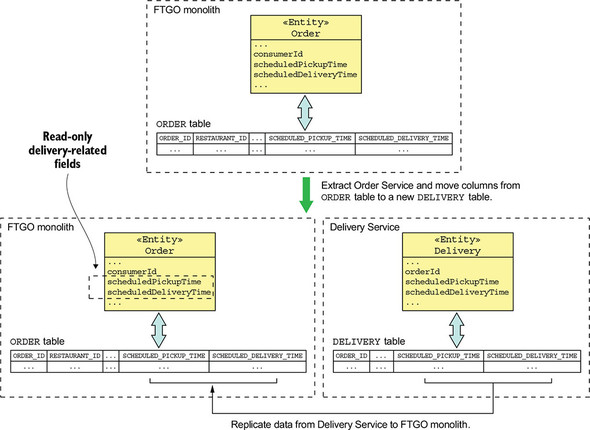

모놀리스 변경 범위 최소화하며 점진적으로 전환하는 방법으로 결과적으로 DB 클라이언트가 새 스키마를 사용하도록 변경하기 위한 것.

#### 2. attic에서 ACL(부패방지계층)은 뭐가있을까요? (p.555)

ACL 은 legacy 시스템과의 상호 작용이 필요한 경우 도메인 오염을 막기 위해 변환 구간을 두는 것인데.. 

현재 attic 에서는 없는 것 같아요

#### 3. 모놀리식 지옥에 빠진 상황에 대한 문제(3가지) 중 버그 투성이 소프트웨어 릴리스는 모놀리식 뿐만 아니라 마이크로서비스도 동일한 문제가 있지 않나요? (p.535)

책에 있는대로 개발 프로세스의 문제일까요? ㅎㅎ

절대적인 버그 건보다는 모놀리식에 비해 미치는 범위나 복잡도가 구조적으로 훨씬 낮다고 보입니다.

자동화 테스트도 전략적으로 잘 구성하면 어느 수준에서 방지할 수 있겠고요.

#### 4. EER 차세대인 attic을 완전히 완전히 뜯어 고치는 방식을 선택할 경우 회사 입장에서 어떤 문제가 있을까요? (p.536)

고비용, 기존 EER 의 기능은 동결, 

가장 큰 문제는 완성된 결과가 나올 때까지 기다려야 하므로 결과를 장담할 수 없다.


> [https://medium.com/@manisht/strangle-that-monolith-the-strangler-pattern-40c9eeb94402](https://medium.com/%40manisht/strangle-that-monolith-the-strangler-pattern-40c9eeb94402)
>
> https://martinfowler.com/articles/break-monolith-into-microservices.html
>
> https://martinfowler.com/bliki/StranglerFigApplication.html

#### 5. 6째줄에 나오는 A/B테스트에 대해 설명해주세요 (p.544)

두 개의 변형 A, B 를 사용하는 종합 대조 실험. 사용자의 행동 데이터를 통계적으로 분석하여 특정한 변화를 주었을 때 목표를 더 높게 달성하는지 알 수 있다. 대조군-실험군 으로 설정하여 비교.

> [https://ko.wikipedia.org/wiki/A/B_%ED%85%8C%EC%8A%A4%ED%8A%B8](https://ko.wikipedia.org/wiki/A/B_테스트)
>
> [https://brunch.co.kr/@bumgeunsong/17](https://brunch.co.kr/%40bumgeunsong/17)
>
> https://www.slideshare.net/cojette/ab-150118831

#### 6. 테이블 나누기는 어떻게 하는 것인가요? (p.547)

1번에서 설명.

#### 7. EER을 모놀리스 -> 마이크로서비스로 리팩터링 전략을 개발할 때 ticket을 우선 분리한다면 어떻게 진행하면 좋을지 설명 부탁 (표현계층, 서비스 추출, 도메인 로직, DB 리팩터링) (p.540)

- 화면 요소와 TicketUIService 등 표현 계층에 해당되는 webapps 과 REST-API 를 통해서 통신하도록 구성
- 도메인 모델을 중심으로 구조화하고 구현.
- DB 도 도메인 모델에 따라 리팩토링
- 서비스로 이전에 어려운 부분은 글루코드를 작성하여 기존 EER 서비스와 통신하도록 구성하고 DB 스키마 동기화도 필요하다.

#### 8. Attic과 EER 사이에 통합 글루를 구성한다면 어떠한 기능들이 MSA/모놀리스 로 나뉘며, 어떤 기술 요소들이 필요 할까요? (p.552)


# 2장. 분해 전략

## 2.1 마이크로서비스 아키텍쳐란 무엇인가?
 * 마이크로서비스 아키텍쳐는 관리성, 테스트성, 배포성이 높은 어플리케이션을 구축하기 위한 아키텍쳐 스타일.
 * 컴퓨팅 시스템의 소프트웨어 아키텍처는 소프트웨어 엘리먼트(element)와 그들 간의 관계, 그리고 이 둘의 속성(property)으로 구성된 시스템을 추론하는 데 필요한 구조(structure)의 집합.
 * 소프트웨어 아키텍쳐 4+1 뷰 모델
   1. 논리 뷰(logical view) : 상속(inheritance), 연관(association), 의존(depends-on) 등 클래스와 패키지의 관계.
   2. 구현 뷰(implementation view) : 빌드 시스템의 결과물. 모듈과 컴포넌트로 구성된다. 자바의 JAR파일.
   3. 프로세스 뷰(process view) : 런타임 컴포넌트, 각 엘리먼트는 개별 프로세스고, IPC(Inter-Process Communication)는 프로세스 간 관계.
   4. 배포 뷰(deployment view) : 프로세스가 머신에 매핑되는 방법.
 * 아키텍쳐의 중요성 
   - 애플리케이션의 요건은 크게 두가지로 기능요건(애플리케이션이 어떤 기능, 동작을 해야하는지)과 품질 요건(확장성, 신뢰성 등..)으로 나누어 짐.
   - 아키텍쳐 선택에 따라 기능/품질 요건의 트레이드 오프가 생김.
 * 계층화 아키텍처 스타일 (Layered Architecture)
   - 3계층 아키텍쳐의 논리뷰
     1. Presentation Layer : UI 또는 외부 API 관련
     2. Business Logic Layer : 비즈니스 로직 관련
     3. Persistence Layer : DB 관련
   - 계층와 아키텍쳐는 아래와 같은 단점
     1. 표현계층이 하나다, 애플리케이션을 호출하는 시스템은 하나가 아님.
     2. 영속화 계층이 하나다, 애플리케이션과 상호작용하는 DB는 하나가 아님.
     3. 비즈니스 로직 계층을 영속화 계층에 의존하는 형태로 정의한다, 이론적으로 이런 의존성 때문에 DB없이 비즈니스 로직을 테스트하는 것을 불가능.
 * 육각형 아키텍쳐 스타일
   - 논리뷰 중심의 계층화 아키텍쳐 스타일의 대안.
   
     
   - 어댑터 종류     
     1. 인바운드 어댑터 : 외부에서 들어온 요청을 인바운드 포트를 호출해서 처리 (e.g. Rest end point)
     2. 아웃바운드 어댑터 : 비즈니스 로직에서 들어온 요청을 외부 애플리케이션/서비스를 호출해서 처리하고, 이후 (e.g. DAO Class, proxy 클래스) 이벤트를 발행하기도 함.
 * 서비스
   - 서비스는 어떤 기능이 구현되어 단독 배포가 가능한 소프트웨어 컴포넌트. 서비스는 클라이언트가 자신이 서비스하는 기능에 접근할 수 있도록 커맨드, 쿼리, 이벤트로 구성된 API를 제공 함
   - 서비스는 크게 command(명령 CUD)와 Query (조회 R)로 구분 됨.
   - 서비스는 API를 제공해 내부 구현 상세를 캡슐화 함.
   - API 서비스는 2개의 아댑터로 구분 됨.
     1. 작업 아댑터 (operations adapter) : 비지니스 로직 호출.
     2. 이벤트 아댑터 (events adapter) : 비지니스 로직이 리턴하는 이벤트.
 * 느슨한 결합
   - API를 통해서만 동작이 되기 때문에 서비스가 직접 DB 스키마에 접근 할 수 없어 서비스 결합이 느슨해 짐.
 * 공유 라이브러리
   - 재사용 빈도가 높고, 변경되지 않는 기능은 공유해서 사용한다.
   - 서비스간 결합도가 높아지는것을 주의해야 함.
 * 서비스 규모
   - 마이크로서비스의 규모는 중요하지 않음
   - 상황, 비지니스에 따라 정해 질 수 있음.
## 2.2 마이크로서비스 아키텍쳐 정의
 * 총 3단계로 이루어지며 다음과 같은 단계로 이루어 짐.   
   - 애플리케이션 요건을 핵심 요청으로 추출
   - 어떻게 여러 서비스로 분해할지 결정
   - 서비스별 API 정의
   
 * 시스템 식별 작업을 위한 2단계
   - 1단계 : 보케블러리를 제공하는 핵심 클래스로 구성된 고수준의 도메인 모델 생성
   - 2단계 : 시스템 실별 후 도메인 모델 관점에서 시스템 작업 정의 및 기술.
 * 서비스 정의 : 하위 도메인 패턴별 분해
   - DDD의 개념을 이용한다. 그 중 ubiquitous language(공용 언어), sub-domain(하위 도메인), bounded context(경계 컨텍스트) 개념이 마이크로서비스 아키텍처를 구현하는데 용이 함.
   1. 분해
     - SRP(Single Responsibility Principle, 단일 책임원칙)
     - CCP(Common Closure Principle, 공동 폐쇄 원칙)
   2. 서비스 분해 장애 요소
     - 네트워크 지연 : 서비스간 왕복 횟수를 줄일 수 있도록 배치 API를 구현하거나 비싼 IPC를 이용.
     - 동기 IPC로 인한 가용성 저하 : 비동기 메시징을 이용해 느슨한 결합으로 가용성을 높여야 함.
     - 여러 서비스에 걸쳐 데이터 일관성 유지 : 사가라는 방식으로 트랜잭션 관리.
     - 데이터의 일관된 뷰 확보
     - 분해를 저해하는 만능 클래스 : 만능 클래스를 만들지 말자. MSA에서는 어느정도의 중복은 허용.
   3. 서비스 API 정의
     - 시스템 작업을 서비스 배정
     - 서비스 간 협동 지원에 필요한 API 결정
## 2.3 마치며
 * 아키텍쳐는 애플리케이션 개발 속도에 직접 영향을 주는 품질 특성을 좌우 함.
 * 마이크로서비스 아키텍쳐는 애플리케이션 관리성,테스트성,배포성을 높이는 아키텍쳐 스타일.
 * 마이크로서비스는 기술적 괌심사보다 비지니스 능력, 하위 도메인 등 비지니스 관시사 위주로 구성됨.
 * 서비스 분해 패턴은 크게 두 가지.
   - 비지니스 능력에 따른 분해 : 비지니스 아키텍쳐 기반
   - 하위 도메인에 따른 분해 : DDD 개념 기반
 * DDD를 적용하면, 만능 클래스를 방지/제거 할 수 있음.
 
## Q&A
1. 느슨한 결합에 attic share는 포함되지 않는것인가요? share같은 경우 조직은 따로 한조직으로 묶는건가요? share변경 시 테스트는 모든 서비스 조직이 테스트하여야할까요?
 - share는 원칙적으로 비지니스 로직을 포함하지 않는다.
   attic share는 기술적 부분만 포함되어 있고, share 변경시 관련 연관된 모든 기능이 테스트 되어야 된다고 봄(다른 의견 취합 필요)
2. 서비스별로 개발조직이 다르면, 각 서비스별로 사용하는 패턴, 용어, 변수명 규칙 등을 다른 조직에 공유하고, 정의할 필요가 있을까요?
 - 다른 조직 공유 : 해당 서비스를 이용하는 I/F 만 정의/공유 하면 됨 (e.g. attic 의 controller, adapter)
3. CCP(공동폐쇄원칙)에 따르면 하나의 요구사항에 따라 변경 영향이 있을 경우 동일한 패키지에 구성하는 것이라 말하는데, 만약 특정 요구사항으로 서로 다른 컴포넌트가 합쳐지거나 확장으로 인해 분리될 때 조직도 함께 변경되는걸까요?
 - CCP는 변경 사항을 하나의 패키지로 묶어 쓰레기통을 만든다는 의미로 해석중. (e.g. 변경도 높은 조회 업무를 elasticsearch에 묶어 놓음)
   패키지 분리/병합 요건은 case by case 로 건마다 다르게 해석 될 수 있다고 판단됨. 
4. UX도 MSA화 시켜서 구현하여야 한다고 알고 있는데, 그게 한 개의 페이지 당 하나의 컴포넌트만을 사용하는 것이 좋다는 걸까요?
 - [참고자료](https://martinfowler.com/articles/micro-frontends.html)
5. EER에서 만능(god) 클래스는 어떤게 있을까요?
 - js 에서는 ticket.js
 - account 등   
6. "서비스가 직접 DB와 통신하는 일은 불가능합니다"의 의미는 무엇인가요?
 - DB와 통식은 해당 컴포넌트에서만 가능하고, 외부에서 해당 repository에 접근 하려면 표준 spec을 통해 접근 해야 함. (e.g. attic의 resource, adapter)
7. 서비스를 단일 책임 원칙으로 분리하면 너무 작은 단위가 되지 않을까요?
 - 단일 책임의 범위는 비지니스 요건에 따라 다름
8. "한 가지 단점은 최종 일관성을 보장한다는 것입니다" <- 왜 단점이 되는건가요?
 - 기존 RDB와 다르게 Data의 복제 개념으로 실시간 동기화가 되지 않음 
 - [Eventual consistency](https://cloud.google.com/datastore/docs/articles/balancing-strong-and-eventual-consistency-with-google-cloud-datastore?hl=ko)
9. 마이크로서비스 아키텍처 정의 단계에서 서비스 정의를 할 때 비즈니스 능력별로 하는 것과 DDD 로 하는 방식이 있다고 하는데, 선후 관계가 있는 걸까요? 선택하는 것이라면 어떤 차이가 혹은 상황에서 적용 할 수 있을까요?
 - 책에 나온 예제를 보면 비즈니스 능력 식별은 bounded-context 를 뽑는것으로 보이며, DDD 방식으로 보입니다. (다른점을 잘 모르겠음.)
   이 미묘한 부분은 지도 편달 부탁 합니다 (--)(__)(--)
# 3. 프로세스 간 통신(IPC)

IPC : Inter-Process Communication

대표적 IPC 기술: 통신 - REST, gRPC, AMQP, STOMP / 메시지 포맷 - JSON, XML, Avro, Protocol buffer ..

> 참고: https://www.nginx.com/blog/building-microservices-inter-process-communication/

## 3.1 마이크로서비스 아키텍처 IPC 개요

### 1. 상호 작용 스타일(Interaction styles)

 클라이언트/서비스 간 상호 작용 스타일.

- one-to-one / one-to-many : 요청에 대한 서비스 처리 방식.
- synchronous / asynchronous

|       | one-to-one                                                   | one-to-many                                   |
| ----- | ------------------------------------------------------------ | --------------------------------------------- |
| sync  | request/response                                             | -                                             |
| async | request/async response[^1]<br />one way requests (a.k.a notifications) | publish/subscribe<br />publish/async response |

### 2. 마이크로서비스 API 정의

IDL(Interface Definition Language) 로 정의.

- API 우선 방식((API-first approch) 으로 서비스 정의 : 계획/설계 후 구현.

  > https://www.programmableweb.com/news/how-to-design-great-apis-api-first-design-and-raml/how-to/2015/07/10

### 3. API 발전시키기

- Sementic Versioning : API 버저닝 가이드로 참고.

  - https://semver.org/
    - MAJOR : 호환되지 않는 API 변경
    - MINOR : 하위 버전과 호환되도록 기능 추가
    - PATCH : 하위 호환되는 버그 수정
    - 추가적으로 pre-release 과 build 메타데이터에 대한 라벨로 MAJOR.MINOR.PATCH 포맷 확장 가능.
  - REST API 는 메이저 버전을 URL 첫번째 경로에 포함. 메시징인 경우 메시지에  버전 포함.

- 하위 호환되는 소규모 변경:

  - 하위 호환성을 유지하며 견고성 원칙(Robustness principle) 을 지켜야 한다.
    - 요청 속성이 누락되어도 기본값 제공, 서비스가 더 많은 속성을 응답해도 클라이언트는 무시해야 한다.

- 중대한 대규모 변경:

  - 일정 기간동안 이전/신규 버전 API 모두 지원

    - REST API URL 에 버전 포함

    - HTTP content negotiation : MIME type 에 버전 포함

      > Content negotiation:
      >
      > 동일한 URI 에서 리소스의 서로 다른 버전을 지원하기 위해 사용하는 매커니즘. 리소스 타입, 포맷, 인코딩 등.
      >
      > https://developer.mozilla.org/ko/docs/Web/HTTP/Content_negotiation

  - API 어댑터에 신구 버전 중계 로직 포함 => API 게이트웨이

### 4. 메시지 포맷

- 텍스트 메시지 포맷
  - JSON, XML
  - 메시지 컨슈머는 필요한 값만 선택해서 사용 가능 하므로, 메시지 스키마 변경에 대한 하위 호환성 보장이 용이.
  - XML 스키마[^2] 와 같이 JSON 도 스키마 표준 제정: http://json-schema.org/ 메시지 유효성, 문서화에 활용
  - 장점: human readable. self describing
  - 단점: 메시지가 길다(특히 XML) - 속성값에 속성명도 포함되어야 하고, 파싱 오버헤드도 있다.

- 이진 메시지 포맷
  - 메시지 구조 정의를 위한 타입(typed) IDL 제공, 컴파일러가 serialize/deserialize 코드 생성 => API-first approch
  - Protocol Buffer https://developers.google.com/protocol-buffers
  - Avro https://avro.apache.org/

  > 프로토콜 비교:
  >
  > [Schema evolution in Avro, Protocol Buffers and Thrift](http://martin.kleppmann.com/2012/12/05/schema-evolution-in-avro-protocol-buffers-thrift.html) / [번역글](http://sjava.net/2012/12/%EB%B2%88%EC%97%AD-%EC%97%90%EC%9D%B4%EB%B8%8C%EB%A1%9Cavro-%ED%94%84%EB%A1%9C%ED%86%A0%EC%BD%9C-%EB%B2%84%ED%8D%BCprotocol-buffers-%EC%93%B0%EB%A6%AC%ED%94%84%ED%8A%B8thrift%EC%9D%98-%EC%8A%A4/](http://sjava.net/2012/12/번역-에이브로avro-프로토콜-버퍼protocol-buffers-쓰리프트thrift의-스/))
  >
  > https://www.slideshare.net/IgorAnishchenko/pb-vs-thrift-vs-avro

## 3.2 동기 RPI 패턴 응용 통신

RPI: Remote Procedure Invocation. 클라이언트의 서비스 요청에 대해 서비스 처리 후 응답을 회신하는 IPC.

### 1. 동기 RPI 패턴: REST

> REST 는 컴포넌트 상호 작용의 확장성, 인터페이스 일반화, 컴포넌트의 독립적 배포, 상호 작용 지연을 줄이기 위한 중간 컴포넌트, 보안 강화, 레거시 시스템의 캡슐화에 역점을 둔 아키텍처 제약 조건 세트를 제공한다.
>
> Roy Fielding (REST 창시자)

- 리소스: 단일 비즈니스 객체 혹은 그 컬렉션. 리소스 조작에 URL 로 참조되는 HTTP 동사(GET, POST, PUT, ..)를 사용. 

#### REST 성숙도 모델

>  https://martinfowler.com/articles/richardsonMaturityModel.html

- level 0 : HTTP POST 요청으로 서비스 호출. 요청에 액션과 대상 지정, 매개변수 전달.
- level 1 : Resource. 액션과 매개변수 지정된 POST 요청.
- level 2 : HTTP 동사. GET, POST 등 HTTP 동사로 액션 수행. 필요시 매개변수 전달.
- level 3 : HATEOAS(Hypertext As The Engine Of Application State). GET 요청에 액션 링크도 포함하여 응답.


#### REST API

REST API 에 대한 IDL 필요성 요구됨 => Swagger 발전시켜 오픈 API 명세 만들어짐. https://www.openapis.org/

#### 요청 한 번으로 많은 리소스를 가져오기 어렵다

연관된 리소스를 한번에 가져오기 힘들다 => GraphQL[^3], Netflix Falcor[^4] 등 대체 기술 활용

#### 작업을 HTTP 동사에 매핑하기 어렵다

다양한 업데이트 작업을 처리하다보면 멱등성(idempotency) 보장이 어려울 수 있다. => 하위 리소스(sub-resource) 정의

#### REST 의 장단점

- 장점
  - 단순하고 익숙하다
  - 툴을 이용하여 테스트하기 쉽다(postman, curl, ..)
  - request/reply 스타일의 통신 직접 지원
  -  HTTP 는 firewall friendly : single port 사용, 인터넷으로 서버에 연결, TCP 사용, 광범위한 가용 프록시 서버로 종료 혹은 프록시 가능 [^5]
  - 중간 브로커가 없어 시스템 아키텍처가 단순해짐
- 단점
  - request/reply 통신 스타일만 지원
  - 가용성 떨어짐: 클라이언트/서비스 직접 통신하므로 양쪽 모두 실행 상태여야 함.
  - 클라이언트가 서비스 인스턴스의 위치(URL) 를 알고 있어야 함 => 서비스 디스커버리 매커니즘으로 해결 가능.
  - 단일 요청으로 여러 리소스 가져오기 어려움
  - 다중 업데이트 작업을 매핑하기 어려움

### 2. 동기 RPI 패턴: gRPC

- 다양한 언어로 클라이언트/서버 작성할 수 있는 프레임워크. 이진 메시지 기반 프로토콜이므로 API-first approch 로 설계. 
- protocol buffer(protobuf) 기반의 IDL 로 API 정의하여, 클라이언트/서버는 protobuf 포맷의 이진 데이터로 통신(HTTP/2)
- gRPC API는 하나 이상의 서비스와 request/reply message definition 으로 구성.
- protobuf 포맷을 사용하므로, 그 특성대로 효율적이고 간결하며, 변경에 대한 하위 호환성 유지도 가능.


장점

- 다양한 업데이트 작업이 포함된 API 설계 용이
- 큰 메시지 교환에 효율적
- 양방향 스트리밍으로 RPI, 메세징 모두 가능
- 다양한 언어 지원

단점

- javascript 클라이언트 작업이 REST/JSON 대비 많음
- HTTP/2 지원되어야 함

### 3. 부분 실패 처리: 회로 차단기 패턴(Circuit breaker pattern)

> https://microservices.io/patterns/reliability/circuit-breaker.html
>
> https://martinfowler.com/bliki/CircuitBreaker.html

연속 실패 횟수가 임계치 초과하면 일정 시간동안 호출 거부하는 RPI 프록시

- 견고한 RPI 프록시 설계
  - 네트워크 타임아웃: 응답 대기 타임아웃 설정.
  - 미처리 요청 개수 제한: 요청 가능한 미처리 요청 최대 개수 설정.
  - curcuit breaker pattern: 에러율 임계치 초과에 대한 처리.

  

  - Netflix Hystrix https://github.com/Netflix/Hystrix

- 불능 서비스 복구
  - 상황에 따른 실패에 대한 복구 정책이 설계에 포함

### 4. 서비스 디스커버리

#### 개요

- 서비스 인스턴스의 네트워크 위치를 DB 화 한 서비스 레지스트리를 통해 서비스 요청을 라우팅

  > https://microservices.io/patterns/service-registry.html

- 구현 방법
  - 클라이언트/서비스가 직접 서비스 레지스트리와 상호 작용
  - 배포 인프라로 서비스 디스커버리 처리

#### 애플리케이션 수준의 서비스 디스커버리 패턴 적용

- 클라이언트/서비스가 service registry 와 직접 통신: 

  - service instance 직접 등록 (self registration pattern)[^6]

  - service client 는 query 결과 목록에서 하나의 instance 로 요청 라우팅 (client-side discovery pattern)[^7]

    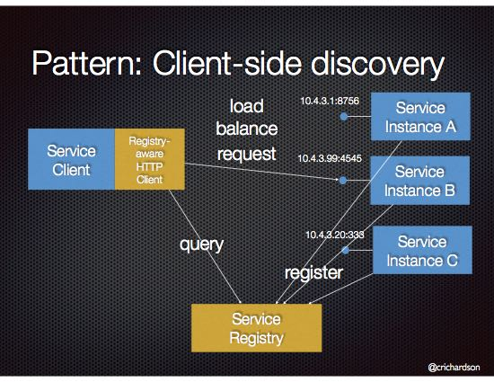

  - Netflix Eureka, Eureka java client, Ribbon, Pivotal

- 다양한 플랫폼 배포 환경에서 잘 동작함

- 개발 언어(프레임워크) 제약: Spring cloud 

#### 플랫폼에 내장된 서비스 디스커버리 패턴 적용

- 배포 플랫폼에 서비스 등록, 서비스 디스커버리, 요청 라우팅 내장 (도커, 쿠버네티스 등).

  - 3rd party registration pattern: 배포 플랫폼 내 3rd party registrar(등록기) 가 서비스 등록 대행.

    > https://microservices.io/patterns/3rd-party-registration.html

  - server-side discovery pattern: client 가 직접 질의하지 않고 DNS 명을 요청하면, 요청 라우터가 처리.

    > https://microservices.io/patterns/server-side-discovery.html

- 장점: 배포 플랫폼이 알아서 처리. 서비스에 관련 코드가 없으므로 언어에 관계없이 바로 적용 가능

- 단점: 특정 배포 플랫폼에 종속됨.

## 3.3 비동기 메시징 패턴 응용 통신

메시징: 서비스간 메시지를 비동기로 전송하는 통신 방식.

> https://microservices.io/patterns/communication-style/messaging.html

### 1. 메시징 개요

기업 통합 패턴(Enterprise Integration Pattern) 의 메시징 모델.

> https://www.enterpriseintegrationpatterns.com/patterns/messaging/

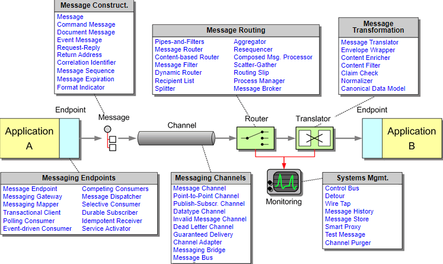

#### 메시지

> https://www.enterpriseintegrationpatterns.com/patterns/messaging/Message.html

- 헤더(header), 본문(body) 구성.

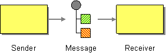

- 종류
  - document : 데이터만 포함된 제너릭 메시지. 메시지 해석을 수신자가 결정.
  - command : RPC 요청과 동등. 호출 작업+매개변수.
  - event : 대부분 도메인 이벤트.

#### 메시지 채널

> https://www.enterpriseintegrationpatterns.com/patterns/messaging/MessageChannel.html


- 종류

  - 점대점(point-to-point) 채널 : 채널 컨슈머 중 하나만 지정하여 수신. (e.g. 커맨드 메시지)

    > https://www.enterpriseintegrationpatterns.com/patterns/messaging/PointToPointChannel.html

  

  - 발행-구독(publish-subscribe) 채널 : 모든 컨슈머가 수신. (e.g. 이벤트 메시지)

    > https://www.enterpriseintegrationpatterns.com/patterns/messaging/PublishSubscribeChannel.html

   

### 2. 메시징 상호 작용 스타일 구현

#### 요청/응답(Request/Reply) 및 비동기 요청/응답(Request/Async reply)

- 클라이언트/서비스가 한 쌍의 메시지를 주고받는 요청/응답 스타일로 상호 작용.

- 요청 메시지에 응답 채널, 메시지 식별자(messageID) 포함.

 

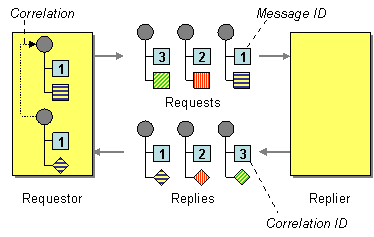

> Request-Reply https://www.enterpriseintegrationpatterns.com/patterns/messaging/RequestReply.html
>
> Return  Address https://www.enterpriseintegrationpatterns.com/patterns/messaging/ReturnAddress.html
>
> Correlation Identifier https://www.enterpriseintegrationpatterns.com/patterns/messaging/CorrelationIdentifier.html

#### 단방향 알림(one-way notification)

- 클라이언트가 서비스의 point-to-point 채널로 메시지(커맨드 메시지) 보내면 서비스가 구독해서 처리.

#### 발행/구독

- 클라이언트가 발행/구독 채널에 메시지 발행하고, 서비스는 도메인 객체 변경에 대한 도메인 이벤트를 발행. 
- 서비스는 관심있는 도메인 객체 이벤트 채널 구독.

#### 발행/비동기 응답

- 클라이언트가 응답 채널 헤더가 포함된 메시지를 발생/구독 채널에 발행, 컨슈머는 CorrelationId 가 포함된 응답 메시지를 지정 응답 채널에 쓰고, 클라이언트가 CorrelationId 로 응답 확인.

### 3. 메시징 기반 서비스의 API 명세 작성

명세 구성요소: 메시지 채널명, 채널로 교환되는 메시지 타입과 포맷(JSON, XML, Protobuf 등 표준 포맷)

#### 비동기 작업 문서화

- 요청/비동기 응답 스타일 API : 커맨드 메시지 채널, 받는 메시지 타입과 포맷, 반환하는 응답 메시지 타입과 포맷.
- 단방향 알림 스타일 API : 커맨드 메시지 채널, 받는 메시지 타입과 포맷.

#### 발행 이벤트 문서화

- 이벤트 채널, 이벤트 메시지의 타입과 포맷.

### 4. 메시지 브로커

message broker : 서비스 간 통신 중계 인프라 서비스.


#### 브로커리스 메시징

- 서비스 간 메시지 직접 교환. (e.g. ZeroMQ)

- 장점:
  - 네트워크 트래픽이 가볍고 지연 시간이 짧다.
  - 메시지 브로커가 성능 병목점이나 SPOF(single point of failure) 가 될 일이 없다.
  - 운영 복잡도가 낮다.

- 단점:
  - 서비스간 위치를 알고 있어야 하므로 서비스 디스커버리 매커니즘 사용해야 한다.
  - 송수신 서비스 모두 실행 중이어야 하므로 가용성 떨어진다.
  - 전달 보장 매커니즘 구현 어렵다.

#### 브로커 기반 메세징 개요

- 송신자가 컨슈머 위치 몰라도 된다. 컨슈머가 메시지 처리 가능할 때까지 버퍼링 가능하다.
- 메시지 브로커: ActiveMQ, RabbitMQ, Apache Kafka, AWS kinesis, AWS SQS..
- 채택 고려 사항: 지원 언어, 메시징 표준 지원, 순서 유지, 전달 보장, 영속화, 내구성, 확장성, 지연 시간, 경쟁사 컨슈머 지원 등..

#### 메시지 브로커로 메시지 채널 구현

- 메시지 브로커 마다 메시지 채널 구현 방식 달라진다. AWS SQS 외 대부분 점대점, 발행/구독 채널 모두 지원.

#### 브로커 기반 메시징의 장단점

- 장점
  - 느슨한 결합 
  - 메시지 버퍼링
  - 유연한 통신
  - 명시적 IPC  

    > (번역서: 번역이 덜 된 부분 있음)
    >
    > RPC-based mechanism attempts to make invoking a remote service look the same as calling a local service. But due to the laws of physics and the possibility of partial failure, they’re in fact quite different. **Messaging makes these differences very explicit, so developers aren’t lulled into a false sense of security.**
    >
    > RPC 기반 매커니즘은 원격 서비스 호출이 로컬 서비스를 호출하는 것과 동일하게 보이게 합니다. 그러나 물리 법칙  과 부분 실패 가능성 으로 인해, 실은 아주 다릅니다. **메시징은 이런 차이점을 매우 명백하게 만들어주므로, 개발자가 잘못된 보안 감각에 빠지지 않게 합니다.**
    >
    > https://livebook.manning.com/book/microservices-patterns/chapter-3/290

- 단점
  - 성능 병목 가능성 ⇒ 확장성
  - 단일 장애점 가능성 ⇒ 고가용성
  - 운영 복잡도 늘어남

### 5. 수신자 경합과 메시지 순서 유지

- sharded(partitioned) channel 을 이용한 순서 보장(kafka, AWS kinesis) : 메시지에 포함된 shard key(e.g. orderId) 에 따라 같은 shard 에 발행하고, 메시지 브로커는 수신자 인스턴스 지정.

### 6. 중복 메시지 처리

- 메시지 브로커는 적어도 한번(at least once) 메시지 전달(delivery) 보장; 전달 실패나 ack. 수신 못한 경우 등.
- 장애시 순서 보장을 위한 재전송으로 메시지 중복 발생

#### 멱등한(idempotent) 메시지 핸들러 작성

- idempotent[^8] : 동일한 입력값을 반복 입력해도 부수 효과가 없는 것.
- 일반적으로 어플리케이션 로직에서 멱등하기 어려움.

#### 메시지 추적과 중복 메시지 솎아 내기

- 메시지 컨슈머가 message id 를 이용해 처리 여부를 추적하여 중복 제거.
- 컨슈머가 메시지 처리 트랜잭션 과정으로 처리된 메시지 id 를 DB 에 저장하고, 중복 발생하면 insert 실패되고 컨슈머는 메시지 폐기.

### 7. 트랜잭셔널 메시징

서비스의 DB 업데이트와 메시지 발행을 단일 트랜잭션으로 처리하기 위한 방법.

#### DB 테이블을 메시지 큐로 활용

> https://microservices.io/patterns/data/transactional-outbox.html

- transactional outbox pattern: 임시 메시지 큐 역할을 하는 outbox 테이블에 DB 트랜잭션의 일부로 메시지 삽입. message relay 가 outbox 읽어 메시지 브로커에 메시지 발행.
- 로컬 ACID 트랜잭션이므로 원자성 보장.
  - Atomic, Consistency, Isolation, Durability : DB 트랜잭션이 안전하게 수행된다는 것을 보장하는 성질. [^9][^10]

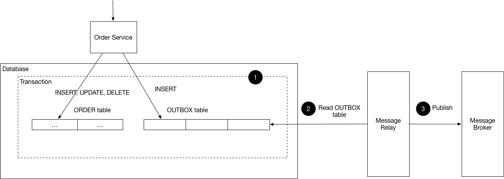

#### 이벤트 발행: 폴링 발행기 패턴

> https://microservices.io/patterns/data/polling-publisher.html

- message relay 가 outbox 의 메시지를 주기적 폴링하여 미발행 메시지 조회. message broker 로 발행 후 삭제.
- 작은 규모에 적합.

#### 이벤트 발행: 트랜잭션 로그 테일링 패턴

> https://microservices.io/patterns/data/transaction-log-tailing.html

- message relay 로 DB 트랜잭션 로그(커밋 로그) 테일링(tailing).
- 변경된 DB transaction log 를 transaction log miner 가 읽어서 message broker 에 발행.


- 응용 사례: 디비지움(Debezium), LinkedIn Databus, DynamoDB Streams, Eventuate Tram

### 8. 메시징 라이브러리/프레임워크

글쓴이가 작성한 Eventuate Tram API 소개.


## 3.4 비동기 메시징으로 가용성 개선

### 1. 동기 통신으로 인한 가용성 저하

REST 등 동기 프로토콜 통신은 애플리케이션 가용성이 떨어지므로 최소화 해야한다.

### 2. 동기 상호 작용 제거

#### 비동기 상호 작용 스타일

- 모든 요청을 비동기 메시징을 통해 클라이언트/서비스가 메시징 채널로 메시지를 전송하여 비동기 통신한다.

#### 데이터 복제

- 서비스 요청 처리에 필요한 (다른 서비스의) 데이터 레플리카를 유지하여 다른 서비스와의 상호작용을 배제함.
- 최신 데이터는 데이터를 소유한 해당 서비스의 이벤트를 구독해서 유지할 수 있다.
- 대용량 데이터 복제는 비효율적.

#### 응답 반환 후 마무리

로컬 서비스 처리 후 응답 반환. 다른 서비스에 비동기 메시지 전송.


----------

## [Q&A]


#### 1. 시맨틱 버저닝 적용 시 소스가 버전별로 여러벌 생기는 건가요?

시맨틱 버저닝은 의존성 문제[^Q1] 해결을 위한 버전 규칙 명세입니다. 

버저닝이 되는 것은 배포를 위한 것입니다. VCS 가 일반적으로 버전 단위로 태깅되며, freezing 된 태깅 소스는 여러벌 존재 할 수 있지만 더이상 변하지 않죠. 버전이 존재하는 것은 배포 후 서비스를 구분하기 위해서라고 봐야겠습니다.

EER 처럼 항상 마지막 버전만 유지하는 경우가 많지만, 필요에 따라 큰 변경에 따른(예. Java 버전) 호환성 유지를 위해 복수의 메이저 버전을 유지하는 경우도 있습니다. spring framework 같은 경우가 대표적이겠네요.

언제까지 유지할 것인지와 같은 것은 해당 서비스의 목적과 정책에 의해 결정될 문제겠고요.


#### 2. 미처리 요청 개수 제한과 회로 차단기 패턴의 차이점과 예시로 쉽게 설명해주세요.

http://techblog.netflix.com/2012/02/fault-tolerance-in-high-volume.html

위 링크에서 넷플릭스가 내결함성 솔루션을 제시한 방법입니다. 아래와 같은 솔루션을 조합해서 적용 합니다.

"네트워크 타임아웃" 요청이 계속 대기 되는 것을 막습니다.

"미처리 요청 개수 제한"은 클라이언트에서 요청 가능한 개수를 초과한 요청은 무의미하므로 빠른 실패를 반환합니다. 효율성을 높이고 사용자 요청 대기 시간을 줄일 수 있습니다.

" 회로 차단기 패턴" 은 설정한 임계치에 도달하면 모든 요청을 중단하고(open) 일정 시간 후 health check 로 상태를 확인(half open) 한 다음, 정상화(close) 합니다. 그렇지 않으면 open 상태를 유지합니다.


#### 3. 메시지 채널 점대점 채널, 발행-구독 채널 에서 이 채널의 개념을 설명해주세요. 각각을 사용하는 경우 예도 들어주세요.

EIP[^Q2] 에 따르면, 메시징 어플리케이션은 송신자와 수신자를 연결하는 가상 파이프인 메시지 채널을 통해 데이터를 전송합니다. 송신자는 특정 채널에 메시지를 추가하고, 수신자가 채널로부터 메시지를 읽습니다.

"점대점 채널" 은 채널에 여러 수신자가 있더라도 하나의 수신자만 특정 메시지를 수신할 수 있고, "발행-구독 채널" 은 메시지 사본을 연결된 각 수신자에게 전달합니다.

점대점 채널은 "상품 주문" 등 커맨드 메시지에, 발행-구독 채널은 "알림" 등의 이벤트 메시지 용으로 사용할 수 있습니다.

메시지 브로커로 보통 메세지 채널을 구현하는데 대부분은 두 방식 모두 지원합니다. (JMS, kafka, RabbitMQ, ...)

아래는 Google Cloud Pub/Sub[^Q3] 의 다이어그램으로, 두 방식 모두 제공합니다.


#### 4. outbox는 발행된 이벤트를 임시로 저장하는 DB인건가요? 그렇다면, 중간에 이벤트가 실패할 경우 트랜잭션은 어떤식으로 처리하는건가요?

임시 메시지 큐 역할이므로 message relay 가 outbox 의 메세지를 message broker  에 전달합니다. polling publisher  방식은 outbox 조회하여 전달 후 삭제, transaction log tailing 은 저장 후 삭제할 수 있습니다. log tailing 은 로그가 남는 것이 주이기 때문인 것 같네요.

>  참고: 
>
>  - https://dzone.com/articles/implementing-the-outbox-pattern
>
>  - https://www.popit.kr/msa에서-메시징-트랜잭션-처리하기

이벤트 실패 질문은 어떤건지 확인이 필요한데, 서비스 내에서 처리 후 outbox 에 이벤트 발행하는 것까지라면 책에 있는대로 원자성을 가진 로컬 트랜잭션이므로 성공 혹은 실패일 것이고, outbox 의 이벤트 메시지를 처리하는데 실패하는 것이라면 재시도 되겠죠?

#### 5. REST 성숙도 모델에서 보면 attic은 레벨 2 기준으로 작성이 되어 있지만 사이트에서는 방화벽 정책등으로 PUT, DELETE등을 못쓰게 하는 경우가 있습니다. 이럴 경우 attic에서도 레벨 1 수준으로 바꿔야 할지? 안바꾸면 어떤 문제가 있을지?

어려운 문제네요.. 기업 IT 운영 부서의 생각이 바뀌었으면 좋겠지만.

조금 찾아보니 PUT, DELETE 의 보안 취약점 문제는 WebDAV 를 사용하는 경우 추가되는 확장 메소드들에 의한 것이므로 우리 제품의 환경에선 실제적인 보안 문제는 없다... 고 설득할 수 있으면 좋겠네요. ㅎㅎ

> https://blog.tophoon.com/2019/01/20/rest-api.html

GET, POST  를 사용하는 graphQL 이나 protobuf, avro 를 검토해 볼 수도 있겠습니다..

#### 6. GraphQL에 대해 설명해주세요

- 페이스북이 만든 API 를 위한 쿼리 언어로 한번에 필요한 리소스 모두 얻을 수 있다.(REST 는 리소스별 여러번 호출해야 한다.) 그러므로 다양한 리소스를 조합한 쿼리를 많이 사용할 때 효과적.
- 하나의 endpoint 로 서비스.
- Github API v4 에 GraphQL 을 적용했다. https://developer.github.com/v4/

> 참고:
>
> - https://tech.kakao.com/2019/08/01/graphql-basic/
> - https://graphql.org/learn/queries/

#### 7. REST를 gRPC로 대체를 해야 한다면 가장 큰 이유가 무엇일까요? 아님 gRPC보다는 REST가 더 좋은건가요?

- REST 의 다양한 업데이트 작업에 대한 PUT 매핑 문제를 해결할 수 있다. 

- 5와 예와 같은 HTTP 메소드 제한 환경의 문제도 피해갈 수 있다. 
- gRPC 의 기반인 protobuf 의 장점이 반영. 
- 그러나 protobuf 는 HTTP/2 가 필요하므로 그로 인한 장점도 갖지만 구축 환경의 제약도 될 수 있다.
- 기타
  - 구글 넷플릭스 등 다양한 MSA 환경에서 활용. 간단한 설치와 빠른 배포.
  - IDL 정의만으로 코드가 생성되어 비즈니스 로직에 집중한 빠른 개발 가능. 
  - 높은 압축률로 네트워크 트래픽 획기적 감소.
  - 필요한 경우 외부 REST API 제공을 위해 grpc-gateway. 그 외 pluggable 한 다양한 ecosystem.
  - learning curve, 제한된 브라우저 지원(https://caniuse.com/#feat=http2), 읽을 수 없음.

> 참고: 
>
> - https://code.tutsplus.com/tutorials/rest-vs-grpc-battle-of-the-apis--cms-30711
> - https://medium.com/@goinhacker/microservices-with-grpc-d504133d191d

#### 8. attic에서 접수서비스는 티켓과 채널을 생성합니다. CS톡 비즈니스의 접수 서비스에서 접수 시 티켓, 채널 생성에 대한 operation이 비동기 or 동기 방식 중 어느것이 더 효율적일까요?

비동기 메시징 처리하는 것이 적절해 보입니다. 접수 op. 결과 이벤트로 티켓 서비스과 채널 서비스를 통해 생성이 되겠죠.  

#### 9. msa에서 versioning을 통해 서비스할 경우 시스템 구성 or 로직은 어떤식으로 처리할 수 있을까요? 예) v1과 v2이 사용되는 스키마 구조가 다를 경우

서비스 배포/운영 관점에서는 Kubernetes 환경에서의 Helm 같은 패키징 관리 도구를 활용할 수 있을 것 같다.

> https://tech.osci.kr/2019/11/23/86027123/


-----------------

[^1]: 번역서에는 비동기 요청/응답(async request/response) 로 표기되어 있다.
[^2]: https://www.w3.org/XML/Schema
[^3]: 페이스북이 만든 API 를 위한 쿼리 언어로 보관 데이터에 대해 쿼리를 수행하기 위한 런타임이다. 단일 요청으로 필요한 리소스의 데이터를 가져올 수 있다. https://graphql.org/
[^4]: Netflix UI 를 지원하는 데이터 플랫폼 javascript library. 모든 백엔드 데이터 모델을 단일 가상 JSON 객체로 모델링 할 수 있다. https://netflix.github.io/falcor/
[^5]: https://glossary.pro2col.com/firewall-friendly/
[^6]: https://microservices.io/patterns/self-registration.html
[^7]: https://microservices.io/patterns/client-side-discovery.html
[^8]: [https://ko.wikipedia.org/wiki/%EB%A9%B1%EB%93%B1%EB%B2%95%EC%B9%99](https://ko.wikipedia.org/wiki/멱등법칙) 
[^9]: https://ko.wikipedia.org/wiki/ACID
[^10]: https://johngrib.github.io/wiki/ACID/ 

[^Q1]:  https://ko.wikipedia.org/wiki/의존성_지옥
[^Q2]: https://www.enterpriseintegrationpatterns.com/patterns/messaging/MessageChannel.html
[^Q3]: https://cloud.google.com/pubsub/docs/overview# 4. 트랜잭션 관리: 사가

데이터 일관성을 위한 단일 내부 시스템의 트랜잭션은 ACID 가 보장하지만, 여러 서비스에 걸친 트랜잭션은? => 메세지 주도 방식의 로컬 트랜잭션인 saga 를 사용.

saga 는 ACD 만 보장하고, I(Isolation)은 보장하지 않음 → concurrency anomaly  방지 기법 필요.

> *p154: 스타벅스는 2단계 커밋을 사용하지 않습니다. https://www.enterpriseintegrationpatterns.com/ramblings/18_starbucks.html*
>
> 스타벅스는 최대한의 수익을 내기 위해 최대한의 주문을 받아야 하므로, 주문과 음료 제조가 비동기로 진행된다.(계산원은 주문을 받아서 컵에 표기하고 대기열에 위치시킴, 바리스타는 대기중인 컵의 정보로 음료 제조)
>
> 비동기 이므로 예외 처리가 필요한데, 스타벅스의 방식은 음료를 폐기하거나, 주문과 다른 음료가 나오면 다시 만들거나, 기계 고장으로 만들 수 없다면 환불한다. 
>
> - write-off 폐기 : 주문 취소 등에 의해 제조 음료 폐기. 손실 범위 내에서는 오류에 대한 처리 솔루션을 만드는 것 보다 손실이 적을 수 있다. 
> - retry 재시도 : 부정확, 불만족으로. 일부 작업(e.g. 음료 제조)가 실패하면 수행 작업 취소 혹은 재시도. 중복 메세지에 대해 안전한 idempotent receiver 인 경우 유효.
> - compensating action 보상 조치 : 환불. 시스템을 일관된 상태로 되돌리기 위해 완료된 작업 취소.
>
> 2단계 커밋은 주문한 음료를 얻기 까지 영수증과 돈을 가지고 계산대 앞에서 대기하다 음료와 맞바꾸는 것. 계산원과 고객은 거래가 끝날 때까지 떠날 수 없다. 이렇게 되면, 고객 수가 줄어 들고 수익(성능)도 줄어들게 된다. 
>
> https://en.wikipedia.org/wiki/Two-phase_commit_protocol
>
> 2단계 커밋 프로토콜, 2PC(two-phase commit protocol): ACP(Atomic Commit Protocol) 의 일종. 커밋에 참여하는 모든 프로세스를 조정하는 분산 알고리즘. 블로킹 프로토콜.
>
> - 커밋 요청 단계 : 코디네이터가 모든 참가자에게 커밋 쿼리 메시지 보내고 agreement 메세지(커밋에 yes 로 투표) 받을 때까지 대기. 각 참가자가 처리 성공 여부에 따라 응답.
> - 커밋 단계 : 코디네이터가 모든 참가자로부터 메시지 수신하면 '성공', 그렇지 않거나 대기 만료면 '실패'. 성공이면 커밋 메시지를 참가자들에게 보내서 트랜잭션 완료하고 승인 응답받고 트랜잭션 완료. 실패면 롤백 보내서 처리하고 완료 응답하고 트랜잭션 취소.
>
> 


## 4.1 MSA 에서의 트랜잭션 관리

단일 DB 모놀리식 어플리케이션에 비해 MSA 의 트랜잭션 관리는 정교한 메커니즘이 필요.

### 1. 분산 트랜잭션의 필요성

서비스마다 DB 가 존재하므로 여러 DB 에 걸쳐 데이터 일관성을 유지할 수 있는 방법이 필요하다.

### 2. 분산 트랜잭션의 문제점

- (사실상) 표준인 X/Open DTP 모델(X/Open XA)로 분산 트랜잭션 처리: 2PC 를 이용해 전체 트랜잭션 커밋 혹은 롤백.

- 문제점
  - NoSQL DB(mongoDB, cassandra), message broker(RabbitMQ, kafka) 등은 지원 안함.
  - 동기 IPC 이므로 가용성 떨어짐 (가용성은 참여 서비스가 많을수록 떨어진다)
    - CAP 이론(브루어의 정리)[^41]: 분산 시스템은 Consistency(일관성), Availability(가용성), Partition tolerance(분할내성) 을 모두 만족할 수 없다.
- MSA 에서는 맞지 않음. 느슨하게 결합된 비동기 서비스 개념 기반의 메커니즘 필요  → saga

### 3. 데이터 일관성 유지: 사가 패턴

> Managing data consistency in a MSA using Sagas 
>
> http://chrisrichardson.net/post/microservices/2019/07/09/developing-sagas-part-1.html

saga: 

- MSA 에서 데이터 일관성을 유지하는 매커니즘. 
- 여러 서비스의 데이터를 업데이트하는 시스템 커맨드마다 saga 를 하나씩 정의.
- 비동기 메시징을 이용해 편성한 일련의 로컬 트랜잭션. 로컬 트랜잭션은  ACID 트랜잭션 프레임워크/라이브러리로 데이터 업데이트.

> Saga pattern : https://microservices.io/patterns/data/saga.html
>
> 로컬 트랜잭션이 완료되면 메시지/이벤트로 다음 로컬 트랜잭션 트리거한다.
>
> 로컬 트랜잭션이 실패하면 saga 는 이전 로컬 트랜잭션의 변경을 취소하는 보상 트랜잭션을 실행한다.


saga 와 ACID 트랜잭션의 차이점:

- 격리성(Isolation) 이 saga 에는 없음
- saga 는 로컬 트랜잭션마다 커밋하므로 보상 트랜잭션을 통해 롤백해야 한다.

#### 사가는 보상 트랜잭션(compensating transaction)으로 변경분을 롤백한다.

- (n+1) 번째 사가 트랜잭션이 실패하면 n개의 이전 트랜재션을 undo
- Ti 에 대응되는 보상 트랜잭션 Ci , undo 하려면 Ci 를 역순으로 실행. Tn+1 실패시 Cn ~ C1 순으로 실행.
- Ci 와 Ti 는 순서화(sequencing) 원리가 동일하므로 Ci 다음 Ci-1 실행.


## 4.2 사가 편성(Coordinating sagas)

사가 편성 로직

- choreography : 의사 결정과 순서화를 사가 참가자에게 배당. 사가 참가자는 이벤트 교환 방식으로 통신.
- orchestration : 사가 오케스트레이터가 중앙 관리.  사가 참가자에게 커맨드 메시지를 보내 작업 지시.

### 1. Choreography-based sagas

사가 참여자가 서로 이벤트를 구독하여 그에 따라 반응.

- 승인


- 승인 거부


#### 확실한 이벤트 기반 통신

코레오그레피 방식 통신 이슈:

- 사가 참여자가 로컬 DB 업데이트 후 이벤트 발행을 로컬 트랜잭션으로 처리 (transactional messaging)
- 사가 참여자는 자신이 수신한 이벤트와 자신이 가진 데이터를 연관 지을 수 있어야 한다. ⇒ 상관관계 ID 가 포함된 이벤트 발행.

#### 장단점

- 장점
  - 단순함: 변경 발생시 이벤트 발행.
  - 느슨한 결합: 상호 이벤트 구독.
- 단점
  - 이해하기 어렵다: 여러 서비스에 구현 로직이 흩어져 있다.
  - 서비스간 순환 의존성
  - 단단히 결합될 가능성: 참여자 자신과 관련 이벤트를 모두 구독한다.

### 2. Orchestration-based sagas

orchestrator class 정의하여, 작업 내용이 포함된 커맨드/비동기 응답 상호 작용으로 참여자와 통신.

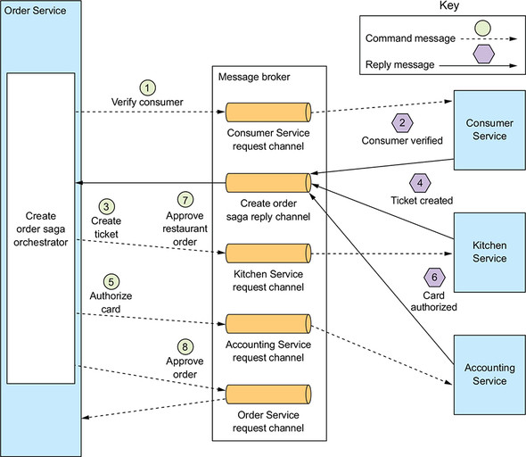

#### 사가 오케스트레이션을 상태 기계로 모델링

- 상태 기계(state machine) : 상태(state)와 이벤트에 의해 트리거되는 상태 전이(transition) 로 구성.
  - 전이 발생마다 액션이 일어나고, 사가의 액션은 사가 참여자를 호출하는 작용.
  - 사가 참여자가 로컬 트랜잭션 완료 시점에 상태간 전이가 트리거. 로컬 트랜잭션 상태와 결과에 따라 상태전이를 어떻게 하고 어떤 액션을 할지 결정.
  - 효율적 테스트가 가능.
- 주문 생성 사가의 상태 기계 모델


#### 사가 오케스트레이션과 트랜잭셔널 메시징

- 오케스트레이터 생성 →  사가 참여자에게 커맨드 메시지 전송 →  사가 참여자는 자신의 DB 를 업데이트 후 응답 → 사가 오케스트레이터 상태 업데이트 후 다음 사가 참여자에게 커맨드 메시지 전송 →  ...
- 서비스는 트랜잭셔널 메시지로 DB 업데이트와 메세지 발생을 원자적으로 처리.

#### 장단점

- 장점
  - 의존 관계 단순화: 오케스트레이터 → 참여자
  - 낮은 결합도
  - 관심사는 더 분리, 비즈니스 로직 단순화: 사가 편성 로직은 오케스트레이터에만.
  - 낮은 결합도
  - 관심사 더 분리, 비즈니스 로직 단순화: 
- 단점
  - 비즈니스 로직이 오케스트레이터에 중앙화 될 우려: 순서화만 담당하고 비즈니스 로직 담지 않도록 설계해야 함.


## 4.3 비격리 문제 처리(Handling the lack of isolation)

ACD 트랜잭션인 saga 의 비격리 문제:

- 한 사가가 실행 중 접근하는 데이터를 도중에 다른 사가가 바꿔치기 할 수 있다.
- 한 사가가 업데이트 하기 이전 데이터를 다른 사가가 읽을 수 있어 데이터 일관성 깨질 수 있다.

비격리에 따른 비정상(anomaly) 발생 가능.

### 1. 비정상 개요

- 소실된 업데이트(lost updates)
  - 한 사가의 변경분을 다른 사가가 덮어 쓸 때.
- 더티 읽기(dirty reads)
  - 한 사가가 업데이트 중인 데이터를 변경분을 다른 사가가 읽을 때.
- 퍼지/반복 불가능한 읽기(fuzzy/nonrepeatable reads)
  - 한 사가의 상이한 두 단계가 같은 데이터를 읽어도 결과가 달라지는 현상. 그 사이 다른 사가의 업데이트로 발생.

### 2. 비격리 대책

비격리 문제 대책(countermeasure):

- 시맨틱 락(semantic lock): 어플리케이션 레벨의 락. *_PENDING 상태를 두는 것.
- 교환적 업데이트(commutative updates): 업데이트를 어느 순서로 실행해도 되도록 설계.
- 비관적 관점(pessimistic view): 사가 단계 순서를 재조정하여 비즈니스 리스크 최소화.
- 값 다시 읽기(reread value): 데이터 덮어 쓸 때 다시 값을 읽어 변경된 내용이 없는지 확인하여 dirty writes 방지.
- 버전 파일(version file): 순서를 재조정 할 수 있게 업데이트를 기록.
- 값에 의한(by value): 요청별 비즈니스 위험성을 기준으로 동시성 메커니즘을 동적 선택.

#### 사가의 구조

- 보상 가능 트랜잭션(compensatable transaction): 보상 트랜잭션으로 롤백 가능한 트랜잭션.
- 피봇 트랜잭션(pivot transaction): 사가의 진행/중단 지점.
- 재시도 가능 트랜잭션(retriable transaction): 피봇 트랜잭션 직후의 트랜잭션. 완료가 보장된다(실패하지 않는다).

#### 대책: 시맨틱 락

- 보상 가능 트랜잭션이 생성/수정하는 레코드에 플래그 세팅 ⇒ *_PENDING 상태

- 다른 트랜잭션 접근시 lock, warning
- 재시도 가능, 보상 트랜잭션에 의해 플래그 해제.

#### 대책: 교환적 업데이트

- commutative: g(f(x)) = f(g(x))
- lost updates 방지

#### 대책: 교환적 업데이트

#### 대책: 비관적 관점

- dirty reads 로 인한 비즈니스 리스크 최소화하기 위해 사가 단계 순서 재조정.

#### 대책: 값 다시 읽기

- lost updates 방지.

- 레코드 업데이트 전 값을 다시 읽어 변경 여부 확인.

- 일종의 낙관적 오프라인 락(Optimistic Offline Lock) 패턴.

  > https://martinfowler.com/eaaCatalog/optimisticOfflineLock.html

#### 대책: 버전 파일

- 레코드에 수행 작업을 기록. 비교환적(noncommutative) 작업을 교환적(commutative) 작업으로 변환하는 방법.

#### 대책: 값에 의한

- 비즈니스 위험성을 기준으로 동시성 메커니즘 선택.
- 어플리케이션 차원에서 각 요청의 속성을 보고 사가나 분산 트랜잭션을 선택.

## 4.4 주문 서비스 및 주문 생성 사가 설계

> 샘플: https://github.com/eventuate-tram/eventuate-tram-sagas-examples-customers-and-orders


---------------

[^41]: https://m.blog.naver.com/windfalcon1/220402574806


## Q&A

#### 1. 2pc(2단계 커밋)은 스타벅스 조차 쓰지 않는다는데 요즘 2pc를 사용하지 않은 이유가 있을까요? 어떤 문제점이 있는지?

위에 요약에 스타벅스 주문 프로세스에서 2PC 를 사용하지 않는 것에 대한 설명이 있습니다. 주요한 이유는 가용성이 줄기 때문이겠죠. 브루어의 정리에서 얘기한 것 처럼 시스템에서 CAP 을 모두 충족하기 힘든데, 요즘은 가용성을 우위에 두는 경우가 많이 때문에 덜 선호되는 것 같네요. 

#### 2. 자바 EE 애플리케이션은 JTA기술을 이용해서 분산 트랜잭션을 수행할 수 있다고 하는데 JTA에 대해 간단히 설명해주시고 장단점에 대해 알려주세요.

- JTA: Java Transaction API
- XA 호환 리소스(e.g. DB) 의 분산 트랜잭션을 처리하는 자바 API
- 트랜잭션 경계 설정과 X/Open XA API 를 사용하는 트랜잭션 처리를 제공한다.
- java package: 
  - javax.transaction
  - javax.transaction.xa
- API
  - @Transactional : 선언적으로 트랜잭션 경계 제어
  - @TransactionScoped : 선언적으로 Bean 의 라이프사이클 범위 지정.
  - UserTransaction interface : 프로그래밍 방식으로 트랜잭션 경계 제어 가능
- 장점
  - XA 표준으로 호환되는 다중 리소스 처리 가능
  - Global Transaction 
  - 각 프로그램을 독립적으로 구성 가능 (XA 를 통해 순서만 변경하여 호출)
- 단점
  - 속도 저하
  - 부하 가중
  - TPS 감소

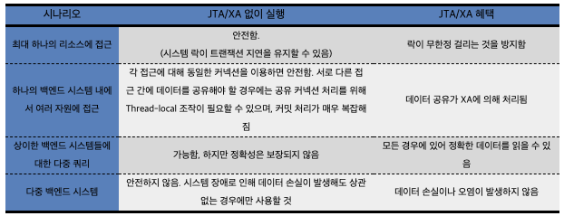

> https://en.wikipedia.org/wiki/Java_Transaction_API
>
> https://layered.tistory.com/entry/번역-JTA와-XA

#### 3. 4.2 그림에서 Txn:1에서 주문생성시 approval_pending상태로 생성하는데 pending상태로 생성하지 않지 않으면 어떤 문제가 있을까요? --> Txn:1에서 바로 approved상태로 생성

- 다음 트랜잭션에서 실패하여 롤백이 될 경우 되돌리기 어렵겠죠. 사가의 비격리 대책 중 하나인 semantic lock 기법.

#### 4. 상태 기계(state machine)을 사용해서 Ticket 상태표현에 사용할 수 있을까요? 또한 Ticket Status를 사용자 정의 상태로 확장이 가능할까요?

- 적합한 케이스겠죠.
- 오케스트레이터에 단계를 추가하여 모델을 확장할 수 있을 것 같습니다. 상태 기계 모델을 잘 구성하였다면..
- Spring Statemachine (SSM) 프레임워크라는 게 있는데, 활용해 볼 수 있을까요?
  - https://projects.spring.io/spring-statemachine/
  - https://www.baeldung.com/spring-state-machine

#### 5. 오케스트레이션 방식은 동기/비동기로 사용할 수 있을듯 한데요. 동기/비동기 방식 시 장단점에 대해 얘기해주세요. 그리고 보상 트랜잭션이 동기로 실행되면 어떤 문제가 있을까요?

- 동기: 2PC 방식과 큰 차이가 없을 듯.
  - 응답 대기시간이 길다. 일관성 유지와 롤백이 용이하지만, 가용성은 떨어진다.
- 비동기:
  - 가용성이 높고, 종속성이 비즈니스 로직 단순화되어 구현/테스트 용이.
- 

#### 6. ACID 트랜잭션의 4가지 요소를 예를 들어 이해하기 쉽게 설명해주세요. 예) 티켓생성 or 주문 등

예) 주문 생성 트랜잭션: 주문 생성 -> 소비자 확인 -> 주방 티켓 생성 -> 카드 승인 -> 티켓 승인 -> 주문 승인

- Atomicity: 주문은 성공 하거나 실패한다. 일부만 성공할 수 없다.
- Consistency: 생성 주문에 대한 하나의 주방 티켓이 존재한다.
- Isolation: 생성 중인 주문을 취소할 수 없다. 
- Durability: 생성 완료된 주문은 DB에 저장되어야 하고, 장애에도 유지 혹은 복구 가능해야 한다.

#### 7. non repeatable read가 무엇인가요?

- 비격리에 의해 나타나는 anomaly 로 트랜잭션이 처리중인 데이터를 다른 트랜잭션에 의해 갱신되어 달라지는 현상.

#### 8. 소실된 업데이트가 어떤 경우에 발생할 수 있는지 사례를 들어주세요.

- lost updates: 한 사가의 변경분을 다른 사가가 덮어쓸 때.

- 주문 생성 중 - 주문 취소가 실행되어 갱신 후 완료 - 주문 생성이 완료.

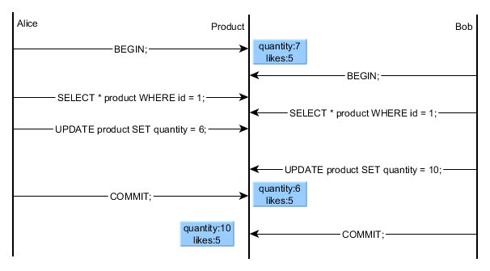

> https://vladmihalcea.com/a-beginners-guide-to-database-locking-and-the-lost-update-phenomena/

#### 9. 더티읽기는 어떤 경우에 발생할 수 있는지 사례를 들어주세요.

- dirty reads: 업데이트가 반영 안된 데이터를 다른 사가가 읽을 때.
- p.173


> https://vladmihalcea.com/dirty-read/

#### 10. 낙관적 오프라인 락의 예시를 들어주세요. 

- DB table 에 version 컬럼을 추가하여 업데이트 하기 전에 확인.

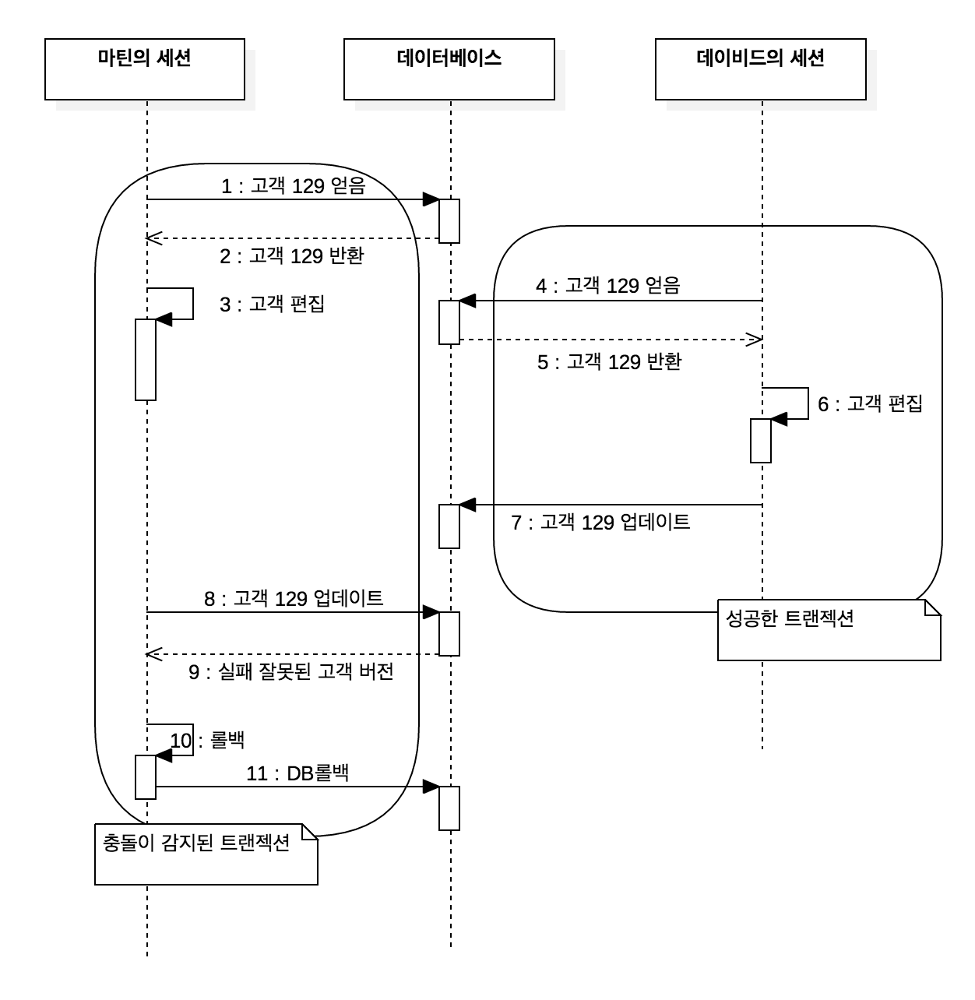

> http://redutan.github.io/2016/04/15/poeaa-offline-concurrency

#### 11. 피봇 트랜잭션과 재시도 가능 트랜잭션을 쉽게 설명해주세요.

- 피봇 트랜잭션: 사가 진행/중단 지점. 피봇 트랜잭션이 커밋되면 사가는 완료시까지 실행된다.
- 재시도 가능 트랜잭션: 피봇 트랜잭션 이후 반드시 성공하는 트랜잭션.

#### 12. Data ACID가 특히 중요한 "계좌송금"과 같은 업무가 최종 일관성(eventual consisstency)을 적용 할때 단점을 극복 고려 요소가 어떤것이 있을까요?

- eventual consistency 는 분산 시스템에서 고가용성을 높이기 위해 사용하는데, 항목이 새로 업데이트 되지 않는다는 전제하에 항목의 모든 읽기 작업이 최종적으로는 마지막으로 업데이트 된 값을 반환한다는 것.
- 분산 시스템의 사본이 다른 경우 조정이 필요.
- 동시 업데이트에 대한 조정 필요 -> 타임스탬프, 벡터 클락
- 메시지 브로커로 비동기로 한번 이상 전달할 수 있도록 보완할 수 있지 않을까요

> https://www.popit.kr/rest-기반의-간단한-분산-트랜잭션-구현-3편-tcc-confirmeventual-consistency/
>
> https://jins-dev.tistory.com/entry/분산-시스템-환경-Distributed-System-에서-BASE-원칙과-CAP-정리

# 5장. 비즈니스 로직 설계

## 5.1 비즈니스 로직 구성 패턴
 * 비즈니스 로직 및 아댑터 구성
   1. REST API 어댑터 : 비즈니스 로직을 호출 하는 인바운드 아댑터
   2. OrderCommandHandlers : 커맨드 메시지를 받아 비즈니스 로직을 호출하는 인바운드 어댑터
   3. DB 어댑터 : 비즈니스 로직이 DB접근을 위해 호출하는 어댑터
   4. 도메인 이벤트 발생 어댑터 : 이벤트를 메시지 부로커에 발행하는 아웃바운드 어댑터
   
   
   
 * 비즈니스 로직을 구현 하는대 있어서 "절차적 트랜잭션 스크립트 패턴"과 "객체 지향적 도메인 모델 패턴" 두가지 패턴으로 구성 됨.
 * "객체 지향적 도메인 모델 패턴"은 절대 적인 것은 아니고, 비즈니스 규모 및 도메인 요건에 따라 "절차적 트랜잭션 스크립트 패턴"이 좋은 선택지가 될 수 있음.
 * 시스템의 복잡도가 올라가면서 "객체 지향적 도메인 모델 패턴"이 필요하게 됨.
 * "객체 지향적 도메인 모델 패턴"의 장점
   1. 설계를 이해/관리 하기 쉽다.
   2. 테스트가 쉽다.
   3. 알려진 패턴을 이용하여 확장 하기 쉽니다.
 * 도메인 주도 설계의 도메인 모델에서의 수행하는 역할과 클래스는 아래와 같다.
   1. entity : 영속적 신원을 가진 객체
   2. value object : 값을 모아 놓은 객체
   3. factory : 생성자를 리턴하는 추상화 패턴 
   4. repository : entity 를 저장하는 캡슐화 객체 
   5. service : entity, value 객체에 속하지 않는 비즈니스 로직 구현 객체.
## 5.2 도메인 모델 설계: DDD 애그리거트 패턴
 * 애그리거트 
   1. 애그리거트는 한 단위로 취급 가능한 경계 내부의 도메인 객체들의 집합. 
   2. 애그리거트내의 entity를 접근 할때는 애그리거트 루트를 통해 호출 되게 되며, 이로 인해 동시성 및 일관성이 해결 됨.
   3. DDD를 통해 애그리거트 식별 및 애그리거트 루트를 식혈 하는것이 중요함.
   4. 애그리거트 규칙
      1) 외부에서 애그리거트를 참조하려면 반듯이 애그리거트 루트만 참조.
      2) 애그리거트간 참조는 반듯이 기본키만 사용.
      3) 하나의 트랜잭션으로 하나의 애그리거트를 생성/수정.
   5. 애그리거트는 작을수록 좋지만, 트랜잭션을 위해 크제 잡아야 할 수도 있음.
    
    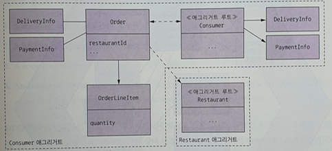
    
## 5.3 도메인 이벤트 발행
 * 이벤트 발행 하는 이유
   1. 여러 서비스에 거쳐 데이터 일관성 유지
   2. 레플리카를 둔 서비스에 소스 데이트 변경 시점
   3. 등록된 webhook을 통해 다음 비즈니스 진행 하도록
   4. 같은 어플리케이션의 다른 컴포넌트에 알림
   5. 사용자에게 notification
   6. 모니터링
   7. 사용자 행동 모니터링 이벤트 분석
 * 도메인 이벤트 식별 3단계
   1. event brainstorming
   2. event trigger : 각 이벤트 별 트리거 식별
      1) 사용자 액션
      2) 외부 시스템
      3) 기타 도메인 이벤트
      4) 시간 경과
   3. 애그리거트 식별
 * 개념적으로 도메인 이벤트는 애그리거트가 발행 하고, 애그리거트는 자신의 생태가 변경되는 시점과 그결과가 어떤 이벤트를 발행 할 지 알고 있음.
 * 애그리거트와 호출하는 서비스는 책임 분리 하는것 권장.

## 5.4 주방 서비스 비즈니스 로직
 * inbound adapter
   1. REST-API
   2. KitchenServiceCommandHandler : 사가가 호출하는 비동기 요청/응답, Ticket 생성/수정
   3. KitchenServiceEventConsumer : 외부 서비스(RestaurantService)가 발생하는 이벤트 구독,Restaurant 생성/수정
 * outbound adapter
   1. DB 어댑터
   2. DomainEventPublishingAdapter : DomainEventPublisher I/F 구현
 
   
   
## 5.5 주문 서비스 비즈니스 로직
 * inbound adapter
   1. REST-API
   2. OrderEventConsumer : 외부 서비스(음식점)가 발생하는 이벤트 구독, OrderService 호출하여 Restaurant 레플리카 생성/수정
   3. OrderCommandHandler : 사가가 호출하는 비동기 요청/응답, OrderService 호출하여 Order 수정
   4. SagaReplyAdapter : 사가 응답 채널 구독 및 사가 호출
 * outbound adapter
   1. DB 어댑터
   2. DomainEventPublishingAdapter : DomainEventPublisher I/F 구현하여 Order 이벤트 발생
   3. OutboundCommandMessageAdapter : CommandPublisher I/F 구현하여 캐맨드 메시지를 사가 참여자에게 보냄.
 
   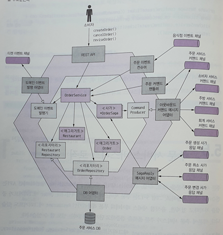
## 5.6 마치며
 * 비지니스 복잡도에 따라 "절차적 트랜잭션 스크립트 패턴"과 "객체 지향적 도메인 모델 패턴" 선택.
 * 비지니스 로직은 애그리거트로 구성하는게 좋으며, ACID를 트랜잭션을 내부 서비스로 국한 시키는것 지향.
 *  애그리거트 도메인내 생성/수정시 이벤트 발생 함.
 
[Q&A]
1. 트랜잭션 스크립트 패턴, 도메인 모델 패턴 중 EER은 어디에 포함되는 걸까요? (p 200)
 - EER은 "트랜잭션 스크립트 패턴" 으로 보여 짐.
 
2. attic은 도메인 모델 패턴인가요? 도메인 클래스에 오퍼레이션이 없는것 같네요 (p 200)
 - 
 
3. 전략패턴, 템플릿메서드 패턴은 코드를 변경하지 않고 컴포넌트를 확장할 수 있다고 하는데 EER에서 어디에 적용할 수 있을까요? 예시 소개 (p 201)
 - 전략패턴 : 암호화
 - 템플릿메서드 : rest-api 의 servlet
 
4. 그림을 설명해주세요. (p 204)
 - "낙관적 오프라인 락"으로 설명 되고 있음.
   샘이 update 하기 전이 최소 주문수량이 충족하는지 확인후 update 함.
   낙관적 오프라인 락이기 때문에 조회후 update하기전 동시성 문제는 있음.

  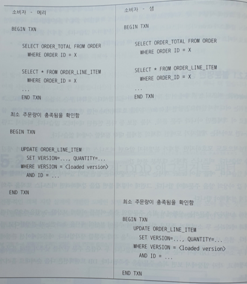
  
5. DDD 애그리거트 패턴이 나오는데 애그리거트, ccp, 모듈과의 관계는 어떤게 정의할 수 있을까요? (p 202)
 - P208 : 하나의 트랜잭션으로 오직 하나의 애그리거트만 생성/수정
   P237 : DDD 애그리커트는 도메인 모델을 모듈화 하고, 서비스 간 객체 참조 가능성을 배재하며, 전체 ACID 트랜잭션을 서비스 내부에 국한 시킴.
   변경 요소를 하나의 애그리거트로 묶는게 목적이며, 이것은 CCP의 개념과 비슷 볼 수 있다.

6. 3라인에 보면 애그리거트는 보통 DB에서 통째로 가져오기 때문에 복잡한 지연 로딩 문제를 신경쓸 필요가 없다는데.. 이게 무슨말인지? (p 206)
 - P208 : 하나의 트랜잭션으로 오직 하나의 애그리거트만 생성/수정
   연관 Data들이 하나의 애그리거트 안에서 있기 때문에, 연관 data를 한번에 가져 올 수 있음

7. Customer 애그리거트를 크게 잡으면 확장성이 떨어지는 단점이 있다는 말이 있는데.. 이게 무슨 뜻인지 설명해주세요. (p 209)
 - 커플링이 발생하여, 변경시 영향도가 높아짐

8. 웹훅의 의미를 설명해주시고 java에서 구현 시 어떤 방식으로 할 수 있을까요? (p 212)
 - hooking 이란 중간에 가로 채는 행위를 를 의미함.
   webserver등에서 hooking 하고 있다 특정 URL이오면 event 처리를 별도 할 수 있음
   음.. java에서 filler등이 가 webhook 이지 않을까 생각됨 (검색해도 자료가 별로 없음) 

9. 마커 인터페이스란 무엇인가? (p 213)
 - 자바에서 객체 직렬화는 Serializable 이라는 인터페이스를 implements 하면 됨. 그런데 이 인터페이스는 구현해야 할 메소드가 하나도 없음. 단지, 객체가 직렬화 대상임을 알려주는 일종의 마커(Marker) 역할을 함. 그래서 이렇게 메소드를 하나도 가지지 않는 인터페이스를 마커인터페이스(Marker Interface)라 하고, 태그(tag)인터페이스라고 부르기도 함.

10. 이벤트 강화(event enrichment) 기법이 무엇인가요? (p 214)
 - 이벤트안에 컨슈머가 필요한 data를 구체적으로 넣어 전달 하는 방법

11. 스프링 데이터 릴리스 잉갈스는 스프링 ApplicationContext에 이벤트를 자동 발행하는 장치를 제공한다고 하는데 스프링 데이타 릴리스 잉갈스에 대해 간단히 소개~ (p 218)
 - [spring data release ingalls](https://spring.io/blog/2017/01/30/what-s-new-in-spring-data-release-ingalls)

12. DDD는 OOD를 개선한 접근 방식이라고 설명되어있는데, OOD에 대한 설명과 어떤점이 개선되었는지 설명해주세요 (p 201)
 - 

13. 엔벨로프 객체에 대해 좀 더 설명해 주세요. (p212)
 - 

14. 예제 5-2 에서 컨슈머가 필요한 데이터를 주문생성 이벤트에 포함하는데, 컨슈머에서 주문 서비스의 정보(DeliveryInformation)를 어떻게 인식할 수 있나요? (p 214) 
 - message broker 를 통해 전달 받을 수 있음.

15. P of EAA 에서 설명하는 transaction script pattern 에 대해서, 그리고 기존 EER 기능 중 attic 에 구현한다고 할 때 적합한 기능은 어떤게 있을까요? (p 199)
 - "transaction script pattern"은 model1 에 해당 하는 구조로 하나의 코드 안에 로직이 모두 존재하며 DB도 직접 access 함.
  
 # 6장. 비즈니스 로직 개발: 이벤트 소싱

## 주요 내용
* 이벤트 소싱이란?
* Aggregate 구현
* 이벤트 저장소
* 스냅샷
* 이벤트 소싱의 장단점
* 사가와 이벤트 소싱 접목

## 1. 이벤트 소싱이란?
* 이벤트 소싱은 데이터 저장 방법에 대한 것이다.
* 이벤트 소싱은 비즈니스 로직을 구성하고, aggreagate를 저장함
* 각각의 이벤트는 aggregate의 상태 변화를 나타냄

    
    
    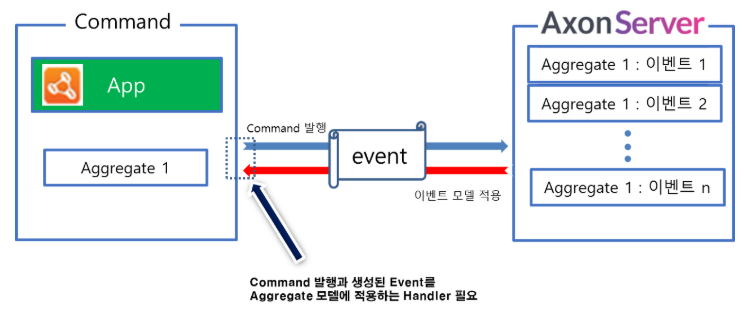
    
* application은 이벤트를 replay하여 aggregate의 현재 상태를 생성함
    ```
    replay란? event store에서 기존 내역을 전달 받아 재수행하는 작업.
    1. aggregate의 이벤트를 로드
    2. 기본 생성자를 호출하여 aggregate 인스턴스 생성
    3. 이벤트 하나씩 순회하여 apply() 호출
    ```
* 이벤트 소싱에서는 이벤트를 outbox 테이블에 잠깐 저장했다가 지우는 것이 아니라 영구 저장함
  
## 2. Aggregate 구현
1. command handler : 변경될 필드를 apply를 이용하여 이벤트에 전달함. 이 때, aggregate의 상태는 아직 바뀌지 않음.
2. event handler : aggregate 상태를 update함
```
참고) axon framework Handler Annotation
- @CommandHandler : Aggregate에 대한 명령이 발생되었을 때 호출되는 메소드임을 알려주는 마커 역할
- @EventSourcingHandler : CommandHandler에서 발생한 이벤트를 적용하는 메소드임을 알려주는 마커 역할
- @EventHandler : Query 모델 혹은 이벤트 발생시 해당 이벤트를 적용하는 메소드임을 알려주는 마커 역할
```
axon framework를 이용한 aggregate 구현 예) 

* command 영역 (command 수행 및 event 저장)

    

* query 영역 (event를 수신받아 read model에 반영)

    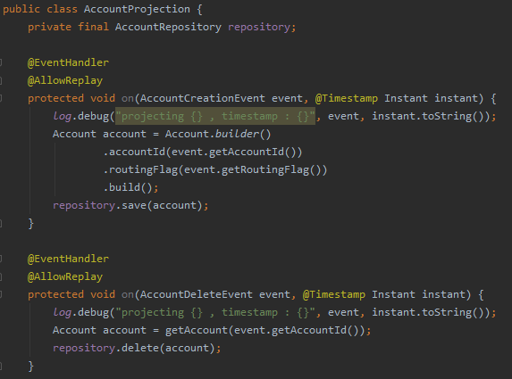


### 3. 이벤트 저장소
* 비즈니스 이벤트 흐름을 모두 저장함
* 이벤트 저장에 사용할 수 있는 저장소는 크게 세 가지로 분류된다.
    - 이벤트 저장에 특화된 데이터 저장소 사용 (https://eventstore.com/)
    - NoSQL 사용
    - 관계형 데이터베이스 사용
* event store table (axon server)


### 4. 스냅샷
- 현재 시점의 최종 데이터는 저장된 이벤트들을 재생하여 알아냈지만, 너무 많은 이벤트들이 발생했다면, 최종값을 얻기 위해 해당 이벤트들을 모두 재생하면 처리시간이 길어지므로, 스냅샷이란 개념이 도입됨.
- 이벤트가 발생할 때 스냅샷으로 저장하여 사용
- 스냅샷은 aggregate의 상태를 저장함.
- application에서 aggregate 최종 상태를 조회할 때, 가장 최근의 스냅샷과 그 이후의 이벤트만 가져와 aggregate의 최신 상태를 로드하는 방식임
 
- axon framework 에서는 Configuration 설정을 통해 Aggregate 별로 snapshot 설정이 가능함.
- 스냅샷 생성 시 payload 에 aggregate의 상태정보가 저장됨

### 5. 이벤트 소싱 장단점
- 이벤트 소싱 장점
    - 도메인 이벤트를 확실하게 발행함
    - 애그리거트 이력이 보존됨
    - 객체-관계형 임피던스 불일치 문제를 대부분 방지할 수 있음
    - 개발자에게 타임 머신을 제공함

- 이벤트 소싱 단점
    - 새로운 프로그래밍 모델을 배우는 데 시간이 걸림
    - 메시징 기반 애플리케이션은 복잡함
    - 이벤트를 개량하기가 까다로움
    - 데이터를 삭제하기가 어려움
    - 이벤트 저장소에서 쿼리로 데이터를 가져오기가 만만치 않음
    
### 6. 사가와 이벤트 소싱 접목
- 오케스트레이션 SAGA    
    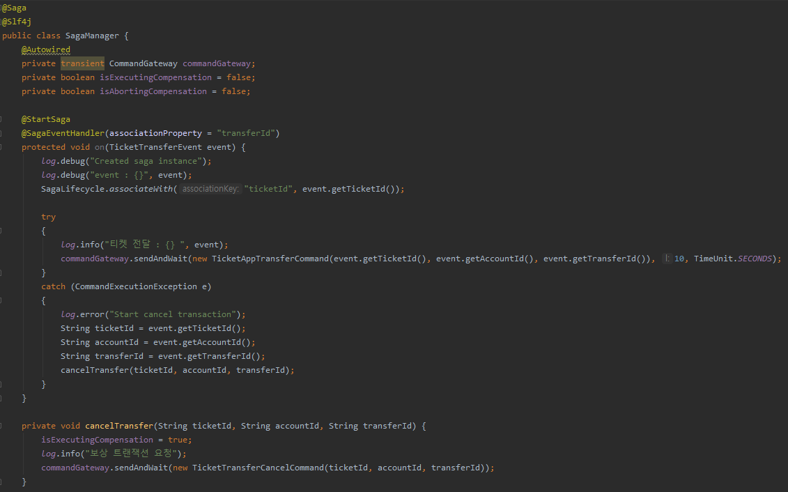
    

### 참고
- 이벤트 스토어 종류 및 설명 \
https://cla9.tistory.com/14?category=814447


### Q&A
1. 이벤트 소싱(event sourcing)과 이벤트 드리븐 아키텍처(event driven architecture)와 같은건가요? \
다릅니다. EDA는 분산 아키텍처 환경에서 상호 간 결합도를 낮추기 위해 비동기 방식으로 메시지를 전달하는 아키텍처 패턴이고, \
이벤트 소싱은 데이터를 저장하는 방법에 대한 것입니다. 데이터를 이벤트 단위로 저장합니다. 

2. 객체-관계 임피던스 부적합이 무슨 의미인지요? \
임피던스 불일치는 원래 불충분한 전력 흐름을 나타내는 전기공학 용어에서 차용한 말입니다. \
객체지향 애플리케이션들이 RDBMS에 있는 테이블을 결합하는 과정에서 성능이 떨어지는 현상을 통칭하는 말입니다. \
객체는 직접 호출을 사용하지만 RDBMS는 주키와 외부키를 사용하여 테이블간 조인을 통해 호출함 \
재사용의 최대화를 위해 객체는 캡슐화를 사용함. 따라서 관계형 데이터베이스로 매핑되면서 불필요한 호출이 발생함.
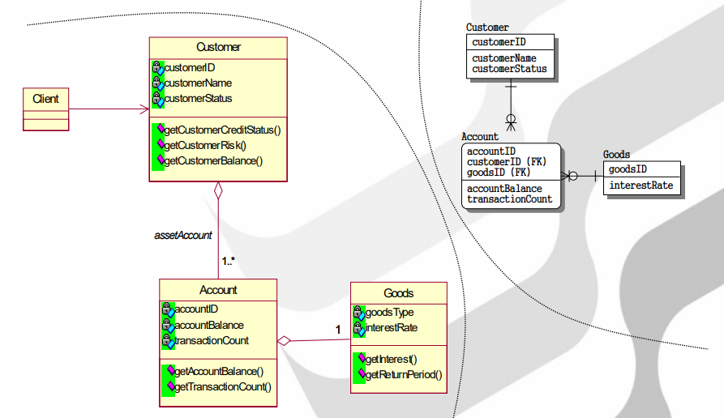

3. 폴드 또는 리듀스 작업이 무엇인가요? \
fold와 reduce는 컬렉션 타입의 데이터를 람다 함수에 차례로 전달한 후 람다 함수의 결과값을 반환해주는 함수입니다.
특징은 람다 함수에서 반환한 값을 기억하고 있다가 그 다음 데이터에 의해 호출될 때 이전에 반환했던 값을 함께 전달해주어 참조가 가능하도록 합니다. \
이벤트로 aggregate를 재구성할 경우 이벤트를 차례로 순회하며 apply() 를 호출하는 것과 동일한 방식이라 할 수 있습니다.


4. orderId만 포함된 아주 작은 OrderShippedEvent란 있을 수 없다는 말의 의미는? \
OrderShippedEvent에서 상태 변경만 일어난다면, orderId만 포함되면 안되고, orderId와 변경될 status가 모두 포함되어야 한다는 말 같습니다.

5. 낙관적 잠금을 사용하는 예시를 하나 들어주세요. \
낙관적 잠금은 레코드를 읽고 버전 번호를 기록하고 레코드를 다시 쓰기 전에 버전이 변경되지 않았는지 확인하는 전략입니다. \
예로는 소스코드관리시스템(SCM:source code management)를 들 수 있습니다.

6. NoSQL 이벤트 저장소는 트랜잭션 모델이 제한적인 이유는? \
서비스를 구현하는데 인덱싱과 트랜잭션이 필요하다. 현재 배포되어 있는 NoSQL들은 이와 같은 기능이 아예없거나 제한적인 것으로 확인됩니다. \
mongoDB 의 경우 multi document에 대한 transaction 기능이 추가되었지만, 단일 node에서는 transaction이 불가한 제약사항이 존재합니다.

7. rdbms 이벤트 저장소 사용시 events 테이블이 거대해지는 것이 문제가 되지 않을까요? 예) 누적데이타 1억건 이상 \
RDBMS 사용의 장점으로는 Transaction에 대한 지원 및 기술적 성숙도가 높다는 점입니다. 하지만, 가장 큰 문제점은 확장성입니다. \
대량을 데이터 처리보다는 데이터 공간 효율화 및 관계를 통한 데이터 정합성 보장 등에 초점이 맞춰져 있습니다. \
만약 DBMS가 오라클이라면 Hash 파티셔닝, reverse 인덱스, IOT(Index Organized Table) 등을 적절히 사용한다면 개선의 여지는 있습니다.

8. EER 혹은 attic에서 이벤트 소싱을 사용한다면 어디에 적용해 볼 수 있을까요? \
이벤트 소싱은 데이터 저장방법에 대한 것입니다. 순차적으로 발생하는 이벤트를 모두 저장합니다. \
예를 들어 eer에서 관리자가 상담 운영설정 변경 시 실수로 데이터를 잘못 변경했을 경우 변경 전 데이터를 알 수가 없습니다. \
이 때, 이벤트 소싱을 이용하면, 변경 전 데이터를 이벤트 로그를 통해 확인할 수 있습니다. \
또는 eer에서 ticket_status가 변경될 경우 최신 ticket_status 조회하는 t_ticket 테이블과 ticket_status 이력을 쌓는 t_ticket_process 테이블이 있는데,
ticket_status의 흐름을 이벤트소싱의 이벤트 흐름으로 표현될 수 있을 것 같습니다.
 
9. 스냅샷을 찍는다면, Event 에 찍는 것인데 기존 repository와 스냅샷 찍힌 시점과의 관계는 어떻게 될까요?
   (ex event N 번째 이후 만 바라본다고 하면, 실제 repository도 같이 백업 or 스냅샷이 찍혀야 의미가 있지 않을까?) \
aggregate의 현재 상태를 얻기 위해 모든 이벤트를 반복해서 재생하지 않고, 스냅샷을 두어 aggregate 최신상태를 빠르게 가져오는 방법입니다.
query repository 는 event 발생 시 저장하였다가(SEP방식), 사용자가 read 시 사용하는 repository 입니다. \
참고) https://cla9.tistory.com/15?category=814447

10. 그림 6-4 을 설명해 주세요. \
command 처리 시 aggregate 상태는 아직 변경되지 않은 상태이며, apply로 이벤트를 발생 후 aggregate가 변경됩니다.
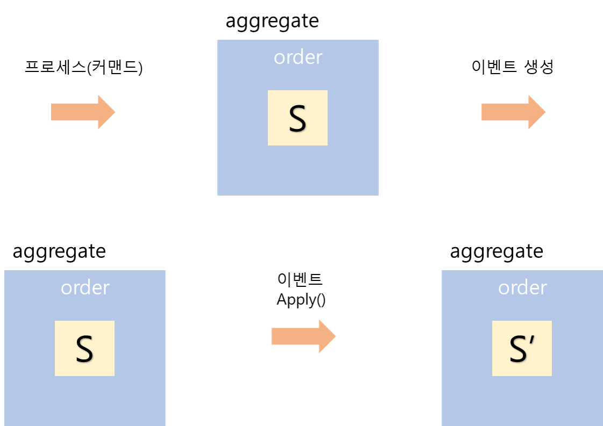 


11. 스냅샷 생성 방법 중 메멘토 패턴은 어떤 방식인가요? \
메멘토 패턴은 객체를 이전 상태로 되돌릴 수 있는 기능을 제공하는 소프트웨어 디자인 패턴입니다. \
메멘토 패턴은 오리지네이터(originator), 케어테이커(caretaker), 메멘토(memento) 3개의 객체로 구현됩니다. \
현재의 오브젝트의 상태를 기록하고 저장하는 메멘토 패턴은 프로그램에서 undo(실행취소), snapshot(현재상태저장) 등을 실행할 수 있습니다. \
참고) https://m.blog.naver.com/PostView.nhn?blogId=horajjan&logNo=220470142184&proxyReferer=https:%2F%2Fwww.google.com%2F

12. 업캐스터를 통한 업스캐일링는 어느 수준까지 가능할까요?

# 7장. 마이크로서비스 쿼리 구현

## 주요 내용
* 쿼리 구현 방법
* API 조합 패턴 응용 쿼리
* CQRS 패턴

## 1. 마이크로 서비스 아키텍처의 쿼리 구현
1. API 조합 패턴을 이용한 쿼리 구현 \
: 서비스 클라이언트가 데이터를 가진 여러 서비스를 직접 호출하여 그 결과를 조합하는 패턴. \
가장 단순한 방법으로 가급적 이 방법을 쓰는 것이 좋다고 합니다.
2. CQRS 패턴을 이용한 쿼리 구현 \
: 쿼리만 지원하는 하나 이상의 뷰 전용 db를 유지하는 패턴. \
구현하기 복잡하고 어려움.

## 2. API 조합 패턴 응용 쿼리
```
API 조합 패턴은 데이터를 가진 서비스를 호출한 후 그 반환값을 조합해서 가져온다.
```
ex) frontend module에서 호출되는 findOrder()는 다수의 서비스를 조합하여 주문 내역을 반환한다.


### 2.1. 개요
API 조합 패턴은 API 조합기와 provider service 두 종류의 참여자가 개입한다.
- API 조합기: provider service를 호출하여 데이터를 조회함.
- provider service: 최종 결과로 반환할 데이터의 일부를 갖고 있는 서비스

   
   
### 2.2. API 조합 설계 이슈
API 조합 패턴에는 다음 두 가지 설계 이슈가 있습니다.
```
- 누가 API 조합기 역할을 맡을 것인가?
- 어떻게 해야 효율적으로 취합 로직을 작성할 것인가?
```
첫 번째 "누가 API 조합기 역할을 맡을 것인가?"

API 조합기 역할을 결정할 때 세 가지 옵션이 있습니다.
1. 서비스 클라이언트를 API 조합기로 임명하는 것

    

2. API Gateway를 API 조합기로 임명하는 것

    
    
3. API 조합기를 StandAlone 서비스로 구현하는 것

    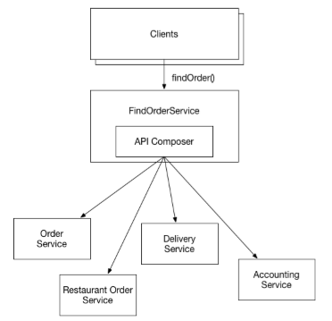

두 번째 "어떻게 해야 효율적으로 취합 로직을 작성할 것인가?"
```
API 조합기는 리액티브 프로그래밍 모델을 사용해야 합니다.
```
- 각 서비스가 의존관계가 없을 경우 API 조합기가 provider service를 병렬 호출 해야 함
- 의존 관계일 경우 순차 호출을 해야함
- 두 개가 뒤섞인 실행로직은 복잡하여 Java의 CompletableFuture 또는 RxJAVA의 옵저버블 또는 추상체에 기반한 리액티브 설계 기법을 동원해야 합니다. (자세한 내용은 8장에서 설명)

## 3. CQRS 패턴
```
CQRS란? 커맨드와 쿼리의 책임을 분리하는 것이다.
여러 서비스에 있는 데이터를 가져오는 쿼리는 이벤트를 이용하여 해당 서비스의 데이터를 복제한 읽기 전용 뷰를 유지한다.
```
### 3.1. CQRS 개요
CQRS 패턴은  다음의 세 가지 문제를 해결할 수 있는 묘안입니다.
- API를 조합하여 여러 서비스에 흩어진 데이터를 조회하려면 값비싸고 비효율적인 인메모리 조인을 해야 합니다.
- 데이터를 가진 서비스는 필요한 쿼리를 효율적으로 지원하지 않는 형태로 데이터를 저장합니다.
- 관심사를 분리할 필요가 있다는 것은 데이터를 가진 서비스가 쿼리 작업을 구현할 장소로 적합하지 않다는 뜻입니다.
    
    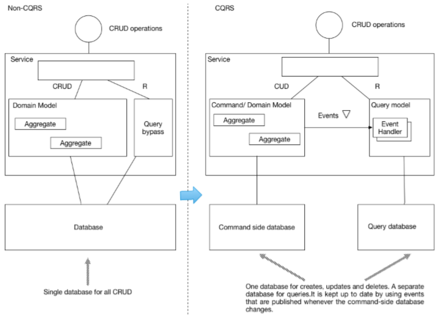

### 3.2. CQRS 뷰 설계
CQRS 뷰 모듈에는 하나 이상의 쿼리 작업으로 구성된 API 가 있습니다. \
이벤트핸들러를 통해 쿼리 DB를 최신상태로 유지시키고, 이를 쿼리 API가 조회합니다.

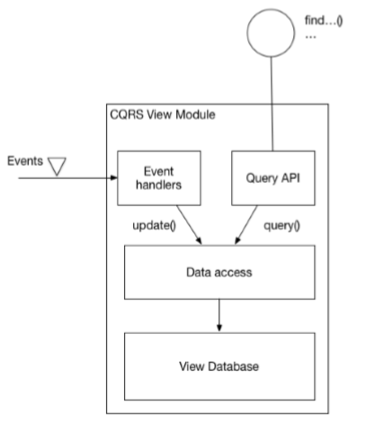

뷰 모듈을 개발할 때는 몇 가지 중요한 설계 결정을 해야합니다.
- DB를 선정하고 스키마를 설계해야 합니다.
    - SQL/NoSQL
- 데이터 접근 모듈을 설계할 때 멱등한/동시 업데이트 등 다양한 문제를 고려해야 합니다.
    - 뷰가 여러개의 Aggregate의 이벤트를 구독할 경우 동시성 처리 필요
    - 중복 이벤트 발생해도 결과가 정확히 동일하거나 중복을 솎아내서 실행해야 함
- 기존 애플리케이션에 새 뷰를 구현하거나 기존 스키마를 바꿀 경우, 뷰를 효율적으로 (재)빌드할 수 있는 수단을 강구해야 합니다.
    - 아카이빙된 이벤트, 스냅샷을 이용하여 뷰 구축
- 뷰 클라이언트에서 복제 시차를 어떻게 처리할지 결정해야 합니다.
    - 커맨드 쪽 작업이 클라이언트에 발행된 이벤트의 ID가 포함된 토큰을 반환하고, 클라이언트는 이 토큰을 쿼리 작업에 전달하면 해당 이벤트에 의해 뷰가 동기화되지 않았을 경우 에러를 반환

## Q&A

1. (290p) 서비스 클라이언트는 attic에서 어느부분을 말하는 것인가? \
 application ui, attic customer와 같은 상담사, 고객 web application을 말합니다.

2. (291p) 누가 api 조합기 역할을 맡을 것인가?에 대한 방법이 3가지 나오는데 어느 방법이 제일 좋은것 같은가? \
각각의 방법 중 장단점을 확인하고, 해당 시스템에 맞는 방법을 택해야 합니다.
프로바이더 서비스와 front-end client가 동일한 네트워크라면 front-end client가 API 조합기 역할을 하는 것이 좋을 것 같고,
API 서비스가 여러대의 application으로 구성될 경우에는 API 게이트웨이나 stand alone 서비스를 두어 client에서 호출 한 번으로 데이터를 조회할 수 있어 효율적입니다.

3. (292p) api 조합기에서 순차/병렬호출 중 어느방법을 사용해야 할까요? \
데이터 조합을 위해 호출하는 서비스들의 의존관계가 없을 경우에는 병렬호출을 사용하고,
서비스 호출 시 다른 서비스의 선행 호출이 필요하다면, 순차 호출을 사용하는 것이 맞습니다.
하지만, 두 가지 방식의 호출이 뒤섞일 경우 복잡해질수 있기 때문에, 자바의 CompletableFuture, RxJava의 옵저버블, 또는 리액티브 설계 기법을 동원해야 합니다. (8장에서 API 게이트웨이 패턴에서 자세히 설명)

4. (293p) 가용성 높이는 전략에서 프로바이더 서비스가 불능일 경우 이전 캐쉬를 반환하면 된다고 하는데 서비스가 불능은 아니지만 hang이 걸리는 경우(수초이상 대기)는 어떻게 해야 하는가? \
hang 상태로 유지되거나 connection이 idle 상태로 오랫동안 유지되는 경우 timeout 값을 주어 캐쉬를 반환하도록 하면 될 것 같습니다.
또한, API gateway의 Hystrix와 같은 circuit breaker를 두어 장애 전파를 막는 방법이 있습니다.

5. (297p) mongodb, postsql, mysql의 지리공간팩을 사용하는 예시를 보여주세요.
 - [mongodb]에서는 GeoJSON객체와 legacy coordinates pairs로 geospatial data를 저장할 수 있습니다. \
   ① 다음의 documents를 사용하여 places 라는 이름의 collection을 생성합니다.
    
    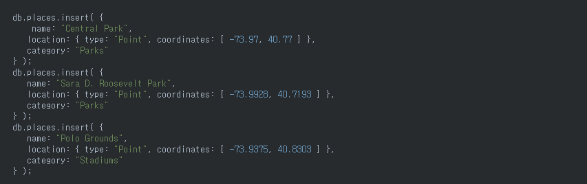
    
   ② location 필드에 2dsphere index 를 생성합니다.
    
    
    
   ③ $near 연산자를 사용한 다음의 쿼리는 명시된 GeoJSON point로부터 1000미터 이상 5000미터 이하의 documents를 가장 가까운 것부터 가장 먼 순서로 정렬해 반환합니다.
    
    
    
    참고) https://grepper.tistory.com/7 \ ,  https://docs.mongodb.com/manual/geospatial-queries/
- [postgreSQL]에서는 PostgreSQL의 플러그인 PostGIS를 이용하여 PostgreSQL에서 공간 데이터를 관리, 처리 분석할 수 있습니다. \
   ① 테이블 생성 후 데이터 삽입
   
   
   
   ② geometry 필드 추가 후 위도, 경도 컬럼 데이터를 이용하여 geometry 필드 업데이트
   
   
   
   
   
   ③ 내가 있는 위치로부터 150m 이내에 있는 음식점을 찾는다.
   
   
   
   참고) https://www.joinc.co.kr/w/man/12/spatial
   
- [mysql]에서는 다음과 같이 사용합니다. \
   ① 테이블 생성 후 데이터 삽입
   
   
   
   ② ST_DISTANCE_SPHERE()를 사용하여 두 좌표 사이의 거리 구하기
   
   
   
   ③ 결과 (dist 저장됨)
   
   
   
   참고) https://purumae.tistory.com/198

6. (304p) 네이티브 모바일 앱이나 SPA같은 UI 애플리케이션은 쿼리하지 않고 커맨드가 성공하면 자신의 로컬 모델을 업데이트 하는 방법을 복제시차를 해소할 수 있다고 하는데 어떻게 할 수 있을지 설명 부탁. \
SPA는 데이터를 요청하고 브라우저에서 바로 페이지를 랜더링합니다. SPA는 로컬 스토리지를 캐시하여 커맨드 성공 시 스토리지에 저장된 데이터를 사용하여 복제시차를 해소할 수 있습니다.
(커맨드가 반환한 데이터로 로컬 모델을 업데이트함)

7. (307p) 비기본키 기반으로 업데이트 하기가 결과 쉽지 않다는데 왜 그런가요?

    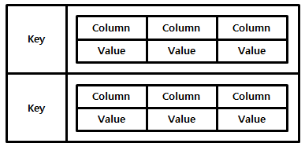
    
    NoSQL은 key-value 구조로 빠르게 데이터를 조회할 수 있는 반면에 단점으로 값 검색에 대한 한계가 있습니다. 키를 통해 값(key)을 검색하고 수정/삭제를 할 수 있으나, 값(value)을 기준으로 한 검색은 어렵습니다.
방법이 없는 것은 아니나(Riak 사용) 키를 기준으로 한 검색보다는 효율성이 떨어집니다. 

8. eer의 cs톡, 시나리오 등의 업무 중 cqrs를 적용해 볼만한 곳이 있을까요? \
router 배분에 적용해볼 수 있을 것 같습니다.
engine에서 배분요청 (command) => 라우터에서 배분 => router h2 db 변경 => engine db update (query)

9. (291p) API G/W를 조합기로 사용한다면, 서비스별로 분산 해놓고 API G/W에서 병목이 발생 하지 않을까요? 혹은 대안 아키텍쳐가 있지는 않을까요? \
API Gateway에 모든 API 호출이 일어나므로 API Gateway가 병목 지점이 되기 매우 쉽습니다.
이를 보완하기 위해 hystrix로 부하 전파 상황을 발견하고, 더 이상의 전파를 막아줄 수 있습니다.
리액티브 설계 기법을 사용하는 것도 방법일 수 있습니다. 
또는 API G/W를 여러대 두어 가용한 API G/W로 연결하여 처리할 수 있지 않을까요..?

10. (292p) 외부에서 접근 가능한 쿼리 작업 구현의 구체적인 예시를 알려주세요. \
proxy에서 restAPI 호출하여 데이터를 가져오는 경우를 말할 수 있습니다.
(proxy는 고객사 홈페이지 was에 설치되고, restapi 는 다른 서버로 구성될 때)

11. (304p) "CQRS가 꼭 필요한 경우"란 어떤 경우 일까요? \
Application 의 비즈니스 로직은 대부분 데이터 변경(C,U,D) 작업에서 처리되고, 데이터 조회(R) 작업은 단순 데이터 조회가 대부분입니다.
이 두 업무를 동일한 Domain Model로 처리하게 되면 각 업무 영역에 필요하지 않은 Domain 속성들로 인해 복잡도가 증가할 수 있습니다.
이런 복잡한 도메인 모델을 command model과 query model 로 분리로 이를 해결하는 패턴이 CQRS 입니다.
이렇게 분리된 model은 각각의 도메인만 모델링하여 훨씬 단순하게 구현/적용될 수 있습니다.
따라서 복잡한 도메인 모델일 경우 CQRS 가 필요하다고 생각됩니다.
다음은 CQRS적용 구조 입니다.

    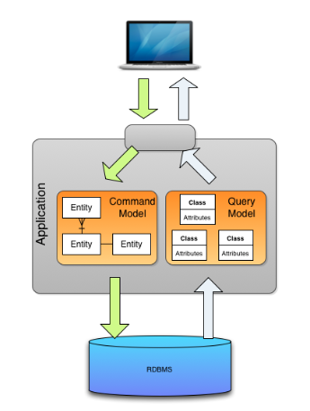

    
    
12. CQRS 대상으로 삼는 기준을 정할 수 있을까요? 그렇지 않다면 남용하게 될 우려는 없을까요? \
복잡한 도메인 모델이 CQRS의 대상이 됩니다. \
데이터 변경과 데이터 조회 업무가 동일한 Domain Model로 처리하게 되면서 도메인의 복잡도가 높아질 경우 CQRS 고려대상이 됩니다.

13. CQRS 와 API 조합 패턴을 함께 사용할 수도 있을까요? \
CQRS와 API 조합 패턴은 쿼리를 구현하기 위한 방법입니다. \
두 개의 방법은 클라이언트 요청에 따라 적절하게 사용해도 될 것 같지만, 컴포넌트 별로는 하나씩만 선택해서 구현하는게 좋을 것 같습니다.

14. (310p) CQRS 뷰 추가, 갱신 방법은 이벤트 소싱과 어떤 관련이 있나요? \
클라이언트에서 서비스를 호출하여 CUD할 경우(데이터 조작이 있을 경우) query DB에 동기화 시켜주기 위하여 이벤트 소싱이 사용됩니다. \
이벤트 소싱으로 이벤트를 발행시키고, CQRS 뷰의 이벤트핸들러가 query DB를 업데이트 시킵니다. \
CQRS에서 이벤트소싱은 필수가 아닙니다. \
단일 디비를 사용할 경우에는 필요 없고, query DB가 따로 있을 경우 메세지 브로커를 통해서도 데이터를 동기화시킬 수 있습니다.# 8. 외부 API 패턴

## 8.1 외부 API 설계 이슈

### 1. API 설계 이슈: FTGO 모바일 클라이언트

FTGO 모바일 앱과 같이 방화벽 외부의 클라이언트에서 직접 개별 서비스 호출하여 주문 조회 뷰를 개발할 경우,

- 클라이언트가 요청을 여러번 요청하기 때문에 UX 가 나빠진다
- 캡슐화가 되지 않아 frontend 개발자가 backend 와 맞물려 코드를 변경해야 한다
  - API 정보가 클라이언트에 있으면 변경이 어렵다.
- 클라이언트에 비친화적인 IPC 를 사용 중인 클라이언트도 있다.
  - gRPC, AMQP 등 메시징 프로토콜, 혹은 방화벽 문제가 있는 프로토콜 등.

### 2. API 설계 이슈: 다른 종류의 클라이언트

- 웹 어플리케이션: 직접 백엔드 서비스 접근 가능.
- 브라우저 기반 자바스크립트 어플리케이션: 모바일 앱보다 많은 서비스 조합 필요, 서비스 API 의 효율적 조합 어려움.
- 서드파티 어플리케이션: 하위 호환성 유지 문제 → 퍼블릭 API 제공 필요.

## 8.2 API 게이트웨이 패턴

> https://microservices.io/patterns/apigateway.html

### 1. 개요

- API gateway: 방화벽 외부의 클라이언트가 API 요청의 단일 창구 역할을 하는 서비스.
  - facade pattern 과 유사
  - 내부 어플리케이션 아키텍처를 캡슐화하고 클라이언트에 API 제공
  - 인증, 모니터링, 사용량 제한 등

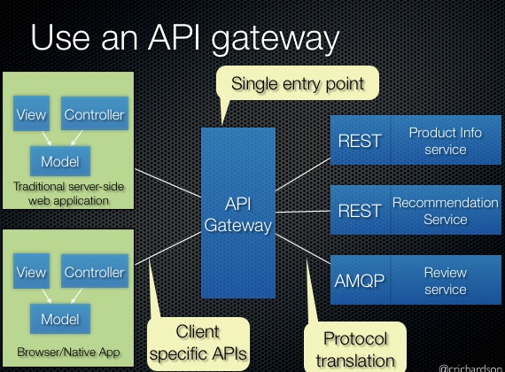

- 주요 기능:

  - 요청 라우팅: routing map 을 통해 서비스 요청 매핑.
  - API 조합: 단일 요청으로 필요한 데이터 조회할 수 있도록 대단위(coarse-grained) API 제공.
  - 프로토콜 변환
  - 클라이언트마다 적합한 API 를 제공
  - 엣지 기능(edge function) 구현
    - 엣지 기능: 인증, 인가, 사용량 제한, 캐싱, 지표 수집, 요청 로깅
    - 구현: API 게이트웨이가 여러 개인 경우 전용 엣지 서비스가 유효하지만, 네트워크 홉(hop) 이 증가로 네트워크 지연, 어플리케이션 복잡도 증가할 수 있다. → 전용 엣지 서비스 + 인증 기능은 API 기능에서 구현하여 hop 줄이도록.

- API 게이트웨이 아키텍처

  - API 계층 + 공통 계층
  - API 계층: 독립적인 하나 이상의 API 모듈 포함. 각 모듈에는 특정 클라이언트용 API 구현. 
  - 공통 계층: 엣지 기능 등 공통 기능 구현.

  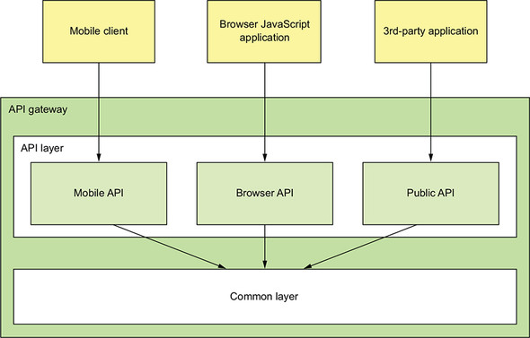

  - API 모듈의 API 작업 구현 방법
    - 서비스 API 하나에 직접 매핑되는 API 작업은 해당 서비스 API 로 요청 전송
    - API 조합은 사용자 정의 코드로 구현

- API 게이트웨이 소유권(ownership) 모델: 개발/운영 누가 담당할 것인가.

  - 전담팀 신설: 병목이 될 수 있다. 
  - 해당 클라이언트 팀이 소유(모바일, 웹, 퍼블릭 API 등)하고, API 게이트웨이 팀은 공통 모듈 개발과 운영 이슈에 집중

- Backend for frontend pattern

  - 소유권을 분리하게 되면 책임 소재가 불분명해진다 → BFF 패턴: 각 클라이언트마다 개별 API 게이트웨이.
  - 공통 기능 코드 중복 문제가 발생할 수 있으므로 동일한 기술스택을 사용하는 것이 좋다.

  

  - 장점: 
    - API 모듈 격리로 신뢰성 향상
    - 관측성(observability) 향상: 다른 API 모듈은 다른 프로세스이므로.
    - 독립적으로 확장 가능
    - 기동시간 단축: 어플리케이션이 더 작고, 심플해지므로.

### 2. 장단점

- 장점
  - 어플리케이션 내부 구조를 캡슐화
  - 클라이언트마다 최적의(client-specific) API 를 제공하므로 클라이언트-어플리케이션 간 왕복(round-trip) 횟수 줄이고 클라이언트 코드를 단순하게 함.
- 단점
  - 개발, 배포, 관리되어야 하는 고가용 컴포넌트 늘어남
  - 개발 병목 지점이 될 수 있다
  - → BFF 로 보완

### 3. API 게이트웨이 사례: 넷플릭스

> https://www.programmableweb.com/news/why-rest-keeps-me-night/2012/05/15
>
> https://netflixtechblog.com/embracing-the-differences-inside-the-netflix-api-redesign-15fd8b3dc49d

- 넷플릭스는 수백종(위 글은 800종 이상)의 장치에 스트리밍 서비스를 제공한다.
- 초기 만능(OSF, one-size-fits-all) 스타일의 API 로 제공하려고 했지만, 워낙 광범위하고 개별 요구사항도 다르므로 한계에 도달.
- 현재 기기별 API 가 따로 구현된 API 게이트웨이 사용하며, API 구현 코드의 소유/개발을 클라언트 기기 팀이 담당한다.
- Node.js, Falcor 등을 이용하여 API 모듈을 분리 → 신뢰성/관측성 향상, 클라이언트 API 모듈은 독립적으로 확장 가능.

### 4. API 게이트웨이 설계 이슈

- 성능과 확장성

  - 동기 I/O 모델: 네트워크 접속 당 스레드 배정.

    - 자바 EE 서블릿 프레임워크. 
    - 무거운 OS 스레드를 사용하여 개수 제약이 있으므로 동시 접속 가능 개수 제한적.
    - 간단, 잘 동작함

  - 비동기(non-blocking) I/O 모델: 단일 이벤트 루프 스레드(single event loop thread) 가 I/O 요청을 각 이벤트 핸들러로 디스패치. 

    - Netty, Vertx, JBoss Undertow 등 NIO 기반 프레임워크과 Node.js
    - 다중 스레드 사용 오버헤드가 없으므로 확장성 좋음
    - 구현이 복잡하고 어려움

  - API 게이트웨이 요청 처리 로직의 성격에 따라 결과가 다를 수 있다: e.g. Netflix Zuul 사례 (I/O 집약적 로직에 효과적)

    > https://netflixtechblog.com/zuul-2-the-netflix-journey-to-asynchronous-non-blocking-systems-45947377fb5c

- 리액티브 프로그래밍 추상체를 이용하여 관리 가능한 코드 작성

  - API 조합 코드를 비동기 콜백 방식으로 작성할 경우 callback hell 로 가독성과 순차/병렬 요청이 혼합된 경우 문제 발생 가능하다.
  - 리액티브 추상체를 활용하여 이해하기 쉽고 단순한 동시성 코드를 작성하는 것이 좋다.
    - Java8 CompletableFutures, Project Reactor Mono, RxJava 의 observable, Scala Future, Node.js 의  promise 와 RxJS

- 부분 실패 처리

  - 부하분산기에 의한 요청 처리
  - Circuit breaker pattern 적용

- 어플리케이션 아키텍처에서 선량한 시민(good citizen) 되기

  - 서비스 디스커버리 패턴으로 서비스 위치 파악
  - 관측성 패턴(observability pattern) 을 활용하여 모니터링하고 진단
  - 아키텍처에 알맞게 선정된 패턴으로 구현한다

## 8.3 API 게이트웨이 구현

### 1. 기성(off-the-shelf) API 게이트웨이 제품/서비스 활용

- AWS API 게이트웨이
- AWS 애플리케이션 부하 분산기(ALB, Application Load Balancer)
- Kong https://konghq.com/
- Traefik https://containo.us/traefik/

### 2. API 게이트웨이 자체 개발

- 프레임워크 검토 사항:
  - 코딩 복잡도를 최소화할 수 있는 라우팅 규칙 정의 매커니즘을 구현
  - HTTP 헤더 처리 등 HTTP 프록시 로직을 정확히 구현
-  Netflix Zuul https://github.com/Netflix/zuul
  - 라우팅, 사용량 제한, 인증 등 엣지 기능
  - Spring cloud zuul 을 사용하여 구성보다 관습(convention over configuration) 방식으로 개발이 용이.
  - 단점: 경로 기반 라우팅만 지원
- Spring Cloud Gateway https://spring.io/projects/spring-cloud-gateway
  - 요청을 백엔드 서비스로 라우팅, API 조합 요청 핸들러 역할, 인증 등 엣지 기능 처리 제공

### 3. API 게이트웨이 구현: GraphQL

- 그래프 기반 스키마로 서버 API 구성


- 장점
  - 클라이언트가 반환 데이터 제어 → 유연한 단일 API 개발 가능
  - 개발 수고를 덜 수 있다 - 쿼리 실행 프레임워크로 작성하기 때문.

------------


# Q&A

#### 1. 퍼사드 패턴을 소개해주세요. p.331

- 건물의 정면을 뜻하는 facade pattern 은 내부의 복잡한 서브 시스템에 대해 인터페이스를 제공하여 접근하게 한다.
- 요청 클라이언트로부터 내부 클래스의 캡슐화

> https://refactoring.guru/design-patterns/facade

#### 2. api 조합방식을 api 게이트웨이에서 하는 것이 좋은 방식일까요? (장단점) p.332

7번 답변과 중복.

#### 3. 넷플릭스 팔코(netflix falcor)에 대해 간단히 설명해주세요. p.340

효율적으로 데이터를 가져오기 위한 Javascript library.

graphQL 과 같이 단일 데이터 모델로 한번에 필요한 데이터를 받도록 할 수 있다.

JSON graph 를 이용해 중복을 제거.

> https://netflix.github.io/falcor/
>
> https://devcoding.tistory.com/28

#### 4. netflix zuul은 논블로킹 I/O를 사용하는 건가요? p.341

- zuul 2 부터 non-blocking 을 사용합니다.

> https://netflixtechblog.com/zuul-2-the-netflix-journey-to-asynchronous-non-blocking-systems-45947377fb5c

#### 5. spring cloud zuul/zuul2와 spring cloud gateway의 다른 점이 뭐가 있을까요?

가장 큰 차이는 spring cloud zuul 은 동기, zuul2 와 spring cloud gateway 는 비동기.

spring cloud gateway 는 spring 5, spring boot 2, project reactor 지원.

> https://velog.io/@tlatldms/서버개발캠프-MSA-아키텍쳐의-API-Gateway-프레임워크-결정

#### 6. "하위 호환성"을 관리 할 수 있는 아키텍쳐가 있을까요? p.330

3장에서 나온 SemVer 로 API 버저닝. 

API 의 경우 REST url 에 버전을 추가하거나 헤더에 버전 정보를 포함하는 방식. 서비스 배포툴을 이용하는 방법. kubernetes 등과 같은 툴을 활용한다거나..

#### 7. API G/W를 조합기로 사용한다면, 서비스별로 분산 해놓고 API G/W에서 병목이 발생 하지 않을까요? 혹은 대안 아키텍쳐가 있지는 않을까요? (7장 중복 질문 날짜가 다르니 해결이 되었다면 pass) p.332

API Composition Layer 위치

 1) API Gateway 앞

- Wrapper 형태로 Gateway 앞에 위치해서 Gateway 단을 전혀 건드리지 않지만, Composition Layer가 Consumer의 End Point가 되면서 모든 트래픽을 부담해야 합니다.

- Composition Layer와 Gateway 간의 Latency를 최소화해야 합니다.

- Composition Layer가 필요하지 않아도 무조건 통과해야 합니다.

 2) API Gateway 내부

- Gateway 내부에서 동작함으로 Network Hop이 존재하지 않습니다.

- Gateway 구현이 복잡해지고, Composition Layer 때문에 성능에 영향을 줄 수도 있습니다.

- 로직 변경이나 확장이 필요할 때, Gateway 재시작이 필요할 수도 있습니다.

 3) API Gateway 뒤

- Gateway는 아무것도 하지 않아도 되기때문에 도입하기 가장 쉽습니다.

- Composition Layer가 API Provider가 되는거나 마찬가지라고 할 수 있습니다.

- Composition Layer를 위한 End Point를 API Provider가 제공해야 할 수도 있습니다.

> https://ohjongsung.io/2018/09/25/rest-api를-얼마나-나누고-묶을까-rest-api-granularity

#### 8. 스탠드얼론 API G/W 를 사용하게되면 API 조합이 필요한 어플리케이션은 어떻게 되는건가요? p.338

7번 답변에 포함.

#### 9. 모바일 API, 브라우저 API, 퍼블릭 API 각각의 예시를 들어주세요. p.336

실제 서비스의 예제를 찾기 힘드네요. 

> https://medium.com/@giljae/다양한-장치를-지원하는-rest-api에-대해-고찰-e431070a6324

# 9장. 마이크로서비스 테스트 1부

## FTGO 테스트 방식
개발을 마치면 QA팀에서 개발자 코드를 넘겨받아 손으로 확인한다.

문제점)
1. 수동테스트는 비효율
2. 테스트가 너무 늦다

테스트가 잘 안되는 이유?
* 문화적인 요인 (테스트는 QA가 하는 일이야. 개발자가 그런데 신경쓸 시간이 어디있어?)

마이크로서비스에서는 반드시 테스트를 자동화 해야 한다.

## 마이크로서비스 아키텍처의 테스트 전략

FTGO 주문서비스를 변경할 일이 생겼다고 합시다.
당연히 고친 코드가 잘 동작하는지 실행해보아야겠죠.
주문 서비스와 이 서비스 디펜던시(DB, 타 서비스)를 모두 실행한 상태에서 API를 호출하거나 화면에서 마우스를 클릭하여 테스트 할 것입니다.

==> 이런 방식은 속도가 느리고 번거로운 수작업이 동반되는 치명적인 단점이 있다.

## 테스트 개요

테스트의 목적은 SUT(System Under Test)의 동작을 확인하는 것이다.
이는 클래스 수준의 작은 단위, 전체 애플리케이션의 큰단위, 여러 클래스나 개별 서비스처럼 중간규모일 수도 있다.

### 자동화 테스트 작성
* JUnit
* 4단계
    1. 설정(setup) - 초기화
    2. 실행(exercise) - 해당 클래스의 메소드 호출
    3. 확인(verify) - 호출결과를 단언(assertion)한다.
    4. 정리(teardown) - 결과 정리. DB 롤백 등

### 목/스텁을 이용한 테스트
service 테스트 시 해당 서비스만 테스트 하는 방법은 테스트 더블(test double)로 대체

테스트더블은 스텁과 목이 있다.

### 테스트 종류
* 성능 테스트 (performance test)
    * 성능을 측정하기 위해 실제 사용될 것과 같은 환경에서 작동
    * 응답속도, 단위 시간당 처리량

* 사용성 테스트 (usability test)
    * 제품이나 서비스를 사용하는데 얼마나 쉽게 즐거운가?
    * 원하는 목적이 제대로 달성, 가능한 편리하게 수행, 전반적인 사용 만족도 측정

* 탐사 테스트 (exploratory test)
    * 사전에 test case가 정의되어 있지 않고 테스터가 상황에 따른 테스트를 진행하는 유형을 말한다. 
    * 탐사 테스트는 'thinking' 활동에 좀 더 집중되어 있다.
    * agile에서 많이 사용한다. 개인적 자유도, 테스터의 책임 중요 

* 인수 테스트
    * 기능적/비기능적 요구사항을 사용자가 직접 테스트하여 개발이 완료되었음을 증명하는 테스트
    * 고객의 입장에서 수행
    
* 접근성 테스트
* 규제 준수 테스트
* UI 테스트
* 부하 테스트
* 시스템 테스트
    * 블랙박스 테스트
    
* 회귀 테스트 (regression test)
    * 기능 추가나 오류 수정으로 인해 새로운 오류가 없는지 확인하는 일종의 반복 테스트이다.

[이 책에서 얘기하는 내용]
* 단위 테스트 (unit test)
* 통합 테스트 (integration test)
* 컴포넌트 테스트 (component test)
* 종단간 테스트 (end-to-end test)

### 테스트 사분면
브라이언 매릭

테스트사분면


테스트 피라미드

어떻게 해야 하는가?


#### 비즈니스에 관한 테스트인가?
* 비즈니스 전문가가 이해할 수 있는가?
* 예) 계좌에서 돈을 인출하면 자동적으로 돈이 출금되어야 한다.
* product owner, business analysis

#### 기술에 관한 테스트인가?
* 기술 전문가가 이해할 수 있는가?
* 예) 브라우저는 각기 다른 javascript 사용방식을 사용한다. 제품이 모든 브라우저에서 작동하는가?
* developer, tester

#### 테스트를 하는 목적이 프로그래밍을 지원하기 위함인가?
* 소프트웨어가 무엇을 해야 하는가를 정의하는 것
* 계좌 상세내역을 클릭하면 상세내역 화면이 표시된다.
* 요구사항 명세와 비슷(?)
 
#### 아니면 애플리케이션을 평가하기 위함인가?
* 완성된 프로그램에서 문제를 확인하기 위함
* 버그를 찾기위한 활동
* 예) 로그인 후 다른 사용자의 정보 조회되지 않는가?
* 예) 버튼을 1000번 동시 클릭 시 에러발생
* 예) 부하테스트로 1000번의 api 호출 시 응답속도 느려짐

http://blog.naver.com/PostView.nhn?blogId=infopub&logNo=100173843899

[1사분면]
* 단위 테스트, 컴포넌트 테스트
* 테스트 주도 개발, 애자일 개발 실천법

[2사분면]
* 기능 테스트, 스토리 테스트
* 고객 중심 테스트

[3사분면]
* 탐색적 테스트, 사용성 테스트
* 소프트웨어가 기대에 못미치거나 경쟁력이 떨어지는지 확인 

[4사분면]
* 성능, 부하테스트, 보안테스트, **성 테스트
* 기술 중심 테스트

## 마이크로서비스 테스트
마이크로서비스는 IPC 테스트가 중요하다.
- rest api
- message

서비스간 테스트
* 두 서비스간의 상호작용은 두 서비스 사이의 합의 또는 계약이다.
* 커맨드채널/포맷, 응답 메시지 포맷에 대한 합의
* 종단간 테스트는 실행하기 어렵다.
* 컨슈머 주도 계약 테스트(consumer-driven contract test)를 활용

### 컨슈머 주도 계약 테스트
프로바이더의 API형상이 컨슈머가 기대한 것과 부합하는지 확인하는 것
* 컨슈머가 기대한 HTTP 메소드와 경로인가?
* 컨슈머가 기대한 헤더를 받는가?
* 요청 본문을 받는가?
* 컨슈머가 기대한 상태 코드, 헤더, 본문이 포함된 응답을 반환하는가?

컨슈머 계약 테스트는 프로바이더의 비즈니스 로직을 빠짐없이 체크하는 테스트가 아니다.

### 서비스 테스트: 스프링 클라우드 컨트랙트
각 서비스 계약을 명세하고 client 입장에서 api 연계를 테스트 하여 계약관계가 잘 맞는지 확인

## 서비스 단위 테스트 작성
클래스 기준 테스트

* 단위 테스트 작성: 엔터티
* 단위 테스트 작성: 밸류 객체
* 단위 테스트 작성: 사가
* 단위 테스트 작성: 도메인 서비스
* 단위 테스트 작성: 컨트롤러
* 단위 테스트 작성: 이벤트/메시지 핸들러

# 마이크로서비스 테스트 2부

## 통합 테스트 작성
인프라 서비스, 타 애플리케이션 서비스와 적절히 연동되는지 확인하는 테스트 

1. 각 서비스의 어댑터를 테스트
2. 계약을 활용하여 테스트

* 영속화
* REST 요청/응답형 상호 작용
* 발행/구독 스타일 상호 작용
* 비동기 요청/응답 상호 작용

## 컴포넌트 테스트 개발
서비스를 따로 분리하여 서비스 자체만 테스트 (디펜던시는 모킹)

## 종단간 테스트 작성


---
### [Q&A]

Q) 377 TDD를 attic에 적용 한다면, 어떻게 적용해야 할까요?


---
Q) 378 1~4에 대한 attic/eer기준 어떠한 테스트를 예로 들 수 있을까요?

* 기능테스트 - user story 기반
* 인수테스트 - sprint
* 탐사테스트 - 통합테스트 내 포함
* 가용성테스트 - if needed
* 단위테스트 - junit
* 통합테스트 - junit
* 컴포넌트테스트 - N/A
* 비기능 인수테스트 - if needed
* 성능테스트 - sprint
* 보안테스트 - if needed

---
Q) 385 9-8 그림 설명해 주세요.

A)
1. [api gateway 팀] service에서 groovy로 contract 명세를 작성하여 전달
2. [service 팀] test 코드 작성
3. [service 팀] build 및 deploy
4. [api gateway 팀] client api 테스트

---
Q) 409 "9.2.5 단위 테스트 작성:컨트롤러(p396)" 과 비슷한 테스트를 다른 방식으로 기술 된것으로 보입니다. 어떠한 차이가 있을까요?

A) 단위 테스트의 컨트롤러 테스트는 컨트롤러 자체의 in/out이 명세에 맞게 잘 동작하는지 테스트를 하는 것입니다. 
controller 내부의 service, repository 등 다른 요소는 mock으로 대체

통합테스트의 rest 테스트는 다른 서비스와의 spec이 잘 일치하는지 확인하기 위한 용도로 사용됩니다.
이를 위해서 컨슈머 주도 계약 테스트를 활용

---
Q) 소스 커버리지에 대한 내용은 없습니다. MSA 아키텍쳐에서는 커버리지가 중요하지 않을걸까요? 혹시 중요하다면 테스트 방식은 어떤것들이 있을까요?

소스 커버리지는 microservice와 관련없이 software 품질에 중요한 요소이다. 
단, 테스트 케이스 작성이 쉽고 잘 깨지지 않는 구성을 가지는 것이 더 중요하다.
소프트웨어 특성에 따라 커버리지 기준은 달라져야 하고 특정 수준을 맞춰야 한다.

controller, service, repository, domain, event 등 모든 모듈에 test가 필요한지? 아님 특정부분만 할지..
범위가 너무 크면 작성 시간 및 유지보수에 비용이 많이 발생하니 어느 정도 수준을 유지 하는것이 좋을듯 하다.
 
---
Q) 378 테스트 사분면에 따라 각각의 테스트의 role은 어떻게 되나요? ex) 기능/인수 테스트는 개발자가 한다.

A) role은 비즈니스 관련 내용은 도메인전문가, 현업이 진행
기술관련 된 내용은 개발자, 테스터가 진행

---
Q) 387 완전 자동화가 가장 이상적이지만, 일부 단계는 수작업으로 한다고 했는데, 어떤 작업들이 수작업으로 이루어지나요?

A)


---
Q) 380 attic 에서 IPC 테스트는 어떻게 하고 있나요? 컨슈머 주도 계약 테스트를 사용하나요?

A) 스프링 contract test를 이용하여 테스트는 진행하지 않음.
garade (test)
rest controller test
service test

---
Q) 388 on-premise 프로덕트 배포 파이프라인에서 CI/CD 에 의해 변경 발생하면 배포가 발생할텐데 배포 버전 관리는 어떻게 하는 것이 좋을까요?


---
Q) 392 VO 단위 테스트가 내용에는 독립 단위 테스트인데 9-11 그림에서는 공동 단위 테스트로 되어 있습니다. 어떤게 맞을까요?

* 독립 단위 테스트: 클래스 디펜던시를 목 객체로 나타내고 클래스를 따로 테스트 합니다.
* 공동 단위 테스트: 클래스와 디펜던시를 테스트합니다.

엔터티와 밸류 객체는 공동 단위 테스트를 사용한다고 함.
여기서 말하는 것은 Money 클래스는 외부 *의존성*이 전혀 없기 때문에 독립 단위 테스트라고 말하는 것 같음

의존성
1. 연관관계
2. 의존관계
3. 상속관계
4. 실체화 관계

https://velog.io/@codemcd/%EC%9A%B0%EC%95%84%ED%95%9C%ED%85%8C%ED%81%AC%EC%84%B8%EB%AF%B8%EB%82%98-%EC%9A%B0%EC%95%84%ED%95%9C%EA%B0%9D%EC%B2%B4%EC%A7%80%ED%96%A5-%EC%9D%98%EC%A1%B4%EC%84%B1%EC%9D%84-%EC%9D%B4%EC%9A%A9%ED%95%B4-%EC%84%A4%EA%B3%84-%EC%A7%84%ED%99%94%EC%8B%9C%ED%82%A4%EA%B8%B0-By-%EC%9A%B0%EC%95%84%ED%95%9C%ED%98%95%EC%A0%9C%EB%93%A4-%EA%B0%9C%EB%B0%9C%EC%8B%A4%EC%9E%A5-%EC%A1%B0%EC%98%81%ED%98%B8%EB%8B%98-vkk5brh7by


---
Q) 426 수동변환 작업을 없앤다는게 무슨말인가요?

사용자 테스트 케이스 작성 후 코드로 변환하는 작업을 의미(?)
fitness test


