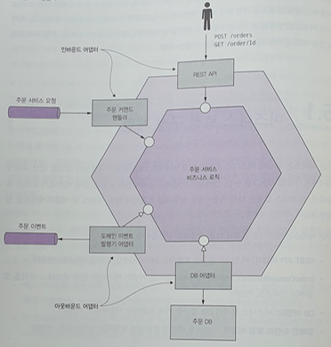
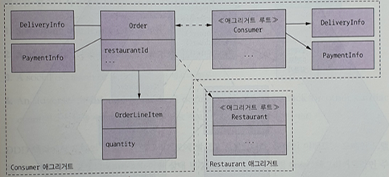
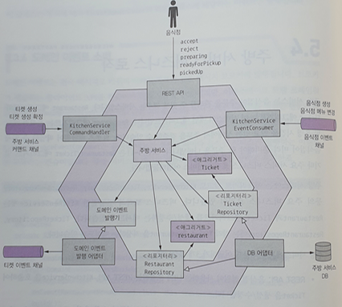
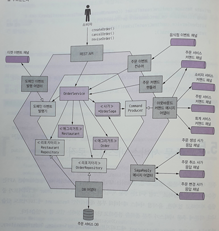
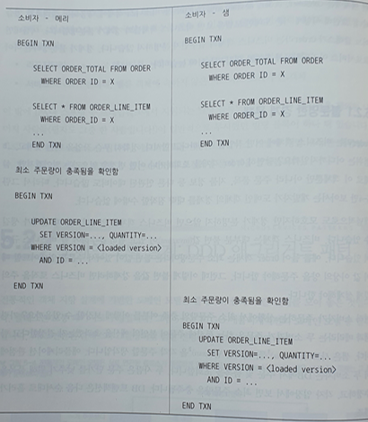
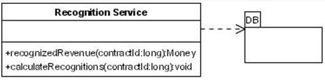

# 5장. 비즈니스 로직 설계

## 5.1 비즈니스 로직 구성 패턴
 * 비즈니스 로직 및 아댑터 구성
   1. REST API 어댑터 : 비즈니스 로직을 호출 하는 인바운드 아댑터
   2. OrderCommandHandlers : 커맨드 메시지를 받아 비즈니스 로직을 호출하는 인바운드 어댑터
   3. DB 어댑터 : 비즈니스 로직이 DB접근을 위해 호출하는 어댑터
   4. 도메인 이벤트 발생 어댑터 : 이벤트를 메시지 부로커에 발행하는 아웃바운드 어댑터
   
   
   
 * 비즈니스 로직을 구현 하는대 있어서 "절차적 트랜잭션 스크립트 패턴"과 "객체 지향적 도메인 모델 패턴" 두가지 패턴으로 구성 됨.
 * "객체 지향적 도메인 모델 패턴"은 절대 적인 것은 아니고, 비즈니스 규모 및 도메인 요건에 따라 "절차적 트랜잭션 스크립트 패턴"이 좋은 선택지가 될 수 있음.
 * 시스템의 복잡도가 올라가면서 "객체 지향적 도메인 모델 패턴"이 필요하게 됨.
 * "객체 지향적 도메인 모델 패턴"의 장점
   1. 설계를 이해/관리 하기 쉽다.
   2. 테스트가 쉽다.
   3. 알려진 패턴을 이용하여 확장 하기 쉽니다.
 * 도메인 주도 설계의 도메인 모델에서의 수행하는 역할과 클래스는 아래와 같다.
   1. entity : 영속적 신원을 가진 객체
   2. value object : 값을 모아 놓은 객체
   3. factory : 생성자를 리턴하는 추상화 패턴 
   4. repository : entity 를 저장하는 캡슐화 객체 
   5. service : entity, value 객체에 속하지 않는 비즈니스 로직 구현 객체.
## 5.2 도메인 모델 설계: DDD 애그리거트 패턴
 * 애그리거트 
   1. 애그리거트는 한 단위로 취급 가능한 경계 내부의 도메인 객체들의 집합. 
   2. 애그리거트내의 entity를 접근 할때는 애그리거트 루트를 통해 호출 되게 되며, 이로 인해 동시성 및 일관성이 해결 됨.
   3. DDD를 통해 애그리거트 식별 및 애그리거트 루트를 식혈 하는것이 중요함.
   4. 애그리거트 규칙
      1) 외부에서 애그리거트를 참조하려면 반듯이 애그리거트 루트만 참조.
      2) 애그리거트간 참조는 반듯이 기본키만 사용.
      3) 하나의 트랜잭션으로 하나의 애그리거트를 생성/수정.
   5. 애그리거트는 작을수록 좋지만, 트랜잭션을 위해 크제 잡아야 할 수도 있음.
    
    
    
## 5.3 도메인 이벤트 발행
 * 이벤트 발행 하는 이유
   1. 여러 서비스에 거쳐 데이터 일관성 유지
   2. 레플리카를 둔 서비스에 소스 데이트 변경 시점
   3. 등록된 webhook을 통해 다음 비즈니스 진행 하도록
   4. 같은 어플리케이션의 다른 컴포넌트에 알림
   5. 사용자에게 notification
   6. 모니터링
   7. 사용자 행동 모니터링 이벤트 분석
 * 도메인 이벤트 식별 3단계
   1. event brainstorming
   2. event trigger : 각 이벤트 별 트리거 식별
      1) 사용자 액션
      2) 외부 시스템
      3) 기타 도메인 이벤트
      4) 시간 경과
   3. 애그리거트 식별
 * 개념적으로 도메인 이벤트는 애그리거트가 발행 하고, 애그리거트는 자신의 생태가 변경되는 시점과 그결과가 어떤 이벤트를 발행 할 지 알고 있음.
 * 애그리거트와 호출하는 서비스는 책임 분리 하는것 권장.

## 5.4 주방 서비스 비즈니스 로직
 * inbound adapter
   1. REST-API
   2. KitchenServiceCommandHandler : 사가가 호출하는 비동기 요청/응답, Ticket 생성/수정
   3. KitchenServiceEventConsumer : 외부 서비스(RestaurantService)가 발생하는 이벤트 구독,Restaurant 생성/수정
 * outbound adapter
   1. DB 어댑터
   2. DomainEventPublishingAdapter : DomainEventPublisher I/F 구현
 
   
   
## 5.5 주문 서비스 비즈니스 로직
 * inbound adapter
   1. REST-API
   2. OrderEventConsumer : 외부 서비스(음식점)가 발생하는 이벤트 구독, OrderService 호출하여 Restaurant 레플리카 생성/수정
   3. OrderCommandHandler : 사가가 호출하는 비동기 요청/응답, OrderService 호출하여 Order 수정
   4. SagaReplyAdapter : 사가 응답 채널 구독 및 사가 호출
 * outbound adapter
   1. DB 어댑터
   2. DomainEventPublishingAdapter : DomainEventPublisher I/F 구현하여 Order 이벤트 발생
   3. OutboundCommandMessageAdapter : CommandPublisher I/F 구현하여 캐맨드 메시지를 사가 참여자에게 보냄.
 
   
## 5.6 마치며
 * 비지니스 복잡도에 따라 "절차적 트랜잭션 스크립트 패턴"과 "객체 지향적 도메인 모델 패턴" 선택.
 * 비지니스 로직은 애그리거트로 구성하는게 좋으며, ACID를 트랜잭션을 내부 서비스로 국한 시키는것 지향.
 *  애그리거트 도메인내 생성/수정시 이벤트 발생 함.
 
[Q&A]
1. 트랜잭션 스크립트 패턴, 도메인 모델 패턴 중 EER은 어디에 포함되는 걸까요? (p 200)
 - EER은 "트랜잭션 스크립트 패턴" 으로 보여 짐.
 
2. attic은 도메인 모델 패턴인가요? 도메인 클래스에 오퍼레이션이 없는것 같네요 (p 200)
 - 
 
3. 전략패턴, 템플릿메서드 패턴은 코드를 변경하지 않고 컴포넌트를 확장할 수 있다고 하는데 EER에서 어디에 적용할 수 있을까요? 예시 소개 (p 201)
 - 전략패턴 : 암호화
 - 템플릿메서드 : rest-api 의 servlet
 
4. 그림을 설명해주세요. (p 204)
 - "낙관적 오프라인 락"으로 설명 되고 있음.
   샘이 update 하기 전이 최소 주문수량이 충족하는지 확인후 update 함.
   낙관적 오프라인 락이기 때문에 조회후 update하기전 동시성 문제는 있음.

  
  
5. DDD 애그리거트 패턴이 나오는데 애그리거트, ccp, 모듈과의 관계는 어떤게 정의할 수 있을까요? (p 202)
 - P208 : 하나의 트랜잭션으로 오직 하나의 애그리거트만 생성/수정
   P237 : DDD 애그리커트는 도메인 모델을 모듈화 하고, 서비스 간 객체 참조 가능성을 배재하며, 전체 ACID 트랜잭션을 서비스 내부에 국한 시킴.
   변경 요소를 하나의 애그리거트로 묶는게 목적이며, 이것은 CCP의 개념과 비슷 볼 수 있다.

6. 3라인에 보면 애그리거트는 보통 DB에서 통째로 가져오기 때문에 복잡한 지연 로딩 문제를 신경쓸 필요가 없다는데.. 이게 무슨말인지? (p 206)
 - P208 : 하나의 트랜잭션으로 오직 하나의 애그리거트만 생성/수정
   연관 Data들이 하나의 애그리거트 안에서 있기 때문에, 연관 data를 한번에 가져 올 수 있음

7. Customer 애그리거트를 크게 잡으면 확장성이 떨어지는 단점이 있다는 말이 있는데.. 이게 무슨 뜻인지 설명해주세요. (p 209)
 - 커플링이 발생하여, 변경시 영향도가 높아짐

8. 웹훅의 의미를 설명해주시고 java에서 구현 시 어떤 방식으로 할 수 있을까요? (p 212)
 - hooking 이란 중간에 가로 채는 행위를 를 의미함.
   webserver등에서 hooking 하고 있다 특정 URL이오면 event 처리를 별도 할 수 있음
   음.. java에서 filler등이 가 webhook 이지 않을까 생각됨 (검색해도 자료가 별로 없음) 

9. 마커 인터페이스란 무엇인가? (p 213)
 - 자바에서 객체 직렬화는 Serializable 이라는 인터페이스를 implements 하면 됨. 그런데 이 인터페이스는 구현해야 할 메소드가 하나도 없음. 단지, 객체가 직렬화 대상임을 알려주는 일종의 마커(Marker) 역할을 함. 그래서 이렇게 메소드를 하나도 가지지 않는 인터페이스를 마커인터페이스(Marker Interface)라 하고, 태그(tag)인터페이스라고 부르기도 함.

10. 이벤트 강화(event enrichment) 기법이 무엇인가요? (p 214)
 - 이벤트안에 컨슈머가 필요한 data를 구체적으로 넣어 전달 하는 방법

11. 스프링 데이터 릴리스 잉갈스는 스프링 ApplicationContext에 이벤트를 자동 발행하는 장치를 제공한다고 하는데 스프링 데이타 릴리스 잉갈스에 대해 간단히 소개~ (p 218)
 - [spring data release ingalls](https://spring.io/blog/2017/01/30/what-s-new-in-spring-data-release-ingalls)

12. DDD는 OOD를 개선한 접근 방식이라고 설명되어있는데, OOD에 대한 설명과 어떤점이 개선되었는지 설명해주세요 (p 201)
 - 

13. 엔벨로프 객체에 대해 좀 더 설명해 주세요. (p212)
 - 

14. 예제 5-2 에서 컨슈머가 필요한 데이터를 주문생성 이벤트에 포함하는데, 컨슈머에서 주문 서비스의 정보(DeliveryInformation)를 어떻게 인식할 수 있나요? (p 214) 
 - message broker 를 통해 전달 받을 수 있음.

15. P of EAA 에서 설명하는 transaction script pattern 에 대해서, 그리고 기존 EER 기능 중 attic 에 구현한다고 할 때 적합한 기능은 어떤게 있을까요? (p 199)
 - "transaction script pattern"은 model1 에 해당 하는 구조로 하나의 코드 안에 로직이 모두 존재하며 DB도 직접 access 함.
  
 