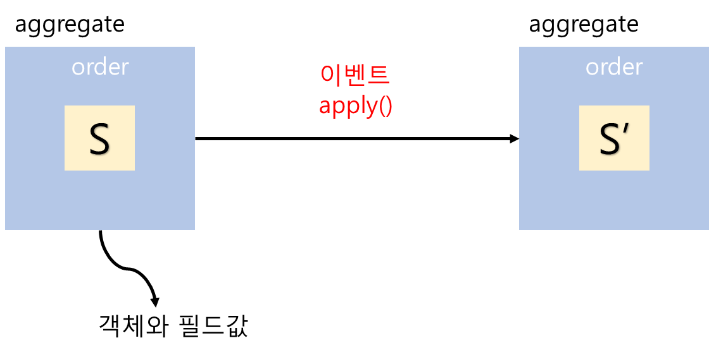

# 6장. 비즈니스 로직 개발: 이벤트 소싱

## 주요 내용
* 이벤트 소싱이란?
* Aggregate 구현
* 이벤트 저장소
* 스냅샷
* 이벤트 소싱의 장단점
* 사가와 이벤트 소싱 접목

## 1. 이벤트 소싱이란?
* 이벤트 소싱은 데이터 저장 방법에 대한 것이다.
* 이벤트 소싱은 비즈니스 로직을 구성하고, aggreagate를 저장함
* 각각의 이벤트는 aggregate의 상태 변화를 나타냄

    
    
    
    
* application은 이벤트를 replay하여 aggregate의 현재 상태를 생성함
    ```
    replay란? event store에서 기존 내역을 전달 받아 재수행하는 작업.
    1. aggregate의 이벤트를 로드
    2. 기본 생성자를 호출하여 aggregate 인스턴스 생성
    3. 이벤트 하나씩 순회하여 apply() 호출
    ```
* 이벤트 소싱에서는 이벤트를 outbox 테이블에 잠깐 저장했다가 지우는 것이 아니라 영구 저장함
  
## 2. Aggregate 구현
1. command handler : 변경될 필드를 apply를 이용하여 이벤트에 전달함. 이 때, aggregate의 상태는 아직 바뀌지 않음.
2. event handler : aggregate 상태를 update함
```
참고) axon framework Handler Annotation
- @CommandHandler : Aggregate에 대한 명령이 발생되었을 때 호출되는 메소드임을 알려주는 마커 역할
- @EventSourcingHandler : CommandHandler에서 발생한 이벤트를 적용하는 메소드임을 알려주는 마커 역할
- @EventHandler : Query 모델 혹은 이벤트 발생시 해당 이벤트를 적용하는 메소드임을 알려주는 마커 역할
```
axon framework를 이용한 aggregate 구현 예) 

* command 영역 (command 수행 및 event 저장)

    

* query 영역 (event를 수신받아 read model에 반영)

    


### 3. 이벤트 저장소
* 비즈니스 이벤트 흐름을 모두 저장함
* 이벤트 저장에 사용할 수 있는 저장소는 크게 세 가지로 분류된다.
    - 이벤트 저장에 특화된 데이터 저장소 사용 (https://eventstore.com/)
    - NoSQL 사용
    - 관계형 데이터베이스 사용
* event store table (axon server)


### 4. 스냅샷
- 현재 시점의 최종 데이터는 저장된 이벤트들을 재생하여 알아냈지만, 너무 많은 이벤트들이 발생했다면, 최종값을 얻기 위해 해당 이벤트들을 모두 재생하면 처리시간이 길어지므로, 스냅샷이란 개념이 도입됨.
- 이벤트가 발생할 때 스냅샷으로 저장하여 사용
- 스냅샷은 aggregate의 상태를 저장함.
- application에서 aggregate 최종 상태를 조회할 때, 가장 최근의 스냅샷과 그 이후의 이벤트만 가져와 aggregate의 최신 상태를 로드하는 방식임
 
- axon framework 에서는 Configuration 설정을 통해 Aggregate 별로 snapshot 설정이 가능함.
- 스냅샷 생성 시 payload 에 aggregate의 상태정보가 저장됨

### 5. 이벤트 소싱 장단점
- 이벤트 소싱 장점
    - 도메인 이벤트를 확실하게 발행함
    - 애그리거트 이력이 보존됨
    - 객체-관계형 임피던스 불일치 문제를 대부분 방지할 수 있음
    - 개발자에게 타임 머신을 제공함

- 이벤트 소싱 단점
    - 새로운 프로그래밍 모델을 배우는 데 시간이 걸림
    - 메시징 기반 애플리케이션은 복잡함
    - 이벤트를 개량하기가 까다로움
    - 데이터를 삭제하기가 어려움
    - 이벤트 저장소에서 쿼리로 데이터를 가져오기가 만만치 않음
    
### 6. 사가와 이벤트 소싱 접목
- 오케스트레이션 SAGA    
    
    

### 참고
- 이벤트 스토어 종류 및 설명 \
https://cla9.tistory.com/14?category=814447


### Q&A
1. 이벤트 소싱(event sourcing)과 이벤트 드리븐 아키텍처(event driven architecture)와 같은건가요? \
다릅니다. EDA는 분산 아키텍처 환경에서 상호 간 결합도를 낮추기 위해 비동기 방식으로 메시지를 전달하는 아키텍처 패턴이고, \
이벤트 소싱은 데이터를 저장하는 방법에 대한 것입니다. 데이터를 이벤트 단위로 저장합니다. 

2. 객체-관계 임피던스 부적합이 무슨 의미인지요? \
임피던스 불일치는 원래 불충분한 전력 흐름을 나타내는 전기공학 용어에서 차용한 말입니다. \
객체지향 애플리케이션들이 RDBMS에 있는 테이블을 결합하는 과정에서 성능이 떨어지는 현상을 통칭하는 말입니다. \
객체는 직접 호출을 사용하지만 RDBMS는 주키와 외부키를 사용하여 테이블간 조인을 통해 호출함 \
재사용의 최대화를 위해 객체는 캡슐화를 사용함. 따라서 관계형 데이터베이스로 매핑되면서 불필요한 호출이 발생함.


3. 폴드 또는 리듀스 작업이 무엇인가요? \
fold와 reduce는 컬렉션 타입의 데이터를 람다 함수에 차례로 전달한 후 람다 함수의 결과값을 반환해주는 함수입니다.
특징은 람다 함수에서 반환한 값을 기억하고 있다가 그 다음 데이터에 의해 호출될 때 이전에 반환했던 값을 함께 전달해주어 참조가 가능하도록 합니다. \
이벤트로 aggregate를 재구성할 경우 이벤트를 차례로 순회하며 apply() 를 호출하는 것과 동일한 방식이라 할 수 있습니다.


4. orderId만 포함된 아주 작은 OrderShippedEvent란 있을 수 없다는 말의 의미는? \
OrderShippedEvent에서 상태 변경만 일어난다면, orderId만 포함되면 안되고, orderId와 변경될 status가 모두 포함되어야 한다는 말 같습니다.

5. 낙관적 잠금을 사용하는 예시를 하나 들어주세요. \
낙관적 잠금은 레코드를 읽고 버전 번호를 기록하고 레코드를 다시 쓰기 전에 버전이 변경되지 않았는지 확인하는 전략입니다. \
예로는 소스코드관리시스템(SCM:source code management)를 들 수 있습니다.

6. NoSQL 이벤트 저장소는 트랜잭션 모델이 제한적인 이유는? \
서비스를 구현하는데 인덱싱과 트랜잭션이 필요하다. 현재 배포되어 있는 NoSQL들은 이와 같은 기능이 아예없거나 제한적인 것으로 확인됩니다. \
mongoDB 의 경우 multi document에 대한 transaction 기능이 추가되었지만, 단일 node에서는 transaction이 불가한 제약사항이 존재합니다.

7. rdbms 이벤트 저장소 사용시 events 테이블이 거대해지는 것이 문제가 되지 않을까요? 예) 누적데이타 1억건 이상 \
RDBMS 사용의 장점으로는 Transaction에 대한 지원 및 기술적 성숙도가 높다는 점입니다. 하지만, 가장 큰 문제점은 확장성입니다. \
대량을 데이터 처리보다는 데이터 공간 효율화 및 관계를 통한 데이터 정합성 보장 등에 초점이 맞춰져 있습니다. \
만약 DBMS가 오라클이라면 Hash 파티셔닝, reverse 인덱스, IOT(Index Organized Table) 등을 적절히 사용한다면 개선의 여지는 있습니다.

8. EER 혹은 attic에서 이벤트 소싱을 사용한다면 어디에 적용해 볼 수 있을까요? \
이벤트 소싱은 데이터 저장방법에 대한 것입니다. 순차적으로 발생하는 이벤트를 모두 저장합니다. \
예를 들어 eer에서 관리자가 상담 운영설정 변경 시 실수로 데이터를 잘못 변경했을 경우 변경 전 데이터를 알 수가 없습니다. \
이 때, 이벤트 소싱을 이용하면, 변경 전 데이터를 이벤트 로그를 통해 확인할 수 있습니다. \
또는 eer에서 ticket_status가 변경될 경우 최신 ticket_status 조회하는 t_ticket 테이블과 ticket_status 이력을 쌓는 t_ticket_process 테이블이 있는데,
ticket_status의 흐름을 이벤트소싱의 이벤트 흐름으로 표현될 수 있을 것 같습니다.
 
9. 스냅샷을 찍는다면, Event 에 찍는 것인데 기존 repository와 스냅샷 찍힌 시점과의 관계는 어떻게 될까요?
   (ex event N 번째 이후 만 바라본다고 하면, 실제 repository도 같이 백업 or 스냅샷이 찍혀야 의미가 있지 않을까?) \
aggregate의 현재 상태를 얻기 위해 모든 이벤트를 반복해서 재생하지 않고, 스냅샷을 두어 aggregate 최신상태를 빠르게 가져오는 방법입니다.
query repository 는 event 발생 시 저장하였다가(SEP방식), 사용자가 read 시 사용하는 repository 입니다. \
참고) https://cla9.tistory.com/15?category=814447

10. 그림 6-4 을 설명해 주세요. \
command 처리 시 aggregate 상태는 아직 변경되지 않은 상태이며, apply로 이벤트를 발생 후 aggregate가 변경됩니다.
 


11. 스냅샷 생성 방법 중 메멘토 패턴은 어떤 방식인가요? \
메멘토 패턴은 객체를 이전 상태로 되돌릴 수 있는 기능을 제공하는 소프트웨어 디자인 패턴입니다. \
메멘토 패턴은 오리지네이터(originator), 케어테이커(caretaker), 메멘토(memento) 3개의 객체로 구현됩니다. \
현재의 오브젝트의 상태를 기록하고 저장하는 메멘토 패턴은 프로그램에서 undo(실행취소), snapshot(현재상태저장) 등을 실행할 수 있습니다. \
참고) https://m.blog.naver.com/PostView.nhn?blogId=horajjan&logNo=220470142184&proxyReferer=https:%2F%2Fwww.google.com%2F

12. 업캐스터를 통한 업스캐일링는 어느 수준까지 가능할까요?

