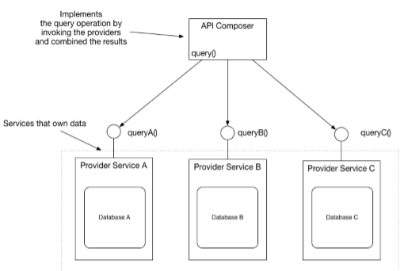
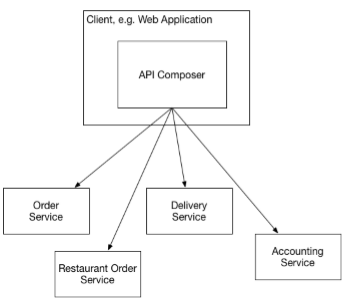
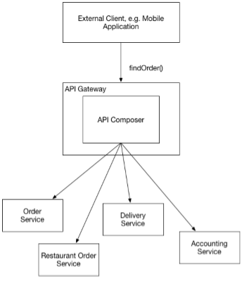
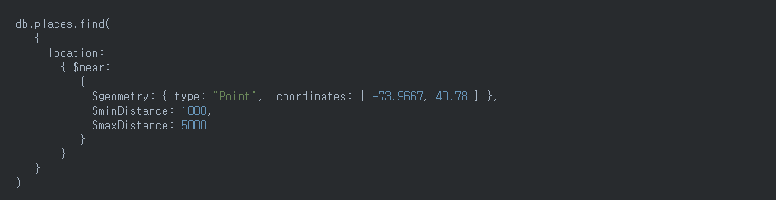
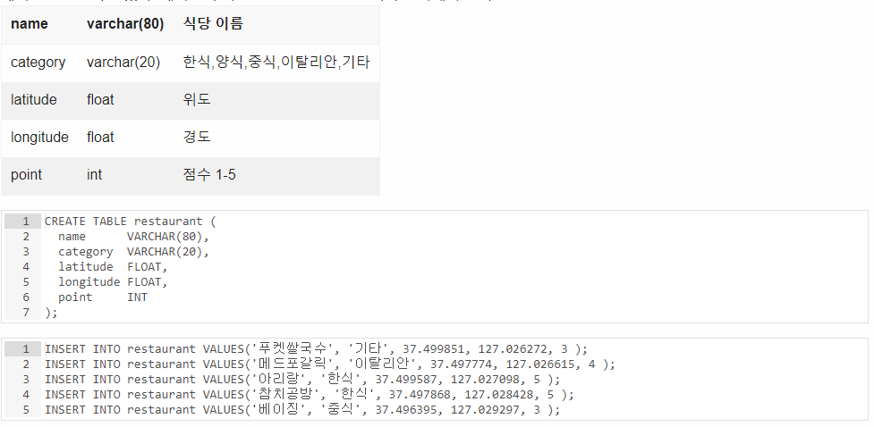
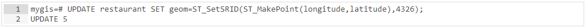
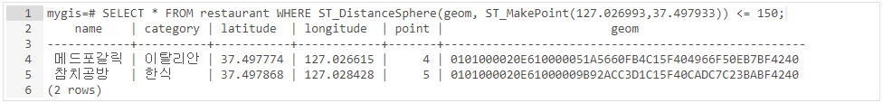
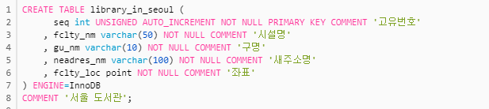
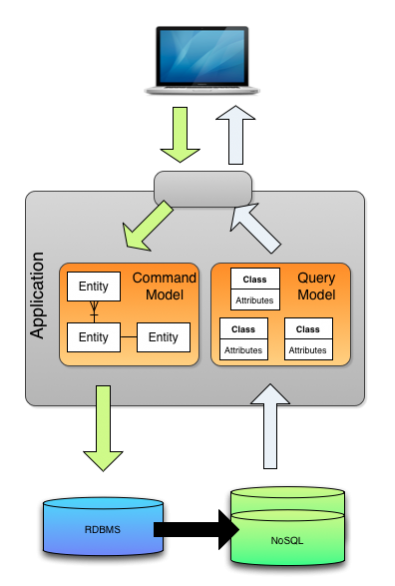

# 7장. 마이크로서비스 쿼리 구현

## 주요 내용
* 쿼리 구현 방법
* API 조합 패턴 응용 쿼리
* CQRS 패턴

## 1. 마이크로 서비스 아키텍처의 쿼리 구현
1. API 조합 패턴을 이용한 쿼리 구현 \
: 서비스 클라이언트가 데이터를 가진 여러 서비스를 직접 호출하여 그 결과를 조합하는 패턴. \
가장 단순한 방법으로 가급적 이 방법을 쓰는 것이 좋다고 합니다.
2. CQRS 패턴을 이용한 쿼리 구현 \
: 쿼리만 지원하는 하나 이상의 뷰 전용 db를 유지하는 패턴. \
구현하기 복잡하고 어려움.

## 2. API 조합 패턴 응용 쿼리
```
API 조합 패턴은 데이터를 가진 서비스를 호출한 후 그 반환값을 조합해서 가져온다.
```
ex) frontend module에서 호출되는 findOrder()는 다수의 서비스를 조합하여 주문 내역을 반환한다.


### 2.1. 개요
API 조합 패턴은 API 조합기와 provider service 두 종류의 참여자가 개입한다.
- API 조합기: provider service를 호출하여 데이터를 조회함.
- provider service: 최종 결과로 반환할 데이터의 일부를 갖고 있는 서비스

   
   
### 2.2. API 조합 설계 이슈
API 조합 패턴에는 다음 두 가지 설계 이슈가 있습니다.
```
- 누가 API 조합기 역할을 맡을 것인가?
- 어떻게 해야 효율적으로 취합 로직을 작성할 것인가?
```
첫 번째 "누가 API 조합기 역할을 맡을 것인가?"

API 조합기 역할을 결정할 때 세 가지 옵션이 있습니다.
1. 서비스 클라이언트를 API 조합기로 임명하는 것

    

2. API Gateway를 API 조합기로 임명하는 것

    
    
3. API 조합기를 StandAlone 서비스로 구현하는 것

    

두 번째 "어떻게 해야 효율적으로 취합 로직을 작성할 것인가?"
```
API 조합기는 리액티브 프로그래밍 모델을 사용해야 합니다.
```
- 각 서비스가 의존관계가 없을 경우 API 조합기가 provider service를 병렬 호출 해야 함
- 의존 관계일 경우 순차 호출을 해야함
- 두 개가 뒤섞인 실행로직은 복잡하여 Java의 CompletableFuture 또는 RxJAVA의 옵저버블 또는 추상체에 기반한 리액티브 설계 기법을 동원해야 합니다. (자세한 내용은 8장에서 설명)

## 3. CQRS 패턴
```
CQRS란? 커맨드와 쿼리의 책임을 분리하는 것이다.
여러 서비스에 있는 데이터를 가져오는 쿼리는 이벤트를 이용하여 해당 서비스의 데이터를 복제한 읽기 전용 뷰를 유지한다.
```
### 3.1. CQRS 개요
CQRS 패턴은  다음의 세 가지 문제를 해결할 수 있는 묘안입니다.
- API를 조합하여 여러 서비스에 흩어진 데이터를 조회하려면 값비싸고 비효율적인 인메모리 조인을 해야 합니다.
- 데이터를 가진 서비스는 필요한 쿼리를 효율적으로 지원하지 않는 형태로 데이터를 저장합니다.
- 관심사를 분리할 필요가 있다는 것은 데이터를 가진 서비스가 쿼리 작업을 구현할 장소로 적합하지 않다는 뜻입니다.
    
    

### 3.2. CQRS 뷰 설계
CQRS 뷰 모듈에는 하나 이상의 쿼리 작업으로 구성된 API 가 있습니다. \
이벤트핸들러를 통해 쿼리 DB를 최신상태로 유지시키고, 이를 쿼리 API가 조회합니다.


뷰 모듈을 개발할 때는 몇 가지 중요한 설계 결정을 해야합니다.
- DB를 선정하고 스키마를 설계해야 합니다.
    - SQL/NoSQL
- 데이터 접근 모듈을 설계할 때 멱등한/동시 업데이트 등 다양한 문제를 고려해야 합니다.
    - 뷰가 여러개의 Aggregate의 이벤트를 구독할 경우 동시성 처리 필요
    - 중복 이벤트 발생해도 결과가 정확히 동일하거나 중복을 솎아내서 실행해야 함
- 기존 애플리케이션에 새 뷰를 구현하거나 기존 스키마를 바꿀 경우, 뷰를 효율적으로 (재)빌드할 수 있는 수단을 강구해야 합니다.
    - 아카이빙된 이벤트, 스냅샷을 이용하여 뷰 구축
- 뷰 클라이언트에서 복제 시차를 어떻게 처리할지 결정해야 합니다.
    - 커맨드 쪽 작업이 클라이언트에 발행된 이벤트의 ID가 포함된 토큰을 반환하고, 클라이언트는 이 토큰을 쿼리 작업에 전달하면 해당 이벤트에 의해 뷰가 동기화되지 않았을 경우 에러를 반환

## Q&A

1. (290p) 서비스 클라이언트는 attic에서 어느부분을 말하는 것인가? \
 application ui, attic customer와 같은 상담사, 고객 web application을 말합니다.

2. (291p) 누가 api 조합기 역할을 맡을 것인가?에 대한 방법이 3가지 나오는데 어느 방법이 제일 좋은것 같은가? \
각각의 방법 중 장단점을 확인하고, 해당 시스템에 맞는 방법을 택해야 합니다.
프로바이더 서비스와 front-end client가 동일한 네트워크라면 front-end client가 API 조합기 역할을 하는 것이 좋을 것 같고,
API 서비스가 여러대의 application으로 구성될 경우에는 API 게이트웨이나 stand alone 서비스를 두어 client에서 호출 한 번으로 데이터를 조회할 수 있어 효율적입니다.

3. (292p) api 조합기에서 순차/병렬호출 중 어느방법을 사용해야 할까요? \
데이터 조합을 위해 호출하는 서비스들의 의존관계가 없을 경우에는 병렬호출을 사용하고,
서비스 호출 시 다른 서비스의 선행 호출이 필요하다면, 순차 호출을 사용하는 것이 맞습니다.
하지만, 두 가지 방식의 호출이 뒤섞일 경우 복잡해질수 있기 때문에, 자바의 CompletableFuture, RxJava의 옵저버블, 또는 리액티브 설계 기법을 동원해야 합니다. (8장에서 API 게이트웨이 패턴에서 자세히 설명)

4. (293p) 가용성 높이는 전략에서 프로바이더 서비스가 불능일 경우 이전 캐쉬를 반환하면 된다고 하는데 서비스가 불능은 아니지만 hang이 걸리는 경우(수초이상 대기)는 어떻게 해야 하는가? \
hang 상태로 유지되거나 connection이 idle 상태로 오랫동안 유지되는 경우 timeout 값을 주어 캐쉬를 반환하도록 하면 될 것 같습니다.
또한, API gateway의 Hystrix와 같은 circuit breaker를 두어 장애 전파를 막는 방법이 있습니다.

5. (297p) mongodb, postsql, mysql의 지리공간팩을 사용하는 예시를 보여주세요.
 - [mongodb]에서는 GeoJSON객체와 legacy coordinates pairs로 geospatial data를 저장할 수 있습니다. \
   ① 다음의 documents를 사용하여 places 라는 이름의 collection을 생성합니다.
    
    
    
   ② location 필드에 2dsphere index 를 생성합니다.
    
    
    
   ③ $near 연산자를 사용한 다음의 쿼리는 명시된 GeoJSON point로부터 1000미터 이상 5000미터 이하의 documents를 가장 가까운 것부터 가장 먼 순서로 정렬해 반환합니다.
    
    
    
    참고) https://grepper.tistory.com/7 \ ,  https://docs.mongodb.com/manual/geospatial-queries/
- [postgreSQL]에서는 PostgreSQL의 플러그인 PostGIS를 이용하여 PostgreSQL에서 공간 데이터를 관리, 처리 분석할 수 있습니다. \
   ① 테이블 생성 후 데이터 삽입
   
   
   
   ② geometry 필드 추가 후 위도, 경도 컬럼 데이터를 이용하여 geometry 필드 업데이트
   
   
   
   
   
   ③ 내가 있는 위치로부터 150m 이내에 있는 음식점을 찾는다.
   
   
   
   참고) https://www.joinc.co.kr/w/man/12/spatial
   
- [mysql]에서는 다음과 같이 사용합니다. \
   ① 테이블 생성 후 데이터 삽입
   
   
   
   ② ST_DISTANCE_SPHERE()를 사용하여 두 좌표 사이의 거리 구하기
   
   
   
   ③ 결과 (dist 저장됨)
   
   
   
   참고) https://purumae.tistory.com/198

6. (304p) 네이티브 모바일 앱이나 SPA같은 UI 애플리케이션은 쿼리하지 않고 커맨드가 성공하면 자신의 로컬 모델을 업데이트 하는 방법을 복제시차를 해소할 수 있다고 하는데 어떻게 할 수 있을지 설명 부탁. \
SPA는 데이터를 요청하고 브라우저에서 바로 페이지를 랜더링합니다. SPA는 로컬 스토리지를 캐시하여 커맨드 성공 시 스토리지에 저장된 데이터를 사용하여 복제시차를 해소할 수 있습니다.
(커맨드가 반환한 데이터로 로컬 모델을 업데이트함)

7. (307p) 비기본키 기반으로 업데이트 하기가 결과 쉽지 않다는데 왜 그런가요?

    
    
    NoSQL은 key-value 구조로 빠르게 데이터를 조회할 수 있는 반면에 단점으로 값 검색에 대한 한계가 있습니다. 키를 통해 값(key)을 검색하고 수정/삭제를 할 수 있으나, 값(value)을 기준으로 한 검색은 어렵습니다.
방법이 없는 것은 아니나(Riak 사용) 키를 기준으로 한 검색보다는 효율성이 떨어집니다. 

8. eer의 cs톡, 시나리오 등의 업무 중 cqrs를 적용해 볼만한 곳이 있을까요? \
router 배분에 적용해볼 수 있을 것 같습니다.
engine에서 배분요청 (command) => 라우터에서 배분 => router h2 db 변경 => engine db update (query)

9. (291p) API G/W를 조합기로 사용한다면, 서비스별로 분산 해놓고 API G/W에서 병목이 발생 하지 않을까요? 혹은 대안 아키텍쳐가 있지는 않을까요? \
API Gateway에 모든 API 호출이 일어나므로 API Gateway가 병목 지점이 되기 매우 쉽습니다.
이를 보완하기 위해 hystrix로 부하 전파 상황을 발견하고, 더 이상의 전파를 막아줄 수 있습니다.
리액티브 설계 기법을 사용하는 것도 방법일 수 있습니다. 
또는 API G/W를 여러대 두어 가용한 API G/W로 연결하여 처리할 수 있지 않을까요..?

10. (292p) 외부에서 접근 가능한 쿼리 작업 구현의 구체적인 예시를 알려주세요. \
proxy에서 restAPI 호출하여 데이터를 가져오는 경우를 말할 수 있습니다.
(proxy는 고객사 홈페이지 was에 설치되고, restapi 는 다른 서버로 구성될 때)

11. (304p) "CQRS가 꼭 필요한 경우"란 어떤 경우 일까요? \
Application 의 비즈니스 로직은 대부분 데이터 변경(C,U,D) 작업에서 처리되고, 데이터 조회(R) 작업은 단순 데이터 조회가 대부분입니다.
이 두 업무를 동일한 Domain Model로 처리하게 되면 각 업무 영역에 필요하지 않은 Domain 속성들로 인해 복잡도가 증가할 수 있습니다.
이런 복잡한 도메인 모델을 command model과 query model 로 분리로 이를 해결하는 패턴이 CQRS 입니다.
이렇게 분리된 model은 각각의 도메인만 모델링하여 훨씬 단순하게 구현/적용될 수 있습니다.
따라서 복잡한 도메인 모델일 경우 CQRS 가 필요하다고 생각됩니다.
다음은 CQRS적용 구조 입니다.

    

    
    
12. CQRS 대상으로 삼는 기준을 정할 수 있을까요? 그렇지 않다면 남용하게 될 우려는 없을까요? \
복잡한 도메인 모델이 CQRS의 대상이 됩니다. \
데이터 변경과 데이터 조회 업무가 동일한 Domain Model로 처리하게 되면서 도메인의 복잡도가 높아질 경우 CQRS 고려대상이 됩니다.

13. CQRS 와 API 조합 패턴을 함께 사용할 수도 있을까요? \
CQRS와 API 조합 패턴은 쿼리를 구현하기 위한 방법입니다. \
두 개의 방법은 클라이언트 요청에 따라 적절하게 사용해도 될 것 같지만, 컴포넌트 별로는 하나씩만 선택해서 구현하는게 좋을 것 같습니다.

14. (310p) CQRS 뷰 추가, 갱신 방법은 이벤트 소싱과 어떤 관련이 있나요? \
클라이언트에서 서비스를 호출하여 CUD할 경우(데이터 조작이 있을 경우) query DB에 동기화 시켜주기 위하여 이벤트 소싱이 사용됩니다. \
이벤트 소싱으로 이벤트를 발행시키고, CQRS 뷰의 이벤트핸들러가 query DB를 업데이트 시킵니다. \
CQRS에서 이벤트소싱은 필수가 아닙니다. \
단일 디비를 사용할 경우에는 필요 없고, query DB가 따로 있을 경우 메세지 브로커를 통해서도 데이터를 동기화시킬 수 있습니다.