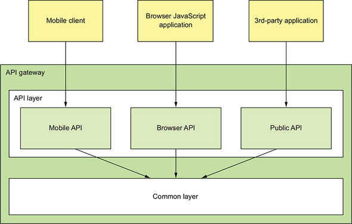
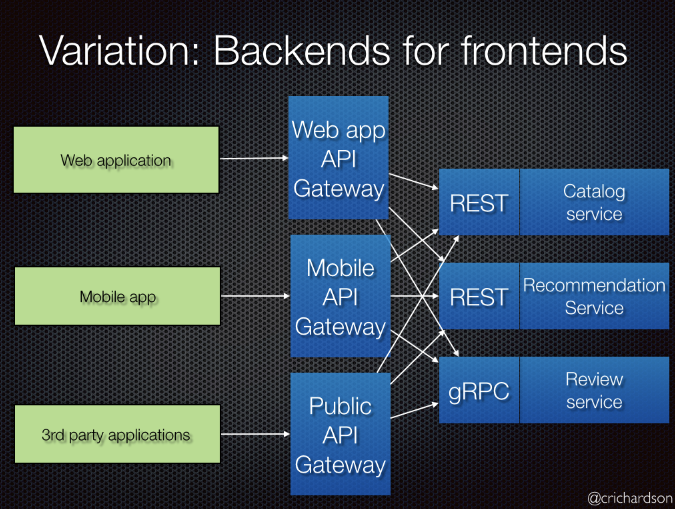
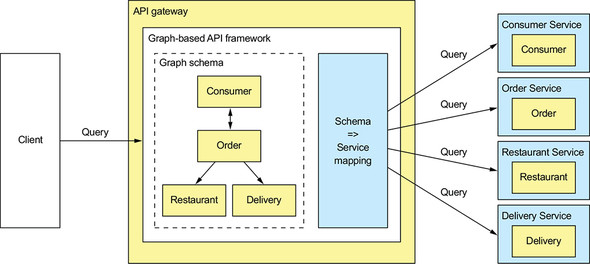

# 8. 외부 API 패턴

## 8.1 외부 API 설계 이슈

### 1. API 설계 이슈: FTGO 모바일 클라이언트

FTGO 모바일 앱과 같이 방화벽 외부의 클라이언트에서 직접 개별 서비스 호출하여 주문 조회 뷰를 개발할 경우,

- 클라이언트가 요청을 여러번 요청하기 때문에 UX 가 나빠진다
- 캡슐화가 되지 않아 frontend 개발자가 backend 와 맞물려 코드를 변경해야 한다
  - API 정보가 클라이언트에 있으면 변경이 어렵다.
- 클라이언트에 비친화적인 IPC 를 사용 중인 클라이언트도 있다.
  - gRPC, AMQP 등 메시징 프로토콜, 혹은 방화벽 문제가 있는 프로토콜 등.

### 2. API 설계 이슈: 다른 종류의 클라이언트

- 웹 어플리케이션: 직접 백엔드 서비스 접근 가능.
- 브라우저 기반 자바스크립트 어플리케이션: 모바일 앱보다 많은 서비스 조합 필요, 서비스 API 의 효율적 조합 어려움.
- 서드파티 어플리케이션: 하위 호환성 유지 문제 → 퍼블릭 API 제공 필요.

## 8.2 API 게이트웨이 패턴

> https://microservices.io/patterns/apigateway.html

### 1. 개요

- API gateway: 방화벽 외부의 클라이언트가 API 요청의 단일 창구 역할을 하는 서비스.
  - facade pattern 과 유사
  - 내부 어플리케이션 아키텍처를 캡슐화하고 클라이언트에 API 제공
  - 인증, 모니터링, 사용량 제한 등

- 주요 기능:

  - 요청 라우팅: routing map 을 통해 서비스 요청 매핑.
  - API 조합: 단일 요청으로 필요한 데이터 조회할 수 있도록 대단위(coarse-grained) API 제공.
  - 프로토콜 변환
  - 클라이언트마다 적합한 API 를 제공
  - 엣지 기능(edge function) 구현
    - 엣지 기능: 인증, 인가, 사용량 제한, 캐싱, 지표 수집, 요청 로깅
    - 구현: API 게이트웨이가 여러 개인 경우 전용 엣지 서비스가 유효하지만, 네트워크 홉(hop) 이 증가로 네트워크 지연, 어플리케이션 복잡도 증가할 수 있다. → 전용 엣지 서비스 + 인증 기능은 API 기능에서 구현하여 hop 줄이도록.

- API 게이트웨이 아키텍처

  - API 계층 + 공통 계층
  - API 계층: 독립적인 하나 이상의 API 모듈 포함. 각 모듈에는 특정 클라이언트용 API 구현. 
  - 공통 계층: 엣지 기능 등 공통 기능 구현.

  

  - API 모듈의 API 작업 구현 방법
    - 서비스 API 하나에 직접 매핑되는 API 작업은 해당 서비스 API 로 요청 전송
    - API 조합은 사용자 정의 코드로 구현

- API 게이트웨이 소유권(ownership) 모델: 개발/운영 누가 담당할 것인가.

  - 전담팀 신설: 병목이 될 수 있다. 
  - 해당 클라이언트 팀이 소유(모바일, 웹, 퍼블릭 API 등)하고, API 게이트웨이 팀은 공통 모듈 개발과 운영 이슈에 집중

- Backend for frontend pattern

  - 소유권을 분리하게 되면 책임 소재가 불분명해진다 → BFF 패턴: 각 클라이언트마다 개별 API 게이트웨이.
  - 공통 기능 코드 중복 문제가 발생할 수 있으므로 동일한 기술스택을 사용하는 것이 좋다.

  

  - 장점: 
    - API 모듈 격리로 신뢰성 향상
    - 관측성(observability) 향상: 다른 API 모듈은 다른 프로세스이므로.
    - 독립적으로 확장 가능
    - 기동시간 단축: 어플리케이션이 더 작고, 심플해지므로.

### 2. 장단점

- 장점
  - 어플리케이션 내부 구조를 캡슐화
  - 클라이언트마다 최적의(client-specific) API 를 제공하므로 클라이언트-어플리케이션 간 왕복(round-trip) 횟수 줄이고 클라이언트 코드를 단순하게 함.
- 단점
  - 개발, 배포, 관리되어야 하는 고가용 컴포넌트 늘어남
  - 개발 병목 지점이 될 수 있다
  - → BFF 로 보완

### 3. API 게이트웨이 사례: 넷플릭스

> https://www.programmableweb.com/news/why-rest-keeps-me-night/2012/05/15
>
> https://netflixtechblog.com/embracing-the-differences-inside-the-netflix-api-redesign-15fd8b3dc49d

- 넷플릭스는 수백종(위 글은 800종 이상)의 장치에 스트리밍 서비스를 제공한다.
- 초기 만능(OSF, one-size-fits-all) 스타일의 API 로 제공하려고 했지만, 워낙 광범위하고 개별 요구사항도 다르므로 한계에 도달.
- 현재 기기별 API 가 따로 구현된 API 게이트웨이 사용하며, API 구현 코드의 소유/개발을 클라언트 기기 팀이 담당한다.
- Node.js, Falcor 등을 이용하여 API 모듈을 분리 → 신뢰성/관측성 향상, 클라이언트 API 모듈은 독립적으로 확장 가능.

### 4. API 게이트웨이 설계 이슈

- 성능과 확장성

  - 동기 I/O 모델: 네트워크 접속 당 스레드 배정.

    - 자바 EE 서블릿 프레임워크. 
    - 무거운 OS 스레드를 사용하여 개수 제약이 있으므로 동시 접속 가능 개수 제한적.
    - 간단, 잘 동작함

  - 비동기(non-blocking) I/O 모델: 단일 이벤트 루프 스레드(single event loop thread) 가 I/O 요청을 각 이벤트 핸들러로 디스패치. 

    - Netty, Vertx, JBoss Undertow 등 NIO 기반 프레임워크과 Node.js
    - 다중 스레드 사용 오버헤드가 없으므로 확장성 좋음
    - 구현이 복잡하고 어려움

  - API 게이트웨이 요청 처리 로직의 성격에 따라 결과가 다를 수 있다: e.g. Netflix Zuul 사례 (I/O 집약적 로직에 효과적)

    > https://netflixtechblog.com/zuul-2-the-netflix-journey-to-asynchronous-non-blocking-systems-45947377fb5c

- 리액티브 프로그래밍 추상체를 이용하여 관리 가능한 코드 작성

  - API 조합 코드를 비동기 콜백 방식으로 작성할 경우 callback hell 로 가독성과 순차/병렬 요청이 혼합된 경우 문제 발생 가능하다.
  - 리액티브 추상체를 활용하여 이해하기 쉽고 단순한 동시성 코드를 작성하는 것이 좋다.
    - Java8 CompletableFutures, Project Reactor Mono, RxJava 의 observable, Scala Future, Node.js 의  promise 와 RxJS

- 부분 실패 처리

  - 부하분산기에 의한 요청 처리
  - Circuit breaker pattern 적용

- 어플리케이션 아키텍처에서 선량한 시민(good citizen) 되기

  - 서비스 디스커버리 패턴으로 서비스 위치 파악
  - 관측성 패턴(observability pattern) 을 활용하여 모니터링하고 진단
  - 아키텍처에 알맞게 선정된 패턴으로 구현한다

## 8.3 API 게이트웨이 구현

### 1. 기성(off-the-shelf) API 게이트웨이 제품/서비스 활용

- AWS API 게이트웨이
- AWS 애플리케이션 부하 분산기(ALB, Application Load Balancer)
- Kong https://konghq.com/
- Traefik https://containo.us/traefik/

### 2. API 게이트웨이 자체 개발

- 프레임워크 검토 사항:
  - 코딩 복잡도를 최소화할 수 있는 라우팅 규칙 정의 매커니즘을 구현
  - HTTP 헤더 처리 등 HTTP 프록시 로직을 정확히 구현
-  Netflix Zuul https://github.com/Netflix/zuul
  - 라우팅, 사용량 제한, 인증 등 엣지 기능
  - Spring cloud zuul 을 사용하여 구성보다 관습(convention over configuration) 방식으로 개발이 용이.
  - 단점: 경로 기반 라우팅만 지원
- Spring Cloud Gateway https://spring.io/projects/spring-cloud-gateway
  - 요청을 백엔드 서비스로 라우팅, API 조합 요청 핸들러 역할, 인증 등 엣지 기능 처리 제공

### 3. API 게이트웨이 구현: GraphQL

- 그래프 기반 스키마로 서버 API 구성

- 장점
  - 클라이언트가 반환 데이터 제어 → 유연한 단일 API 개발 가능
  - 개발 수고를 덜 수 있다 - 쿼리 실행 프레임워크로 작성하기 때문.

------------

# Q&A

#### 1. 퍼사드 패턴을 소개해주세요. p.331

- 건물의 정면을 뜻하는 facade pattern 은 내부의 복잡한 서브 시스템에 대해 인터페이스를 제공하여 접근하게 한다.
- 요청 클라이언트로부터 내부 클래스의 캡슐화

> https://refactoring.guru/design-patterns/facade

#### 2. api 조합방식을 api 게이트웨이에서 하는 것이 좋은 방식일까요? (장단점) p.332

7번 답변과 중복.

#### 3. 넷플릭스 팔코(netflix falcor)에 대해 간단히 설명해주세요. p.340

효율적으로 데이터를 가져오기 위한 Javascript library.

graphQL 과 같이 단일 데이터 모델로 한번에 필요한 데이터를 받도록 할 수 있다.

JSON graph 를 이용해 중복을 제거.

> https://netflix.github.io/falcor/
>
> https://devcoding.tistory.com/28

#### 4. netflix zuul은 논블로킹 I/O를 사용하는 건가요? p.341

- zuul 2 부터 non-blocking 을 사용합니다.

> https://netflixtechblog.com/zuul-2-the-netflix-journey-to-asynchronous-non-blocking-systems-45947377fb5c

#### 5. spring cloud zuul/zuul2와 spring cloud gateway의 다른 점이 뭐가 있을까요?

가장 큰 차이는 spring cloud zuul 은 동기, zuul2 와 spring cloud gateway 는 비동기.

spring cloud gateway 는 spring 5, spring boot 2, project reactor 지원.

> https://velog.io/@tlatldms/서버개발캠프-MSA-아키텍쳐의-API-Gateway-프레임워크-결정

#### 6. "하위 호환성"을 관리 할 수 있는 아키텍쳐가 있을까요? p.330

3장에서 나온 SemVer 로 API 버저닝. 

API 의 경우 REST url 에 버전을 추가하거나 헤더에 버전 정보를 포함하는 방식. 서비스 배포툴을 이용하는 방법. kubernetes 등과 같은 툴을 활용한다거나..

#### 7. API G/W를 조합기로 사용한다면, 서비스별로 분산 해놓고 API G/W에서 병목이 발생 하지 않을까요? 혹은 대안 아키텍쳐가 있지는 않을까요? (7장 중복 질문 날짜가 다르니 해결이 되었다면 pass) p.332

API Composition Layer 위치

 1) API Gateway 앞

- Wrapper 형태로 Gateway 앞에 위치해서 Gateway 단을 전혀 건드리지 않지만, Composition Layer가 Consumer의 End Point가 되면서 모든 트래픽을 부담해야 합니다.

- Composition Layer와 Gateway 간의 Latency를 최소화해야 합니다.

- Composition Layer가 필요하지 않아도 무조건 통과해야 합니다.

 2) API Gateway 내부

- Gateway 내부에서 동작함으로 Network Hop이 존재하지 않습니다.

- Gateway 구현이 복잡해지고, Composition Layer 때문에 성능에 영향을 줄 수도 있습니다.

- 로직 변경이나 확장이 필요할 때, Gateway 재시작이 필요할 수도 있습니다.

 3) API Gateway 뒤

- Gateway는 아무것도 하지 않아도 되기때문에 도입하기 가장 쉽습니다.

- Composition Layer가 API Provider가 되는거나 마찬가지라고 할 수 있습니다.

- Composition Layer를 위한 End Point를 API Provider가 제공해야 할 수도 있습니다.

> https://ohjongsung.io/2018/09/25/rest-api를-얼마나-나누고-묶을까-rest-api-granularity

#### 8. 스탠드얼론 API G/W 를 사용하게되면 API 조합이 필요한 어플리케이션은 어떻게 되는건가요? p.338

7번 답변에 포함.

#### 9. 모바일 API, 브라우저 API, 퍼블릭 API 각각의 예시를 들어주세요. p.336

실제 서비스의 예제를 찾기 힘드네요. 

> https://medium.com/@giljae/다양한-장치를-지원하는-rest-api에-대해-고찰-e431070a6324

