# 12장. 마이크로서비스 배포

## 주요내용
- 프로덕션 환경 구성
- 서비스 배포
- 쿠버네티스

## 프로덕션 환경

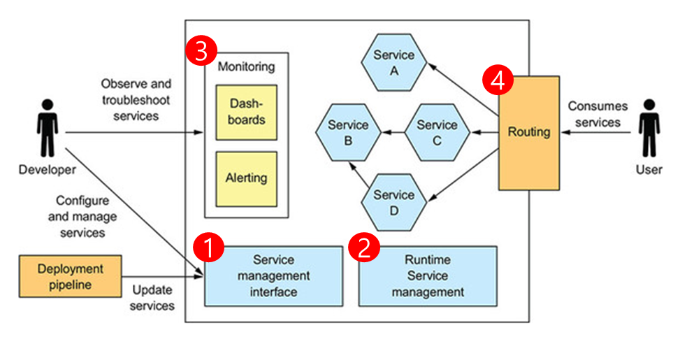
1. 서비스 관리 인터페이스 \
: 개발자가 서비스를 생성, 수정, 구성 할 수 있는 인터페이스를 제공
2. 런타임 서비스 관리 \
: 서비스 인스턴스가 항상 적정한 개수만큼 실행되도록 함. 서비스 인스턴스가 깨지면, 프로덕션 환경은 해당 인스턴스를 재시동해야 함
3. 모니터링 \
: 서비스가 무슨일을 하고 있는지, 로그 파일 및 지표를 개발자가 관찰 할 수 있게 함. 프로덕션 환경에 문제가 있으면 개발자에게 알림 역할
4. 요청 라우팅 \
: 사용자 요청을 서비스로 보냄.


## 서비스 배포
```
- 언어에 특정한 패키지로 서비스를 배포
- 서비스를 가상 머신으로 배포
- 서비스를 컨테이너로 배포
- 서비스를 서버리스 배포 기술로 배포
```

### 언어에 특정한 패키징(JAR/WAR 파일) 포맷 패턴
: 프로덕션에 배포할 코드와 필요한 런타임을 모두 언어에 특정한 패키지에 넣고 배포하는 것. 서비스 인스턴스는 개별 JVM 프로세스로 실행됨.

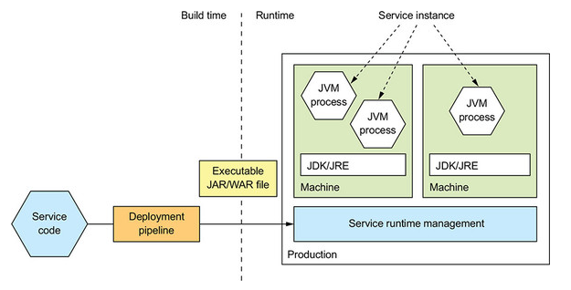

- 장점
    - 배포가 빠르다.
    - 리소스를 효율적으로 활용할 수 있다.
  
- 단점
    - 기술 스택을 캡슐화할 수 없다.
    - 서비스 인스턴스가 소비하는 리소스를 제한할 방법이 없다.
    - 여러 서비스 인스턴스가 동일 머신에서 실행될 경우 서로 격리할 수 없다.
    - 서비스 인스턴스를 어디에 둘지 자동으로 결정하기 어렵다.

### 가상 머신 패턴
: 서비스를 가상 머신 이미지로 묶어 배포하는 방식. \
서비스를 VM  이미지로 묶어 프로덕션에 배포한다. 각 서비스 인스턴스가 하나의 VM 이다.

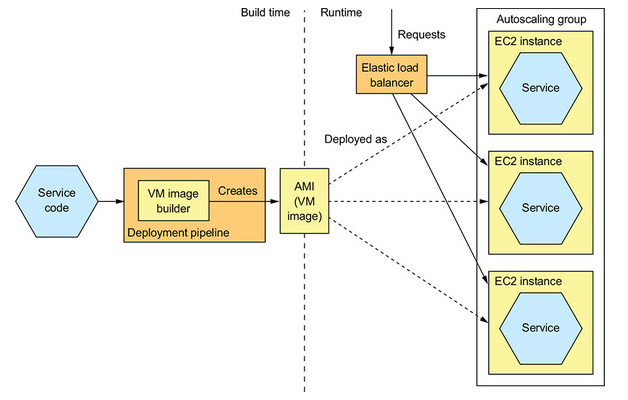

- 장점
    - VM 이미지로 기술 스택을 캡슐화 함
    - 서비스 인스턴스가 격리됨
    - 성숙한 클라우드 인프라를 활용함
    
- 단점
    - 리소스를 효율적으로 활용할 수 없음
    - 배포가 비교적 느림
    - 시스템 관리 오버헤드가 발생함

### 컨테이너 패턴
: VM 장점은 유지한 채 더 가볍게 마이크로서비스를 배포하는 방법. \
서비스를 컨테이너 이미지로 묶어 프로덕션에 배포한다. 각 서비스 인스턴스가 곧 하나의 컨테이너이다. \
이 책에서는 도커로 배포하는 방법 설명

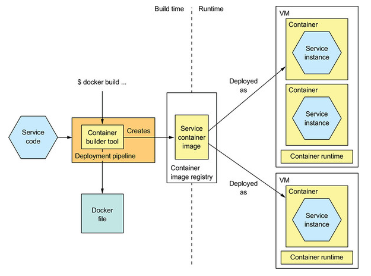

- 장점
    - 기술 스택의 캡슐화
    - 서비스 인스턴스 격리
    - 서비스 인스턴스의 리소스 제한
    - VM 보다 가벼운 기술, 컨테이너 이미지 빌드가 빠름
    
- 단점
    - 컨테이너 이미지를 직접 관리해야 하는 부담이 있음.
    - OS와 런타임 패치도 정기적으로 해주어야 함.


참고) VM과 컨테이너의 차이

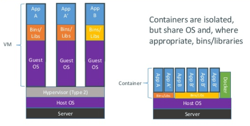

- VM
    - VM은 컴퓨터 환경을 가상화하여 소프트웨어로 구현한 것
- Container
    - Container는 VM에 비교했을 때 한 층 더 애플리케이션 중심으로 설계됨.
    - Container는 별도의 OS나 드라이버 없이 Host OS를 공유하는 형태로 실행됨.
    
### 서버리스 패턴
퍼블릭 클라우드에서 제공하는 서버리스 배포 메커니즘을 이용하여 서비스를 배포한다. \
책에서는 AWS 람다를 예시로 들었고, AWS 람다를 사용하면 개발자는 서버, 가상 머신, 컨테이너 관련 부분은 신경쓰지 않아도 된다.

## 쿠버네티스
컨테이너를 쉽고 빠르게 배포/확장하고 관리를 자동화해주는 오픈소스 플랫폼이다.

- 쿠버네티스 개요
    - 리소스 관리: 여러 머신을 CPU, 메모리, 스토리지 볼륨을 묶어 놓은 하나의 리소스 풀로 취급
    - 스케줄링: 컨테이너를 실행할 머신을 선택
    - 서비스 관리: 마이크로서비스에 직접 매핑되는 서비스를 명명하고 버저닝함

- 쿠버네티스 아키텍처
    - 쿠버네티스는 전체 클러스터를 관리하는 마스터와 컨테이너가 배포되는 노드로 구성되어 있습니다.모든 명령은 API 서버를 호출하고 노드는 마스터와 통신하면서 필요한 작업을 수행합니다.
    - API 서버: kubectl CLI에서 사용하는 서비스 배포/관리용 REST API
    - etcd: 클러스터 데이터를 저장하는 키-값 NoSQL DB
    - 스케줄러: 노드가 배정되지 않은 새로 생성된 pod를 감지하고, 실행할 노드를 선택한다.
    - 컨트롤러 매니저: 노드가 다운되었을 때 통지와 대응에 관한 책임을 가진다.
    - 큐블릿: 노드에 할당된 pod의 생명주기를 관리함. pod를 생성하고 pod 안의 컨테이너에 이상이 없는지 확인하면서 주기적으로 마스터에 상태를 전달 함
    - 큐브 프록시: 큐블릿이 pod를 관리한다면 프록시는 pod로 연결되는 네트워크를 관리함.
    
    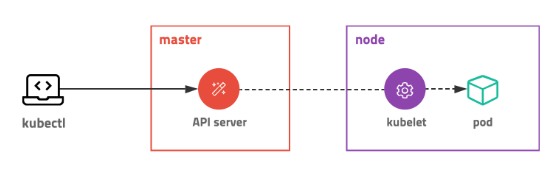
    
    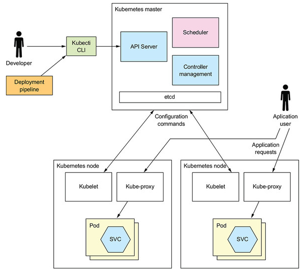
    
- 쿠버네티스 핵심 개념
    - 쿠버네티스의 핵심은 상태이며 쿠버네티스를 사용하려면 어떤 상태가 있고 어떻게 상태를 선언하는지 알아야 함
    - 쿠버네티스는 상태를 관리하기 위한 대상을 오브젝트로 정의함
    - 파드: 쿠버네티스에서 배포할 수 있는 가장 작은 단위로 컨테이너와 스토리지, 네트워크 속성을 가집니다.
    
        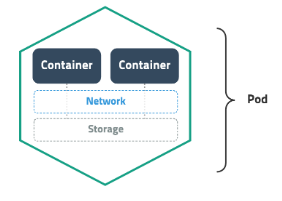
        
    - ReplicaSet: pod를 여러 개 복제하여 관리하는 오브젝트입니다. pod를 생성하고 개수를 유지하려면 반드시 ReplicaSet을 사용합니다. ReplicaSet 명세를 yml 파일로 정의합니다.
    
        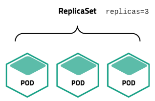
    
    - 서비스: 네트워크와 관련된 오브젝트입니다. pod를 외부 네트워크와 연결해주고 여러 개의 pod를 바라보는 내부 로드밸런서를 생성할 때 사용합니다.
    - volume: 저장소와 관련된 오브젝트 입니다. 
    
- 쿠버네티스 배포 방식
    - 쿠버네티스는 Deployment, StatefulSets, DaomonSet, Job, CronJob 등 다양한 배포방식을 지원합니다.
    - Deployment: 새로운 버전의 애플리케이션을 다양한 전략으로 무중단 배포할 수 있습니다.
    - StatefulSets: 실행 순서를 보장하고 호스트 이름과 볼륨을 일정하게 사용할 수 있어 순서나 데이터가 중요한 경우에 사용할 수 있습니다.
    - DaemonSet: 로그나 모니터링 등 모든 노드에 설치가 필요한 경우에 사용합니다.
    - Job, CronJob: 배치성 작업에 이용합니다.

- 하나의 pod가 생성되는 과정
        
    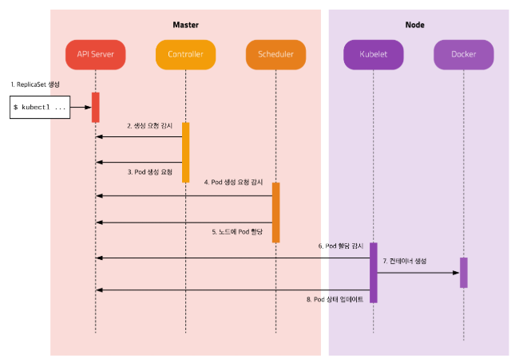

    
## 참고
- https://subicura.com/2019/05/19/kubernetes-basic-1.html

## Q&A
1. (485p) 그림 12-5처럼 1개의 스프링부트에서 여러개의 서비스 인스턴스로 띄우는 방법이 가능한가요? \
=> 네. 가능합니다. 

    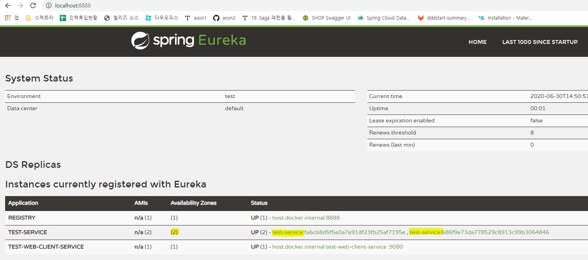

2. (487p) 아마존 EC2에서 서비스를 운영한다면 AMI로 배포하는 것과 docker로 배포하는 것 중 어느방법이 좋을까요? \
=> AMI 보다 Docker container Image로 배포하는 것이 좋은 방법인 것 같습니다. AWI는 OS까지 포함된 이미지고, 
docker는 OS가 포함되지 않고 관련 라이브러리와 서비스만으로 구성된 이미지입니다. \
각각 장단점이 있을 수 있겠지만, 이미지 빌드 시간과 리소스 효율적으로 활용할 수 있기 때문에 docker 배포가 좋아보입니다.

3. attic을 사이트에 배포할때 어느 방식이 좋을까요? (패키징 포맷, 가상머신, 컨테이너 패턴) \
(금융권, aws, 일본, 그 외) \
=> 컨테이너 패턴이 좋을 것 같습니다. 2번에서 말했듯 가상머신보다 배포가 빠르고, 리소스를 효율적으로 활용할 수 있습니다. \
OS와 런타임 패치만 잘 이루어진다면, 가볍고 각각의 서비스에만 집중할 수 있으니 좋을 듯 합니다.

4. (490~497p) 가상머신 패턴의 단점중 "리소스 효율적 활용, 시스템 관리 오버해드" 가 있는데 컨테이너 패턴의 단점으로 지목되어 있지 않아 이를 해소 할수 있어 보입니다. 
"컨테이너 패턴"은 "가상머신 패턴"의 단점 해결 방안은 어떤것들이 있을까요? 아니면 다른 패턴으로 해결하는 걸까요? \
=> 컨테이너 패턴은 OS를 제외한 관련 라이브러리와 서비스만으로 구성된 이미지를 배포합니다. \
따라서 각 컨테이너가 OS를 공유하므로 리소스를 효율적으로 활용할 수 있습니다.\
시스템 관리 오버헤드는 컨테이너 패턴에서도 해결되지 않습니다. 공유하는 OS, 런타임을 관리해야하며, 이는 서버리스 패턴으로 해소할 수 있습니다.

5. (518p) 조금 이상한 질문 일수 있겠는데.... "서버리스 패턴"은 배포 파일을 AWS에 올리고 배포되면 사용하는 리소스 만큰 "돈"을 내고 서비스를 이용하면 된다는건데 이것을 패턴이라 지칭 할 수 있는걸 까요? 사람과 장비를 "돈"을 내고 구입/고용 하는거랑 무슨 차이가 있을까요? "특정 유료 서비스가 패턴으로 지칭 할 수 가 있는걸까요?" \
=> 책에서는 AWS 람다를 이용한 서버리스 패턴을 예로 들었고, 서버리스 패턴은 주요 퍼블릭 클라우드는 모두 제공합니다. \
제 생각엔 패턴이라기 보다는 시스템 관리를 하지 않아도 된다는 솔루션인 것 같고, 책에서는 서비스를 배포하는 방법에 대한 것을 패턴으로 설명한 것 같습니다.

6. MSA 로 고객사 인프라에 구축할 경우, 운영 부담을 줄이기 위해 어떤 것이 가장 필요할까요? \
=> 업무를 분리하여 전문성을 키우는 것이 제일 중요할 것 같습니다. 모든 인프라를 알기는 어렵고, docker, OS, runtime 등에 대한 업무 분리가 필요할 듯 합니다. 