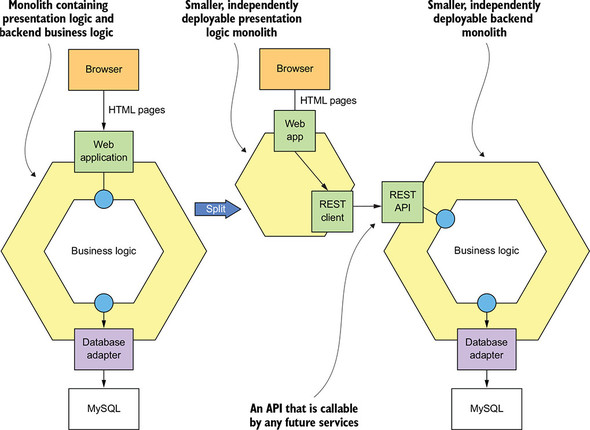

# 13. 마이크로서비스로 리팩터링

- strangler application

## 13.1 마이크로서비스 리팩터링 개요

### 1. 모놀리스를 왜 리팩터링 하는가?

- 모놀로식 어플리케이션의 문제
  - 느린 전달(slow delivery)
  - 버그 투성이 소프트웨어 릴리스
  - 나쁜 확장성

### 2. 모놀리식 옥죄기

- 어플리케이션 현대화(application modernization)
- "완전히 뜯어고치기(big bang rewrite)" 를 삼가하라.
- strangler application 개발로 단계적 리팩터링 → 스트랭글러 어플리케이션 패턴(마틴 파울러)
  - 값을 조기에 자주 검증: 핵심 가치를 먼저 전환. 전환 가치를 빨리 입증하면 경영진의 지원도 증가.
  - 모놀리스 변경 최소화: 변경 범위 줄일 수 있는 전략을 통해 작업량 최소화.
  - 기술 배포 인프라: 모든 것이 다 필요한 것은 아니다

 ## 13.2 모놀리스 → 마이크로서비스 리팩터링 전략

### 1. 새 기능을 서비스로 구현한다

>  구멍의 법칙(Law of Holes): 구멍에 빠졌다는 것을 알았다면 땅은 그만 파라

- 새 서비스를 모놀리스에 연계
  - API 게이트웨이: 새 기능은 새 서비스로, 기존 요청은 모놀리스로 라우팅
  - 통합 글루 코드(integration glue code): 서비스가 모놀리스 데이터와 구현 기능을 호출할 수 있게 서비스를 모놀리스에 통합
- 새 기능을 서비스로 구현하는 시점
  - 새 기능을 서비스로 구현 할 수 없으면 모놀리스에 구현하고 나중에 이하의 전략으로 스트랭글러 어플리케이션으로 이전

### 2. 표현 계층과 백엔드를 분리한다

- 표현 계층을 비즈니스 로직과 데이터 접근 계층에서 분리 ; 프론트엔드와 백엔드 분리
- 퍼사드 로 구성된 대단위(coarse-grained) API 가 분리 틈새
- 이를 통해,
  - 두 어플리케이션을 서로 독립적으로 개발, 배포, 확장 할 수 있다
  - 나중에 개발할 마이크로서비스가 호출할 수 있는 원격 API 가 표출된다

### 3. 기능을 여러 서비스로 추출한다

- 비즈니스 능력 분해
  - API 끝점이 구현된 인바운드 어댑터
  - 도메인 로직
  - DB 접근 로직 등이 구현된 아웃바운드 어댑터
  - 모놀리스의 DB 스키마

- 도메인 모델 분리
  - aggregate 관점으로 서비스의 도메인 모델 추출; 객체 레퍼런스를 기본키로 대체
- DB 리팩터링
  - 엔터티에 따라 DB 테이블로 분리해서 이전
- 변경 범위를 줄이기 위해 데이터를 복제
  - 데이터를 복제하여 DB 클라이언트가 새 스키마를 사용하도록 단계적 업데이트
  - 이전하는 동안 원본과 신규 스키마의 동기화 트리거 사용
  - 서비스에도 적용 가능
- 어떤 서비스를 언제 추출하나
  - 시간별로 구획된 아키텍처(time-boxed archichecture) 정의를 통해 목적 시스템 정의
  - 서비스 추출 순서 결정 전략
    - 모놀리스 개발을 동결하고 요건이 있을 때마다 서비스를 추출
    - 서비스 추출 시 기대되는 혜택을 어플리케이션 모듈별로 순위를 매겨 추출
      - 기대 효과: 개발 가속화, 성능,확장성,신뢰성 문제 해결, 다른 서비스로 추출할 수 있게 만듬
      - 순위를 정해 리팩터링 태스크를 백로그에 추가
      - 좀 더 전략적이고 비즈니스 니즈를 충족

## 13.3 서비스와 모놀리스 간 협동 설계

- 서비스와 모놀리스 상호 작용은 통합 글루 코드가 관장한다

### 1. 통합 글루 설계

- 통합 글루 API 설계
- 상호 작용 스타일과 IPC 선택
- 부패-방지 계층 구현
- 모놀리스가 도메인 이벤트를 발행/구독하는 방법

### 2. 서비스와 모놀리스에 걸쳐 데이터 일관성 유지

- 보상 트랜잭션을 지원하도록 모놀리스를 고치기는 어렵다
- 사가 적용 시 모놀리스는 보상 트랜잭션을 지원할 필요가 없다
- 서비스 추출 순서를 조정하면 보상 트랜잭션을 모놀리스에 구현하지 않아도 된다

### 3. 인증/인가 처리

- 모놀리스의 보안 메커니즘과 JWT 기반의 보안 메커니즘 동시 지원이 관건
- 모놀리스의 로그인 핸들러에 ID/역할 등 사용자 정보가 포함된 추가 쿠키 반환하여, API 게이트웨이가 요청에 정보(Authorization 헤더)를 포함하여 서비스를 호출하고 서비스는 사용자 정보를 사용할 수 있다.

## 13.4 새 기능을 서비스로 구현: 배달 실패한 주문 처리

## 13.5 모놀리스 분해: 배달 관리 추출

-----------

## Q&A

#### 1. 그림 13-7 설명 해주세요 (p.549)

모놀리스 변경 범위 최소화하며 점진적으로 전환하는 방법으로 결과적으로 DB 클라이언트가 새 스키마를 사용하도록 변경하기 위한 것.

#### 2. attic에서 ACL(부패방지계층)은 뭐가있을까요? (p.555)

ACL 은 legacy 시스템과의 상호 작용이 필요한 경우 도메인 오염을 막기 위해 변환 구간을 두는 것인데.. 

현재 attic 에서는 없는 것 같아요

#### 3. 모놀리식 지옥에 빠진 상황에 대한 문제(3가지) 중 버그 투성이 소프트웨어 릴리스는 모놀리식 뿐만 아니라 마이크로서비스도 동일한 문제가 있지 않나요? (p.535)

책에 있는대로 개발 프로세스의 문제일까요? ㅎㅎ

절대적인 버그 건보다는 모놀리식에 비해 미치는 범위나 복잡도가 구조적으로 훨씬 낮다고 보입니다.

자동화 테스트도 전략적으로 잘 구성하면 어느 수준에서 방지할 수 있겠고요.

#### 4. EER 차세대인 attic을 완전히 완전히 뜯어 고치는 방식을 선택할 경우 회사 입장에서 어떤 문제가 있을까요? (p.536)

고비용, 기존 EER 의 기능은 동결, 

가장 큰 문제는 완성된 결과가 나올 때까지 기다려야 하므로 결과를 장담할 수 없다.

> [https://medium.com/@manisht/strangle-that-monolith-the-strangler-pattern-40c9eeb94402](https://medium.com/%40manisht/strangle-that-monolith-the-strangler-pattern-40c9eeb94402)
>
> https://martinfowler.com/articles/break-monolith-into-microservices.html
>
> https://martinfowler.com/bliki/StranglerFigApplication.html

#### 5. 6째줄에 나오는 A/B테스트에 대해 설명해주세요 (p.544)

두 개의 변형 A, B 를 사용하는 종합 대조 실험. 사용자의 행동 데이터를 통계적으로 분석하여 특정한 변화를 주었을 때 목표를 더 높게 달성하는지 알 수 있다. 대조군-실험군 으로 설정하여 비교.

> [https://ko.wikipedia.org/wiki/A/B_%ED%85%8C%EC%8A%A4%ED%8A%B8](https://ko.wikipedia.org/wiki/A/B_테스트)
>
> [https://brunch.co.kr/@bumgeunsong/17](https://brunch.co.kr/%40bumgeunsong/17)
>
> https://www.slideshare.net/cojette/ab-150118831

#### 6. 테이블 나누기는 어떻게 하는 것인가요? (p.547)

1번에서 설명.

#### 7. EER을 모놀리스 -> 마이크로서비스로 리팩터링 전략을 개발할 때 ticket을 우선 분리한다면 어떻게 진행하면 좋을지 설명 부탁 (표현계층, 서비스 추출, 도메인 로직, DB 리팩터링) (p.540)

- 화면 요소와 TicketUIService 등 표현 계층에 해당되는 webapps 과 REST-API 를 통해서 통신하도록 구성
- 도메인 모델을 중심으로 구조화하고 구현.
- DB 도 도메인 모델에 따라 리팩토링
- 서비스로 이전에 어려운 부분은 글루코드를 작성하여 기존 EER 서비스와 통신하도록 구성하고 DB 스키마 동기화도 필요하다.

#### 8. Attic과 EER 사이에 통합 글루를 구성한다면 어떠한 기능들이 MSA/모놀리스 로 나뉘며, 어떤 기술 요소들이 필요 할까요? (p.552)

