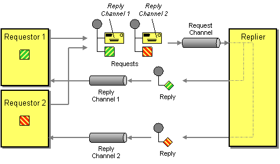

# 3. 프로세스 간 통신(IPC)

IPC : Inter-Process Communication

대표적 IPC 기술: 통신 - REST, gRPC, AMQP, STOMP / 메시지 포맷 - JSON, XML, Avro, Protocol buffer ..

> 참고: https://www.nginx.com/blog/building-microservices-inter-process-communication/

## 3.1 마이크로서비스 아키텍처 IPC 개요

### 1. 상호 작용 스타일(Interaction styles)

 클라이언트/서비스 간 상호 작용 스타일.

- one-to-one / one-to-many : 요청에 대한 서비스 처리 방식.
- synchronous / asynchronous

|       | one-to-one                                                   | one-to-many                                   |
| ----- | ------------------------------------------------------------ | --------------------------------------------- |
| sync  | request/response                                             | -                                             |
| async | request/async response[^1] one way requests (a.k.a notifications) | publish/subscribe publish/async response |

### 2. 마이크로서비스 API 정의

IDL(Interface Definition Language) 로 정의.

- API 우선 방식((API-first approch) 으로 서비스 정의 : 계획/설계 후 구현.

  > https://www.programmableweb.com/news/how-to-design-great-apis-api-first-design-and-raml/how-to/2015/07/10

### 3. API 발전시키기

- Sementic Versioning : API 버저닝 가이드로 참고.

  - https://semver.org/
    - MAJOR : 호환되지 않는 API 변경
    - MINOR : 하위 버전과 호환되도록 기능 추가
    - PATCH : 하위 호환되는 버그 수정
    - 추가적으로 pre-release 과 build 메타데이터에 대한 라벨로 MAJOR.MINOR.PATCH 포맷 확장 가능.
  - REST API 는 메이저 버전을 URL 첫번째 경로에 포함. 메시징인 경우 메시지에  버전 포함.

- 하위 호환되는 소규모 변경:

  - 하위 호환성을 유지하며 견고성 원칙(Robustness principle) 을 지켜야 한다.
    - 요청 속성이 누락되어도 기본값 제공, 서비스가 더 많은 속성을 응답해도 클라이언트는 무시해야 한다.

- 중대한 대규모 변경:

  - 일정 기간동안 이전/신규 버전 API 모두 지원

    - REST API URL 에 버전 포함

    - HTTP content negotiation : MIME type 에 버전 포함

      > Content negotiation:
      >
      > 동일한 URI 에서 리소스의 서로 다른 버전을 지원하기 위해 사용하는 매커니즘. 리소스 타입, 포맷, 인코딩 등.
      >
      > https://developer.mozilla.org/ko/docs/Web/HTTP/Content_negotiation

  - API 어댑터에 신구 버전 중계 로직 포함 => API 게이트웨이

### 4. 메시지 포맷

- 텍스트 메시지 포맷
  - JSON, XML
  - 메시지 컨슈머는 필요한 값만 선택해서 사용 가능 하므로, 메시지 스키마 변경에 대한 하위 호환성 보장이 용이.
  - XML 스키마[^2] 와 같이 JSON 도 스키마 표준 제정: http://json-schema.org/ 메시지 유효성, 문서화에 활용
  - 장점: human readable. self describing
  - 단점: 메시지가 길다(특히 XML) - 속성값에 속성명도 포함되어야 하고, 파싱 오버헤드도 있다.

- 이진 메시지 포맷
  - 메시지 구조 정의를 위한 타입(typed) IDL 제공, 컴파일러가 serialize/deserialize 코드 생성 => API-first approch
  - Protocol Buffer https://developers.google.com/protocol-buffers
  - Avro https://avro.apache.org/

  > 프로토콜 비교:
  >
  > [Schema evolution in Avro, Protocol Buffers and Thrift](http://martin.kleppmann.com/2012/12/05/schema-evolution-in-avro-protocol-buffers-thrift.html) / [번역글](http://sjava.net/2012/12/%EB%B2%88%EC%97%AD-%EC%97%90%EC%9D%B4%EB%B8%8C%EB%A1%9Cavro-%ED%94%84%EB%A1%9C%ED%86%A0%EC%BD%9C-%EB%B2%84%ED%8D%BCprotocol-buffers-%EC%93%B0%EB%A6%AC%ED%94%84%ED%8A%B8thrift%EC%9D%98-%EC%8A%A4/](http://sjava.net/2012/12/번역-에이브로avro-프로토콜-버퍼protocol-buffers-쓰리프트thrift의-스/))
  >
  > https://www.slideshare.net/IgorAnishchenko/pb-vs-thrift-vs-avro

## 3.2 동기 RPI 패턴 응용 통신

RPI: Remote Procedure Invocation. 클라이언트의 서비스 요청에 대해 서비스 처리 후 응답을 회신하는 IPC.

### 1. 동기 RPI 패턴: REST

> REST 는 컴포넌트 상호 작용의 확장성, 인터페이스 일반화, 컴포넌트의 독립적 배포, 상호 작용 지연을 줄이기 위한 중간 컴포넌트, 보안 강화, 레거시 시스템의 캡슐화에 역점을 둔 아키텍처 제약 조건 세트를 제공한다.
>
> Roy Fielding (REST 창시자)

- 리소스: 단일 비즈니스 객체 혹은 그 컬렉션. 리소스 조작에 URL 로 참조되는 HTTP 동사(GET, POST, PUT, ..)를 사용. 

#### REST 성숙도 모델

>  https://martinfowler.com/articles/richardsonMaturityModel.html

- level 0 : HTTP POST 요청으로 서비스 호출. 요청에 액션과 대상 지정, 매개변수 전달.
- level 1 : Resource. 액션과 매개변수 지정된 POST 요청.
- level 2 : HTTP 동사. GET, POST 등 HTTP 동사로 액션 수행. 필요시 매개변수 전달.
- level 3 : HATEOAS(Hypertext As The Engine Of Application State). GET 요청에 액션 링크도 포함하여 응답.

#### REST API

REST API 에 대한 IDL 필요성 요구됨 => Swagger 발전시켜 오픈 API 명세 만들어짐. https://www.openapis.org/

#### 요청 한 번으로 많은 리소스를 가져오기 어렵다

연관된 리소스를 한번에 가져오기 힘들다 => GraphQL[^3], Netflix Falcor[^4] 등 대체 기술 활용

#### 작업을 HTTP 동사에 매핑하기 어렵다

다양한 업데이트 작업을 처리하다보면 멱등성(idempotency) 보장이 어려울 수 있다. => 하위 리소스(sub-resource) 정의

#### REST 의 장단점

- 장점
  - 단순하고 익숙하다
  - 툴을 이용하여 테스트하기 쉽다(postman, curl, ..)
  - request/reply 스타일의 통신 직접 지원
  -  HTTP 는 firewall friendly : single port 사용, 인터넷으로 서버에 연결, TCP 사용, 광범위한 가용 프록시 서버로 종료 혹은 프록시 가능 [^5]
  - 중간 브로커가 없어 시스템 아키텍처가 단순해짐
- 단점
  - request/reply 통신 스타일만 지원
  - 가용성 떨어짐: 클라이언트/서비스 직접 통신하므로 양쪽 모두 실행 상태여야 함.
  - 클라이언트가 서비스 인스턴스의 위치(URL) 를 알고 있어야 함 => 서비스 디스커버리 매커니즘으로 해결 가능.
  - 단일 요청으로 여러 리소스 가져오기 어려움
  - 다중 업데이트 작업을 매핑하기 어려움

### 2. 동기 RPI 패턴: gRPC

- 다양한 언어로 클라이언트/서버 작성할 수 있는 프레임워크. 이진 메시지 기반 프로토콜이므로 API-first approch 로 설계. 
- protocol buffer(protobuf) 기반의 IDL 로 API 정의하여, 클라이언트/서버는 protobuf 포맷의 이진 데이터로 통신(HTTP/2)
- gRPC API는 하나 이상의 서비스와 request/reply message definition 으로 구성.
- protobuf 포맷을 사용하므로, 그 특성대로 효율적이고 간결하며, 변경에 대한 하위 호환성 유지도 가능.

장점

- 다양한 업데이트 작업이 포함된 API 설계 용이
- 큰 메시지 교환에 효율적
- 양방향 스트리밍으로 RPI, 메세징 모두 가능
- 다양한 언어 지원

단점

- javascript 클라이언트 작업이 REST/JSON 대비 많음
- HTTP/2 지원되어야 함

### 3. 부분 실패 처리: 회로 차단기 패턴(Circuit breaker pattern)

> https://microservices.io/patterns/reliability/circuit-breaker.html
>
> https://martinfowler.com/bliki/CircuitBreaker.html

연속 실패 횟수가 임계치 초과하면 일정 시간동안 호출 거부하는 RPI 프록시

- 견고한 RPI 프록시 설계
  - 네트워크 타임아웃: 응답 대기 타임아웃 설정.
  - 미처리 요청 개수 제한: 요청 가능한 미처리 요청 최대 개수 설정.
  - curcuit breaker pattern: 에러율 임계치 초과에 대한 처리.

  

  - Netflix Hystrix https://github.com/Netflix/Hystrix

- 불능 서비스 복구
  - 상황에 따른 실패에 대한 복구 정책이 설계에 포함

### 4. 서비스 디스커버리

#### 개요

- 서비스 인스턴스의 네트워크 위치를 DB 화 한 서비스 레지스트리를 통해 서비스 요청을 라우팅

  > https://microservices.io/patterns/service-registry.html

- 구현 방법
  - 클라이언트/서비스가 직접 서비스 레지스트리와 상호 작용
  - 배포 인프라로 서비스 디스커버리 처리

#### 애플리케이션 수준의 서비스 디스커버리 패턴 적용

- 클라이언트/서비스가 service registry 와 직접 통신: 

  - service instance 직접 등록 (self registration pattern)[^6]

  - service client 는 query 결과 목록에서 하나의 instance 로 요청 라우팅 (client-side discovery pattern)[^7]

    

  - Netflix Eureka, Eureka java client, Ribbon, Pivotal

- 다양한 플랫폼 배포 환경에서 잘 동작함

- 개발 언어(프레임워크) 제약: Spring cloud 

#### 플랫폼에 내장된 서비스 디스커버리 패턴 적용

- 배포 플랫폼에 서비스 등록, 서비스 디스커버리, 요청 라우팅 내장 (도커, 쿠버네티스 등).

  - 3rd party registration pattern: 배포 플랫폼 내 3rd party registrar(등록기) 가 서비스 등록 대행.

    > https://microservices.io/patterns/3rd-party-registration.html

  - server-side discovery pattern: client 가 직접 질의하지 않고 DNS 명을 요청하면, 요청 라우터가 처리.

    > https://microservices.io/patterns/server-side-discovery.html

- 장점: 배포 플랫폼이 알아서 처리. 서비스에 관련 코드가 없으므로 언어에 관계없이 바로 적용 가능

- 단점: 특정 배포 플랫폼에 종속됨.

## 3.3 비동기 메시징 패턴 응용 통신

메시징: 서비스간 메시지를 비동기로 전송하는 통신 방식.

> https://microservices.io/patterns/communication-style/messaging.html

### 1. 메시징 개요

기업 통합 패턴(Enterprise Integration Pattern) 의 메시징 모델.

> https://www.enterpriseintegrationpatterns.com/patterns/messaging/

#### 메시지

> https://www.enterpriseintegrationpatterns.com/patterns/messaging/Message.html

- 헤더(header), 본문(body) 구성.

- 종류
  - document : 데이터만 포함된 제너릭 메시지. 메시지 해석을 수신자가 결정.
  - command : RPC 요청과 동등. 호출 작업+매개변수.
  - event : 대부분 도메인 이벤트.

#### 메시지 채널

> https://www.enterpriseintegrationpatterns.com/patterns/messaging/MessageChannel.html

- 종류

  - 점대점(point-to-point) 채널 : 채널 컨슈머 중 하나만 지정하여 수신. (e.g. 커맨드 메시지)

    > https://www.enterpriseintegrationpatterns.com/patterns/messaging/PointToPointChannel.html

  

  - 발행-구독(publish-subscribe) 채널 : 모든 컨슈머가 수신. (e.g. 이벤트 메시지)

    > https://www.enterpriseintegrationpatterns.com/patterns/messaging/PublishSubscribeChannel.html

   

### 2. 메시징 상호 작용 스타일 구현

#### 요청/응답(Request/Reply) 및 비동기 요청/응답(Request/Async reply)

- 클라이언트/서비스가 한 쌍의 메시지를 주고받는 요청/응답 스타일로 상호 작용.

- 요청 메시지에 응답 채널, 메시지 식별자(messageID) 포함.

 

> Request-Reply https://www.enterpriseintegrationpatterns.com/patterns/messaging/RequestReply.html
>
> Return  Address https://www.enterpriseintegrationpatterns.com/patterns/messaging/ReturnAddress.html
>
> Correlation Identifier https://www.enterpriseintegrationpatterns.com/patterns/messaging/CorrelationIdentifier.html

#### 단방향 알림(one-way notification)

- 클라이언트가 서비스의 point-to-point 채널로 메시지(커맨드 메시지) 보내면 서비스가 구독해서 처리.

#### 발행/구독

- 클라이언트가 발행/구독 채널에 메시지 발행하고, 서비스는 도메인 객체 변경에 대한 도메인 이벤트를 발행. 
- 서비스는 관심있는 도메인 객체 이벤트 채널 구독.

#### 발행/비동기 응답

- 클라이언트가 응답 채널 헤더가 포함된 메시지를 발생/구독 채널에 발행, 컨슈머는 CorrelationId 가 포함된 응답 메시지를 지정 응답 채널에 쓰고, 클라이언트가 CorrelationId 로 응답 확인.

### 3. 메시징 기반 서비스의 API 명세 작성

명세 구성요소: 메시지 채널명, 채널로 교환되는 메시지 타입과 포맷(JSON, XML, Protobuf 등 표준 포맷)

#### 비동기 작업 문서화

- 요청/비동기 응답 스타일 API : 커맨드 메시지 채널, 받는 메시지 타입과 포맷, 반환하는 응답 메시지 타입과 포맷.
- 단방향 알림 스타일 API : 커맨드 메시지 채널, 받는 메시지 타입과 포맷.

#### 발행 이벤트 문서화

- 이벤트 채널, 이벤트 메시지의 타입과 포맷.

### 4. 메시지 브로커

message broker : 서비스 간 통신 중계 인프라 서비스.

#### 브로커리스 메시징

- 서비스 간 메시지 직접 교환. (e.g. ZeroMQ)

- 장점:
  - 네트워크 트래픽이 가볍고 지연 시간이 짧다.
  - 메시지 브로커가 성능 병목점이나 SPOF(single point of failure) 가 될 일이 없다.
  - 운영 복잡도가 낮다.

- 단점:
  - 서비스간 위치를 알고 있어야 하므로 서비스 디스커버리 매커니즘 사용해야 한다.
  - 송수신 서비스 모두 실행 중이어야 하므로 가용성 떨어진다.
  - 전달 보장 매커니즘 구현 어렵다.

#### 브로커 기반 메세징 개요

- 송신자가 컨슈머 위치 몰라도 된다. 컨슈머가 메시지 처리 가능할 때까지 버퍼링 가능하다.
- 메시지 브로커: ActiveMQ, RabbitMQ, Apache Kafka, AWS kinesis, AWS SQS..
- 채택 고려 사항: 지원 언어, 메시징 표준 지원, 순서 유지, 전달 보장, 영속화, 내구성, 확장성, 지연 시간, 경쟁사 컨슈머 지원 등..

#### 메시지 브로커로 메시지 채널 구현

- 메시지 브로커 마다 메시지 채널 구현 방식 달라진다. AWS SQS 외 대부분 점대점, 발행/구독 채널 모두 지원.

#### 브로커 기반 메시징의 장단점

- 장점
  - 느슨한 결합 
  - 메시지 버퍼링
  - 유연한 통신
  - 명시적 IPC  

    > (번역서: 번역이 덜 된 부분 있음)
    >
    > RPC-based mechanism attempts to make invoking a remote service look the same as calling a local service. But due to the laws of physics and the possibility of partial failure, they’re in fact quite different. **Messaging makes these differences very explicit, so developers aren’t lulled into a false sense of security.**
    >
    > RPC 기반 매커니즘은 원격 서비스 호출이 로컬 서비스를 호출하는 것과 동일하게 보이게 합니다. 그러나 물리 법칙  과 부분 실패 가능성 으로 인해, 실은 아주 다릅니다. **메시징은 이런 차이점을 매우 명백하게 만들어주므로, 개발자가 잘못된 보안 감각에 빠지지 않게 합니다.**
    >
    > https://livebook.manning.com/book/microservices-patterns/chapter-3/290

- 단점
  - 성능 병목 가능성 ⇒ 확장성
  - 단일 장애점 가능성 ⇒ 고가용성
  - 운영 복잡도 늘어남

### 5. 수신자 경합과 메시지 순서 유지

- sharded(partitioned) channel 을 이용한 순서 보장(kafka, AWS kinesis) : 메시지에 포함된 shard key(e.g. orderId) 에 따라 같은 shard 에 발행하고, 메시지 브로커는 수신자 인스턴스 지정.

### 6. 중복 메시지 처리

- 메시지 브로커는 적어도 한번(at least once) 메시지 전달(delivery) 보장; 전달 실패나 ack. 수신 못한 경우 등.
- 장애시 순서 보장을 위한 재전송으로 메시지 중복 발생

#### 멱등한(idempotent) 메시지 핸들러 작성

- idempotent[^8] : 동일한 입력값을 반복 입력해도 부수 효과가 없는 것.
- 일반적으로 어플리케이션 로직에서 멱등하기 어려움.

#### 메시지 추적과 중복 메시지 솎아 내기

- 메시지 컨슈머가 message id 를 이용해 처리 여부를 추적하여 중복 제거.
- 컨슈머가 메시지 처리 트랜잭션 과정으로 처리된 메시지 id 를 DB 에 저장하고, 중복 발생하면 insert 실패되고 컨슈머는 메시지 폐기.

### 7. 트랜잭셔널 메시징

서비스의 DB 업데이트와 메시지 발행을 단일 트랜잭션으로 처리하기 위한 방법.

#### DB 테이블을 메시지 큐로 활용

> https://microservices.io/patterns/data/transactional-outbox.html

- transactional outbox pattern: 임시 메시지 큐 역할을 하는 outbox 테이블에 DB 트랜잭션의 일부로 메시지 삽입. message relay 가 outbox 읽어 메시지 브로커에 메시지 발행.
- 로컬 ACID 트랜잭션이므로 원자성 보장.
  - Atomic, Consistency, Isolation, Durability : DB 트랜잭션이 안전하게 수행된다는 것을 보장하는 성질. [^9][^10]

#### 이벤트 발행: 폴링 발행기 패턴

> https://microservices.io/patterns/data/polling-publisher.html

- message relay 가 outbox 의 메시지를 주기적 폴링하여 미발행 메시지 조회. message broker 로 발행 후 삭제.
- 작은 규모에 적합.

#### 이벤트 발행: 트랜잭션 로그 테일링 패턴

> https://microservices.io/patterns/data/transaction-log-tailing.html

- message relay 로 DB 트랜잭션 로그(커밋 로그) 테일링(tailing).
- 변경된 DB transaction log 를 transaction log miner 가 읽어서 message broker 에 발행.

- 응용 사례: 디비지움(Debezium), LinkedIn Databus, DynamoDB Streams, Eventuate Tram

### 8. 메시징 라이브러리/프레임워크

글쓴이가 작성한 Eventuate Tram API 소개.

## 3.4 비동기 메시징으로 가용성 개선

### 1. 동기 통신으로 인한 가용성 저하

REST 등 동기 프로토콜 통신은 애플리케이션 가용성이 떨어지므로 최소화 해야한다.

### 2. 동기 상호 작용 제거

#### 비동기 상호 작용 스타일

- 모든 요청을 비동기 메시징을 통해 클라이언트/서비스가 메시징 채널로 메시지를 전송하여 비동기 통신한다.

#### 데이터 복제

- 서비스 요청 처리에 필요한 (다른 서비스의) 데이터 레플리카를 유지하여 다른 서비스와의 상호작용을 배제함.
- 최신 데이터는 데이터를 소유한 해당 서비스의 이벤트를 구독해서 유지할 수 있다.
- 대용량 데이터 복제는 비효율적.

#### 응답 반환 후 마무리

로컬 서비스 처리 후 응답 반환. 다른 서비스에 비동기 메시지 전송.

----------

## [Q&A]

#### 1. 시맨틱 버저닝 적용 시 소스가 버전별로 여러벌 생기는 건가요?

시맨틱 버저닝은 의존성 문제[^Q1] 해결을 위한 버전 규칙 명세입니다. 

버저닝이 되는 것은 배포를 위한 것입니다. VCS 가 일반적으로 버전 단위로 태깅되며, freezing 된 태깅 소스는 여러벌 존재 할 수 있지만 더이상 변하지 않죠. 버전이 존재하는 것은 배포 후 서비스를 구분하기 위해서라고 봐야겠습니다.

EER 처럼 항상 마지막 버전만 유지하는 경우가 많지만, 필요에 따라 큰 변경에 따른(예. Java 버전) 호환성 유지를 위해 복수의 메이저 버전을 유지하는 경우도 있습니다. spring framework 같은 경우가 대표적이겠네요.

언제까지 유지할 것인지와 같은 것은 해당 서비스의 목적과 정책에 의해 결정될 문제겠고요.

#### 2. 미처리 요청 개수 제한과 회로 차단기 패턴의 차이점과 예시로 쉽게 설명해주세요.

http://techblog.netflix.com/2012/02/fault-tolerance-in-high-volume.html

위 링크에서 넷플릭스가 내결함성 솔루션을 제시한 방법입니다. 아래와 같은 솔루션을 조합해서 적용 합니다.

"네트워크 타임아웃" 요청이 계속 대기 되는 것을 막습니다.

"미처리 요청 개수 제한"은 클라이언트에서 요청 가능한 개수를 초과한 요청은 무의미하므로 빠른 실패를 반환합니다. 효율성을 높이고 사용자 요청 대기 시간을 줄일 수 있습니다.

" 회로 차단기 패턴" 은 설정한 임계치에 도달하면 모든 요청을 중단하고(open) 일정 시간 후 health check 로 상태를 확인(half open) 한 다음, 정상화(close) 합니다. 그렇지 않으면 open 상태를 유지합니다.

#### 3. 메시지 채널 점대점 채널, 발행-구독 채널 에서 이 채널의 개념을 설명해주세요. 각각을 사용하는 경우 예도 들어주세요.

EIP[^Q2] 에 따르면, 메시징 어플리케이션은 송신자와 수신자를 연결하는 가상 파이프인 메시지 채널을 통해 데이터를 전송합니다. 송신자는 특정 채널에 메시지를 추가하고, 수신자가 채널로부터 메시지를 읽습니다.

"점대점 채널" 은 채널에 여러 수신자가 있더라도 하나의 수신자만 특정 메시지를 수신할 수 있고, "발행-구독 채널" 은 메시지 사본을 연결된 각 수신자에게 전달합니다.

점대점 채널은 "상품 주문" 등 커맨드 메시지에, 발행-구독 채널은 "알림" 등의 이벤트 메시지 용으로 사용할 수 있습니다.

메시지 브로커로 보통 메세지 채널을 구현하는데 대부분은 두 방식 모두 지원합니다. (JMS, kafka, RabbitMQ, ...)

아래는 Google Cloud Pub/Sub[^Q3] 의 다이어그램으로, 두 방식 모두 제공합니다.

#### 4. outbox는 발행된 이벤트를 임시로 저장하는 DB인건가요? 그렇다면, 중간에 이벤트가 실패할 경우 트랜잭션은 어떤식으로 처리하는건가요?

임시 메시지 큐 역할이므로 message relay 가 outbox 의 메세지를 message broker  에 전달합니다. polling publisher  방식은 outbox 조회하여 전달 후 삭제, transaction log tailing 은 저장 후 삭제할 수 있습니다. log tailing 은 로그가 남는 것이 주이기 때문인 것 같네요.

>  참고: 
>
>  - https://dzone.com/articles/implementing-the-outbox-pattern
>
>  - https://www.popit.kr/msa에서-메시징-트랜잭션-처리하기

이벤트 실패 질문은 어떤건지 확인이 필요한데, 서비스 내에서 처리 후 outbox 에 이벤트 발행하는 것까지라면 책에 있는대로 원자성을 가진 로컬 트랜잭션이므로 성공 혹은 실패일 것이고, outbox 의 이벤트 메시지를 처리하는데 실패하는 것이라면 재시도 되겠죠?

#### 5. REST 성숙도 모델에서 보면 attic은 레벨 2 기준으로 작성이 되어 있지만 사이트에서는 방화벽 정책등으로 PUT, DELETE등을 못쓰게 하는 경우가 있습니다. 이럴 경우 attic에서도 레벨 1 수준으로 바꿔야 할지? 안바꾸면 어떤 문제가 있을지?

어려운 문제네요.. 기업 IT 운영 부서의 생각이 바뀌었으면 좋겠지만.

조금 찾아보니 PUT, DELETE 의 보안 취약점 문제는 WebDAV 를 사용하는 경우 추가되는 확장 메소드들에 의한 것이므로 우리 제품의 환경에선 실제적인 보안 문제는 없다... 고 설득할 수 있으면 좋겠네요. ㅎㅎ

> https://blog.tophoon.com/2019/01/20/rest-api.html

GET, POST  를 사용하는 graphQL 이나 protobuf, avro 를 검토해 볼 수도 있겠습니다..

#### 6. GraphQL에 대해 설명해주세요

- 페이스북이 만든 API 를 위한 쿼리 언어로 한번에 필요한 리소스 모두 얻을 수 있다.(REST 는 리소스별 여러번 호출해야 한다.) 그러므로 다양한 리소스를 조합한 쿼리를 많이 사용할 때 효과적.
- 하나의 endpoint 로 서비스.
- Github API v4 에 GraphQL 을 적용했다. https://developer.github.com/v4/

> 참고:
>
> - https://tech.kakao.com/2019/08/01/graphql-basic/
> - https://graphql.org/learn/queries/

#### 7. REST를 gRPC로 대체를 해야 한다면 가장 큰 이유가 무엇일까요? 아님 gRPC보다는 REST가 더 좋은건가요?

- REST 의 다양한 업데이트 작업에 대한 PUT 매핑 문제를 해결할 수 있다. 

- 5와 예와 같은 HTTP 메소드 제한 환경의 문제도 피해갈 수 있다. 
- gRPC 의 기반인 protobuf 의 장점이 반영. 
- 그러나 protobuf 는 HTTP/2 가 필요하므로 그로 인한 장점도 갖지만 구축 환경의 제약도 될 수 있다.
- 기타
  - 구글 넷플릭스 등 다양한 MSA 환경에서 활용. 간단한 설치와 빠른 배포.
  - IDL 정의만으로 코드가 생성되어 비즈니스 로직에 집중한 빠른 개발 가능. 
  - 높은 압축률로 네트워크 트래픽 획기적 감소.
  - 필요한 경우 외부 REST API 제공을 위해 grpc-gateway. 그 외 pluggable 한 다양한 ecosystem.
  - learning curve, 제한된 브라우저 지원(https://caniuse.com/#feat=http2), 읽을 수 없음.

> 참고: 
>
> - https://code.tutsplus.com/tutorials/rest-vs-grpc-battle-of-the-apis--cms-30711
> - https://medium.com/@goinhacker/microservices-with-grpc-d504133d191d

#### 8. attic에서 접수서비스는 티켓과 채널을 생성합니다. CS톡 비즈니스의 접수 서비스에서 접수 시 티켓, 채널 생성에 대한 operation이 비동기 or 동기 방식 중 어느것이 더 효율적일까요?

비동기 메시징 처리하는 것이 적절해 보입니다. 접수 op. 결과 이벤트로 티켓 서비스과 채널 서비스를 통해 생성이 되겠죠.  

#### 9. msa에서 versioning을 통해 서비스할 경우 시스템 구성 or 로직은 어떤식으로 처리할 수 있을까요? 예) v1과 v2이 사용되는 스키마 구조가 다를 경우

서비스 배포/운영 관점에서는 Kubernetes 환경에서의 Helm 같은 패키징 관리 도구를 활용할 수 있을 것 같다.

> https://tech.osci.kr/2019/11/23/86027123/

-----------------

[^1]: 번역서에는 비동기 요청/응답(async request/response) 로 표기되어 있다.
[^2]: https://www.w3.org/XML/Schema
[^3]: 페이스북이 만든 API 를 위한 쿼리 언어로 보관 데이터에 대해 쿼리를 수행하기 위한 런타임이다. 단일 요청으로 필요한 리소스의 데이터를 가져올 수 있다. https://graphql.org/
[^4]: Netflix UI 를 지원하는 데이터 플랫폼 javascript library. 모든 백엔드 데이터 모델을 단일 가상 JSON 객체로 모델링 할 수 있다. https://netflix.github.io/falcor/
[^5]: https://glossary.pro2col.com/firewall-friendly/
[^6]: https://microservices.io/patterns/self-registration.html
[^7]: https://microservices.io/patterns/client-side-discovery.html
[^8]: [https://ko.wikipedia.org/wiki/%EB%A9%B1%EB%93%B1%EB%B2%95%EC%B9%99](https://ko.wikipedia.org/wiki/멱등법칙) 
[^9]: https://ko.wikipedia.org/wiki/ACID
[^10]: https://johngrib.github.io/wiki/ACID/ 

[^Q1]:  https://ko.wikipedia.org/wiki/의존성_지옥
[^Q2]: https://www.enterpriseintegrationpatterns.com/patterns/messaging/MessageChannel.html
[^Q3]: https://cloud.google.com/pubsub/docs/overview