# 4. 트랜잭션 관리: 사가

데이터 일관성을 위한 단일 내부 시스템의 트랜잭션은 ACID 가 보장하지만, 여러 서비스에 걸친 트랜잭션은? => 메세지 주도 방식의 로컬 트랜잭션인 saga 를 사용.

saga 는 ACD 만 보장하고, I(Isolation)은 보장하지 않음 → concurrency anomaly  방지 기법 필요.

> *p154: 스타벅스는 2단계 커밋을 사용하지 않습니다. https://www.enterpriseintegrationpatterns.com/ramblings/18_starbucks.html*
>
> 스타벅스는 최대한의 수익을 내기 위해 최대한의 주문을 받아야 하므로, 주문과 음료 제조가 비동기로 진행된다.(계산원은 주문을 받아서 컵에 표기하고 대기열에 위치시킴, 바리스타는 대기중인 컵의 정보로 음료 제조)
>
> 비동기 이므로 예외 처리가 필요한데, 스타벅스의 방식은 음료를 폐기하거나, 주문과 다른 음료가 나오면 다시 만들거나, 기계 고장으로 만들 수 없다면 환불한다. 
>
> - write-off 폐기 : 주문 취소 등에 의해 제조 음료 폐기. 손실 범위 내에서는 오류에 대한 처리 솔루션을 만드는 것 보다 손실이 적을 수 있다. 
> - retry 재시도 : 부정확, 불만족으로. 일부 작업(e.g. 음료 제조)가 실패하면 수행 작업 취소 혹은 재시도. 중복 메세지에 대해 안전한 idempotent receiver 인 경우 유효.
> - compensating action 보상 조치 : 환불. 시스템을 일관된 상태로 되돌리기 위해 완료된 작업 취소.
>
> 2단계 커밋은 주문한 음료를 얻기 까지 영수증과 돈을 가지고 계산대 앞에서 대기하다 음료와 맞바꾸는 것. 계산원과 고객은 거래가 끝날 때까지 떠날 수 없다. 이렇게 되면, 고객 수가 줄어 들고 수익(성능)도 줄어들게 된다. 
>
> https://en.wikipedia.org/wiki/Two-phase_commit_protocol
>
> 2단계 커밋 프로토콜, 2PC(two-phase commit protocol): ACP(Atomic Commit Protocol) 의 일종. 커밋에 참여하는 모든 프로세스를 조정하는 분산 알고리즘. 블로킹 프로토콜.
>
> - 커밋 요청 단계 : 코디네이터가 모든 참가자에게 커밋 쿼리 메시지 보내고 agreement 메세지(커밋에 yes 로 투표) 받을 때까지 대기. 각 참가자가 처리 성공 여부에 따라 응답.
> - 커밋 단계 : 코디네이터가 모든 참가자로부터 메시지 수신하면 '성공', 그렇지 않거나 대기 만료면 '실패'. 성공이면 커밋 메시지를 참가자들에게 보내서 트랜잭션 완료하고 승인 응답받고 트랜잭션 완료. 실패면 롤백 보내서 처리하고 완료 응답하고 트랜잭션 취소.
>
> 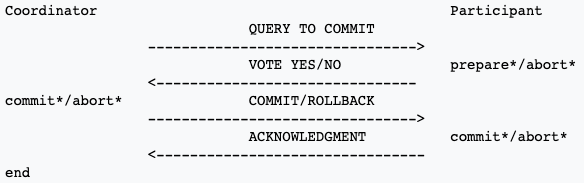

## 4.1 MSA 에서의 트랜잭션 관리

단일 DB 모놀리식 어플리케이션에 비해 MSA 의 트랜잭션 관리는 정교한 메커니즘이 필요.

### 1. 분산 트랜잭션의 필요성

서비스마다 DB 가 존재하므로 여러 DB 에 걸쳐 데이터 일관성을 유지할 수 있는 방법이 필요하다.

### 2. 분산 트랜잭션의 문제점

- (사실상) 표준인 X/Open DTP 모델(X/Open XA)로 분산 트랜잭션 처리: 2PC 를 이용해 전체 트랜잭션 커밋 혹은 롤백.

- 문제점
  - NoSQL DB(mongoDB, cassandra), message broker(RabbitMQ, kafka) 등은 지원 안함.
  - 동기 IPC 이므로 가용성 떨어짐 (가용성은 참여 서비스가 많을수록 떨어진다)
    - CAP 이론(브루어의 정리)[^41]: 분산 시스템은 Consistency(일관성), Availability(가용성), Partition tolerance(분할내성) 을 모두 만족할 수 없다.
- MSA 에서는 맞지 않음. 느슨하게 결합된 비동기 서비스 개념 기반의 메커니즘 필요  → saga

### 3. 데이터 일관성 유지: 사가 패턴

> Managing data consistency in a MSA using Sagas 
>
> http://chrisrichardson.net/post/microservices/2019/07/09/developing-sagas-part-1.html

saga: 

- MSA 에서 데이터 일관성을 유지하는 매커니즘. 
- 여러 서비스의 데이터를 업데이트하는 시스템 커맨드마다 saga 를 하나씩 정의.
- 비동기 메시징을 이용해 편성한 일련의 로컬 트랜잭션. 로컬 트랜잭션은  ACID 트랜잭션 프레임워크/라이브러리로 데이터 업데이트.

> Saga pattern : https://microservices.io/patterns/data/saga.html
>
> 로컬 트랜잭션이 완료되면 메시지/이벤트로 다음 로컬 트랜잭션 트리거한다.
>
> 로컬 트랜잭션이 실패하면 saga 는 이전 로컬 트랜잭션의 변경을 취소하는 보상 트랜잭션을 실행한다.

saga 와 ACID 트랜잭션의 차이점:

- 격리성(Isolation) 이 saga 에는 없음
- saga 는 로컬 트랜잭션마다 커밋하므로 보상 트랜잭션을 통해 롤백해야 한다.

#### 사가는 보상 트랜잭션(compensating transaction)으로 변경분을 롤백한다.

- (n+1) 번째 사가 트랜잭션이 실패하면 n개의 이전 트랜재션을 undo
- Ti 에 대응되는 보상 트랜잭션 Ci , undo 하려면 Ci 를 역순으로 실행. Tn+1 실패시 Cn ~ C1 순으로 실행.
- Ci 와 Ti 는 순서화(sequencing) 원리가 동일하므로 Ci 다음 Ci-1 실행.

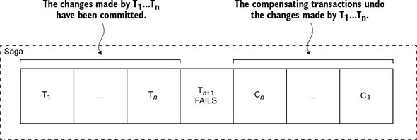

## 4.2 사가 편성(Coordinating sagas)

사가 편성 로직

- choreography : 의사 결정과 순서화를 사가 참가자에게 배당. 사가 참가자는 이벤트 교환 방식으로 통신.
- orchestration : 사가 오케스트레이터가 중앙 관리.  사가 참가자에게 커맨드 메시지를 보내 작업 지시.

### 1. Choreography-based sagas

사가 참여자가 서로 이벤트를 구독하여 그에 따라 반응.

- 승인

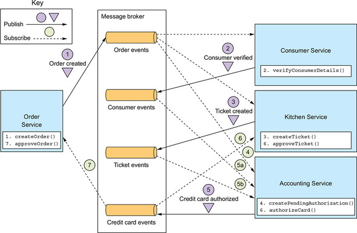

- 승인 거부

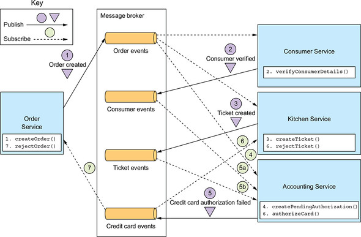

#### 확실한 이벤트 기반 통신

코레오그레피 방식 통신 이슈:

- 사가 참여자가 로컬 DB 업데이트 후 이벤트 발행을 로컬 트랜잭션으로 처리 (transactional messaging)
- 사가 참여자는 자신이 수신한 이벤트와 자신이 가진 데이터를 연관 지을 수 있어야 한다. ⇒ 상관관계 ID 가 포함된 이벤트 발행.

#### 장단점

- 장점
  - 단순함: 변경 발생시 이벤트 발행.
  - 느슨한 결합: 상호 이벤트 구독.
- 단점
  - 이해하기 어렵다: 여러 서비스에 구현 로직이 흩어져 있다.
  - 서비스간 순환 의존성
  - 단단히 결합될 가능성: 참여자 자신과 관련 이벤트를 모두 구독한다.

### 2. Orchestration-based sagas

orchestrator class 정의하여, 작업 내용이 포함된 커맨드/비동기 응답 상호 작용으로 참여자와 통신.

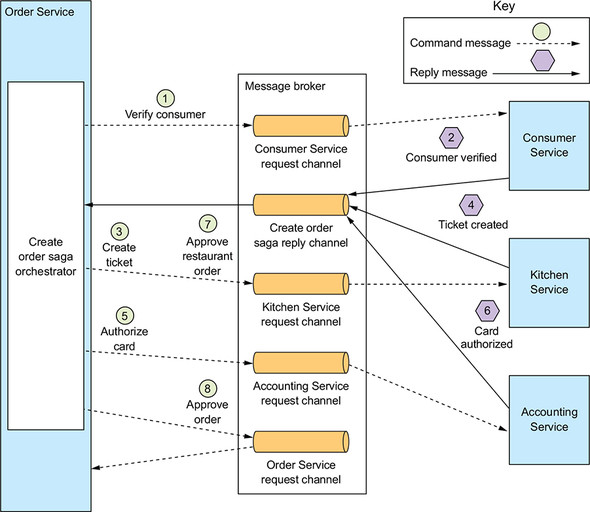

#### 사가 오케스트레이션을 상태 기계로 모델링

- 상태 기계(state machine) : 상태(state)와 이벤트에 의해 트리거되는 상태 전이(transition) 로 구성.
  - 전이 발생마다 액션이 일어나고, 사가의 액션은 사가 참여자를 호출하는 작용.
  - 사가 참여자가 로컬 트랜잭션 완료 시점에 상태간 전이가 트리거. 로컬 트랜잭션 상태와 결과에 따라 상태전이를 어떻게 하고 어떤 액션을 할지 결정.
  - 효율적 테스트가 가능.
- 주문 생성 사가의 상태 기계 모델

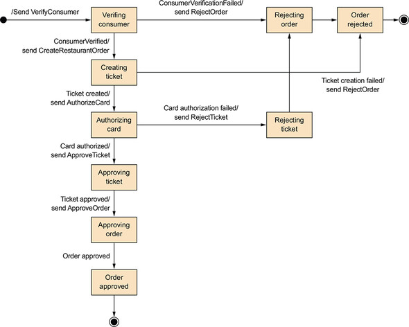

#### 사가 오케스트레이션과 트랜잭셔널 메시징

- 오케스트레이터 생성 →  사가 참여자에게 커맨드 메시지 전송 →  사가 참여자는 자신의 DB 를 업데이트 후 응답 → 사가 오케스트레이터 상태 업데이트 후 다음 사가 참여자에게 커맨드 메시지 전송 →  ...
- 서비스는 트랜잭셔널 메시지로 DB 업데이트와 메세지 발생을 원자적으로 처리.

#### 장단점

- 장점
  - 의존 관계 단순화: 오케스트레이터 → 참여자
  - 낮은 결합도
  - 관심사는 더 분리, 비즈니스 로직 단순화: 사가 편성 로직은 오케스트레이터에만.
  - 낮은 결합도
  - 관심사 더 분리, 비즈니스 로직 단순화: 
- 단점
  - 비즈니스 로직이 오케스트레이터에 중앙화 될 우려: 순서화만 담당하고 비즈니스 로직 담지 않도록 설계해야 함.

## 4.3 비격리 문제 처리(Handling the lack of isolation)

ACD 트랜잭션인 saga 의 비격리 문제:

- 한 사가가 실행 중 접근하는 데이터를 도중에 다른 사가가 바꿔치기 할 수 있다.
- 한 사가가 업데이트 하기 이전 데이터를 다른 사가가 읽을 수 있어 데이터 일관성 깨질 수 있다.

비격리에 따른 비정상(anomaly) 발생 가능.

### 1. 비정상 개요

- 소실된 업데이트(lost updates)
  - 한 사가의 변경분을 다른 사가가 덮어 쓸 때.
- 더티 읽기(dirty reads)
  - 한 사가가 업데이트 중인 데이터를 변경분을 다른 사가가 읽을 때.
- 퍼지/반복 불가능한 읽기(fuzzy/nonrepeatable reads)
  - 한 사가의 상이한 두 단계가 같은 데이터를 읽어도 결과가 달라지는 현상. 그 사이 다른 사가의 업데이트로 발생.

### 2. 비격리 대책

비격리 문제 대책(countermeasure):

- 시맨틱 락(semantic lock): 어플리케이션 레벨의 락. *_PENDING 상태를 두는 것.
- 교환적 업데이트(commutative updates): 업데이트를 어느 순서로 실행해도 되도록 설계.
- 비관적 관점(pessimistic view): 사가 단계 순서를 재조정하여 비즈니스 리스크 최소화.
- 값 다시 읽기(reread value): 데이터 덮어 쓸 때 다시 값을 읽어 변경된 내용이 없는지 확인하여 dirty writes 방지.
- 버전 파일(version file): 순서를 재조정 할 수 있게 업데이트를 기록.
- 값에 의한(by value): 요청별 비즈니스 위험성을 기준으로 동시성 메커니즘을 동적 선택.

#### 사가의 구조

- 보상 가능 트랜잭션(compensatable transaction): 보상 트랜잭션으로 롤백 가능한 트랜잭션.
- 피봇 트랜잭션(pivot transaction): 사가의 진행/중단 지점.
- 재시도 가능 트랜잭션(retriable transaction): 피봇 트랜잭션 직후의 트랜잭션. 완료가 보장된다(실패하지 않는다).

#### 대책: 시맨틱 락

- 보상 가능 트랜잭션이 생성/수정하는 레코드에 플래그 세팅 ⇒ *_PENDING 상태

- 다른 트랜잭션 접근시 lock, warning
- 재시도 가능, 보상 트랜잭션에 의해 플래그 해제.

#### 대책: 교환적 업데이트

- commutative: g(f(x)) = f(g(x))
- lost updates 방지

#### 대책: 교환적 업데이트

#### 대책: 비관적 관점

- dirty reads 로 인한 비즈니스 리스크 최소화하기 위해 사가 단계 순서 재조정.

#### 대책: 값 다시 읽기

- lost updates 방지.

- 레코드 업데이트 전 값을 다시 읽어 변경 여부 확인.

- 일종의 낙관적 오프라인 락(Optimistic Offline Lock) 패턴.

  > https://martinfowler.com/eaaCatalog/optimisticOfflineLock.html

#### 대책: 버전 파일

- 레코드에 수행 작업을 기록. 비교환적(noncommutative) 작업을 교환적(commutative) 작업으로 변환하는 방법.

#### 대책: 값에 의한

- 비즈니스 위험성을 기준으로 동시성 메커니즘 선택.
- 어플리케이션 차원에서 각 요청의 속성을 보고 사가나 분산 트랜잭션을 선택.

## 4.4 주문 서비스 및 주문 생성 사가 설계

> 샘플: https://github.com/eventuate-tram/eventuate-tram-sagas-examples-customers-and-orders

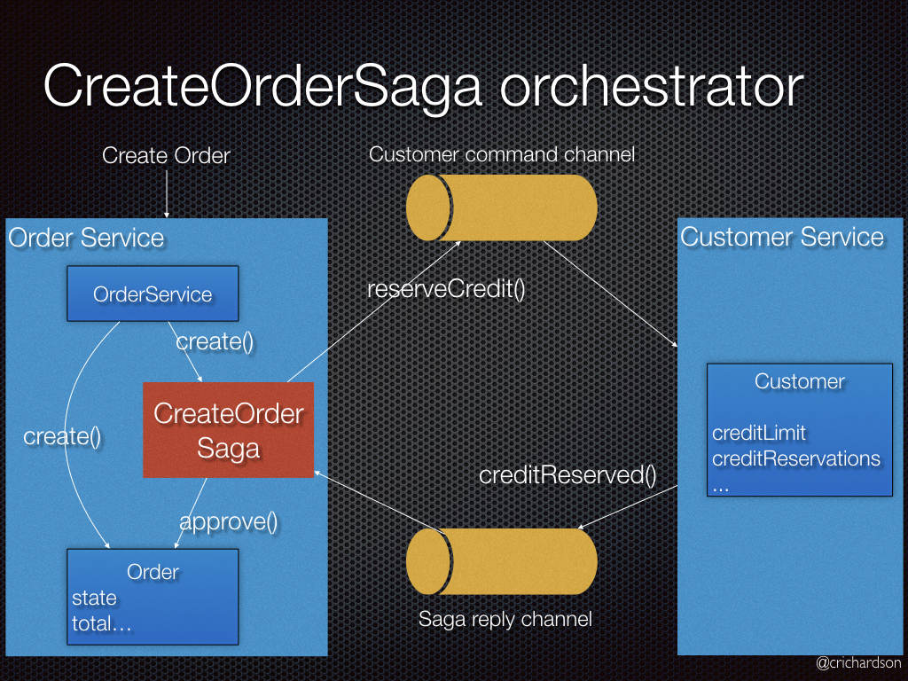

---------------

[^41]: https://m.blog.naver.com/windfalcon1/220402574806

## Q&A

#### 1. 2pc(2단계 커밋)은 스타벅스 조차 쓰지 않는다는데 요즘 2pc를 사용하지 않은 이유가 있을까요? 어떤 문제점이 있는지?

위에 요약에 스타벅스 주문 프로세스에서 2PC 를 사용하지 않는 것에 대한 설명이 있습니다. 주요한 이유는 가용성이 줄기 때문이겠죠. 브루어의 정리에서 얘기한 것 처럼 시스템에서 CAP 을 모두 충족하기 힘든데, 요즘은 가용성을 우위에 두는 경우가 많이 때문에 덜 선호되는 것 같네요. 

#### 2. 자바 EE 애플리케이션은 JTA기술을 이용해서 분산 트랜잭션을 수행할 수 있다고 하는데 JTA에 대해 간단히 설명해주시고 장단점에 대해 알려주세요.

- JTA: Java Transaction API
- XA 호환 리소스(e.g. DB) 의 분산 트랜잭션을 처리하는 자바 API
- 트랜잭션 경계 설정과 X/Open XA API 를 사용하는 트랜잭션 처리를 제공한다.
- java package: 
  - javax.transaction
  - javax.transaction.xa
- API
  - @Transactional : 선언적으로 트랜잭션 경계 제어
  - @TransactionScoped : 선언적으로 Bean 의 라이프사이클 범위 지정.
  - UserTransaction interface : 프로그래밍 방식으로 트랜잭션 경계 제어 가능
- 장점
  - XA 표준으로 호환되는 다중 리소스 처리 가능
  - Global Transaction 
  - 각 프로그램을 독립적으로 구성 가능 (XA 를 통해 순서만 변경하여 호출)
- 단점
  - 속도 저하
  - 부하 가중
  - TPS 감소

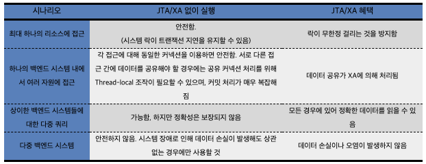

> https://en.wikipedia.org/wiki/Java_Transaction_API
>
> https://layered.tistory.com/entry/번역-JTA와-XA

#### 3. 4.2 그림에서 Txn:1에서 주문생성시 approval_pending상태로 생성하는데 pending상태로 생성하지 않지 않으면 어떤 문제가 있을까요? --> Txn:1에서 바로 approved상태로 생성

- 다음 트랜잭션에서 실패하여 롤백이 될 경우 되돌리기 어렵겠죠. 사가의 비격리 대책 중 하나인 semantic lock 기법.

#### 4. 상태 기계(state machine)을 사용해서 Ticket 상태표현에 사용할 수 있을까요? 또한 Ticket Status를 사용자 정의 상태로 확장이 가능할까요?

- 적합한 케이스겠죠.
- 오케스트레이터에 단계를 추가하여 모델을 확장할 수 있을 것 같습니다. 상태 기계 모델을 잘 구성하였다면..
- Spring Statemachine (SSM) 프레임워크라는 게 있는데, 활용해 볼 수 있을까요?
  - https://projects.spring.io/spring-statemachine/
  - https://www.baeldung.com/spring-state-machine

#### 5. 오케스트레이션 방식은 동기/비동기로 사용할 수 있을듯 한데요. 동기/비동기 방식 시 장단점에 대해 얘기해주세요. 그리고 보상 트랜잭션이 동기로 실행되면 어떤 문제가 있을까요?

- 동기: 2PC 방식과 큰 차이가 없을 듯.
  - 응답 대기시간이 길다. 일관성 유지와 롤백이 용이하지만, 가용성은 떨어진다.
- 비동기:
  - 가용성이 높고, 종속성이 비즈니스 로직 단순화되어 구현/테스트 용이.
- 

#### 6. ACID 트랜잭션의 4가지 요소를 예를 들어 이해하기 쉽게 설명해주세요. 예) 티켓생성 or 주문 등

예) 주문 생성 트랜잭션: 주문 생성 -> 소비자 확인 -> 주방 티켓 생성 -> 카드 승인 -> 티켓 승인 -> 주문 승인

- Atomicity: 주문은 성공 하거나 실패한다. 일부만 성공할 수 없다.
- Consistency: 생성 주문에 대한 하나의 주방 티켓이 존재한다.
- Isolation: 생성 중인 주문을 취소할 수 없다. 
- Durability: 생성 완료된 주문은 DB에 저장되어야 하고, 장애에도 유지 혹은 복구 가능해야 한다.

#### 7. non repeatable read가 무엇인가요?

- 비격리에 의해 나타나는 anomaly 로 트랜잭션이 처리중인 데이터를 다른 트랜잭션에 의해 갱신되어 달라지는 현상.

#### 8. 소실된 업데이트가 어떤 경우에 발생할 수 있는지 사례를 들어주세요.

- lost updates: 한 사가의 변경분을 다른 사가가 덮어쓸 때.

- 주문 생성 중 - 주문 취소가 실행되어 갱신 후 완료 - 주문 생성이 완료.

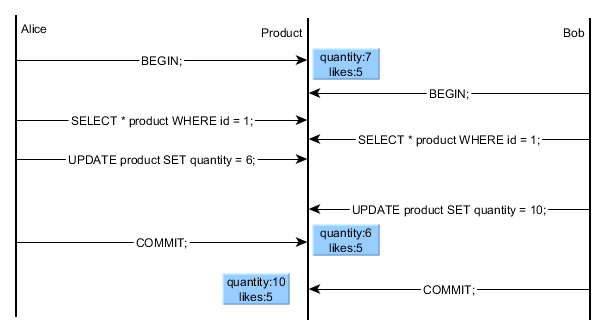

> https://vladmihalcea.com/a-beginners-guide-to-database-locking-and-the-lost-update-phenomena/

#### 9. 더티읽기는 어떤 경우에 발생할 수 있는지 사례를 들어주세요.

- dirty reads: 업데이트가 반영 안된 데이터를 다른 사가가 읽을 때.
- p.173

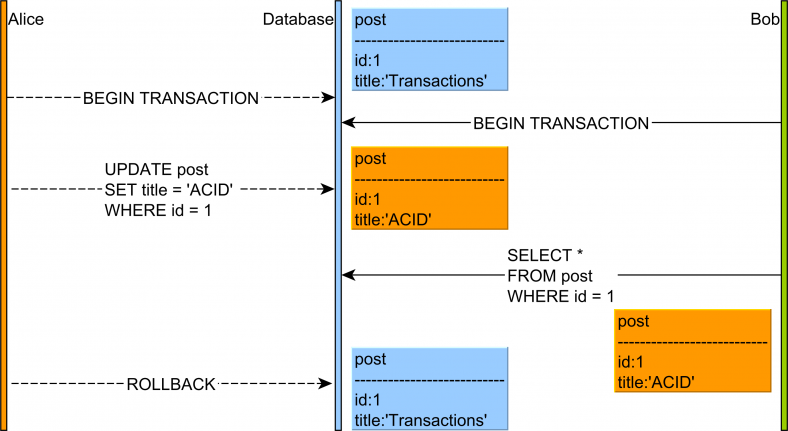

> https://vladmihalcea.com/dirty-read/

#### 10. 낙관적 오프라인 락의 예시를 들어주세요. 

- DB table 에 version 컬럼을 추가하여 업데이트 하기 전에 확인.

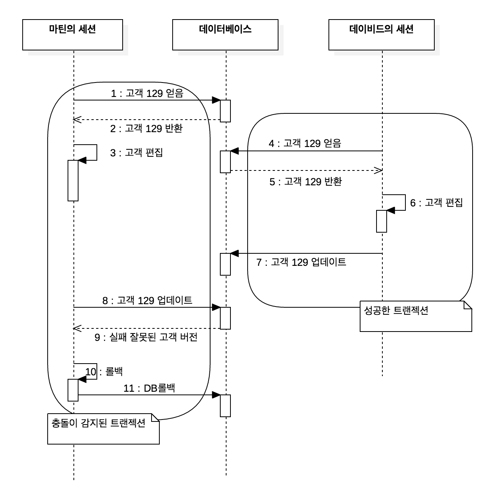

> http://redutan.github.io/2016/04/15/poeaa-offline-concurrency

#### 11. 피봇 트랜잭션과 재시도 가능 트랜잭션을 쉽게 설명해주세요.

- 피봇 트랜잭션: 사가 진행/중단 지점. 피봇 트랜잭션이 커밋되면 사가는 완료시까지 실행된다.
- 재시도 가능 트랜잭션: 피봇 트랜잭션 이후 반드시 성공하는 트랜잭션.

#### 12. Data ACID가 특히 중요한 "계좌송금"과 같은 업무가 최종 일관성(eventual consisstency)을 적용 할때 단점을 극복 고려 요소가 어떤것이 있을까요?

- eventual consistency 는 분산 시스템에서 고가용성을 높이기 위해 사용하는데, 항목이 새로 업데이트 되지 않는다는 전제하에 항목의 모든 읽기 작업이 최종적으로는 마지막으로 업데이트 된 값을 반환한다는 것.
- 분산 시스템의 사본이 다른 경우 조정이 필요.
- 동시 업데이트에 대한 조정 필요 -> 타임스탬프, 벡터 클락
- 메시지 브로커로 비동기로 한번 이상 전달할 수 있도록 보완할 수 있지 않을까요

> https://www.popit.kr/rest-기반의-간단한-분산-트랜잭션-구현-3편-tcc-confirmeventual-consistency/
>
> https://jins-dev.tistory.com/entry/분산-시스템-환경-Distributed-System-에서-BASE-원칙과-CAP-정리

