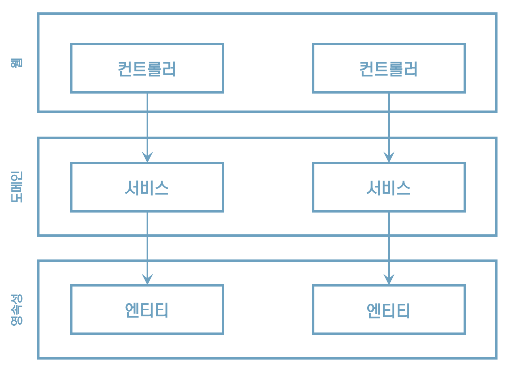

# 1. 계층형 아키텍처의 문제는 무엇일까?

## **계층형** **아키텍처**

“잘 만들어진 계층형 아키텍처는 변화하는 요구사항과 외부 요인에 빠르게 적응할 수 있게 한다”

## 계층형 아키텍처는 데이터베이스 주도 설계를 유도한다

## **하지만, **우리가 만드는 애플리케이션의 목적을 생각해보자

애플리케이션을 만드는 목적이 뭘까?

"비즈니스 규칙이나 정책"을 반영한 모델을 더욱 편리하게 활용해야 하지 않을까?

"상태보다 행동"을 중심으로 모델링 해야 하지 않을까?

> 

 그럼 왜 "도메인 로직"이 아닌 "데이터베이스"를 토대로  아키텍처를 만드는 걸까?

## **여러분들의 애플리케이션** **유스케이스**

여러분들이 이전에 만든 애플리케이션의 유스케이스를 한번 생각해보라~

"도메인 로직"을 먼저 구현했는가? "영속성 계층"을 먼저 구현했는가?

 

==> “아마 데이터베이스 구조를 먼저 생각하고, 이를 토대로 도메인 로직을 구현했을 것이다”

## **계층형 아키텍처에서는 이렇게 하는 것이 합리적인 방법이다**

## **하지만 비즈니스 관점에서는 전혀 맞지 않는 방법이다**

## **데이터베이스 중심 아키텍처의 원인**

"데이터베이스 중심적인 아키텍처가 만들어지는 가장 큰 원인은 ORM 프레임워크를 사용하기 때문이다"

## **전통적인 계층형 아키텍처의 두 가지 규칙**

## 만일, 상위 계층의 컴포넌트에 접근하고 싶다면?

## **계층 아래로 이동**

## 깨진 유리창 이론

## **수년 후 영속성 계층 모습**

"영속성 계층에서는 모든 것에 접근 가능하기 때문에 시간이 지나면서 점점 비대해진다”

## **엔티티** **필드 단 하나만 조작하면 되는 경우**

“필드 하나만 조작하면 웹 계층에서 영속성 계층으로 바로 접근해도 되지 않을까?”

한두 번은 괜찮을까? 누가 장담할 수 있지?

“도메인 계층을 건너뛰는 것은 도메인 로직을 코드 여기저기에 흩어지게 만든다”

## **두 가지 문제점**

한두 번쯤은 괜찮지 않을까? 하지만, 자주 발생한다면 무슨 문제가?

1) 도메인 로직이 웹 계층에 위치함
2) 테스트의 복잡성

## **문제점** **1.**

도메인 로직을 웹 계층에 구현하게 된다

만약 유스케이스가 확장된다면 어떻게 될까?

더 많은 도메인 로직을 웹 계층에 추가해서 핵심 도메인 로직들이 퍼져나갈 확률이 높다

## **문제점** **2.**

웹 계층 테스트에서 도메인 계층뿐만 아니라 영속성 계층도 모킹해야 한다는 것이다.

* 단위 테스트의 복잡도 증가
* 테스트 자체를 전혀 작성하지 않을 가능성이 많아짐

## **코드의 빠른 탐색**

“기능을 추가하거나 변경할 적절한 위치를 찾는 일이 빈번하기 때문에 아키텍처는 코드를 빠르게 탐색하는 데 도움이 돼야 한다”

“이번에 추가할 기능을 어디에다가 넣어야 할까?”

## **넓은 도메인 서비스의 문제점**

## **좁은 도메인 서비스로**

“좁은 도메인 서비스가 유스케이스를 하나씩만 담당하게 한다면 이런 작업들이 얼마나 수월해질까?”

“UserService에서 사용자 등록 유스케이스를 찾는 대신 RegisterUserService를 바로 열어서 작업을 시작할 수 있지 않을까?”

## **맨먼스** **미신**

## **동시작업**

50명의 개발팀이 10명의 개발팀보다 5배 더 빠를까?

## **새로운** **유스케이스를** **추가한다고 상상**

이렇게 개발할 수 있을까?

## **계층형** **아키텍처에서는 이렇게 작업할 수 없다**

“모든 것이 영속성 계층 위에 만들어 지기 때문에”

그러므로, 동시에 한 명의 개발자만 작업할 수 있다

## **넓은 서비스가 있다면 동시 작업이 더욱 어렵다**

코드에 넓은 서비스가 있다면 서로 다른 기능을 동시에 작업하기가 더욱 어렵다

병합 충돌(merge conflict)과 이전 코드로 되돌려야 하는 문제를 야기

## 유지보수 가능한 소프트웨어를 만드는 데 어떻게 도움이 될까?

* 과거에 계층형 아키텍처를 만들어봤다면 이번 장에서 논의한 단점들이 익숙하다.
* 적절히 구축된다면 계층형 아키텍처는 유지보수하기 쉽고 코드를 변경하거나 추가하기 쉽다.
* 그러나 계층형 아키텍처는 잘못된 방향으로 흘러가도록 용인한다.
* 시간이 지날수록 품질이 저하되고 유지보수하기 어려워진다.
* 일정에 쫓겨 조금씩 느슨해지기 마련이다.