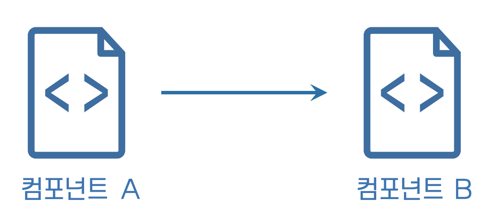
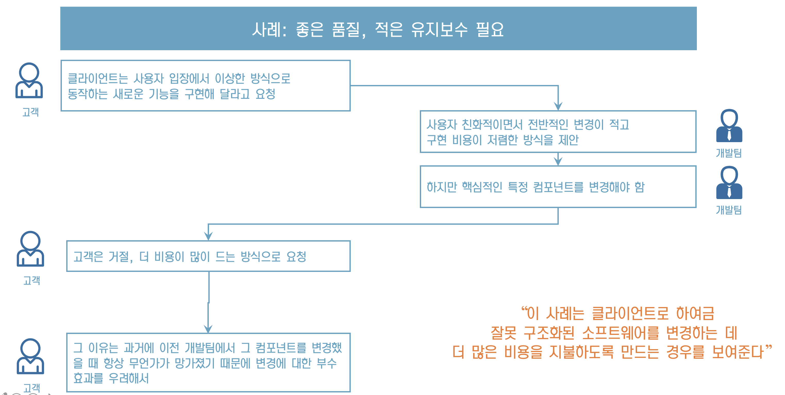
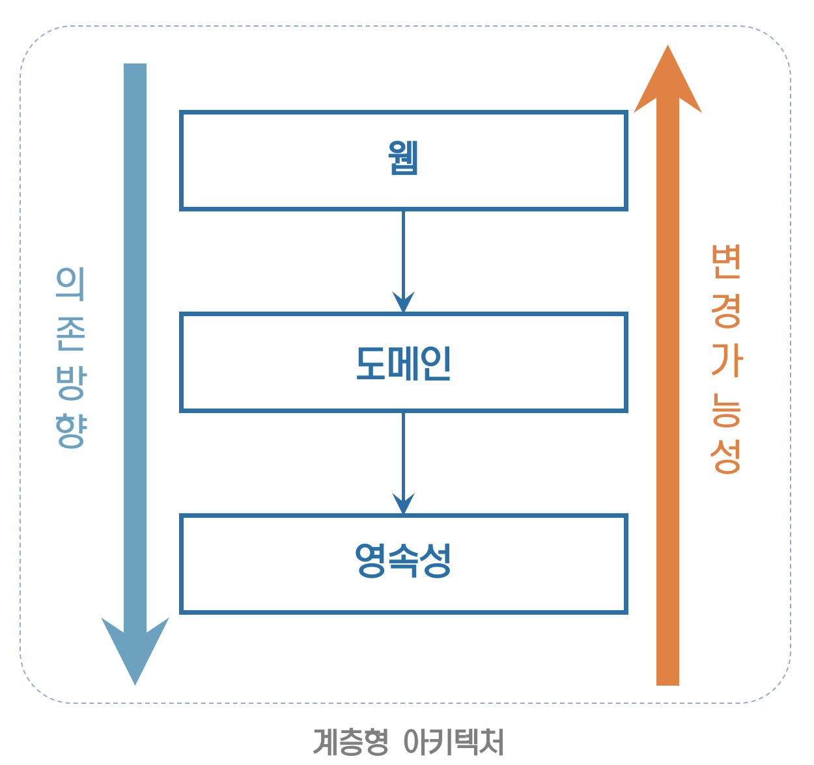
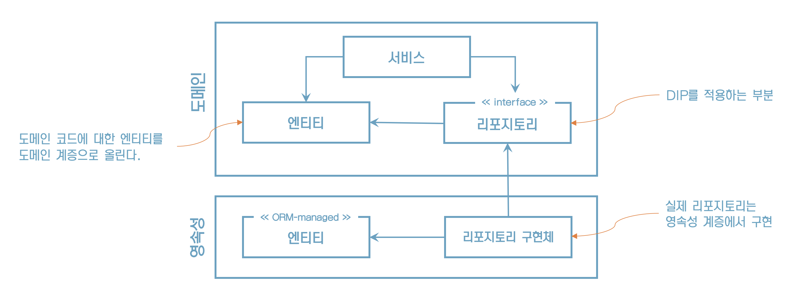
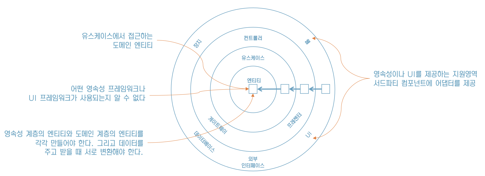
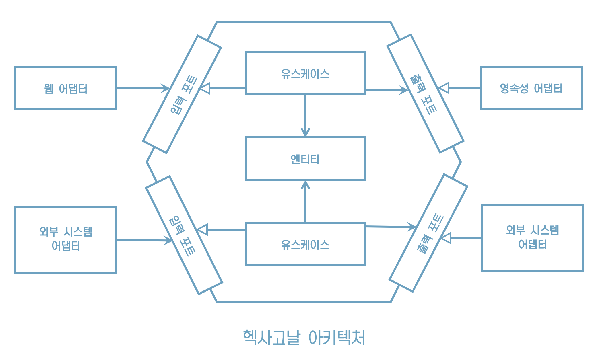
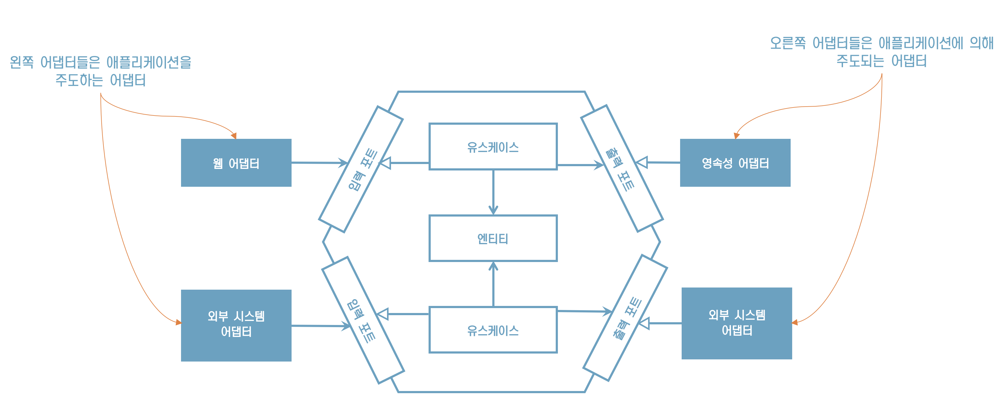
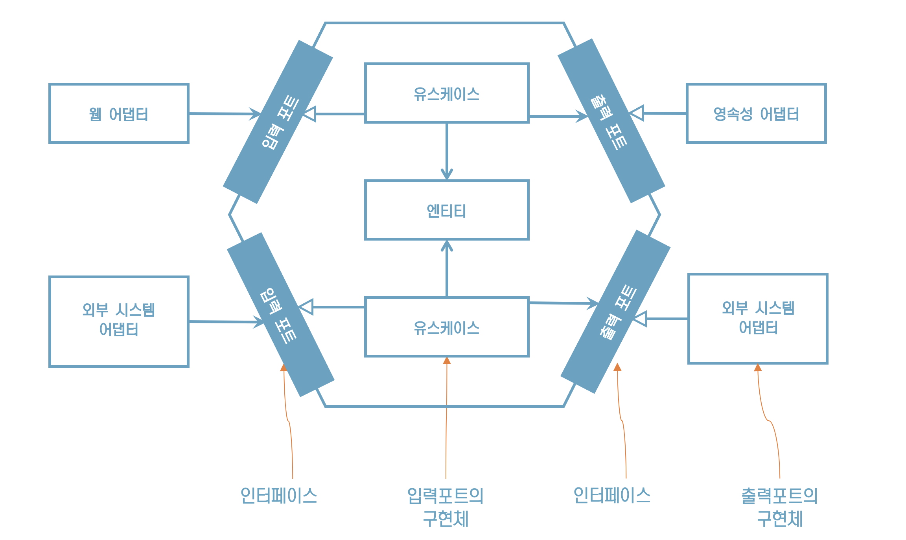
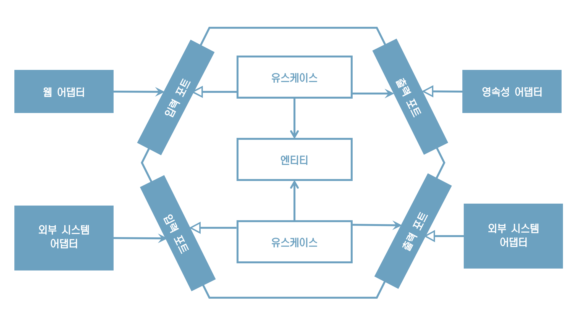

# 2. 의존성 역전하기

> 1장에서 계층형 아키텍처에 대한 불만을 이야기했으니
>
> 이번 장에서는 단일 책임 원칙과 의존성 역전 원칙 이야기로 시작해보자~

## **단일 책임 원칙**

**「** 이 원칙의 일반적인 해석 **」**

> "하나의 컴포넌트는  오로지 한 가지 일만 해야 하고, 그것을 올바르게 수행해야 한다"

* 하지만, 단일 책임 원칙의 실제 의도는 아니다
* '오로지 한 가지 일만 하는 것’은 단일 책임이라는 말을 직관적으로 해석한 것
* 단일 책임 원칙이라는 이름에 오해의 여지가 있다

## **단일 책임 원칙의 실제 정의**

**「** 이 원칙의 실제적인 정의 **」**

> ＂컴포넌트를 변경하는 이유는 오직 하나뿐이어야 한다"

“단일 책임 원칙”

'책임'은 사실' 오로지 한 가지 일만 하는 것'보다는 '변경할 이유'로 해석해야 한다.

## **아키텍처에서의 의미**

“만약 컴포넌트를 변경할 이유가 한 가지라면 우리가 어떤 다른 이유로 소프트웨어를 변경하더라도 이 컴포넌트에 대해서는 전혀 신경 쓸 필요가 없다”

“변경할 이유라는 것은 컴포넌트 간의 의존성을 통해 너무도 쉽게 전파된다”

## **컴포넌트의 의존성 관계**

시간이 갈수록 컴포넌트를 변경할 더 많은 이유가 쌓여간다

## **부수효과에** **관한 이야기**

## **의존성 역전 원칙**

* 계층형 아키텍처에서 의존성은 항상 다른 계층인 아래방향으로 가리킨다.
* 상위 계층들이 하위 계층들에 비해 변경할 이유가 더 많다.

> 영속성 코드가 바뀐다고 해서 도메인 코드가 바뀌어야 할까?

## **의존성 제거**

**「** 의존성 역전 원칙 **」**

> "코드 상의 어떤 의존성이든 그 방향을 바꿀 수(역전시킬 수) 있다"

## 의존성 역전은 어떻게 동작할까?

“도메인 코드와 영속성 코드 간의 의존성을 역전시켜서 영속성 코드가 도메인 코드에 의존하고, 도메인 코드를 '변경할 이유'의 개수를 줄여보자”

"이렇게 영속성 코드에 있는 숨막히는 의존성으로부터 도메인 로직을 해방시켰다"

## **클린 아키텍처**

로버트 C.마틴은‘클린 아키텍처’에서 설계가 비즈니스 규칙의 테스트를 용이하게 하고, 비즈니스 규칙은 프레임워크, 데이터베이스, UI 기술, 그 밖의 외부 애플리케이션이나 인터페이스부터 독립적일 수 있다고 이야기했다.

## **클린 아키텍처 설명**

## 육각형 아키텍처(헥사고날 아키텍처)

'육각형 아키텍처'는 알리스테어 콕번이 만든 용어로 로버트 C.마틴이 클린 아키텍처에서 좀 더 일반적인 용어로 설명한 것과 동일한 원칙을 적용한다.

## **어댑터**

## **포트**

## **포트와 어댑터 아키텍처**

“이런 핵심 개념으로 인해 이 아키텍처 스타일은 '포트와 어댑터' 아키텍처로 알려져 있다”

## 유지보수 가능한 소프트웨어를 만드는 데 어떻게 도움이 될까?

* 클린 아키텍처, 육각형 아키텍처, 혹은 포트와 어댑터 아키텍처의 특징 
* 의존성을 역전시켜 도메인 코드가 다른 바깥쪽 코드에 의존하지 않게 함으로써 영속성과 UI에 특화된 모든 문제로부터 
     도메인 로직의 결함을 제거하고 코드를 변경할 이유의 수를 줄일 수 있다.
* 그리고 변경할 이유가 적을수록 유지보수성은 더 좋아진다.
* 또한 도메인 코드는 비즈니스 문제에 딱 맞도록 자유롭게 모델링 될 수 있고, 영속성 코드와 UI 코드도 영속성 문제와 
     UI문제에 맞게 자유롭게 모델링 될 수 있다.