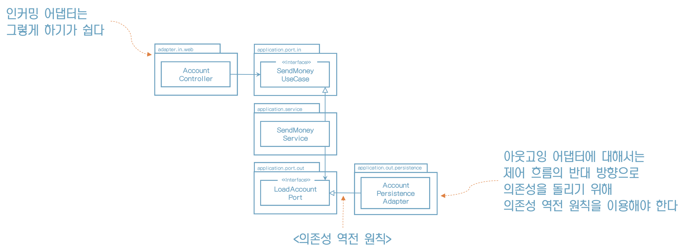

# 3. 코드 구성하기

코드를 보는 것만으로 어떤 아키텍처인지 알 수 있으면 좋지 않을까?

## **계층으로 구성하기**

"계층으로 코드를 구성하면 기능적인 측면들이 섞이기 쉽다"

## **계층으로** **구성하기의** **단점** **1**

사용자를 관리하는 기능을 추가해야 한다면,

추가적인 구조가 없다면,

"아주 빠르게 서로 연관되지 않은 기능들끼리 예상하지 못한 부수효과를 일으킬 수 있는 클래스들의 엉망진창 묶음으로 변모할 가능성이 있다"

## **계층으로** **구성하기의** **단점** **2**

AccountService와 AccountController가 어떤 유스케이스를 구현했는지 파악할 수 있겠는가?

"애플리케이션이 어떤 유스케이스들을 제공하는지 파악할 수 없다"

## **기능으로 구성하기**

"기능을 기준으로 코드를 구성하면 기반 아키텍처가 명확하게 보이지 않는다"

## **기능으로** **구성하기의** 단점

1. 아키텍처의 가시성을 훨씬 더 떨어뜨린다

2. 어댑터를 나타내는 패키지명이 없고, 인커밍 포트, 아웃고잉 포트를 확인할 수 없다

3. 접근 수준을 이용해 도메인 코드가 실수로 영속성 코드에 의존하는 것을 막을 수 없다

    

## **아키텍처적으로 표현력 있는 패키지 구조**

육각형 아키텍처의 핵심적인 요소

* 엔티티
* 유스케이스
* 인커밍/아웃고잉 포트
* 인커밍/아웃고잉 어댑터

아웃고잉 어댑터의 위치는? 

금방 찾을 수 있다

## 아키텍처-코드 갭

이 패키지 구조는 아키텍처-코드 갭 혹은 모델-코드 갭을 효과적으로 다룰 수 있는 강력한 요소다.

"대부분의 소프트웨어 개발 프로젝트에서 아키텍처가 코드에 직접적으로 매핑될 수 없는 추상적 개념이라는 사실을 보여준다"

"만약 패키지 구조가 아키텍처를 반영할 수 없다면 시간이 지남에 따라 코드는 점점 목표하던 아키텍처로부터 멀어지게 될 것이다"

## 내부 호출 방향

## **외부 호출 방향**

영속성의 데이터베이스를 교체해도 새로운 패키지에 구현하기만 하면 된다

## **DDD** **개념에 직접적으로 대응**

## **의존성 주입의 역할**

"클린 아키텍처의 가장 본질적인 요건은 애플리케이션 계층이 인커밍/아웃고잉 어댑터에 의존성을 갖지 않는 것이다"

## 유지보수 가능한 소프트웨어를 만드는 데 어떻게 도움이 될까?

* 이번 장에서는 실제 코드 구조를 우리가 원하는 육각형 아키텍처의 패키지 구조를 살펴봤다.
* 코드에서 아키텍처의 특정 요소를 찾으려면 아키텍처 다이어그램의 박스 이름을 따라 패키지 구조를 탐색하면 된다.
* 이로써 의사소통, 개발, 유지보수 모두가 조금 더 수월해진다.