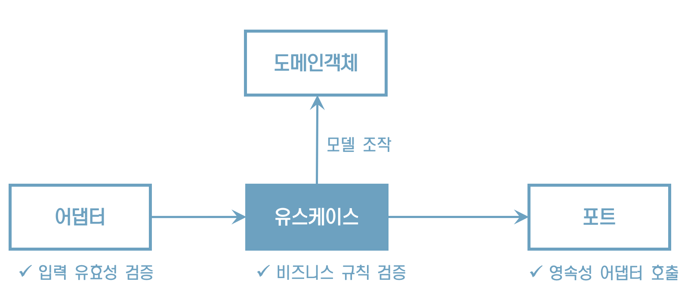
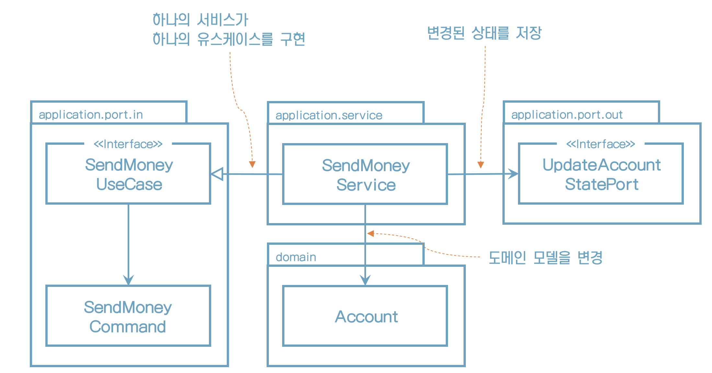
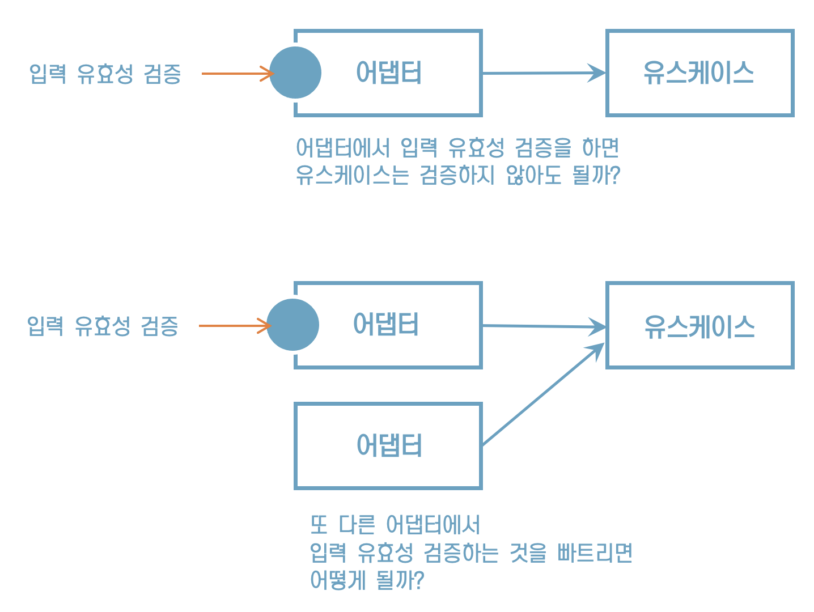
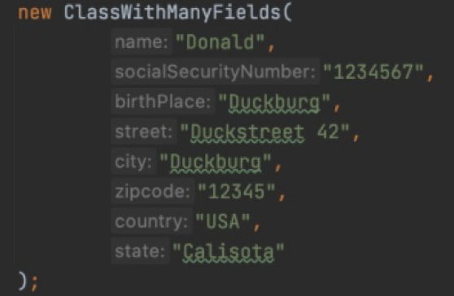
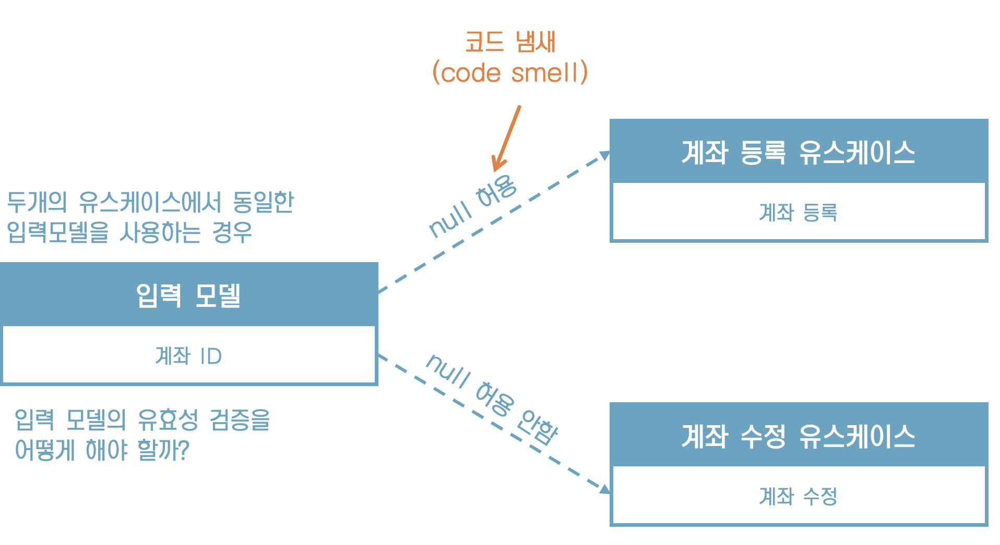
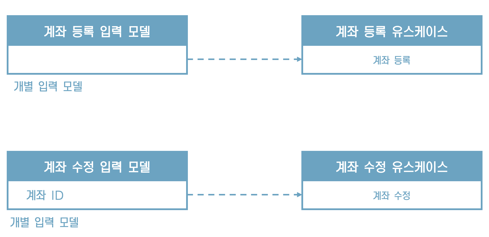
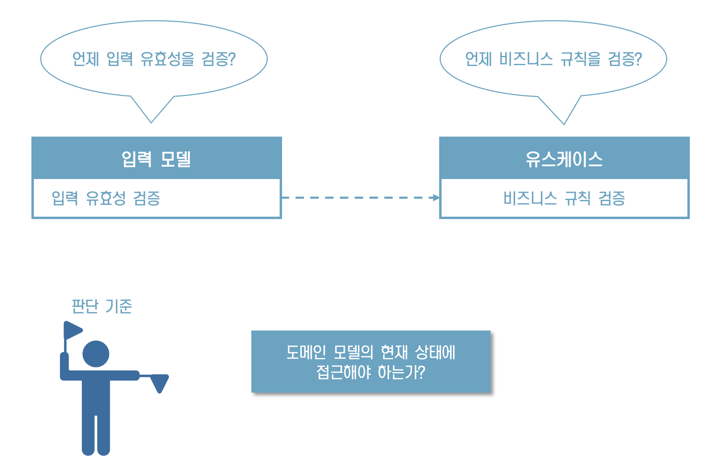
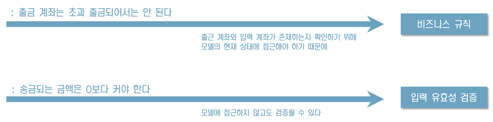
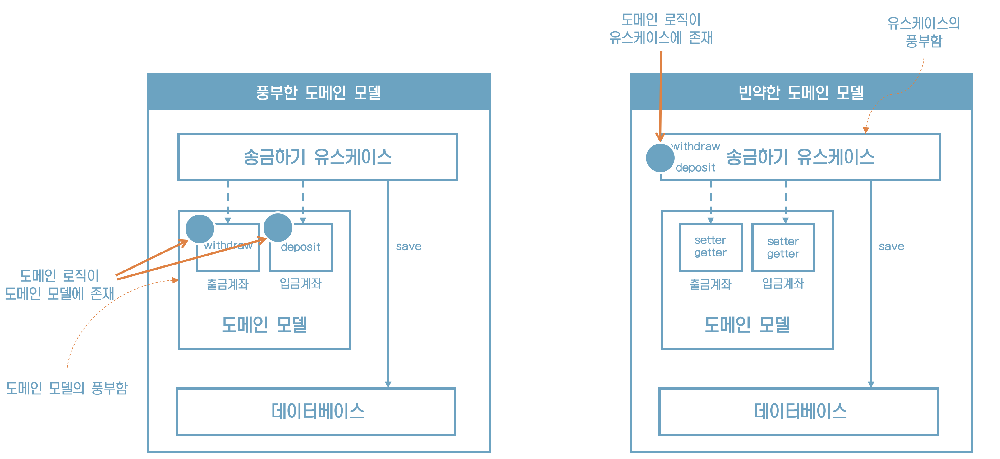
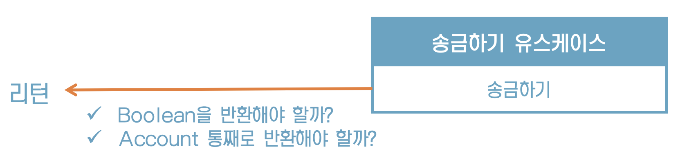

# 4. 유스케이스 구현하기

## **코드 구현하기**

앞에서 논의한 아키텍처를 실제 코드로 구현해보자

육각형 아키텍처에서 도메인 엔티티 작성으로 시작해보자


## **도메인 모델 구현하기**

“한 계좌에서 다른 계좌로 송금하는 유스케이스를 구현해보자”

```java
package buckpal.domain;

@AllArgsConstructor
@Getter
public class Account {
    private AccountId id;
    private Money baselineBalance;
    private ActivityWindow activityWindow;

    public Money calculateBalance() {
        return Money.add(
            this.baselineBalance,
            this.activityWindow.calculateBalance(this.id)
        );
    }

    public boolean withDraw(Money money, AccountId targetAccountId) {
        if (!mayWithDraw(money)) {
            return false;
        }

        Activity withDrawal = new Activity(
            this.id,
            this.id,
            targetAccountId,
            LocalDateTime.now(),
            money
        );
        this.activityWindow.addActivity(withDrawal);
        return true;
    }

    private boolean mayWithDraw(Money money) {
        return Money.add(
            this.calculateBalance(),
            money.negate()
        ).isPositive();
    }

    public boolean deposit(Money money, AccountId sourceAccountId) {
        Activity deposit = new Activity(
            this.id,
            sourceAccountId,
            this.id,
            LocalDateTime.now(),
            money
        );
        this.activityWindow.addActivity(deposit);
        return true;
    }
}
```


## **유스케이스가** **하는 일**

1. 입력을 받는다
2. 비즈니스 규칙을 검증한다
3. 모델 상태를 조작한다
4. 출력을 반환한다




## **맛보기 코드**



```java
@RequiredArgsConstructor
@Transactional
public class SendMoneyService implements SendMoneyUseCase {

    private final LoadAccountPort loadAccountPort;
    private final AccountLock accountLock;
    private final UpdateAccountStatePort updateAccountStatePort;

    @Override
    public boolean sendMoney(SendMoneyCommand command) {
        // TODO: validate business rules
        // TODO: manipuate model state
        // TODO: return output
    }
}
```


## **입력 유효성 검증**



도대체 어디서 입력 유효성을 검증해야 할까?


## **입력모델에서 유효성 검증하기**

```java
@Getter
public class SendMoneyCommand {
		private final AccountId sourceAccountId;
		private final AccountId targetAccountId;
		private final Money money;

		public SendMoneyCommand(
				AccountId sourceAccountId,
				AccountId targetAccountId,
				Money money) {
      		this.sourceAccountId = sourceAccountId;
			 this.targetAccountId = targetAccountId;
			 this.money = money;
      		requireNonNull(sourceAccountId);
      		requireNonNull(targetAccountId);
      		requireNonNull(money);
      		requireGreaterThan(money, 0);
		}
	}
```


## **Bean** **Validation** **API**

입력 모델에 있는 유효성 검증 코드를 통해 유스케이스 구현체 주위에 사실상 오류 방지 계층(anti corruption layer)을 만들었다.

```java
class SendMoneyCommand extends SelfValidating<SendMoneyCommand> {

  @NotNull
  private final AccountId sourceAccountId;

  @NotNull
  private final AccountId targetAccountId;

  @NotNull
  private final Money money;

  public SendMoneyCommand(
    AccountId sourceAccountId,
    AccountId targetAccountId,
    Money money) {
    this.sourceAccountId = sourceAccountId;
    this.targetAccountId = targetAccountId;
    this.money = money;
    this.validateSelf();
  }
}
```


필드에 지정된 Bean Validation을 검증하고 유효성 검증 규칙을 위반한 경우 예외를 던진다

```java
public abstract class SelfValidating<T> {

  private Validator validator;

  public SelfValidating() {
    ValidatorFactory factory = Validation.buildDefaultValidatorFactory();
    validator = factory.getValidator();
  }

  protected void validateSelf() {
    Set<ConstraintViolation<T>> violations = validator.validate((T) this);
    if (!violations.isEmpty()) {
      throw new ConstraintViolationException(violations);
    }
  }
}
```


## **생성자의 힘**

“생성자가 파라미터의 유효성 검증까지 하고 있기 때문에 유효하지 않은 상태의 객체를 만드는 것은 불가능하다”


## **생성자의** **파라미터** **수**

생성자의 파라미터가 더 많다면 어떻게 해야 할까?

빌더 패턴을 활용하면 더 편하게 사용할 수 있지 않을까?


```java
new SendMoneyCommandBuilder()
  	.sourceAccountId(new AccountId(41L))
  	.targetAccountId(new AccountId(42L))
  	// ... initialize many other fields
  	.build();
```


## **빌더** **패턴의 단점**

“하지만, 빌더를 호출하는 코드에 새로운 필드를 추가하는 것을 잊는 경우 컴파일러는 이처럼 유효하지 않은 상태의 불변 객체를 만들려는 시도에 대해서는 경고 해주지 못한다”

“물론 런터임에 유효성 검증 로직이 동작해서 누락된 파라미터에 대한 에러를 던지긴 한다”

“빌더 대신 생성자를 직접 사용했다면 필드 추가/삭제 시 컴파일 에러를 유발할 수 있다”

훌륭한 IDE들은 파라미터 힌트도 준다




## **유스케이스에** **동일한 입력 모델**




계좌 등록의 계좌 ID에 null이 아닌 값이 들어오면?

무시해야 할까? 에러를 던져야 할까?


## **유스케이스마다** **다른 입력 모델**

각 유스케이스 전용 입력 모델은 유스케이스를 훨씬 명확하게 만들고 다른 유스케이스와의 결합도 제거해서 불필요한 부수효과가 발생하지 않게 한다.




## **입력 유효성과 비즈니스 규칙 검증의 기준**




## 검증을 어디에 두어야 할까?




## **비즈니스 규칙 구현**

비즈니스 규칙 검증은 어떻게 구현할까?

```java
package buckpal.domain;

public class Account {
  // ...
  public boolean withdraw(Money money, AccountId targetAccountId) {
		if (!mayWithdraw(money)) {
			return false;
		}
	    // ...
}
```

“가장 좋은 방법은 '출금 계좌는 초과 인출되어서는 안 된다' 규칙에서처럼 비즈니스 규칙을 도메인 엔티티 안에 넣는 것이다”


유스케이스 코드에서 도메인 엔티티를 사용하기 전에 해도 된다

```java
@RequiredArgsConstructor
@Transactional
public class SendMoneyService implements SendMoneyUseCase {
  	// ...
  	@Override
  	public boolean sendMoney(SendMoneyCommand command) {
      	requireAccountExists(command.getSourceAccountId());
      	requireAccountExists(command.getTargetAccountId());
       }
}
```

* 유효성을 검증하는 코드를 호출하고, 유효성 검증이 실패할 경우 유효성 검증 전용 예외를 던진다.
* 사용자와 통신하는 어댑터는 이 예외를 에러 메시지로 사용자에게 보여주거나 적절한 다른 방법으로 처리한다.


## **풍부한 도메인 모델** **vs.** **빈약한 도메인 모델**




## **유스케이스마다** **다른 출력 모델**

유스케이스 결과로 무엇을 반환해야 할까?




이 질문에 정답은 없다

유스케이스 간에 다른 출력 모델을 가지면 단일 책임 원칙에 따라 결합을 제거할 수 있다


## **읽기 전용** **유스케이스는** 어떨까?

UI에 계좌의 잔액을 표시해야 한다고 가정해보자. 새로운 유스케이스를 구현해야 할까?

"계좌 잔고 보여주기" - 유스케이스가 아닌 쿼리로 구현할 수 있다

```java
@RequiredArgsConstructor
class GetAccountBalanceService implements GetAccountBalanceQuery {

	private final LoadAccountPort loadAccountPort;

	@Override
	public Money getAccountBalance(AccountId accountId) {
		return loadAccountPort.loadAccount(accountId, LocalDateTime.now())
				.calculateBalance();
	}
}
```

인커밍 전용 포트를 만들고 이를 '쿼리 서비스'에 구현하는 것이다


* 읽기 전용 쿼리는 쓰기가 가능한 유스케이스(또한 커맨드)와 코드 상에서 명확하게 구분된다.
* CQS나 CQRS 같은 개념과 아주 잘 맞는다.


## 유지보수 가능한 소프트웨어를 만드는 데 어떻게 도움이 될까?

* 입출력 모델을 독립적으로 모델링한다면 원치 않는 부수효과를 피할 수 있다.
* 물론 유스케이스 간에 모델을 공유하는 것보다는 더 많은 작업이 필요하다.
* 각 유스케이스마다 별도의 모델을 만들어야 하고, 이 모델과 엔티티를 매핑해야 한다.
* 그러나 유스케이스별로 모델을 만들면 유스케이스를 명확하게 이해할 수 있고, 장기적으로 유지보수가 더 쉽다.
* 여러 명의 다른 사람이 작업 중이 유스케이스를 건드리지 않은 채로 여러 개의 유스케이스를 동시에 작업할 수 있다.
* 꼼꼼한 입력 유효성 검증, 유스케이스별 입출력 모델은 지속 가능한 코드를 만드는 데 큰 도움이 된다.