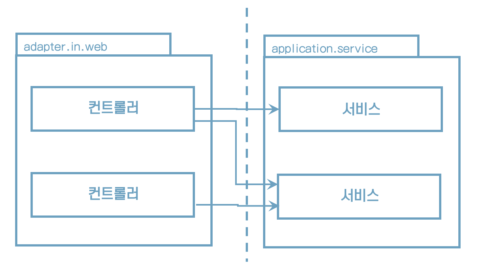

# 5. 웹 어댑터 구현하기

## **웹 어댑터의 위치**


## **웹 어댑터 호출 방향**


## 직접 호출하면 어떤 문제가?




* 서비스에 대해 많은 것을 알 수 있고
* 서비스 변경에 영향을 받을 수 있다
* 웹 어댑터는 서비스를 직접 참조
* 동일 기술(프레임워크)을 사용해야 한다


## **포트를 통한 호출을 해보자**

“서비스는 이 포트를 구현하고, 웹 어댑터는 이 포트를 호출할 수 있다”


## 어떤 장점이 있는가?

* 레거시 코드를 다루는 유지보수 엔지니어에게는 무척 소중한 정보
* 외부 세계와 통신할 수 있는 명세
* 서비스에 대해서는 몰라도 됨


## **의존성 역전 원칙**


## **실시간 데이터 전송**

웹 소켓으로 실시간 데이터를 사용자의 브라우저로 전송한다고 가정해보자


## **웹 어댑터의 책임**

1. HTTP 요청을 자바 객체로 매핑

2. 권한 검사

3. 입력 유효성 검사

4. 입력을 유스케이스의 입력 모델로 매핑

5. 유스케이스 호출

6. 유스케이스의 출력을 HTTP로 매핑

7. HTTP 응답을 반환


## **애플리케이션 계층은** **HTTP**와 관련된 것은 몰라야 한다


## 컨트롤러를 어떻게 나눌까?

웹 어댑터 컨트롤러는 하나만 만들어야 할까?

그럴 필요 없다. 웹 어댑터는 한 개 이상의 클래스로 구성해도 된다.

너무 적은것보다는 너무 많은 게 낫다,


## **컨트롤러 나누기**

```java
package buckpal.adapter.web;

@RestController
@RequiredArgsConstructor
class AccountController {
	private final GetAccountBalanceQuery getAccountBalanceQuery;
    private final ListAccountsQuery listAccountsQuery;
    private final LoadAccountQuery loadAccountQuery;
  
    private final SendMoneyUseCase sendMoneyUseCase;
    private final CreateAccountUseCase createAccountUseCase;
   
    @GetMapping("/accounts")
    List<AccountResource> listAccounts() {
        ...
    }
  
    @GetMapping("/accounts/id")
    AccountResource getAccount(@PathVariable("accountId") Long accoutId) {
        ...
    }
  
    @GetMapping("/accounts/{id}/balance")
    long getAccountBalance(@PathVariable("accountId") Long accoutId) {
        ...
    }
  
    @PostMapping("/accounts")
    AccountResource createAccount(@RequestBody AccountResource accout) {
        ...
    }
  
    @PostMapping("/accounts/send/{sourceAccountId}/{targetAccountId}/{amount}")
    void sendMoney(
        @PathVariable("sourceAccountId") Long sourceAccountId,
        @PathVariable("targetAccountId") Long targetAccountId,
        @PathVariable("amount") Long amount,
    ) {
     	... 
    }
}
```

계좌와 관련된 모든 것이 하나의 클래스에 모여 있어 괜찮아 보인다.

하지만, 이 방식의 단점은 뭘까?


## **먼저, **클래스마다 코드는 적을수록 좋다

* 라인 수가 많아지면 시간이 지남에 따라 점점 이해하기 어려워진다
* 코드가 많으면 그에 해당하는 테스트 코드도 많아진다


## **데이터 구조의 재활용**

“모든 연산을 단일 컨트롤러에 넣는 것이 데이터 구조를 재활용 하게 하는 경향이 있어”


## **가급적이면 별도의 컨트롤러를 만드는 방식을 선호한다**


## **네이밍을** **고민하라**

CreateAccount, RegisterAccount 중 어느 것이 더 좋을까?

계좌를 생성하는 유일한 방법은 사용자가 계좌를 등록하는 방법 뿐이다.

그 의미를 드러내기 위해서는 'register' 라는 단어가 더 명확하다.


## 유지보수 가능한 소프트웨어를 만드는 데 어떻게 도움이 될까?

* 웹 어댑터를 구현할 때 요청을 받아 결과를 반환하지만 어떤 도메인 로직도 수행하지 않아야 한다.
* 애플리케이션 계층은 HTTP와 관련된 작업을 해서는 안 된다.
* 웹 컨트롤러를 나눌 때는 모델을 공유하지 않는 여러 작은 클래스들로 만들어야 한다.
* 작은 클래스들은 더 파악하기 쉽고, 테스트하기 쉬우며, 동시 작업을 지원한다.
* 세분화된 클래스들은 처음에는 조금 더 공수가 들겠지만 유지보수하는 동안 분명 빛을 발할 것이다.