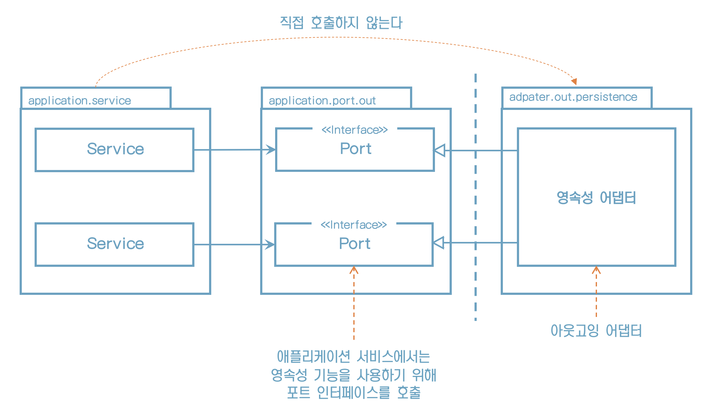
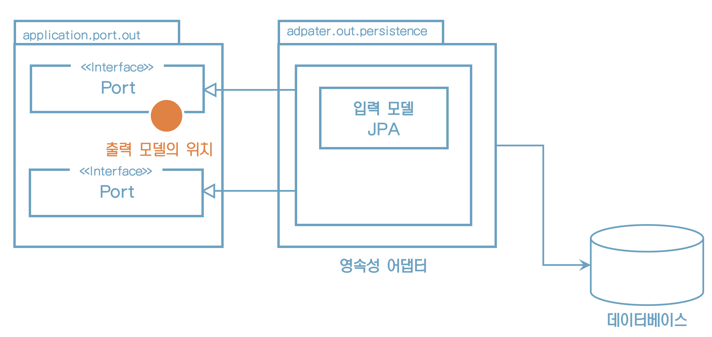
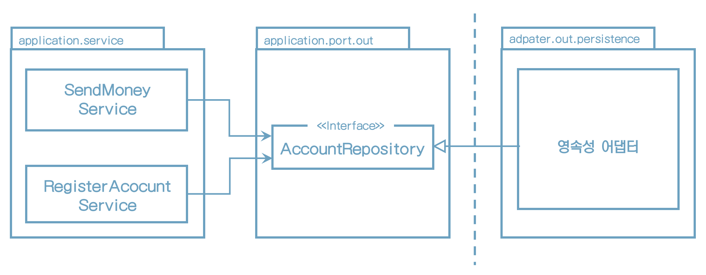
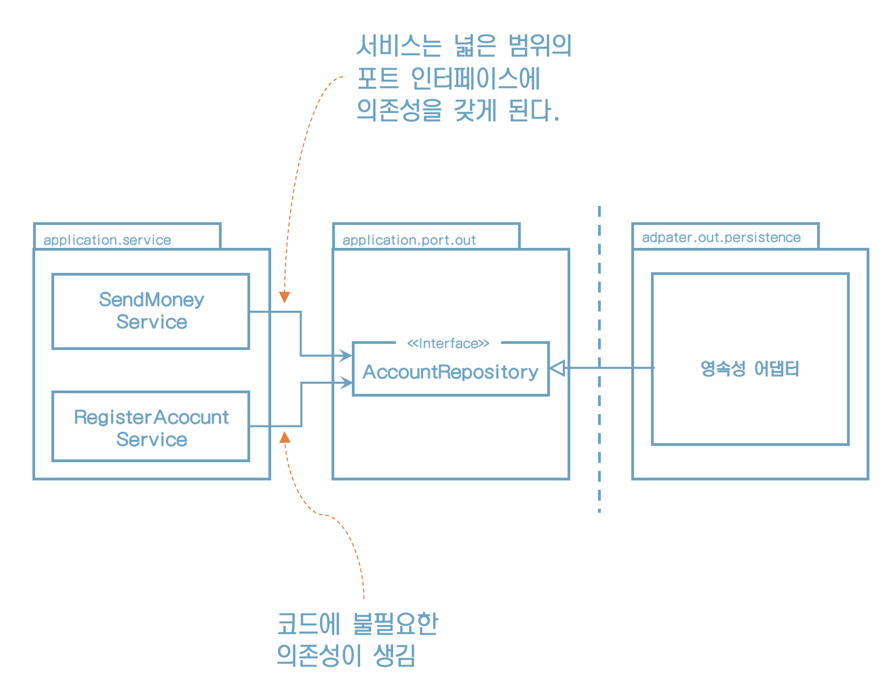
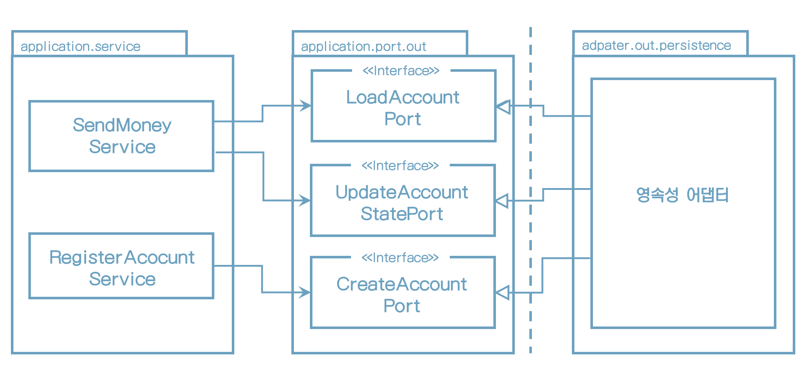
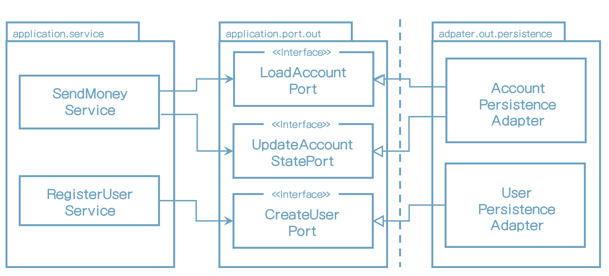
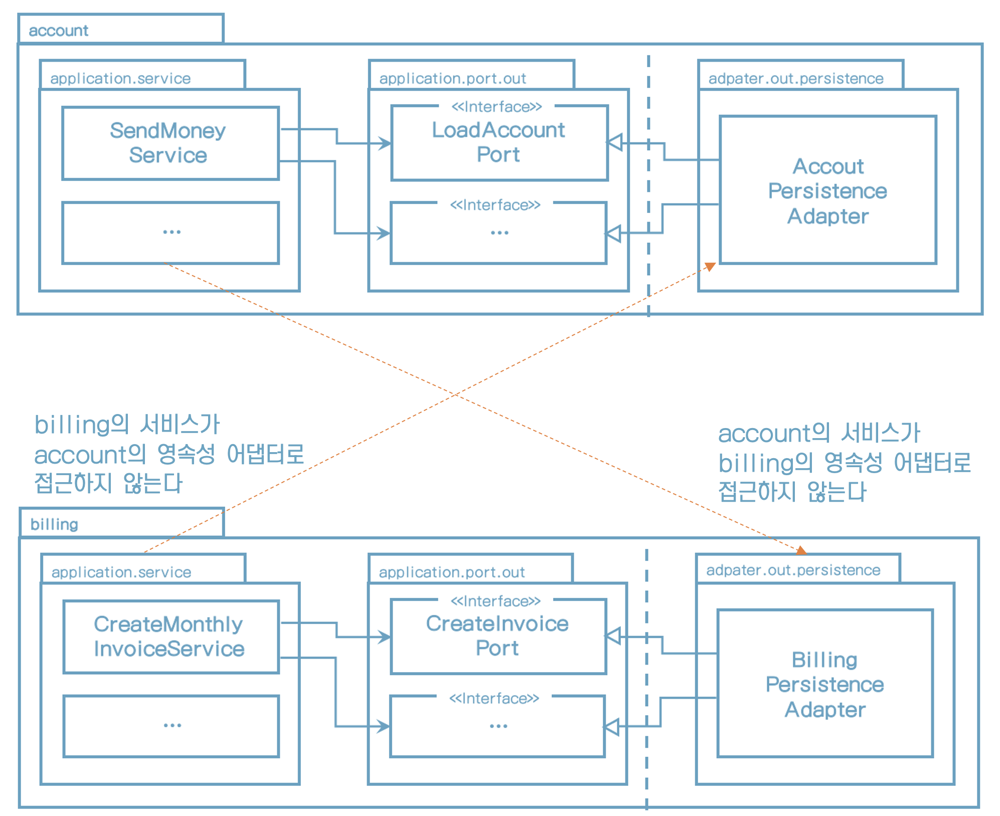

# 6. 영속성 어댑터 구현하기

## **의존성 역전**

“즉, 영속성 코드가 변경되더라도 코어 코드를 변경하지 않아도 돼”




## **의존성 어댑터의 책임**

1. 입력을 받는다.
2. 입력을 데이터베이스 포맷으로 매핑한다.
3. 입력을 데이터베이스로 보낸다.
4. 데이터베이스 출력을 애플리케이션 포맷으로 매핑한다.
5. 출력을 반환한다.


* 영속성 어댑터는 포트 인터페이스를 통해 입력을 받는다.
* 입력 모델은 인터페이스가 지정한 도메인 엔티티나 특정 데이터베이스 연산 전용 객체가 될 것이다.





## **포트 인터페이스 나누기**

데이터베이스 연산을 정의하는 포트 인터페이스를 어떻게 나눌까?


## **하나의 포트 인터페이스에 두기**

모든 데이터베이스 연산을 하나의 리포지토리 인터페이스에 넣어 두는 게 일반적인 방법이다.




## **넓은 범위의 인터페이스의 문제점**




## **인터페이스 분리 원칙**

“인터페이스 분리 원칙(ISP)이 이 문제를 풀 수 있어”


**「** 인터페이스 분리 원칙 **」**

> 이 원칙은 클라이언트가 오로지 자신이 필요로 하는 메서드만 알면 되도록 
>
> 넓은 인터페이스를 특화된 인터페이스로 분리해야 한다고 설명한다.


"필요없는 화물을 운반하는 무언가에 의존하고 있으면 예상하지 못했던 문제가 생길 수 있다"


## **인터페이스 분리 원칙 적용**

* 각 서비스는 실제로 필요한 메서드만 의존한다.
* 좁은 포트를 만드는 것은 코딩을 플러그 앤드 플레이 경험으로 만든다.





## **영속성 어댑터 나누기**

* 도메인 클래스(애그리거트) 하나당 하나의 영속성 어댑터를 구현하는 방식




애그리거트당 하나의 영속성 어댑터 접근 방식은 바운디드 컨텍스트의 영속성 요구사항을 분리하기 위한 좋은 토대가 된다.




## **스프링 데이터** **JPA** **예제**

최대한 불변성 유지

유효성 검증

풍부한 도메인 로직

```java
package buckpal.domain;

@AllArgsConstructor(access = AccessLevel.PRIVATE)
public class Account {
	@Getter private final AccountId id;
	@Getter private final ActivityWindow activityWindow;
	private final Money baselineBalance;

    public static Account withoutId(
					Money baselineBalance,
					ActivityWindow activityWindow) {
		return new Account(null, baselineBalance, activityWindow);
	}
  
    public static Account withId(
					AccountId accountId,
					Money baselineBalance,
					ActivityWindow activityWindow) {
		return new Account(
				accountId,
				baselineBalance, activityWindow);
	}
  
    public Money calculateBalance() {
      	// ...
    }
  
    public boolean withdraw(Money money, AccountId targetAccountId) {
      	// ...
    }
  
    private boolean mayWithdraw(Money money) {
      	// ...
    }
```


데이터베이스 상태 표현

```java
package buckpal.adapter.persistence;

@Entity
@Table(name = "account")
@Data
@AllArgsConstructor
@NoArgsConstructor
class AccountJpaEntity {

	@Id
	@GeneratedValue
	private Long id;

}
```


객체-모델 간의 연결을 하기 위해 JPA를 선택

하지만 개발 2~3개월이 지나면 즉시로딩/지연로딩, 캐싱 기능 등의 문제가 발생할 수 있다.

```java
package buckpal.adapter.persistence;

@Entity
@Table(name = "activity")
@Data
@AllArgsConstructor
@NoArgsConstructor
class ActivityJpaEntity {

	@Id
	@GeneratedValue
	private Long id;

	@Column
	private LocalDateTime timestamp;

	@Column
	private Long ownerAccountId;

	@Column
	private Long sourceAccountId;

	@Column
	private Long targetAccountId;

	@Column
	private Long amount;

}
```


리포지토리 인터페이스를 생성하기 위해 스프링 데이터를 사용한다

```java
interface AccountRepository extends JpaRepository<AccountJpaEntity, Long>  {
}
```


스프링 부트는 이 리포지토리를 자동으로 찾고, 스프링 데이터는 실제로 데이터베이스와 통신하는 리포지토리 인터페이스 구현체를 제공하는 마법을 부린다.

```java
interface ActivityRepository extends JpaRepository<ActivityJpaEntity, Long> {

	@Query("select a from ActivityJpaEntity a " +
			"where a.ownerAccountId = :ownerAccountId " +
			"and a.timestamp >= :since")
	List<ActivityJpaEntity> findByOwnerSince(
			@Param("ownerAccountId") Long ownerAccountId,
			@Param("since") LocalDateTime since);

	@Query("select sum(a.amount) from ActivityJpaEntity a " +
			"where a.targetAccountId = :accountId " +
			"and a.ownerAccountId = :accountId " +
			"and a.timestamp < :until")
	Long getDepositBalanceUntil(
			@Param("accountId") Long accountId,
			@Param("until") LocalDateTime until);

	@Query("select sum(a.amount) from ActivityJpaEntity a " +
			"where a.sourceAccountId = :accountId " +
			"and a.ownerAccountId = :accountId " +
			"and a.timestamp < :until")
	Long getWithdrawalBalanceUntil(
			@Param("accountId") Long accountId,
			@Param("until") LocalDateTime until);

}
```


영속성 기능을 제공하는 영속성 어댑터

```java
@RequiredArgsConstructor
@PersistenceAdapter
class AccountPersistenceAdapter implements
		LoadAccountPort,
		UpdateAccountStatePort {

	private final AccountRepository accountRepository;
	private final ActivityRepository activityRepository;
	private final AccountMapper accountMapper;

	@Override
	public Account loadAccount(
					AccountId accountId,
					LocalDateTime baselineDate) {

		AccountJpaEntity account =
				accountRepository.findById(accountId.getValue())
						.orElseThrow(EntityNotFoundException::new);

		List<ActivityJpaEntity> activities =
				activityRepository.findByOwnerSince(
						accountId.getValue(),
						baselineDate);

		Long withdrawalBalance = orZero(activityRepository
				.getWithdrawalBalanceUntil(
						accountId.getValue(),
						baselineDate));

		Long depositBalance = orZero(activityRepository
				.getDepositBalanceUntil(
						accountId.getValue(),
						baselineDate));

		return accountMapper.mapToDomainEntity(
				account,
				activities,
				withdrawalBalance,
				depositBalance);

	}

	private Long orZero(Long value){
		return value == null ? 0L : value;
	}


	@Override
	public void updateActivities(Account account) {
		for (Activity activity : account.getActivityWindow().getActivities()) {
			if (activity.getId() == null) {
				activityRepository.save(accountMapper.mapToJpaEntity(activity));
			}
		}
	}
}
```


## 도메인 모델을 데이터베이스 모델로 사용하면 안될까?

AccountJpaEntity와 ActivityJpaEntity를 사용하지 말고 Account와 Activity 클래스에 JPA 애너테이션으로 사용하면 안되나?

JPA 엔티티는 기본 생성자가 필요하다. 영속성 계층에서는 성능 측면에서 @ManyToOne 관계를 설정하는 것이 적절할 수 있지만, 도메인 모델에서는 반대가 되기를 원한다.


>  "그러므로 영속성 측면과 타협 없이 풍부한 도메인 모델을 생성하고 싶다면 도메인 모델과 영속성 모델을 매핑하는 것이 좋다"


## 데이터베이스 트랜잭션은 어떻게 해야 할까?

트랜잭션 경계는 어디에 위치시켜야 할까?

영속성 어댑터 호출을 관장하는 서비스에 위임해야 한다

스프링에서 가장 쉬운 방법은 @Transactional을 붙이는 것


```java
package buckpal.application.service;

@Transactional
public class SendMoneyService implements SendMoneyUseCase {
  	...
}
```


## **유지보수 가능한 소프트웨어를 만드는 데 어떻게 도움이 될까**?

* 도메인 코드에 플러그인처럼 동작하는 영속성 어댑터를 만들면 도메인 코드가 영속성과 관련된 것들로부터 분리되어 풍부한 도메인 모델을 만들 수 있다.
* 좁은 포트 인터페이스를 사용하면 포트마다 다른 방식으로 구현할 수 있는 유연함이 생긴다.
* 심지어 포트 뒤에서 애플리케이션이 모르게 다른 영속성 기술을 사용할 수도 있다.
* 포트의 명세만 지켜진다면 영속성 계층 전체를 교체할 수도 있다.