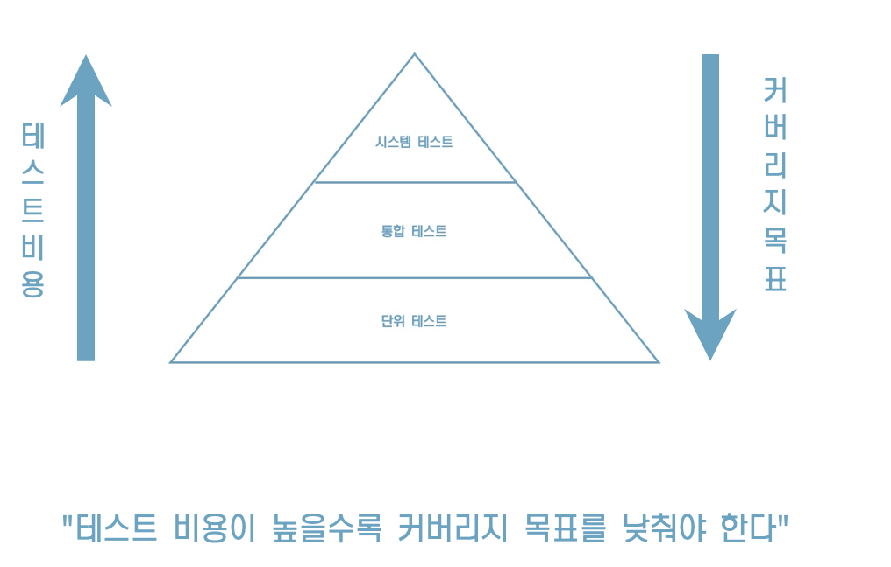
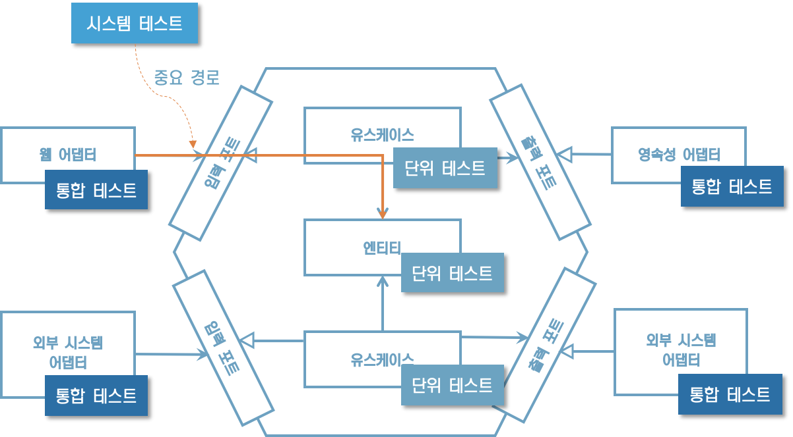

# 7. 아키텍처 요소 테스트하기

## **테스트 피라미드**

"테스트의 기본 전제"

* 비용이 적고,
* 유지보수하기 쉽고,
* 빨리 실행되고,
* 안정적인 작은 크기의 테스트에 대해 높은 커버리지를 유지해야 한다 





## **단위 테스트로 도메인** **엔티티** **테스트하기**

* 이 테스트는 만들고 이해하기 쉬운 편이고,아주 빠르게 실행된다.
* 단위 테스트는 도메인 엔티티에 녹아있는 비즈니스 규칙을 검증하기에 가장 적절한 방법이다.
* 도메인 엔티티의 행동은 다른 클래스에 거의 의존하지 않기 때문에 다른 종류의 테스트는 필요하지 않다.


Account를 인스턴스화하고 withdraw() 메서드가 성공했는지 검증하는 단위 테스트

```java
class AccountTest {

	@Test
	void withdrawalSucceeds() {
		AccountId accountId = new AccountId(1L);
		Account account = defaultAccount()
				.withAccountId(accountId)
				.withBaselineBalance(Money.of(555L))
				.withActivityWindow(new ActivityWindow(
						defaultActivity()
								.withTargetAccount(accountId)
								.withMoney(Money.of(999L)).build(),
						defaultActivity()
								.withTargetAccount(accountId)
								.withMoney(Money.of(1L)).build()))
				.build();

		boolean success = account.withdraw(Money.of(555L), new AccountId(99L));

		assertThat(success).isTrue();
		assertThat(account.getActivityWindow().getActivities()).hasSize(3);
		assertThat(account.calculateBalance()).isEqualTo(Money.of(1000L));
	}
}
```


## **단위 테스트로** **유스케이스** **테스트하기**

SendMoneyService의 출금 유스케이스 테스트

```java
class SendMoneyServiceTest {
    // declaration of fields omitted
    
    @Test
	void transactionSucceeds() {

		Account sourceAccount = givenSourceAccount();
		Account targetAccount = givenTargetAccount();

		givenWithdrawalWillSucceed(sourceAccount);
		givenDepositWillSucceed(targetAccount);

		Money money = Money.of(500L);

		SendMoneyCommand command = new SendMoneyCommand(
				sourceAccount.getId().get(),
				targetAccount.getId().get(),
				money);

		boolean success = sendMoneyService.sendMoney(command);

		assertThat(success).isTrue();

		AccountId sourceAccountId = sourceAccount.getId().get();
		AccountId targetAccountId = targetAccount.getId().get();

		then(accountLock).should().lockAccount(eq(sourceAccountId));
		then(sourceAccount).should().withdraw(eq(money), eq(targetAccountId));
		then(accountLock).should().releaseAccount(eq(sourceAccountId));

		then(accountLock).should().lockAccount(eq(targetAccountId));
		then(targetAccount).should().deposit(eq(money), eq(sourceAccountId));
		then(accountLock).should().releaseAccount(eq(targetAccountId));

		thenAccountsHaveBeenUpdated(sourceAccountId, targetAccountId);
	}
  
    // helper methods omitted
}
```


## **테스트는 중요한 핵심만**

모든 동작을 검증해는 대신, 중요한 핵심만 골라 집중해서 테스트하는 것이 좋다.

왜냐하면, 모든 동작을 검증하려고 하면  테스트를 너무 자주 변경해야 한다. 이는 테스트의 가치를 떨어뜨리는 일이다.


## **통합 테스트로 웹 어댑터 테스트하기**

* 웹 어댑터는 JSON 문자열 등의 형태로 HTTP를 통해 입력을 받고,
* 입력에 대한 유효성 검증을 하고,
* 유스케이스에서 사용할 수 있는 포맷을 매핑하고,
* 유스케이스에 전달한다.
* 그리고 나서 다시 유스케이스의 결과를 JSON으로 매핑하고
* HTTP 응답을 통해 클라이언트에 반환했다.


## **웹 어댑터 테스트 코드**

```java
@WebMvcTest(controllers = SendMoneyController.class)
class SendMoneyControllerTest {

	@Autowired
	private MockMvc mockMvc;

	@MockBean
	private SendMoneyUseCase sendMoneyUseCase;

	@Test
	void testSendMoney() throws Exception {

		mockMvc.perform(post("/accounts/send/{sourceAccountId}/{targetAccountId}/{amount}",
				41L, 42L, 500)
				.header("Content-Type", "application/json"))
				.andExpect(status().isOk());

		then(sendMoneyUseCase).should()
				.sendMoney(eq(new SendMoneyCommand(
						new AccountId(41L),
						new AccountId(42L),
						Money.of(500L))));
	}
}
```

이 코드는 SendMoneyController라는 웹 컨트롤러를 테스트하는 표준적인 통합 테스트 방법이다

목 HTTP 요청을 웹 컨트롤러에 보낸다. 실제 HTTP 프로토콜로 테스트 한 것은 아니다.

isOk() 메서드로 HTTP 응답의 상태가 200임을 검증

웹 컨트롤러가 스프링 프레임워크에 강하게 묶여 있기 때문에 격리된 상태로 테스트하기 보다는 이 프레임워크와 통합된 상태로 테스트하는 것이 합리적이

다.


## **통합 테스트로 영속성 어댑터 테스트하기**

* 영속성 어댑터의 테스트에는 단위 테스트보다는 통합 테스트를 적용하는 것이 합리적이다.
* 단순희 어댑터의 로직만 검증하고 싶은 게 아니라 데이터베이스 매핑도 검증하고 싶기 때문이다.


## **영속성 어댑터 테스트 코드 설명**

```java
@DataJpaTest
@Import({AccountPersistenceAdapter.class, AccountMapper.class})
class AccountPersistenceAdapterTest {

	@Autowired
	private AccountPersistenceAdapter adapterUnderTest;

	@Autowired
	private ActivityRepository activityRepository;

	@Test
	@Sql("AccountPersistenceAdapterTest.sql")
	void loadsAccount() {
		Account account = adapterUnderTest.loadAccount(new AccountId(1L), 
                                                   LocalDateTime.of(2018, 8, 10, 0, 0));

		assertThat(account.getActivityWindow().getActivities()).hasSize(2);
		assertThat(account.calculateBalance()).isEqualTo(Money.of(500));
	}

	@Test
	void updatesActivities() {
		Account account = defaultAccount()
				.withBaselineBalance(Money.of(555L))
				.withActivityWindow(new ActivityWindow(
						defaultActivity()
								.withId(null)
								.withMoney(Money.of(1L)).build()))
				.build();

		adapterUnderTest.updateActivities(account);

		assertThat(activityRepository.count()).isEqualTo(1);

		ActivityJpaEntity savedActivity = activityRepository.findAll().get(0);
		assertThat(savedActivity.getAmount()).isEqualTo(1L);
	}
}
```

@DataJpaTest로 스프링 데이터 리포지토리를 포함해서 데이터베이스 접근에 필요한 객체 네트워크를 인스턴스화해야 한다고 스프링에 알려준다

loadAccount() 메서드에 대한 테스트에서는 SQL 스크립트를 이용해 데이터베이스를 특정 상태로 만든다.

updateActivities()에서 새로운 계좌 활동을 가진 Account 객체를 만들어서 저장하기 위해 어댑터로 전달한다.

그리고 나서 ActivityRepository를 통해 데이터베이스에 잘 저장됐는지 확인한다.


## **시스템 테스트로 주요 경로 테스트하기**

* 시스템 테스트는 전체 애플리케이션을 띄우고 API를 통해 요청을 보내고, 모든 계층이 조화롭게 잘 동작하는지 검증한다.


## **주요 경로 테스트 코드**

```java
@SpringBootTest(webEnvironment = WebEnvironment.RANDOM_PORT)
class SendMoneySystemTest {

	@Autowired
	private TestRestTemplate restTemplate;

	@Autowired
	private LoadAccountPort loadAccountPort;

	@Test
	@Sql("SendMoneySystemTest.sql")
	void sendMoney() {

		Money initialSourceBalance = sourceAccount().calculateBalance();
		Money initialTargetBalance = targetAccount().calculateBalance();

		ResponseEntity response = whenSendMoney(
				sourceAccountId(),
				targetAccountId(),
				transferredAmount());

		then(response.getStatusCode())
				.isEqualTo(HttpStatus.OK);

		then(sourceAccount().calculateBalance())
				.isEqualTo(initialSourceBalance.minus(transferredAmount()));

		then(targetAccount().calculateBalance())
				.isEqualTo(initialTargetBalance.plus(transferredAmount()));

	}

	private ResponseEntity whenSendMoney(
			AccountId sourceAccountId,
			AccountId targetAccountId,
			Money amount) {
		HttpHeaders headers = new HttpHeaders();
		headers.add("Content-Type", "application/json");
		HttpEntity<Void> request = new HttpEntity<>(null, headers);

		return restTemplate.exchange(
				"/accounts/send/{sourceAccountId}/{targetAccountId}/{amount}",
				HttpMethod.POST,
				request,
				Object.class,
				sourceAccountId.getValue(),
				targetAccountId.getValue(),
				amount.getAmount());
	}
}
```


## **얼마만큼의** **테스트면** **충분할까**?

테스트가 코드의 80%를 커버하면 충분할까?

라인 커버리지 100%는 버그가 잘 잡혔는지 확신할 수 있을까?


* 얼마나 마음 편하게 소프트웨어를 배포할 수 있느냐를 테스트의 성공 기준으로 삼으면 된다고 생각한다.
* 더 자주 배포할수록 테스트를 더 신뢰할 수 있다.
* 일 년에 두 번만 배포된다면 테스트를 신뢰할 수 없을 것이다.


## **테스트 전략**

다음은 육각형 아키텍처에서 사용하는 전략이다.




* 테스트가 개발 후가 아닌 개발 중에 이뤄진다면 하기 싫은 귀찮은 작업이 아니라 개발 도구로 느껴질 것이다.

* 하지만 새로운 필드를 추가할 때마다 테스트를 고치는 데 한 시간을 써야한다면 뭔가 잘못된 것이다.
* 리팩터링할 때마다 테스트 코드도 변경해야 한다면 테스트는 테스트로서의 가치를 잃는다.


## **유지보수 가능한 소프트웨어를 만드는 데 어떻게 도움이 될까**?

* 육각형 아키텍처는 도메인 로직과 바깥으로 향한 어댑터를 깔끔하게 분리한다.
* 덕분에 핵심 도메인 로직은 단위 테스트로, 어댑터는 통합 테스트로 처리하는 명확한 테스트 전략을 정의할 수 있다.
* 만약 포트가 아주 작고 핵심만 담고 있다면 모킹하는 것은 아주 쉽다.
* 모킹하는 것이 너무 버거워지거나 어떤 테스트를 써야 할지 모르겠다면 이는 경고 신호다.