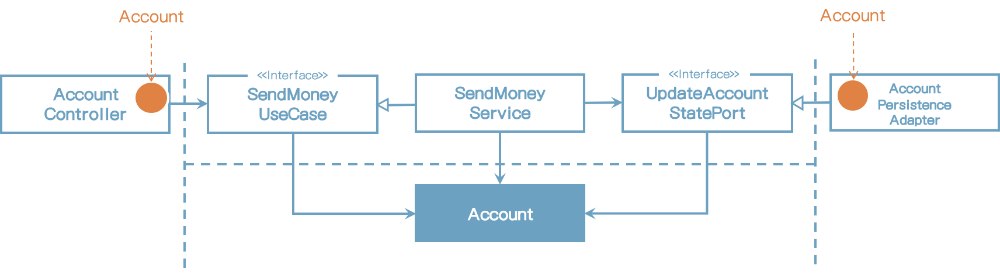
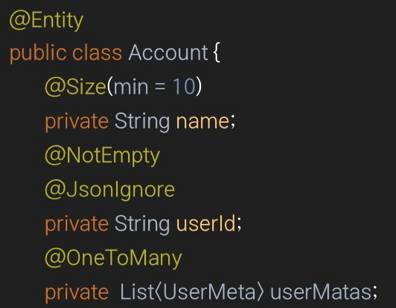
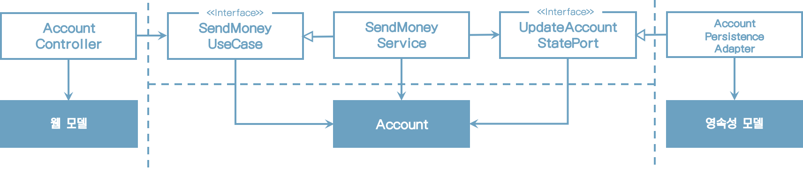
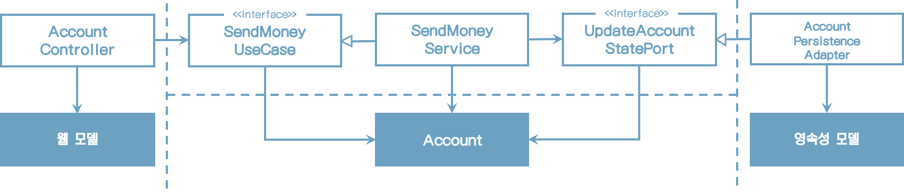
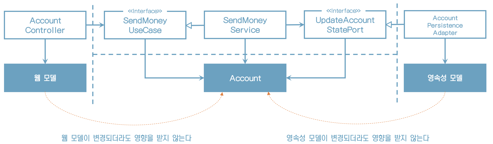
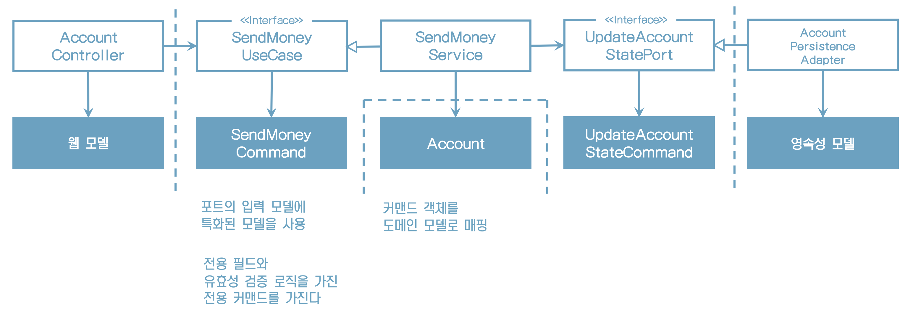
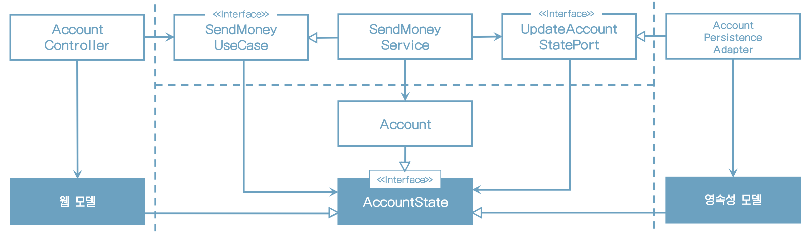
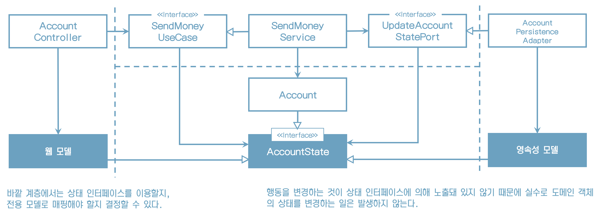

# 8. 경계 간 매핑하기

## **매핑에 대한 논쟁**

> <매핑에 찬성하는 개발자>
>
> 매핑은 반드시 사용해야 합니다
>
> 두 계층 간에 매핑을 하지 않으면 양 계층에서 같은 모델을 사용해야 하는데 이렇게 하면 두 계층이 강하게 결합됩니다

>  <매핑에 반대하는 개발자>
>
> 매핑은 불필요해요
>
> 하지만 두 계층간에 매핑을 하게 되면 보일러플레이트 코드를 너무 많이 만들게 돼요. 많은 유스케이스들이 오직 CRUD만 수행하고 계층에 걸쳐 같은 모델을 사용하기 때문에 계층 사이의 매핑은 과합니다.

## **'매핑하지 않기' 전략**

* 유스케이스에서 Account 객체를 인자를 가진다. 즉 웹 계층과 애플리케이션 계층 모두 Account 클래스에 접근해야 한다.
* 영속성 계층과 애플리케이션 계층도 같은 관계다.

## **'매핑하지 않기' 전략 문제점**

* 웹, 애플리케이션, 영속성 계층과 관련된 이유로 인해 변경돼야 하기 때문에 단일 책임 원칙을 위반한다.

웹 계층에 REST로 모델을 노출시켰다면 모델을 JSON으로 직렬화하기 위한 애너테이션을 모델 클래스의 특정 필드에 붙어야 할 수도 있다.

ORM 프레임워크를 사용한다면 데이터베이스 매핑을 위한 특정 애너테이션이 필요

## **'매핑하지 않기' 전략을 사용하지 말아야 하나?**

모델이 동일하다면

* 반드시 매핑할 필요는 없다.
* JSON이나 ORM 애너테이션 한 두개 바꾸는 건 큰 일은 아니다.

"하지만 애플리케이션 계층이나 도메인 계층에서 웹과 영속성 문제를 다루게 된다면 다른 전략을 취해야 한다"

"어떤 매핑 전략을 선택했더라도 나중에 언제든 바꿀 수 있다는 것이다"

## **'양방향' 매핑 전략**

* 각 계층이 전용 모델을 가진 매핑 전략을 '양방향(Two-Way)' 매핑 전략이라고 한다.

웹 모델을 인커밍 포트에서 필요한 도메인 모델로 매핑하고 인커밍 포트에 의해 반환된 도메인 객체를 다시 웹 모델로 매핑한다

영속성 계층은 아웃고잉 포트가 사용하는 도메인 모델과 영속성 모델 간의 매핑과 유사한 매핑을 담당한다

## **'양방향' 매핑 특징**

* 각 계층이 전용 모델을 가지고 있어서 모델을 변경하더라도 다른 계층에는 영향이 없다.
* 웹이나 영속성 관심사로 오염되지 않는 깨끗한 도메인 모델로 단일 책임 원칙을 만족한다.

## **'양방향' 매핑의 또 다른 장점**

* 매핑하지 않기 전략 다음으로 간단한 전략이다. 매핑 책임이 명확하다.
* 안쪽 계층은 해당 계층의 모델만 알면 되고 매핑 대신 도메인 로직에 집중할 수 있다.

## **'양방향' 매핑의 단점**

1) 너무 많은 보일러플레이트 코드가 생긴다
    1) 두 모델 간 매핑을 구현하는 데는 꽤 시간이든다.
    2) 매핑 프레임워크나 내부 동작 방식을 제네릭 코드와 리플렉션 뒤로 숨길 경우 매핑 로직을 디버깅하는 것은 
         꽤나 고통스럽다.
2) 도메인 모델이 계층 경계를 넘어서 통신하는 데 사용되고 있다는 것이다
    1) 인커밍 포트와 아웃고잉 포트는 도메인 객체를 입력 파라미터와 반환값으로 사용한다.
    2) 도메인 모델은 도메인 모델의 필요에 의해서만 변경되는 것이 이상적이지만 바깥쪽 계층의 요구에 따른 변경에 취약해지는 것이다.

“어떤 매핑 전략도 철칙처럼 여겨져서는 안 된다. 그 대신 각 유스케이스마다 적절한 전략을 택할 수 있어야 한다”

* 양방향 매핑 전략도 은총알(silver bullet)이 아니다.
* 어떤 매핑 전략도 철칙처럼 여겨져서는 안 된다.  그 대신 각 유스케이스마다 적절한 전략을 택할 수 있어야 한다.

## **'완전' 매핑 전략**

* 이 매핑 전략은 각 연산마다 별도의 입출력 모델을 사용한다.

## **'완전' 매핑 설명**

* 이 매핑 전략을 전략 패턴으로 추천하지 않는다.
* 이 전략은 웹 계층과 애플리케이션 계층 사이에서 상태 변경 유스케이스의 경계를 명확하게 할 때 가장 빛을 발한다.
* 애플리케이션 계층과 영속성 계층 사이에서는 매핑 오버헤드 때문에 사용하지 않는 것이 좋다.

## **'단방향' 매핑 전략**

* 이 전략에서는 모든 계층의모델들이 같은 인터페이스를 구현한다.
* 이 인터페이스는 관련 있는 특성에 대한 getter 메서드를 제공하여 도메인 모델의 상태를 캡슐화한다.

* 도메인 모델 자체는 풍부한 행동을 구현할 수 있고, 애플리케이션 계층 내의 서비스에서 이러한 행동에 접근할 수 있다.
* 도메인 객체를 바깥 계층으로 전달하고 싶으면 매핑 없이 할 수 있다.

* 한 계층이 다른 계층으로부터 객체를 받으면 해당 계층에서 이용할 수 있도록 다른 무언가로 매핑하는 것이다. 그러므로 각 계층은 한 방향으로만 매핑한다.

바깥 계층에서는 애플리케이션 계층으로 전달하는 객체들도 이 상태 인터페이스를 구현하고 있다.

애플리케이션 계층에서는 이 객체를 실제 도메인 모델로 매핑해서 도메인 모델의 행동에 접근할 수 있게 된다.

## **언제 어떤 매핑 전략을 사용할 것인가?**

이 질문의 답은, ‘그때그때 다르다’이다.

각 매핑 전략이 장단점을 갖고 있기 때문에 한 전략을 전체 코드에 동일하게 적용하면 안된다.

## **팀 내 가이드라인**

팀 내 가이드라인이 필요한가?

그렇다. 어떤 상황에서 어떤 매핑 전략을 가장 먼저 택해야 하는가, 또한 왜 해당 전략을 택해야 하는지도 설명할 수 있어야 한다

## **매핑 전략은 진화해가는 것**

매핑방법이 한번 정해지면 변경하면 안되는 것인가?

소프트웨어는 시간이 지나면서 변화를 거듭하기 때문에, 어제는 최선이었던 전략이 오늘은 최선이 아닐 수 있다.

고정된 매핑 전략으로 계속 유지하기보다는 빠르게 코드를 짤 수 있는 간단한 전략으로 시작해서 복잡한 전략으로 갈아타는 것도 괜찮은 방법이다.

## **유지보수 가능한 소프트웨어를 만드는 데 어떻게 도움이 될까?**

* 계층 사이에서 인커밍 포트와 아웃고잉 포트는 서로 다른 계층이 어떻게 통신해야 하는지를 정의한다. 여기에는 계층 사이에 매핑을 수행할지 여부와 어떤 매핑 전략을 선택할지가 포함된다.
* 각 유스케이스에 대해 좁은 포트를 사용하면 유스케이스마다 다른 매핑 전략을 사용할 수 있고, 다른 유스케이스에 영향을 미치지 않고 코드를 개선할 수 있다.
* 상황별로 매핑 전략을 선택하는 것은 동일한 매핑 전략을 사용하는 것보다 더 어렵겠지만 매핑 가이드라인이 있는 한 더 유지보수하기 쉬운 코드로 팀에 보상이 되어 돌아올 것이다.