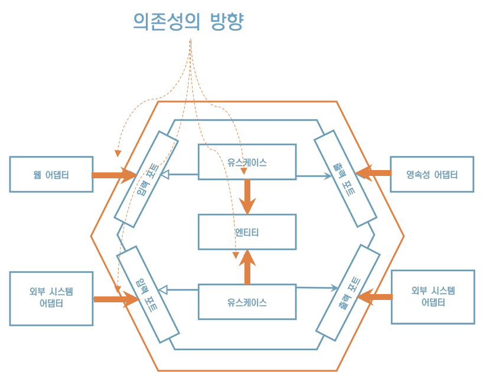
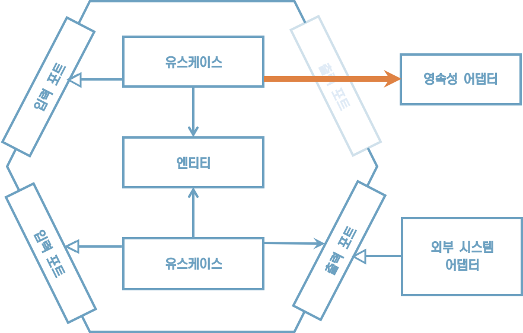
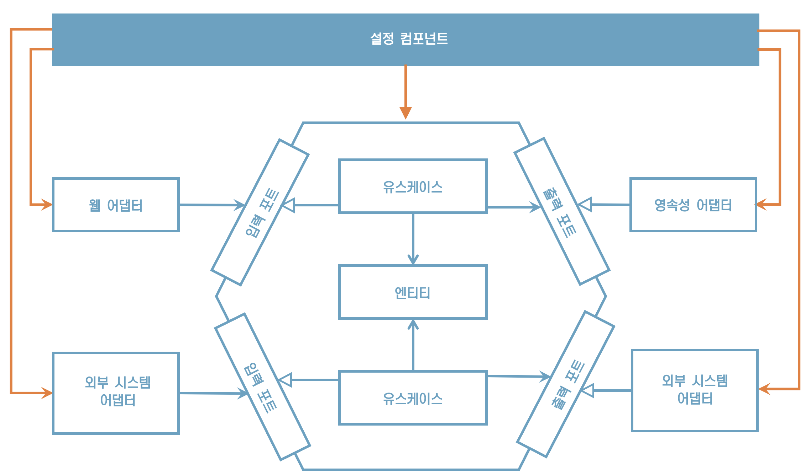

# 9. 애플리케이션 조립하기

## **의존성의 방향**

유스케이스와 어댑터를 그냥 필요할 때 인스턴스화하면 안 되는걸까?

코드의 의존성이 올바른 방향을 가리키게 하기 위해서다.



"애플리케이션 도메인 코드 방향으로 향해야 도메인 코드가 바깥 계층의 변경으로부터 안전하다"


## **영속성 어댑터를 직접 호출**

영속성 어댑터를 직접 호출한다면?




## **잘못된 의존성 방향**

코드 의존성이 잘못된 방향으로 만들어진 것이다.

또한 어댑터에 대한 목객체를 활용하여 테스트하기 쉽다.

아웃고잉 포트 인터페이스를 생성한 이유


## **객체 인스턴스를 생성할 책임은 누구에게?**

아키텍처에 중립적이고 인스턴스 생성을 위해 모든 클래스에 의존성을 가지는 설정 컴포넌트가 그 책임을 갖는다




## **설정 컴포넌트 책임**

* 웹 어댑터 인스턴스 생성
* HTTP 요청이 실제로 웹 어댑터로 전달되도록 보장
* 유스케이스 인스턴스 생성
* 웹 어댑터에 유스케이스 인스턴스 제공
* 영속성 어댑터 인스턴스 생성
* 유스케이스에 영속성 어댑터 인스턴스 제공
* 영속성 어댑터가 실제로 데이터베이스에 접근할 수 있도록 보장


또한, 설정 파일이나 커맨드라인 파라미터 같은 설정 파라미터 소스에도 접근 


## **단일 책임 원칙 위반**

설정 컴포넌트의 책임이 너무 많아 단일 책임 원칙을 위반한거 아냐?

위반한게 맞아

하지만 나머지부분을 깔끔하게 유지하고 싶으면 이런 컴포넌트를 별도로 두는 것이 좋아


## **평범한 코드로 조립하기**

```java
package copyeditor.configuration;

class Application {
    public static void main(String [] args) {
        AccountRepository accountRepository = new AccountRepository();
        ActivityRepository acitivityRepository = new ActivityRepository();
        AccountPersistenceAdapter accountPersistenceAdapter =
          new AccountPersistenceAdapter(accountRepository, activityRepository);
      
        SendMoneyUseCase sendMoneyUseCase = new SendMoneyUseService(
            accountPersistenceAdapter, // LoadAccountPort
            accountPersistenceAdapter, // UpdateAccountStatePort
        );
      
       SendMoneyController sendMoneyController = 
         new SendMoneyController(sendMoneyUseCase);
      
       startProcessingWebRequests(sendMoneyController); 
    }
}
```


## **평범한 코드로** **조립하기의** **단점**

1) 코드가 복잡해진다
    1) 앞의 코드는 웹 컨트롤러, 유스케이스, 영속성 어댑터가 단 하나씩만 있는 예제
    2) 엔터프라이즈 애플리케이션을 실행하기 위해서는 이러한 코드를 얼마나 많이 만들어야 할지 상상해보라.
2) 모든 클래스가 public이어야 한다
    1) 각 클래스가 속한 패키지 외부에서 인스턴스를 생성하기 때문에 전부 public이어야 한다.
    2) 이렇게 되면 유스케이스가 영속성 어댑터에 직접 접근하는 것을 막지 못한다.
    3) package-private 접근 제한자를 이용해서 이러한 원치 않은 의존성을 피할 수 있었다면 더 좋았을 것이다.


## **스프링으로 조립하기**

애플리케이션 컨텍스트 (application context)

* 스프링 프레임워크를 이용해서 애플리케이션을 조립한 결과물
* 애플리케이션을 구성하는 모든 객체(자바 용어로는 빈(bean))를 포함한다


스프링으로 애플리케이션 컨텍스트를 조립하는 방법

1. 클래스패스 스캐닝
2. 자바 컨피그


## **스프링의** **클래스패스** **스캐닝으로 조립하기**

```java
@RequiredArgsConstructor
@PersistenceAdapter
class AccountPersistenceAdapter implements
		LoadAccountPort,
		UpdateAccountStatePort {

	private final AccountRepository accountRepository;
	private final ActivityRepository activityRepository;
	private final AccountMapper accountMapper;

	@Override
	public Account loadAccount(
					AccountId accountId,
					LocalDateTime baselineDate) {
	    // ...
      }
      
      @Override
	public void updateActivities(Account account) {
    	// ...
    }
}
```

스프링은 클래스패스 스캐닝으로 클래스패스에서 접근 가능한 모든 클래스를 확인하여 @Component 애너테이션이 붙은 클래스를 찾는다. 그리고 나서 클래스의 객체를 생성한다.


## **클래스패스** **스캐닝의 단점**

1. 스프링에 특화된 애너테이션
    1. 코드를 특정한 프레임워크와 결합시킨다.
    2. 일반적인 애플리케이션 개발에서 애너테이션 하나 정도는 용인할 수 있고, 리팩토링도 그리 어렵지 않다.
    3. 하지만 라이브러라나 프레임워크를 만드는 입장에서는 사용하지 말아야 한다.
2. 에러를 찾는 시간이 오래 걸림
    1. 스프링 전문가가 아니라면 원인을 찾는 데 수일이 걸릴 수 있는 숨겨진 부수효과를 야기할 수도 있다.
    2. 여러분은 애플리케이션에 존재하는 모든 클래스 하나하나에 대해 자세히 아는가? 아마 그렇지 않을 것이다.
    3. 애플리케이션 컨텍스트에 실제로는 올라가지 않았으면 하는 클래스가 있을 수 있다


## **스프링의 자바** **컨피그로** **조립하기**

앞부분에서 소개한 평범한 코드를 이용하는 방식과 비슷하고, 모든 것을 직접 코딩할 필요가 없는 방식이다.

```java
@Configuration
@EnableJpaRepositories
class PersistenceAdapterConfiguration {
    @Bean
    AccountPersistenceAdapter accountPersistenceAdapter(
        AccountRepository accountRepository,
        ActivityRepository activityRepository,
        AccountMapper accountMapper) {
        	return  new AccountPersistenceAdapter(
           		 accountRepository,
            	  activityRepository,
           	 	  accountMapper
        	);
    }
  
    @Bean
    AccountMapper accountMapper() {
        return new AccountMapper();
    }
}
```

“비슷한 방법으로 웹 어댑터, 혹은 애플리케이션 계층의 특정 모듈을 위한 설정 클래스를 만들 수도 있어”


## **자바** **컨피그로** **조립하기의** **단점**

장점

* 클래스패스 스캐닝과 달리 @Component 애너테이션을 코드 여기 저기에 붙이도록 강제하지 않는다. 
     그래서 스프링 프레임워크에 대한 의존성 없이 깔끔하게 유지할 수 있다.

단점

* 설정 클래스가 생성하는 빈이 설정 클래스와 같은 패키지에 존재하지 않는다면 이 빈들을 public으로 만들어야 한다.


## **유지보수 가능한 소프트웨어를 만드는 데 어떻게 도움이 될까?**

* 스프링과 스트링 부트는 개발을 편하게 만들어주는 다양한 기능들을 제공한다.
* 클래스패스 스캐닝은 아주 편리한 기능이다. 스프링에게 패키지만 알려주면 거기서 찾은 클래스로 애플리케이션을 조립한다. 이를 통해 애플리케이션 전체를 고민하지 않고도 빠르게 개발할 수 있게 된다.
* 하지만 코드의 규모가 커지면 금방 투명성이 낮아진다. 어떤 빈이 올라오는 정확히 알 수 없다.
* 반면, 설정 컴포넌트를 만들면 이러한 책임으로부터 자유로워진다.
* 하지만 설정 컴포넌트를 유지보수하는 데 약간의 시간을 추가로 들여야 한다.