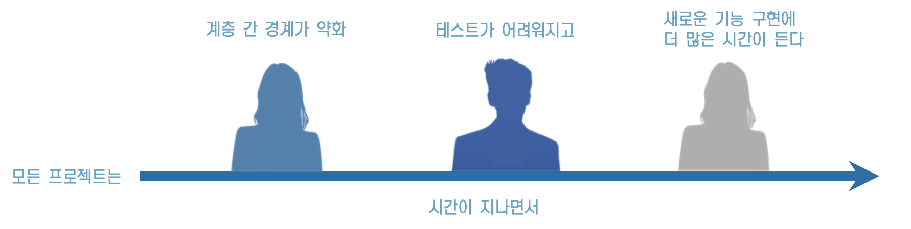
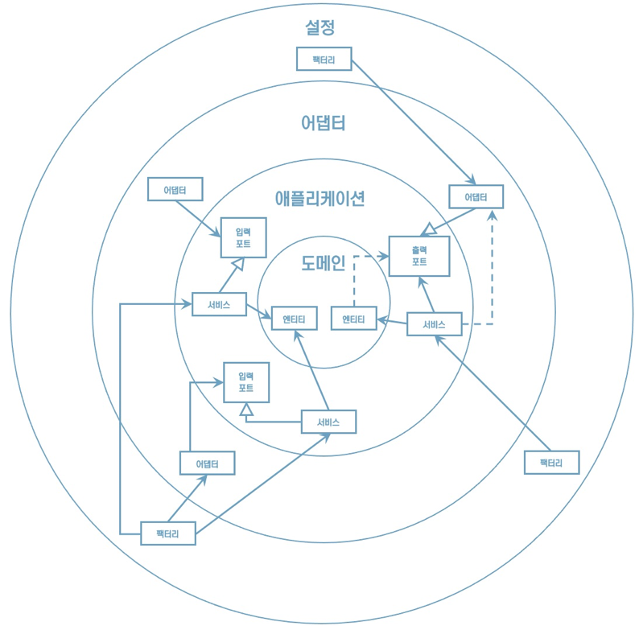
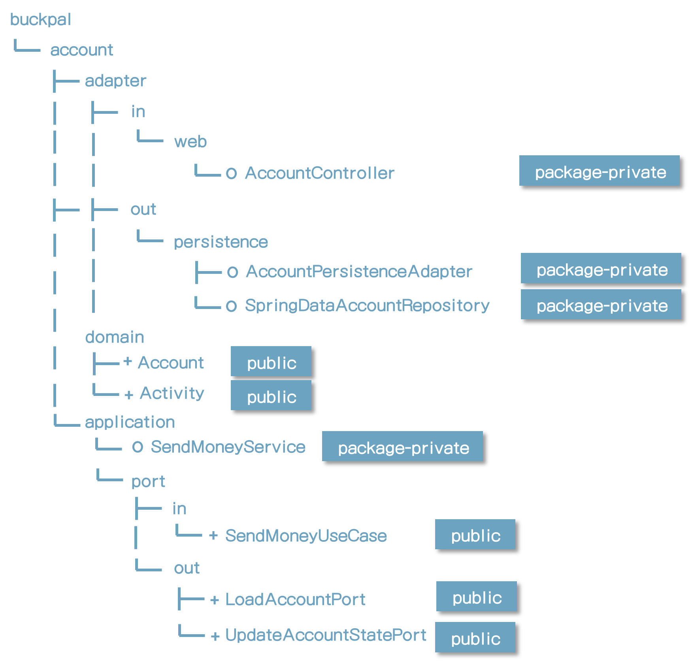
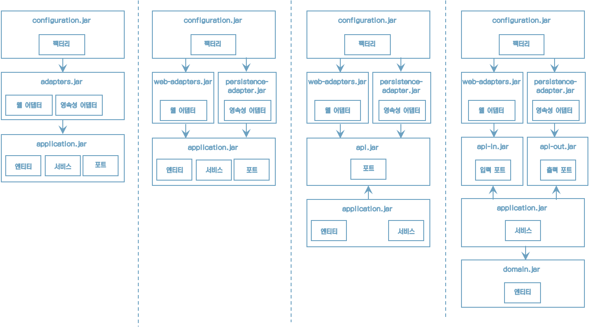
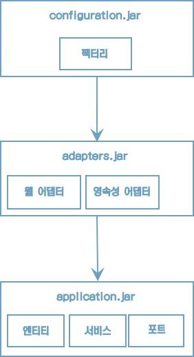
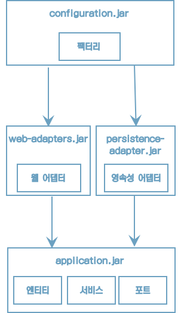
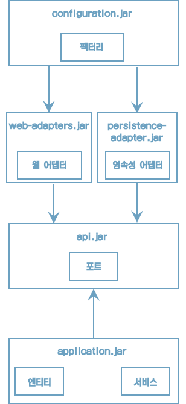
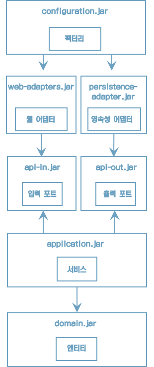

# 10. 아키텍처 경계 강제하기

“모든 프로젝트에서 시간이 지나면서 아키텍처가 서서히 무너지게 된다”




이번 장에서는 아키텍처 내의 경계를 강제하는 방법과 아키텍처 붕괴에 맞서 싸우기 위해 취할 수 있는 몇가지 조치를 알아보자


## **경계와 의존성**

'경계를 강제한다'는 것이 어떤 의미일까?

"의존성 규칙에 따르면 계층 경계를 넘는 의존성은 항상 안쪽 방향으로 향해야 한다"





## **package-private의 중요성**

package-private 제한자가 왜 그렇게 중요할까?

자바 패키지를 통해 클래스들을 응집적인 '모듈'로 만들어 주기 때문이다


이러한 모듈 내에 있는 클래스들은 서로 접근 가능하지만, 패키지 바깥에서는 접근할 수 없다.

그럼 모듈의 진입점으로 활용될 클래스들만 골라서 public으로 만들면 된다.

이렇게 하면 의존성이 잘못된 방향을 가리켜서 의존성 규칙을 위반할 위험이 줄어든다.


## **접근** **제한자**




## **컴파일 후 체크**

* 클래스에 public 제한자를 쓰면 의존성 방향이 잘못되더라도 컴파일러는 다른 클래스들이 이 클래스를 사용하도록 허용한다.
* 이런 경우에는 컴파일러가 전혀 도움이 되지 않기 때문에 의존성 규칙을 위반했는지 확인할 다른 수단을 찾아야 한다.


* 한 가지 방법은 컴파일 후 체크를 도입하는 것이다.
* 다시 말해, 코드가 컴파일된 후에 런타임에 체크한다는 뜻이다.
* 이러한 런타임 체크는 지속적인 통합 빌드 환경에서 자동화된 테스트 과정에서 가장 잘 동작한다.


## **ArchUnit**

* 이러한 체크를 도와주는 자바용 도구로 ArchUnit이 있다.

* ArchUnit은 의존성 방향이 기대한 대로 잘 설정돼 있는지 체크할 수 있는 API를 제공한다.
* 의존성 규칙을 위반하면 예외를 던진다.


## **컴파일 후 체크**

```java
class DependencyRuleTests {
    @Test
    void domainLayerDoesNotDependOnApplicationLayer() {
        noClasses()
        .that()
        .resizeInPackage("buckpal.domain..")
        .should()
        .dependOnClassesThat()
        .resideInAnyPackage("buckpal.application..")
        .check(new ClassFileImporter()
              .importPackages("buckpal.."));
    }
}
```

도메인 계층에서 바깥쪽의 애플리케이션 계층으로 향하는 의존성이 없다는 것을 체크할 수 있다 


```java
class DependencyRuleTests {

	@Test
	void validateRegistrationContextArchitecture() {
		HexagonalArchitecture.boundedContext("io.reflectoring.buckpal")
				.withDomainLayer("domain")
				.withAdaptersLayer("adapter")
				.incoming("web")
				.outgoing("persistence")
				.and()
				.withApplicationLayer("application")
				.services("service")
				.incomingPorts("port.in")
				.outgoingPorts("port.out")
				.and()
				.withConfiguration("configuration")
				.check(new ClassFileImporter()
						.importPackages("io.reflectoring.buckpal.."));
	}
}
```

도메인, 어댑터, 애플리케이션, 설정 계층의 하위 패키지를 지정

패키지 의존성이 의존성 규칙에 따라 유효하게 설정됐는지 검증


## **빌드** **아티팩트**

* 지금까지 아키텍처 경계를 구분하는 유일한 도구는 패키지였다.
* 모든 코드가 같은 모놀로식 빌드 아티팩트의 일부였던 셈이다.


“빌드 아티팩트를 활용하여”

* 빌드 도구의 주요한 기능 중 하나는 의존성 해결이다.
* 이를 활용하여 모듈과 아키텍처의 계층 간의 의존성을 강제할 수 있다.
* 각 모듈의 빌드 스크립트에서는 아키텍처에서 허용하는 의존성만 지정할 수 있어서 개발자들이 더 이상 실수로 잘못된 의존성을 만들 수 없다.


“아래 그림은 잘못된 의존성을 막기 위해 여러 개의 빌드 아티팩트로 만드는 여러가지 방법이다”




## **빌드** **아티팩트** **–** **그림** **1**



* 설정 모듈은 어댑터 모듈에 접근할 수 있고, 애플리케이션 모듈에도 접근할 수 있다.
* 어댑터 모듈은 애플리케이션 모듈에 접근할 수 있다.
* 어댑터 모듈은 영속성 어댑터뿐만 아니라 웹 어댑터도 포함하고 있다.
* 즉, 빌드 도구가 두 어댑터 간의 의존성을 막지 않을 것이라는 뜻이다.
* 어쨌든 영속성 계층의 변경이 웹 계층에 영향을 미치거나 웹 계층의 변경이 영속성 계층에 영향을 미치는 것을 바라지 않을 것이다 (단일 책임 원칙을 기억하자).


## **빌드** **아티팩트** **–** **그림** **2**



* 애플리케이션을 다른 서드파티 API에 연결하는 다른 종류의 어댑터에서도 마찬가지다.
* 실수로 어댑터 간에 의존성이 추가되는 바람에 API와 관련된 세부사항이 다른 어댑터로 새어나가는 것을 바라지 않을 것이다.
* 그렇기 때문에 하나의 어댑터 모듈을 여러 개의 빌드 모듈로 쪼개서 어댑터당 하나의모듈이 되게 할 수도 있다.


## **빌드** **아티팩트** **–** **그림** **3**




* 애플리케이션 모듈을 쪼갤 수 있다.
* 애플리케이션 모듈이 애플리케이션에 대한 인커밍/아웃고잉 포트, 그리고 이러한 포트를 구현하거나 사용하는 서비스, 도메인 로직을 담은 도메인 엔티티를 모두 포함하고 있다.
* 도메인 엔티티가 포트에서 전송 객체로 사용되지 않는 경우라면 의존성 역전 원칙을 적용해서 포트 인터페이스만 포함하는 API 모듈을 분리해서 빼낼 수 있다.
* 어댑터 모듈과 애플리케이션 모듈은 API 모듈에 접근할 수 있지만, 그 반대는 불가능하다.
* API 모듈은 도메인 엔티티에 접근할 수도 없고 포트 인터페이스 안에서 도메인 엔티티를 사용할 수도 없다.
* 또한 어댑터는 더이상 엔티티와 서비스에 직접 접근할 수 없고 포트를 통해서 접근해야 한다.


## **빌드** **아티팩트** **–** **그림** **4**



* API 모듈을 인커밍 포트와 아웃고잉 포트 각각만 가지고 있는 두 개의 모듈로 쪼갤 수 있다.

* 이런 식으로 인커밍 포트나 아웃고잉 포트에 대해서만 의존성을 선언함으로써 특정 어댑터가 인커밍 어댑터인지 아웃고잉 어댑터인지를 매우 명확하게 정의할 수 있다.
* 또, 애플리케이션 모듈을 더 쪼갤 수도 있다.
* 서비스만 가지고 있는 모듈과 도메인 엔티티만 가지고 있는 모듈로 쪼개는 것이다.
* 이렇게 하면 엔티티가 서비스에 접근할 수 없어지고, 도메인 빌드 아티팩트에 대한 의존성을 간단하게 선언하는 것만으로 다른 애플리케이션이 같은 도메인 엔티티를 사용할 수 있게 된다.


## **빌드 모듈로 경계를 구분하는 장점**

1. 빌드 도구가 순환 의존성을 극도로 싫어한다는 것이다.

    1. 순환 의존성은 단일 책임 원칙을 위배하기 때문에 좋지 않다.

        빌드 도구는 이러한 순환 의존성을 허용하지 않는다.

2. 다른 모듈을 고려하지 않고 특정 모듈의 코드를 격리한 채로 변경할 수 있다.

    1. 일시적으로 특정 어댑터에서 컴파일 에러가 생기는 애플리케이션 계층을 리팩터링하고 있다고 상상해보자.
    2. 만약 어댑터와 애플리케이션 계층이 같은 빌드 모듈에 있다면 대부분의 IDE에서 테스트를 실행하려면 어댑터의 컴파일 에러를 모두 고쳐야 한다.
    3. 만약 애플리케이션 계층이 독립된 빌드 모듈이라면 애플리케이션 계층의 테스트를 마음대로 실행할 수 있다.
    4. 만약 두 계층이 같은 빌드 모듈에 있다면 어느 한쪽 계층의 컴파일 에러 때문에 빌드가 실패할 것이다.

3. 의존성이 빌드 스크립트에 선언되기 때문에 의존성을 추가하는 일은 의식적인 행동이 된다.

    1. 어떤 개발자가 당장은 접근할 수 없는 특정 클래스에 접근해야 할 일이 생기면 빌드 스크립트에 이 의존성을 추가하기에 앞서 정말로 이 의존성이 필요한 것인지 생각할 여지가 생긴다.


## **유지보수 가능한 소프트웨어를 만드는 데 어떻게 도움이 될까?**

* 기본적으로 소프트웨어 아키텍처는 아키텍처 요소 간의 의존성을 관리하는 게 전부다.
* 만약 의존성이 거대한 진흙 덩어리가 된다면 아키텍처 역시 거대한 진흙 덩어리가 된다.
* 새로운 코드를 추가하거나 리팩터링할 때 패키지 구조를 항상 염두에 둬야 하고, 가능하다면 package-private 가시성을 이용해 패키지 바깥에서 접근하면 안 되는 클래스에 대한 의존성을 피해야 한다.
* 하나의 빌드 모듈 안에서 아키텍처 경계를 강제해야 하고, 패키지 구조가 허용하지 않아 package-private 제한자를 사용할 수 없다면 ArchUnit 같은 컴파일 후 체크 도구를 이용해야 한다.