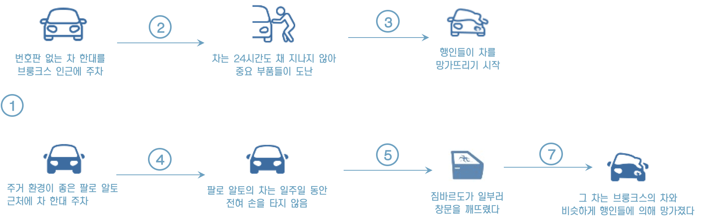
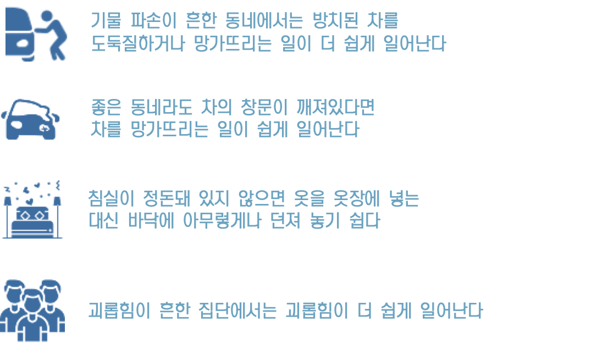
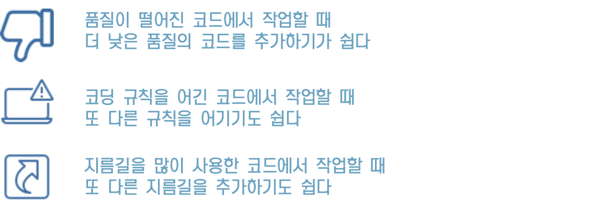
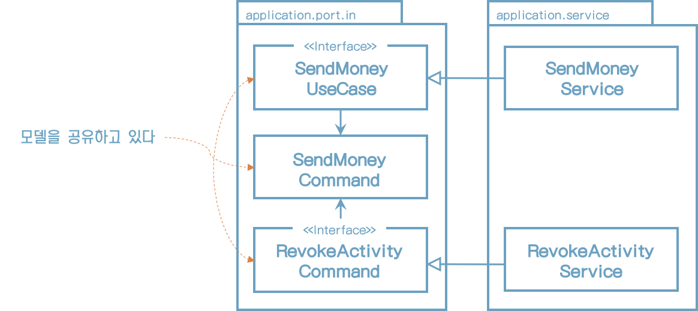
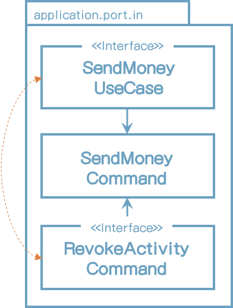
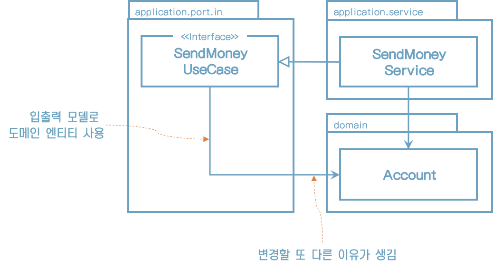
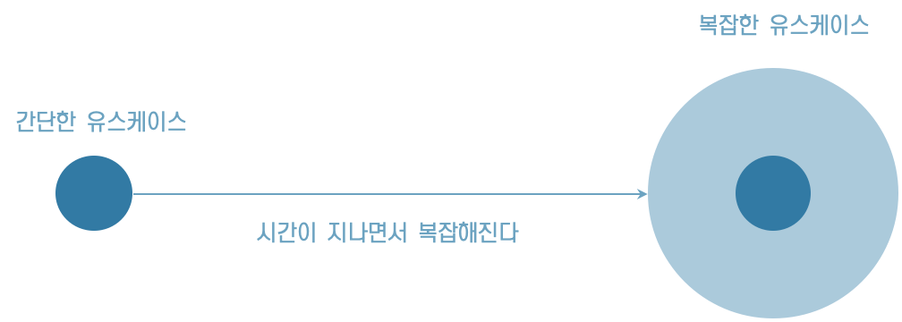
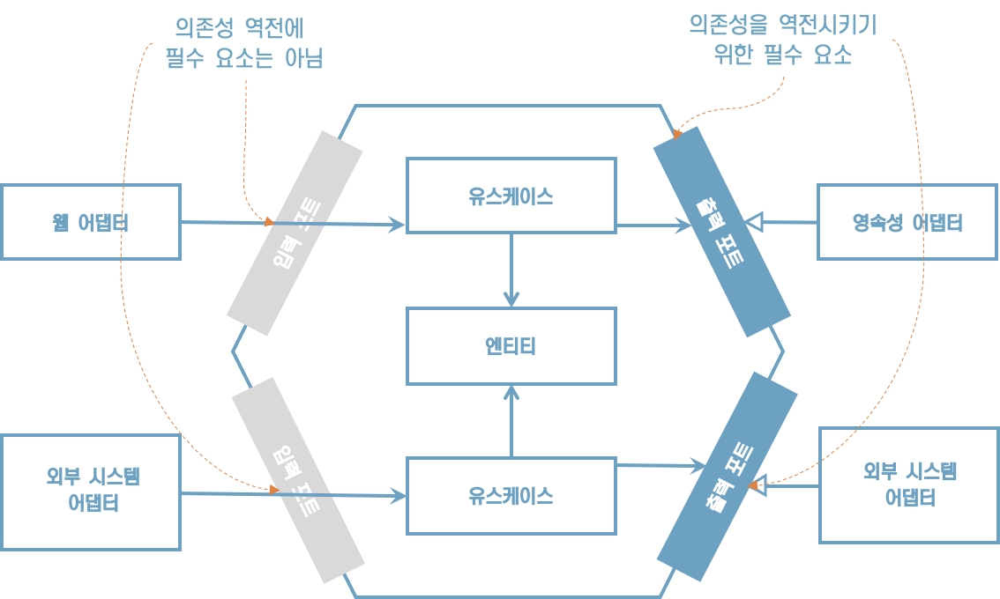
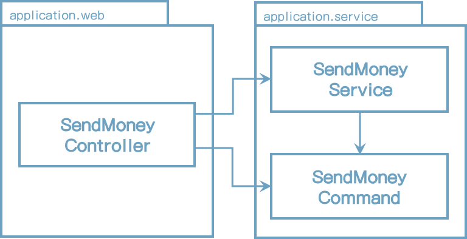
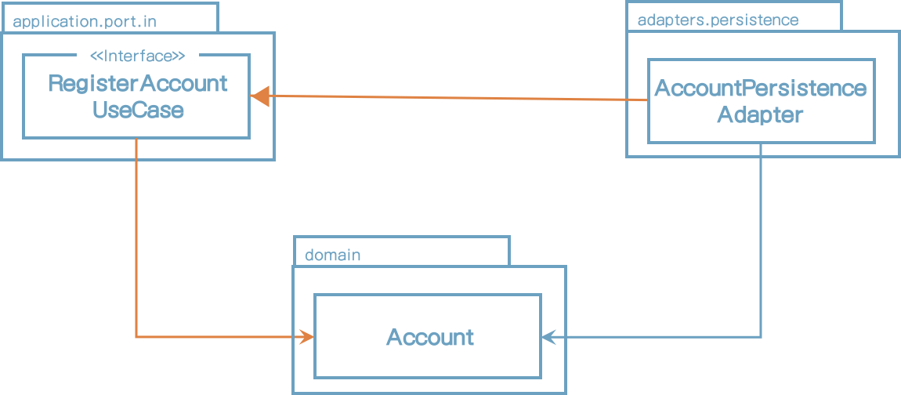

# 11. 의식적으로 지름길 사용하기

## **과거에 하나의 실험을 진행했었다**

## **왜 지름길은 깨진 창문 같을까?**

“깨진 창문 이론”

> “어떤 것이 멈춘 것처럼 보이고, 망가져 보이고, 혹은 관리되지 않는다고 여겨지면 
>
> 인간의 뇌는 이를 더 멈추고, 망가뜨리고, 해도 된다고 생각하게 된다”

## **깨진 창문 이력의 적용 부분**

## **코드 작업에 적용될 때의 의미**

"이 모든 것을 고려하면 이른바 '레거시'라고 불리는 많은 코드 품질이 시간이 가면서 심하게 낮아졌다는 게 그리 놀라운 일은 아니다”

## **깨끗한 상태로 시작할 책임**

## **지름길 선택**

## **유스케이스** **간 모델 공유하기**

두 개의 유스케이스가 같은 입력 모델을 공유하는 예를 보여준다

“SendMoneyCommand가 변경되면 두 유스케이스 모두 영향”

## **유스케이스** **간에 기능적 결합**

“유스케이스 간 입출력 모델을 공유하는 것은 유스케이스들이 기능적으로 묶여 있을 때는 괜찮다”

* 즉, 특정 요구사항을 공유할 때 괜찮다는 의미다.
* 이 경우 특정 세부사항을 변경할 경우 실제로 두 유스케이스 모두에 영향을 주고 싶은 것이다.

## **유스케이스** **간 독립적인 진화**

“두 유스케이스가 독립적으로 진화해야 한다면 분리해야 한다”

* 두 유스케이스가 독립적으로 진화해야 한다면 모델을 공유하는 방식은 지름길이 된다.

* 처음에는 똑같은 입출력 클래스를 복사해야 하더라도 일단 분리해서 시작해야 한다.

## **유스케이스** **모델 분리 여부 판단**

여러 유스케이스를 독립적으로 진화해야 할까?

-> 그렇다면 모델을 분리해라

-> 아니라면 모델을 공유해라

## **도메인** **엔티티를** **입출력 모델로 사용하기**

"도메인 엔티티인 Account를 인커밍 포트인 SendMoneyUseCase의 입출력 모델로 사용하고 싶다는 생각이 들지도 모른다"

* Account 엔티티에는 존재하지 않는 정보를 유스케이스가 필요로 한다고 생각해보자.
* 이런 경우 Account에는 불필요하더라도 Acccount 엔티티에 추가해야 한다.

"간단한 경우라면 괜찮지만 복잡한 로직을 구현해야 한다면 유스케이스 인터페이스에 대한 전용 입출력 모델을 만들어야 한다"

"왜냐하면 유스케이스의 변경이 도메인 엔티티까지 전파되길 바라진 않을 것이기 때문이다"

"이 지름길이 위험한 이유는 많은 유스케이스가 시간이 지나면서 복잡해진다는 사실 때문이다"

"처음에는 도메인 엔티티를 입력 모델로 사용했더라도 독립적인 전용 입력 모델로 교체해야 하는 시점을 잘 파악해야 한다"

## **인커밍** **포트의 의미**

“아웃고잉 포트는 애플리케이션 계층과 어댑터 사이의 의존성을 역전시키지 위한 필수 요소인 반면 인커밍 포트는 의존성 역전에 필수적인 요소는 아니다”

## **인커밍** **포트 건너뛰기**

“인커밍 포트를 제거함으로써 인커밍 어댑터와 애플리케이션 계층 사이의 추상화 계층을 줄였다”

## **인커밍** **포트를 두는 것의 장점**

1. 인커밍 포트는 애플리케이션 중심에 접근하는 진입점이다.
    1. 이를 제거하면 특정 유스케이스를 구현하기 위해 어떤 서비스 메서드를 호출해야 할지 내부 동작에 대해 더 잘 알아야 한다.
    2. 새로운 개발자가 코드를 파악할 때 특히 더 도움이 된다.
2. 아키텍처를 쉽게 강제할 수 있다.
    1. 의도하지 않은 서비스 메서드를 실수로 호출하는 일 제한할 수 있다.

## **애플리케이션 서비스 건너뛰기**

“어떤 유스케이스에서는 애플리케이션 계층을 통째로 건너뛰고 싶을 수도 있다”

간단한 CRUD 유스케이스에서는 보통 애플리케이션 서비스가 도메인 로직 없이 그대로 영속성 어댑터에 전달하기 때문에 괜찮을 수 있다.

1. 하지만 이 방법은 인커밍 어댑터와 아웃고잉 어댑터 사이에 모델을 공유해야 한다.
2. 도메인 로직이 흩어져서 도메인 로직을 찾거나 유지보수가 어려워진다.

## **유지보수 가능한 소프트웨어를 만드는 데 어떻게 도움이 될까?**

* 경제적인 관점에서 지름길이 합리적일 때도 있다.
* 간단한 CRUD 유스케이스에 대해서는 지름길의 유혹을 느낄 수 있다. 하지만 모든 애플리케이션은 처음에는 작게 시작하기 때문에, CRUD를 상태를 벗어나는 시점이 언제인지 팀이 합의하는 것이 매우 중요하다.
* 단순 CRUD 상태에서 벗어나지 않는 유스케이스는 지름길을 계속 유지하는 게 더 경제적이다.
* 어떤 경우든 아키텍처에 대해, 왜 특정 지름길을 선택했는가에 대한 기록을 남겨서 나중에 프로젝트를 인계받는 이들이 이 결정에 대해 다시 평가할 수 있게 하자.