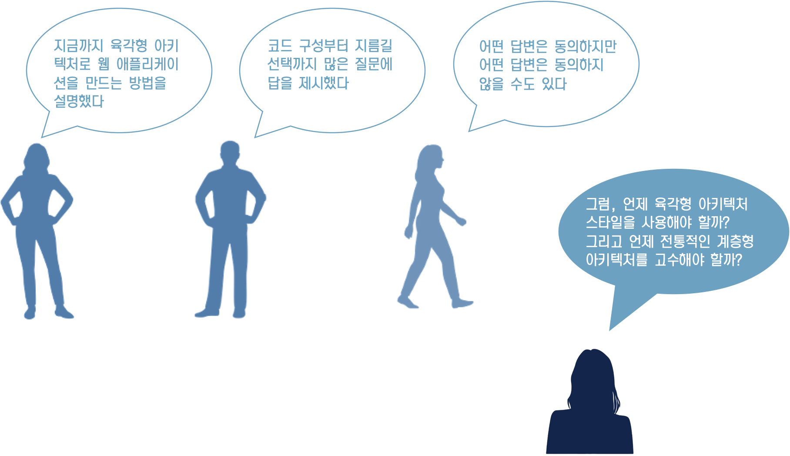
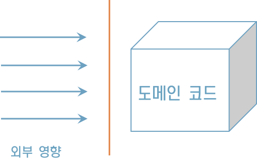
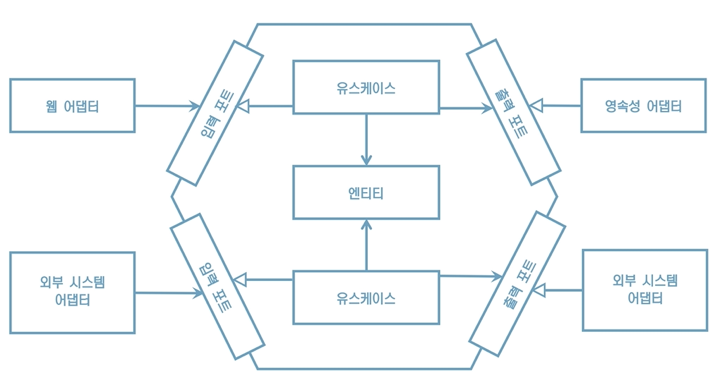
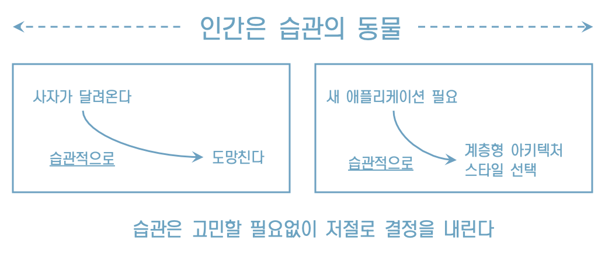
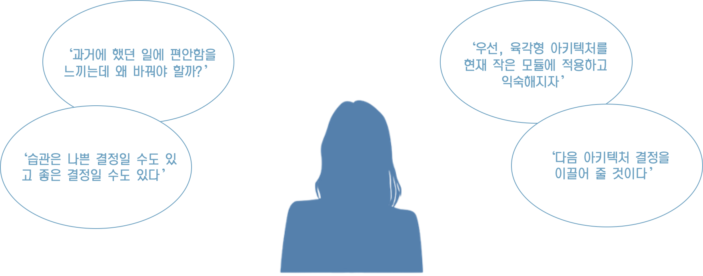

# 12. 아키텍처 스타일 결정하기

## **도메인이 왕이다**

“외부의 영향을 받지 않고 도메인 코드를 자유롭게 발전시킬 수 있다는 것은 육각형 아키텍처 스타일이 내세우는 가장 중요한 가치다”

“육각형 아키텍처 스타일이 도메인 주도 설계 방식과 잘 어울리는 이유”

## **인간은 습관의 동물**

## **경험이 여왕이다**

## **그때그때 다르다**

어떤 아키텍처 스타일을 골라야 하나요?

그때그때 달라요

* 어떤 소프트웨어냐?
* 도메인 코드의 역할
* 팀의 경험
* 내린 결정이 마음에 드냐?