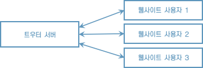

# 6장 트우터

## 6.3 트우터 요구사항

* 사용자가 게시하는 각각의 마이크로블로그를 트웃(twoot)이라고 부르며 연속적인 트웃 스트림을 갖는다.
* 다른 사용자를 팔로우해야 그 사용자가 무엇을 트우팅했는지 알 수 있다.

* 서비스를 어떻게 사용할지 다양한 유스 케이스와 시나리오를 브레인스토밍했다.
* 시스템을 완성하기 위해 필요한 기능은 다음과 같다.
    * 고유의 사용자 ID와 비밀번호로 트우터에 로그인한다.
    * 각 사용자는 자신이 팔로우하는 사용자 집합을 갖는다.
    * 사용자는 트웃을 전송할 수 있으며 로그인한 모든 팔로워는 이 트웃을 바로 볼 수 있다.
    * 사용자가 로그인하면 최종 로그인한 이후로 게시된 팔로워의 모든 트웃을 볼 수 있다.
    * 사용자는 모바일이나 웹사이트로 로그인할 수 있다.

## 6.4 설계 개요

* 마지막 요구 사항을 달성하려면 많은 컴퓨터가 상호작용할 수 있는 시스템을 만들어야 한다.
* 어떤 사용자는 집에 있는 데스크톱으로 트우터 웹사이트에 접속할 수 있고 어떤 사용자는 스마트폰으로 트우터를 실행할 수 있기 때문이다. 
* 다양한 환경의 사용자가 어떻게 서로 통신할 수 있을까?

* 보통 소프트웨어 개발자는 이런 문제를 클라이언트 서버 모델로 해결한다.
* 클라이언트 그룹은 서비스를 사용하는 그룹이고 서버는 관련 서비스를 제공하는 그룹이다.

### 6.4.1 풀 기반

* 풀 기반(pull-based) 통신에서는 클라이언트가 서버로 정보를 요청한다.
* 풀 기반 통신은 점대점(point-to-point) 또는 요청 응답(request-response) 통신 형식으로도 불린다.
* 클라이언트는 서버로 HTTP 요청을 보내 페이지의 데이터를 가져온다(pull).

### 6.4.2 푸시 기반

* 푸시 기반 통신 방법도 있다. 
* 이를 리액티브 또는 이벤트 주도 통신이라고 부른다.
* 푸시 기반 모델에서는 작성자(publisher)가 방출한 이벤트 스트림을 여러 구독자가 수신한다.
* 주식 시장 거래 프로그램을 설계할 때 다양한 회사의 가격과 틱 정보가 필요할 때마다 요청하는 것이 아니라 연속적으로 정보가 제공되어야 한다.

## 6.5 이벤트에서 설계까지

### 6.5.1 통신

* 웹소켓은 TCP 스트림으로 양방향 이벤트 통신을 지원하는 가벼운 통신 프로토콜이다.
* 요즘은 아마존의 단순 큐 서비스(SQS) 같은 호스트된 클라우드 기반 메시지 큐를 메시지 송출이나 수신에 점점 많이 사용한다. 메시지 큐는 그룹 내의 프로세스 중 한 프로세스가 전송된 메시지를 받아 처리하는 상호 프로세스 통신 방식이다.
* 메시지 전송이나 메시지 큐를 구현하는 오픈 소스인 Aeron, ZeroMQ, AMPQ로 구현하는 방법도 있다.

* 프로젝트를 시작하면서 선택한 기술을 바꾸지 못하고 계속 사용해야 하는 상황이라면 이는 좋은 아키텍처 결정이 아님을 반증한다.
* 다양한 통신 방식을 혼합할 수도 있다.
* 웹사이트와는 웹소켓으로 통신하며 안드로이드 모바일 앱과는 푸시 노티피케이션으로 통신하는 그림이다.

### 6.5.2 GUI

* UI 통신 기술이나 UI를 서버의 비즈니스 로직과 결합하면 몇 가지 단점이 발생한다.
    * 테스트하기 어렵고 테스트 실행도 느려진다. 모든 테스트가 실행 중인 메인 서버로 이벤트를 발행하거나, 수신해야 하기 때문이다.
    * 2장에서 설명한 단일 책임 원칙을 위반한다.
    * 클라이언트가 반드시 UI를 갖는다고 가정한다. 처음에는 트우터 클라이언트가 당연히 UI를 가져야 할 것처럼 보이지만 미래에는 인공지능 챗봇이 사용자의 문제를 알아서 해결할 수도 있다. 문제를 해결할 수 없다면 챗봇이 귀여운 고양이 사진이라도 트웃해 사람들 기분이라도 풀어줄 것이다.
* 결론적으로 메시징을 코어 비즈니스 로직과 분리할 수 있도록 신중하게 추상화해야 한다.
* 즉 클라이언트에게 메시지를 전송하고 클라이언트의 메시지를 수신하는 인터페이스가 필요하다.

### 6.5.3 영구 저장

트우터는 수신한 데이터를 어떻게 저장할까?

* 직접 인덱스하고 검색할 수 있는 일반 텍스트 파일: 기록된 데이터를 쉽게 볼 수 있으며 다른 응용프로그램과의 디펜던시를 줄일 수 있다.
* 전통적인 SQL 데이터베이스: 모두가 알고 있으며 잘 검증된 시스템으로 강력한 질의를 지원한다.
* NoSQL 데이터베이스: 다양한 유스 케이스, 질의 언어, 데이터 저장 모델을 지원하는 여러 데이터베이스가 있다.

* 소프트웨어 프로젝트를 처음 시작하는 단계에서는 어떤 기술이 적합한지 선택하기가 어려울 뿐만 아니라 시간이 흐르면서 요구사항은 계속 바뀐다.
* 저장소 백엔드가 응용프로그램의 다른 부분과 결합하지 않도록 설계하고 싶다.
* 어떤 기능이 특정 기술과 결합하지 않도록 방지하는 일은 개발자가 흔히 고민하는 문제 중 하나다.

### 6.4.2 육각형 아키텍처

앨리스터 콕번(Alister Cockburn)이 정립한 포트와 어댑터(ports and adapters) 또는 육각형 아키텍처(hexagonal architecture)라 불리는 조금 더 일반화된 아키텍처를 적용해 이 문제를 해결할 수 있다.

코어 비즈니스 로직과 분리하려는 특정 기술이 있다면 포트를 이용한다. 외부 이벤트는 포트를 통해 코어 비즈니스 로직으로 전달된다. 어댑터는 포트로 연결하는 특정 기술을 이요한 구현 코드다.

