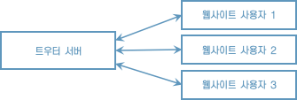
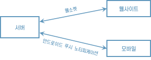
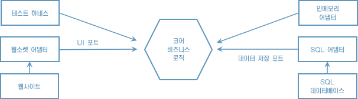
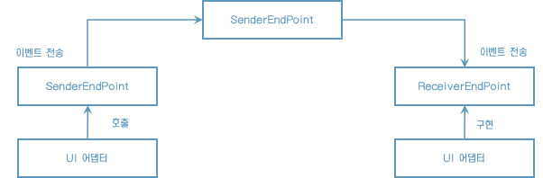
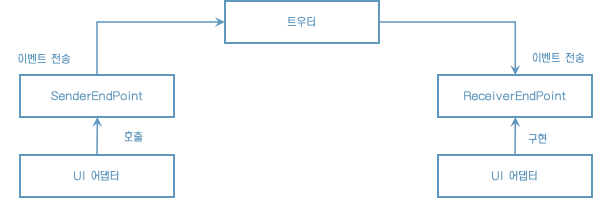

# 2장 입출금 내역 분석기

## 2.1 도전 과제

입출금 내역을 자동으로 분석해 재정 상태를 더 잘 보여주는 소프트웨어를 개발해달라고 우리에게 부탁했고, 우리는 그 부탁을 수락했다.


## 2.2 목표

* 버그가 발생하는 범위를 줄이는 데 도움을 주는 단일 책임 원칙을 배운다.
* 여러분이 개발하는 코드와 소프트웨어의 품질을 유지하는 데 유용한 응집도와 결합도의 특징도 소개한다.


## 2.3 입출금 내역 분석기 요구사항

[은행 거래 예시]

30-01-2017,-100,Deliveroo
20-01-2017,-50,Tesco
01-02-2017,6000,Salary
02-02-2017,-2000,Royalties
02-02-2017,-4000,Rent
03-02-2017,3000,Tesco
05-02-2017,-30,Cinema

* 은행 입출금 내역의 총 수입과 총 지출은 각각 얼마인가? 결과가 양수인가 음수인가?
* 특정 달엔 몇 건의입출금 내역이 발생했는가?
* 지출이 가장 높은 상위 10건은 무엇인가?
* 돈을 가장 많이 소비하는 항목은 무엇인가?


## 2.4 KISS 원칙

KISS(keep it short and simple) 원칙을 이용해 한 개의 클래스로 구현한다. 아직은 존재하지 않거나 파일 내용을 파싱할 때 발생하는 문제를 해결하기 위한 예외 처리에 신경 쓸 필요는 없다.

```java
public class BankTransactionAnalyzerSimple {
    private static final String RESOURCE = "src/main/resources";

    public static void main(String[] args) throws IOException {
        final Path path = Paths.get(RESOURCE + args[0]);
        final List<String> lines = Files.readAllLines(path);
        double total = 0d;
        for (final String line: lines) {
            final String [] columns = line.split(",");
            final double amount = Double.parseDouble(columns[1]);
            total += amount;
        }

        System.out.println("The total for all transaction is " + total);
    }
}
```

정상 실행되지만 아래와 같은 문제가 발생할 수 있다. 실제 제품으로 출시되었을 때 발생할 만한 문제를 어떻게 처리할 지 고려하는 것이 좋다.

* 파일이 비어있다면
* 데이터에 문제가 있어서 금액을 파싱하지 못한다면?
* 행의 데이터가 완벽하지 않는다면


```java
public static void main(String[] args) throws IOException {
  final Path path = Paths.get(RESOURCE + args[0]);
  final List<String> lines = Files.readAllLines(path);
  double total = 0d;
  final DateTimeFormatter DATE_PATTERN = DateTimeFormatter.ofPattern("dd-MM-yyyy");
  for (final String line: lines) {
    final String [] columns = line.split(",");
    final LocalDate date = LocalDate.parse(columns[0], DATE_PATTERN);
    if (date.getMonth() == Month.JANUARY) {
      final double amount = Double.parseDouble(columns[1]);
      total += amount;
    }
  }

  System.out.println("The total for all transaction is " + total);
}
```


### 2.4.1 final 변수

* 지역 변수나 필드는 final로 정의하기 때문에 이 변수에 값을 재할당할 수 없다.
* final 사용에 따른 장단점이 모두 있으므로 final 사용여부는 팀과 프로젝트에 따라 달라진다.


## 2.5 코드 유지보수성과 안티 패턴

코드를 구현할 때는 **코드 유지보수성**을 높이기 위해 노력한다. 이게 무슨 의미일까? 구현하는 코드가 가졌으면 하는 속성을 목록으로 만들어보자.

* 특정 기능을 담당하는 코드를 쉽게 찾을 수 있어야 한다.
* 코드가 어떤 일을 수행하는지 쉽게 이해할 수 있어야 한다.
* 새로운 기능을 쉽게 추가하거나 기존 기능을 쉽게 제거할 수 이썽야 한다.
* 캡슐화가 잘 되어 있어야 한다. 즉 코드 사용자에게는 세부 구현 내용이 감춰져 있으므로 사용자가 쉽게 코드를 이해하고, 기능을 바꿀 수 있어야 한다.

궁극적으로 개발자의 목표는 현재 만들고 있는 응용프로그램의 복잡성을 관리하는 것이다. 하지만 새로운 요구사항이 생길 때마다 복사, 붙여넣기로 이를 해결하다면 다음과 같은 문제가 생긴다. 이는 효과적이지 않은 해결방법으로 잘 알려져 있으며, **안티 패턴**이라고 부른다.

* 한 개의 거대한 **갓 클래스** 때문에 코드를 이해하기가 어렵다.
* **코드 중복** 때문에 코드가 불안정하고 변화에 쉽게 망가진다.


### 2.5.1 갓 클래스

한 개의 파일에 모든 코드를 구현하다 보면 결국 하나의 거대한 클래스가 탄생하면서 클래스의 목적이 무엇인지 이해하기 어려워진다. 이 거대한 클래스가 모든 일을 수행하기 때문이다.

이런 문제를 **갓 클래스 안티 패턴**이라 부른다. 한 클래스로 모든 것을 해결하는 패턴이다.


### 2.5.2 코드 중복

CSV 대신 JSON 파일로 입력 형식이 바뀐다면 어떻게 될까? 또는 다양한 형식의 파일을 지원해야 한다면 어떨까? 현재 구현은 한 가지 문제만 해결하도록 하드코딩 되어있고, 여러 곳에 이 코드가 중복되어 있어 기존의 기능을 바꾸기가 어렵다. 결과적으로 모든 곳의 코드를 다 바꿔야 하며, 새로운 버그가 발생할 가능성이 커진다.

결론적으로 코드를 간결하게 유지하는 것도 중요하지만, KISS 원칙을 남용하지 않아야 한다. 여러분의 전체 응용프로그램의 설계를 되돌아보고, 한 문제를 작은 개별 문제로 분리해 더 쉽게 관리할 수 있는지 파악해야 한다. 이 과정을 통해 더 이해하기 쉽고, 쉽게 유지보수하며, 새로운 요구 사항도 쉽게 적용하는 결과물을 만들 수 있다.


## 2.6 단일 책임 원칙

단일 책임 원칙(이하 SRP)은 쉽게 관리하고 유지보수하는 코드를 구현하는 데 도움을 주는 포괄적인 소프트웨어 개발 지침이다.

다음 두 가지를 보완하기 위해 SRP를 적용한다.

* 한 클래스는 한 기능만 책임진다.
* 클래스가 바뀌어야 하는 이유는 오직 하나여야 한다.

SRP는 일반적으로 클래스와 메서드에 적용한다. SRP는 한 가지 특정 동작, 개념, 카테고리와 관련된다. SRP를 적용하면 코드가 바뀌어야 하는 이유가 한 가지로 제한되므로 더 튼튼한 코드를 만들 수 있다.

그럼 어떻게 SRP를 적용할까? 현재 메인 클래스는 여러 책임을 모두 포함하므로 이를 개별로 분리해야 한다.

* 입력 읽기
* 주어진 형식의 입력 파싱
* 결과 처리
* 결과 요약 리포트


[파싱 로직을 추출해 한 클래스로 만듦]

```java
public class BankStatementCSVParser implements BankStatementParser {

    private static final DateTimeFormatter DATE_PATTERN = DateTimeFormatter.ofPattern("dd-MM-yyyy");

    public BankTransaction parseFrom(final String line) {
        final String[] columns = line.split(",");

        final LocalDate date = LocalDate.parse(columns[0], DATE_PATTERN);
        final double amount = Double.parseDouble(columns[1]);

        return new BankTransaction(date, amount, columns[2]);
    }

    public List<BankTransaction> parseLinesFrom(final List<String> lines) {
        return lines.stream().map(this::parseFrom).collect(toList());
    }
}
```

BaseStatementCSVParser 클래스는 parseFromCSV()와 parseLinesFromCSV()라는 BankTransaction 객체를 생성하는 두 클래스를 정의한다. BankTransaction은 도메인 클래스로 입출금 내역을 표현한다.


메서드를 구현할 때는 놀람 최소화 원칙(Principle of least surprise)을 따라야 한다. 그래야 코드를 보고 무슨 일이 일어나는지 명확히 이해할 수 있기 때문이다.

* 메서드가 수행하는 일을 바로 이해할 수 있도록 자체 문서화를 제공하는 메서드명을 사용하낟
* 코드의 다른 부분이 파라미터의 상태에 의존할 수 있으므로 파라미터의 상태를 바꾸지 않는다.


## 2.7 응집도

응집도는 서로 어떻게 관련되어 있는지를 가리킨다. 정확히 말하자면 응집도는 클래스나 메서드의 책임이 서로 얼마나 강하게 연결되어 있는지를 측정한다.

높은 응집도는 개발자의 목표이고, 누구나 쉽게 코드를 찾고, 이해하고, 사용할 수 있도록 만들고 싶어한다.


### 2.7.1 클래스 수준 응집도

실무에서는 일반적으로 다음과 같은 여섯 가지 방법으로 그룹화한다.

* 기능
* 정보
* 유틸리지
* 논리
* 순차
* 시간


### 2.7.2 메서드 수준 응집도

메서드가 다양한 기능을 수행할수록 메서드가 어떤 동작을 하는지 이해하기가 점점 어려워진다. 즉 메서드가 연관이 없는 여러 일을 처리한다면 응집도가 낮아진다. 응집도가 낮은 메서드는 여러 책임을 포함하기 때문에 각 책임을 테스트하기가 어렵고, 메서드의 책임도 테스트하기가 어렵다. 일반적으로 클래스나 메서드 파라미터의 여러 필드를 바꾸는 if/else 블록이 여러 개 포함되어 있다면 이는 응집도에 문제가 있음을 의미하므로 응집도가 높은 더 작은 조각으로 메서드를 분리해야 한다.


## 2.8 결합도

결합도는 한 기능이 다른 클래스에 얼마나 의존하고 있는지를 가늠한다. 결합도는 어떤 클래스를 구현하는 데 얼마나 많은 지식(다른 클래스)을 참조했는가로 설명할 수 있다. 더 많은 클래스를 참조했다면 기능을 변경할 때 그만큼 유연성이 떨어진다. 어떤 클래스의 코드를 바꾸면 이 클래스에 의존하는 모든 클래스가 영향을 받는다.


## 2.9 테스트

### 2.9.1 테스트 자동화

### 2.9.2 제이유닛 사용하기

### 2.9.3 코드 커버리지


# 3장 입출금 내역 분석기 확장판

## 3.3 확장된 입출금 내역 분석기 요구 사항

1. 특정 입출금 내역을 검색할 수 있는 기능. 예를 들어 주어진 날짜 범위 또는 특정 범주의 입출금 내역 얻기.
2. 검색 결과의 요약 통계를 텍스트, HTML 등 다양한 형식으로 만들기


## 3.4 개방/폐쇄 원칙

특정 금액 이상의 모든 입출금 내역을 검색하는 메서드를 구현해보자. '이 메서드를 어디에 정의해야 할까'라는 의문이 먼저 떠오른다.


특정 금액 이상의은행 거래 내역 찾기

```java
public List<BankTransaction> findTransactionsGreaterThanEqual(final int amount) {
  return findTransactions(bankTransaction -> bankTransaction.getAmount() >= amount);
}
```

특정 월의 입출금 내역 찾기

```java
public double calculateTotalInMonth(final Month month) {
  return summarizeTransactions((acc, bankTransaction) ->
                               bankTransaction.getDate().getMonth() == month ? acc + bankTransaction.getAmount() : acc);
}
```

특정 월이나 금액으로 입출금 내역 검색하기

```java
public List<BankTransaction> findTransactionsGreaterThanEqual(final int amount) {
  final List<BankTransaction> result = new ArrayList();
  for (final BankTransaction bankTransaction: bankTransactions) {
    if (bankTransaction.getDate().getMonth() == month && bankTransaction.getAmount() > = amount) {
      result.add(bankTransaction);
    }
  }
  return result;
}
```

확실히 이 방식에는 여러 한계가 있다.

* 거래 내역의 여러 속성을 조합할수록 코드가 점점 복잡해진다.
* 반복 로직과 비즈니스 로직이 결합되어 분리가 어려워진다.
* 코드를 반복한다.

개방/폐쇄 원칙은 이런 상황에 적용한다. 


BankTransactionFilter 인터페이스

```java
@FunctionalInterface
public interface BankTransactionFilter {
  boolean test(BankTransaction bankTransaction);
}
```

개방/폐쇠 원칙을 적용한 후 유연해진 findTransactions() 메서드

```java
public List<BankTransaction> findTransactions(final BankTransactionFilter bankTransactionFilter) {
  for (final BankTransaction bankTransaction: bankTransactions) {
      if (bankTransactionFilter.test(bankTransaction)) {
        result.add(bankTransaction);
      }
   }
  return result;
}
```


### 3.4.1 함수형 인터페이스 만들기

BankTransactionFilter를 구현하는 클래스 선언

```java
class BankTransactionIsInFebruaryAndExpensive implements BankTransactionFilter {
  @Override
  public boolean test(BankTransaction bankTransaction) {
    return bankTransaction.getDate().getMonth() == month 
      && bankTransaction.getAmount() > = 1_000;
  }
}
```

특정 BankTransactionFilter 구현으로 findTransactions() 호출

```java
final List<BankTransaction> transactions = bankStatementProcessor.findTransactions(new BankTransactionIsInFebruaryAndExpensive());
```


### 3.4.2 람다 표현식

하지만 새로운 요구사항이 있을 때마다 별도의 클래스를 만들어야 한다. 이는 큰 의미가 없는 코드를 반복해서 만드는 귀찮은 작업이다.


람다 표현식으로 BankTransactionFilter 구현하기

```java
final List<BankTransaction> transactions = bankStatementProcessor.findTransactions(bankTransaction -> bankTransaction.getDate().getMonth() == month 
      && bankTransaction.getAmount() > = 1_000);
```

요약하자면, 다음과 같은 장점 덕분에 개방/폐쇄 원칙을 사용한다.

* 기존 코드를 바꾸지 않으므로 기존 코드가 잘못될 가능성이 줄어든다.
* 코드가 중복되지 않으므로 기존 코드의 재사용성이 줄어든다.
* 결합도가 낮아지므로 코드 유지보수성이 좋아진다.


## 3.5 인터페이스 문제

한 인터페이스에 모든 기능을 추가하는 갓 인터페이스를 만드는 일은 피해야 한다.


### 3.5.1 갓 인터페이스

갓 인터페이스

```java
interface BankTransactionProcessor {
  double calculateTotalAmount();
  double calculateTotalInMonth(Month month);
  double calculateTotalInJanuary();
  double calculateAverageAmount();
  double calculateAverageAmountForCategory(Category category);
  List<BankTransaction> findTransactions(BankTransactionFilter bankTransactionFilter);
}
```

* 자바의 인터페이스는 모든 구현이 지켜야 할 규칙을 정의한다. 즉 구현 클래스는 인터페이스에서 정의한 모든 연산의 구현 코드를 제공해야 한다. 따라서 인터페이스를 바꾸면 구현한 코드도 바뀐 내용을 지원하도록 갱신되어야 한다. 더 많은 연산을 추가할수록 더 자주 코드가 바뀌며, 문제가 발생할 수 있는 범위도 넓어진다.
* 월, 카테고리 같은 BankTransaction의 속성이 calculateAverageForCategory(), calculateTotalInJanuary() 처럼 메서드 이름의 일부로 사용되었다. 인터페이스가 도메인 객체의 특정 접근자에 종속되는 문제가 생겼다. <u>도메인 객체의 세부 내용이 바뀌면 인터페이스도 바뀌어야 하며 결과적으로 구현코드도 바뀌어야 한다</u>.


### 3.5.2 지나친 세밀함

인터페이스는 작을수록 좋은 걸까? 아래는 각 동작을 별도의 인터페이스로 정의하는 극단적인 예다. BankTransactionProcessor 클래스는 이 모든 인터페이스를 구현해야 한다.

지나치게 세밀한 인터페이스

```java
interface CalculateTotalAmount {
  double calculateTotalAmount();
}

interface CalculateAverage {
  double calculateAverage();
}

interface CalculateTotalInMonth {
  double calculateTotalInMonth(Month month);
}
```

지나치게 인터페이스가 세밀해도 코드 유지보수에 방해가 된다. 실제로 위 예제는 안티 응집도 문제가 발생한다. 즉 기능이 여러 인터페이스로 분산되므로 필요한 기능을 찾기가 어렵다. 자주 사용하는 기능을 쉽게 찾을 수 있어야 유지보수성이 좋아진다.


## 3.6 명시적 API vs 암묵적 API

* 명시적 API
    * findTransactionsGreaterThanEqual() 처럼 구체적으로 메서드를 정의하는 방법
    * 어떤 동작을 수행하는지 잘 설명되어 있다.
    * 사용하기 쉽다.
    * API의 가독성을 높이고 쉽게 이해하도록 메서드 이름을 만들었다.
* 암묵적 API
    * findTransactions()와 같이 메서드를 정의한다.
    * 처음에는 사용하기 어렵다.
    * 거래 내역을 검색하는 데 필요한 모든 상황을 단순한 API로 처리할 수 있다.

어떤 것이 좋은 방법인지는 정해져 있지 않다. 질문의 종류에 따라 달라질 수 있기 때문이다.


### 3.6.1 도메인 클래스 vs 원싯값

BankTransactionSummarizer의 인터페이스를 간단하게 정의하면서 double이라는 원싯값을 결과로 반환하는데, 이는 일반적으로 좋은 방법이 아니다. 원싯값으로는 다양한 결과를 반환할 수 없어 유연성이 떨어지기 때문이다.

double을 감싸는 새 도메인 클래스 Summary를 만들면 이 문제를 해결할 수 있다.


## 3.7 다양한 형식으로 내보내기

선택한 입출금 목록의 요약 통계를 텍스트, HTML, JSON 등 다양한 형식으로 내보내야 한다.


### 3.7.1 도메인 객체 소개

요약 정보를 저장하는 도메인 객체

```java
public class SummaryStatistics {
    private final double sum;
    private final double max;
    private final double min;
    private final double average;

    public SummaryStatistics(final double sum, final double max, final double min, final double average) {
        this.sum = sum;
        this.max = max;
        this.min = min;
        this.average = average;
    }

    public double getSum() {
        return sum;
    }

    public double getMax() {
        return max;
    }

    public double getMin() {
        return min;
    }

    public double getAverage() {
        return average;
    }
}
```


### 3.7.2 적절하게 인터페이스를 정의하고 구현하기

Exporter 인터페이스의 나쁜 예

```java
public interface Exporter {
  void export(SummaryStatistics summaryStatistics);
}
```

인터페이스를 이렇게 정의하면 다음과 같은 문제가 발생한다.

* void 반환 형식은 아무 도움이 되지 않고, 기능을 파악하기도 어렵다.
* void를 반환하면 어서션으로 결과를 테스트하기도 매우 어렵다.

Exporter 인터페이스의 좋은 예

```java
public interface Exporter {
  String export(SummaryStatistics summaryStatistics);
}
```


## 3.8 예외 처리

### 3.8.1 예외를 사용해야 하는 이유

고전 적인 C 프로그래밍에서는 수많은 if 조건을 추가해 암호 같은 오류 코드를 반환했다. 코드 부분이 따로 분리되어 이해하기가 어려워진다. 결과적으로 코드를 유지보수하기 어렵다. 어떤 값이 실제 값인지 아니면 오류를 가리키는 값인지 구분하기가 어렵다.

자바는 이런 문제를 해결하도록 예외를 일급 언어 기능으로 추가하고 다음과 같은 장점을 제공한다.

* 문서화: 메서드 시그니처 자체에 예외를 지원한다.
* 형식 안정성: 개발자가 예외 흐름을 처리하고 있는지를 형식 시스템이 파악한다.
* 관심사 분리: 비즈니스 로직과 예외 회복이 각각 try/catch 블록으로 구분된다.

자바는 두 가지 종류의 예외를 지원한다.

* 확인된 예외: 회복해야 하는 대상의 예외다. 자바에서는 메서드가 던질 수 있는 확인된 예외 목록을 선언해야 한다. 아니면 해당 예외를 try/catch로 처리해야 한다.
* 미확인 예외: 프로그램을 실행하면서 언제든 발생할 수 있는 종류의 예외다. 확인된 예외와 달리 메서드 시그니처에 오류를 선언하지 않으면 호출자도 이를 꼭 처리할 필요가 없다.


### 3.8.2 예외의 패턴과 안티 패턴

#### 미확인 예외와 확인된 예외에서 선택하기

문법 예외 던지기

```java
final String [] columns = line.split(",");

if (columns.length < EXPECTED_ATTRIBUTES_LENGTH) {
  throw new CSVSyntaxException();
}
```

CSVSyntaxException은 확인된 예외로 사용해야 할까, 아니면 미확인 예외로 사용해야 할까?

보통 비즈니스 검증 로직 시 발생하는 문제는 불필요한 try/catch 구문을 줄일 수 있도록 미확인 예외로 결정한다. 시스템 오류도 미확인 예외로 지정한다. 즉, 대다수의 예외를 미확인 예외로 지정하고 꼭 필요한 상황에서만 확인된 예외로 지정해 불필요한 코드를 줄여야 한다.


#### 과도하게 세밀함

그렇다면 어디에 검증 로직을 추가해야 할까? 전용 Validator 클래스를 만드는 것을 권한다.

* 검증 로직을 재사용해 코드를 중복하지 않는다.
* 시스템의 다른 부분도 같은 방법으로 검증할 수 있다.
* 로직을 독립적으로 유닛 테스트할 수 있다.
* 이 기법은 프로그램 유지보수와 이해하기 쉬운 SRP를 따른다.


```java
public class OverlySpecificBankStatementValidator {
  private String description;
  private String date;
  private String amount;
  
  public OverlySpecificBankStatementValidator(final String description, final String date, final String amount) {
    ...
  }
  
  public boolean validate() throws DescriptionTooLongException, InvalidDateFormat, DateInTheFutureException, InvalidAmountException {
    ...
  }
}
```


#### 과도하게 덤덤함

과한 세밀함과는 정반대로 모든 예외를 IllegalArgumentException 등의 미확인 예외로 지정하는 극단적인 상황도 있다.

```java
public boolean validate() {
  if (this.description.length() > 100) {
    throw new IllegalArumentException("The description is too long");
  }
  
  if (...) {
    throw new IllegalArumentException("...");
  }
  
  if (...) {
    throw new IllegalArumentException("...");
  }
}
```


#### 노티피케이션 패턴

노티피케이션 패턴은 너무 많은 미확인 예외를 사용하는 상황에 적합한 해결책을 제공한다.


### 3.8.4 예외 대안 기능

#### null 사용

예외를 던지지 않고 null을 반환하면 어떨까?

```java
final String [] columns = line.split(",");

if (columns.length < EXPECTED_ATTRIBUTES_LENGTH) {
  return null;
}
```

이 방법은 절대 사용하지 않아야 한다. API 결과가 null인지 항상 확인해야 하므로 오류가 쉽게 발생할 수 있다.


#### null 객체 패턴


#### Optional< T >


## 3.9 빌드 도구 사용

### 3.9.1 왜 빌드 도구를 사용할까?

빌드 도구는 다음과 같은 다양한 장점을 제공한다.

* 프로젝트에 적용되는 공통적인 구조를 제공하기 때문에 동료 가밸자가 여러분의 프로젝트를 좀 더 편안하게 받아들인다.
* 응용프로그램을 빌드하고 실행하는 반복적이고, 표준적인 작업을 설정한다.
* 저수준 설정과 초기화에 들이는 시간을 절약하므로 개발에만 집중할 수 있다.
* 잘못된 설정이나 일부 빌드 과정 생략 등으로 발생하는 오류의 범위를 줄인다.
* 공통 빌드 작업을 재사용해 이를 다시 구현할 필요가 없으므로 시간을 절약한다.


### 3.9.2 메이븐 사용

### 3.9.3 그레이들 사용


### 3.10 총정리

* 개방/폐쇄 원칙을 이용하면 코드를 바꾸지 않고도 메서드나 클래스의 동작을 바꿀 수 있다.
* 개방/폐쇄 원칙을 이용하면 기존 코드를 바꾸지 않으므로 코드가 망가질 가능성이 줄어들며, 기존 코드의 재사용성을 높이고, 결합도가 높아지므로 코드 유지보수성이 개선된다.
* 많은 메서드를 포함하는 갓 인터페이스는 복잡도와 결합도를 높인다.
* 너무 세밀한 메서드를 포함하는 인터페이스는 응집도를 낮춘다.
* API의 가독성을 높이고 쉽게 이해할 수 있도록 메서드 이름을 서술적으로 만들어야 한다.
* 연산 결과로 void를 반환하면동작을 테스트하기가 어렵다.
* 자바의 예외는 문서화, 형식 안정성, 관심사 분리를 촉진한다.
* 확인된 예외는 불필요한 코드를 추가해야 하므로 되도록 사용하지 않는다.
* 너무 자세하게 예외를 적용하면 소프트웨어 개발의 생산성이 떨어진다.
* 노티피케이션 패턴을 이용하면 도메인 클래스로 오류를  수집할 수 있다.
* 예외를 무시하거나 일반적인 Exception을 잡으면 근본적이 문제를 파악하기가 어렵다.
* 빌드 도구를 사용하면 응용프로그램 빌드, 테스트, 배포 등 소프트웨어 개발 생명 주기 작업을 자동화할 수 있다.
* 요즘 자바 커뮤니티에서는 빌드 도구로 메이븐과 그레이들을 주로 사용한다.


# 4장 문서 관리 시스템

## 4.3 문서 관리 시스템 요구 사항

문서 관리 시스템은 기존 환자 정보 파일을 읽어 색인을 추가하고 검색할 수 있는 형태의 정보로 변환해야 한다. 그녀는 다음과같은 세 가지 형식의 문서를 다룬다.

* 리포트: 환자의 수술과 관련된 상담 내용을 기록한 본문이다.
* 우편물: 특정 주소로 발송되는 텍스트 문서다.
* 이미지: 차이와 잇못 엑스레이 사진을 저장한다. 용량이 크다.


## 4.4 설계 작업

### 4.4.1 임포터

파일의 확장자로 파일을 어떻게 임포트할지 결정할 수 있다. 지금까지 우편물은 .letter, 리포트는 .report, 이미지는 .jpg인 전용 확장자를 사용해왔다.

확장자 switch 문 예제

```java
switch (extension) {
  case "letter":
    // 우편물 임포트 코드
    break;
  
  case: "report":
    // 레포트 임포트 코드
    break;
    
  case "jpg":
    //이미지 임포트 코드
    break;
    
  default:
    throw new UnknownFileTypeException("For file: " + path);
}
```

위 코드로 문제를 해결할 수 있지만 확장성은 부족하다. 다른 종류의 파일을 추가할 때마다 switch문에 다른 항목을 추가해 구현해야 하기 때문이다. 


```java
interface Importer {
  Document importFile(File file) throws IOException;
}
```


### 4.4.2 Document 클래스

문서의 종류에 따라 포함하는 속성이 달라진다.

가장 간단한 방법은 Map<String, String>으로 속성 이름을 값과 매핑하는 방법이다. 응용 프로그램에 직접 Map<String, String>을 사용하지 않는 이유가 뭘까?  응용프로그램의 유지보수성과 가동성을 고려해야 하는 일이다.

우선 응용 프로그램의 컴포넌트 이름을 구체적으로 지어야 함의 중요성은 아무리 강조해도 지나치지 않다. 의사소통은 왕이다! 훌륭한 소프트웨어 개발팀은 유비쿼터스 언어로 자신의 소프트웨어를 작성한다. 동료나 고객과 대화할 때 소프트웨어의 다양한 기능을 어떤 공통 언어로 약속한다. 이때 사용한 어휘를 코드로 매핑하면 코드의 어떤 부분을 바꿔야 하는지 쉽게 알 수 있다. 이를 발견성이라 한다.

강한 형식을 이용하면 데이터의 사용 방법을 규제할 수 있다. 예를 들어 Docoment 클래스는 불변 클래스, 즉 클래스를 생성한 다음에는 클래스의 속성을 바꿀 수 없다. 

Document가 HashMap<String, String>을 상속받도록 설계를 결정한 개발자도 있을 것이다. HashMap은 Document 모델링에 필요한 모든 기능을 포함하므로 처음에는 이 결정이 좋아보일 수 있다. 하지만 이런 설계 방법에는 몇 가지 문제가 있다.

소프트웨어를 설계할 때 필요한 기능은 추가하면서 동시에 불필요한 기능은 제한해야 한다. Document 클래스가 HashMap을 상속하면서 응용프로그램이 Document 클래스를 바꿀 수 없도록 결정한다면 이전에 불변성으로 얻을 수 있는 모든 이득이 단번에 사라진다.

요약하자면 도메인 클래스를 이용하면 개념에 이름을 붙이고 수행할 수 있는 동작고 ㅏ값을 제한하므로 발견성을 개선하고 버그 발생 범위를 줄일 수 있다.

```java
public class Document {
  private final Map<String, String> attributes;
  
  Document(final Map<String, String> attributes) {
    this.attributes = attributes;
  }
  
  public String getAttribute(final String attributeName) {
    return attributes.get(attributeName);
  }
}
```


### 4.4.4 임포터 구현과 등록

ImageImporter

```java
class ImageImporter implements Importer {
    @Override
    public Document importFile(final File file) throws IOException {
        final Map<String, String> attributes = new HashMap<>();
        attributes.put(PATH, file.getPath());

        final BufferedImage image = ImageIO.read(file);
        attributes.put(WIDTH, String.valueOf(image.getWidth()));
        attributes.put(HEIGHT, String.valueOf(image.getHeight()));
        attributes.put(TYPE, "IMAGE");

        return new Document(attributes);
    }
}
```


임포터 등록

```java
private final Map<String, Importer> extensionToImporter = new HashMap<>();

public DocumentManagementSystem() {
  extensionToImporter.put("letter", new LetterImporter());
  extensionToImporter.put("report", new ReportImporter());
  extensionToImporter.put("jpg", new ImageImporter());
}
```


## 4.5 리스코프 치환 원칙(LSP)

리스코프 치환원칙: 간편하게 자식 클래스는 부모로부터 물려받은 행동을 유지해야 한다고 생각하자.


## 4.6 대안

임포터의 클래스 계층을 만들고 인터페이스 대신 가장 상위에 Importer 클래스를 만든느 방법을 선택할 수도 있다. 언터페이스와 클래스는 서로 다른 기능을 제공한다. 인터페이스는 여러 개를 한 번에 구현할 수 있는 반면, 클래스는 일반 인스턴스 필드와 메서드를 갖는다.

다양한 임포트를 사용하도록 계층을 만든다. 쉽게 망가질 수 있는 상속 기반의 클래스를 피해야 한다고 설명했듯이 인터페이스를 이용하는 것이 클래스를 이용하는 것보다 명백하게 좋은 선택이다.


### 4.6.2 영역, 캡슐화 선택하기


## 4.7 기존 코드 확장과 재사용

### 4.7.1 유틸리티 클래스 사용

가장 간단한 방법은 유틸리티 클래스를 만드는 것이다. ImportUtil 클래스를 만들어 여러 임포트에서 공유해야 하는 기능을 이 유틸리티 클래스에 구현한다.

유틸리티 클래스는 가장 그럭저럭 단순하고 쓸만하지만 객체지향 프로그래밍의 지향점과는 거리가 멀다. 객체지향에서는 클래스로 기능을 마든다. 인스턴스를 만들고 싶다면 무조건 new Thing()을 호출한다.

유틸리티 클래스는 이런 예상을 뒤엎으며 보통 어떤 한 의만 개념과 상관없는 다양한 코드의 모음으로 귀결된다. 시간이 흐를수록 이는 갓 클래스의 모양을 갖춰간다. 즉 여러 의무를 담당하는 한 개의 거대 클래스가 탄생한다.


### 4.7.2 상속 사용

각각의 임포터가 TextImport 클래스를 상속받는 방법이다. TextImporter 클래스에 모든 공통 기능을 구현하고 서브클래스에서는 공통 기능을 재사용한다.

시간이 흐르고 응용프로그램이 바뀔 때, 응용프로그램을 그에 맞게 바꾸는 것보다는 변화를 추상화하는 것이 더 좋다. 일반적으로 상속 관계로 코드를 재사용하는 것은 좋은 방법이 아니다.


### 4.7.3 도메인 클래스 사용

마지막으로 도메인 클래스로 텍스트 파일을 모델링하는 방법이 있다. 먼저 기본 개념을 모델링 한 다음, 기본 개념이 제공하는 메서드를 호출해 다양한 임포터를 만든다. 여기서 기본 개념이 뭘까? 예제에서는 텍스트 파일의 내용을 처리해야 하므로 TextFile 클래스를 사용한다. 새롭거나 창의적이지 않다는 점이 바로 핵심이다.


#### 도메인 클래스 구현

```java
class TextFile {
  private final Map<String, String> attributes;
  private final List<String> lines;
  // 클래스 계속됨...
}
```


## 4.8 테스트 위생

자동화된 테스트는 퇴행(regression)이 발생하는 범위를 줄이며 어떤 동작이 문제를 일으켰는지 이해할 수 있도록 도와준다. 또한 자동화된 테스트가 있으면 자신 있게 코드를 리팩터링할 수 있다. 이런 호화를 누리려면 코드를 많이 구현해보고 유지보수해야 하기 때문이다.

테스트 유지보수 문제를 해결하려면 테스트 위생을 지켜야 한다. 테스트 위생이란 테스트 대상 코드베이스뿐 아니라 테스트 코드도 깔끔하게 유지하며 유지보수하고 개선해야 함을 의미한다.


### 4.8.1 테스트 이름 짓기

이름 짓기에도 여러 안티 패턴이 존재한다. 가령 test1처럼 말도 안 되는 테스트 이름은 최악의 안티 패턴이다. test1은 뭘 테스트하는 걸까?

흔히 발생하는 안티 패턴으로 file, document 처럼 개념이나 명사로 테스트의 이름을 결정하는 것이다. 테스트 이름은 개념이 아니라 테스트하는 동작을 묘사해야 한다. 테스트 중 실행하는 메서드명을 그대로 사용하는 것도 또 다른 안티 패턴이다. 예를 들어 테스트 이름을 importFile로 짓는 실수를 할 수 있다.


# 5장 비즈니스 규칙 엔진

## 5.3 비즈니스 규칙 엔진 요구사항

* **팩트**: 규칙이 확인할 수 있는 정보
* **액션**: 수행하려는 동작
* **조건**: 액션을 언제 발생시킬지 결정
* **규칙**: 실행하려는 비즈니스 규칙을 지정, 보통 팩트, 액션, 조건을 한 그룹으로 묶어 규칙으로 만듦


## 5.6 조건 추가하기

### 5.6.1 상태 모델링

익명 클래스로 액션 추가

```java
final Customer customer = new Customer("Mark", "CEO");

businessRuleEngine.addAction(new Action() {
  @Override
  public void perform() {
    if ("CEO".equals(customer.getJobTitle())) {
      Mailer.sendEmail("sales@company.com", "Relevant customer: " + customer);
    }
  }
});
```

람다 표현식으로 액션 추가

```java
final Customer customer = new Customer("Mark", "CEO");

businessRuleEngine.addAction(() -> {
    if ("CEO".equals(customer.getJobTitle())) {
      Mailer.sendEmail("sales@company.com", "Relevant customer: " + customer);
    }
});
```


Facts 클래스

```java
public class Facts {
  private final Map<String, String> facts = new HashMap<>();
  
  public String getFact(final String name) {
    return this.facts.get(name);
  }
  
  public void addFact(final String name, final String value) {
    this.facts.put(name, value);
  }
}
```


Facts를 인수로 받는 Action 클래스

```java
@FunctionalInterface
public interface Action {
  void perform(Facts facts);
}
```


Facts를 이용한 BusinessRuleEngine

```java
public class BusinessRuleEngine {
  private final List<Action> actions;
  private final Facts facts;
  
  public BusinessRuleEngine(final Facts facts) {
    this.facts = facts;
    this.actions = new ArrayList();
  }
  
  public void addAction(final Action action) {
    this.actions.add(action);
  }
  
  public int count() {
    return this.actions.size();
  }
  
  public void run() {
    this.actions.forEach(action -> action.perform(facts));
  }
}
```


Facts를 이용하는 액션

```java
businessRuleEngine.addAction(facts -> {
  final String jobTitle = facts.getFacts("jobTitle");
  if ("CEO".equals(jobTitle)) {
    final String name = facts.getFact("name");
    Mailer.sendMail("sales@company.com", "Relevant customer:" + name);
  }
})
```


### 5.6.3 switch 문

다양한 거래 상태를 나타내는 enum

```java
public enum Stage {
  LEAD, INTERESTED, EVALUATING, CLOSED
}
```


특정 거래의 예상치를 계산하는 규칙

```java
businessRuleEngine.addAction(facts -> {
  var forecastedAmount = 0.0;
  var dealStage = Stage.valueOf(facts.getFact("stage"));
  var amount = Double.parseDouble(facts.getFact("amount"));
  if (dealStage == Stage.LEAD) {
    forcastedAmount = amount * 0.2;
  } else if (dealStage == Stage.EVALUATING) {
    forcastedAmount = amount * 0.5;
  } else if (dealStage == Stage.INTERESTED) {
    forcastedAmount = amount * 0.8;
  } else if (dealStage == Stage.CLOSED) {
    forcastedAmount = amount;
  }
  facts.addFact("forecastedAmount", String.valueOf(forecastedAmount));
});
```

switch문을 이용하면 조금 더 깔끔하게 코드를 정리할 수 있다.

```java
switch (dealStage) {
  case LEAD:
    forcastedAmount = amount * 0.2;
    break;
  case EVALUATING:
    forcastedAmount = amount * 0.5;
    break;
  case INTERESTED:
    forcastedAmount = amount * 0.8;
    break;
  case CLOSED:
    forcastedAmount = amount;
    break;
}
```


### 5.6.4 인터페이스 분리 원칙

```java
public interfact ConditionAction {
  boolean evaluate(Facts facts);
  void perform(Facts facts);
}
```


## 5.7 플루언트 API 설계

### 5.7.1 플루언트 API란

플루언트 API란 특정 문제를 더 직관적으로 해결할 수 있도록 특정 도메인에 맞춰진 API를 가리킨다. 플루언트 API의 메서드 체이닝을 이용하면 더 복잡한 연산도 지정할 수 있다.


### 5.7.2 도메인 모델링

'어떤 조건이 주어졌을 때(when)', '이런 작업을 한다(then)' 같은 간단한 조합을 규칙으로 지정할 수 있게 한다. 

* 조건: 어떤 팩트에 적용할 조건(참이나 거짓으로 평가됨).
* 액션: 실행할 연산이나 코드 집합
* 규칙: 조건과 액션을 합친 것. 조건이 참일 때만 액션을 실행한다.


```java
@FunctionalInterface
public interface Condition {
  boolean evaluate(Facts fact);
}
```


```java
@FunctionalInterface
interface Rule {
  void perform(Facts facts);
}

public class DefaultRule implements Rule {
  private final Condition condition;
  private final Action action;
  
  public Rule(final Condition condition, final Action action) {
    this.condition = condition;
    this.action = action;
  }
  
  public void perform(final Facts facts) {
    if (condition.evaluate(facts)) {
      actions.execute(facts);
    }
  }
}
```


규칙 만들기

```java
final Condition condition = (Facts facts) -> "CEO".equals(facts.getFact("jobTitle"));
final Action action = (Facts facts) -> {
  var name = facts.getFact("name");
  Mailer.sendEmail("sales@company.com", "Relavant customer!!!: " + name);
}

final Rule rule = new DefaultRule(condition, action);
```


### 5.7.3 빌더 패턴

규칙을 만드는 빌더 패턴

```java
public class RuleBuilder {
  private Condition condition;
  private Action action;
  
  public RuleBuilder when(final Condition condition) {
    this.condition = condition;
    return this;
  }
  
  public RuleBulder then(final Action action) {
    this.action = action;
    return this;
  }
  
  public Rule createRule() {
    return new DefaultRule(condition, action);
  }
}
```


RuleBuilder 사용

```java
Rule rule = new RuleBuilder()
  .when(facts -> "CEO".equals(facts.getFact("jobTitle")))
  .then(facts -> {
    var name = facts.getFact("name");
    Mailer.sendEmail("sales@company.com", "Relavant customer: " + name);
  })
```


# 6장 트우터

## 6.4 설계 개요

어떤 사용자는 집에 있는 데스크톰으로 트우터 웹사이트에 접속할 수 있고 어떤 사용자는 스마트폰으로 트우터를 실행할 수 있기 때문이다. 다양한 환경의 사용자가 어떻게 서로 통신할 수 있을까?

보통 소프트웨어 개발자는 이런 문제를 클라이언트 서버 모델로 해결한다.


### 6.4.1 풀 기반

풀 기반 통신에서는 클라이언트가 서버로 정보를 요청한다.


### 6.4.2 푸시 기반

푸시 기반 통신 방법도 있다. 이를 리액티브 또는 이벤트 주도 통신이라고 부른다.


## 6.5 이벤트에서 설계까지

### 6.5.1 통신

* 웹소켓은 TCP 스트림으로 양방향 이벤트 통신을 지원하는 가벼운 통신 프로토콜이다.
* 요즘은 아마존의 단순 큐 서비스(SQS) 같은 호스트된 클라우드 기반 메시지 큐를 메시지 송출이나 수신에 점점 많이 사용한다.
* 메시지 전송이나 메시지 큐를 구현하는 오픈 소스인 Aeron, ZeroMQ, AMPQ로 구현하는 방법도 있다.


### 6.5.2 GUI

### 6.5.3 영구 저장

트우터는 수신한 데이터를 어떻게 저장할까?

* 직접 인덱스하고 검색할 수 있는 일반 텍스트 파일
* 전통적인 SQL 데이터베이스
* NoSQL 데이터베이스


### 6.4.2 육각형 아키텍처

앨리스터 콕번이 정립한 포트와 어댑터 또는 육각형 아키텍처라 불리는 조금 더 일반화된 아키텍처를 적용해 이 문제를 해결할 수 있다.

코어 비즈니스 로직과 분리하려는 특정 기술이 있다면 포트를 이용한다. 외부 이벤트는 포트를 통해 코어 비즈니스 로직으로 전달된다. 어댑터는 포트로 연결하는 특정 기술을 이요한 구현 코드다.


# 1장 여행의 시작

1장에서는 책에서 사용하는 개념과 원칙을 소개한다.


## 1.1 테마

### 1.1.1 자바 기능

2장에서 클래스와 인터페이스 구조를 설명한다. 3장에서는 예외와 패키지를 설명하고, 람다 표현식을 간단히 소개한다. 5장에서는 지역 변수 형식 추론과 switch문을 설명하며, 7장에서는 람다 표현식과 메서드 레퍼런스를 자세히 다룬다.


### 1.1.2 소프트웨어 디자인과 아키텍처

2장의 앞부분에서 결합도와 응집도를 소개한다. 3장에서는 노티피케이션 패턴을 소개한다. 사용자 친화적인 플루언트 API와 빌더 패턴을 설계하는 방법은 5장에서 소개한다. 6장에서는 이벤트 주도 아키텍처와 육각형 아키텍처의 큰 그림을 설명하며, 7장에서 저장소 패턴과 함수형 프로그래밍을 설명한다.


### 1.1.3 SOLID

SOLID는 소프트웨어 유지보수를 쉽게 도와주는 설계 원칙의 집합이다.


### 1.1.4 테스트

시간이 지나면서 쉽게 진화할 수 있는 안정적인 코드를 구현하는 것은 정말 중요하다. 테스트 자동화는 이를 달성하는 데 필요한 핵심요소다.

2장과 4장에서는 테스트를 구현하는 기초 방법을 배운다. 5장에서는 이를 발전시켜 테스트 주도 개발(TDD)로 연결한다. 6장에서는 목(mock), 스텁(stub) 등 테스트 더블을 활용한 테스트를 설명한다.


# 2장 입출금 내역 분석기

## 2.1 도전 과제

* 요즘은 핀테크 분야가 뜨고 있다.
* 입출금 내역을 자동으로 분석해 재정 상태를 더 잘 보여주는 소프트웨어를 개발해달라고 우리에게 부탁했고, 우리는 그 부탁을 수락했다.


## 2.2 목표

* 좋은 소프트웨어 개발의 기반이 무엇인지 배운다.
* 한 개의 클래스로 문제를 구현해보고, 프로젝트를 진행하면서 바뀌는 요구 사항이나 유지보수에 대응하며 기존 구조의 한계가 무엇인지 확인한다.
* 버그가 발생하는 범위를 줄이는 데 도움을 주는 **단일 책임 원칙**(SRP)을 배운다.
* 여러분이 개발하는 코드와 소프트웨어의 품질을 유지하는 데 유용한 **응집도**와 **결합도**의 특징도 소개한다.


## 2.3 입출금 내역 분석기 요구사항

온라인 인터넷 뱅킹 사이트에서 자신의 거래 내역 파일을 내려받았으며, CSV 형식으로 구성되어 있다.

[은행 거래 예시]

---

30-01-2017,-100,Deliveroo
20-01-2017,-50,Tesco
01-02-2017,6000,Salary
02-02-2017,-2000,Royalties
02-02-2017,-4000,Rent
03-02-2017,3000,Tesco
05-02-2017,-30,Cinema

---

마크는 다음 문제의 답을 원한다.

* 은행 입출금 내역의 총 수입과 총 지출은 각각 얼마인가? 결과가 양수인가 음수인가?
* 특정 달엔 몇 건의 입출금 내역이 발생했는가?
* 지출이 가장 높은 상위 10건은 무엇인가?
* 돈을 가장 많이 소비하는 항목은 무엇인가?


## 2.4 KISS 원칙

* KISS(keep it short and simple) 원칙을 이용해 한 개의 클래스로 구현한다. 
* 아직은 존재하지 않거나 파일 내용을 파싱할 때 발생하는 문제를 해결하기 위한 예외 처리에 신경 쓸 필요는 없다. 예외 처리는 3장에서 설명한다.

```java
public class BankTransactionAnalyzerSimple {
    private static final String RESOURCE = "src/main/resources";

    public static void main(String[] args) throws IOException {
        final Path path = Paths.get(RESOURCE + args[0]);
        final List<String> lines = Files.readAllLines(path);
        double total = 0d;
        for (final String line: lines) {
            final String [] columns = line.split(",");
            final double amount = Double.parseDouble(columns[1]);
            total += amount;
        }

        System.out.println("The total for all transaction is " + total);
    }
}
```

각 행은 모든 행을 가져온 다음, 각 행에 다음 작업을 수행한다.

* 콤마로 열 분리
* 금액 추출
* 금액을 double로 파싱


정상 실행되지만 아래와 같은 문제가 발생할 수 있다. 실제 제품으로 출시되었을 때 발생할 만한 문제를 어떻게 처리할 지 고려하는 것이 좋다.

* 파일이 비어있다면
* 데이터에 문제가 있어서 금액을 파싱하지 못한다면?
* 행의 데이터가 완벽하지 않는다면


'특정 달엔 몇 건의 입출금 내역이 발생했는가?'라는 두 번째 문제를 살펴보자. 주어진 월을 선택하도록 로직을 바꾼다.

```java
public static void main(String[] args) throws IOException {
  final Path path = Paths.get(RESOURCE + args[0]);
  final List<String> lines = Files.readAllLines(path);
  double total = 0d;
  final DateTimeFormatter DATE_PATTERN = DateTimeFormatter.ofPattern("dd-MM-yyyy");
  for (final String line: lines) {
    final String [] columns = line.split(",");
    final LocalDate date = LocalDate.parse(columns[0], DATE_PATTERN);
    if (date.getMonth() == Month.JANUARY) {
      final double amount = Double.parseDouble(columns[1]);
      total += amount;
    }
  }

  System.out.println("The total for all transaction is " + total);
}
```


### 2.4.1 final 변수

* 지역 변수나 필드는 final로 정의하기 때문에 이 변수에 값을 재할당할 수 없다.
* final 사용에 따른 장단점이 모두 있으므로 <u>final 사용여부는 팀과 프로젝트에 따라 달라진다.</u>


## 2.5 코드 유지보수성과 안티 패턴

코드를 구현할 때는 **코드 유지보수성**(code maintainability)을 높이기 위해 노력한다. 이게 무슨 의미일까? 구현하는 코드가 가졌으면 하는 속성을 목록으로 만들어보자.

* 특정 기능을 담당하는 코드를 쉽게 찾을 수 있어야 한다.
* 코드가 어떤 일을 수행하는지 쉽게 이해할 수 있어야 한다.
* 새로운 기능을 쉽게 추가하거나 기존 기능을 쉽게 제거할 수 있어야 한다.
* **캡슐화**(encapsulation)가 잘 되어 있어야 한다. 즉 코드 사용자에게는 세부 구현 내용이 감춰져 있으므로 사용자가 쉽게 코드를 이해하고, 기능을 바꿀 수 있어야 한다.

이를 평가하는 좋은 방법은 <u>여러분이 어떤 코드를 구현한 후 6개월 뒤 다른 회사로 이직했고</u>, <u>여러분의 동료가 그 코드를 이용해야 하는 상황</u>에 닥쳤다고 가정하는 것이다.

궁극적으로 개발자의 목표는 현재 만들고 있는 응용프로그램의 복잡성을 관리하는 것이다. 하지만 새로운 요구사항이 생길 때마다 복사, 붙여넣기로 이를 해결하다면 다음과 같은 문제가 생긴다. 이는 효과적이지 않은 해결방법으로 잘 알려져 있으며, **안티 패턴**(anti-pattern)이라고 부른다.

* 한 개의 거대한 **갓 클래스**(god class) 때문에 코드를 이해하기가 어렵다.
* **코드 중복**(code duplication) 때문에 코드가 불안정하고 변화에 쉽게 망가진다.


### 2.5.1 갓 클래스

한 개의 파일에 모든 코드를 구현하다 보면 결국 하나의 거대한 클래스가 탄생하면서 <u>클래스의 목적이 무엇인지</u> 이해하기 어려워진다. 이 거대한 클래스가 모든 일을 수행하기 때문이다.

이런 문제를 **갓 클래스 안티 패턴**이라 부른다. 한 클래스로 모든 것을 해결하는 패턴이다.


### 2.5.2 코드 중복

* CSV 대신 JSON 파일로 입력 형식이 바뀐다면 어떻게 될까? 
* 또는 다양한 형식의 파일을 지원해야 한다면 어떨까? 
* 현재 구현은 한 가지 문제만 해결하도록 하드코딩 되어있고, 여러 곳에 이 코드가 중복되어 있어 기존의 기능을 바꾸기가 어렵다. 
* 결과적으로 모든 곳의 코드를 다 바꿔야 하며, 새로운 버그가 발생할 가능성이 커진다.

결론적으로 코드를 간결하게 유지하는 것도 중요하지만, KISS 원칙을 남용하지 않아야 한다. 여러분의 전체 응용프로그램의 설계를 되돌아보고, 한 문제를 작은 개별 문제로 분리해 더 쉽게 관리할 수 있는지 파악해야 한다. 이 과정을 통해 <u>더 이해하기 쉽고, 쉽게 유지보수하며, 새로운 요구 사항도 쉽게 적용하는</u> 결과물을 만들 수 있다.


## 2.6 단일 책임 원칙

**단일 책임 원칙**(이하 SRP)은 쉽게 관리하고 유지보수하는 코드를 구현하는 데 도움을 주는 포괄적인 소프트웨어 개발 지침이다.

다음 두 가지를 보완하기 위해 SRP를 적용한다.

* 한 클래스는 한 기능만 책임진다.
* 클래스가 바뀌어야 하는 이유는 오직 하나여야 한다.

SRP는 일반적으로 클래스와 메서드에 적용한다. SRP는 한 가지 특정 동작, 개념, 카테고리와 관련된다. SRP를 적용하면 코드가 바뀌어야 하는 이유가 한 가지로 제한되므로 더 튼튼한 코드를 만들 수 있다.

그럼 어떻게 SRP를 적용할까? 현재 메인 클래스는 여러 책임을 모두 포함하므로 이를 개별로 분리해야 한다.

* 입력 읽기
* 주어진 형식의 입력 파싱
* 결과 처리
* 결과 요약 리포트

CSV 파싱 로직을 새로운 클래스로 분리한다. 이를 BankStatementCSVParser라고 부른다.

[파싱 로직을 추출해 한 클래스로 만듦]

```java
public class BankStatementCSVParser implements BankStatementParser {

    private static final DateTimeFormatter DATE_PATTERN = DateTimeFormatter.ofPattern("dd-MM-yyyy");

    public BankTransaction parseFromCSV(final String line) {
        final String[] columns = line.split(",");

        final LocalDate date = LocalDate.parse(columns[0], DATE_PATTERN);
        final double amount = Double.parseDouble(columns[1]);
        final String description = columns[2];

        return new BankTransaction(date, amount, description);
    }

    public List<BankTransaction> parseLinesFromCSV(final List<String> lines) {
      final List<BankTransaction> bankTransactions = new ArrayList();
      for (final String line: lines) {
        bankTransactions.add(parseFromCSV(line));
      }
      return bankTransactions;
    }
}
```

BaseStatementCSVParser 클래스는 parseFromCSV()와 parseLinesFromCSV()라는 BankTransaction 객체를 생성하는 두 클래스를 정의한다. BankTransaction은 도메인 클래스로 입출금 내역을 표현한다.


[입출금 내역 도메인 클래스]

```java
public class BankTransaction {
    private final LocalDate date;
    private final double amount;
    private final String description;

    public BankTransaction(final LocalDate date, final double amount, final String description) {
        this.date = date;
        this.amount = amount;
        this.description = description;
    }

    public LocalDate getDate() {
        return date;
    }

    public double getAmount() {
        return amount;
    }

    public String getDescription() {
        return description;
    }

    @Override
    public String toString() {
        return "BankTransaction{" +
                "date=" + date +
                ", amount=" + amount +
                ", description='" + description + '\'' +
                '}';
    }

    @Override
    public boolean equals(Object o) {
        if (this == o) return true;
        if (o == null || getClass() != o.getClass()) return false;
        BankTransaction that = (BankTransaction) o;
        return Double.compare(that.amount, amount) == 0 &&
                date.equals(that.date) &&
                description.equals(that.description);
    }

    @Override
    public int hashCode() {
        return Objects.hash(date, amount, description);
    }
}
```


메서드를 구현할 때는 **놀람 최소화 원칙**(principle of least surprise)을 따라야 한다. 그래야 코드를 보고 무슨 일이 일어나는지 명확히 이해할 수 있기 때문이다.

* 메서드가 수행하는 일을 바로 이해할 수 있도록 자체 문서화를 제공하는 메서드명을 사용한다.
* 코드의 다른 부분이 파라미터의 상태에 의존할 수 있으므로 파라미터의 상태를 바꾸지 않는다.


## 2.7 응집도

응집도는 서로 **어떻게 관련되어 있는지**를 가리킨다. 정확히 말하자면 응집도는 클래스나 메서드의 책임이 서로 얼마나 강하게 연결되어 있는지를 측정한다. 즉 어떤 것이 여기저기에 모두 속해 있는지를 말한다.

<u>높은 응집도는 개발자의 목표이고, 누구나 쉽게 코드를 찾고, 이해하고, 사용할 수 있도록 만들고 싶어한다.</u>


### 2.7.1 클래스 수준 응집도

실무에서는 일반적으로 다음과 같은 여섯 가지 방법으로 그룹화한다.

* 기능
* 정보
* 유틸리지
* 논리
* 순차
* 시간

#### 기능

* BankStatementCSVParser를 구현할 때 기능이 비슷한 메서드를 그룹화했다. 
* parseFrom()과 parseLinesFrom()은 CSV 형식의 행을 파싱한다. 
* 이렇게 함께 사용하는 메서드를 그룹화하면 찾기도 쉽고 이해하기도 쉬우므로 응집도를 높인다.
* 간단한 클래스를 과도하게 만들면 그만큼 생각해야 할 클래스가 많아지므로 코드가 장황해지고 복잡해진다.


#### 정보

* 같은 데이터나 도메인 객체를 처리하는 메서드를 그룹화하는 방법도 있다. 
* 예를 들어 BankTransaction 객체를 만들고, 읽고, 갱신하고, 삭제하는 기능(CRUD)이 필요해 이런 기능만 제공하는 클래스를 만들어야 한다.
* 네 개의 다른 메서드를 관련 정보로 응집하는 클래스를 구현한다.
* 정보 응집은 여러 기능을 그룹화하면서, 필요한 일부 기능을 포함하는 클래스 전체를 디펜던시로 추가한다는 약점이 있다.

> 이 유형은 테이블이나 특정 도메인 객체를 저장하는 데이터베이스와 상호작용할 때 흔히 볼수 있다. 이 패턴을 보통 데이터 접근 객체(DAO)라 부르며 객체를 식별하는 일종의 ID가 필요하다. 기본적으로 DAO는 영구 저장 데이터베이스나 인메모리 데이터베이스 같은 데이터 소스로의 접근을 추상화하고 캡슐화한다.


#### 유틸리티

* 때로는 관련성이 없는 메서드를 한 클래스로 포함시켜야 한다. 
* 특히 메서드가 어디에 속해야 할지 결정하기 어려울 때는 만능 스위스 군용 칼과 같은 **유틸리티 클래스**에 추가하기도 한다.
* 유틸리티 클래스 사용은 낮은 응집도로 이어지므로 자제해야 한다.
* 유틸리티 클래스는 관련성이 없는 여러 메서드를 명확하지 않은 기준으로 그룹화하므로 이 원칙을 거스른다.


> utility vs helper
>
> https://stackoverflow.com/questions/12192050/what-are-the-differences-between-helper-and-utility-classes/54396742


#### 논리

* CSV, JSON, XML의 자료를 파싱하는 코드를 구현해보자.

```java
public class BankTransactionParser {
  public BankTransaction parseFromCSV(final String line) {
    // ...
    throw new UnsupportedOperationException();
  }
  
  public BankTransaction parseFromJSON(final String line) {
    // ...
    throw new UnsupportedOperationException();
  }
  
  public BankTransaction parseFromXML(final String line) {
    // ...
    throw new UnsupportedOperationException();
  }
}
```

* 예제에서 네 개의 메서드는 '파싱'이라는 논리로 그룹화되었다. 
* 하지만 이들은 본질적으로 다르며 네 메서드는 서로 관련이 없다. 
* 또한 이렇게 그룹화하면, 클래스는 네 가지 책임을 갖도록 되므로 이전에 배웠던 SRP를 위배한다. 
* 결과적으로 이 방법은 권장하지 않는다.


#### 순차

* 파일을 읽고, 처리하고, 정보를 저장하는 메서드들은 한 클래스로 그룹화한다. 
* 파일을 읽은 결과는 파싱의 입력이 되고, 파싱의 결과는 처리 과정의 입력이 되는 등의 과정이 반복된다.
* 입출력이 순차적으로 흐르는 것을 순차 응집이라 부른다. 
* 안타깝게도 실전에서는 순차 응집을 적용하면 한 클래스를 바꿔야 할 여러 이유가 존재하므로 SRP를 위배한다.
* 더욱이 데이터를 처리, 요약, 저장하는 방법이 다양하므로 결국 이 기법은 클래스의 순식간에 복잡하게 만든다.


#### 시간

* 시간 응집 클래스는 여러 연산 중 시간과 관련된 연산을 그룹화한다. 
* 어떤 처리 작업을 시작하기 전과 뒤에 초기화, 뒷정리 작업(데이터베이스 연결과 종료)을 담당하는 메서드를 포함하는 클래스가 그 예다.
* 초기화 작업은 다른 작업과 관련이 없지만, 다른 작업보다 먼저 실행되어야 한다.


다양한 응집도 수준과 장단점

| 응집도 수준               | 장점                        | 단점                               |
| ------------------------- | --------------------------- | ---------------------------------- |
| **기능(높은 응집도)**     | 이해하기 쉬움               | 너무 단순한 클래스 생성            |
| 정보(중간 응집도)         | 유지보수하기 쉬움           | 불필요한 디펜던시                  |
| 순차(중간 응집도)         | 관련 동작을 찾기 쉬움       | SRP를 위배할 수 있음               |
| 논리(중간 응집도)         | 높은 수준의 카테고리화 제공 | SRP를 위배할 수 있음               |
| **유틸리티(낮은 응집도)** | 간단히 추가 가능            | 클래스의 책임을 파악하기 어려움    |
| **시간(낮은 응집도)**     | 판단 불가                   | 각 동작을 이해하고 사용하기 어려움 |


### 2.7.2 메서드 수준 응집도

* 메서드가 다양한 기능을 수행할수록 메서드가 어떤 동작을 하는지 이해하기가 점점 어려워진다. 
* 즉 메서드가 연관이 없는 여러 일을 처리한다면 응집도가 낮아진다. 
* 응집도가 낮은 메서드는 여러 책임을 포함하기 때문에 각 책임을 테스트하기가 어렵고, 메서드의 책임도 테스트하기가 어렵다. 
* 일반적으로 클래스나 메서드 파라미터의 여러 필드를 바꾸는 if/else 블록이 여러 개 포함되어 있다면 이는 응집도에 문제가 있음을 의미하므로 응집도가 높은 더 작은 조각으로 메서드를 분리해야 한다.


## 2.8 결합도

* 결합도는 한 기능이 다른 클래스에 얼마나 의존하고 있는지를 가늠한다. 
* 결합도는 어떤 클래스를 구현하는 데 얼마나 많은 지식(다른 클래스)을 참조했는가로 설명할 수 있다. 
* 더 많은 클래스를 참조했다면 기능을 변경할 때 그만큼 유연성이 떨어진다. 
* 어떤 클래스의 코드를 바꾸면 이 클래스에 의존하는 모든 클래스가 영향을 받는다.

* 시계를 생각하면 결합도를 쉽게 이해할 수 있다.
    * 시계가 어떻게 동작하는지 몰라도 시간을 알아내는 데 문제가 없다.
    * 즉 사람은 시계 내부 구조에 의존하지 않기 때문이다.
    * 따라서 시계 내부 구조를 바꾸더라도 사람은 시계를 읽는 데 영향을 받지 않는다.
    * 이는 두 가지 임무인 인터페이스와 구현이 서로 결합되지 않았기 때문이다.
* 결합도는 코드가 서로 어떻게 의존하는지와 관련된 척도다.
    * BankStatementAnalyzer는 BankStatementCSVParser 클래스에 의존한다.
    * 만약 JSON 항목으로 거래 내역을 파싱할 수 있도록 구현을 바꾸려면 어떻게 해야 할까?
    * XML 항목을 지원하려면 어떻게 해야 할까?
    * 인터페이스를 이용해 여러 컴포넌트의 결합도를 제거할 수 있으니 걱정하지 말자.
    * 인터페이스를 이용하면 요구사항이 바뀌더라도 유연성을 유지할 수 있다.

입출금 내역을 파싱하는 인터페이스 정의

```java
public interface BankStatementParser {
  BankTransaction parseFrom(String line);
  List<BankTransaction> parseLinesFrom(List<String> lines);
}
```

위에서 정의한 인터페이스를 구현한다.

```java
public class BankStatementCSVParser implements BankStatementParser {
  // ...
}
```


* 보통 코드를 구현할 때는 **결합도를 낮춰야** 한다. 
* 이는 코드의 다양한 컴포넌트가 내부와 세부 구현에 의존하지 않아야 함을 의미한다. 반대로 **높은 결합도**는 무조건 피해야 한다.


## 2.9 테스트

### 2.9.1 테스트 자동화

* 왜 테스트 자동화를 신경 써야 할까?

* 안타깝게도 소프트웨어를 개발할 때, 첫 시도에 소프트웨어가 제대로 동작하는 일은 거의 없다.
* 따라서 시간이 흐르면서 테스트의 필요성은 명확해진다. 
* 만약 새로운 자동 비행 소프트웨어가 실제로 동작하는지를 테스트하지도 않고 출시된다면 상상할 수 있겠는가?
* 수동 테스트에만 의존하면 안 된다.
* 자동화된 테스트에서는 사람의 조작 없이 여러 테스트가 포함된 스위트가 자동으로 실행된다.
* 즉 여러분의 코드가 바뀌었을 때, 지정된 테스트가 빠르게 실행되므로 소프트웨어가 예상하지 못한 문제를 일으키지 않고 제대로 동작할 거라는 확신을 조금 더 가질 수 있다.


### 테스트 자동화의 장점

#### 확신

* 소프트웨어가 규격 사양과 일치하며 동작하는지를 테스트해 고객의 요구 사항을 충족하고 있다는 사실을 더욱 확신할 수 있다.


#### 변화에도 튼튼함 유지

* 코드를 바꿨을 때 소프트웨어의 다른 부분을 실수로 망가뜨리지 않았는지 어떻게 알 수 있을까?
* 코드가 많지 않다면 문제를 쉽게 확인할 수 있다.
* 하지만 코드베이스에 수백만 행의 코드가 있다면 얘기가 달라진다.
* 자동화된 테스트 스위트가 있다면 바꾼 코드로 인해 새로운 버그가 발생하지 않았음을 확인하는 데 큰 도움이 된다.


#### 프로그램 이해도

* 테스트 자동화는 소스코드의 프로젝트에서 다양한 컴포넌트가 어떻게 동작하는지 이해하는 데 도움을 준다.
* 테스트는 다양한 컴포넌트의 디펜던시와 이들이 어떻게 상호작용하는지를 명확하게 드러낸다.
* 따라서 소프트웨어의 전체 개요를 빨리 파악할 수 있다.


### 2.9.2 제이유닛 사용하기

#### 테스트 메서드 정의하기

```java
public class BankStatementCSVParserTest {
  private final BankStatementParser statementParser = new BankStatementParser();
  
  @Test
  public void shouldParseOneCorrectLine() throws Exception {
    Assert.fail("Not yet implemented");
  }
}
```

* 유닛 테스트 클래스는 BankStatementCSVParserTest라는 보통 클래스다. 보통 테스트 클래스명에는 Test라는 접미어를 붙이는 것이 관습이다.
* 클래스는 shouldParseOneCorrectLine()이라는 하나의 메서드를 선언한다. 테스트 메서드의 구현코드를 보지 않고도 무엇을 테스트하는지 쉽게 알 수 있도록 서술적인 이름을 붙이는 것이 좋다.
* @Test를 테스트 메서드에 추가한다.


#### Assert 구문

* 유닛 테스트 설정의 세 단계 패턴을 Given-When-Then 공식이라 부른다.
* 테스트가 무엇을 수행하는지 쉽게 이해할 수 있기 때문이다.


### 2.9.3 코드 커버리지

* 한 개의 테스트 코드로 충분한지 어떻게 알 수 있을까?
* 코드 커버리지는 테스트 집합이 소프트웨어 소스코드를 얼마나 테스트했는가를 가리키는 척도다.
* 커버리지가 높을수록 예상하지 못한 버그가 발생할 확률이 낮아지므로 되도록 커버리지를 높이는 것을 목표로 삼아야 한다.
* 보통 70에서 90퍼센터를 목표로 정할 것을 권한다.
* 코드 커버리지가 높다고 해서 여러분이 소프트웨어를 잘 테스트하고 있음을 의미하는 것은 아니다.
* 코드 커버리지는 여러분이 테스트하지 않은 부분이 남아 있음을 알려주는 역할에 지나지 않기 때문에 테스트의 품질과는 아무 관련이 없다.
* 자바에서는 자코코(JaCoCo), 에마(Emma), 코베르투라(Cobertura) 같은 코드 커버리지 도구를 많이 사용한다.
* 구분 커버리지(line coverage)보다는 각 분기문을 확인하는 분기 커버리지(branch coverage)를 사용하는 것이 좋다.


## 2.10 총정리

* 갓 클래스와 코드 중복은 코드를 추론하고 유지보수하기 어렵게 만드는 요인이다.
* 단일 책임 원칙은 관리하고 유지보수하기 쉬운 코드를 구현하는 데 도움을 준다.
* 응집도는 클래스나 메서드의 책임이 얼마나 강하게 연관되어 있는지를 가리킨다.
* 결합도는 클래스나 다른 코드 부분에 얼마나 의존하고 있는지를 가리킨다.
* 높은 응집도와 낲은 결합도는 유지보수가 가능한 코드가 가져야 할 특징이다.
* 자동화된 테스트 스위트는 소프트웨어가 올바로 동작하며, 코드를 수정해도 잘 동작할 것임을 확실할 수 있고, 프로그램을 쉽게 이해할 수 있도록 도움을 준다.


# 3장 입출금 내역 분석기 확장판

## 3.2 목표

* 2장에서는 CSV 형식의 입출금 내역을 분석하는 응용프로그램을 만들었다.
* 이 과정에서 유지보수할 수 있는 코드를 만드는 데 도움이 되는 핵심 디자인 원칙 즉, 단일 책임 원칙, 피해야 할 안티 패턴(갓 클래스와 코드 중복)을 배웠다.
* 코드를 점진적으로 리팩터링하는 과정에서 결합도와 응집도도 배웠다.
* 다양한 종류의 입출금 내역을 검색하고, 여러 포맷을 지원하고, 처리하며 텍스트, HTML 등의 형식으로 리포트를 멋지게 내보내려면 무엇이 필요할까?
* 코드베이스에 유연성을 추가하고 유지보수성을 개선하는 데 도움을 주는 개방/폐쇄 원칙(OCP)을 배운다.
* 언제 인터페이스를 사용해야 좋을지를 설명하는 일반적인 가이드라인과 높은 결합도를 피할 수 있는 기법도 배운다.
* 자바에서 언제 API에 예외를 포함하거나 포함하지 않을지를 결저하는 자바의 예외 처리 방법을 배운다.
* 마지막으로 메이븐, 그레이들 같은 검증된 빌드 도구를 이용해 자바 프로젝트를 시스템적으로 빌드하는 방법도 배워본다.


## 3.3 확장된 입출금 내역 분석기 요구 사항

1. 특정 입출금 내역을 검색할 수 있는 기능. 예를 들어 주어진 날짜 범위 또는 특정 범주의 입출금 내역 얻기.
2. 검색 결과의 요약 통계를 텍스트, HTML 등 다양한 형식으로 만들기


## 3.4 개방/폐쇄 원칙

특정 금액 이상의 모든 입출금 내역을 검색하는 메서드를 구현해보자.

* '이 메서드를 어디에 정의해야 할까'라는 의문이 먼저 떠오른다.
* findTransactions() 메서드를 포함하는 BankTransactionFinder 클래스를 따로 만들 수 있다.
* 하지만 2장에서 이미 BankTransactionProcessor 클래스를 선언했다.
* BankTransactionProcessor 안에 정의하면 나중에 관련 메서드를 조금 더 쉽게 찾을 수 있다.


특정 금액 이상의 은행 거래 내역 찾기

```java
public List<BankTransaction> findTransactionsGreaterThanEqual(final int amount) {
  final List<BankTransaction> result = new ArrayList<>();
  for (final BankTransaction bankTransaction: bankTransactions) {
    if (bankTransaction.getAmount() >= amount) {
      result.add(bankTransaction);
    }
  }
  return result;
}
```

특정 월의 입출금 내역 찾기

```java
public double calculateTotalInMonth(final Month month) {
  final List<BankTransaction> result = new ArrayList<>();
  for (final BankTransaction bankTransaction: bankTransactions) {
    if (bankTransaction.getDate().getMonth() == month) {
      result.add(bankTransaction);
    }
  }
}
```

특정 월이나 금액으로 입출금 내역 검색하기

```java
public List<BankTransaction> findTransactionsInMonthAndGreater(final Month month, final int amount) {
  final List<BankTransaction> result = new ArrayList();
  for (final BankTransaction bankTransaction: bankTransactions) {
    if (bankTransaction.getDate().getMonth() == month && bankTransaction.getAmount() > = amount) {
      result.add(bankTransaction);
    }
  }
  return result;
}
```

확실히 이 방식에는 여러 한계가 있다.

* 거래 내역의 여러 속성을 조합할수록 코드가 점점 복잡해진다.
* 반복 로직과 비즈니스 로직이 결합되어 분리가 어려워진다.
* 코드를 반복한다.

개방/폐쇄 원칙은 이런 상황에 적용한다. 

* 개방/폐쇄 원칙을 적용하면 코드를 직접 바꾸지 않고 해당 메서드나 클래스의 동작을 바꿀 수 있다.

> 한 개의 추상 메서드를 포함하는 인터페이스를 함수형 인터페이스라 부르며 자바 8에서 처음 이 용어를 소개했다. @FunctionalInterface 애너테이션을 이용하면 인터페이스의 의도를 더 명확하게 표현할 수 있다.


BankTransactionFilter 인터페이스

```java
@FunctionalInterface
public interface BankTransactionFilter {
  boolean test(BankTransaction bankTransaction);
}
```

개방/폐쇄 원칙을 적용한 후 유연해진 findTransactions() 메서드

```java
public List<BankTransaction> findTransactions(final BankTransactionFilter bankTransactionFilter) {
  for (final BankTransaction bankTransaction: bankTransactions) {
      if (bankTransactionFilter.test(bankTransaction)) {
        result.add(bankTransaction);
      }
   }
  return result;
}
```


### 3.4.1 함수형 인터페이스 만들기

BankTransactionFilter를 구현하는 클래스 선언

```java
class BankTransactionIsInFebruaryAndExpensive implements BankTransactionFilter {
  @Override
  public boolean test(BankTransaction bankTransaction) {
    return bankTransaction.getDate().getMonth() == month 
      && bankTransaction.getAmount() > = 1_000;
  }
}
```

특정 BankTransactionFilter 구현으로 findTransactions() 호출

```java
final List<BankTransaction> transactions = bankStatementProcessor.findTransactions(new BankTransactionIsInFebruaryAndExpensive());
```


### 3.4.2 람다 표현식

하지만 새로운 요구사항이 있을 때마다 별도의 클래스를 만들어야 한다. 이는 큰 의미가 없는 코드를 반복해서 만드는 귀찮은 작업이다.

람다 표현식으로 BankTransactionFilter 구현하기

```java
final List<BankTransaction> transactions = bankStatementProcessor.findTransactions(bankTransaction -> bankTransaction.getDate().getMonth() == month 
      && bankTransaction.getAmount() > = 1_000);
```

요약하자면, 다음과 같은 장점 덕분에 개방/폐쇄 원칙을 사용한다.

* 기존 코드를 바꾸지 않으므로 기존 코드가 잘못될 가능성이 줄어든다.
* 코드가 중복되지 않으므로 기존 코드의 재사용성이 줄어든다.
* 결합도가 낮아지므로 코드 유지보수성이 좋아진다.


## 3.5 인터페이스 문제

* 2장에서 구현한 서로 다른 세 개의 메서드를 어떻게 처리하느냐의 문제가 남았다.
    * calculateTotalAmount()
    * calculateTotalInMonth()
    * calculateTotalForCategory()

* 한 인터페이스에 모든 기능을 추가하는 갓 인터페이스(god interface)를 만드는 일은 피해야 한다.


### 3.5.1 갓 인터페이스

* 여러분은 BankTransactionProcessor 클래스가 API 역할을 한다고 생각할 수 있다.

```java
interface BankTransactionProcessor {
  double calculateTotalAmount();
  double calculateTotalInMonth(Month month);
  double calculateTotalInJanuary();
  double calculateAverageAmount();
  double calculateAverageAmountForCategory(Category category);
  List<BankTransaction> findTransactions(BankTransactionFilter bankTransactionFilter);
}
```

* 하지만 이 접근 방식에는 몇 가지 문제가 있다.
* 우선 모든 헬퍼 연산이 명시적인 API 정의에 포함되면서 인터페이스가 복잡해진다.
    * 자바의 인터페이스는 모든 구현이 지켜야 할 규칙을 정의한다. 즉 구현 클래스는 인터페이스에서 정의한 모든 연산의 구현 코드를 제공해야 한다. 따라서 인터페이스를 바꾸면 구현한 코드도 바뀐 내용을 지원하도록 갱신되어야 한다. 더 많은 연산을 추가할수록 더 자주 코드가 바뀌며, 문제가 발생할 수 있는 범위도 넓어진다.
    * 월, 카테고리 같은 BankTransaction의 속성이 calculateAverageForCategory(), calculateTotalInJanuary() 처럼 메서드 이름의 일부로 사용되었다. 인터페이스가 도메인 객체의 특정 접근자에 종속되는 문제가 생겼다. <u>도메인 객체의 세부 내용이 바뀌면 인터페이스도 바뀌어야 하며 결과적으로 구현코드도 바뀌어야 한다</u>.

* 이런 이유에서 보통 작은 인터페이스를 권장한다. 그래야 도메인 객체의 다양한 내부 연산으로의 디펜던시를 최소화할 수 있다.


### 3.5.2 지나친 세밀함

* 인터페이스는 작을수록 좋은 걸까? 아래는 각 동작을 별도의 인터페이스로 정의하는 극단적인 예다. BankTransactionProcessor 클래스는 이 모든 인터페이스를 구현해야 한다.

지나치게 세밀한 인터페이스

```java
interface CalculateTotalAmount {
  double calculateTotalAmount();
}

interface CalculateAverage {
  double calculateAverage();
}

interface CalculateTotalInMonth {
  double calculateTotalInMonth(Month month);
}
```

* 지나치게 인터페이스가 세밀해도 코드 유지보수에 방해가 된다. 
* 실제로 위 예제는 안티 응집도 문제가 발생한다. 
* 즉 기능이 여러 인터페이스로 분산되므로 필요한 기능을 찾기가 어렵다. 
* 자주 사용하는 기능을 쉽게 찾을 수 있어야 유지보수성이 좋아진다.


## 3.6 명시적 API vs 암묵적 API

* 이 문제를 어떻게 하면 제대로 해결할 수 있을까?
* 개방/폐쇄 원칙을 적용하면 연산에 유연성을 추가하고 가장 공통적인 상황을 클래스로 정의할 수 있다.
* 일반적인 findTransactions() 메서드를 쉽게 정의할 수 있는 상황에서 findTransactionsGreaterThanEqual()처럼 구체적으로 메서드를 정의해야 하는지 의문이 생긴다.
* 이런 딜레마를 명시적 API 제공 vs 암묵적 API 제공 문제라고 부른다.
* 명시적 API
    * findTransactionsGreaterThanEqual() 처럼 구체적으로 메서드를 정의하는 방법
    * 어떤 동작을 수행하는지 잘 설명되어 있다.
    * 사용하기 쉽다.
    * API의 가독성을 높이고 쉽게 이해하도록 메서드 이름을 만들었다.
    * 하지만 이 메서드의 용도가 특정 상황에 국한되어 각 상황에 맞는 새로운 메서드를 많이 만들어야 하는 상황이 벌어진다.
* 암묵적 API
    * findTransactions()와 같이 메서드를 정의한다.
    * 처음에는 사용하기 어렵다.
    * 거래 내역을 검색하는 데 필요한 모든 상황을 단순한 API로 처리할 수 있다.

어떤 것이 좋은 방법인지는 정해져 있지 않다. 질문의 종류에 따라 달라질 수 있기 때문이다.


BankTransactionProcessor 클래스의 핵심 연산

```java
@FunctionalInterface
public interface BankTransactionSummarizer {
  double summarize(double accumulator, BankTransaction bankTransaction);
}

@FunctionalInterface
public interface BankTransactionFilter {
  boolean test(BankTransaction bankTransaction);
}

public class BankTransactionProcessor {
	private final List<BankTransaction> bankTransactions;
  
  public BankTransactionProcessor(final List<BankTransaction> bankTransactions) {
    this.bankTransactions = bankTransactions;
  }
  
  public double summarizeTransactions(final BankTransactionSummarizer bankTransactionSummarizer) {
    //
  }
  
  public double calculateToTotalInMonth(final Month month) {
    //
  }
  
  public List<BankTransaction> findTransactions(final BankTransactionFilter bankTransactionFilter) {
    //
  }
  
  public List<BankTransaction> findTransactionsGreaterThanEqual(final int amount) {
    //
  }
}
```


### 3.6.1 도메인 클래스 vs 원싯값

* BankTransactionSummarizer의 인터페이스를 간단하게 정의하면서 double이라는 원싯값을 결과로 반환하는데, 이는 일반적으로 좋은 방법이 아니다. 
* 원싯값으로는 다양한 결과를 반환할 수 없어 유연성이 떨어지기 때문이다.
* summarizeTransaction() 메서드는 현재 double을 반환한다.
* 다양한 결과를 포함하도록 메서드 시그니처를 바꾸려면 모든 BankTransactionProcessor의 구현을 바꿔야 한다.
* double을 감싸는 새 도메인 클래스 Summary를 만들면 이 문제를 해결할 수 있다.


## 3.7 다양한 형식으로 내보내기

* 선택한 입출금 목록의 요약 통계를 텍스트, HTML, JSON 등 다양한 형식으로 내보내야 한다.


### 3.7.1 도메인 객체 소개

* 사용자가 어떤 형식으로 내보내고 싶은지 정확하게 파악해야 한다.
* 각각 다음과 같은 장단점이 있다.
    * 숫자
        calculateAverageInMonth 처럼 연산의 반환 결과가 필요한 사용자가 있을 것이다. 이때 결과값은 double이다. double을 반환하면 간단하게 프로그램을 구현할 수있지만 요구 사항이 바뀔 때 유연하게 대처할 수 없다.
    * 컬렉션
        findTransaction()이 반환한느 입출금 목록을 원하는 사용자도 있을 것이다. Iterable을 반환하면 상황에 맞춰서 처리하기 때문에 유연성을 높일 수있다. 유연성은 좋아지지만 오직 컬렉션만 반환해야 한다는 제약이 따른다. 어떻게 하면 목록, 기타 요약 정보 등 다양한 종류의 결과를 반환할 수 있을까?
    * 특별한 도메인 객체
        사용자가 내보려는 요약 정보를 대표하는 SummaryStatistics라는 새로운 개념을 만들 수 있다. 도메인 객체를 이용하면 결합을 깰 수 있다. 새로운 요구사항이 생겨서 추가 정보를 내보내야 한다면 기존 코드를 바꿀 필요 없이 새로운 클래스의 일부로 이를 구현할 수 있다.
    * 더 복잡한 도메인 객체
        Report처럼 조금 더 일반적이며 거래 내역 컬렉션 등 다양한 결과를 저장하는 필드를 포함하는 개념을 만들 수 있다. 사용자의 요구사항이 무엇이며 더 복잡한 정보를 내보내야 하는지 여부에 따라 사용할 도메인 객체가 달라진다.


요약 정보를 저장하는 도메인 객체

```java
public class SummaryStatistics {
    private final double sum;
    private final double max;
    private final double min;
    private final double average;

    public SummaryStatistics(final double sum, final double max, final double min, final double average) {
        this.sum = sum;
        this.max = max;
        this.min = min;
        this.average = average;
    }

    public double getSum() {
        return sum;
    }

    public double getMax() {
        return max;
    }

    public double getMin() {
        return min;
    }

    public double getAverage() {
        return average;
    }
}
```


### 3.7.2 적절하게 인터페이스를 정의하고 구현하기

* Exporter라는 인터페이스를 정의해 다양한 내보내기 구현 코드가 다른 코드와 결합하지 않도록 방지한다.
* 이는 개방/폐쇄 원칙으로 다시 연결된다.


Exporter 인터페이스의 나쁜 예

```java
public interface Exporter {
  void export(SummaryStatistics summaryStatistics);
}
```

인터페이스를 이렇게 정의하면 다음과 같은 문제가 발생한다.

* void 반환 형식은 아무 도움이 되지 않고, 기능을 파악하기도 어렵다.
* void를 반환하면 어서션으로 결과를 테스트하기도 매우 어렵다.

Exporter 인터페이스의 좋은 예

```java
public interface Exporter {
  String export(SummaryStatistics summaryStatistics);
}
```


Exporter 인터페이스 구현

```java
public class HtmlExporter implements Exporter {
  @Override
  public String export(final SummaryStatistics summaryStatistics) {
    //
  }
}
```


## 3.8 예외 처리

* 입출금 내역 분석기 소프트웨어가 아래와 같은 오작동을 일으킨다면 어떻게 해야 할까?

    * 데이터를 적절하게 파싱하지 못한다면?
    * 입출금 내역을 포함하는 CSV 파일을 읽을 수 없다면?
    * 응용프로그램을 실행하는 하드웨어에 램이나 저장 공간이 부족하다면?

    

### 3.8.1 예외를 사용해야 하는 이유

고전적인 C 프로그래밍에서는 수많은 if 조건을 추가해 암호 같은 오류 코드를 반환했다. 코드 부분이 따로 분리되어 <u>이해하기가 어려워진다</u>. 결과적으로 코드를 유지보수하기 어렵다. 어떤 값이 실제 값인지 아니면 오류를 가리키는 값인지 구분하기가 어렵다.

자바는 이런 문제를 해결하도록 예외를 일급 언어 기능으로 추가하고 다음과 같은 장점을 제공한다.

* **문서화**: 메서드 시그니처 자체에 예외를 지원한다.
* **형식 안정성**: 개발자가 예외 흐름을 처리하고 있는지를 형식 시스템이 파악한다.
* **관심사 분리**: 비즈니스 로직과 예외 회복이 각각 try/catch 블록으로 구분된다.

자바는 두 가지 종류의 예외를 지원한다.

* **확인된 예외**: 회복해야 하는 대상의 예외다. 자바에서는 메서드가 던질 수 있는 확인된 예외 목록을 선언해야 한다. 아니면 해당 예외를 try/catch로 처리해야 한다.
* **미확인 예외**: 프로그램을 실행하면서 언제든 발생할 수 있는 종류의 예외다. 확인된 예외와 달리 메서드 시그니처에 오류를 선언하지 않으면 호출자도 이를 꼭 처리할 필요가 없다.

Error와 RuntimeException 클래스는 미확인 예외이며 throwable의 서브클래스다. 보통 이런 오류는 잡지 않는다.

Exception 클래스는 일반적으로 프로그램에서 잡아 회복해야 하는 오류를 가리킨다.


### 3.8.2 예외의 패턴과 안티 패턴

#### 미확인 예외와 확인된 예외에서 선택하기

CSV 파일에 잘못된 문법이 포함될 수 있다.

```java
final String [] columns = line.split(",");

if (columns.length < EXPECTED_ATTRIBUTES_LENGTH) {
  throw new CSVSyntaxException();
}
```

CSVSyntaxException은 확인된 예외로 사용해야 할까, 아니면 미확인 예외로 사용해야 할까?

보통 비즈니스 검증 로직 시 발생하는 문제는 불필요한 try/catch 구문을 줄일 수 있도록 미확인 예외로 결정한다. 시스템 오류도 미확인 예외로 지정한다. 즉, 대다수의 예외를 미확인 예외로 지정하고 꼭 필요한 상황에서만 확인된 예외로 지정해 불필요한 코드를 줄여야 한다.


#### 과도하게 세밀함

그렇다면 어디에 검증 로직을 추가해야 할까? 전용 Validator 클래스를 만드는 것을 권한다.

* 검증 로직을 재사용해 코드를 중복하지 않는다.
* 시스템의 다른 부분도 같은 방법으로 검증할 수 있다.
* 로직을 독립적으로 유닛 테스트할 수 있다.
* 이 기법은 프로그램 유지보수와 이해하기 쉬운 SRP를 따른다.


* 예외를 활용해 다양한 방법으로 검증자를 구현할 수 있다. 예제는 <u>과도하게 자세한 방법</u>이다. 
* 이 방법을 적용하면 각각의 예외에 적합하고 정확한 회복 기법을 구현할 수 있지만 너무 많은 설정 작업이 필요하고, 여러 예외를 선언해야 하며, 사용자가 이 모든 예외를 처리해야 하므로 생산성이 현저하게 떨어진다. 다시 말해 사용자가 API를 쉽게 사용할 수 없게 된다.

과도하게 세밀한 예외

```java
public class OverlySpecificBankStatementValidator {
  private String description;
  private String date;
  private String amount;
  
  public OverlySpecificBankStatementValidator(final String description, final String date, final String amount) {
    ...
  }
  
  public boolean validate() throws DescriptionTooLongException, InvalidDateFormat, DateInTheFutureException, InvalidAmountException {
    if (this.description.length() > 100) {
      throw new DescriptionTooLongException();
    }
    
    final LocalDate parsedDate;
    try {
      parsedDate = LocalDate.parse(this.date);
    } catch (DateTimeParseException e) {
      throw new InvalidDateFormat();
    }
    
    if (parsedDate.isAfter(LocalDate.nowI())) throw new DateInTheFutureException();
    
    try {
      Double.parseDouble(this.amount);
    } catch (NumberFormatException e) {
      throw new InvalidAmountException();
    }
    
    return true;
  }
}
```


#### 과도하게 덤덤함

과한 세밀함과는 정반대로 모든 예외를 IllegalArgumentException 등의 미확인 예외로 지정하는 극단적인 상황도 있다.

```java
public boolean validate() {
  if (this.description.length() > 100) {
    throw new IllegalArgumentException("The description is too long");
  }
  
  final LocalDate parsedDate;
    try {
      parsedDate = LocalDate.parse(this.date);
    } catch (DateTimeParseException e) {
      throw new IllegalArgumentException("Invalid format for date", e);
    }
    
    if (parsedDate.isAfter(LocalDate.nowI())) throw new IllegalArgumentException("date cannot be in the future");
    
    try {
      Double.parseDouble(this.amount);
    } catch (NumberFormatException e) {
      throw new IllegalArgumentException("Invalid format for amount", e);
    }
    
    return true;
  }
}
```


#### 노티피케이션 패턴

노티피케이션 패턴은 너무 많은 미확인 예외를 사용하는 상황에 적합한 해결책을 제공한다.

오류를 수집하는 도메인 클래스 Notification

```java
public class Notification {
  private final List<String> errors = new ArraysList<>();
  
  public void addError(final String message) {
    errors.add(message);
  }
  
  public boolean hasErrors() {
    return !errors.isEmpty();
  }
  
  public String errorMessage() {
    return errors.toString();
  }

  public List<String> getErrors() {
    return this.errors;
  }
}
```


노티피케이션 패턴

```java
public Notification validate() {
  final Notification notification = new Notification();
  if (this.description.length() > 100) {
    notification.addError("The description is too long");
  }
  
   final LocalDate parsedDate;
   try {
      parsedDate = LocalDate.parse(this.date);
    } catch (DateTimeParseException e) {
      notification.addError("Invalid format for date");
    }
    
    if (parsedDate.isAfter(LocalDate.nowI())) {
		notification.addError("date cannot be in the future");
    }
    
    try {
      Double.parseDouble(this.amount);
    } catch (NumberFormatException e) {
      notification.addError("Invalid format for amount");
    }
  
     return notification;
}
```


### 3.8.3 예외 사용 가이드라인

#### 예외를 무시하지 않음

* 문제의 근본 원인을 알 수 없다고 예외를 무시하면 안 된다.
* 예외를 처리할 수 있는 방법이 명확하지 않으면 미확인 예외를 대신 던진다.

#### 일반적인 예외는 잡지 않음

* 가능한 구체적으로 예외를 잡으면 가독성이 높아지고 더 세밀하게 예외를 처리할 수 있다.
* 일반적인 Exception은 RuntimeException도 포함한다.

#### 예외 문서화

* API 수준에서 미확인 예외를 포함한 예외를 문서화하므로 API 사용자에게 문제 해결의 실마리를 제공한다.
* @throws 자바독 문법으로 예외를 문서화한 예다.

```java
@throws NoSuchFileException 파일이 존재하지 않을 때
@throws DirectoryNotEmptyException 파일이 디렉터리이고 비어 있지 않아 삭제할 수 없을 때
@throws IOException I/O 오류가 발생했을 때
@throws SecurityException 디폴트 프로바이더를 사용하고 보안 관리자가 설치된 상태에서 파일 삭제 권한 여부를 확인했을 때
```

#### 특정 구현에 종속된 예외를 주의할 것

* 특정 구현에 종속된 예외를 던지면 API의 캡슐화가 깨지므로 주의하자.
* 아래 예제는 read() 메서드 정의는 OracleException을 던질 수 있으므로 이를 사용하는 코드도 오라클에 종속된다.

```java
public String read(final Source source) throws OracleException { ... }
```

#### 예외 vs 제어 흐름

* 예외로 흐름을 제어하지 않는다.
* 예제는 자바에서 예외를 남용하는 나쁜 사례다.
* 이 코드는 예외를 이용해 읽기 작업을 수행하는 루프를 탈출한다.

```java
try {
  while (true) {
    System.out.println(source.read());
  } catch (NoDataException e) {
  }
```

* 이런 종류의 코드는 다음과 같은 여러 문제를 일으키므로 피해야 한다.
* 우선 예외를 처리하느라 불필요한 try/catch 문법이 추가되어 코드의 가독성을 떨어뜨린다.
* 또한 코드의 의도도 이해하기 어려워진다.
* 결론적으로 예외를 정말 던저야 하는 상황이 아니라면 예외를 만들지 말아야 한다.


### 3.8.4 예외 대안 기능

* 그렇다면 예외를 대체할 수 있는 기능이 있을까?


#### null 사용

* 예외를 던지지 않고 null을 반환하면 어떨까?

```java
final String [] columns = line.split(",");

if (columns.length < EXPECTED_ATTRIBUTES_LENGTH) {
  return null;
}
```

* 이 방법은 절대 사용하지 않아야 한다. 
* API 결과가 null인지 항상 확인해야 하므로 오류가 쉽게 발생할 수 있다.


#### null 객체 패턴

* 자바에서는 종종 null 객체 패턴을 사용한다.
* null 레퍼런스를 반환하는 대신에 필요한 인터페이스를 구현하는 객체를 반환하는 기법이다.
* 빈 객체는 아무것도 수행하지 않으므로 동작을 예측하기 쉽다.
* 하지만 이 패턴을 사용하면 데이터에 문제가 있어도 빈 객체를 이용해 실제 문제를 무시할 수 있어 나중에 문제를 해결하기가 더 어려워질 수 있다.

널 객체 패턴: https://johngrib.github.io/wiki/null-object-pattern/


#### Optional< T >

* 값이 없는 상태를 명시적으로 처리하는 다양한 메서드 집합을 제공하므로 버그의 범위를 줄이는 데 큰 도움이 된다.


#### Try< T >

* 성공하거나 실패할 수 있는 연산을 가리키는 Try< T > 데이터 형식도 있다.
* Optional< T >와 비슷하지만 값이 아니라 연산에 적용한다는 점이 다르다.
* 안타깞게도 JDK는 Try< T >를 지원하지 않으므로 외부 라이브러리를 이용해야 한다.


## 3.9 빌드 도구 사용

### 3.9.1 왜 빌드 도구를 사용할까?

응용프로그램을 실행하려면 몇 가지 사항을 고려해야 한다.

* 우선 프로젝트 코드를 구현하고 컴파일해야 한다.
* 여러 파일을 컴파일하는 명령어를 기억하는가?
* 여러 패키지를 컴파일하려면 어떤 명령을 사용해야 할까?
* 다른 자바 라이브러리를 사용한다면 디펜던시를 어떻게 관리할까?
* 프로젝트는 WAR이나 JAR 같은 특정한 형식으로 어떻게 패키징할 수 있을까?


빌드 도구는 다음과 같은 다양한 장점을 제공한다.

* 프로젝트에 적용되는 공통적인 구조를 제공하기 때문에 동료 가밸자가 여러분의 프로젝트를 좀 더 편안하게 받아들인다.
* 응용프로그램을 빌드하고 실행하는 반복적이고, 표준적인 작업을 설정한다.
* 저수준 설정과 초기화에 들이는 시간을 절약하므로 개발에만 집중할 수 있다.
* 잘못된 설정이나 일부 빌드 과정 생략 등으로 발생하는 오류의 범위를 줄인다.
* 공통 빌드 작업을 재사용해 이를 다시 구현할 필요가 없으므로 시간을 절약한다.


### 3.9.2 메이븐 사용

* 메이븐은 2004년에 처음 출시되었고 그 당시에는 XML이 큰 인기였다.


### 3.9.3 그레이들 사용

* 가장 널리 사용되는 도구는 메이븐인데 왜 다른 빌드 도구를 사용할까?
* 메이븐은 XML을 이용하는데 이는 작업하기 귀찮고, 가독성이 떨어진다.
* 그레이들의 가장 큰 장점은 그루비, 코틀린 프로그래밍 언어 등을 이용해 친근한 도메인 특화 언어를 이용해 친근한 도메인 특화 언어(DSL)를 적용한다는 점이다.
* 그레이들은 캐시, 점진적 컴파일 등 빌드 시간을 단축하는 가능도 지원한다.


### 3.10 총정리

* 개방/폐쇄 원칙을 이용하면 코드를 바꾸지 않고도 메서드나 클래스의 동작을 바꿀 수 있다.
* 개방/폐쇄 원칙을 이용하면 기존 코드를 바꾸지 않으므로 코드가 망가질 가능성이 줄어들며, 기존 코드의 재사용성을 높이고, 결합도가 높아지므로 코드 유지보수성이 개선된다.
* 많은 메서드를 포함하는 갓 인터페이스는 복잡도와 결합도를 높인다.
* 너무 세밀한 메서드를 포함하는 인터페이스는 응집도를 낮춘다.
* API의 가독성을 높이고 쉽게 이해할 수 있도록 메서드 이름을 서술적으로 만들어야 한다.
* 연산 결과로 void를 반환하면 동작을 테스트하기가 어렵다.
* 자바의 예외는 문서화, 형식 안정성, 관심사 분리를 촉진한다.
* 확인된 예외는 불필요한 코드를 추가해야 하므로 되도록 사용하지 않는다.
* 너무 자세하게 예외를 적용하면 소프트웨어 개발의 생산성이 떨어진다.
* 노티피케이션 패턴을 이용하면 도메인 클래스로 오류를  수집할 수 있다.
* 예외를 무시하거나 일반적인 Exception을 잡으면 근본적이 문제를 파악하기가 어렵다.
* 빌드 도구를 사용하면 응용프로그램 빌드, 테스트, 배포 등 소프트웨어 개발 생명 주기 작업을 자동화할 수 있다.
* 요즘 자바 커뮤니티에서는 빌드 도구로 메이븐과 그레이들을 주로 사용한다.


# 4장 문서 관리 시스템

## 4.2 목표

* 문서 관리 기능 설계의 핵심은 상속 관계, 즉 어떻게 클래스를 상속하거나 인터페이스를 구현하는가에 달렸다.
* 문서 관리 기능을 제대로 설계하려면 리스코프 치환 원칙을 알아야 한다.
* 언제 상속을 사용해야 하는지와 관련해 '상속보다 조합' 원칙도 알아야 한다.


## 4.3 문서 관리 시스템 요구 사항

* 문서 관리 시스템은 기존 환자 정보 파일을 읽어 색인을 추가하고 검색할 수 있는 형태의 정보로 변환해야 한다. 
* 그녀는 다음과 같은 세 가지 형식의 문서를 다룬다.
    * 리포트: 환자의 수술과 관련된 상담 내용을 기록한 본문이다.
    * 우편물: 특정 주소로 발송되는 텍스트 문서다.
    * 이미지: 차이와 잇몸 엑스레이 사진을 저장한다. 용량이 크다.
* 각각의 문서는 관리 대상 파일의 경로와 어떤 환자의 기록물인지를 나타내는 정보도 포함해야 한다.
* 문서를 쉽게 찾을 뿐만 아니라 다양한 종류의 문서에서 특정 정보를 포함하는 문서를 검색해 찾기를 원한다.


## 4.4 설계 작업

* 테스트 주도 개발은 프로그램을 시작하는 아주 좋은 방법 중 하나이다.
* 문서 관리 시스템은 필요에 따라 문서를 임포트해 내부 문서 저장소에 추가한다. 
* 두 메시지를 포함하는 DocumentManagementSystem 클래스를 만들어 이 요구사항을 구현한다.

* void importFile(String path)
* List< Document > contents()


### 4.4.1 임포터

* 파일의 확장자로 파일을 어떻게 임포트할지 결정할 수 있다. 
* 지금까지 우편물은 .letter, 리포트는 .report, 이미지는 .jpg인 전용 확장자를 사용해왔다.

확장자 switch 문 예제

```java
switch (extension) {
  case "letter":
    // 우편물 임포트 코드
    break;
  
  case: "report":
    // 레포트 임포트 코드
    break;
    
  case "jpg":
    //이미지 임포트 코드
    break;
    
  default:
    throw new UnknownFileTypeException("For file: " + path);
}
```

* 위 코드로 문제를 해결할 수 있지만 확장성은 부족하다. 
* 다른 종류의 파일을 추가할 때마다 switch문에 다른 항목을 추가해 구현해야 하기 때문이다. 
* 메인 클래스를 깔끔하고 단순하게 유지하기 위해 다양한 문서를 임포트하는 클래스로 분리하면, 각각의 임포트 동작을 따로 처리하므로 찾기 쉽고, 이해하기 쉬운 코드를 만들 수 있다.
* 다양한 종류의 문서 임포트를 지원하도록 먼저 Importer 인터페이스를 정의하다.
* Importer 인터페이스를 구현하는 각 클래스는 다양한 종류의 파일을 임포트한다.
* 파일을 임포트하려는 파일은 어떻게 표현해야 할까?
    * 파일 경로를 단순히 String으로 표현하거나 java.io.File 처럼 파일을 가리키는 클래스를 사용하는 다양한 방법이 있다.
    * 강한 형식의 원칙을 적용하기 좋은 상황이다.
    * String 대신 파일을 가리키는 전용 형식을 이용하므로 오류가 발생할 범위를 줄인다.


```java
interface Importer {
  Document importFile(File file) throws IOException;
}
```


### 4.4.2 Document 클래스

* Docuement 클래스를 정의한다.

* 각 문서는 검색할 수 있는 다양한 속성을 포함한다.

* 문서의 종류에 따라 포함하는 속성이 달라진다.

* 가장 간단한 방법은 Map<String, String>으로 속성 이름을 값과 매핑하는 방법이다. 

* 응용 프로그램에 직접 Map<String, String>을 사용하지 않는 이유가 뭘까?  

* 한 문서를 모델링하려고 새 도메인 클래스를 소개하는 것은 식은 죽 먹기처럼 간단히 결정할 수 있는 일이 아니라 응용프로그램의 유지보수성과 가독성을 고려해야 하는 일이다.

* 우선 응용 프로그램의 컴포넌트 이름을 구체적으로 지어야 함의 중요성은 아무리 강조해도 지나치지 않다. 
    * 의사소통은 왕이다! 
    * 훌륭한 소프트웨어 개발팀은 유비쿼터스 언어로 자신의 소프트웨어를 작성한다. 
    * 아바즈 선생님이 고객과 대화할 때 사용하는 용어를 응용프로그램의 코드와 같은 의미로 사용하면 유지보수가 쉬워진다.
    * 동료나 고객과 대화할 때 소프트웨어의 다양한 기능을 어떤 공통 언어로 약속한다. 
    * 이때 사용한 어휘를 코드로 매핑하면 코드의 어떤 부분을 바꿔야 하는지 쉽게 알 수 있다. 이를 발견성(discoverability)이라 한다.


> 유비쿼터스 언어는 에릭 에번스가 집필한 도메인 주도 설계에서 처음 등장했다. 유비쿼터스 언어란 개발자와 사용자 모두가 사용할 수 있도록 설계, 공유된 공통 언어를 말한다.


* 강한 형식을 이용하면 데이터의 사용 방법을 규제할 수 있다. 
* 예를 들어 Docoment 클래스는 불변 클래스, 즉 클래스를 생성한 다음에는 클래스의 속성을 바꿀 수 없다. 
* Document가 HashMap<String, String>을 상속받도록 설계를 결정한 개발자도 있을 것이다. 
* HashMap은 Document 모델링에 필요한 모든 기능을 포함하므로 처음에는 이 결정이 좋아보일 수 있다. 
* 하지만 이런 설계 방법에는 몇 가지 문제가 있다.
* 소프트웨어를 설계할 때 필요한 기능은 추가하면서 동시에 불필요한 기능은 제한해야 한다. 
* Document 클래스가 HashMap을 상속하면서 응용프로그램이 Document 클래스를 바꿀 수 있도록 결정한다면 이전에 불변성으로 얻을 수 있는 모든 이득이 단번에 사라진다.

요약하자면 도메인 클래스를 이용하면 개념에 이름을 붙이고 수행할 수 있는 동작과 값을 제한하므로 <u>발견성을 개선하고 버그 발생 범위를 줄일 수 있다</u>.

```java
public class Document {
  private final Map<String, String> attributes;
  
  Document(final Map<String, String> attributes) {
    this.attributes = attributes;
  }
  
  public String getAttribute(final String attributeName) {
    return attributes.get(attributeName);
  }
}
```


### 4.4.3 Document 속성 및 계층

* Document 클래스는 속성에 String을 사용했다.
* 강한 형식과는 거리가 먼 결정이지 않은가?
* 문자열보다는 정수값이 필요할 수도 있지만 문서 관리 시스템에서는 이런 기능이 필요하지 않을 뿐이다.
* 2장에서 KISS 를 설명했다. KISS란 단순할수록 좋다는 의미다.
* 어쩔 수 없이 상황이 복잡해질 수 있지만 그래도 되도록 단순하게 일을 처리하려는 노력이 필요하다.
* 누군가 '어쩌면 X가 필요할지 몰라요' 또는 'Y도 할 수 있으면 좋을 텐데요'라고 말한다면 단호히 '아니요'라고 대답하자.
* <u>좋은 의도를 가진 확장성, 반드시 필요한 기능보다는 있으면 좋은 기능의 코드를 추가하다보면 결국 설계가 얼룩지고 복잡해진다.</u>


### 4.4.4 임포터 구현과 등록

ImageImporter

```java
class ImageImporter implements Importer {
    @Override
    public Document importFile(final File file) throws IOException {
        final Map<String, String> attributes = new HashMap<>();
        attributes.put(PATH, file.getPath());

        final BufferedImage image = ImageIO.read(file);
        attributes.put(WIDTH, String.valueOf(image.getWidth()));
        attributes.put(HEIGHT, String.valueOf(image.getHeight()));
        attributes.put(TYPE, "IMAGE");

        return new Document(attributes);
    }
}
```

* 속성명은 Attributes 클래스에 정의된 상수다.
* 예를 들어 Path를 path라고 잘못 사용할 수 있다.

자바에서 상수를 정의하는 방법

```java
public static final String PATH = "path";
```

임포터 등록

```java
private final Map<String, Importer> extensionToImporter = new HashMap<>();

public DocumentManagementSystem() {
  extensionToImporter.put("letter", new LetterImporter());
  extensionToImporter.put("report", new ReportImporter());
  extensionToImporter.put("jpg", new ImageImporter());
}
```


## 4.5 리스코프 치환 원칙(LSP)

리스코프 치환원칙: 간편하게 자식 클래스는 부모로부터 물려받은 행동을 유지해야 한다고 생각하자.

#### 하위형식에서 선행조건을 더할 수 없음

* LSP란 부모가 지정한 것보다 더 많은 선행조건을 요구할 수 없음을 의미한다.
* 예를 들어 부모가 문서의 크기를 제한하지 않았다면, 여러분의 문서의 크기가 100KB보다 작아야 한다고 요구할 수 없다.

#### 하위형식에서 후행조건을 약화시킬 수 없음

* 후행조건은 어떤 코드를 실행한 다음에 만족해야 하는 규칙이다.
* 예를 들어 유효한 파일에 importFile()을 실행했다면 contents()가 반환하는 문서 목록에 그 파일이 반드시 포함되어야 한다.
* 즉 부모가 부작용을 포함하거나 어떤 값을 반환한다면 자식도 그래야 한다.

#### 슈퍼형식의 불변자는 하위형식에서 보존됨

* 불변자란 밀물과 썰물처럼 항상 변하지 않는 어떤 것을 가리킨다.
* 부모 클래스에서 유지되는 모든 불변자는 자식 클래스에서도 유지되어야 한다.

#### 히스토리 규칙

* 기본적으로 자식 클래스는 부모가 허용하지 않은 상태 변화를 허용하지 않아야 한다.
* Document는 바꿀 수 없는 불변 클래스다.
* Document 클래스를 인스턴스화한 다음에는 어떤 속성도 삭제, 추가, 변경할 수 없다.


## 4.6 대안

* 임포터의 클래스 계층을 만들고 인터페이스 대신 가장 상위에 Importer 클래스를 만드는 방법을 선택할 수도 있다. 
* 인터페이스와 클래스는 서로 다른 기능을 제공한다. 
* 인터페이스는 여러 개를 한 번에 구현할 수 있는 반면, 클래스는 일반 인스턴스 필드와 메서드를 갖는다.
* 다양한 임포트를 사용하도록 계층을 만든다. 
* 쉽게 망가질 수 있는 상속 기반의 클래스를 피해야 한다고 설명했듯이 인터페이스를 이용하는 것이 클래스를 이용하는 것보다 명백하게 좋은 선택이다.
* 모든 상황에서 클래스보다 인터페이스가 좋다는 얘기가 아니므로 오해하지 말자.
* 문제를 해결하려는 도메인에 상태와 많은 동작이 관련되어 있어서 강력한 **is a 관계**를 모델링해야 하는 상황이라면 클래스 기반의 상속이 더 적절하다.


### 4.6.2 영역, 캡슐화 선택하기

* 구현 중인 패키지의 세부 정보를 외부로 노출했다면 리팩터링이 어려워진다.
* 클래스가 외부로 노출되지 않도록 패키지 영역을 적적으로 적용하면 내부 설계를 쉽게 바꿀 수 있다.


## 4.7 기존 코드 확장과 재사용

청구서 예제

---

Dear Joe Bloggs

Here is you invoice for the dental treatment that you received.

Amount: $100

Regards,

​	Dr Avaj
​	Awesome Dentist

---

우편물 예제

---

Dear Joe Bloggs

123 Fake Street
Westminster
London
United Kingdom

We are writing to you to confirm the re-scheduling of your appointment with Dr. Avaj from 29th December 2016 to 5th January 2017.

Regards,

​	Dr Avaj
​	Awesome Dentist

---

리포트 예제

---

Patient: Joe Bloggs

On 5th January 2017 I examined Joe's teeth
We discussed his switch from drinking Coke to Diet Coke
No new problems were noted with his teeth.

---


### 4.7.1 유틸리티 클래스 사용

* 가장 간단한 방법은 유틸리티 클래스를 만드는 것이다. 
* ImportUtil 클래스를 만들어 여러 임포트에서 공유해야 하는 기능을 이 유틸리티 클래스에 구현한다.
* 유틸리티 클래스는 가장 그럭저럭 단순하고 쓸만하지만 객체지향 프로그래밍의 지향점과는 거리가 멀다. 
* 객체지향에서는 클래스로 기능을 마든다. 
* 인스턴스를 만들고 싶다면 무조건 new Thing()을 호출한다.
* 유틸리티 클래스는 이런 예상을 뒤엎으며 보통 어떤 한 의무나 개념과 상관없는 다양한 코드의 모음으로 귀결된다. 
* 시간이 흐를수록 이는 갓 클래스의 모양을 갖춰간다. 
* 즉 여러 의무를 담당하는 한 개의 거대 클래스가 탄생한다.


### 4.7.2 상속 사용

* 각각의 임포터가 TextImport 클래스를 상속받는 방법이다. 
* TextImporter 클래스에 모든 공통 기능을 구현하고 서브클래스에서는 공통 기능을 재사용한다.
* 시간이 흐르고 응용프로그램이 바뀔 때, 응용프로그램을 그에 맞게 바꾸는 것보다는 변화를 추상화하는 것이 더 좋다. 
* 일반적으로 상속 관계로 코드를 재사용하는 것은 좋은 방법이 아니다.


### 4.7.3 도메인 클래스 사용

* 마지막으로 도메인 클래스로 텍스트 파일을 모델링하는 방법이 있다. 
* 먼저 기본 개념을 모델링 한 다음, 기본 개념이 제공하는 메서드를 호출해 다양한 임포터를 만든다. 
* 여기서 기본 개념이 뭘까? 예제에서는 텍스트 파일의 내용을 처리해야 하므로 TextFile 클래스를 사용한다. 
* 새롭거나 창의적이지 않다는 점이 바로 핵심이다.
* 클래스 이름이 매우 단순 명료해 텍스트 파일을 조작하는 함수를 어디에 추가할지 쉽게 알 수 있다.


#### 도메인 클래스 구현

문서가 항상 텍스트 파일이라는 보장이 없으므로(이미지 같은 바이너리 파일일 수 있음) TextFile은 Document의 서브클래스가 아니다.

```java
class TextFile {
  private final Map<String, String> attributes;
  private final List<String> lines;
  
  // 클래스 계속됨...
}
```


## 4.8 테스트 위생

* 자동화된 테스트는 퇴행(regression)이 발생하는 범위를 줄이며 어떤 동작이 문제를 일으켰는지 이해할 수 있도록 도와준다. 
* 또한 자동화된 테스트가 있으면 자신 있게 코드를 리팩터링할 수 있다. 
* 이런 호화를 누리려면 코드를 많이 구현해보고 유지보수해야 하기 때문이다.
* 테스트 유지보수 문제를 해결하려면 테스트 위생을 지켜야 한다. 
* 테스트 위생이란 테스트 대상 코드베이스뿐 아니라 테스트 코드도 깔끔하게 유지하며 유지보수하고 개선해야 함을 의미한다.


### 4.8.1 테스트 이름 짓기

* 이름 짓기에도 여러 안티 패턴이 존재한다. 
* 가령 test1처럼 말도 안 되는 테스트 이름은 최악의 안티 패턴이다. test1은 뭘 테스트하는 걸까?
* 흔히 발생하는 안티 패턴으로 file, document 처럼 개념이나 명사로 테스트의 이름을 결정하는 것이다. 
* 테스트 이름은 개념이 아니라 테스트하는 동작을 묘사해야 한다. 
* 테스트 중 실행하는 메서드명을 그대로 사용하는 것도 또 다른 안티 패턴이다. 
* 예를 들어 테스트 이름을 importFile로 짓는 실수를 할 수 있다.
* 'shouldImportFile도 안티 패턴 아닌가요?'라고 질문하는 독자도 있을 것이다.
* 일리가 있지만 여기서는 테스트 중인 동작을 묘사하는 이름이다.
* 실제로 importFile 메서드는 다양한 테스트에서 사용된다(예를 들어 shouldImportLetterAttributes, shouldImportReportAttributes, shouldImportImageAttributes 등)


다음의 세 가지 모법 규칙을 적용해 테스트 이름을 짓는다.

* 도메인 용어 사용
    문제 도메인을 설명하거나 응용프로그램에서 문제를 지칭할 때 사용하는 용어를 테스트 이름에 사용한다.
* 자연어 사용
    모든 테스트 이름은 일반 문장처럼 쉽게 읽을 수 있어야 한다. 테스트 이름은 항상 어떤 동작을 쉽게 이해할 수 있도록 묘사해야 한다.
* 서술적
    코드는 한 번 구현하면 여러 번 읽게 된다. 나중에 쉽게 읽을 수 있도록 애초에 시간을 들여 서술적인 좋은 이름을 붙이자. 좋은 이름이 생각나지 않으면 동료에게 도움을 받자. 골프는 타수가 적은 사람이 승자다. 하지만 프로그래밍은 다르다. 짧다고 다 좋은 것은 아니다.


### 4.8.2 구현이 아닌 동작

* 클래스, 컴포넌트, 시스템 테스트를 구현할 때는 대상의 공개 동작만 테스트한다.
* 테스트는 객체의 내부 상태나 설계는 고려하지 않고 오직 공개 API 메서드만 이용해 테스트를 수행해야 한다.
* 세부 구현에 의존한 테스트는 구현이 바뀌면 결과가 실패로 바뀐다.


### 4.8.3 중복 배제

* 많은 개발자가 응용 프로그램 코드에는 중복 코드를 사용하지 않으려 애쓰지만, 테스트 코드의 중복 코드는 크게 신경 쓰지 않는다.


### 4.8.4 좋은 진단

* 테스트는 실패하지 않으면 소용이 없다.
* 실패에 최적화된 테스트를 구현하는 것이 좋다.
* 여기서 말하는 최적화란 실패했을 때 테스트를 더 빨리 실행할 수 있도록 만든다는 의미가 아니다.
* 테스트가 실패한 이유를 쉽게 이해할 수 있도록 만들어야 한다는 의미다. 이때 좋은 진단을 활용한다.


### 4.8.5 오류 상황 테스트

* 테스트를 개발하면서 가장 흔히 저지르는 실수 중 하나는 응용프로그램의 가장 아름답고, 중요하며, 잘 동작하도록 예상된 경로만 검증하는 것이다.


### 4.8.6 상수

* 상수에도 테스트에 활용되는 용도에 따라 적절한 이름을 붙이는 것이 좋다.


## 4.9 총정리

* 문서 관리 시스템을 만드는 방법을 배웠다.
* 다양한 구현 방법에 따른 각각의 장단점을 확인했다.
* 소프트웨어 설계를 결정짓는 여러 원칙을 이해했다.
* 상속 관계에 적용하는 리스코프 치환 원칙을 배웠다.
* 상속이 부적절한 상황을 이해했다.


# 5장 비즈니스 규칙 엔진

## 5.2 목표

* 유닛 테스트를 구현하는 데 유용한 모킹 기법도 전반적으로 배운다.
* 지역 변수 형식 추론, switch 문 등 몇 가지 최신 자바 기능도 살펴본다.
* 마지막으로 빌더 패턴과 인터페이스 분리 원칙으로 사용자 친화적인 API 개발 장법도 배운다.


## 5.3 비즈니스 규칙 엔진 요구사항

* 프로그래머가 아닌 사람도 자신의 워크플로에 비즈니스 로직을 추가하거나 바꿀 수 있는 기능을 만들려 한다.
* 예를 들어 마케팅 부서장은 한 제품에 관심이 쏠리면서 어떤 조건을 만족할 때 특별 할인을 제공하고 싶어하고 회계 부서장은 지출이 평소보다 높을 때 알람을 만들고 싶어 한다.
* 비즈니스 규칙 엔진으로 이런 기능을 제공하려 한다.
    * **팩트**: 규칙이 확인할 수 있는 정보
    * **액션**: 수행하려는 동작
    * **조건**: 액션을 언제 발생시킬지 결정
    * **규칙**: 실행하려는 비즈니스 규칙을 지정, 보통 팩트, 액션, 조건을 한 그룹으로 묶어 규칙으로 만듦


## 5.4 테스트 주도 개발

* 아직 요구사항이 확정되지 않은 유동적인 상태이므로 사용자가 수행할 기본 기능부터 나열해보자.
    * 액션 추가
    * 액션 실행
    * 기본 보고

```java
public class BusinessRuleEngine {
    public void addAction(final Action action) {
        throw new UnsupportedOperationException();
    }
    
    public int count() {
        throw new UnsupportedOperationException();
    }
    
    public void run() {
        throw new UnsupportedOperationException();
    }
}
```

Action 인터페이스는 한 개의 추상 메서드만 선언하므로 함수형 인터페이스 애너테이션을 추가할 수 있다.

```java
@FunctionalInterface
public Interface Action {
    void execute();
}
```


### 5.4.1 TDD를 사용하는 이유

* 테스트를 따로 구현하므로 테스트에 대응하는 요구 사항을 한 개씩 구현할 때마다 필요한 요구사항에 집중하고 개선할 수 있다.
* 코드를 올바르게 조직할 수 있다. 예를 들어 먼저 테스트를 구현하면서 코드에 어떤 공개 인터페이스를 만들어야 하는지 신중히 검토하게 된다.
* TDD 주기에 따라 요구 사항 구현을 반복하면서 종합적인 테스트 스위트를 완성할 수 있으므로 요구 사항을 만족시켰다는 사실을 조금 더 확신할 수 있으며 버그 발생 범위도 줄일 수 있다.
* 테스트를 통과하기 위한 코드를 구현하기 때문에 필요하지 않은 테스트를 구현하는 일을 줄일 수 있다.


### 5.4.2 TDD 주기

1. 실패하는 테스트 구현
2. 모든 테스트 실행
3. 기능이 동작하도록 코드 구현
4. 모든 테스트 실행


```java
@Test
void shouldHaveNoRulesInitially() {
    final BusinessRuleEngine businessRuleEngine = new BusinessRuleEngine();
    
    assertEquals(0, businessRuleEngine.count());
}

@Test
void shouldAddTwoActions() {
    final BusinessRuleEngine businessRuleEngine = new BusinessRuleEngine();
    
    businessRuleEngine.addAction(() -> {});
    businessRuleEngine.addAction(() -> {});
    
    assertEquals(2, businessRuleEngine.count());
}
```

구현 코드를 추가한다.

```java
public class BusinessRuleEngine {
    private final List<Action> actions;
    
    public BusinessRuleEngine() {
        this.actions = new ArrayList<>();
    }
    
    public void addAction(final Action action) {
        this.actions.add(action);
    }
    
    public int count() {
        return this.actions.size();
    }
    
    public void run() {
        throw new UnsupportedOperationException();
    }
}
```


## 5.5 모킹

* 다음과 같은 방법으로 모킹을 사용한다.
    1. 목 생성
    2. 메서드가 호출되었는지 확인

```java
@Test
void shouldExecuteOneAction() {
    final BusinessRuleEngine businessRuleEngine = new BusinessRuleEngine();
    final Action mockAction = mock(Action.class);
    
    businessRuleEngine.addAction(mockAction);
    businessRuleEngine.run();
    
    verify(mockAction).perform();
}
```


## 5.6 조건 추가하기

* 실제 업무에서는 비즈니스 규칙 엔진으로 특정 조건을 만족하면 액션을 수행하도록 설정할 수 있어야 한다.
* 이 조건은 어떤 팩트에 의존한다.
* 예를 들어 '잠재 고개그이 직함이 CEO'면 알림 같은 상황이다.


### 5.6.1 상태 모델링

익명 클래스로 액션 추가

```java
final Customer customer = new Customer("Mark", "CEO");

businessRuleEngine.addAction(new Action() {
  @Override
  public void perform() {
    if ("CEO".equals(customer.getJobTitle())) {
      Mailer.sendEmail("sales@company.com", "Relevant customer: " + customer);
    }
  }
});
```

람다 표현식으로 액션 추가

```java
final Customer customer = new Customer("Mark", "CEO");

businessRuleEngine.addAction(() -> {
    if ("CEO".equals(customer.getJobTitle())) {
      Mailer.sendEmail("sales@company.com", "Relevant customer: " + customer);
    }
});
```

이 방식에는 다음과 같은 문제가 있다.

1. 액션을 어떻게 테스트할까? customer 객체가 하드코딩된 디펜던시를 가지기 때문에 기능 코드가 독립적이지 않다.
2. customer 객체는 액션과 그룹화되어 있지 않다. customer 객체는 여러 곳에 공유된 외부 상태이므로 의무가 혼란스럽게 엉킨다.

* 어떻게 이 문제를 해결할 수 있을까?
* 비즈니스 규칙 엔진 내의 액션에서 사용할 수 있는 상태로 캡슐화해야 한다.
* 이 요구 사항을 Facts라는 새 클래스로 만들자.
* Facts는 비즈니스 규칙 엔진 일부의 필요한 상태를 가리키며 Action 인터페이스도 Facts에 근거해 동작하도록 수정한다.

Facts로 액션 테스트

```java
@Test
public void shouldPerformAnActionWithFacts() {
    final Action mockAction = mock(Action.class);
    final Facts mockFacts = mock(Facts.class);
    final BusinessRuleEngine businessRuleEngine = new BusinessRuleEngine(mockedFacts);
    
    businessRuleEngine.addAction(mockAction);
    businessRuleEngine.run();
    
    verify(mockAction).perform(mockFacts);
}
```


Facts 클래스

```java
public class Facts {
  private final Map<String, String> facts = new HashMap<>();
  
  public String getFact(final String name) {
    return this.facts.get(name);
  }
  
  public void addFact(final String name, final String value) {
    this.facts.put(name, value);
  }
}
```


Facts를 인수로 받는 Action 클래스

```java
@FunctionalInterface
public interface Action {
  void perform(Facts facts);
}
```


Facts를 이용한 BusinessRuleEngine

```java
public class BusinessRuleEngine {
  private final List<Action> actions;
  private final Facts facts;
  
  public BusinessRuleEngine(final Facts facts) {
    this.facts = facts;
    this.actions = new ArrayList();
  }
  
  public void addAction(final Action action) {
    this.actions.add(action);
  }
  
  public int count() {
    return this.actions.size();
  }
  
  public void run() {
    this.actions.forEach(action -> action.perform(facts));
  }
}
```


Facts를 이용하는 액션

```java
businessRuleEngine.addAction(facts -> {
  final String jobTitle = facts.getFacts("jobTitle");
  if ("CEO".equals(jobTitle)) {
    final String name = facts.getFact("name");
    Mailer.sendMail("sales@company.com", "Relevant customer:" + name);
  }
})
```


### 5.6.2 지역 변수 형식 추론

* 형식 추론(type inference)이란 컴파일러가 정적 형식을 자동으로 추론해 결정하는 기능으로 사용자는 더 이상 명시적으로 명식적으로 형식을 지정할 필요가 없다.

```java
Map<String, String> facts = new HashMap<>();
```

아래 코드 대신 위 코드면 충분하다.

```java
Map<String, String> facts = new HashMap<String, String>();
```

* 이 기능은 자바 7에서 추가된 다이아몬드 연산자라는 기능이다.


명시적 형식으로 지역 변수 선언

```java
Facts env = new Facts();
BusinessRuleEngine businessRuleEngine = new BusinessRuleEngine(env);
```

지역 변수 형식 추론

```java
var env = new Facts();
var businessRuleEngine = new BusinessRuleEngine(env);
```


### 5.6.3 switch 문

다양한 거래 상태를 나타내는 enum

```java
public enum Stage {
  LEAD, INTERESTED, EVALUATING, CLOSED
}
```


특정 거래의 예상치를 계산하는 규칙

```java
businessRuleEngine.addAction(facts -> {
  var forecastedAmount = 0.0;
  var dealStage = Stage.valueOf(facts.getFact("stage"));
  var amount = Double.parseDouble(facts.getFact("amount"));
  if (dealStage == Stage.LEAD) {
    forcastedAmount = amount * 0.2;
  } else if (dealStage == Stage.EVALUATING) {
    forcastedAmount = amount * 0.5;
  } else if (dealStage == Stage.INTERESTED) {
    forcastedAmount = amount * 0.8;
  } else if (dealStage == Stage.CLOSED) {
    forcastedAmount = amount;
  }
  facts.addFact("forecastedAmount", String.valueOf(forecastedAmount));
});
```

switch문을 이용하면 조금 더 깔끔하게 코드를 정리할 수 있다.

```java
switch (dealStage) {
  case LEAD:
    forcastedAmount = amount * 0.2;
    break;
  case EVALUATING:
    forcastedAmount = amount * 0.5;
    break;
  case INTERESTED:
    forcastedAmount = amount * 0.8;
    break;
  case CLOSED:
    forcastedAmount = amount;
    break;
}
```


### 5.6.4 인터페이스 분리 원칙

```java
public interfact ConditionAction {
  boolean evaluate(Facts facts);
  void perform(Facts facts);
}
```


## 5.7 플루언트 API 설계

### 5.7.1 플루언트 API란

* 플루언트 API란 특정 문제를 더 직관적으로 해결할 수 있도록 특정 도메인에 맞춰진 API를 가리킨다. 
* 플루언트 API의 메서드 체이닝을 이용하면 더 복잡한 연산도 지정할 수 있다.


> 빌더 패턴 vs 플루언트 API
>
> http://www.javabyexamples.com/builder-vs-fluent-interface


### 5.7.2 도메인 모델링

'어떤 조건이 주어졌을 때(when)', '이런 작업을 한다(then)' 같은 간단한 조합을 규칙으로 지정할 수 있게 한다. 

* 조건: 어떤 팩트에 적용할 조건(참이나 거짓으로 평가됨).
* 액션: 실행할 연산이나 코드 집합
* 규칙: 조건과 액션을 합친 것. 조건이 참일 때만 액션을 실행한다.


```java
@FunctionalInterface
public interface Condition {
  boolean evaluate(Facts fact);
}
```

* 규칙의 개념을 어떻게 모델링할 수 있을까?
* perform()이라는 연산을 수행하는 Rule 인터페이스를 정의한다.


```java
@FunctionalInterface
interface Rule {
  void perform(Facts facts);
}

public class DefaultRule implements Rule {
  private final Condition condition;
  private final Action action;
  
  public Rule(final Condition condition, final Action action) {
    this.condition = condition;
    this.action = action;
  }
  
  public void perform(final Facts facts) {
    if (condition.evaluate(facts)) {
      actions.execute(facts);
    }
  }
}
```


규칙 만들기

```java
final Condition condition = (Facts facts) -> "CEO".equals(facts.getFact("jobTitle"));
final Action action = (Facts facts) -> {
  var name = facts.getFact("name");
  Mailer.sendEmail("sales@company.com", "Relavant customer!!!: " + name);
}

final Rule rule = new DefaultRule(condition, action);
```


### 5.7.3 빌더 패턴

* 빌더 패턴으로 Rule 객체와 필요한 조건, 액션을 만드는 과정을 개선해보자.
* 빌더 패턴은 단순하게 객체를 만드는 방법을 제공한다.
* 빌더 패턴은 생성자의 파라미터를 분해해서 각각의 파라미터를 받는 여러 메서드로 분리한다.


규칙을 만드는 빌더 패턴

```java
public class RuleBuilder {
  private Condition condition;
  private Action action;
  
  public RuleBuilder when(final Condition condition) {
    this.condition = condition;
    return this;
  }
  
  public RuleBulder then(final Action action) {
    this.action = action;
    return this;
  }
  
  public Rule createRule() {
    return new DefaultRule(condition, action);
  }
}
```

* 클래스를 이용해 RuleBuilder를 만들고 when(), then(), createRule()로 rule을 설정한다.
* 플루언트 API 설계의 핵심이 메서드 체이닝이다.


RuleBuilder 사용

```java
Rule rule = new RuleBuilder()
  .when(facts -> "CEO".equals(facts.getFact("jobTitle")))
  .then(facts -> {
    var name = facts.getFact("name");
    Mailer.sendEmail("sales@company.com", "Relavant customer: " + name);
  })
    .createRule();
```

* 하지만 여전히 API 사용자를 당황하게 만드는 두 가지 문제가 남아 있다.
    * 빈 RuleBuinder 인스턴스화
    * createRule() 메서드 호출
* API를 조금 개선해 이 문제를 해결해보자.
    * 사용자가 명시적으로 생성자를 호출하지 못하도록 생성자를 비공개로 설정한다. 그러려면 API에 다른 진입점을 만들어야 한다.
    * when() 메서드를 정적 메서드로 만들어 이 메서드를 사용자가 직접 호출하면 예전 생성자를 호출하도록 한다. 게다가 정적 메서드를 제공하므로 Rule 객체를 설정하려면 어떤 메서드를 이용해야 하는지 쉽게 알 수 있으므로 발견성도 개선된다.
    * then() 메서드가 DefaultRule 객체의 최종 생성을 책임진다.

RuleBuilder를 개선한 코드다.

```java
public class RuleBuilder {
  private Condition condition;
  
  private RuleBuilder(final Condition condition) {
      this.condition = condition;
  }
    
  private RuleBuilder when(final Condition condition) {
      return new RuleBuilder(condition);
  }
  
  public Rule then(final Action action) {
      return new DefaultRule(condition, action);
  }
}
```

개선된 RuleBuilder 사용

```java
final Rule ruleSendEmailToSalesWhenCEO = RuleBuilder
    .when(facts -> "CEO".equals(facts.getFact("jobTitle")))
    .then(facts -> {
        var name = facts.getFact("name");
        Mailer.sendEmail("sales@company.com", "Relevant customer!!!: " + name);
    });
```

리팩터링된 비즈니스 규칙 엔진

```java
public class BusinessRuleEngine {
  private final List<Rule> rules;
  private final Facts facts;
  
  public BusinessRuleEngine(final Facts facts) {
    this.facts = facts;
    this.rules = new ArrayList();
  }
  
  public void addRule(final Rule rule) {
    this.rules.add(rule);
  }
  
  public void run() {
    this.rules.forEach(rule -> rule.perform(facts));
  }
}
```


## 5.8 총정리

* 테스트 주도 개발 철학에 따르면 먼저 테스트를 구현하고 이를 가이드 삼아 코드를 구현한다.
* 모킹으로 유닛테스트에서 어떤 동작이 실행되었는지 확인한다.
* 자바는 지역 변수 형식 추론과 switch문을 지원한다.
* 빌더 패턴은 복잡한 객체를 사용자 친화적인 API로 인스턴스화할 수 있도록 돕는다.
* 인터페이스 분리 원칙은 불필요한 메서드의 디펜던시를 감소시켜 높은 응집도를 촉진한다. 큰 인터페이스를 응집력 있는 작은 인터페이스로 분리해 사용자는 필요한 기능만 사용할 수 있다.


# 6장 트우터

## 6.3 트우터 요구사항

* 사용자가 게시하는 각각의 마이크로블로그를 트웃(twoot)이라고 부르며 연속적인 트웃 스트림을 갖는다.
* 다른 사용자를 팔로우해야 그 사용자가 무엇을 트우팅했는지 알 수 있다.


* 서비스를 어떻게 사용할지 다양한 유스 케이스와 시나리오를 브레인스토밍했다.
* 시스템을 완성하기 위해 필요한 기능은 다음과 같다.
    * 고유의 사용자 ID와 비밀번호로 트우터에 로그인한다.
    * 각 사용자는 자신이 팔로우하는 사용자 집합을 갖는다.
    * 사용자는 트웃을 전송할 수 있으며 로그인한 모든 팔로워는 이 트웃을 바로 볼 수 있다.
    * 사용자가 로그인하면 최종 로그인한 이후로 게시된 팔로워의 모든 트웃을 볼 수 있다.
    * 사용자는 모바일이나 웹사이트로 로그인할 수 있다.


## 6.4 설계 개요

* 마지막 요구 사항을 달성하려면 많은 컴퓨터가 상호작용할 수 있는 시스템을 만들어야 한다.
* 어떤 사용자는 집에 있는 데스크톱으로 트우터 웹사이트에 접속할 수 있고 어떤 사용자는 스마트폰으로 트우터를 실행할 수 있기 때문이다. 
* 다양한 환경의 사용자가 어떻게 서로 통신할 수 있을까?


* 보통 소프트웨어 개발자는 이런 문제를 클라이언트 서버 모델로 해결한다.
* 클라이언트 그룹은 서비스를 사용하는 그룹이고 서버는 관련 서비스를 제공하는 그룹이다.





### 6.4.1 풀 기반

* 풀 기반(pull-based) 통신에서는 클라이언트가 서버로 정보를 요청한다.
* 풀 기반 통신은 점대점(point-to-point) 또는 요청 응답(request-response) 통신 형식으로도 불린다.
* 클라이언트는 서버로 HTTP 요청을 보내 페이지의 데이터를 가져온다(pull).


### 6.4.2 푸시 기반

* 푸시 기반 통신 방법도 있다. 
* 이를 리액티브 또는 이벤트 주도 통신이라고 부른다.
* 푸시 기반 모델에서는 작성자(publisher)가 방출한 이벤트 스트림을 여러 구독자가 수신한다.
* 주식 시장 거래 프로그램을 설계할 때 다양한 회사의 가격과 틱 정보가 필요할 때마다 요청하는 것이 아니라 연속적으로 정보가 제공되어야 한다.


## 6.5 이벤트에서 설계까지

### 6.5.1 통신

* 웹소켓은 TCP 스트림으로 양방향 이벤트 통신을 지원하는 가벼운 통신 프로토콜이다.
* 요즘은 아마존의 단순 큐 서비스(SQS) 같은 호스트된 클라우드 기반 메시지 큐를 메시지 송출이나 수신에 점점 많이 사용한다. 메시지 큐는 그룹 내의 프로세스 중 한 프로세스가 전송된 메시지를 받아 처리하는 상호 프로세스 통신 방식이다.
* 메시지 전송이나 메시지 큐를 구현하는 오픈 소스인 Aeron, ZeroMQ, AMPQ로 구현하는 방법도 있다.


* 프로젝트를 시작하면서 선택한 기술을 바꾸지 못하고 계속 사용해야 하는 상황이라면 이는 좋은 아키텍처 결정이 아님을 반증한다.
* 다양한 통신 방식을 혼합할 수도 있다.
* 웹사이트와는 웹소켓으로 통신하며 안드로이드 모바일 앱과는 푸시 노티피케이션으로 통신하는 그림이다.





### 6.5.2 GUI

* UI 통신 기술이나 UI를 서버의 비즈니스 로직과 결합하면 몇 가지 단점이 발생한다.
    * 테스트하기 어렵고 테스트 실행도 느려진다. 모든 테스트가 실행 중인 메인 서버로 이벤트를 발행하거나, 수신해야 하기 때문이다.
    * 2장에서 설명한 단일 책임 원칙을 위반한다.
    * 클라이언트가 반드시 UI를 갖는다고 가정한다. 처음에는 트우터 클라이언트가 당연히 UI를 가져야 할 것처럼 보이지만 미래에는 인공지능 챗봇이 사용자의 문제를 알아서 해결할 수도 있다. 문제를 해결할 수 없다면 챗봇이 귀여운 고양이 사진이라도 트웃해 사람들 기분이라도 풀어줄 것이다.
* 결론적으로 메시징을 코어 비즈니스 로직과 분리할 수 있도록 신중하게 추상화해야 한다.
* 즉 클라이언트에게 메시지를 전송하고 클라이언트의 메시지를 수신하는 인터페이스가 필요하다.


### 6.5.3 영구 저장

트우터는 수신한 데이터를 어떻게 저장할까?

* 직접 인덱스하고 검색할 수 있는 일반 텍스트 파일: 기록된 데이터를 쉽게 볼 수 있으며 다른 응용프로그램과의 디펜던시를 줄일 수 있다.
* 전통적인 SQL 데이터베이스: 모두가 알고 있으며 잘 검증된 시스템으로 강력한 질의를 지원한다.
* NoSQL 데이터베이스: 다양한 유스 케이스, 질의 언어, 데이터 저장 모델을 지원하는 여러 데이터베이스가 있다.


* 소프트웨어 프로젝트를 처음 시작하는 단계에서는 어떤 기술이 적합한지 선택하기가 어려울 뿐만 아니라 시간이 흐르면서 요구사항은 계속 바뀐다.
* 저장소 백엔드가 응용프로그램의 다른 부분과 결합하지 않도록 설계하고 싶다.
* 어떤 기능이 특정 기술과 결합하지 않도록 방지하는 일은 개발자가 흔히 고민하는 문제 중 하나다.


### 6.4.2 육각형 아키텍처

* 앨리스터 콕번(Alister Cockburn)이 정립한 포트와 어댑터(ports and adapters) 또는 육각형 아키텍처(hexagonal architecture)라 불리는 조금 더 일반화된 아키텍처를 적용해 이 문제를 해결할 수 있다.

* 코어 비즈니스 로직과 분리하려는 특정 기술이 있다면 포트를 이용한다. 
* 외부 이벤트는 포트를 통해 코어 비즈니스 로직으로 전달된다. 어댑터는 포트로 연결하는 특정 기술을 이용한 구현 코드다.
* UI 이벤트를 발행하고 수신하는 포트와 웹 브라우저와 통신하는 웹소켓 어댑터를 가질 수 있다.





* 이 아키텍처를 이용하려면 포트와 어댑터를 추상화해야 한다.
* 나중에 트우터에 노티피케이션 시스템을 확장할 계획도 있다.
    * 사용자가 관심이 있는 트웃을 로그인해서 볼 수 있도록 알리고 보여주는 기능은 포트에 해당한다. 이 기능을 이메일이나 텍스트 메시지의 어댑터로 구현할 수 있다.
* 인증 서비스에서도 포트를 활용할 수 있다.
    * 처음에는 사용자명과 비밀번호를 저장하는 어댑터를 구현하고 나중에는 이를 OAuth 백엔드나 다른 종류의 시스템으로 바꿀 수 있다.
* 어떤 기능을 포트로 지정하고 어떤 기능을 코어 도메인으로 분리해야 하는지 궁금해진다.
    * 정해진 규칙은 따로 없으므로 개인적인 판단과 환경에 따라 응용프로그램에 맞는 결정을 하면 된다.
* 비즈니스 문제를 해결하는 데 꼭 필요한 기능을 응용프로그램의 코어로 분류하고 나머지 특정 기술에 종속된 기능이나 통신 관련 기능은 코어 응용프로그램의 외부 세계로 분류하는 것이 일반적인 관례다.


## 6.6 작업 순서

* 5장에서 테스트 주도 개발을 소개했으니 테스트 클래스를 먼저 구현하는 것이 바람직하다는 걸 알고 있다.


```java
@Test
public void shouldBeAbleToAuthenticateUser() {
    // 유효 사용자의 로그온 메시지 수신
    
    // 로그온 메서드는 새 엔드포인트 반환
    
    // 엔드포인트 유효성을 확인하는 어서션
}
```

* 이미 포트로 아키텍처 결정과 UI통신을 분리했으니 API를 어떻게 정의할지 결정해야 한다.
* 사용자에게 이벤트를 발송하는 기능, 즉 한 사용자가 다른 사용자를 팔로우하고 있을 때 팔로우 대상 사용자가 느웃을 올렸다는 걸 알리는 기능이 필요하다.
* 포트와 어댑터의 목표는 응용프로그램의 코어와 특정 어댑터 구현의 결합을 제거하는 것이다.
* 예제에서는 이벤트를 코어로 보내는 SenderEndPoint 클래스와 코어로부터 이벤트를 수신하는 인터페이스를 ReceiverEndPoint라는 이름으로 정했다.





onLogon 초기 버전 시그니처

```java
SenderEndPoint onLogon(String userId, ReceiverEndPoint receiver);
```


* 보통 로그인이 성공하면 SenderEndPoint를 반환하고 그렇지 않으면 null을 반환하는 방법도 있다. 하지만 이 방법도 다음과 같은 문제가 있다.
    * 개발자가 null을 확인하지 않으면 NullPointerException이 발생할 수 있다. 이는 자바 개발자가 정말 흔히 저지르는 실수다.
    * 컴파일 타임에서는 이런 종류의 문제를 피할 수 있는 도움을 제공하지 않는다. 이 문제는 런타임에서만 발생하기 때문이다.
    * 메서드의 시그니처로는 로그인 실패 시 null을 의도적으로 반환하도록 설계된 것인지 아니면 단순히 버그인지 알 수 없다.
* Optional 데이터 형식을 사용해 더 자연스럽게 문제를 해결할 수 있다.

```java
Optional<SenderEndPoint> onLogon(String userId, ReceiverEndPoint receiver);
```


```java
@Test
public void shouldNotAuthenticateUserWithWrongPassword() {
    final Optional<SenderEndPoint> endPoint = twootr.onLogon(TestData.USER_ID, "bad password", receiverEndPoint);
    
    assertFalse(endPoint.isPresent());
}
```

* 간단하게 사용자 ID를 키로, 비밀번호를 값으로 Map<String, String>에 저장할 수 있다.
* 하지만 실전에는 사용자는 도메인의 중요한 개념이다.
* 다양한 시나리에서 사용자를 참조해야 하며, 다른 사용자와 통신하는 많은 시스템 기능에서 사용자가 필요하다.
* User라는 도메인 클래스가 필요한 이유다.
* TDD는 소프트웨어 설계를 방해한다는 비판을 종종 받는다.
    * TDD에서는 테스트 구현에 초점을 맞춘 나머지 빈약한 도메인 모델을 양산하고, 결국 어느 시점에 코드를 다시 구현해야 한다.
    * 빈약한 도메인 모델(anemic domain model)이란 비즈니스 로직을 갖지 않으며 다양한 메서드에 절차적 형식으로 흩어져 정의된 도메인 객체를 가리킨다.


## 6.7 비밀번호와 보안

* 트우터는 비밀번호를 저장해야 하므로 이 문제를 조금 살펴보자.
* 가장 간단한 방법은 일반 텍스트로 알려진 문자열 형태로 비밀번호를 저장하는것이다.
    * 보통 좋지 않은 방법으로 소문나 있는데, 이는 데이터베이스에 접근한 모든 이가 사용자의 비밀번호를 확인할 수 있기 때문이다.
    * 게다가 많은 사람들이 다양한 서비스에 같은 비밀번호를 사용한다.
* 비밀번호에 암호화 해시함수를 적용하면 데이터베이스에 접근한 사람이 비밀번호를 읽지 못하게 방지할 수 있다.
* 이는 임의의 길이의 문자열을 입력받아 다이제스트라는 출력으로 변환하는 기능이다.
* 암호화 해시 함수는 항상 같은 결과를 출력하므로 이 기능에 동일한 값을 입력하면, 이전과 같은 결과가 나온다.


* 해싱 함수는 아주 비싼 연산이긴 하지만 여전히 무차별 대입(brute force)으로 특정 길이 이내의 키를 맞추거나 레이보 테이블(rainbow table)로 해싱된 값을 되돌릴 수 있다는 점이 해싱 함수의 약점이다.
* 솔트(salt)로 이를 방지할 수 있다.
* 솔트란 암호 해싱 함수에 적용하는 임의로 생성된 추가 입력이다.

> 해싱과 솔트
>
> https://st-lab.tistory.com/100


* 전송되는 데이터의 보안도 신경 써야 한다.
* 가장 흔하면서 단순한 방법은 전송 계층 보안(Transport Layer Security), 즉 연결된 네트워크로 전달되는 데이터의 프라이버시와 무결성을 제공하는 암호화된 프로토콜을 사용하는 것이다.


## 6.8 팔로워와 트웃

* 이번에는 사용자 팔로우 기능을 살펴보자.
* 소프트웨어 설계를 크게 두 가지 방법으로 접근한다.
* 상향식 기법
    * 응용프로그램의 코어(데이터 저장 모델이나 코어 도메인 객체 간의 관계) 설계에서 시작해 시스템 전체를 만드는 방법이다.
    * 팔로우를 할 때 발생하는 사용자의 관계를 어떻게 모델링할지 결정해야 한다.
    * 사용자는 여러 사용자를 팔로우할 수 있고 한 사용자는 여러 팔로워를 가질 수 있으므로 다대다 관계가 성립한다.
    * 이렇게 정의한 데이터 모델 위에 사용자에게 필요한 기능을 제공하는 비즈니스 기능을 구현한다.
* 하향식 기법
    * 사용자 요구 사항이나 스토리에서 출발해 구현하는 데 필요한 동작이나 기능을 먼저 개발하고, 점차 저장소나 데이터 모델을 추가한다.
    * 예를 들어 다른 사용자를 팔로우하는 이벤트 수신 API를 만든 다음, 이 동작에 필요한 저장소를 설계한다.
    * 이렇게 API를 먼저 구현하고 저장 비즈니스 로직을 나중에 구현한다.
* 어떤 방법이 항상 옳다고 단정하긴 어렵지만 경험상 영업과 관련된 형식의 자바 응용프로그램에서는 하향식 기법이 주효했다.
    * 보통 소프트웨어의 데이터 모델이나 코어 도메인을 먼저 설계하면 실질적으로 소프트웨어의 동작에 필요 없는 부분까지 만들 수 있기 때문이다.
    * 반면 하향식 기법은 요구 사항과 스토리를 구현하면서 초기 버전의 설계 방식에 문제가 있음을 발견하게 된다는 단점이 있다.
    * 하향식 기법을 사용할 때 현재 설계에 안심하지 않고 반복적으로 개선하기 위해 노력해야 한다.
* 여기서는 하향식 기법을 사용한다.


### 6.8.1 오류 모델링

```java
@Test
public void shouldFollowValidUser() {
  logon();
  
  final FollowStatus followStatus = endPoint.onFollow(TestData.OTHER_USER_ID);
  
  assertEquals(SUCCESS, followStatus);
}
```

* 인수로 전달된 사용자 ID가 실제 사용자와 일치하지 않는다면?
* 사용자가 이미 팔로우하고 있는 사용자를 다시 팔로우하려 한다면?


* 성공했을 때는 아무것도 반환하지 않고(void), 이외에는 예외를 던지는 방법이 있다.
    * 나쁘지 않은 선택이지만 UI에서는 웬만해서 이런 시나리오를 피한다.
* 불리언으로 성공일 때는 true, 실패일 때는 false로 표현하는 간단한 방법도 있다.
    * 여러 가지 이유로 동작이 실패할 수 있는 상황에서 왜 이 동작이 실패했는지 알려줄 수 없다는 것이 불리언의 단점이다.
* Int 상숫값으로 표현하는 방법도 있다.
    * Int 상수값은 그 자체에 오류가 발생할 수 있고, 안전한 형식을 제공하지 못하며, 가독성과 유지보수성도 낮아진다.
* enum이 int기반의 상태 코드보다 여러모로 낫다.


FollowStatus

```java
public enum FollowStatus {
  SUCCESS,
  INVALID_USER,
  ALREADY_FOLLOWING
}
```

```java
@Test
public void shouldNotDuplicateFollowValidUser() {
  logon();
  
  endPoint.onFollow(TestData.OTHER_USER_ID);
  
  final FollowStatus followStatus = endPoint.onFollow(TestData.OTHER_USER_ID);
  assertEquals(ALREADY_FOLLOWING, followStatus);
}
```

shouldNotFollowInValidUser() 테스트는 사용자가 유효하지 않음을 가정하며 결과 상태로 이를 확인할 수 있다.


### 6.8.2 트우팅

* 트웃 전송 기능이 필요하므로 SenderEndPoint에 onSendTwoot() 메서드를 추가한다.
* 또한 사용자가 트웃을 게시했음을 팔로워에게 알려야 한다.

```java
public interface ReceiverEndPoint {
  void onTwoot(Twoot twoot);
}
```


### 6.8.3 목 만들기

* 목 객체 개념을 이용해 쉽게 문제를 해결할 수 있다.
* 목 객체는 다른 객체인 척하는 객체다.
* 목 객체는 원래 객체가 제공하는 메서드와 공개 API를 모두 제공한다.


```java
public class MockReceiverEndPoint implements ReceiverEndPoint {
  private final List<Twoot> receivedTwoots = new ArrayList<>();
  
  @Override
  public void onTwoot(final Twoot twoot) {
    receivedTwoots.add(twoot);
  }
  
  public void verifyOnTwoot(final Twoot twoot) {
    assertThat(receivedTwoots, contains(twoot));
  }
}
```

* 모키토 관련 대부분의 기능은 Mockito 클래스에서 제공하는 정적 메서드로 제공하므로 이를 정적 임포트해서 사용한다.

```java
private final ReceiverEndPoint receiverEndPoint = mock(ReceiverEndPoint.class);
```


### 6.8.4 목으로 확인하기

```java
verify(receiverEndPoint).onTwoot(aTwootObject);
```


### 6.8.5 모킹 라이브러리

* 이 책에서는 모키토 라이브러리를 사용했지만, 다른 자바 모킹 프레임워크도 있다.
* 파워목이나 이지목 모두 유명한 프레임워크다.
* 파워목
    * 모키토 문법을 그대로 지원하며 모키토가 지원하지 않는 목 기능(예를 들어 final 클래스나 정적 메서드)도 지원한다.
* 이지목
    * 이지목은 엄격한 모킹을 장려한다는 점이 다르다.
    * 엄격한 모킹이란 명시적으로 호출이 발생할 거라 선언하지 않은 상태에서 호출이 발생했을 때 이를 오류로 간주하는 것이다.
    * 하지만 이 때문에 관계 없는 동작과 결합한다는 단점이 있다.


### 6.8.6 SenderEndPoint 클래스

```java
public class SenderEndPoint {
  private final User user;
  private final Twootr twootr;
  
  SenderEndPoint(final User user, final Twootr twootr) {
    Objects.requireNotNull(user, "user");
    Objects.requireNotNull(twootr, "twootr");
    
    this.user = user;
    this.twootr = twootr;
  }
  
  public FollowStatus onFollow(final String userIdToFollow) {
    Objects.requireNotNull(userIdtoFollow, "userIdToFollow");
    
    return twootr.onFollow(user, userIdToFollow);
  }
}
```


* 실제 Twoot을 전송하려면 코어 도메인을 조금 바꿔야 한다.
* User 객체는 Twoot이 도착했음을 알릴 수 있도록 팔로워 집합을 가져야 한다.

```java
void onSendTwoot(final String id, final User user, final String content) {
  final String userId = user.getId();
  final Twoot twoot = new Twoot(id, userId, content);
  user.followers()
    .filter(User::isLoggedOn)
    .forEach(follower -> follower.receiveTwoot(twoot));
}
```


## 6.9 Position 객체

* Position 객체를 살펴보기 전에 왜 Position 객체가 필요한지 알아보자.
* 사용자가 로그인했을 때, 로그인 이전부터 발생한 팔로워의 모든 트웃을 볼 수 있어야 한다.
* 그러러면 다양한 트웃을 재생할 수 있어야 하며, 사용자가 로그인했을 때 어떤 트웃을 확인하지 않았는지 알아야 한다.


```java
@Test
public void shouldReceiveReplayOfTwootsAfterLogoff() {
  final String id = "1";
  
  userFollowsOtherUser();
  
  final SenderEndPoint otherEndPoint = otherLogon();
  otherEndPoint.onSendTwoot(id, TWOOT);
  logon();
  
  verify(receiverEndPoint).onTwoot(twootAt(id, POSITION_1));
}
```

* 이 기능을 구현하려면 사용자가 로그아웃한 후 어떤 트웃이 발생했는지 시스템이 알아야 한다.
    * 모든 트웃의 시간을 기록하고 사용자가 로그아웃한 시간과 다시 로그인한 시간 사이에 발생한 모든 트웃을 검색
    * 트웃을 연속적인 스트림으로 간주하며 특정 트웃을 스트림의 위치로 지정해 사용자가 로그아웃했을 때 마지막으로 확인한 트웃의 위치를 저장
    * 위치(position) 기능으로 마지막으로 확인한 트웃의 위치를 기록
* 메시지를 시간순으로 정렬하는 방법은 고려하지 않는다.
* 처음에는 메시지를 정렬해야 한다고 생각할 수 있지만 이는 좋은 생각이 아니다.
    * 예를 들어 밀리초 단위로 메시지 시간을 기록한다고 가정하자.
    * 만약 두 트웃이 동시에 발생한다면 어떨까?
    * 사용자가 로그아웃한 같은 시간에 트웃을 수신한다면 어떨까?
* 사용자가 로그아웃한 시간을 기록하는 방법엔 문제가 있다.
    * 사용자가 버튼을 명시적으로 클릭해서 로그아웃한다면 별 문제가 없겠지만, 실질적으로 다양한 방법으로 UI를 중단할 수 있기 때문이다.
* 이런 이유로 트웃을 재생하는 가장 안전한 방법 즉, 트웃에 위치를 할당하고 사용자가 마지막으로 확인한 트웃의 위치를 저장하는 방법을 선택했다.


```java
public class Position {
  public static final Position INITIAL_POSITION = new Position(-1);
  
  private final int value;
  
  public Position(final int value) {
    this.value = value;
  }
  
  public int getValue() {
    return value;
  }
  
  @Override
  public String toString() {
    //
  }
  
  @Override
  public boolean equals(final Object o) {
    //
  }
  
  @Override
  public int hashCode() {
    return value;
  }
  
  public Position next() {
    return new Position(value + 1);
  }
}
```


### 6.9.1 equals()와 hashCode() 메서드

* 같은 값을 갖는 객체 두 개를 비교했을 때, 예상과 다르게 두 값이 같지 않다고 판정되는 상황을 종종 목격할 수 있다.


같아야 할 것 같지만 다른 Point 객체

```java
final Point p1 = new Point(1, 2);
final Point p2 = new Point(1, 2);
System.out.println(p1 == p2); // false 출력
```


Point 객체 일치 정의

```java
@override
public boolean equals(final Object o) {
  //
}

@override
public int hasCode() {
  //
}

final Point p1 = new Point(1, 2);
final Point p2 = new Point(1, 2);
System.out.println(p1.equals(p2)); // true 출력
```


### 6.9.2 equals()와 hashCode() 메서드 사이의 계약

* 두 객체를 equals() 메서드로 같다고 판단했을 때 hashCode() 메서드 역시 같은 값을 반환해야 한다.
* equals(), hashCode() 메서드를 직접 구현하는 일은 드물다.
* 이 기능을 구현하려면 모든 Twoot에 Position 정보가 필요하므로 Twoot 클래스에 위치 정보를 저장하는 필드를 추가하자.
* 또한 사용자가 마지막으로 본 Position을 저장할 lastSeenPosition 필드는 User에 추가한다.
* User가 Twoot을 수신하면 위치를 갱신하고, User가 로그인하면 아직 사용자가 확인하지 않은 트웃을 방출한다.
* 따라서 SenderEndPoint나 ReceiverEndPoint에 새 이벤트를 추가해야 한다.
* 우선은 JDK에서 제공하는 List에 Twoot 객체를 저장했다가 필요할 때 트웃을 재생한다.
* 이제 사용자는 트우터에 접속하지 않아도 모든 트웃을 확인할 수 있다.


## 6.10 총정리

* 통신 방식이라는 큰 그림의 아키텍처를 배웠다.
* 어떤 라이브러리와 프레임워크를 선택하든 도메인 로직에 영향이 없도록 결합을 분리하는 기술을 익혔다.
* 테스트를 먼저 만들고 코드를 구현하는 방식을 배웠다.
* 조금 더 큰 프로젝트에 객체지향 도메인 모델링 기술을 적용했다.


# 7장 트우터 확장판

## 7.2 목표

* 의존관계 역전 원칙과 의존관계 주입으로 결합도 피하기
* 저장소 패턴, 쿼리 객체 패턴으로 데이터 영구 저장하기
* 함수형 프로그래밍이란 무엇이며 자바로 구현한 실제 응용프로그램에 이를 적용하는 방법을 간단히 소개한다.


## 7.4 영구 저장과 저장소 패턴

* 프로세스를 재시작하면 모든 트웃과 사용자 정보가 사라진다.
* 프로세스를 재시작해도 정보가 사라지지 않도록 저장하는 기능이 필요하다.
* 저장소 패턴이라는 유명한 패턴을 이용하면 문제를 쉽게 해결할 수 있다.
* 저장소 패턴은 도메인 로직과 저장소 백엔드 간의 인터페이스를 정의한다. 
* 저장소 패턴을 이용하면 나중에 응용프로그램의 저장소를 다른 저장소 백엔드로 쉽게 갈아탈 수 있다. 
* 저장소 패턴의 장점은 다음과 같다.
    * 저장소 백엔드를 도메인 모델 데이터로 매핑하는 로직을 중앙화함
    * 실제 데이터베이스 없이도 코어 비즈니스 로직을 유닛 테스트하므로 빠르게 테스트를 실행할 수 있음
    * 각 클래스가 하나의 책임을 가지므로 유지보수성과 가동성이 좋아짐

* 저장소랑 객체 컬렉션과 비슷하다. 
* 다만 컬렉션처럼 객체를 메모리에 저장하지 않고 다른 어딘가에 저장한다는 점이 다르다. 
* 대부분의 저장소는 다음과 같은 몇 가지 공통 기능을 구현한다.
    * add(): 새 객체 인스턴스를 저장소로 저장
    * get(): 식별자로 한 개의 객체를 검색
    * delete(): 영구 저장 백엔드에서 인스턴스 삭제
    * update(): 객체에 저장한 값이 인스턴스의 필드와 같게 만듦
* 이런 종류의 연산을 줄여서 CRUI라 부른다.


### 7.4.1 저장소 설계

* 저장소에 '일반적인' 기능을 추가하고 싶은 유혹이 생길 수 있지만 주의해야 한다. 
* 사용하지 않는 코드와 불필요한 코드는 일종의 부채이기 때문이다. 
* 사용하지 않는 코드는 부채일 뿐이다. 
* 요구 사항이 바뀌면서 코드베이스를 리팩터링하고 개선할 때, 사용하지 않는 코드가 많아진다면 작업이 더욱 어려워진다.
* YAGNI는 '여러분은 그 기능이 필요하지 않을거예요(you aren't gonna need it)'를 의미한다. 
* 미래에 사용할 것 같은 기능은 구현하지 말고 정말로 사용해야 할 때 그 기능을 구현하라는 의미다.

```java
public interface UserRepository extends AutoCloseable {
  boolean add(User user);
  Optional<User> get(String userId);
  void update(User user);
  void clear();
  FollowStatus follow(User follower, User userToFollow);
}
```

Twoot 객체는 불변이므로 TwootRepository에 update() 기능을 구현하지 않았다.

```java
public interface TweetRepository {
  Twoot add(String id, String userId, String content);
  Optional<Twoot> get(String id);
  void delete(Twoot twoot);
  void query(TwootQuery twootQuery, Customer<Twoot> callback);
  void clear();
}
```

* TwootRepository의 add() 메서드는 몇 가지 파라미터 값을 받아 객체를 만들어 반환한다.
* 데이터 계층은 트우터 객체 시퀀스를 만드는 적절한 도구를 가지므로 고유 객체를 만드는 일을 데이터 계층에 위임한다.
* 아래 예는 제네릭 인터페이스로 저장소 패턴을 구현한 예다.

```java
public interface AbstractRepository<T> {
  void add(T value);
  
  Optional<T> get(String id);
  
  void update(T value);
  
  void delete(T value);
}
```


### 7.4.2 쿼리 객체

* 저장소를 마치 자바 컬렉션처럼 구현한 다음, 여러 Twoot 객체를 반복하며 필요한 작업을 수행하는 방법으로 간단하게 이 기능을 구현한다.
* 구현은 단순하지만, 데이터 저장소의 모든 데이터 행을 자바 응용프로그램으로 가져온 다음 필요한 쿼리를 수행할 수 있으므로 속도가 현저히 느릴 가능성이 있다.
* 기존의 쿼리 기능을 그대로 활용하는 것이 바람직하다.
* 사용자 객체로 관련 트웃을 검색하는 twootsForLogon() 메서드를 구현한다.
* 그러면 비즈니스 로직 기능이 저장소 구현과 결합되는 단점이 생긴다.
* 요구 사항이 바뀌면 코어 도메인 로직뿐만 아니라 저장소도 바꿔야 하므로 구현을 바꾸기 어려우며 단일 책임 원칙에도 위배된다.

```java
List<Twoot> twootsForLogon(User user);
```

```java
List<Twoot> twootsFromUsersAfterPosition(Set<String> inUsers, Position lastSeenPosition);
```

* TwootRepository로 쿼리할 조건을 객체 안에 추상화했다.

```java
List<Twoot> query(TwootQuery query);
```

```java
public class TwootQuery {
  private Set<String> inUsers;
  private Position lastSeenPosition;
  
  public Set<String> getInUsers() {
    return inUsers;
  }
  
  public Position getLastSeenPosition() {
    return lastSeenPosition;
  }
  
  public TwootQuery inUsers(final Set<String> inUsers) {
    this.inUsers = inUsers;
    return this;
  }
  
  public TwootQuery inUsers(String... inUsers) {
    return inUsers(new HashSet<>(Arrays.asList(inUsers)));
  }
  
  public TwootQuery lastSeenPosition(final Position lastSeenPosition) {
    this.lastSeenPosition = lastSeenPosition;
    return this;
  }
  
  public boolean hasUsers() {
    return inUsers != null && !inUsers.isEmpty();
  }
}
```

* 객체 List를 반환한다는 것은 모든 Twoot 객체를 메모리에 저장해 한 번에 처리함을 의미한다.
* List의 크기가 매우 클 수 있으므로 이는 좋은 방법이 아니다.
* 모든 Twoot 객체를 메모리에 저장하는 대신 각 객체를 UI로 푸시해 이 문제를 해결할 수 있다.
* 여기서는 Customer<Twoot> 콜백으로 간단히 문제를 해결한다.


```java
void query(TwootQuery twootQuery, Customer<Twoot> callback);
```

쿼리 메서드 사용 예

```java
twootRepository.query(
  new TwootQuery()
  	.inUsers(user.getFollowing())
  	.lastSeenPosition(user.getLastSeenPosition()),
  user::receiveTwoot);
)
```


* 이 책에서는 설명하지 않았지만 작업 단위(Unit of Work) 패턴이라는 저장소 구현 기법도 있다.
* 예를 들어 두 은행 계좌 사이에 돈을 이체하거나 한 계좌에서 돈을 인출하고 이를 다른 계좌로 입금하고 싶다.
* 이때 한 가지 동작이라도 실패하면 전체 동작을 취소해야 한다.
* 데이터베이스는 보통 ACID를 준수하도록 트랜잭션을 구현하므로 이런 종류의 작업이 안전하게 수행될 수 있도록 보장한다.
* 작업 단위는 데이터 베이스 트랜잭션이 원활하게 수행되도록 돕는 디자인 패턴이다.


* 하지만 설계한 저장소 인터페이스를 실제로 어떻게 구현하는지는 아직 설명하지 않았다.
* 자바 생태계에는 이 작업을 자동화하는 다양한 객체 관계 매핑(ORM)이 준비되어 있다.
* 그중에서도 하이버네이트는 가장 유명한 ORM 중 하나다.


## 7.5 함수형 프로그래밍

* 스트림 API와 컬렉터 API, Optional 클래스 등 함수형 프로그래밍 구현에 도움을 주는 몇 가지 기능이 추가되었다.
* 자바 8 이전에는 라이브러리 개발자가 활용할 수 있는 추상화 수준에 한계가 있었다.
* 예를 들어 큰 데이터 컬렉션에서는 효과적으로 병렬 연산을 수행할 수 없었다.


### 7.5.1 람다 표현식

* 익명 함수를 람다 표현식으로 줄여서 정의한다.

```java
public interface ReceiverEndPoint {
  void onTwoot(Twoot twoot);
}
```

예제에서는 ReceiverEndPoint 인터페이스 구현을 제공하는 새로운 객체를 만든다.

```java
public class PrintingEndPoint implements ReceiverEndPoint {
  @Override
  public void onTwoot(final Twoot twoot) {
    System.out.println(twoot.getSenderId() + ": " + twoot.getContent());
  }
}
```

익명 클래스로 ReceiverEndPoint 구현

```java
final ReceiverEndPoint anonymousClass = new ReceiverEndPoint() {
  @Override
  public void onTwoot(final Twoot twoot) {
    System.out.println(twoot.getSenderId() + ": " + twoot.getContent());
  }
};
```

자바 8에서는 람다표현식을 사용할 수 있다.

```java
final ReceiverEndPoint lambda = twoot -> System.out.println(twoot.getSenderId() + ": " + twoot.getContent());
```


### 7.5.2 메서드 레퍼런스

```java
twoot -> twoot.getContent();
```

메서드 레퍼런스

```java
Twoot:getContent
```


람다로 SenderEndPoint 생성

```java
(user, twootr) -> new SenderEndPoint(user, twootr)
```

메서드 레퍼런스로 SenderEndPoint 생성

```java
SenderEndPoint::new
```


### 7.5.3 실행 어라운드

* 실행 어라운드(execute around)는 함수형 디자인 패턴에서 자주 사용된다.
* 항상 비슷한 작업을 수행하는 초기화, 정리 코드가 있고, 초기화, 정리 코드에서 실행하는 비즈니스 로직에 따라 이를 파라미터화하고 싶은 상황을 겪어봤을 것이다.
    * 파일
        파일을 사용하기 전에 열고, 파일을 사용한 다음 닫는다. 작업에 문제가 생기면 예외를 기록해야 한다. 파라미터화된 코드로 파일의 내용을 읽거나 파일에 데이터를 기록한다.
    * 락
        임계 구역 이전에 락을 획득한 다음, 크리티컬 섹션 다음에 락을 해제한다. 파라미터화된 코드가 임계 구역이다.
    * 데이터베이슷 연결
        초기화 작업에서 데이터베이스를 연결하고 작업을 완료한 후 연결을 닫느다. 데이터베이스 연결 풀을 이용하는 상황이라면, 연결 로직에서 풀의 연결을 가져오도록 만들 수 있어 유용하다.
* 실행 어라운드 패턴에서는 초기화, 정리 코드에서 공통 메서드를 추출해 문제를 해결한다.

extract 메서드에 실행 어라운드 패턴 사용

```java
<R> R extract(final String sql, final Extract<R> extract) {
  try (var stmt = conn.prepareStatement(sql, Statement.RETURN_GENERATED_KEYS)) {
    stmt.clearParameters();
    return extractor.run(stmt);
  } catch (SQLException e) {
    throw new IllegalStateException(e);
  }
}
```


### 7.5.4 스트림

* 자바의 가장 중요한 함수형 프로그래밍 기능은 컬렉션 API와 스트림에 중점을 둔다.
* 스트림 덕분에 루프를 이용하지 않고 높은 수준으로 컬렉션 처리 코드를 추상화할 수 있다.


#### map()

* 어떤 형식의 값을 포함하는 스트림을 다른 형식의 값의 스트림으로 변환할 때 map()을 활용한다.

루프로 사용자 튜플 만들기

```java
private String usersTupleLoop(final Set<String> following) {
  List<String> quotedIds = new ArrayList<>();
  for (String id : following) {
    quotedIds.add("'" + id + "''");
  }
  return '(' + String.join(",", quotedIds + ')');
}
```

map() 으로 사용자 튜플 만들기

```java
public String usersTuple(final Set<String> following) {
  return following
    	.stream()
    	.map(id -> "'" + id + "'")
    	.collect(Collectors.joining(",", "(", ")"));
}
```


#### forEach()

* forEach()는 스트림의 모든 요소를 인수로 받아 작업을 수행하는 Cusumer 콜백을 한 개의 인수로 받는다.


#### filter()

* 어떤 데이터를 반복하면서 각 요소에 if문을 적용하는 상황이라면 Stream.filter() 메서드를 이용할 수 있다.


루프로 트웃을 반복하면서 if문으로 확인

```java
public void queryLoop(final TwootQuery twootQuery, final Customer<Twoot> callback) {
  if (!twootQuery.hasUsers()) {
    return;
  }
  
  var lastSeenPosition = twootQuery.getLastSeenPosition();
  var inUsers = twootQuery.getInUsers();
  
  for (Twoot twoot: twoots) {
    if (inUsers.contains(twoot.getSenderId()) &&
      twoot.isAfter(lastSeenPosition)) {
      callback.accept(twoot);
    }
  }
}
```


함수형 스타일

```java
public void queryLoop(final TwootQuery twootQuery, final Customer<Twoot> callback) {
  if (!twootQuery.hasUsers()) {
    return;
  }
  
  var lastSeenPosition = twootQuery.getLastSeenPosition();
  var inUsers = twootQuery.getInUsers();
  
  twoots
    	.stream()
    	.filter(twoot -> inUsers.contains(twoot.getSenderId()))
    	.filter(twoot -> twoot.isAfter(lastSeenPosition))
    	.forEach(callback);
}
```


#### reduce()

* 전체 리스트를 한 개의 값으로 줄이는 상황, 예를 들어 다양한 트랜잭션에서 모든 값의 합계를 찾는 작업에서 reduce() 패턴을 사용한다.

```java
Object accumulator = initialValue;
for (Object element : collection) {
  accumulator = combine(accumulator, element);
}
```


### 7.5.5 Optional

* Optional은 null을 대신하도록 자바 8에서 추가된 코어 자바 라이브러리 데이터 형식이다.
* null을 사용하면 무시무시한 NullPointerException이 방생하는 문제가 있다.
* Optional을 두 가지 기능을 제공한다.
* 첫 번째는 버그를 피하기 위해 변수의 값이 있는지 개발자가 확인하도록 장려한다.
* 두 번째는 클래스의 API에서 값이 없을 수 있다는 사실을 Optional 자체로 문서화한다.

값으로 Optional 만들기

```java
Optional<String> a = Optional.of("a");

assertEquals("a", a.get());
```

* Optional은 값을 갖지 않을 수 있는데, 이때 팩토리 메서드 empty()를 사용한다.
* 또한 nullable()로 null이 될 수 있는 값을 Optional로 만들 수도 있다.


```java
Optional emptyOptional = Optional.empty();
Optional alsoEmpty = Optional.ofNullable(null);

assertFalse(emptyOptional.isPresent());

// a는 이전 예제에 정의되어 있음
assertTrue(a.isPresent());
```

* Optional의 get()은 NoSuchElementException을 던질 수 있으므로 isPresent()를 사용하면 조금 더 안전하게 get()을 호출할 수 있다.
* 하지만 이는 Optional을 제대로 활용하는 방법이 아니다.
* 이는 어떤 객체가 null인지 확인하는 기존 방법과 같기 때문이다.
* Optional이 비었을 때 대쳇값을 제공하는 orElse() 메서드로 깔끔하게 코드를 구현할 수 있다.
* 대쳇값 계산에 시간이 많이 걸린다면 orElseGet()을 이용한다.
* 그래야 Optional이 비었을 때만 Supplier 함수로 전달한 함수가 실행되기 때문이다.


orElse()와 orElseGet() 사용

```java
assertEquals("b", emptyOptional.orElse("b"));
assertEquals("c", emptyOptional.orElseGet(() -> "c"));
```

* Optional은 스트림 API에 사용할 수 있는 메서드(filter(), map(), isPresent() 등)도 제공한다.
* Optional.filter()는 조건을 만족하면 Optional의 요소를 유지하고, 프레디케이트 결과가 거짓이거나 빈 Optional이면 그대로 빈 Optional을 반환한다.
* 마찬가지로 map()은 Optional 안의 값을 반환하는데, 값이 없으면 함수를 아예 적용하지 않는다.
* 이렇게 Optional이 값을 포함해야 연산을 적용하므로 null보다 Optional이 더 안전하다.


## 7.6 사용자 인터페이스

* 자바스크립트 프런트엔드와 서버 간의 모든 통신은 JSON 표준으로 이루어진다.


## 7.7 의존관계 역전과 의존관계 주입

* 다음은 의존관계 역전의 정의다.
    * 높은 수준의 모듈은 낮은 수준의 모듈에 의존하지 않아야 한다. 두 모듈 모두 추상화에 의존해야 한다.
    * 추상화는 세부 사항에 의존하지 않아야 한다. 세부 사항은 추상화에 의존해야 한다.
* Twootr 라는 높은 수준의 진입점 클래스를 만들었지만, 이 클래스는 DataUserRepository 같은 다른 낮은 수준의 모듈에 의존하지 않는다.
* 이는 구현이 아닌 UserRepository 인터페이스처럼 추상화에 의존하기 때문이다.
* 의존관계 주입(DI)이라는 개념도 있다.


팩토리로 인스턴스 만들기

```java
public Twootr() {
  this.userRepository = UserRepository.getInstance();
  this.twootRepository = TwootRepository.getInstance();
}

// 트우터 시작
UserRepository.setInstance(new DatabaseUserRepository());
TwootRepository.setInstance(new DatabaseTwootRepository());
Twootr twootr = new Twootr();
```

의존관계 주입으로 인스턴스 만들기

```java
public Twootr(final UserRepository userRepository, final TwootRepository twootRepository) {
  this.userRepository = userRepository;
  this.twootRepository = twootRepository;
}

// 트우터 시작
Twootr twootr = new Twootr(new DatabaseUserRepository(), new DatabaseTwootRepository());
```


## 7.8 패키지와 빌드 시스템

* 자바에서는 코드베이스를 여러 패키지로 쪼갤 수 있다.
    * com.iteratrlearning.shu_book.chapter_06는 프로젝트의 최상위 패키지다.
    * com.iteratrlearning.shu_book.chapter_06.database는 SQL 데이터베이스 저장용 어댑터를 포함한다.
    * com.iteratrlearning.shu_book.chapter_06.in_memory는 인메모리 저장용 어댑터를 포함한다.
    * com.iteratrlearning.shu_book.chapter_06.web_adapter는 웹소켓 기반 UI 어댑터를 포함한다.


## 7.9 한계와 단순화

* 트우터가 한 개의 스레드에서 실행된다고 가정하므로 동시성 문제는 완전히 무시했다.
* 또한 호스팅 서버에 장애가 일어났을 때의 상황도 고려하지 않았다.
* 확장성도 무시했다.
* 마찬가지로 로그인했을 때 모든 트웃을 보여주는 기능도 심한 병목현상을 일으킬 수 있다.


## 7.10 총정리

* 저장소 패턴으로 데이터 저장과 비즈니스 로직의 결합을 제거할 수 있다.
* 두 가지 방식의 저장소 구현 방법을 살펴봤다.
* 자바 8 스트림을 포함한 함수형 프로그래밍 개념을 소개했다.
* 다양한 패키지로 큰 프로젝트를 구성하는 방법을 확인했다.


# 8장 결론

## 8.1 프로젝트 기반 구조

* 소프트웨어에서 콘텍스트는 매우 중요하다.
* 같은 결정이라도 콘텍스트에 따라 좋은 결정이 되거나 좋지 않은 결정이 되기 때문이다.
* 책을 읽는다고 갑자기 고급 소프트웨어 개발자가 될 순 없다.
* 좋은 개발자가 되려면 연습, 경험, 인내가 필요하다.
* 이 책은 이 과정을 최적화할 수 있도록 돕는 역할을 한다.
* 여러분이 배운 내용을 더 잘 이해하고 개선할 수 있도록 각 장에 '되새김' 항목을 마련했다.


## 8.2 되새김

* 정기적으로 자신을 돌아보면서(회고 retrospective) 앞으로 무엇에 집중하며 어떤 방향으로 나아갈지 점검해보자.
* 애자일 소프트웨어 개발에서는 주마다 회고하기도 하는데, 개인적으로 이렇게 자주 회고할 필요는 없다고 생각한다.
* 계정별 또는 일 년에 두 번 정도 회고 시간을 가지면 좋다.
* 기술과 관련해 일부 개발자는 다양한 반론을 제기한다.
* 특히 '어떻게 항상 새로운 기술, 기법, 원칙을 배울 수 있죠?'라는 질문을 많이 받는다.
* 각자에게 도움이 되는 주요 기술을 찾아 기존에 자신이 보유한 기술에 추가한다면 훌륭한 개발자로 발전할 수 있다.
* 자신을 발전시키는 과정을 반복하는 것이 핵심이다.


## 8.3 의식적 연습

* 책에서는 좋은 개발자가 되는 데 필요한 많은 핵심 개념과 기술을 설명했지만, 중요한 것은 이를 연습하는 것이다.
* 읽는 것만으로는 충분하지 않으며 배운 내용을 연습해야만 자신의 것으로 만들 수 있다.
* 좋종 타고난 재능과 지능이 성공의 가장 큰 요소라 생각하기 쉽지만, 수많은 연구 결과는 연습과 노력이 성공의 가장 큰 열쇠임을 증명한다.
* 성공적인 인생의 가장 중요한 핵심 요소를 평가한 결과, 의식적 연습(deliberate practise)이야 말로 가장 효과적인 방법이라고 결론지었다.
* 의식적 연습이란 목표를 가진 체계적인 연습을 의미한다.
* 어떤 동작을 반복하면 이는 습관으로 자리 잡는다.
* 경험은 습관을 강화한다.


## 8.4 다음 단계와 추가 자료

* 오픈 소스 개발에 참여하면 소프트웨어에 대해 더 배울 수 있고 여러분의 지식을 넓힐 수 있다.
* 정식 교육 과정과 온라인 교육도 여러분의 기술을 향상할 수 있는 실용적이며 인기 있는 방법이다.
* 블로그와 트위터도 개발자에게 다양한 정보를 제공한다.
* 저자가 운영하는 교육 회사인 Iteratr Learning에서 다양한 무류 기사를 시리즈로 제공한다.


# 1장 여행의 시작

1장에서는 책에서 사용하는 개념과 원칙을 소개한다.


## 1.1 테마

### 1.1.1 자바 기능

2장에서 클래스와 인터페이스 구조를 설명한다. 3장에서는 예외와 패키지를 설명하고, 람다 표현식을 간단히 소개한다. 5장에서는 지역 변수 형식 추론과 switch문을 설명하며, 7장에서는 람다 표현식과 메서드 레퍼런스를 자세히 다룬다.


### 1.1.2 소프트웨어 디자인과 아키텍처

2장의 앞부분에서 결합도와 응집도를 소개한다. 3장에서는 노티피케이션 패턴을 소개한다. 사용자 친화적인 플루언트 API와 빌더 패턴을 설계하는 방법은 5장에서 소개한다. 6장에서는 이벤트 주도 아키텍처와 육각형 아키텍처의 큰 그림을 설명하며, 7장에서 저장소 패턴과 함수형 프로그래밍을 설명한다.


### 1.1.3 SOLID

SOLID는 소프트웨어 유지보수를 쉽게 도와주는 설계 원칙의 집합이다.


### 1.1.4 테스트

시간이 지나면서 쉽게 진화할 수 있는 안정적인 코드를 구현하는 것은 정말 중요하다. 테스트 자동화는 이를 달성하는 데 필요한 핵심요소다.

2장과 4장에서는 테스트를 구현하는 기초 방법을 배운다. 5장에서는 이를 발전시켜 테스트 주도 개발(TDD)로 연결한다. 6장에서는 목(mock), 스텁(stub) 등 테스트 더블을 활용한 테스트를 설명한다.


# 2장 입출금 내역 분석기

## 2.1 도전 과제

* 요즘은 핀테크 분야가 뜨고 있다.
* 입출금 내역을 자동으로 분석해 재정 상태를 더 잘 보여주는 소프트웨어를 개발해달라고 우리에게 부탁했고, 우리는 그 부탁을 수락했다.


## 2.2 목표

* 좋은 소프트웨어 개발의 기반이 무엇인지 배운다.
* 한 개의 클래스로 문제를 구현해보고, 프로젝트를 진행하면서 바뀌는 요구 사항이나 유지보수에 대응하며 기존 구조의 한계가 무엇인지 확인한다.
* 버그가 발생하는 범위를 줄이는 데 도움을 주는 **단일 책임 원칙**(SRP)을 배운다.
* 여러분이 개발하는 코드와 소프트웨어의 품질을 유지하는 데 유용한 **응집도**와 **결합도**의 특징도 소개한다.


## 2.3 입출금 내역 분석기 요구사항

온라인 인터넷 뱅킹 사이트에서 자신의 거래 내역 파일을 내려받았으며, CSV 형식으로 구성되어 있다.

[은행 거래 예시]

---

30-01-2017,-100,Deliveroo
20-01-2017,-50,Tesco
01-02-2017,6000,Salary
02-02-2017,-2000,Royalties
02-02-2017,-4000,Rent
03-02-2017,3000,Tesco
05-02-2017,-30,Cinema

---

마크는 다음 문제의 답을 원한다.

* 은행 입출금 내역의 총 수입과 총 지출은 각각 얼마인가? 결과가 양수인가 음수인가?
* 특정 달엔 몇 건의 입출금 내역이 발생했는가?
* 지출이 가장 높은 상위 10건은 무엇인가?
* 돈을 가장 많이 소비하는 항목은 무엇인가?


## 2.4 KISS 원칙

* KISS(keep it short and simple) 원칙을 이용해 한 개의 클래스로 구현한다. 
* 아직은 존재하지 않거나 파일 내용을 파싱할 때 발생하는 문제를 해결하기 위한 예외 처리에 신경 쓸 필요는 없다. 예외 처리는 3장에서 설명한다.

```java
public class BankTransactionAnalyzerSimple {
    private static final String RESOURCE = "src/main/resources";

    public static void main(String[] args) throws IOException {
        final Path path = Paths.get(RESOURCE + args[0]);
        final List<String> lines = Files.readAllLines(path);
        double total = 0d;
        for (final String line: lines) {
            final String [] columns = line.split(",");
            final double amount = Double.parseDouble(columns[1]);
            total += amount;
        }

        System.out.println("The total for all transaction is " + total);
    }
}
```

각 행은 모든 행을 가져온 다음, 각 행에 다음 작업을 수행한다.

* 콤마로 열 분리
* 금액 추출
* 금액을 double로 파싱


정상 실행되지만 아래와 같은 문제가 발생할 수 있다. 실제 제품으로 출시되었을 때 발생할 만한 문제를 어떻게 처리할 지 고려하는 것이 좋다.

* 파일이 비어있다면
* 데이터에 문제가 있어서 금액을 파싱하지 못한다면?
* 행의 데이터가 완벽하지 않는다면


'특정 달엔 몇 건의 입출금 내역이 발생했는가?'라는 두 번째 문제를 살펴보자. 주어진 월을 선택하도록 로직을 바꾼다.

```java
public static void main(String[] args) throws IOException {
  final Path path = Paths.get(RESOURCE + args[0]);
  final List<String> lines = Files.readAllLines(path);
  double total = 0d;
  final DateTimeFormatter DATE_PATTERN = DateTimeFormatter.ofPattern("dd-MM-yyyy");
  for (final String line: lines) {
    final String [] columns = line.split(",");
    final LocalDate date = LocalDate.parse(columns[0], DATE_PATTERN);
    if (date.getMonth() == Month.JANUARY) {
      final double amount = Double.parseDouble(columns[1]);
      total += amount;
    }
  }

  System.out.println("The total for all transaction is " + total);
}
```


### 2.4.1 final 변수

* 지역 변수나 필드는 final로 정의하기 때문에 이 변수에 값을 재할당할 수 없다.
* final 사용에 따른 장단점이 모두 있으므로 <u>final 사용여부는 팀과 프로젝트에 따라 달라진다.</u>


## 2.5 코드 유지보수성과 안티 패턴

코드를 구현할 때는 **코드 유지보수성**(code maintainability)을 높이기 위해 노력한다. 이게 무슨 의미일까? 구현하는 코드가 가졌으면 하는 속성을 목록으로 만들어보자.

* 특정 기능을 담당하는 코드를 쉽게 찾을 수 있어야 한다.
* 코드가 어떤 일을 수행하는지 쉽게 이해할 수 있어야 한다.
* 새로운 기능을 쉽게 추가하거나 기존 기능을 쉽게 제거할 수 있어야 한다.
* **캡슐화**(encapsulation)가 잘 되어 있어야 한다. 즉 코드 사용자에게는 세부 구현 내용이 감춰져 있으므로 사용자가 쉽게 코드를 이해하고, 기능을 바꿀 수 있어야 한다.

이를 평가하는 좋은 방법은 <u>여러분이 어떤 코드를 구현한 후 6개월 뒤 다른 회사로 이직했고</u>, <u>여러분의 동료가 그 코드를 이용해야 하는 상황</u>에 닥쳤다고 가정하는 것이다.

궁극적으로 개발자의 목표는 현재 만들고 있는 응용프로그램의 복잡성을 관리하는 것이다. 하지만 새로운 요구사항이 생길 때마다 복사, 붙여넣기로 이를 해결하다면 다음과 같은 문제가 생긴다. 이는 효과적이지 않은 해결방법으로 잘 알려져 있으며, **안티 패턴**(anti-pattern)이라고 부른다.

* 한 개의 거대한 **갓 클래스**(god class) 때문에 코드를 이해하기가 어렵다.
* **코드 중복**(code duplication) 때문에 코드가 불안정하고 변화에 쉽게 망가진다.


### 2.5.1 갓 클래스

한 개의 파일에 모든 코드를 구현하다 보면 결국 하나의 거대한 클래스가 탄생하면서 <u>클래스의 목적이 무엇인지</u> 이해하기 어려워진다. 이 거대한 클래스가 모든 일을 수행하기 때문이다.

이런 문제를 **갓 클래스 안티 패턴**이라 부른다. 한 클래스로 모든 것을 해결하는 패턴이다.


### 2.5.2 코드 중복

* CSV 대신 JSON 파일로 입력 형식이 바뀐다면 어떻게 될까? 
* 또는 다양한 형식의 파일을 지원해야 한다면 어떨까? 
* 현재 구현은 한 가지 문제만 해결하도록 하드코딩 되어있고, 여러 곳에 이 코드가 중복되어 있어 기존의 기능을 바꾸기가 어렵다. 
* 결과적으로 모든 곳의 코드를 다 바꿔야 하며, 새로운 버그가 발생할 가능성이 커진다.

결론적으로 코드를 간결하게 유지하는 것도 중요하지만, KISS 원칙을 남용하지 않아야 한다. 여러분의 전체 응용프로그램의 설계를 되돌아보고, 한 문제를 작은 개별 문제로 분리해 더 쉽게 관리할 수 있는지 파악해야 한다. 이 과정을 통해 <u>더 이해하기 쉽고, 쉽게 유지보수하며, 새로운 요구 사항도 쉽게 적용하는</u> 결과물을 만들 수 있다.


## 2.6 단일 책임 원칙

**단일 책임 원칙**(이하 SRP)은 쉽게 관리하고 유지보수하는 코드를 구현하는 데 도움을 주는 포괄적인 소프트웨어 개발 지침이다.

다음 두 가지를 보완하기 위해 SRP를 적용한다.

* 한 클래스는 한 기능만 책임진다.
* 클래스가 바뀌어야 하는 이유는 오직 하나여야 한다.

SRP는 일반적으로 클래스와 메서드에 적용한다. SRP는 한 가지 특정 동작, 개념, 카테고리와 관련된다. SRP를 적용하면 코드가 바뀌어야 하는 이유가 한 가지로 제한되므로 더 튼튼한 코드를 만들 수 있다.

그럼 어떻게 SRP를 적용할까? 현재 메인 클래스는 여러 책임을 모두 포함하므로 이를 개별로 분리해야 한다.

* 입력 읽기
* 주어진 형식의 입력 파싱
* 결과 처리
* 결과 요약 리포트

CSV 파싱 로직을 새로운 클래스로 분리한다. 이를 BankStatementCSVParser라고 부른다.

[파싱 로직을 추출해 한 클래스로 만듦]

```java
public class BankStatementCSVParser implements BankStatementParser {

    private static final DateTimeFormatter DATE_PATTERN = DateTimeFormatter.ofPattern("dd-MM-yyyy");

    public BankTransaction parseFromCSV(final String line) {
        final String[] columns = line.split(",");

        final LocalDate date = LocalDate.parse(columns[0], DATE_PATTERN);
        final double amount = Double.parseDouble(columns[1]);
        final String description = columns[2];

        return new BankTransaction(date, amount, description);
    }

    public List<BankTransaction> parseLinesFromCSV(final List<String> lines) {
      final List<BankTransaction> bankTransactions = new ArrayList();
      for (final String line: lines) {
        bankTransactions.add(parseFromCSV(line));
      }
      return bankTransactions;
    }
}
```

BaseStatementCSVParser 클래스는 parseFromCSV()와 parseLinesFromCSV()라는 BankTransaction 객체를 생성하는 두 클래스를 정의한다. BankTransaction은 도메인 클래스로 입출금 내역을 표현한다.


[입출금 내역 도메인 클래스]

```java
public class BankTransaction {
    private final LocalDate date;
    private final double amount;
    private final String description;

    public BankTransaction(final LocalDate date, final double amount, final String description) {
        this.date = date;
        this.amount = amount;
        this.description = description;
    }

    public LocalDate getDate() {
        return date;
    }

    public double getAmount() {
        return amount;
    }

    public String getDescription() {
        return description;
    }

    @Override
    public String toString() {
        return "BankTransaction{" +
                "date=" + date +
                ", amount=" + amount +
                ", description='" + description + '\'' +
                '}';
    }

    @Override
    public boolean equals(Object o) {
        if (this == o) return true;
        if (o == null || getClass() != o.getClass()) return false;
        BankTransaction that = (BankTransaction) o;
        return Double.compare(that.amount, amount) == 0 &&
                date.equals(that.date) &&
                description.equals(that.description);
    }

    @Override
    public int hashCode() {
        return Objects.hash(date, amount, description);
    }
}
```


메서드를 구현할 때는 **놀람 최소화 원칙**(principle of least surprise)을 따라야 한다. 그래야 코드를 보고 무슨 일이 일어나는지 명확히 이해할 수 있기 때문이다.

* 메서드가 수행하는 일을 바로 이해할 수 있도록 자체 문서화를 제공하는 메서드명을 사용한다.
* 코드의 다른 부분이 파라미터의 상태에 의존할 수 있으므로 파라미터의 상태를 바꾸지 않는다.


## 2.7 응집도

응집도는 서로 **어떻게 관련되어 있는지**를 가리킨다. 정확히 말하자면 응집도는 클래스나 메서드의 책임이 서로 얼마나 강하게 연결되어 있는지를 측정한다. 즉 어떤 것이 여기저기에 모두 속해 있는지를 말한다.

<u>높은 응집도는 개발자의 목표이고, 누구나 쉽게 코드를 찾고, 이해하고, 사용할 수 있도록 만들고 싶어한다.</u>


### 2.7.1 클래스 수준 응집도

실무에서는 일반적으로 다음과 같은 여섯 가지 방법으로 그룹화한다.

* 기능
* 정보
* 유틸리지
* 논리
* 순차
* 시간

#### 기능

* BankStatementCSVParser를 구현할 때 기능이 비슷한 메서드를 그룹화했다. 
* parseFrom()과 parseLinesFrom()은 CSV 형식의 행을 파싱한다. 
* 이렇게 함께 사용하는 메서드를 그룹화하면 찾기도 쉽고 이해하기도 쉬우므로 응집도를 높인다.
* 간단한 클래스를 과도하게 만들면 그만큼 생각해야 할 클래스가 많아지므로 코드가 장황해지고 복잡해진다.


#### 정보

* 같은 데이터나 도메인 객체를 처리하는 메서드를 그룹화하는 방법도 있다. 
* 예를 들어 BankTransaction 객체를 만들고, 읽고, 갱신하고, 삭제하는 기능(CRUD)이 필요해 이런 기능만 제공하는 클래스를 만들어야 한다.
* 네 개의 다른 메서드를 관련 정보로 응집하는 클래스를 구현한다.
* 정보 응집은 여러 기능을 그룹화하면서, 필요한 일부 기능을 포함하는 클래스 전체를 디펜던시로 추가한다는 약점이 있다.

> 이 유형은 테이블이나 특정 도메인 객체를 저장하는 데이터베이스와 상호작용할 때 흔히 볼수 있다. 이 패턴을 보통 데이터 접근 객체(DAO)라 부르며 객체를 식별하는 일종의 ID가 필요하다. 기본적으로 DAO는 영구 저장 데이터베이스나 인메모리 데이터베이스 같은 데이터 소스로의 접근을 추상화하고 캡슐화한다.


#### 유틸리티

* 때로는 관련성이 없는 메서드를 한 클래스로 포함시켜야 한다. 
* 특히 메서드가 어디에 속해야 할지 결정하기 어려울 때는 만능 스위스 군용 칼과 같은 **유틸리티 클래스**에 추가하기도 한다.
* 유틸리티 클래스 사용은 낮은 응집도로 이어지므로 자제해야 한다.
* 유틸리티 클래스는 관련성이 없는 여러 메서드를 명확하지 않은 기준으로 그룹화하므로 이 원칙을 거스른다.


> utility vs helper
>
> https://stackoverflow.com/questions/12192050/what-are-the-differences-between-helper-and-utility-classes/54396742


#### 논리

* CSV, JSON, XML의 자료를 파싱하는 코드를 구현해보자.

```java
public class BankTransactionParser {
  public BankTransaction parseFromCSV(final String line) {
    // ...
    throw new UnsupportedOperationException();
  }
  
  public BankTransaction parseFromJSON(final String line) {
    // ...
    throw new UnsupportedOperationException();
  }
  
  public BankTransaction parseFromXML(final String line) {
    // ...
    throw new UnsupportedOperationException();
  }
}
```

* 예제에서 네 개의 메서드는 '파싱'이라는 논리로 그룹화되었다. 
* 하지만 이들은 본질적으로 다르며 네 메서드는 서로 관련이 없다. 
* 또한 이렇게 그룹화하면, 클래스는 네 가지 책임을 갖도록 되므로 이전에 배웠던 SRP를 위배한다. 
* 결과적으로 이 방법은 권장하지 않는다.


#### 순차

* 파일을 읽고, 처리하고, 정보를 저장하는 메서드들은 한 클래스로 그룹화한다. 
* 파일을 읽은 결과는 파싱의 입력이 되고, 파싱의 결과는 처리 과정의 입력이 되는 등의 과정이 반복된다.
* 입출력이 순차적으로 흐르는 것을 순차 응집이라 부른다. 
* 안타깝게도 실전에서는 순차 응집을 적용하면 한 클래스를 바꿔야 할 여러 이유가 존재하므로 SRP를 위배한다.
* 더욱이 데이터를 처리, 요약, 저장하는 방법이 다양하므로 결국 이 기법은 클래스의 순식간에 복잡하게 만든다.


#### 시간

* 시간 응집 클래스는 여러 연산 중 시간과 관련된 연산을 그룹화한다. 
* 어떤 처리 작업을 시작하기 전과 뒤에 초기화, 뒷정리 작업(데이터베이스 연결과 종료)을 담당하는 메서드를 포함하는 클래스가 그 예다.
* 초기화 작업은 다른 작업과 관련이 없지만, 다른 작업보다 먼저 실행되어야 한다.


다양한 응집도 수준과 장단점

| 응집도 수준               | 장점                        | 단점                               |
| ------------------------- | --------------------------- | ---------------------------------- |
| **기능(높은 응집도)**     | 이해하기 쉬움               | 너무 단순한 클래스 생성            |
| 정보(중간 응집도)         | 유지보수하기 쉬움           | 불필요한 디펜던시                  |
| 순차(중간 응집도)         | 관련 동작을 찾기 쉬움       | SRP를 위배할 수 있음               |
| 논리(중간 응집도)         | 높은 수준의 카테고리화 제공 | SRP를 위배할 수 있음               |
| **유틸리티(낮은 응집도)** | 간단히 추가 가능            | 클래스의 책임을 파악하기 어려움    |
| **시간(낮은 응집도)**     | 판단 불가                   | 각 동작을 이해하고 사용하기 어려움 |


### 2.7.2 메서드 수준 응집도

* 메서드가 다양한 기능을 수행할수록 메서드가 어떤 동작을 하는지 이해하기가 점점 어려워진다. 
* 즉 메서드가 연관이 없는 여러 일을 처리한다면 응집도가 낮아진다. 
* 응집도가 낮은 메서드는 여러 책임을 포함하기 때문에 각 책임을 테스트하기가 어렵고, 메서드의 책임도 테스트하기가 어렵다. 
* 일반적으로 클래스나 메서드 파라미터의 여러 필드를 바꾸는 if/else 블록이 여러 개 포함되어 있다면 이는 응집도에 문제가 있음을 의미하므로 응집도가 높은 더 작은 조각으로 메서드를 분리해야 한다.


## 2.8 결합도

* 결합도는 한 기능이 다른 클래스에 얼마나 의존하고 있는지를 가늠한다. 
* 결합도는 어떤 클래스를 구현하는 데 얼마나 많은 지식(다른 클래스)을 참조했는가로 설명할 수 있다. 
* 더 많은 클래스를 참조했다면 기능을 변경할 때 그만큼 유연성이 떨어진다. 
* 어떤 클래스의 코드를 바꾸면 이 클래스에 의존하는 모든 클래스가 영향을 받는다.

* 시계를 생각하면 결합도를 쉽게 이해할 수 있다.
    * 시계가 어떻게 동작하는지 몰라도 시간을 알아내는 데 문제가 없다.
    * 즉 사람은 시계 내부 구조에 의존하지 않기 때문이다.
    * 따라서 시계 내부 구조를 바꾸더라도 사람은 시계를 읽는 데 영향을 받지 않는다.
    * 이는 두 가지 임무인 인터페이스와 구현이 서로 결합되지 않았기 때문이다.
* 결합도는 코드가 서로 어떻게 의존하는지와 관련된 척도다.
    * BankStatementAnalyzer는 BankStatementCSVParser 클래스에 의존한다.
    * 만약 JSON 항목으로 거래 내역을 파싱할 수 있도록 구현을 바꾸려면 어떻게 해야 할까?
    * XML 항목을 지원하려면 어떻게 해야 할까?
    * 인터페이스를 이용해 여러 컴포넌트의 결합도를 제거할 수 있으니 걱정하지 말자.
    * 인터페이스를 이용하면 요구사항이 바뀌더라도 유연성을 유지할 수 있다.

입출금 내역을 파싱하는 인터페이스 정의

```java
public interface BankStatementParser {
  BankTransaction parseFrom(String line);
  List<BankTransaction> parseLinesFrom(List<String> lines);
}
```

위에서 정의한 인터페이스를 구현한다.

```java
public class BankStatementCSVParser implements BankStatementParser {
  // ...
}
```


* 보통 코드를 구현할 때는 **결합도를 낮춰야** 한다. 
* 이는 코드의 다양한 컴포넌트가 내부와 세부 구현에 의존하지 않아야 함을 의미한다. 반대로 **높은 결합도**는 무조건 피해야 한다.


## 2.9 테스트

### 2.9.1 테스트 자동화

* 왜 테스트 자동화를 신경 써야 할까?

* 안타깝게도 소프트웨어를 개발할 때, 첫 시도에 소프트웨어가 제대로 동작하는 일은 거의 없다.
* 따라서 시간이 흐르면서 테스트의 필요성은 명확해진다. 
* 만약 새로운 자동 비행 소프트웨어가 실제로 동작하는지를 테스트하지도 않고 출시된다면 상상할 수 있겠는가?
* 수동 테스트에만 의존하면 안 된다.
* 자동화된 테스트에서는 사람의 조작 없이 여러 테스트가 포함된 스위트가 자동으로 실행된다.
* 즉 여러분의 코드가 바뀌었을 때, 지정된 테스트가 빠르게 실행되므로 소프트웨어가 예상하지 못한 문제를 일으키지 않고 제대로 동작할 거라는 확신을 조금 더 가질 수 있다.


### 테스트 자동화의 장점

#### 확신

* 소프트웨어가 규격 사양과 일치하며 동작하는지를 테스트해 고객의 요구 사항을 충족하고 있다는 사실을 더욱 확신할 수 있다.


#### 변화에도 튼튼함 유지

* 코드를 바꿨을 때 소프트웨어의 다른 부분을 실수로 망가뜨리지 않았는지 어떻게 알 수 있을까?
* 코드가 많지 않다면 문제를 쉽게 확인할 수 있다.
* 하지만 코드베이스에 수백만 행의 코드가 있다면 얘기가 달라진다.
* 자동화된 테스트 스위트가 있다면 바꾼 코드로 인해 새로운 버그가 발생하지 않았음을 확인하는 데 큰 도움이 된다.


#### 프로그램 이해도

* 테스트 자동화는 소스코드의 프로젝트에서 다양한 컴포넌트가 어떻게 동작하는지 이해하는 데 도움을 준다.
* 테스트는 다양한 컴포넌트의 디펜던시와 이들이 어떻게 상호작용하는지를 명확하게 드러낸다.
* 따라서 소프트웨어의 전체 개요를 빨리 파악할 수 있다.


### 2.9.2 제이유닛 사용하기

#### 테스트 메서드 정의하기

```java
public class BankStatementCSVParserTest {
  private final BankStatementParser statementParser = new BankStatementParser();
  
  @Test
  public void shouldParseOneCorrectLine() throws Exception {
    Assert.fail("Not yet implemented");
  }
}
```

* 유닛 테스트 클래스는 BankStatementCSVParserTest라는 보통 클래스다. 보통 테스트 클래스명에는 Test라는 접미어를 붙이는 것이 관습이다.
* 클래스는 shouldParseOneCorrectLine()이라는 하나의 메서드를 선언한다. 테스트 메서드의 구현코드를 보지 않고도 무엇을 테스트하는지 쉽게 알 수 있도록 서술적인 이름을 붙이는 것이 좋다.
* @Test를 테스트 메서드에 추가한다.


#### Assert 구문

* 유닛 테스트 설정의 세 단계 패턴을 Given-When-Then 공식이라 부른다.
* 테스트가 무엇을 수행하는지 쉽게 이해할 수 있기 때문이다.


### 2.9.3 코드 커버리지

* 한 개의 테스트 코드로 충분한지 어떻게 알 수 있을까?
* 코드 커버리지는 테스트 집합이 소프트웨어 소스코드를 얼마나 테스트했는가를 가리키는 척도다.
* 커버리지가 높을수록 예상하지 못한 버그가 발생할 확률이 낮아지므로 되도록 커버리지를 높이는 것을 목표로 삼아야 한다.
* 보통 70에서 90퍼센터를 목표로 정할 것을 권한다.
* 코드 커버리지가 높다고 해서 여러분이 소프트웨어를 잘 테스트하고 있음을 의미하는 것은 아니다.
* 코드 커버리지는 여러분이 테스트하지 않은 부분이 남아 있음을 알려주는 역할에 지나지 않기 때문에 테스트의 품질과는 아무 관련이 없다.
* 자바에서는 자코코(JaCoCo), 에마(Emma), 코베르투라(Cobertura) 같은 코드 커버리지 도구를 많이 사용한다.
* 구분 커버리지(line coverage)보다는 각 분기문을 확인하는 분기 커버리지(branch coverage)를 사용하는 것이 좋다.


## 2.10 총정리

* 갓 클래스와 코드 중복은 코드를 추론하고 유지보수하기 어렵게 만드는 요인이다.
* 단일 책임 원칙은 관리하고 유지보수하기 쉬운 코드를 구현하는 데 도움을 준다.
* 응집도는 클래스나 메서드의 책임이 얼마나 강하게 연관되어 있는지를 가리킨다.
* 결합도는 클래스나 다른 코드 부분에 얼마나 의존하고 있는지를 가리킨다.
* 높은 응집도와 낲은 결합도는 유지보수가 가능한 코드가 가져야 할 특징이다.
* 자동화된 테스트 스위트는 소프트웨어가 올바로 동작하며, 코드를 수정해도 잘 동작할 것임을 확실할 수 있고, 프로그램을 쉽게 이해할 수 있도록 도움을 준다.


# 3장 입출금 내역 분석기 확장판

## 3.2 목표

* 2장에서는 CSV 형식의 입출금 내역을 분석하는 응용프로그램을 만들었다.
* 이 과정에서 유지보수할 수 있는 코드를 만드는 데 도움이 되는 핵심 디자인 원칙 즉, 단일 책임 원칙, 피해야 할 안티 패턴(갓 클래스와 코드 중복)을 배웠다.
* 코드를 점진적으로 리팩터링하는 과정에서 결합도와 응집도도 배웠다.
* 다양한 종류의 입출금 내역을 검색하고, 여러 포맷을 지원하고, 처리하며 텍스트, HTML 등의 형식으로 리포트를 멋지게 내보내려면 무엇이 필요할까?
* 코드베이스에 유연성을 추가하고 유지보수성을 개선하는 데 도움을 주는 개방/폐쇄 원칙(OCP)을 배운다.
* 언제 인터페이스를 사용해야 좋을지를 설명하는 일반적인 가이드라인과 높은 결합도를 피할 수 있는 기법도 배운다.
* 자바에서 언제 API에 예외를 포함하거나 포함하지 않을지를 결정하는 자바의 예외 처리 방법을 배운다.
* 마지막으로 메이븐, 그레이들 같은 검증된 빌드 도구를 이용해 자바 프로젝트를 시스템적으로 빌드하는 방법도 배워본다.


## 3.3 확장된 입출금 내역 분석기 요구 사항

1. 특정 입출금 내역을 검색할 수 있는 기능. 예를 들어 주어진 날짜 범위 또는 특정 범주의 입출금 내역 얻기.
2. 검색 결과의 요약 통계를 텍스트, HTML 등 다양한 형식으로 만들기


## 3.4 개방/폐쇄 원칙

특정 금액 이상의 모든 입출금 내역을 검색하는 메서드를 구현해보자.

* '이 메서드를 어디에 정의해야 할까'라는 의문이 먼저 떠오른다.
* findTransactions() 메서드를 포함하는 BankTransactionFinder 클래스를 따로 만들 수 있다.
* 하지만 2장에서 이미 BankTransactionProcessor 클래스를 선언했다.
* BankTransactionProcessor 안에 정의하면 나중에 관련 메서드를 조금 더 쉽게 찾을 수 있다.


특정 금액 이상의 은행 거래 내역 찾기

```java
public List<BankTransaction> findTransactionsGreaterThanEqual(final int amount) {
  final List<BankTransaction> result = new ArrayList<>();
  for (final BankTransaction bankTransaction: bankTransactions) {
    if (bankTransaction.getAmount() >= amount) {
      result.add(bankTransaction);
    }
  }
  return result;
}
```

특정 월의 입출금 내역 찾기

```java
public double calculateTotalInMonth(final Month month) {
  final List<BankTransaction> result = new ArrayList<>();
  for (final BankTransaction bankTransaction: bankTransactions) {
    if (bankTransaction.getDate().getMonth() == month) {
      result.add(bankTransaction);
    }
  }
}
```

특정 월이나 금액으로 입출금 내역 검색하기

```java
public List<BankTransaction> findTransactionsInMonthAndGreater(final Month month, final int amount) {
  final List<BankTransaction> result = new ArrayList();
  for (final BankTransaction bankTransaction: bankTransactions) {
    if (bankTransaction.getDate().getMonth() == month && bankTransaction.getAmount() > = amount) {
      result.add(bankTransaction);
    }
  }
  return result;
}
```

확실히 이 방식에는 여러 한계가 있다.

* 거래 내역의 여러 속성을 조합할수록 코드가 점점 복잡해진다.
* 반복 로직과 비즈니스 로직이 결합되어 분리가 어려워진다.
* 코드를 반복한다.

개방/폐쇄 원칙은 이런 상황에 적용한다. 

* 개방/폐쇄 원칙을 적용하면 코드를 직접 바꾸지 않고 해당 메서드나 클래스의 동작을 바꿀 수 있다.

> 한 개의 추상 메서드를 포함하는 인터페이스를 함수형 인터페이스라 부르며 자바 8에서 처음 이 용어를 소개했다. @FunctionalInterface 애너테이션을 이용하면 인터페이스의 의도를 더 명확하게 표현할 수 있다.


BankTransactionFilter 인터페이스

```java
@FunctionalInterface
public interface BankTransactionFilter {
  boolean test(BankTransaction bankTransaction);
}
```

개방/폐쇄 원칙을 적용한 후 유연해진 findTransactions() 메서드

```java
public List<BankTransaction> findTransactions(final BankTransactionFilter bankTransactionFilter) {
  for (final BankTransaction bankTransaction: bankTransactions) {
      if (bankTransactionFilter.test(bankTransaction)) {
        result.add(bankTransaction);
      }
   }
  return result;
}
```


### 3.4.1 함수형 인터페이스 만들기

BankTransactionFilter를 구현하는 클래스 선언

```java
class BankTransactionIsInFebruaryAndExpensive implements BankTransactionFilter {
  @Override
  public boolean test(BankTransaction bankTransaction) {
    return bankTransaction.getDate().getMonth() == month 
      && bankTransaction.getAmount() > = 1_000;
  }
}
```

특정 BankTransactionFilter 구현으로 findTransactions() 호출

```java
final List<BankTransaction> transactions = bankStatementProcessor.findTransactions(new BankTransactionIsInFebruaryAndExpensive());
```


### 3.4.2 람다 표현식

하지만 새로운 요구사항이 있을 때마다 별도의 클래스를 만들어야 한다. 이는 큰 의미가 없는 코드를 반복해서 만드는 귀찮은 작업이다.

람다 표현식으로 BankTransactionFilter 구현하기

```java
final List<BankTransaction> transactions = bankStatementProcessor.findTransactions(bankTransaction -> bankTransaction.getDate().getMonth() == month 
      && bankTransaction.getAmount() > = 1_000);
```

요약하자면, 다음과 같은 장점 덕분에 개방/폐쇄 원칙을 사용한다.

* 기존 코드를 바꾸지 않으므로 기존 코드가 잘못될 가능성이 줄어든다.
* 코드가 중복되지 않으므로 기존 코드의 재사용성이 줄어든다.
* 결합도가 낮아지므로 코드 유지보수성이 좋아진다.


## 3.5 인터페이스 문제

* 2장에서 구현한 서로 다른 세 개의 메서드를 어떻게 처리하느냐의 문제가 남았다.
    * calculateTotalAmount()
    * calculateTotalInMonth()
    * calculateTotalForCategory()

* 한 인터페이스에 모든 기능을 추가하는 **갓 인터페이스(god interface)**를 만드는 일은 피해야 한다.


### 3.5.1 갓 인터페이스

* 여러분은 BankTransactionProcessor 클래스가 API 역할을 한다고 생각할 수 있다.
* 아래 예에서 보여주는 것처럼 여러 입출금 내역 분석기 구현에서 결합을 제거하도록 인터페이스를 정의해야 한다.
* 이 인터페이스는 입출금 내역 분석기가 구현해야 할 모든 기능을 포함한다.

```java
interface BankTransactionProcessor {
  double calculateTotalAmount();
  double calculateTotalInMonth(Month month);
  double calculateTotalInJanuary();
  double calculateAverageAmount();
  double calculateAverageAmountForCategory(Category category);
  List<BankTransaction> findTransactions(BankTransactionFilter bankTransactionFilter);
}
```

* 하지만 이 접근 방식에는 몇 가지 문제가 있다.
* 우선 모든 헬퍼 연산이 명시적인 API 정의에 포함되면서 인터페이스가 복잡해진다.
    * 자바의 인터페이스는 모든 구현이 지켜야 할 규칙을 정의한다. 즉 구현 클래스는 인터페이스에서 정의한 모든 연산의 구현 코드를 제공해야 한다. 따라서 인터페이스를 바꾸면 구현한 코드도 바뀐 내용을 지원하도록 갱신되어야 한다. 더 많은 연산을 추가할수록 더 자주 코드가 바뀌며, 문제가 발생할 수 있는 범위도 넓어진다.
    * 월, 카테고리 같은 BankTransaction의 속성이 calculateAverageForCategory(), calculateTotalInJanuary() 처럼 메서드 이름의 일부로 사용되었다. 인터페이스가 도메인 객체의 특정 접근자에 종속되는 문제가 생겼다. <u>도메인 객체의 세부 내용이 바뀌면 인터페이스도 바뀌어야 하며 결과적으로 구현코드도 바뀌어야 한다</u>.

* 이런 이유에서 보통 작은 인터페이스를 권장한다. 그래야 도메인 객체의 다양한 내부 연산으로의 디펜던시를 최소화할 수 있다.


### 3.5.2 지나친 세밀함

* 인터페이스는 작을수록 좋은 걸까? 
* 아래는 각 동작을 별도의 인터페이스로 정의하는 극단적인 예다. 
* BankTransactionProcessor 클래스는 이 모든 인터페이스를 구현해야 한다.

지나치게 세밀한 인터페이스

```java
interface CalculateTotalAmount {
  double calculateTotalAmount();
}

interface CalculateAverage {
  double calculateAverage();
}

interface CalculateTotalInMonth {
  double calculateTotalInMonth(Month month);
}
```

* 지나치게 인터페이스가 세밀해도 코드 유지보수에 방해가 된다. 
* 실제로 위 예제는 **안티 응집도(anti-cohesion)** 문제가 발생한다. 
* 즉 기능이 여러 인터페이스로 분산되므로 필요한 기능을 찾기가 어렵다. 
* 자주 사용하는 기능을 쉽게 찾을 수 있어야 유지보수성이 좋아진다.
* 더욱이 인터페이스가 너무 세밀하면 복잡도가 높아지며, 새로운 인터페이스가 계속해서 프로젝트에 추가된다.


## 3.6 명시적 API vs 암묵적 API

* 이 문제를 어떻게 하면 제대로 해결할 수 있을까?
* 개방/폐쇄 원칙을 적용하면 연산에 유연성을 추가하고 가장 공통적인 상황을 클래스로 정의할 수 있다.
* 일반적인 findTransactions() 메서드를 쉽게 정의할 수 있는 상황에서 findTransactionsGreaterThanEqual()처럼 구체적으로 메서드를 정의해야 하는지 의문이 생긴다.
* 이런 딜레마를 명시적 API 제공 vs 암묵적 API 제공 문제라고 부른다.
* 명시적 API
    * findTransactionsGreaterThanEqual() 처럼 구체적으로 메서드를 정의하는 방법
    * 어떤 동작을 수행하는지 잘 설명되어 있다.
    * 사용하기 쉽다.
    * API의 가독성을 높이고 쉽게 이해하도록 메서드 이름을 만들었다.
    * 하지만 이 메서드의 용도가 특정 상황에 국한되어 각 상황에 맞는 새로운 메서드를 많이 만들어야 하는 상황이 벌어진다.
* 암묵적 API
    * findTransactions()와 같이 메서드를 정의한다.
    * 처음에는 사용하기 어렵다.
    * 거래 내역을 검색하는 데 필요한 모든 상황을 단순한 API로 처리할 수 있다.

* 어떤 것이 좋은 방법인지는 정해져 있지 않다. 질문의 종류에 따라 달라질 수 있기 때문이다.
* findTransactionsGreaterThanEqual 메서드가 가장 흔히 사용하는 연산이라면, 사용자가 쉽게 이해하고 사용하도록 이를 명시적 API로 만드는 것이 합리적인 방법이다.


BankTransactionProcessor 클래스의 핵심 연산

```java
@FunctionalInterface
public interface BankTransactionSummarizer {
  double summarize(double accumulator, BankTransaction bankTransaction);
}

@FunctionalInterface
public interface BankTransactionFilter {
  boolean test(BankTransaction bankTransaction);
}

public class BankTransactionProcessor {
  private final List<BankTransaction> bankTransactions;
  
  public BankTransactionProcessor(final List<BankTransaction> bankTransactions) {
    this.bankTransactions = bankTransactions;
  }
  
  public double summarizeTransactions(final BankTransactionSummarizer bankTransactionSummarizer) {
    //
  }
  
  public double calculateToTotalInMonth(final Month month) {
    //
  }
  
  public List<BankTransaction> findTransactions(final BankTransactionFilter bankTransactionFilter) {
    //
  }
  
  public List<BankTransaction> findTransactionsGreaterThanEqual(final int amount) {
    //
  }
}
```


### 3.6.1 도메인 클래스 vs 원싯값

* BankTransactionSummarizer의 인터페이스를 간단하게 정의하면서 double이라는 원싯값을 결과로 반환하는데, 이는 일반적으로 좋은 방법이 아니다. 
* 원싯값으로는 다양한 결과를 반환할 수 없어 유연성이 떨어지기 때문이다.
* summarizeTransaction() 메서드는 현재 double을 반환한다.
* 다양한 결과를 포함하도록 메서드 시그니처를 바꾸려면 모든 BankTransactionProcessor의 구현을 바꿔야 한다.
* double을 감싸는 새 도메인 클래스 Summary를 만들면 이 문제를 해결할 수 있다.


## 3.7 다양한 형식으로 내보내기

* 선택한 입출금 목록의 요약 통계를 텍스트, HTML, JSON 등 다양한 형식으로 내보내야 한다.


### 3.7.1 도메인 객체 소개

* 사용자가 어떤 형식으로 내보내고 싶은지 정확하게 파악해야 한다.
* 각각 다음과 같은 장단점이 있다.
    * 숫자
        calculateAverageInMonth 처럼 연산의 반환 결과가 필요한 사용자가 있을 것이다. 이때 결과값은 double이다. double을 반환하면 간단하게 프로그램을 구현할 수 있지만 요구 사항이 바뀔 때 유연하게 대처할 수 없다.
    * 컬렉션
        findTransaction()이 반환하는 입출금 목록을 원하는 사용자도 있을 것이다. Iterable을 반환하면 상황에 맞춰서 처리하기 때문에 유연성을 높일 수있다. 유연성은 좋아지지만 오직 컬렉션만 반환해야 한다는 제약이 따른다. 어떻게 하면 목록, 기타 요약 정보 등 다양한 종류의 결과를 반환할 수 있을까?
    * 특별한 도메인 객체
        사용자가 내보려는 요약 정보를 대표하는 SummaryStatistics라는 새로운 개념을 만들 수 있다. 도메인 객체를 이용하면 결합을 깰 수 있다. 새로운 요구사항이 생겨서 추가 정보를 내보내야 한다면 기존 코드를 바꿀 필요 없이 새로운 클래스의 일부로 이를 구현할 수 있다.
    * 더 복잡한 도메인 객체
        Report처럼 조금 더 일반적이며 거래 내역 컬렉션 등 다양한 결과를 저장하는 필드를 포함하는 개념을 만들 수 있다. 사용자의 요구사항이 무엇이며 더 복잡한 정보를 내보내야 하는지 여부에 따라 사용할 도메인 객체가 달라진다.


요약 정보를 저장하는 도메인 객체

```java
public class SummaryStatistics {
    private final double sum;
    private final double max;
    private final double min;
    private final double average;

    public SummaryStatistics(final double sum, final double max, final double min, final double average) {
        this.sum = sum;
        this.max = max;
        this.min = min;
        this.average = average;
    }

    public double getSum() {
        return sum;
    }

    public double getMax() {
        return max;
    }

    public double getMin() {
        return min;
    }

    public double getAverage() {
        return average;
    }
}
```


### 3.7.2 적절하게 인터페이스를 정의하고 구현하기

* Exporter라는 인터페이스를 정의해 다양한 내보내기 구현 코드가 다른 코드와 결합하지 않도록 방지한다.
* 이는 개방/폐쇄 원칙으로 다시 연결된다.


Exporter 인터페이스의 나쁜 예

```java
public interface Exporter {
  void export(SummaryStatistics summaryStatistics);
}
```

인터페이스를 이렇게 정의하면 다음과 같은 문제가 발생한다.

* void 반환 형식은 아무 도움이 되지 않고, 기능을 파악하기도 어렵다.
* void를 반환하면 어서션으로 결과를 테스트하기도 매우 어렵다.

Exporter 인터페이스의 좋은 예

```java
public interface Exporter {
  String export(SummaryStatistics summaryStatistics);
}
```


Exporter 인터페이스 구현

```java
public class HtmlExporter implements Exporter {
  @Override
  public String export(final SummaryStatistics summaryStatistics) {
    //
  }
}
```


## 3.8 예외 처리

* 입출금 내역 분석기 소프트웨어가 아래와 같은 오작동을 일으킨다면 어떻게 해야 할까?

    * 데이터를 적절하게 파싱하지 못한다면?
    * 입출금 내역을 포함하는 CSV 파일을 읽을 수 없다면?
    * 응용프로그램을 실행하는 하드웨어에 램이나 저장 공간이 부족하다면?

    

### 3.8.1 예외를 사용해야 하는 이유

고전적인 C 프로그래밍에서는 수많은 if 조건을 추가해 암호 같은 오류 코드를 반환했다. 코드 부분이 따로 분리되어 <u>이해하기가 어려워진다</u>. 결과적으로 코드를 유지보수하기 어렵다. 어떤 값이 실제 값인지 아니면 오류를 가리키는 값인지 구분하기가 어렵다.

자바는 이런 문제를 해결하도록 예외를 일급 언어 기능으로 추가하고 다음과 같은 장점을 제공한다.

* **문서화**: 메서드 시그니처 자체에 예외를 지원한다.
* **형식 안정성**: 개발자가 예외 흐름을 처리하고 있는지를 형식 시스템이 파악한다.
* **관심사 분리**: 비즈니스 로직과 예외 회복이 각각 try/catch 블록으로 구분된다.

자바는 두 가지 종류의 예외를 지원한다.

* **확인된 예외**: 회복해야 하는 대상의 예외다. 자바에서는 메서드가 던질 수 있는 확인된 예외 목록을 선언해야 한다. 아니면 해당 예외를 try/catch로 처리해야 한다.
* **미확인 예외**: 프로그램을 실행하면서 언제든 발생할 수 있는 종류의 예외다. 확인된 예외와 달리 메서드 시그니처에 오류를 선언하지 않으면 호출자도 이를 꼭 처리할 필요가 없다.

Error와 RuntimeException 클래스는 미확인 예외이며 throwable의 서브클래스다. 보통 이런 오류는 잡지 않는다.

Exception 클래스는 일반적으로 프로그램에서 잡아 회복해야 하는 오류를 가리킨다.


### 3.8.2 예외의 패턴과 안티 패턴

#### 미확인 예외와 확인된 예외에서 선택하기

CSV 파일에 잘못된 문법이 포함될 수 있다.

```java
final String [] columns = line.split(",");

if (columns.length < EXPECTED_ATTRIBUTES_LENGTH) {
  throw new CSVSyntaxException();
}
```

CSVSyntaxException은 확인된 예외로 사용해야 할까, 아니면 미확인 예외로 사용해야 할까?

보통 비즈니스 검증 로직 시 발생하는 문제는 불필요한 try/catch 구문을 줄일 수 있도록 미확인 예외로 결정한다. 시스템 오류도 미확인 예외로 지정한다. 즉, 대다수의 예외를 미확인 예외로 지정하고 꼭 필요한 상황에서만 확인된 예외로 지정해 불필요한 코드를 줄여야 한다.


#### 과도하게 세밀함

그렇다면 어디에 검증 로직을 추가해야 할까? 전용 Validator 클래스를 만드는 것을 권한다.

* 검증 로직을 재사용해 코드를 중복하지 않는다.
* 시스템의 다른 부분도 같은 방법으로 검증할 수 있다.
* 로직을 독립적으로 유닛 테스트할 수 있다.
* 이 기법은 프로그램 유지보수와 이해하기 쉬운 SRP를 따른다.


* 예외를 활용해 다양한 방법으로 검증자를 구현할 수 있다. 예제는 <u>과도하게 자세한 방법</u>이다. 
* 이 방법을 적용하면 각각의 예외에 적합하고 정확한 회복 기법을 구현할 수 있지만 너무 많은 설정 작업이 필요하고, 여러 예외를 선언해야 하며, 사용자가 이 모든 예외를 처리해야 하므로 생산성이 현저하게 떨어진다. 다시 말해 사용자가 API를 쉽게 사용할 수 없게 된다.

과도하게 세밀한 예외

```java
public class OverlySpecificBankStatementValidator {
  private String description;
  private String date;
  private String amount;
  
  public OverlySpecificBankStatementValidator(final String description, final String date, final String amount) {
    ...
  }
  
  public boolean validate() throws DescriptionTooLongException, InvalidDateFormat, DateInTheFutureException, InvalidAmountException {
    if (this.description.length() > 100) {
      throw new DescriptionTooLongException();
    }
    
    final LocalDate parsedDate;
    try {
      parsedDate = LocalDate.parse(this.date);
    } catch (DateTimeParseException e) {
      throw new InvalidDateFormat();
    }
    
    if (parsedDate.isAfter(LocalDate.nowI())) throw new DateInTheFutureException();
    
    try {
      Double.parseDouble(this.amount);
    } catch (NumberFormatException e) {
      throw new InvalidAmountException();
    }
    
    return true;
  }
}
```


#### 과도하게 덤덤함

과한 세밀함과는 정반대로 모든 예외를 IllegalArgumentException 등의 미확인 예외로 지정하는 극단적인 상황도 있다.

```java
public boolean validate() {
  if (this.description.length() > 100) {
    throw new IllegalArgumentException("The description is too long");
  }
  
  final LocalDate parsedDate;
    try {
      parsedDate = LocalDate.parse(this.date);
    } catch (DateTimeParseException e) {
      throw new IllegalArgumentException("Invalid format for date", e);
    }
    
    if (parsedDate.isAfter(LocalDate.nowI())) throw new IllegalArgumentException("date cannot be in the future");
    
    try {
      Double.parseDouble(this.amount);
    } catch (NumberFormatException e) {
      throw new IllegalArgumentException("Invalid format for amount", e);
    }
    
    return true;
  }
}
```


#### 노티피케이션 패턴

노티피케이션 패턴은 너무 많은 미확인 예외를 사용하는 상황에 적합한 해결책을 제공한다.

오류를 수집하는 도메인 클래스 Notification

```java
public class Notification {
  private final List<String> errors = new ArraysList<>();
  
  public void addError(final String message) {
    errors.add(message);
  }
  
  public boolean hasErrors() {
    return !errors.isEmpty();
  }
  
  public String errorMessage() {
    return errors.toString();
  }

  public List<String> getErrors() {
    return this.errors;
  }
}
```


노티피케이션 패턴

```java
public Notification validate() {
  final Notification notification = new Notification();
  if (this.description.length() > 100) {
    notification.addError("The description is too long");
  }
  
   final LocalDate parsedDate;
   try {
      parsedDate = LocalDate.parse(this.date);
    } catch (DateTimeParseException e) {
      notification.addError("Invalid format for date");
    }
    
    if (parsedDate.isAfter(LocalDate.nowI())) {
		notification.addError("date cannot be in the future");
    }
    
    try {
      Double.parseDouble(this.amount);
    } catch (NumberFormatException e) {
      notification.addError("Invalid format for amount");
    }
  
     return notification;
}
```


### 3.8.3 예외 사용 가이드라인

#### 예외를 무시하지 않음

* 문제의 근본 원인을 알 수 없다고 예외를 무시하면 안 된다.
* 예외를 처리할 수 있는 방법이 명확하지 않으면 미확인 예외를 대신 던진다.

#### 일반적인 예외는 잡지 않음

* 가능한 구체적으로 예외를 잡으면 가독성이 높아지고 더 세밀하게 예외를 처리할 수 있다.
* 일반적인 Exception은 RuntimeException도 포함한다.

#### 예외 문서화

* API 수준에서 미확인 예외를 포함한 예외를 문서화하므로 API 사용자에게 문제 해결의 실마리를 제공한다.
* @throws 자바독 문법으로 예외를 문서화한 예다.

```java
@throws NoSuchFileException 파일이 존재하지 않을 때
@throws DirectoryNotEmptyException 파일이 디렉터리이고 비어 있지 않아 삭제할 수 없을 때
@throws IOException I/O 오류가 발생했을 때
@throws SecurityException 디폴트 프로바이더를 사용하고 보안 관리자가 설치된 상태에서 파일 삭제 권한 여부를 확인했을 때
```

#### 특정 구현에 종속된 예외를 주의할 것

* 특정 구현에 종속된 예외를 던지면 API의 캡슐화가 깨지므로 주의하자.
* 아래 예제는 read() 메서드 정의는 OracleException을 던질 수 있으므로 이를 사용하는 코드도 오라클에 종속된다.

```java
public String read(final Source source) throws OracleException { ... }
```

#### 예외 vs 제어 흐름

* 예외로 흐름을 제어하지 않는다.
* 예제는 자바에서 예외를 남용하는 나쁜 사례다.
* 이 코드는 예외를 이용해 읽기 작업을 수행하는 루프를 탈출한다.

```java
try {
  while (true) {
    System.out.println(source.read());
  } catch (NoDataException e) {
  }
```

* 이런 종류의 코드는 다음과 같은 여러 문제를 일으키므로 피해야 한다.
* 우선 예외를 처리하느라 불필요한 try/catch 문법이 추가되어 코드의 가독성을 떨어뜨린다.
* 또한 코드의 의도도 이해하기 어려워진다.
* 결론적으로 예외를 정말 던저야 하는 상황이 아니라면 예외를 만들지 말아야 한다.


### 3.8.4 예외 대안 기능

* 그렇다면 예외를 대체할 수 있는 기능이 있을까?


#### null 사용

* 예외를 던지지 않고 null을 반환하면 어떨까?

```java
final String [] columns = line.split(",");

if (columns.length < EXPECTED_ATTRIBUTES_LENGTH) {
  return null;
}
```

* 이 방법은 절대 사용하지 않아야 한다. 
* API 결과가 null인지 항상 확인해야 하므로 오류가 쉽게 발생할 수 있다.


#### null 객체 패턴

* 자바에서는 종종 null 객체 패턴을 사용한다.
* null 레퍼런스를 반환하는 대신에 필요한 인터페이스를 구현하는 객체를 반환하는 기법이다.
* 빈 객체는 아무것도 수행하지 않으므로 동작을 예측하기 쉽다.
* 하지만 이 패턴을 사용하면 데이터에 문제가 있어도 빈 객체를 이용해 실제 문제를 무시할 수 있어 나중에 문제를 해결하기가 더 어려워질 수 있다.

참고) 널 객체 패턴: https://johngrib.github.io/wiki/null-object-pattern/


#### Optional< T >

* 값이 없는 상태를 명시적으로 처리하는 다양한 메서드 집합을 제공하므로 버그의 범위를 줄이는 데 큰 도움이 된다.

참고) Java Optional 바르게 쓰기: http://homoefficio.github.io/2019/10/03/Java-Optional-%EB%B0%94%EB%A5%B4%EA%B2%8C-%EC%93%B0%EA%B8%B0/


#### Try< T >

* 성공하거나 실패할 수 있는 연산을 가리키는 Try< T > 데이터 형식도 있다.
* Optional< T >와 비슷하지만 값이 아니라 연산에 적용한다는 점이 다르다.
* 안타깞게도 JDK는 Try< T >를 지원하지 않으므로 외부 라이브러리를 이용해야 한다.


## 3.9 빌드 도구 사용

### 3.9.1 왜 빌드 도구를 사용할까?

응용프로그램을 실행하려면 몇 가지 사항을 고려해야 한다.

* 우선 프로젝트 코드를 구현하고 컴파일해야 한다.
* 여러 파일을 컴파일하는 명령어를 기억하는가?
* 여러 패키지를 컴파일하려면 어떤 명령을 사용해야 할까?
* 다른 자바 라이브러리를 사용한다면 디펜던시를 어떻게 관리할까?
* 프로젝트는 WAR이나 JAR 같은 특정한 형식으로 어떻게 패키징할 수 있을까?


빌드 도구는 다음과 같은 다양한 장점을 제공한다.

* 프로젝트에 적용되는 공통적인 구조를 제공하기 때문에 동료 가밸자가 여러분의 프로젝트를 좀 더 편안하게 받아들인다.
* 응용프로그램을 빌드하고 실행하는 반복적이고, 표준적인 작업을 설정한다.
* 저수준 설정과 초기화에 들이는 시간을 절약하므로 개발에만 집중할 수 있다.
* 잘못된 설정이나 일부 빌드 과정 생략 등으로 발생하는 오류의 범위를 줄인다.
* 공통 빌드 작업을 재사용해 이를 다시 구현할 필요가 없으므로 시간을 절약한다.


### 3.9.2 메이븐 사용

* 메이븐은 2004년에 처음 출시되었고 그 당시에는 XML이 큰 인기였다.


### 3.9.3 그레이들 사용

* 가장 널리 사용되는 도구는 메이븐인데 왜 다른 빌드 도구를 사용할까?
* 메이븐은 XML을 이용하는데 이는 작업하기 귀찮고, 가독성이 떨어진다.
* 그레이들의 가장 큰 장점은 그루비, 코틀린 프로그래밍 언어 등을 이용해 친근한 도메인 특화 언어를 이용해 친근한 도메인 특화 언어(DSL)를 적용한다는 점이다.
* 그레이들은 캐시, 점진적 컴파일 등 빌드 시간을 단축하는 가능도 지원한다.


### 3.10 총정리

* 개방/폐쇄 원칙을 이용하면 코드를 바꾸지 않고도 메서드나 클래스의 동작을 바꿀 수 있다.
* 개방/폐쇄 원칙을 이용하면 기존 코드를 바꾸지 않으므로 코드가 망가질 가능성이 줄어들며, 기존 코드의 재사용성을 높이고, 결합도가 높아지므로 코드 유지보수성이 개선된다.
* 많은 메서드를 포함하는 갓 인터페이스는 복잡도와 결합도를 높인다.
* 너무 세밀한 메서드를 포함하는 인터페이스는 응집도를 낮춘다.
* API의 가독성을 높이고 쉽게 이해할 수 있도록 메서드 이름을 서술적으로 만들어야 한다.
* 연산 결과로 void를 반환하면 동작을 테스트하기가 어렵다.
* 자바의 예외는 문서화, 형식 안정성, 관심사 분리를 촉진한다.
* 확인된 예외는 불필요한 코드를 추가해야 하므로 되도록 사용하지 않는다.
* 너무 자세하게 예외를 적용하면 소프트웨어 개발의 생산성이 떨어진다.
* 노티피케이션 패턴을 이용하면 도메인 클래스로 오류를  수집할 수 있다.
* 예외를 무시하거나 일반적인 Exception을 잡으면 근본적이 문제를 파악하기가 어렵다.
* 빌드 도구를 사용하면 응용프로그램 빌드, 테스트, 배포 등 소프트웨어 개발 생명 주기 작업을 자동화할 수 있다.
* 요즘 자바 커뮤니티에서는 빌드 도구로 메이븐과 그레이들을 주로 사용한다.


# 4장 문서 관리 시스템

## 4.2 목표

* 문서 관리 기능 설계의 핵심은 상속 관계, 즉 어떻게 클래스를 상속하거나 인터페이스를 구현하는가에 달렸다.
* 문서 관리 기능을 제대로 설계하려면 리스코프 치환 원칙을 알아야 한다.
* 언제 상속을 사용해야 하는지와 관련해 '상속보다 조합' 원칙도 알아야 한다.


## 4.3 문서 관리 시스템 요구 사항

* 문서 관리 시스템은 기존 환자 정보 파일을 읽어 색인을 추가하고 검색할 수 있는 형태의 정보로 변환해야 한다. 
* 그녀는 다음과 같은 세 가지 형식의 문서를 다룬다.
    * 리포트: 환자의 수술과 관련된 상담 내용을 기록한 본문이다.
    * 우편물: 특정 주소로 발송되는 텍스트 문서다.
    * 이미지: 차이와 잇몸 엑스레이 사진을 저장한다. 용량이 크다.
* 각각의 문서는 관리 대상 파일의 경로와 어떤 환자의 기록물인지를 나타내는 정보도 포함해야 한다.
* 문서를 쉽게 찾을 뿐만 아니라 다양한 종류의 문서에서 특정 정보를 포함하는 문서를 검색해 찾기를 원한다.


## 4.4 설계 작업

* 테스트 주도 개발은 프로그램을 시작하는 아주 좋은 방법 중 하나이다.
* 문서 관리 시스템은 필요에 따라 문서를 임포트해 내부 문서 저장소에 추가한다. 
* 두 메시지를 포함하는 DocumentManagementSystem 클래스를 만들어 이 요구사항을 구현한다.

* void importFile(String path)
* List< Document > contents()


### 4.4.1 임포터

* 파일의 확장자로 파일을 어떻게 임포트할지 결정할 수 있다. 
* 지금까지 우편물은 .letter, 리포트는 .report, 이미지는 .jpg인 전용 확장자를 사용해왔다.

확장자 switch 문 예제

```java
switch (extension) {
  case "letter":
    // 우편물 임포트 코드
    break;
  
  case: "report":
    // 레포트 임포트 코드
    break;
    
  case "jpg":
    //이미지 임포트 코드
    break;
    
  default:
    throw new UnknownFileTypeException("For file: " + path);
}
```

* 위 코드로 문제를 해결할 수 있지만 확장성은 부족하다. 
* 다른 종류의 파일을 추가할 때마다 switch문에 다른 항목을 추가해 구현해야 하기 때문이다. 
* 메인 클래스를 깔끔하고 단순하게 유지하기 위해 다양한 문서를 임포트하는 클래스로 분리하면, 각각의 임포트 동작을 따로 처리하므로 찾기 쉽고, 이해하기 쉬운 코드를 만들 수 있다.
* 다양한 종류의 문서 임포트를 지원하도록 먼저 Importer 인터페이스를 정의하다.
* Importer 인터페이스를 구현하는 각 클래스는 다양한 종류의 파일을 임포트한다.
* 파일을 임포트하려는 파일은 어떻게 표현해야 할까?
    * 파일 경로를 단순히 String으로 표현하거나 java.io.File 처럼 파일을 가리키는 클래스를 사용하는 다양한 방법이 있다.
    * 강한 형식의 원칙을 적용하기 좋은 상황이다.
    * String 대신 파일을 가리키는 전용 형식을 이용하므로 오류가 발생할 범위를 줄인다.


```java
interface Importer {
  Document importFile(File file) throws IOException;
}
```


### 4.4.2 Document 클래스

* Docuement 클래스를 정의한다.

* 각 문서는 검색할 수 있는 다양한 속성을 포함한다.

* 문서의 종류에 따라 포함하는 속성이 달라진다.

* 가장 간단한 방법은 Map<String, String>으로 속성 이름을 값과 매핑하는 방법이다. 

* 응용 프로그램에 직접 Map<String, String>을 사용하지 않는 이유가 뭘까?  

* 한 문서를 모델링하려고 새 도메인 클래스를 소개하는 것은 식은 죽 먹기처럼 간단히 결정할 수 있는 일이 아니라 응용프로그램의 유지보수성과 가독성을 고려해야 하는 일이다.

* 우선 응용 프로그램의 컴포넌트 이름을 구체적으로 지어야 함의 중요성은 아무리 강조해도 지나치지 않다. 
    * 의사소통은 왕이다! 
    * 훌륭한 소프트웨어 개발팀은 유비쿼터스 언어로 자신의 소프트웨어를 작성한다. 
    * 아바즈 선생님이 고객과 대화할 때 사용하는 용어를 응용프로그램의 코드와 같은 의미로 사용하면 유지보수가 쉬워진다.
    * 동료나 고객과 대화할 때 소프트웨어의 다양한 기능을 어떤 공통 언어로 약속한다. 
    * 이때 사용한 어휘를 코드로 매핑하면 코드의 어떤 부분을 바꿔야 하는지 쉽게 알 수 있다. 이를 발견성(discoverability)이라 한다.


> 유비쿼터스 언어는 에릭 에번스가 집필한 도메인 주도 설계에서 처음 등장했다. 유비쿼터스 언어란 개발자와 사용자 모두가 사용할 수 있도록 설계, 공유된 공통 언어를 말한다.


* 강한 형식을 이용하면 데이터의 사용 방법을 규제할 수 있다. 
* 예를 들어 Docoment 클래스는 불변 클래스, 즉 클래스를 생성한 다음에는 클래스의 속성을 바꿀 수 없다. 
* Document가 HashMap<String, String>을 상속받도록 설계를 결정한 개발자도 있을 것이다. 
* HashMap은 Document 모델링에 필요한 모든 기능을 포함하므로 처음에는 이 결정이 좋아보일 수 있다. 
* 하지만 이런 설계 방법에는 몇 가지 문제가 있다.
* 소프트웨어를 설계할 때 필요한 기능은 추가하면서 동시에 불필요한 기능은 제한해야 한다. 
* Document 클래스가 HashMap을 상속하면서 응용프로그램이 Document 클래스를 바꿀 수 있도록 결정한다면 이전에 불변성으로 얻을 수 있는 모든 이득이 단번에 사라진다.

요약하자면 도메인 클래스를 이용하면 개념에 이름을 붙이고 수행할 수 있는 동작과 값을 제한하므로 <u>발견성을 개선하고 버그 발생 범위를 줄일 수 있다</u>.

```java
public class Document {
  private final Map<String, String> attributes;
  
  Document(final Map<String, String> attributes) {
    this.attributes = attributes;
  }
  
  public String getAttribute(final String attributeName) {
    return attributes.get(attributeName);
  }
}
```


### 4.4.3 Document 속성 및 계층

* Document 클래스는 속성에 String을 사용했다.
* 강한 형식과는 거리가 먼 결정이지 않은가?
* 문자열보다는 정수값이 필요할 수도 있지만 문서 관리 시스템에서는 이런 기능이 필요하지 않을 뿐이다.
* 2장에서 KISS 를 설명했다. KISS란 단순할수록 좋다는 의미다.
* 어쩔 수 없이 상황이 복잡해질 수 있지만 그래도 되도록 단순하게 일을 처리하려는 노력이 필요하다.
* 누군가 '어쩌면 X가 필요할지 몰라요' 또는 'Y도 할 수 있으면 좋을 텐데요'라고 말한다면 단호히 '아니요'라고 대답하자.
* <u>좋은 의도를 가진 확장성, 반드시 필요한 기능보다는 있으면 좋은 기능의 코드를 추가하다보면 결국 설계가 얼룩지고 복잡해진다.</u>


### 4.4.4 임포터 구현과 등록

ImageImporter

```java
class ImageImporter implements Importer {
    @Override
    public Document importFile(final File file) throws IOException {
        final Map<String, String> attributes = new HashMap<>();
        attributes.put(PATH, file.getPath());

        final BufferedImage image = ImageIO.read(file);
        attributes.put(WIDTH, String.valueOf(image.getWidth()));
        attributes.put(HEIGHT, String.valueOf(image.getHeight()));
        attributes.put(TYPE, "IMAGE");

        return new Document(attributes);
    }
}
```

* 속성명은 Attributes 클래스에 정의된 상수다.
* 예를 들어 Path를 path라고 잘못 사용할 수 있다.

자바에서 상수를 정의하는 방법

```java
public static final String PATH = "path";
```

임포터 등록

```java
private final Map<String, Importer> extensionToImporter = new HashMap<>();

public DocumentManagementSystem() {
  extensionToImporter.put("letter", new LetterImporter());
  extensionToImporter.put("report", new ReportImporter());
  extensionToImporter.put("jpg", new ImageImporter());
}
```


## 4.5 리스코프 치환 원칙(LSP)

리스코프 치환원칙: 간편하게 자식 클래스는 부모로부터 물려받은 행동을 유지해야 한다고 생각하자.

#### 하위형식에서 선행조건을 더할 수 없음

* LSP란 부모가 지정한 것보다 더 많은 선행조건을 요구할 수 없음을 의미한다.
* 예를 들어 부모가 문서의 크기를 제한하지 않았다면, 여러분의 문서의 크기가 100KB보다 작아야 한다고 요구할 수 없다.

#### 하위형식에서 후행조건을 약화시킬 수 없음

* 후행조건은 어떤 코드를 실행한 다음에 만족해야 하는 규칙이다.
* 예를 들어 유효한 파일에 importFile()을 실행했다면 contents()가 반환하는 문서 목록에 그 파일이 반드시 포함되어야 한다.
* 즉 부모가 부작용을 포함하거나 어떤 값을 반환한다면 자식도 그래야 한다.

#### 슈퍼형식의 불변자는 하위형식에서 보존됨

* 불변자란 밀물과 썰물처럼 항상 변하지 않는 어떤 것을 가리킨다.
* 부모 클래스에서 유지되는 모든 불변자는 자식 클래스에서도 유지되어야 한다.

#### 히스토리 규칙

* 기본적으로 자식 클래스는 부모가 허용하지 않은 상태 변화를 허용하지 않아야 한다.
* Document는 바꿀 수 없는 불변 클래스다.
* Document 클래스를 인스턴스화한 다음에는 어떤 속성도 삭제, 추가, 변경할 수 없다.


## 4.6 대안

* 임포터의 클래스 계층을 만들고 인터페이스 대신 가장 상위에 Importer 클래스를 만드는 방법을 선택할 수도 있다. 
* 인터페이스와 클래스는 서로 다른 기능을 제공한다. 
* 인터페이스는 여러 개를 한 번에 구현할 수 있는 반면, 클래스는 일반 인스턴스 필드와 메서드를 갖는다.
* 다양한 임포트를 사용하도록 계층을 만든다. 
* 쉽게 망가질 수 있는 상속 기반의 클래스를 피해야 한다고 설명했듯이 인터페이스를 이용하는 것이 클래스를 이용하는 것보다 명백하게 좋은 선택이다.
* 모든 상황에서 클래스보다 인터페이스가 좋다는 얘기가 아니므로 오해하지 말자.
* 문제를 해결하려는 도메인에 상태와 많은 동작이 관련되어 있어서 강력한 **is a 관계**를 모델링해야 하는 상황이라면 클래스 기반의 상속이 더 적절하다.


### 4.6.2 영역, 캡슐화 선택하기

* 구현 중인 패키지의 세부 정보를 외부로 노출했다면 리팩터링이 어려워진다.
* 클래스가 외부로 노출되지 않도록 패키지 영역을 적적으로 적용하면 내부 설계를 쉽게 바꿀 수 있다.


## 4.7 기존 코드 확장과 재사용

청구서 예제

---

Dear Joe Bloggs

Here is you invoice for the dental treatment that you received.

Amount: $100

Regards,

​	Dr Avaj
​	Awesome Dentist

---

우편물 예제

---

Dear Joe Bloggs

123 Fake Street
Westminster
London
United Kingdom

We are writing to you to confirm the re-scheduling of your appointment with Dr. Avaj from 29th December 2016 to 5th January 2017.

Regards,

​	Dr Avaj
​	Awesome Dentist

---

리포트 예제

---

Patient: Joe Bloggs

On 5th January 2017 I examined Joe's teeth
We discussed his switch from drinking Coke to Diet Coke
No new problems were noted with his teeth.

---


### 4.7.1 유틸리티 클래스 사용

* 가장 간단한 방법은 유틸리티 클래스를 만드는 것이다. 
* ImportUtil 클래스를 만들어 여러 임포트에서 공유해야 하는 기능을 이 유틸리티 클래스에 구현한다.
* 유틸리티 클래스는 가장 그럭저럭 단순하고 쓸만하지만 객체지향 프로그래밍의 지향점과는 거리가 멀다. 
* 객체지향에서는 클래스로 기능을 마든다. 
* 인스턴스를 만들고 싶다면 무조건 new Thing()을 호출한다.
* 유틸리티 클래스는 이런 예상을 뒤엎으며 보통 어떤 한 의무나 개념과 상관없는 다양한 코드의 모음으로 귀결된다. 
* 시간이 흐를수록 이는 갓 클래스의 모양을 갖춰간다. 
* 즉 여러 의무를 담당하는 한 개의 거대 클래스가 탄생한다.


### 4.7.2 상속 사용

* 각각의 임포터가 TextImport 클래스를 상속받는 방법이다. 
* TextImporter 클래스에 모든 공통 기능을 구현하고 서브클래스에서는 공통 기능을 재사용한다.
* 시간이 흐르고 응용프로그램이 바뀔 때, 응용프로그램을 그에 맞게 바꾸는 것보다는 변화를 추상화하는 것이 더 좋다. 
* 일반적으로 상속 관계로 코드를 재사용하는 것은 좋은 방법이 아니다.


### 4.7.3 도메인 클래스 사용

* 마지막으로 도메인 클래스로 텍스트 파일을 모델링하는 방법이 있다. 
* 먼저 기본 개념을 모델링 한 다음, 기본 개념이 제공하는 메서드를 호출해 다양한 임포터를 만든다. 
* 여기서 기본 개념이 뭘까? 예제에서는 텍스트 파일의 내용을 처리해야 하므로 TextFile 클래스를 사용한다. 
* 새롭거나 창의적이지 않다는 점이 바로 핵심이다.
* 클래스 이름이 매우 단순 명료해 텍스트 파일을 조작하는 함수를 어디에 추가할지 쉽게 알 수 있다.


#### 도메인 클래스 구현

문서가 항상 텍스트 파일이라는 보장이 없으므로(이미지 같은 바이너리 파일일 수 있음) TextFile은 Document의 서브클래스가 아니다.

```java
class TextFile {
  private final Map<String, String> attributes;
  private final List<String> lines;
  
  // 클래스 계속됨...
}
```


## 4.8 테스트 위생

* 자동화된 테스트는 퇴행(regression)이 발생하는 범위를 줄이며 어떤 동작이 문제를 일으켰는지 이해할 수 있도록 도와준다. 
* 또한 자동화된 테스트가 있으면 자신 있게 코드를 리팩터링할 수 있다. 
* 이런 호화를 누리려면 코드를 많이 구현해보고 유지보수해야 하기 때문이다.
* 테스트 유지보수 문제를 해결하려면 테스트 위생을 지켜야 한다. 
* 테스트 위생이란 테스트 대상 코드베이스뿐 아니라 테스트 코드도 깔끔하게 유지하며 유지보수하고 개선해야 함을 의미한다.


### 4.8.1 테스트 이름 짓기

* 이름 짓기에도 여러 안티 패턴이 존재한다. 
* 가령 test1처럼 말도 안 되는 테스트 이름은 최악의 안티 패턴이다. test1은 뭘 테스트하는 걸까?
* 흔히 발생하는 안티 패턴으로 file, document 처럼 개념이나 명사로 테스트의 이름을 결정하는 것이다. 
* 테스트 이름은 개념이 아니라 테스트하는 동작을 묘사해야 한다. 
* 테스트 중 실행하는 메서드명을 그대로 사용하는 것도 또 다른 안티 패턴이다. 
* 예를 들어 테스트 이름을 importFile로 짓는 실수를 할 수 있다.
* 'shouldImportFile도 안티 패턴 아닌가요?'라고 질문하는 독자도 있을 것이다.
* 일리가 있지만 여기서는 테스트 중인 동작을 묘사하는 이름이다.
* 실제로 importFile 메서드는 다양한 테스트에서 사용된다(예를 들어 shouldImportLetterAttributes, shouldImportReportAttributes, shouldImportImageAttributes 등)


다음의 세 가지 모법 규칙을 적용해 테스트 이름을 짓는다.

* 도메인 용어 사용
    문제 도메인을 설명하거나 응용프로그램에서 문제를 지칭할 때 사용하는 용어를 테스트 이름에 사용한다.
* 자연어 사용
    모든 테스트 이름은 일반 문장처럼 쉽게 읽을 수 있어야 한다. 테스트 이름은 항상 어떤 동작을 쉽게 이해할 수 있도록 묘사해야 한다.
* 서술적
    코드는 한 번 구현하면 여러 번 읽게 된다. 나중에 쉽게 읽을 수 있도록 애초에 시간을 들여 서술적인 좋은 이름을 붙이자. 좋은 이름이 생각나지 않으면 동료에게 도움을 받자. 골프는 타수가 적은 사람이 승자다. 하지만 프로그래밍은 다르다. 짧다고 다 좋은 것은 아니다.


### 4.8.2 구현이 아닌 동작

* 클래스, 컴포넌트, 시스템 테스트를 구현할 때는 대상의 공개 동작만 테스트한다.
* 테스트는 객체의 내부 상태나 설계는 고려하지 않고 오직 공개 API 메서드만 이용해 테스트를 수행해야 한다.
* 세부 구현에 의존한 테스트는 구현이 바뀌면 결과가 실패로 바뀐다.


### 4.8.3 중복 배제

* 많은 개발자가 응용 프로그램 코드에는 중복 코드를 사용하지 않으려 애쓰지만, 테스트 코드의 중복 코드는 크게 신경 쓰지 않는다.


### 4.8.4 좋은 진단

* 테스트는 실패하지 않으면 소용이 없다.
* 실패에 최적화된 테스트를 구현하는 것이 좋다.
* 여기서 말하는 최적화란 실패했을 때 테스트를 더 빨리 실행할 수 있도록 만든다는 의미가 아니다.
* 테스트가 실패한 이유를 쉽게 이해할 수 있도록 만들어야 한다는 의미다. 이때 좋은 진단을 활용한다.


### 4.8.5 오류 상황 테스트

* 테스트를 개발하면서 가장 흔히 저지르는 실수 중 하나는 응용프로그램의 가장 아름답고, 중요하며, 잘 동작하도록 예상된 경로만 검증하는 것이다.


### 4.8.6 상수

* 상수에도 테스트에 활용되는 용도에 따라 적절한 이름을 붙이는 것이 좋다.


## 4.9 총정리

* 문서 관리 시스템을 만드는 방법을 배웠다.
* 다양한 구현 방법에 따른 각각의 장단점을 확인했다.
* 소프트웨어 설계를 결정짓는 여러 원칙을 이해했다.
* 상속 관계에 적용하는 리스코프 치환 원칙을 배웠다.
* 상속이 부적절한 상황을 이해했다.


# 5장 비즈니스 규칙 엔진

## 5.2 목표

* 유닛 테스트를 구현하는 데 유용한 모킹 기법도 전반적으로 배운다.
* 지역 변수 형식 추론, switch 문 등 몇 가지 최신 자바 기능도 살펴본다.
* 마지막으로 빌더 패턴과 인터페이스 분리 원칙으로 사용자 친화적인 API 개발 장법도 배운다.


## 5.3 비즈니스 규칙 엔진 요구사항

* 프로그래머가 아닌 사람도 자신의 워크플로에 비즈니스 로직을 추가하거나 바꿀 수 있는 기능을 만들려 한다.
* 예를 들어 마케팅 부서장은 한 제품에 관심이 쏠리면서 어떤 조건을 만족할 때 특별 할인을 제공하고 싶어하고 회계 부서장은 지출이 평소보다 높을 때 알람을 만들고 싶어 한다.
* 비즈니스 규칙 엔진으로 이런 기능을 제공하려 한다.
    * **팩트**: 규칙이 확인할 수 있는 정보
    * **액션**: 수행하려는 동작
    * **조건**: 액션을 언제 발생시킬지 결정
    * **규칙**: 실행하려는 비즈니스 규칙을 지정, 보통 팩트, 액션, 조건을 한 그룹으로 묶어 규칙으로 만듦


## 5.4 테스트 주도 개발

* 아직 요구사항이 확정되지 않은 유동적인 상태이므로 사용자가 수행할 기본 기능부터 나열해보자.
    * 액션 추가
    * 액션 실행
    * 기본 보고

```java
public class BusinessRuleEngine {
    public void addAction(final Action action) {
        throw new UnsupportedOperationException();
    }
    
    public int count() {
        throw new UnsupportedOperationException();
    }
    
    public void run() {
        throw new UnsupportedOperationException();
    }
}
```

Action 인터페이스는 한 개의 추상 메서드만 선언하므로 함수형 인터페이스 애너테이션을 추가할 수 있다.

```java
@FunctionalInterface
public Interface Action {
    void execute();
}
```


### 5.4.1 TDD를 사용하는 이유

* 테스트를 따로 구현하므로 테스트에 대응하는 요구 사항을 한 개씩 구현할 때마다 필요한 요구사항에 집중하고 개선할 수 있다.
* 코드를 올바르게 조직할 수 있다. 예를 들어 먼저 테스트를 구현하면서 코드에 어떤 공개 인터페이스를 만들어야 하는지 신중히 검토하게 된다.
* TDD 주기에 따라 요구 사항 구현을 반복하면서 종합적인 테스트 스위트를 완성할 수 있으므로 요구 사항을 만족시켰다는 사실을 조금 더 확신할 수 있으며 버그 발생 범위도 줄일 수 있다.
* 테스트를 통과하기 위한 코드를 구현하기 때문에 필요하지 않은 테스트를 구현하는 일을 줄일 수 있다.


### 5.4.2 TDD 주기

1. 실패하는 테스트 구현
2. 모든 테스트 실행
3. 기능이 동작하도록 코드 구현
4. 모든 테스트 실행


```java
@Test
void shouldHaveNoRulesInitially() {
    final BusinessRuleEngine businessRuleEngine = new BusinessRuleEngine();
    
    assertEquals(0, businessRuleEngine.count());
}

@Test
void shouldAddTwoActions() {
    final BusinessRuleEngine businessRuleEngine = new BusinessRuleEngine();
    
    businessRuleEngine.addAction(() -> {});
    businessRuleEngine.addAction(() -> {});
    
    assertEquals(2, businessRuleEngine.count());
}
```

구현 코드를 추가한다.

```java
public class BusinessRuleEngine {
    private final List<Action> actions;
    
    public BusinessRuleEngine() {
        this.actions = new ArrayList<>();
    }
    
    public void addAction(final Action action) {
        this.actions.add(action);
    }
    
    public int count() {
        return this.actions.size();
    }
    
    public void run() {
        throw new UnsupportedOperationException();
    }
}
```


## 5.5 모킹

* 다음과 같은 방법으로 모킹을 사용한다.
    1. 목 생성
    2. 메서드가 호출되었는지 확인

```java
@Test
void shouldExecuteOneAction() {
    final BusinessRuleEngine businessRuleEngine = new BusinessRuleEngine();
    final Action mockAction = mock(Action.class);
    
    businessRuleEngine.addAction(mockAction);
    businessRuleEngine.run();
    
    verify(mockAction).perform();
}
```


## 5.6 조건 추가하기

* 실제 업무에서는 비즈니스 규칙 엔진으로 특정 조건을 만족하면 액션을 수행하도록 설정할 수 있어야 한다.
* 이 조건은 어떤 팩트에 의존한다.
* 예를 들어 '잠재 고개그이 직함이 CEO'면 알림 같은 상황이다.


### 5.6.1 상태 모델링

익명 클래스로 액션 추가

```java
final Customer customer = new Customer("Mark", "CEO");

businessRuleEngine.addAction(new Action() {
  @Override
  public void perform() {
    if ("CEO".equals(customer.getJobTitle())) {
      Mailer.sendEmail("sales@company.com", "Relevant customer: " + customer);
    }
  }
});
```

람다 표현식으로 액션 추가

```java
final Customer customer = new Customer("Mark", "CEO");

businessRuleEngine.addAction(() -> {
    if ("CEO".equals(customer.getJobTitle())) {
      Mailer.sendEmail("sales@company.com", "Relevant customer: " + customer);
    }
});
```

이 방식에는 다음과 같은 문제가 있다.

1. 액션을 어떻게 테스트할까? customer 객체가 하드코딩된 디펜던시를 가지기 때문에 기능 코드가 독립적이지 않다.
2. customer 객체는 액션과 그룹화되어 있지 않다. customer 객체는 여러 곳에 공유된 외부 상태이므로 의무가 혼란스럽게 엉킨다.

* 어떻게 이 문제를 해결할 수 있을까?
* 비즈니스 규칙 엔진 내의 액션에서 사용할 수 있는 상태로 캡슐화해야 한다.
* 이 요구 사항을 Facts라는 새 클래스로 만들자.
* Facts는 비즈니스 규칙 엔진 일부의 필요한 상태를 가리키며 Action 인터페이스도 Facts에 근거해 동작하도록 수정한다.

Facts로 액션 테스트

```java
@Test
public void shouldPerformAnActionWithFacts() {
    final Action mockAction = mock(Action.class);
    final Facts mockFacts = mock(Facts.class);
    final BusinessRuleEngine businessRuleEngine = new BusinessRuleEngine(mockedFacts);
    
    businessRuleEngine.addAction(mockAction);
    businessRuleEngine.run();
    
    verify(mockAction).perform(mockFacts);
}
```


Facts 클래스

```java
public class Facts {
  private final Map<String, String> facts = new HashMap<>();
  
  public String getFact(final String name) {
    return this.facts.get(name);
  }
  
  public void addFact(final String name, final String value) {
    this.facts.put(name, value);
  }
}
```


Facts를 인수로 받는 Action 클래스

```java
@FunctionalInterface
public interface Action {
  void perform(Facts facts);
}
```


Facts를 이용한 BusinessRuleEngine

```java
public class BusinessRuleEngine {
  private final List<Action> actions;
  private final Facts facts;
  
  public BusinessRuleEngine(final Facts facts) {
    this.facts = facts;
    this.actions = new ArrayList();
  }
  
  public void addAction(final Action action) {
    this.actions.add(action);
  }
  
  public int count() {
    return this.actions.size();
  }
  
  public void run() {
    this.actions.forEach(action -> action.perform(facts));
  }
}
```


Facts를 이용하는 액션

```java
businessRuleEngine.addAction(facts -> {
  final String jobTitle = facts.getFacts("jobTitle");
  if ("CEO".equals(jobTitle)) {
    final String name = facts.getFact("name");
    Mailer.sendMail("sales@company.com", "Relevant customer:" + name);
  }
})
```


### 5.6.2 지역 변수 형식 추론

* 형식 추론(type inference)이란 컴파일러가 정적 형식을 자동으로 추론해 결정하는 기능으로 사용자는 더 이상 명시적으로 명식적으로 형식을 지정할 필요가 없다.

```java
Map<String, String> facts = new HashMap<>();
```

아래 코드 대신 위 코드면 충분하다.

```java
Map<String, String> facts = new HashMap<String, String>();
```

* 이 기능은 자바 7에서 추가된 다이아몬드 연산자라는 기능이다.


명시적 형식으로 지역 변수 선언

```java
Facts env = new Facts();
BusinessRuleEngine businessRuleEngine = new BusinessRuleEngine(env);
```

지역 변수 형식 추론

```java
var env = new Facts();
var businessRuleEngine = new BusinessRuleEngine(env);
```


### 5.6.3 switch 문

다양한 거래 상태를 나타내는 enum

```java
public enum Stage {
  LEAD, INTERESTED, EVALUATING, CLOSED
}
```


특정 거래의 예상치를 계산하는 규칙

```java
businessRuleEngine.addAction(facts -> {
  var forecastedAmount = 0.0;
  var dealStage = Stage.valueOf(facts.getFact("stage"));
  var amount = Double.parseDouble(facts.getFact("amount"));
  if (dealStage == Stage.LEAD) {
    forcastedAmount = amount * 0.2;
  } else if (dealStage == Stage.EVALUATING) {
    forcastedAmount = amount * 0.5;
  } else if (dealStage == Stage.INTERESTED) {
    forcastedAmount = amount * 0.8;
  } else if (dealStage == Stage.CLOSED) {
    forcastedAmount = amount;
  }
  facts.addFact("forecastedAmount", String.valueOf(forecastedAmount));
});
```

switch문을 이용하면 조금 더 깔끔하게 코드를 정리할 수 있다.

```java
switch (dealStage) {
  case LEAD:
    forcastedAmount = amount * 0.2;
    break;
  case EVALUATING:
    forcastedAmount = amount * 0.5;
    break;
  case INTERESTED:
    forcastedAmount = amount * 0.8;
    break;
  case CLOSED:
    forcastedAmount = amount;
    break;
}
```


### 5.6.4 인터페이스 분리 원칙

```java
public interfact ConditionAction {
  boolean evaluate(Facts facts);
  void perform(Facts facts);
}
```


## 5.7 플루언트 API 설계

### 5.7.1 플루언트 API란

* 플루언트 API란 특정 문제를 더 직관적으로 해결할 수 있도록 특정 도메인에 맞춰진 API를 가리킨다. 
* 플루언트 API의 메서드 체이닝을 이용하면 더 복잡한 연산도 지정할 수 있다.


> 빌더 패턴 vs 플루언트 API
>
> http://www.javabyexamples.com/builder-vs-fluent-interface


### 5.7.2 도메인 모델링

'어떤 조건이 주어졌을 때(when)', '이런 작업을 한다(then)' 같은 간단한 조합을 규칙으로 지정할 수 있게 한다. 

* 조건: 어떤 팩트에 적용할 조건(참이나 거짓으로 평가됨).
* 액션: 실행할 연산이나 코드 집합
* 규칙: 조건과 액션을 합친 것. 조건이 참일 때만 액션을 실행한다.


```java
@FunctionalInterface
public interface Condition {
  boolean evaluate(Facts fact);
}
```

* 규칙의 개념을 어떻게 모델링할 수 있을까?
* perform()이라는 연산을 수행하는 Rule 인터페이스를 정의한다.


```java
@FunctionalInterface
interface Rule {
  void perform(Facts facts);
}

public class DefaultRule implements Rule {
  private final Condition condition;
  private final Action action;
  
  public Rule(final Condition condition, final Action action) {
    this.condition = condition;
    this.action = action;
  }
  
  public void perform(final Facts facts) {
    if (condition.evaluate(facts)) {
      actions.execute(facts);
    }
  }
}
```


규칙 만들기

```java
final Condition condition = (Facts facts) -> "CEO".equals(facts.getFact("jobTitle"));
final Action action = (Facts facts) -> {
  var name = facts.getFact("name");
  Mailer.sendEmail("sales@company.com", "Relavant customer!!!: " + name);
}

final Rule rule = new DefaultRule(condition, action);
```


### 5.7.3 빌더 패턴

* 빌더 패턴으로 Rule 객체와 필요한 조건, 액션을 만드는 과정을 개선해보자.
* 빌더 패턴은 단순하게 객체를 만드는 방법을 제공한다.
* 빌더 패턴은 생성자의 파라미터를 분해해서 각각의 파라미터를 받는 여러 메서드로 분리한다.


규칙을 만드는 빌더 패턴

```java
public class RuleBuilder {
  private Condition condition;
  private Action action;
  
  public RuleBuilder when(final Condition condition) {
    this.condition = condition;
    return this;
  }
  
  public RuleBulder then(final Action action) {
    this.action = action;
    return this;
  }
  
  public Rule createRule() {
    return new DefaultRule(condition, action);
  }
}
```

* 클래스를 이용해 RuleBuilder를 만들고 when(), then(), createRule()로 rule을 설정한다.
* 플루언트 API 설계의 핵심이 메서드 체이닝이다.


RuleBuilder 사용

```java
Rule rule = new RuleBuilder()
  .when(facts -> "CEO".equals(facts.getFact("jobTitle")))
  .then(facts -> {
    var name = facts.getFact("name");
    Mailer.sendEmail("sales@company.com", "Relavant customer: " + name);
  })
    .createRule();
```

* 하지만 여전히 API 사용자를 당황하게 만드는 두 가지 문제가 남아 있다.
    * 빈 RuleBuinder 인스턴스화
    * createRule() 메서드 호출
* API를 조금 개선해 이 문제를 해결해보자.
    * 사용자가 명시적으로 생성자를 호출하지 못하도록 생성자를 비공개로 설정한다. 그러려면 API에 다른 진입점을 만들어야 한다.
    * when() 메서드를 정적 메서드로 만들어 이 메서드를 사용자가 직접 호출하면 예전 생성자를 호출하도록 한다. 게다가 정적 메서드를 제공하므로 Rule 객체를 설정하려면 어떤 메서드를 이용해야 하는지 쉽게 알 수 있으므로 발견성도 개선된다.
    * then() 메서드가 DefaultRule 객체의 최종 생성을 책임진다.

RuleBuilder를 개선한 코드다.

```java
public class RuleBuilder {
  private Condition condition;
  
  private RuleBuilder(final Condition condition) {
      this.condition = condition;
  }
    
  private RuleBuilder when(final Condition condition) {
      return new RuleBuilder(condition);
  }
  
  public Rule then(final Action action) {
      return new DefaultRule(condition, action);
  }
}
```

개선된 RuleBuilder 사용

```java
final Rule ruleSendEmailToSalesWhenCEO = RuleBuilder
    .when(facts -> "CEO".equals(facts.getFact("jobTitle")))
    .then(facts -> {
        var name = facts.getFact("name");
        Mailer.sendEmail("sales@company.com", "Relevant customer!!!: " + name);
    });
```

리팩터링된 비즈니스 규칙 엔진

```java
public class BusinessRuleEngine {
  private final List<Rule> rules;
  private final Facts facts;
  
  public BusinessRuleEngine(final Facts facts) {
    this.facts = facts;
    this.rules = new ArrayList();
  }
  
  public void addRule(final Rule rule) {
    this.rules.add(rule);
  }
  
  public void run() {
    this.rules.forEach(rule -> rule.perform(facts));
  }
}
```


## 5.8 총정리

* 테스트 주도 개발 철학에 따르면 먼저 테스트를 구현하고 이를 가이드 삼아 코드를 구현한다.
* 모킹으로 유닛테스트에서 어떤 동작이 실행되었는지 확인한다.
* 자바는 지역 변수 형식 추론과 switch문을 지원한다.
* 빌더 패턴은 복잡한 객체를 사용자 친화적인 API로 인스턴스화할 수 있도록 돕는다.
* 인터페이스 분리 원칙은 불필요한 메서드의 디펜던시를 감소시켜 높은 응집도를 촉진한다. 큰 인터페이스를 응집력 있는 작은 인터페이스로 분리해 사용자는 필요한 기능만 사용할 수 있다.


# 6장 트우터

## 6.3 트우터 요구사항

* 사용자가 게시하는 각각의 마이크로블로그를 트웃(twoot)이라고 부르며 연속적인 트웃 스트림을 갖는다.
* 다른 사용자를 팔로우해야 그 사용자가 무엇을 트우팅했는지 알 수 있다.


* 서비스를 어떻게 사용할지 다양한 유스 케이스와 시나리오를 브레인스토밍했다.
* 시스템을 완성하기 위해 필요한 기능은 다음과 같다.
    * 고유의 사용자 ID와 비밀번호로 트우터에 로그인한다.
    * 각 사용자는 자신이 팔로우하는 사용자 집합을 갖는다.
    * 사용자는 트웃을 전송할 수 있으며 로그인한 모든 팔로워는 이 트웃을 바로 볼 수 있다.
    * 사용자가 로그인하면 최종 로그인한 이후로 게시된 팔로워의 모든 트웃을 볼 수 있다.
    * 사용자는 모바일이나 웹사이트로 로그인할 수 있다.


## 6.4 설계 개요

* 마지막 요구 사항을 달성하려면 많은 컴퓨터가 상호작용할 수 있는 시스템을 만들어야 한다.
* 어떤 사용자는 집에 있는 데스크톱으로 트우터 웹사이트에 접속할 수 있고 어떤 사용자는 스마트폰으로 트우터를 실행할 수 있기 때문이다. 
* 다양한 환경의 사용자가 어떻게 서로 통신할 수 있을까?


* 보통 소프트웨어 개발자는 이런 문제를 클라이언트 서버 모델로 해결한다.
* 클라이언트 그룹은 서비스를 사용하는 그룹이고 서버는 관련 서비스를 제공하는 그룹이다.


### 6.4.1 풀 기반

* 풀 기반(pull-based) 통신에서는 클라이언트가 서버로 정보를 요청한다.
* 풀 기반 통신은 점대점(point-to-point) 또는 요청 응답(request-response) 통신 형식으로도 불린다.
* 클라이언트는 서버로 HTTP 요청을 보내 페이지의 데이터를 가져온다(pull).


### 6.4.2 푸시 기반

* 푸시 기반 통신 방법도 있다. 
* 이를 리액티브 또는 이벤트 주도 통신이라고 부른다.
* 푸시 기반 모델에서는 작성자(publisher)가 방출한 이벤트 스트림을 여러 구독자가 수신한다.
* 주식 시장 거래 프로그램을 설계할 때 다양한 회사의 가격과 틱 정보가 필요할 때마다 요청하는 것이 아니라 연속적으로 정보가 제공되어야 한다.


## 6.5 이벤트에서 설계까지

### 6.5.1 통신

* 웹소켓은 TCP 스트림으로 양방향 이벤트 통신을 지원하는 가벼운 통신 프로토콜이다.
* 요즘은 아마존의 단순 큐 서비스(SQS) 같은 호스트된 클라우드 기반 메시지 큐를 메시지 송출이나 수신에 점점 많이 사용한다. 메시지 큐는 그룹 내의 프로세스 중 한 프로세스가 전송된 메시지를 받아 처리하는 상호 프로세스 통신 방식이다.
* 메시지 전송이나 메시지 큐를 구현하는 오픈 소스인 Aeron, ZeroMQ, AMPQ로 구현하는 방법도 있다.


* 프로젝트를 시작하면서 선택한 기술을 바꾸지 못하고 계속 사용해야 하는 상황이라면 이는 좋은 아키텍처 결정이 아님을 반증한다.
* 다양한 통신 방식을 혼합할 수도 있다.
* 웹사이트와는 웹소켓으로 통신하며 안드로이드 모바일 앱과는 푸시 노티피케이션으로 통신하는 그림이다.


### 6.5.2 GUI

* UI 통신 기술이나 UI를 서버의 비즈니스 로직과 결합하면 몇 가지 단점이 발생한다.
    * 테스트하기 어렵고 테스트 실행도 느려진다. 모든 테스트가 실행 중인 메인 서버로 이벤트를 발행하거나, 수신해야 하기 때문이다.
    * 2장에서 설명한 단일 책임 원칙을 위반한다.
    * 클라이언트가 반드시 UI를 갖는다고 가정한다. 처음에는 트우터 클라이언트가 당연히 UI를 가져야 할 것처럼 보이지만 미래에는 인공지능 챗봇이 사용자의 문제를 알아서 해결할 수도 있다. 문제를 해결할 수 없다면 챗봇이 귀여운 고양이 사진이라도 트웃해 사람들 기분이라도 풀어줄 것이다.
* 결론적으로 메시징을 코어 비즈니스 로직과 분리할 수 있도록 신중하게 추상화해야 한다.
* 즉 클라이언트에게 메시지를 전송하고 클라이언트의 메시지를 수신하는 인터페이스가 필요하다.


### 6.5.3 영구 저장

트우터는 수신한 데이터를 어떻게 저장할까?

* 직접 인덱스하고 검색할 수 있는 일반 텍스트 파일: 기록된 데이터를 쉽게 볼 수 있으며 다른 응용프로그램과의 디펜던시를 줄일 수 있다.
* 전통적인 SQL 데이터베이스: 모두가 알고 있으며 잘 검증된 시스템으로 강력한 질의를 지원한다.
* NoSQL 데이터베이스: 다양한 유스 케이스, 질의 언어, 데이터 저장 모델을 지원하는 여러 데이터베이스가 있다.


* 소프트웨어 프로젝트를 처음 시작하는 단계에서는 어떤 기술이 적합한지 선택하기가 어려울 뿐만 아니라 시간이 흐르면서 요구사항은 계속 바뀐다.
* 저장소 백엔드가 응용프로그램의 다른 부분과 결합하지 않도록 설계하고 싶다.
* 어떤 기능이 특정 기술과 결합하지 않도록 방지하는 일은 개발자가 흔히 고민하는 문제 중 하나다.


### 6.4.2 육각형 아키텍처

* 앨리스터 콕번(Alister Cockburn)이 정립한 포트와 어댑터(ports and adapters) 또는 육각형 아키텍처(hexagonal architecture)라 불리는 조금 더 일반화된 아키텍처를 적용해 이 문제를 해결할 수 있다.

* 코어 비즈니스 로직과 분리하려는 특정 기술이 있다면 포트를 이용한다. 
* 외부 이벤트는 포트를 통해 코어 비즈니스 로직으로 전달된다. 어댑터는 포트로 연결하는 특정 기술을 이용한 구현 코드다.
* UI 이벤트를 발행하고 수신하는 포트와 웹 브라우저와 통신하는 웹소켓 어댑터를 가질 수 있다.


* 이 아키텍처를 이용하려면 포트와 어댑터를 추상화해야 한다.
* 나중에 트우터에 노티피케이션 시스템을 확장할 계획도 있다.
    * 사용자가 관심이 있는 트웃을 로그인해서 볼 수 있도록 알리고 보여주는 기능은 포트에 해당한다. 이 기능을 이메일이나 텍스트 메시지의 어댑터로 구현할 수 있다.
* 인증 서비스에서도 포트를 활용할 수 있다.
    * 처음에는 사용자명과 비밀번호를 저장하는 어댑터를 구현하고 나중에는 이를 OAuth 백엔드나 다른 종류의 시스템으로 바꿀 수 있다.
* 어떤 기능을 포트로 지정하고 어떤 기능을 코어 도메인으로 분리해야 하는지 궁금해진다.
    * 정해진 규칙은 따로 없으므로 개인적인 판단과 환경에 따라 응용프로그램에 맞는 결정을 하면 된다.
* 비즈니스 문제를 해결하는 데 꼭 필요한 기능을 응용프로그램의 코어로 분류하고 나머지 특정 기술에 종속된 기능이나 통신 관련 기능은 코어 응용프로그램의 외부 세계로 분류하는 것이 일반적인 관례다.


## 6.6 작업 순서

* 5장에서 테스트 주도 개발을 소개했으니 테스트 클래스를 먼저 구현하는 것이 바람직하다는 걸 알고 있다.


```java
@Test
public void shouldBeAbleToAuthenticateUser() {
    // 유효 사용자의 로그온 메시지 수신
    
    // 로그온 메서드는 새 엔드포인트 반환
    
    // 엔드포인트 유효성을 확인하는 어서션
}
```

* 이미 포트로 아키텍처 결정과 UI통신을 분리했으니 API를 어떻게 정의할지 결정해야 한다.
* 사용자에게 이벤트를 발송하는 기능, 즉 한 사용자가 다른 사용자를 팔로우하고 있을 때 팔로우 대상 사용자가 트웃을 올렸다는 걸 알리는 기능이 필요하다.
* 포트와 어댑터의 목표는 응용프로그램의 코어와 특정 어댑터 구현의 결합을 제거하는 것이다.
* 예제에서는 이벤트를 코어로 보내는 SenderEndPoint 클래스와 코어로부터 이벤트를 수신하는 인터페이스를 ReceiverEndPoint라는 이름으로 정했다.





onLogon 초기 버전 시그니처

```java
SenderEndPoint onLogon(String userId, ReceiverEndPoint receiver);
```


* 보통 로그인이 성공하면 SenderEndPoint를 반환하고 그렇지 않으면 null을 반환하는 방법도 있다. 하지만 이 방법도 다음과 같은 문제가 있다.
    * 개발자가 null을 확인하지 않으면 NullPointerException이 발생할 수 있다. 이는 자바 개발자가 정말 흔히 저지르는 실수다.
    * 컴파일 타임에서는 이런 종류의 문제를 피할 수 있는 도움을 제공하지 않는다. 이 문제는 런타임에서만 발생하기 때문이다.
    * 메서드의 시그니처로는 로그인 실패 시 null을 의도적으로 반환하도록 설계된 것인지 아니면 단순히 버그인지 알 수 없다.
* Optional 데이터 형식을 사용해 더 자연스럽게 문제를 해결할 수 있다.

```java
Optional<SenderEndPoint> onLogon(String userId, ReceiverEndPoint receiver);
```


```java
@Test
public void shouldNotAuthenticateUserWithWrongPassword() {
    final Optional<SenderEndPoint> endPoint = twootr.onLogon(TestData.USER_ID, "bad password", receiverEndPoint);
    
    assertFalse(endPoint.isPresent());
}
```

* 간단하게 사용자 ID를 키로, 비밀번호를 값으로 Map<String, String>에 저장할 수 있다.
* 하지만 실전에는 사용자는 도메인의 중요한 개념이다.
* 다양한 시나리에서 사용자를 참조해야 하며, 다른 사용자와 통신하는 많은 시스템 기능에서 사용자가 필요하다.
* User라는 도메인 클래스가 필요한 이유다.
* TDD는 소프트웨어 설계를 방해한다는 비판을 종종 받는다.
    * TDD에서는 테스트 구현에 초점을 맞춘 나머지 빈약한 도메인 모델을 양산하고, 결국 어느 시점에 코드를 다시 구현해야 한다.
    * 빈약한 도메인 모델(anemic domain model)이란 비즈니스 로직을 갖지 않으며 다양한 메서드에 절차적 형식으로 흩어져 정의된 도메인 객체를 가리킨다.


## 6.7 비밀번호와 보안

* 트우터는 비밀번호를 저장해야 하므로 이 문제를 조금 살펴보자.
* 가장 간단한 방법은 일반 텍스트로 알려진 문자열 형태로 비밀번호를 저장하는것이다.
    * 보통 좋지 않은 방법으로 소문나 있는데, 이는 데이터베이스에 접근한 모든 이가 사용자의 비밀번호를 확인할 수 있기 때문이다.
    * 게다가 많은 사람들이 다양한 서비스에 같은 비밀번호를 사용한다.
* 비밀번호에 암호화 해시함수를 적용하면 데이터베이스에 접근한 사람이 비밀번호를 읽지 못하게 방지할 수 있다.
* 이는 임의의 길이의 문자열을 입력받아 다이제스트라는 출력으로 변환하는 기능이다.
* 암호화 해시 함수는 항상 같은 결과를 출력하므로 이 기능에 동일한 값을 입력하면, 이전과 같은 결과가 나온다.


* 해싱 함수는 아주 비싼 연산이긴 하지만 여전히 무차별 대입(brute force)으로 특정 길이 이내의 키를 맞추거나 레인보 테이블(rainbow table)로 해싱된 값을 되돌릴 수 있다는 점이 해싱 함수의 약점이다.
* 솔트(salt)로 이를 방지할 수 있다.
* 솔트란 암호 해싱 함수에 적용하는 임의로 생성된 추가 입력이다.

> 해싱과 솔트
>
> https://st-lab.tistory.com/100


* 전송되는 데이터의 보안도 신경 써야 한다.
* 가장 흔하면서 단순한 방법은 전송 계층 보안(Transport Layer Security), 즉 연결된 네트워크로 전달되는 데이터의 프라이버시와 무결성을 제공하는 암호화된 프로토콜을 사용하는 것이다.


## 6.8 팔로워와 트웃

* 이번에는 사용자 팔로우 기능을 살펴보자.
* 소프트웨어 설계를 크게 두 가지 방법으로 접근한다.
* 상향식 기법
    * 응용프로그램의 코어(데이터 저장 모델이나 코어 도메인 객체 간의 관계) 설계에서 시작해 시스템 전체를 만드는 방법이다.
    * 팔로우를 할 때 발생하는 사용자의 관계를 어떻게 모델링할지 결정해야 한다.
    * 사용자는 여러 사용자를 팔로우할 수 있고 한 사용자는 여러 팔로워를 가질 수 있으므로 다대다 관계가 성립한다.
    * 이렇게 정의한 데이터 모델 위에 사용자에게 필요한 기능을 제공하는 비즈니스 기능을 구현한다.
* 하향식 기법
    * 사용자 요구 사항이나 스토리에서 출발해 구현하는 데 필요한 동작이나 기능을 먼저 개발하고, 점차 저장소나 데이터 모델을 추가한다.
    * 예를 들어 다른 사용자를 팔로우하는 이벤트 수신 API를 만든 다음, 이 동작에 필요한 저장소를 설계한다.
    * 이렇게 API를 먼저 구현하고 저장 비즈니스 로직을 나중에 구현한다.
* 어떤 방법이 항상 옳다고 단정하긴 어렵지만 경험상 영업과 관련된 형식의 자바 응용프로그램에서는 하향식 기법이 주효했다.
    * 보통 소프트웨어의 데이터 모델이나 코어 도메인을 먼저 설계하면 실질적으로 소프트웨어의 동작에 필요 없는 부분까지 만들 수 있기 때문이다.
    * 반면 하향식 기법은 요구 사항과 스토리를 구현하면서 초기 버전의 설계 방식에 문제가 있음을 발견하게 된다는 단점이 있다.
    * 하향식 기법을 사용할 때 현재 설계에 안심하지 않고 반복적으로 개선하기 위해 노력해야 한다.
* 여기서는 하향식 기법을 사용한다.


### 6.8.1 오류 모델링

```java
@Test
public void shouldFollowValidUser() {
  logon();
  
  final FollowStatus followStatus = endPoint.onFollow(TestData.OTHER_USER_ID);
  
  assertEquals(SUCCESS, followStatus);
}
```

* 인수로 전달된 사용자 ID가 실제 사용자와 일치하지 않는다면?
* 사용자가 이미 팔로우하고 있는 사용자를 다시 팔로우하려 한다면?


* 성공했을 때는 아무것도 반환하지 않고(void), 이외에는 예외를 던지는 방법이 있다.
    * 나쁘지 않은 선택이지만 UI에서는 웬만해서 이런 시나리오를 피한다.
* 불리언으로 성공일 때는 true, 실패일 때는 false로 표현하는 간단한 방법도 있다.
    * 여러 가지 이유로 동작이 실패할 수 있는 상황에서 왜 이 동작이 실패했는지 알려줄 수 없다는 것이 불리언의 단점이다.
* int 상숫값으로 표현하는 방법도 있다.
    * Int 상수값은 그 자체에 오류가 발생할 수 있고, 안전한 형식을 제공하지 못하며, 가독성과 유지보수성도 낮아진다.
* enum이 int기반의 상태 코드보다 여러모로 낫다.


FollowStatus

```java
public enum FollowStatus {
  SUCCESS,
  INVALID_USER,
  ALREADY_FOLLOWING
}
```

```java
@Test
public void shouldNotDuplicateFollowValidUser() {
  logon();
  
  endPoint.onFollow(TestData.OTHER_USER_ID);
  
  final FollowStatus followStatus = endPoint.onFollow(TestData.OTHER_USER_ID);
  assertEquals(ALREADY_FOLLOWING, followStatus);
}
```

shouldNotFollowInValidUser() 테스트는 사용자가 유효하지 않음을 가정하며 결과 상태로 이를 확인할 수 있다.


### 6.8.2 트우팅

* 트웃 전송 기능이 필요하므로 SenderEndPoint에 onSendTwoot() 메서드를 추가한다.
* 또한 사용자가 트웃을 게시했음을 팔로워에게 알려야 한다.

```java
public interface ReceiverEndPoint {
  void onTwoot(Twoot twoot);
}
```


### 6.8.3 목 만들기

* 목 객체 개념을 이용해 쉽게 문제를 해결할 수 있다.
* 목 객체는 다른 객체인 척하는 객체다.
* 목 객체는 원래 객체가 제공하는 메서드와 공개 API를 모두 제공한다.


```java
public class MockReceiverEndPoint implements ReceiverEndPoint {
  private final List<Twoot> receivedTwoots = new ArrayList<>();
  
  @Override
  public void onTwoot(final Twoot twoot) {
    receivedTwoots.add(twoot);
  }
  
  public void verifyOnTwoot(final Twoot twoot) {
    assertThat(receivedTwoots, contains(twoot));
  }
}
```

* 모키토 관련 대부분의 기능은 Mockito 클래스에서 제공하는 정적 메서드로 제공하므로 이를 정적 임포트해서 사용한다.

```java
private final ReceiverEndPoint receiverEndPoint = mock(ReceiverEndPoint.class);
```


### 6.8.4 목으로 확인하기

```java
verify(receiverEndPoint).onTwoot(aTwootObject);
```


### 6.8.5 모킹 라이브러리

* 이 책에서는 모키토 라이브러리를 사용했지만, 다른 자바 모킹 프레임워크도 있다.
* 파워목이나 이지목 모두 유명한 프레임워크다.
* 파워목
    * 모키토 문법을 그대로 지원하며 모키토가 지원하지 않는 목 기능(예를 들어 final 클래스나 정적 메서드)도 지원한다.
* 이지목
    * 이지목은 엄격한 모킹을 장려한다는 점이 다르다.
    * 엄격한 모킹이란 명시적으로 호출이 발생할 거라 선언하지 않은 상태에서 호출이 발생했을 때 이를 오류로 간주하는 것이다.
    * 하지만 이 때문에 관계 없는 동작과 결합한다는 단점이 있다.


### 6.8.6 SenderEndPoint 클래스

```java
public class SenderEndPoint {
  private final User user;
  private final Twootr twootr;
  
  SenderEndPoint(final User user, final Twootr twootr) {
    Objects.requireNotNull(user, "user");
    Objects.requireNotNull(twootr, "twootr");
    
    this.user = user;
    this.twootr = twootr;
  }
  
  public FollowStatus onFollow(final String userIdToFollow) {
    Objects.requireNotNull(userIdtoFollow, "userIdToFollow");
    
    return twootr.onFollow(user, userIdToFollow);
  }
}
```


* 실제 Twoot을 전송하려면 코어 도메인을 조금 바꿔야 한다.
* User 객체는 Twoot이 도착했음을 알릴 수 있도록 팔로워 집합을 가져야 한다.

```java
void onSendTwoot(final String id, final User user, final String content) {
  final String userId = user.getId();
  final Twoot twoot = new Twoot(id, userId, content);
  user.followers()
    .filter(User::isLoggedOn)
    .forEach(follower -> follower.receiveTwoot(twoot));
}
```


## 6.9 Position 객체

* Position 객체를 살펴보기 전에 왜 Position 객체가 필요한지 알아보자.
* 사용자가 로그인했을 때, 로그인 이전부터 발생한 팔로워의 모든 트웃을 볼 수 있어야 한다.
* 그러러면 다양한 트웃을 재생할 수 있어야 하며, 사용자가 로그인했을 때 어떤 트웃을 확인하지 않았는지 알아야 한다.


```java
@Test
public void shouldReceiveReplayOfTwootsAfterLogoff() {
  final String id = "1";
  
  userFollowsOtherUser();
  
  final SenderEndPoint otherEndPoint = otherLogon();
  otherEndPoint.onSendTwoot(id, TWOOT);
  logon();
  
  verify(receiverEndPoint).onTwoot(twootAt(id, POSITION_1));
}
```

* 이 기능을 구현하려면 사용자가 로그아웃한 후 어떤 트웃이 발생했는지 시스템이 알아야 한다.
    * 모든 트웃의 시간을 기록하고 사용자가 로그아웃한 시간과 다시 로그인한 시간 사이에 발생한 모든 트웃을 검색
    * 트웃을 연속적인 스트림으로 간주하며 특정 트웃을 스트림의 위치로 지정해 사용자가 로그아웃했을 때 마지막으로 확인한 트웃의 위치를 저장
    * 위치(position) 기능으로 마지막으로 확인한 트웃의 위치를 기록
* 메시지를 시간순으로 정렬하는 방법은 고려하지 않는다.
* 처음에는 메시지를 정렬해야 한다고 생각할 수 있지만 이는 좋은 생각이 아니다.
    * 예를 들어 밀리초 단위로 메시지 시간을 기록한다고 가정하자.
    * 만약 두 트웃이 동시에 발생한다면 어떨까?
    * 사용자가 로그아웃한 같은 시간에 트웃을 수신한다면 어떨까?
* 사용자가 로그아웃한 시간을 기록하는 방법엔 문제가 있다.
    * 사용자가 버튼을 명시적으로 클릭해서 로그아웃한다면 별 문제가 없겠지만, 실질적으로 다양한 방법으로 UI를 중단할 수 있기 때문이다.
* 이런 이유로 트웃을 재생하는 가장 안전한 방법 즉, 트웃에 위치를 할당하고 사용자가 마지막으로 확인한 트웃의 위치를 저장하는 방법을 선택했다.


```java
public class Position {
  public static final Position INITIAL_POSITION = new Position(-1);
  
  private final int value;
  
  public Position(final int value) {
    this.value = value;
  }
  
  public int getValue() {
    return value;
  }
  
  @Override
  public String toString() {
    //
  }
  
  @Override
  public boolean equals(final Object o) {
    //
  }
  
  @Override
  public int hashCode() {
    return value;
  }
  
  public Position next() {
    return new Position(value + 1);
  }
}
```


### 6.9.1 equals()와 hashCode() 메서드

* 같은 값을 갖는 객체 두 개를 비교했을 때, 예상과 다르게 두 값이 같지 않다고 판정되는 상황을 종종 목격할 수 있다.


같아야 할 것 같지만 다른 Point 객체

```java
final Point p1 = new Point(1, 2);
final Point p2 = new Point(1, 2);
System.out.println(p1 == p2); // false 출력
```


Point 객체 일치 정의

```java
@override
public boolean equals(final Object o) {
  //
}

@override
public int hasCode() {
  //
}

final Point p1 = new Point(1, 2);
final Point p2 = new Point(1, 2);
System.out.println(p1.equals(p2)); // true 출력
```


### 6.9.2 equals()와 hashCode() 메서드 사이의 계약

* 두 객체를 equals() 메서드로 같다고 판단했을 때 hashCode() 메서드 역시 같은 값을 반환해야 한다.
* equals(), hashCode() 메서드를 직접 구현하는 일은 드물다.
* 이 기능을 구현하려면 모든 Twoot에 Position 정보가 필요하므로 Twoot 클래스에 위치 정보를 저장하는 필드를 추가하자.
* 또한 사용자가 마지막으로 본 Position을 저장할 lastSeenPosition 필드는 User에 추가한다.
* User가 Twoot을 수신하면 위치를 갱신하고, User가 로그인하면 아직 사용자가 확인하지 않은 트웃을 방출한다.
* 따라서 SenderEndPoint나 ReceiverEndPoint에 새 이벤트를 추가해야 한다.
* 우선은 JDK에서 제공하는 List에 Twoot 객체를 저장했다가 필요할 때 트웃을 재생한다.
* 이제 사용자는 트우터에 접속하지 않아도 모든 트웃을 확인할 수 있다.


## 6.10 총정리

* 통신 방식이라는 큰 그림의 아키텍처를 배웠다.
* 어떤 라이브러리와 프레임워크를 선택하든 도메인 로직에 영향이 없도록 결합을 분리하는 기술을 익혔다.
* 테스트를 먼저 만들고 코드를 구현하는 방식을 배웠다.
* 조금 더 큰 프로젝트에 객체지향 도메인 모델링 기술을 적용했다.


# 7장 트우터 확장판

## 7.2 목표

* 의존관계 역전 원칙과 의존관계 주입으로 결합도 피하기
* 저장소 패턴, 쿼리 객체 패턴으로 데이터 영구 저장하기
* 함수형 프로그래밍이란 무엇이며 자바로 구현한 실제 응용프로그램에 이를 적용하는 방법을 간단히 소개한다.


## 7.4 영구 저장과 저장소 패턴

* 프로세스를 재시작하면 모든 트웃과 사용자 정보가 사라진다.
* 프로세스를 재시작해도 정보가 사라지지 않도록 저장하는 기능이 필요하다.
* 저장소 패턴이라는 유명한 패턴을 이용하면 문제를 쉽게 해결할 수 있다.
* 저장소 패턴은 도메인 로직과 저장소 백엔드 간의 인터페이스를 정의한다. 
* 저장소 패턴을 이용하면 나중에 응용프로그램의 저장소를 다른 저장소 백엔드로 쉽게 갈아탈 수 있다. 
* 저장소 패턴의 장점은 다음과 같다.
    * 저장소 백엔드를 도메인 모델 데이터로 매핑하는 로직을 중앙화함
    * 실제 데이터베이스 없이도 코어 비즈니스 로직을 유닛 테스트하므로 빠르게 테스트를 실행할 수 있음
    * 각 클래스가 하나의 책임을 가지므로 유지보수성과 가동성이 좋아짐

* 저장소란 객체 컬렉션과 비슷하다. 
* 다만 컬렉션처럼 객체를 메모리에 저장하지 않고 다른 어딘가에 저장한다는 점이 다르다. 
* 대부분의 저장소는 다음과 같은 몇 가지 공통 기능을 구현한다.
    * add(): 새 객체 인스턴스를 저장소로 저장
    * get(): 식별자로 한 개의 객체를 검색
    * delete(): 영구 저장 백엔드에서 인스턴스 삭제
    * update(): 객체에 저장한 값이 인스턴스의 필드와 같게 만듦
* 이런 종류의 연산을 줄여서 CRUD라 부른다.


### 7.4.1 저장소 설계

* 저장소에 '일반적인' 기능을 추가하고 싶은 유혹이 생길 수 있지만 주의해야 한다. 
* 사용하지 않는 코드와 불필요한 코드는 일종의 부채이기 때문이다. 
* 사용하지 않는 코드는 부채일 뿐이다. 
* 요구 사항이 바뀌면서 코드베이스를 리팩터링하고 개선할 때, 사용하지 않는 코드가 많아진다면 작업이 더욱 어려워진다.
* YAGNI는 '여러분은 그 기능이 필요하지 않을거예요(you aren't gonna need it)'를 의미한다. 
* 미래에 사용할 것 같은 기능은 구현하지 말고 정말로 사용해야 할 때 그 기능을 구현하라는 의미다.

```java
public interface UserRepository extends AutoCloseable {
  boolean add(User user);
  Optional<User> get(String userId);
  void update(User user);
  void clear();
  FollowStatus follow(User follower, User userToFollow);
}
```

Twoot 객체는 불변이므로 TwootRepository에 update() 기능을 구현하지 않았다.

```java
public interface TweetRepository {
  Twoot add(String id, String userId, String content);
  Optional<Twoot> get(String id);
  void delete(Twoot twoot);
  void query(TwootQuery twootQuery, Customer<Twoot> callback);
  void clear();
}
```

* TwootRepository의 add() 메서드는 몇 가지 파라미터 값을 받아 객체를 만들어 반환한다.
* 데이터 계층은 트우터 객체 시퀀스를 만드는 적절한 도구를 가지므로 고유 객체를 만드는 일을 데이터 계층에 위임한다.
* 아래 예는 제네릭 인터페이스로 저장소 패턴을 구현한 예다.

```java
public interface AbstractRepository<T> {
  void add(T value);
  
  Optional<T> get(String id);
  
  void update(T value);
  
  void delete(T value);
}
```


### 7.4.2 쿼리 객체

* 저장소를 마치 자바 컬렉션처럼 구현한 다음, 여러 Twoot 객체를 반복하며 필요한 작업을 수행하는 방법으로 간단하게 이 기능을 구현한다.
* 구현은 단순하지만, 데이터 저장소의 모든 데이터 행을 자바 응용프로그램으로 가져온 다음 필요한 쿼리를 수행할 수 있으므로 속도가 현저히 느릴 가능성이 있다.
* 기존의 쿼리 기능을 그대로 활용하는 것이 바람직하다.
* 사용자 객체로 관련 트웃을 검색하는 twootsForLogon() 메서드를 구현한다.
* 그러면 비즈니스 로직 기능이 저장소 구현과 결합되는 단점이 생긴다.
* 요구 사항이 바뀌면 코어 도메인 로직뿐만 아니라 저장소도 바꿔야 하므로 구현을 바꾸기 어려우며 단일 책임 원칙에도 위배된다.

```java
List<Twoot> twootsForLogon(User user);
```

```java
List<Twoot> twootsFromUsersAfterPosition(Set<String> inUsers, Position lastSeenPosition);
```

* TwootRepository로 쿼리할 조건을 객체 안에 추상화했다.

```java
List<Twoot> query(TwootQuery query);
```

```java
public class TwootQuery {
  private Set<String> inUsers;
  private Position lastSeenPosition;
  
  public Set<String> getInUsers() {
    return inUsers;
  }
  
  public Position getLastSeenPosition() {
    return lastSeenPosition;
  }
  
  public TwootQuery inUsers(final Set<String> inUsers) {
    this.inUsers = inUsers;
    return this;
  }
  
  public TwootQuery inUsers(String... inUsers) {
    return inUsers(new HashSet<>(Arrays.asList(inUsers)));
  }
  
  public TwootQuery lastSeenPosition(final Position lastSeenPosition) {
    this.lastSeenPosition = lastSeenPosition;
    return this;
  }
  
  public boolean hasUsers() {
    return inUsers != null && !inUsers.isEmpty();
  }
}
```

* 객체 List를 반환한다는 것은 모든 Twoot 객체를 메모리에 저장해 한 번에 처리함을 의미한다.
* List의 크기가 매우 클 수 있으므로 이는 좋은 방법이 아니다.
* 모든 Twoot 객체를 메모리에 저장하는 대신 각 객체를 UI로 푸시해 이 문제를 해결할 수 있다.
* 여기서는 Customer<Twoot> 콜백으로 간단히 문제를 해결한다.


```java
void query(TwootQuery twootQuery, Customer<Twoot> callback);
```

쿼리 메서드 사용 예

```java
twootRepository.query(
  new TwootQuery()
  	.inUsers(user.getFollowing())
  	.lastSeenPosition(user.getLastSeenPosition()),
  user::receiveTwoot);
)
```


* 이 책에서는 설명하지 않았지만 작업 단위(Unit of Work) 패턴이라는 저장소 구현 기법도 있다.
* 예를 들어 두 은행 계좌 사이에 돈을 이체하거나 한 계좌에서 돈을 인출하고 이를 다른 계좌로 입금하고 싶다.
* 이때 한 가지 동작이라도 실패하면 전체 동작을 취소해야 한다.
* 데이터베이스는 보통 ACID를 준수하도록 트랜잭션을 구현하므로 이런 종류의 작업이 안전하게 수행될 수 있도록 보장한다.
* 작업 단위는 데이터 베이스 트랜잭션이 원활하게 수행되도록 돕는 디자인 패턴이다.


* 하지만 설계한 저장소 인터페이스를 실제로 어떻게 구현하는지는 아직 설명하지 않았다.
* 자바 생태계에는 이 작업을 자동화하는 다양한 객체 관계 매핑(ORM)이 준비되어 있다.
* 그중에서도 하이버네이트는 가장 유명한 ORM 중 하나다.


## 7.5 함수형 프로그래밍

* 스트림 API와 컬렉터 API, Optional 클래스 등 함수형 프로그래밍 구현에 도움을 주는 몇 가지 기능이 추가되었다.
* 자바 8 이전에는 라이브러리 개발자가 활용할 수 있는 추상화 수준에 한계가 있었다.
* 예를 들어 큰 데이터 컬렉션에서는 효과적으로 병렬 연산을 수행할 수 없었다.


### 7.5.1 람다 표현식

* 익명 함수를 람다 표현식으로 줄여서 정의한다.

```java
public interface ReceiverEndPoint {
  void onTwoot(Twoot twoot);
}
```

예제에서는 ReceiverEndPoint 인터페이스 구현을 제공하는 새로운 객체를 만든다.

```java
public class PrintingEndPoint implements ReceiverEndPoint {
  @Override
  public void onTwoot(final Twoot twoot) {
    System.out.println(twoot.getSenderId() + ": " + twoot.getContent());
  }
}
```

익명 클래스로 ReceiverEndPoint 구현

```java
final ReceiverEndPoint anonymousClass = new ReceiverEndPoint() {
  @Override
  public void onTwoot(final Twoot twoot) {
    System.out.println(twoot.getSenderId() + ": " + twoot.getContent());
  }
};
```

자바 8에서는 람다표현식을 사용할 수 있다.

```java
final ReceiverEndPoint lambda = twoot -> System.out.println(twoot.getSenderId() + ": " + twoot.getContent());
```


### 7.5.2 메서드 레퍼런스

```java
twoot -> twoot.getContent();
```

메서드 레퍼런스

```java
Twoot:getContent
```


람다로 SenderEndPoint 생성

```java
(user, twootr) -> new SenderEndPoint(user, twootr)
```

메서드 레퍼런스로 SenderEndPoint 생성

```java
SenderEndPoint::new
```


### 7.5.3 실행 어라운드

* 실행 어라운드(execute around)는 함수형 디자인 패턴에서 자주 사용된다.
* 항상 비슷한 작업을 수행하는 초기화, 정리 코드가 있고, 초기화, 정리 코드에서 실행하는 비즈니스 로직에 따라 이를 파라미터화하고 싶은 상황을 겪어봤을 것이다.
    * 파일
        파일을 사용하기 전에 열고, 파일을 사용한 다음 닫는다. 작업에 문제가 생기면 예외를 기록해야 한다. 파라미터화된 코드로 파일의 내용을 읽거나 파일에 데이터를 기록한다.
    * 락
        임계 구역 이전에 락을 획득한 다음, 크리티컬 섹션 다음에 락을 해제한다. 파라미터화된 코드가 임계 구역이다.
    * 데이터베이슷 연결
        초기화 작업에서 데이터베이스를 연결하고 작업을 완료한 후 연결을 닫느다. 데이터베이스 연결 풀을 이용하는 상황이라면, 연결 로직에서 풀의 연결을 가져오도록 만들 수 있어 유용하다.
* 실행 어라운드 패턴에서는 초기화, 정리 코드에서 공통 메서드를 추출해 문제를 해결한다.

extract 메서드에 실행 어라운드 패턴 사용

```java
<R> R extract(final String sql, final Extract<R> extract) {
  try (var stmt = conn.prepareStatement(sql, Statement.RETURN_GENERATED_KEYS)) {
    stmt.clearParameters();
    return extractor.run(stmt);
  } catch (SQLException e) {
    throw new IllegalStateException(e);
  }
}
```


### 7.5.4 스트림

* 자바의 가장 중요한 함수형 프로그래밍 기능은 컬렉션 API와 스트림에 중점을 둔다.
* 스트림 덕분에 루프를 이용하지 않고 높은 수준으로 컬렉션 처리 코드를 추상화할 수 있다.


#### map()

* 어떤 형식의 값을 포함하는 스트림을 다른 형식의 값의 스트림으로 변환할 때 map()을 활용한다.

루프로 사용자 튜플 만들기

```java
private String usersTupleLoop(final Set<String> following) {
  List<String> quotedIds = new ArrayList<>();
  for (String id : following) {
    quotedIds.add("'" + id + "''");
  }
  return '(' + String.join(",", quotedIds + ')');
}
```

map() 으로 사용자 튜플 만들기

```java
public String usersTuple(final Set<String> following) {
  return following
    	.stream()
    	.map(id -> "'" + id + "'")
    	.collect(Collectors.joining(",", "(", ")"));
}
```


#### forEach()

* forEach()는 스트림의 모든 요소를 인수로 받아 작업을 수행하는 Cusumer 콜백을 한 개의 인수로 받는다.


#### filter()

* 어떤 데이터를 반복하면서 각 요소에 if문을 적용하는 상황이라면 Stream.filter() 메서드를 이용할 수 있다.


루프로 트웃을 반복하면서 if문으로 확인

```java
public void queryLoop(final TwootQuery twootQuery, final Customer<Twoot> callback) {
  if (!twootQuery.hasUsers()) {
    return;
  }
  
  var lastSeenPosition = twootQuery.getLastSeenPosition();
  var inUsers = twootQuery.getInUsers();
  
  for (Twoot twoot: twoots) {
    if (inUsers.contains(twoot.getSenderId()) &&
      twoot.isAfter(lastSeenPosition)) {
      callback.accept(twoot);
    }
  }
}
```


함수형 스타일

```java
public void queryLoop(final TwootQuery twootQuery, final Customer<Twoot> callback) {
  if (!twootQuery.hasUsers()) {
    return;
  }
  
  var lastSeenPosition = twootQuery.getLastSeenPosition();
  var inUsers = twootQuery.getInUsers();
  
  twoots
    	.stream()
    	.filter(twoot -> inUsers.contains(twoot.getSenderId()))
    	.filter(twoot -> twoot.isAfter(lastSeenPosition))
    	.forEach(callback);
}
```


#### reduce()

* 전체 리스트를 한 개의 값으로 줄이는 상황, 예를 들어 다양한 트랜잭션에서 모든 값의 합계를 찾는 작업에서 reduce() 패턴을 사용한다.

```java
Object accumulator = initialValue;
for (Object element : collection) {
  accumulator = combine(accumulator, element);
}
```


### 7.5.5 Optional

* Optional은 null을 대신하도록 자바 8에서 추가된 코어 자바 라이브러리 데이터 형식이다.
* null을 사용하면 무시무시한 NullPointerException이 방생하는 문제가 있다.
* Optional을 두 가지 기능을 제공한다.
* 첫 번째는 버그를 피하기 위해 변수의 값이 있는지 개발자가 확인하도록 장려한다.
* 두 번째는 클래스의 API에서 값이 없을 수 있다는 사실을 Optional 자체로 문서화한다.

값으로 Optional 만들기

```java
Optional<String> a = Optional.of("a");

assertEquals("a", a.get());
```

* Optional은 값을 갖지 않을 수 있는데, 이때 팩토리 메서드 empty()를 사용한다.
* 또한 nullable()로 null이 될 수 있는 값을 Optional로 만들 수도 있다.


```java
Optional emptyOptional = Optional.empty();
Optional alsoEmpty = Optional.ofNullable(null);

assertFalse(emptyOptional.isPresent());

// a는 이전 예제에 정의되어 있음
assertTrue(a.isPresent());
```

* Optional의 get()은 NoSuchElementException을 던질 수 있으므로 isPresent()를 사용하면 조금 더 안전하게 get()을 호출할 수 있다.
* 하지만 이는 Optional을 제대로 활용하는 방법이 아니다.
* 이는 어떤 객체가 null인지 확인하는 기존 방법과 같기 때문이다.
* Optional이 비었을 때 대쳇값을 제공하는 orElse() 메서드로 깔끔하게 코드를 구현할 수 있다.
* 대쳇값 계산에 시간이 많이 걸린다면 orElseGet()을 이용한다.
* 그래야 Optional이 비었을 때만 Supplier 함수로 전달한 함수가 실행되기 때문이다.


orElse()와 orElseGet() 사용

```java
assertEquals("b", emptyOptional.orElse("b"));
assertEquals("c", emptyOptional.orElseGet(() -> "c"));
```

* Optional은 스트림 API에 사용할 수 있는 메서드(filter(), map(), isPresent() 등)도 제공한다.
* Optional.filter()는 조건을 만족하면 Optional의 요소를 유지하고, 프레디케이트 결과가 거짓이거나 빈 Optional이면 그대로 빈 Optional을 반환한다.
* 마찬가지로 map()은 Optional 안의 값을 반환하는데, 값이 없으면 함수를 아예 적용하지 않는다.
* 이렇게 Optional이 값을 포함해야 연산을 적용하므로 null보다 Optional이 더 안전하다.


## 7.6 사용자 인터페이스

* 자바스크립트 프런트엔드와 서버 간의 모든 통신은 JSON 표준으로 이루어진다.


## 7.7 의존관계 역전과 의존관계 주입

* 다음은 의존관계 역전의 정의다.
    * 높은 수준의 모듈은 낮은 수준의 모듈에 의존하지 않아야 한다. 두 모듈 모두 추상화에 의존해야 한다.
    * 추상화는 세부 사항에 의존하지 않아야 한다. 세부 사항은 추상화에 의존해야 한다.
* Twootr 라는 높은 수준의 진입점 클래스를 만들었지만, 이 클래스는 DataUserRepository 같은 다른 낮은 수준의 모듈에 의존하지 않는다.
* 이는 구현이 아닌 UserRepository 인터페이스처럼 추상화에 의존하기 때문이다.
* 의존관계 주입(DI)이라는 개념도 있다.


팩토리로 인스턴스 만들기

```java
public Twootr() {
  this.userRepository = UserRepository.getInstance();
  this.twootRepository = TwootRepository.getInstance();
}

// 트우터 시작
UserRepository.setInstance(new DatabaseUserRepository());
TwootRepository.setInstance(new DatabaseTwootRepository());
Twootr twootr = new Twootr();
```

의존관계 주입으로 인스턴스 만들기

```java
public Twootr(final UserRepository userRepository, final TwootRepository twootRepository) {
  this.userRepository = userRepository;
  this.twootRepository = twootRepository;
}

// 트우터 시작
Twootr twootr = new Twootr(new DatabaseUserRepository(), new DatabaseTwootRepository());
```


## 7.8 패키지와 빌드 시스템

* 자바에서는 코드베이스를 여러 패키지로 쪼갤 수 있다.
    * com.iteratrlearning.shu_book.chapter_06는 프로젝트의 최상위 패키지다.
    * com.iteratrlearning.shu_book.chapter_06.database는 SQL 데이터베이스 저장용 어댑터를 포함한다.
    * com.iteratrlearning.shu_book.chapter_06.in_memory는 인메모리 저장용 어댑터를 포함한다.
    * com.iteratrlearning.shu_book.chapter_06.web_adapter는 웹소켓 기반 UI 어댑터를 포함한다.


## 7.9 한계와 단순화

* 트우터가 한 개의 스레드에서 실행된다고 가정하므로 동시성 문제는 완전히 무시했다.
* 또한 호스팅 서버에 장애가 일어났을 때의 상황도 고려하지 않았다.
* 확장성도 무시했다.
* 마찬가지로 로그인했을 때 모든 트웃을 보여주는 기능도 심한 병목현상을 일으킬 수 있다.


## 7.10 총정리

* 저장소 패턴으로 데이터 저장과 비즈니스 로직의 결합을 제거할 수 있다.
* 두 가지 방식의 저장소 구현 방법을 살펴봤다.
* 자바 8 스트림을 포함한 함수형 프로그래밍 개념을 소개했다.
* 다양한 패키지로 큰 프로젝트를 구성하는 방법을 확인했다.


# 8장 결론

## 8.1 프로젝트 기반 구조

* 소프트웨어에서 콘텍스트는 매우 중요하다.
* 같은 결정이라도 콘텍스트에 따라 좋은 결정이 되거나 좋지 않은 결정이 되기 때문이다.
* 책을 읽는다고 갑자기 고급 소프트웨어 개발자가 될 순 없다.
* 좋은 개발자가 되려면 연습, 경험, 인내가 필요하다.
* 이 책은 이 과정을 최적화할 수 있도록 돕는 역할을 한다.
* 여러분이 배운 내용을 더 잘 이해하고 개선할 수 있도록 각 장에 '되새김' 항목을 마련했다.


## 8.2 되새김

* 정기적으로 자신을 돌아보면서(회고 retrospective) 앞으로 무엇에 집중하며 어떤 방향으로 나아갈지 점검해보자.
* 애자일 소프트웨어 개발에서는 주마다 회고하기도 하는데, 개인적으로 이렇게 자주 회고할 필요는 없다고 생각한다.
* 계정별 또는 일 년에 두 번 정도 회고 시간을 가지면 좋다.
* 기술과 관련해 일부 개발자는 다양한 반론을 제기한다.
* 특히 '어떻게 항상 새로운 기술, 기법, 원칙을 배울 수 있죠?'라는 질문을 많이 받는다.
* 각자에게 도움이 되는 주요 기술을 찾아 기존에 자신이 보유한 기술에 추가한다면 훌륭한 개발자로 발전할 수 있다.
* 자신을 발전시키는 과정을 반복하는 것이 핵심이다.


## 8.3 의식적 연습

* 책에서는 좋은 개발자가 되는 데 필요한 많은 핵심 개념과 기술을 설명했지만, 중요한 것은 이를 연습하는 것이다.
* 읽는 것만으로는 충분하지 않으며 배운 내용을 연습해야만 자신의 것으로 만들 수 있다.
* 좋종 타고난 재능과 지능이 성공의 가장 큰 요소라 생각하기 쉽지만, 수많은 연구 결과는 연습과 노력이 성공의 가장 큰 열쇠임을 증명한다.
* 성공적인 인생의 가장 중요한 핵심 요소를 평가한 결과, 의식적 연습(deliberate practise)이야 말로 가장 효과적인 방법이라고 결론지었다.
* 의식적 연습이란 목표를 가진 체계적인 연습을 의미한다.
* 어떤 동작을 반복하면 이는 습관으로 자리 잡는다.
* 경험은 습관을 강화한다.


## 8.4 다음 단계와 추가 자료

* 오픈 소스 개발에 참여하면 소프트웨어에 대해 더 배울 수 있고 여러분의 지식을 넓힐 수 있다.
* 정식 교육 과정과 온라인 교육도 여러분의 기술을 향상할 수 있는 실용적이며 인기 있는 방법이다.
* 블로그와 트위터도 개발자에게 다양한 정보를 제공한다.
* 저자가 운영하는 교육 회사인 Iteratr Learning에서 다양한 무류 기사를 시리즈로 제공한다.


