# 1 들어가며

## 1.1 카프카의 탄생

* 링크드인에서는 파편화된 데이터 수집 분배 아키텍처 운영에 어려움
* 데이터를 생성하는 소스 애플리케이션과 타켓 애플리케이션을 연결해야 한다.
* 처음에는 어렵지 않았지만 점점 많아지면서 문제가 생김.
* 파편화된 데이터 파이프라인의 복잡도를 낮추기는 어려웠다.
* 결국, 신규 시스템을 만들기로 결정했고 그 결과물이 바로 아파치 카프카다.

* 카프카를 중앙에 배치하여 애플리케이션 사이의 의존도를 최소화하여 커플링을 완화했다.


카프카 도입 이전 아키텍처


카프카가 적용된 이후의 파이프라인 아키텍처


큐에 데이터를 보내느 것이 '프로듀서'이고 큐에서 데이터를 가져가는 것이 '컨슈머'다.


## 1.2 빅데이터 파이프라인에서 카프카의 역할

데이터 파이프라인: 엔드 투 엔드 방식의 데이터 수집 및 적재를 개선하고 안정성을 추구하며, 유연하면서도 확장가능하게 자동화한 것을 말한다.


아파치 카프카가 왜 데이터 파이프라인으로 적합한가?

### 높은 처리량

* 많은 양의 데이터를 묶음 단위로 처리한다.
* 파티션 단위로 동일 목적의 데이터를 여러 파티션에 분배하고 데이터를 병렬 처리

### 확장성

* 클러스터의 브로커 개수를 자연스럽게 늘려 스케일 아웃할 수 있다.
* 반대로 스케일 인 할수도 있다.

### 영속성

* 카프카는 데이터를 메모리에 저장하지 않고 파일 시스템에 저장한다.
* 운영체제에서는 파일 I/O 향상을 위해 페이지 캐시 영역을 메모리에 따로 생성하여 사용한다. (한번 읽은 파일 내용은 메모리에 저장시켰다가 다시 사용하는 방식)

### 고가용성

* 데이터의 복제를 통해 고가용성의 특징을 가진다.


> **카프카 클러스터를 1대, 2대가 아닌 3대 이상의 브로커들로 구성해야 하는 이유**
>
> 1대를 운영할 경우 브로커의 장애는 서비스의 장애로 이어지므로 테스트 목적으로만 사용한다.
>
> 2대로 운영할 경우 한 대의 브로커에 장애가 발생하더라도 나머지 한 대 브로커가 살아있으므로 안정적으로 데이터를 처리할 수 있다. 하지만 브로커 간에 데이터가 복제되는 시간 차이로 인해 일부 데이터가 유실될 가능성이 있다. 유실을 막기 위해 min.insync.replicas 옵션을 사용해야 하는데 min.insync.replicas 옵션을 2로 설정하면 브로커를 3대 이상으로 운영해야만 한다.


## 1.3 데이터 레이크 아키텍처와 카프카의 미래

데이터 레이크 아키텍처의 종류는 2가지가 있다.

1. 람다 아키텍처
2. 카파 아키텍처


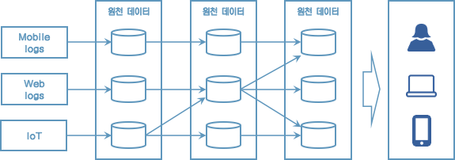

[레거시 데이터 플랫폼 아키텍처]

* 데이터를 배치로 모으는 구조는 유연하지 못하며
* 실시간으로 생성되는 데이터에 대한 인사이트를 서비스 애플리케이션에 빠르게 전달하지 못하는 단점
* 파생된 데이터의 히스토리를 파악하기 어렵고
* 이를 개선하기 위해 스피드 레이어를 만듦


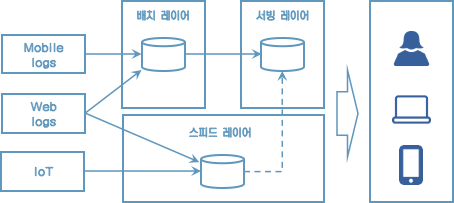

[람다 아키텍처]

람다 아키텍처는 3가지 레이어로 나뉜다.

* 배치 레이어는 배치 데이터를 모아서 특정 시간, 타이밍마다 일괄 처리한다.
* 서빙 레이어는 가공된 데이터를 데이터 사용자, 서비스 애플리케이션이 사용할 수 있도록 데이터가 저장된 공간이다.
* 스피드 레이어는 서비스에서 생성되는 원천 데이터를 실시간으로 분석하는 용도로 사용한다.

람다 아키텍처에서 카프카는 스피드레이어에 위치한다.

람다 아키텍처는 레이어가 2개로 나뉘기 때문에 로직이 2벌로 존재해야 한다는 점과 배치와 실시간 데이터를 융합하여 처리할때는 유연하지 못한 파이프라인을 생성해야 한다.

이런 담점을 해소하기 위해 제이 크렙스는 카파 아키텍처를 제안했다.


[카파 아키텍처]

로직의 파편화, 디버깅, 배포, 운영 분리에 대한 이슈를 제거

그런데 카파 아키텍처는 스피드 레이어에서 모든 데이터를 처리해야 하므로 모든 종류의 데이터를 스트림으로 처리해야 한다.

> **배치 데이터와 스트림 데이터**
>
> '배치 데이터'는 초, 분, 시간, 일 등으로 한정된(bounded) 기간 단위 데이터를 뜻한다.
>
> '스트림 데이터'는 한정되지 않은(unbounded) 데이터로 시작과 끝 데이터가 명확히 정해지지 않은 데이터를 뜻한다.


로그는 텍스트 로그가 아닌 데이터의 집합을 뜻한다. 이 데이터는 지속적으로 추가가 가능하며 각 데이터에는 일정한 번호가 붙는다.

로그는 배치 데이터를 스트림으로 표현하기에 적합하다.


로그로 배치 데이터와 스트림 데이터를 저장하고 사용하기 위해서는 변환 기록이 일정기간 동안 삭제되어서는 안 되고 지속적으로 추가되어야 한다. 그리고 모든 데이터가 스피드 레이어에 들어오는 것을 감안하면 데이터 플랫폼은 SPOF(Single Point Of Failure)가 될 수 있으므로 반드시 내결함성(High Availability)과 장애 허용(fault tolerant) 특징을 지녀야 했다.


# 2 카프카 빠르게 시작해보기

## 2.2 카프카 커맨드 라인 툴

### 2.2.1 kafka-topics.sh

> **토픽을 생성하는 2가지 방법**
>
> 1. 카프카 컨슈머 또는 프로듀서가 카프카 브로커에 생성되지 않은 토픽에 대해 데이터를 요청할 때
> 2. 커맨드 라인 툴로 명시적으로 토픽을 생성하는 것


#### 토픽 생성

```sh
$ bin/kafka-topics.sh \
	--create \
	--bootstrap-server localhost:9092 \
	--topic hello.kafka \
```

파티션 개수, 복제 개수, 토픽 데이터 유지 기간 옵션들을 지정하여 토픽을 생성하고 싶다면 다음과 같이 하면 된다.

```sh
$ bin/kafka-topics.sh \
	--create \
	--bootstrap-server localhost:9092 \
	--partitions 3 \
	--replication-factor 1 \
	--config retention.ms=172800000 \
	--topic hello.kafka.2 \
```


#### 토픽 리스트 조회

```sh
$ bin/kafka-topics.sh --bootstrap-server localhost:9092 --list
```


#### 토픽 상세 조회

```sh
$ bin/kafka-topics.sh --bootstrap-server localhost:9092 --describe --topic hello.kafka.2
```


#### 토픽 옵션 수정

파티션 개수를 3개에서 4개로 늘리고, 리텐션 기간은 172800000ms에서 86400000ms(1일)로 변경해 보자.

```sh
$ bin/kafka-topics.sh --bootstrap-server localhost:9092 \
	--topic hello.kafka \
	--alter \
	--partitions 4
	
$ bin/kafka-configs.sh --bootstrap-server localhost:9092 \
	--entity-type topics \
	--entity-name hello.kafka \
	--alter --add-config retention.ms=86400000
```


### 2.2.2 kafka-console-producer.sh

```sh
$ bin/kafka-console-producer.sh --bootstrap-server localhost:9092 \
	--topic hello.kafka
```

메시지 키 없이 메시지 값만 보내도록 하자. 메시지 키는 자바의 null로 기본 설정되어 브로커로 전송된다.


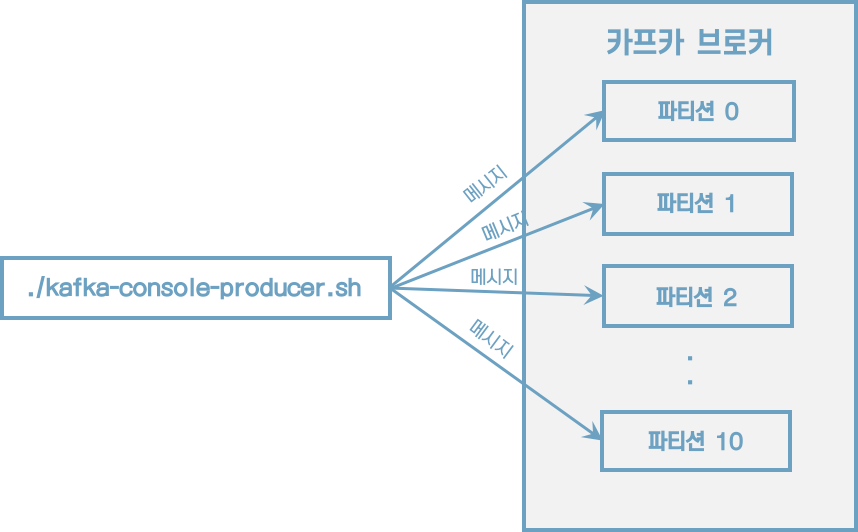


이제 메시지 키를 가지는 레코드를 전송해보자.

```sh
$ bin/kafka-console-producer.sh --bootstrap-server localhost:9092 \
	--topic hello.kafka \
	--property "parse.key=true" \
	--property "key.separator=:"
```


메시지 키와 메시지 값을 함께 전송한 레코드는 토픽의 파티션에 저장된다.  메시지 키가 null인 경우에는 프로듀서가 피티션으로 전송할 때 레코드 배치 단위로 라운드로빈으로 전송한다. 메시지 키가 존재하는 경우에는 키의 해시값을 작성하여 존재하는 파티션 중 한 개에 할당된다. 이로 인해 메시지 키가 동일한 경우에는 동일한 파티션으로 전송된다.


> **파티션 개수가 늘어나면 새로 프로듀싱되는 레코드들은 어느 파티션으로 갈까?**
>
> 이전에 메시지 키가 파티션 0번에 들어갔다면 파티션을 늘린 뒤에는 파티션 0번으로 간다는 보장이 없다. 만일 파티션을 추가하더라도 이전에 사용하던 메시지 키의 일관성을 보장하고 싶다면 커스텀 파티셔너를 만들어서 운영해야 한다.


### 2.2.3 kafka-console-consumer.sh

```sh
$ bin/kafka-console-consumer.sh --bootstrap-server localhost:9092 \
	--topic hello.kafka \
	--from-beginning
```

데이터의 메시지 키와 메시지 값을 확인하고 싶다면 --property 옵션을 사용하면 된다.

```sh
$ bin/kafka-console-consumer.sh --bootstrap-server localhost:9092 \
	--topic hello.kafka \
	--property print.key=true \
	--property key.separator="-" \
	--group hello-group \
	--from-beginning
	
key1-no1
null-4
null-5
null-0
null-1
null-2
null-3
null-hello
null-kafka
key2-no2
key3-no3
```

* 메시지 키를 확인하기 위해 print.key를 true로 설정했다.
* 메시지 키 값을 구분하기 위해 key.separator를 설정했다.
* --group 옵션을 통해 컨슈머 그룹을 생성했다. 이 컨슈머 그룹을 통해 가져간 토픽의 메시지는 가져간 메시지에 대해 커밋을 한다. 커밋 정보는 __consumer_offsets 이름의 내부 토픽에 저장된다.


전송했던 데이터의 순서가 현재 출력되는 순서와 다르다는 것이다. 이는 카프카의 핵심인 파티션 개념때문에 생기는 현상이다. kafka-console-consumer.sh 명령어를 통해 토픽의 데이터를 가져가게 되면 토픽의 모든 파티션으로부터 동일한 중요도로 데이터를 가져간다.


### 2.2.4 Kafka-consumer-groups.sh

컨슈머 그룹의 리스트를 확인

```sh
$ bin/kafka-consumer-groups.sh --bootstrap-server localhost:9092 --list
```


```sh
$ bin/kafka-consumer-groups.sh --bootstrap-server localhost:9092 \
	--group hello-group \
	--describe
```


### 2.2.5 kafka-verifiable-producer.sh, consumer.sh

```sh
$ bin/kafka-verifiable-producer.sh --bootstrap-server localhost:9092 \
	--max-messages 10 \
	--topic verify-test
```


전송한 데이터는 Kafka-verifiable-consumer.sh로 확인할 수 있다.

```sh
$ bin/kafka-verifiable-consumer.sh --bootstrap-server localhost:9092 \
	--topic verify-test \
	--group-id test-group
```


### 2.2.6 kafka-delete-records.sh

이미 적재된 토픽의 데이터를 지우는 방법

```sh
vi delete-topic.json
{"partitions":  [{"topic": "hello.kafka", "partition": 0, "offset": 50}], "version": 1}

$ bin/kafka-delete-records.sh --bootstrap-server localhost:9092 \
	--offset-json-file delete-topic.json
```

토픽의 특정 레코드 하나만 삭제되는 것이 아니라 파티션에 존재하는 가장 오래된 오프셋부터 지정한 오프셋까지 삭제된다는 점이다.


# 3 카프카 기본 개념 설명

## 3.1 카프카 브로커, 클러스터, 주키퍼

* 하나의 서버에는 한 개의 카프카 브로커 프로세스가 실행된다. 
* 카프카 브로커 서버 1대로도 기본 기능이 실행되지만 데이터를 안전하게 보관하고 처리하기 위해 3대 애상의 브로커 서버를 1개의 클러스터로 묶어서 운영한다. 
* 카프카 클러스터로 묶인 브로커들은 프로듀서가 보낸 데이터를 안전하게 분산 저장하고 복제하는 역할을 수행한다.


주키퍼와 연동하여 동작하는 카프카 클러스터


#### 데이터 저장, 전송

```sh
$ ls /tmp/kafka-logs # ------------ 1
drwxr-xr-x   6 macbookpro  wheel  192  5 13 20:16 hello.kafka-0
drwxr-xr-x   6 macbookpro  wheel  192  5 13 20:17 hello.kafka.2-0
drwxr-xr-x   6 macbookpro  wheel  192  5 13 20:17 hello.kafka.2-1
drwxr-xr-x   6 macbookpro  wheel  192  5 13 20:17 hello.kafka.2-2

$ ls /tmp/kafka-logs/hello.kafka-0 # --------2
 macbookpro  /tmp/kafka-logs  ls hello.kafka-0
00000000000000000000.index     00000000000000000000.timeindex
00000000000000000000.log       leader-epoch-checkpoint
```

1. config/server.properties의 <u>log.dir 옵션</u>에 정의한 디렉토리에 데이터를 저장한다. 토픽 이름과 파티션 번호의 조합으로 하위 디렉토리를 생성하여 데이터를 저장한다.
2. hello.kafka 토픽의 0번 파티션에 존재하는 데이터를 확인할 수 있다.
    * log: 메시지와 메타데이터를 저장
    * index: 메시지의 오프셋을 인덱싱한 정보
    * timeindex: 메시지에 포함된 timestamp값을 기준으로 인덱싱한 정보가 담겨 있다.
    * timestamp: 브로커가 적재한 데이터를 삭제하거나 압축하는데 사용한다.


* 카프카는 메모리나 데이터베이스에 저장하지 않으며 따로 캐시 메모리를 구현하지도 않는다. 
* 파일 시스템에 저장하기 때문에 파일 입출력으로 인해 속도 이슈가 발생하지 않을까 의문을 가질 수 있다.

* 카프카는 `페이지 캐시`를 사용하여 디스크 입출력 속도를 높여서 이 문제를 해결했다. 
* 페이지 캐시란 OS에서 파일 입출력의 성능 향상을 위해 만들어 놓은 메모리 영역을 뜻한다. 
* 한번 읽은 내용은 메모리의 페이지 캐시 영역애 저장시킨다. 
* 추후 동일한 파일의 접근이 일어나면 디스크에서 읽지 않고 메모리에서 직접 읽는 방식이다.


#### 데이터 복제, 싱크

복제의이유는 클러스터로 묶인 브로커 중 일부에 장애가 발생하더라도 데이터를 유실하지 않고 안전하게 사용하기 위함이다.
<u>카프카의 데이터 복제는 파티션 단위</u>로 이루어진다.


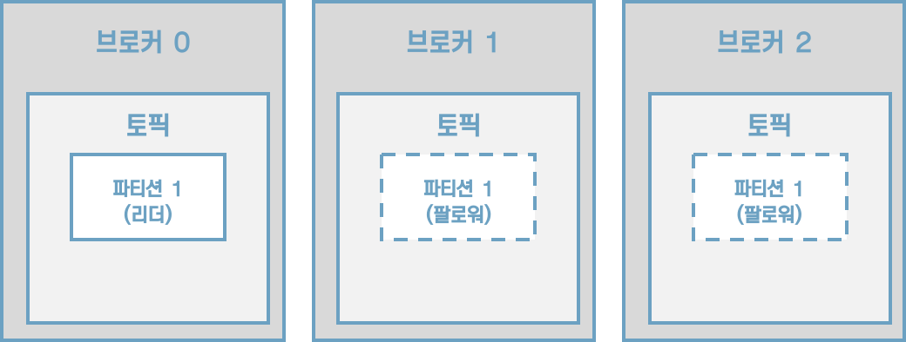

[그림] 토픽의 파티션의 복제 개수가 3인 경우

프로듀서 또는 컨슈머와 직접 통신하는 파티션을 리더, 나머지 복제 데이터를 가지고 있는 파티션을 팔로워라고 부른다.

팔로워 파티션들은 리더 파티션의 오프셋을 확인하여 현재 자신이 가지고 있는 오프셋과 차이가 나는 경우 <u>리더 파티션으로부터 데이터를 가져와서 자신의 파티션에 저장</u>하는데, 이 과정을 `복제`라고 부른다. 복제를 통해 데이터를 안전하게 사용할 수 있다는 강력한 장점 때문에 카프카를 운영할 때 <u>2 이상의 복제 개수</u>를 정하는 것이 중요하다.


[그림] 브로커 0에 장애가 발생한 경우


#### 컨트롤러(controller)

클러스터의 <u>다수 브로커 중 한 대가 컨트롤러의 역할</u>을 한다. <u>컨트롤러는 다른 브로커들의 상태를 체크</u>하고 브로커가 클러스터에서 빠지는 경우 해당 브로커에 존재하는 <u>리더 파티션을 재분배</u>한다. 만약 컨트롤러 역할을 하는 브로커에 장애가 생기면 다른 브로커가 컨트롤러 역할을 한다.


#### 데이터 삭제

카프카는 컨슈머가 데이터를 가져가더라도 토픽의 데이터는 삭제되지 않는다. 또한, 컨슈머나 프로듀서가 데이터 삭제를 요청할 수도 없다. 오직 브로커만이 데이터를 삭제할 수 있다. 데이터 삭제는 파일 단위로 이루어지는데 이 단위를 '로그 세그먼트(log segment)'라고 부른다.


#### 컨슈머 오프셋 저장

컨슈머 그룹은 토픽이 특정 파티션으로부터 데이터를 가져가서 처리하고 이 파티션의 어느 레코드까지 가져갔는지 확인하기 위해 오프셋을 커밋한다. 커밋한 오프셋은 __consumer_offsets 토픽에 저장한다.


#### 코디네이터(coordinator)

클러스터의 다수 브로커 중 한 대는 코디네이터의 역할을 수행한다. `코디네이터`는 컨슈머 그룹의 상태를 체크하고 파티션을 컨슈머와 매칭되도록 분배하는 역할을 한다. 컨슈머가 컨슈머 그룹에서 빠지면 매칭되지 않은 파티션을 정상 동작하는 컨슈머로 할당하여 끊임없이 데이터가 처리되도록 도와준다. 이렇게 파티션을 컨슈머로 재할당하는 과정을 '`리밸런스`(rebalance)'라고 부른다.

주키퍼는 카프카의 메타데이터를 관리하는 데에 사용된다.

```sh
$ bin/zookeeper-shell.sh localhost:2181
Connecting to localhost:2181
Welcome to ZooKeeper!
JLine support is disabled

WATCHER::

WatchedEvent state:SyncConnected type:None path:null

ls /
[admin, brokers, cluster, config, consumers, controller, controller_epoch, isr_change_notification, latest_producer_id_block, log_dir_event_notification, zookeeper]

get /brokers/ids/0
{"listener_security_protocol_map":{"PLAINTEXT":"PLAINTEXT"},"endpoints":["PLAINTEXT://localhost:9092"],"jmx_port":-1,"port":9092,"host":"localhost","version":4,"timestamp":"1620904358029"}

get /controller
{"version":1,"brokerid":0,"timestamp":"1620904358147"}

ls /brokers/topics
[hello.kafka, hello.kafka.2]
```


## 3.2 토픽과 파티션

토픽은 카프카에서 데이터를 구분하기 위해 사용하는 단위이다. 토픽은 1개 이상의 파티션을 소유하고 있다. 파티션에는 프로듀서가 보낸 데이터들이 들어가 저장되는데 이 데이터를 '`레코드`(record)'라고 부른다.


[그림] 프로듀서가 전송한 레코드는 파티션에 저장된다.

파티션은 카프카의 병렬처리의 핵심으로써 그룹으로 묶인 컨슈머들이 레코드를 병렬로 처리할 수 있도록 매칭된다. 컨슈머의 처리량이 한정된 상황에서 많은 레코드를 병렬로 처리하는 가장 좋은 방법은 컨슈머의 개수를 늘려 스케일 아웃하는 것이다. 컨슈머 개수를 늘림과 동시에 파티션 개수를 늘리면 처리량이 증가하는 효과를 볼 수 있다.


파티션은 자료구조에서 접하는 큐와 비슷한 구조라고 생각하면 쉽다.


#### 의미있는 토픽 이름 작명 방법

> 토픽 작명의 템플릿과 예시
>
> * <환경>.<팀-명>.<애플리케이션-명>.<메시지-타입>
>
>     예시) prd.marketing-team.sms-platform.json
>
> * <프로젝트-명>.<서비스-명>.<환경>.<이벤트-명>
>     예시) commerce.payment.prd.notification
>
> * <환경>.<서비스-명>.<JIRA-번호>.<메시지-타입>
>     예시) dev.email-sender.jira-1234.email-vo-custom
>
> * <카프카-클러스터-명>.<환경>.<서비스-명>.<메시지-타입>
>     예시) aws-kafka.live.marketing-platform.json


## 3.3 레코드

레코드는 타임스탬프, 메시지 키, 메시지 값, 오프셋으로 구성되어 있다. 레코드는 수정할 수 없고 로그 리텐션 기간 또는 용량에 따라서만 삭제된다.

* 타임스탬프
    * 브로커 기준 유닉스 시간이 설정
* 메시지 키
    * 메시지 값을 순서대로 처리하거나 메시지 값의 종류를 나타내기 위해 사용
    * 메시지 키의 해시값을 토대로 파티션을 지정하게 된다. 즉, 동일한 메시지 키라면 동일 파티션에 들어가는 것이다.
    * 메시지 키를 사용하지 않는다면 레코드는 기본 설정 파티셔너에 따라 파티션에 분배된다.
* 메시지 값
    * 실질적으로 처리할 데이터가 들어 있다.
    * 메시지 키와 메시지 값은 직렬화되어 브로커로 전송되기 때문에 동일한 형태로 역직렬화를 수행해야 한다.
* 오프셋
    * 0 이상의 숫자
    * 이전에 전송된 레코드의 오프셋+1 값으로 생성된다.


## 3.4 카프카 클라이언트

### 3.4.1 프로듀서 API

```java
public class SimpleProducer {
    private final static Logger logger = LoggerFactory.getLogger(SimpleProducer.class);
    private final static String TOPIC_NAME = "test";
    private final static String BOOTSTRAP_SERVERS = "localhost:9092";

    public static void main(String[] args) {
        Properties configs = new Properties();
        configs.put(ProducerConfig.BOOTSTRAP_SERVERS_CONFIG, BOOTSTRAP_SERVERS);
        configs.put(ProducerConfig.KEY_SERIALIZER_CLASS_CONFIG, StringSerializer.class.getName());
        configs.put(ProducerConfig.VALUE_SERIALIZER_CLASS_CONFIG, StringSerializer.class.getName());

        KafkaProducer<String, String> producer = new KafkaProducer<String, String>(configs);

        String messageKey = "key1";
        String messageValue = "testMessage";
        ProducerRecord<String, String> record = new ProducerRecord(TOPIC_NAME, messageKey, messageValue);
        producer.send(record);
        logger.info("{}", record);
        producer.flush();
        producer.close();
    }
}
```


### 3.4.2 컨슈머 API

```java
public class SimpleConsumer {
    private final static Logger logger = LoggerFactory.getLogger(SimpleProducer.class);
    private final static String TOPIC_NAME = "test";
    private final static String BOOTSTRAP_SERVERS = "localhost:9092";
    private final static String GROUP_ID = "test-group";

    public static void main(String[] args) {
        Properties configs = new Properties();
        configs.put(ConsumerConfig.BOOTSTRAP_SERVERS_CONFIG, BOOTSTRAP_SERVERS);
        configs.put(ConsumerConfig.GROUP_ID_CONFIG, GROUP_ID);
        configs.put(ConsumerConfig.KEY_DESERIALIZER_CLASS_CONFIG, StringDeserializer.class.getName());
        configs.put(ConsumerConfig.VALUE_DESERIALIZER_CLASS_CONFIG, StringDeserializer.class.getName());

        KafkaConsumer<String, String> consumer = new KafkaConsumer<>(configs);
        consumer.subscribe(Arrays.asList(TOPIC_NAME));

        while (true) {
            ConsumerRecords<String, String> records = consumer.poll(Duration.ofSeconds(1));
            for (ConsumerRecord<String, String> record: records) {
                logger.info("{}", record);
            }
        }
    }
}
```


#### 컨슈머 중요 개념

토픽의 파티션으로부터 데이터를 가져가기 위해 컨슈머를 운영하는 방법은 크게 2가지가 있다.

1. 1개 이상의 컨슈머로 이루어진 컨슈머 그룹을 운영하는 것
2. 토픽의 특정 파티션만 구독하는 컨슈머를 운영하는 것

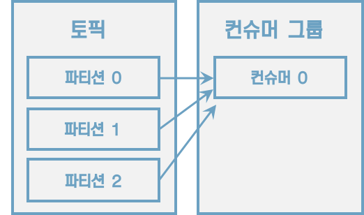

[그림] 컨슈머 1개로 이루어진 컨슈머 그룹이 3개의 파티션에 할당

컨슈머 그룹으로 묶인 컨슈머가 토픽을 구독해서 데이터를 가져갈 때, 1개의 파티션은 최대 1개의 컨슈머에 할당 가능하다. 그리고 1개 컨슈머는 여러 개의 파티션에 할당될 수 있다. 이러한 특징으로 컨슈머 그룹의 컨슈머 개수는 가져가고자 하는 토픽의 파티션 개수보다 같거나 작아야 한다.


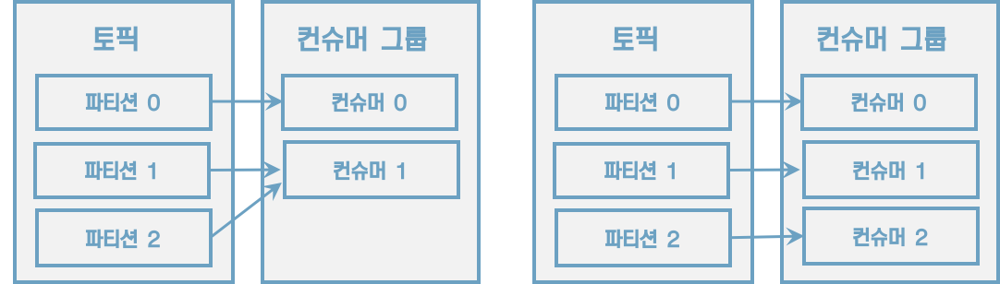

[그림] 컨슈머 2개, 컨슈머 3개인 경우


3개의 파티션을 가진 토픽을 효과적으로 처리하기 위해서는 3개 이하의 컨슈머 그룹으로 운영해야 한다. 만약 4개의 컨슈머로 이루어진 컨슈머 그룹으로 3개의 파티션을 가진 토픽에서 데이터를 가져가기 위해 할당하면 1개의 컨슈머는 파티션을 할당받지 못하고 유휴상태로 남게 된다.


[그림] 컨슈머 1개가 놀고 있는 모습


컨슈머 그룹은 다른 컨슈머 그룹과 격리되는 특징을 가지고 있다.

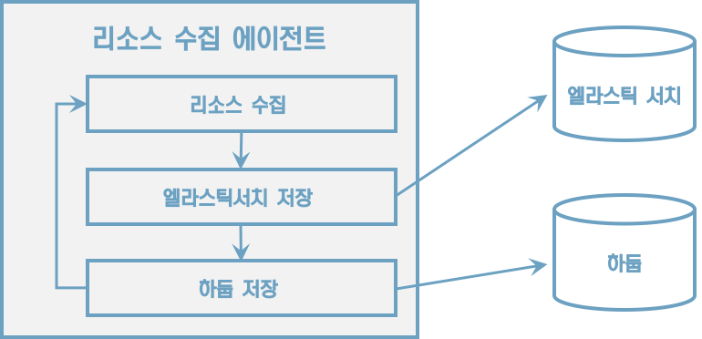

[그림] 동기 로직으로 돌아가는 에이전트 애플리케이션


[그림] 컨슈머 그룹으로 적재 로직을 분리하여 운영

컨슈머 그룹의 컨슈머에 장애가 발생하면 어떻게 될까? 컨슈머 그룹으로 이루어진 컨슈머들 중 일부 컨슈머에 장애가 발생하면, 장애가 발생한 컨슈머에 할당된 파티션은 장애가 발생하지 않은 컨슈머에 소유권이 넘어간다. 이러한 과정을 '`리밸런싱`(relalancing)'이라고 부른다.

리밸런싱은 크게 두 가지 상황에서 일어난다.

1. 컨슈머가 추가되는 상황
2. 컨슈머가 제외되는 상황


[그림] 컨슈머 장애 발생 시 리밸런싱 발생

리밸런싱은 유용하지만 자주 일어나서는 안 된다. 리밸런싱이 발생할 때 파티션의 소유권을 컨슈머로 재할당하는 과정에서 해당 컨슈머 그룹의 컨슈머들이 토픽의 데이터를 읽을 수 없기 때문이다. 그룹 조정자(group coordinator)는 리밸런싱을 발동시키는 역할을 하는데 컨슈머 그룹의 컨슈머가 추가되게 삭제될 때 감지한다. 카프카 브로커 중 한 대가 그룹 조정자의 역할을 수행한다.

컨슈머는 카프카의 브로커로부터 데이터를 어디까지 가져갔는지 커밋을 통해 기록한다.


[그림] 컨슈머는 처리 완료한 레코드의 오프셋을 커밋한다.

오프셋 커밋은 컨슈머 애플리케이션에서 명시적, 비명시적으로 수행할 수 있다. 기본 옵션은 poll() 메서드가 수행될 때 일정 간격마다 오프셋을 커밋하도록 enable.auto.commit=true로 설정되어 있다. 이렇게 일정 간격마다 자동으로 커밋되는 것을 <u>비명시적 '오프셋 커밋'</u>이라고 부른다. 이 옵션은 auto.commit.interval.ms에 설정된 값 이상이 지났을 때 그 시점까지 읽은 레코드를 오프셋을 커밋한다. 하지만 poll() 메서드 호출 이후 리밸런싱 또는 컨슈머 강제 종료 시 컨슈머가 처리하는 데이터가 중복 또는 유실될 수 있는 가능성이 있는 취약한 구조를 가지고 있다.

명시적 오프셋을 커밋하려면 poll() 메서드 호출 이후에 반환받는 데이터의 처리가 완료되고 commitSync() 메서드를 호출하면 된다. commitSync() 메서드는 poll() 메서드를 통해 반환된 레코드의 가장 마지막 오프셋을 기준으로 커밋을 수행한다. commitSync() 메서드는 브로커에 커밋 요청을 하고 커밋이 정상적으로 처리되었는지 응답하기까지 기다리는데 이는 컨슈머의 처리량에 영향을 끼친다. 데이터 처리 시간에 비해 커밋 요청 및 응답에 시간이 오래 걸린다면 동일 시간당 데이터 처리량이 줄어들기 때문이다. 이를 해결하기 위해 commitAsync() 메서드를 사용하여 커밋 요청을 전송하고 응답이 오기 전까지 데이터 처리를 수행할 수 있다. 하지만 비동기 커밋은 커밋 요청이 실패했을 경우 현재 처리 중인 데이터의 순서를 보장하지 않으며 데이터의 중복 처리가 발생할 수 있다.


[그림] 컨슈머 내부구조

컨슈머는 poll() 메서드를 통해 레코드들을 반환받지만 <u>poll() 메서드를 호출하는 시점에 클러스터에서 데이터를 가져오는 것은 아니다</u>. 컨슈머 애플리케이션을 실행하게 되면 내부에서 Fetcher 인스턴스가 생성되어 poll() 메서드를 호출하기 전에 미리 레코드들을 내부 큐로 가져온다. 이후에 사용자가 명시적으로 poll() 메서드를 호출하면 컨슈머는 내부 큐에 있는 레코드들을 반환받아 처리를 수행한다.


#### 컨슈머 주요 옵션

* 필수 옵션
    * bootstrap.servers
    * key.deserializer
    * value.deserializer
* 선택 옵션
    * `group.id`:  컨슈머 그룹 아이디를 지정한다. subscribe 메서드로 토픽을 구독하여 사용할 때는 이 옵션을 필수로 넣어야 한다. <u>기본값은 null</u>이다.
    * `auto.offset.reset`:  컨슈머 그룹이 특정 파티션을 읽을 때 저장된 컨슈머 오프셋이 없는 경우 어느 오프셋부터 읽을지 선택하는 옵션이다. 이미 컨슈머 오프셋이 있다면 이 옵션값은 무시된다. 이 옵션은 lastest, earliest, none 중 1개를 설정할 수 있다.
        * latest(<u>기본값</u>): 가장 높은(가장 최근에 넣은) 오프셋부터 읽기 시작한다.
        * earliest: 가장 낮은(가장 오래전에 넣은) 오프셋부터 읽기 시작한다.
        * none: 컨슈머 그룹이 커밋한 기록이 있는지 찾아본다. 컨슈머 그룹이 커밋한 기록이 있는지 찾아본다. 없다면 오류를 반환하고, 있다면 기존 커밋이후 오프셋 부터 읽기 시작하다.
    * `auto.commit.interval.ms`: 자동 커밋(enable.auto.commit=true)일 경우 오프셋 커밋 간격을 지정한다. <u>기본값은 5000(5초)</u>이다.
    * `max.poll.records`: poll() 메서드를 통해 반환되는 레코드 개수를 지정한다. <u>기본값은 500</u>이다.
    * `session.timeout.ms`: 컨슈머가 브로커와 연결이 끊기는 최대 시간이다. 이 시간 내에 하트비트를 전송하지 않으면 브로커는 컨슈머에 이슈가 발생했다고 가정하고 리밸런싱을 시작한다. 보통 하트비트 시간 간격의 3개로 설정한다. <u>기본값은 10000(10초)</u>이다.
    * `heartbeat.interval.ms`: 하트비트를 전송하는 시간 간격이다. <u>기본값은 3000(3초)</u>이다.
    * `max.poll.interval.ms`: poll() 메서드를 호출하는 간격의 최대 시간을 지정한다. poll() 메서드를 호출한 이후에 데이터를 처리하는 데에 시간이 너무 많이 걸리는 경우 비정상으로 판단하고 리밸런싱을 시작한다. <u>기본값은 300000(5분)</u>이다.
    * `isolation.level`: 트랜잭션 프로듀서가 레코드를 트랜잭션 단위로 보낼 경우 사용한다. <u>기본값은 read_uncommited</u>이다.


#### 컨슈머의 안전한 종료

정상적으로 종료되지 않은 컨슈머는 세션 타임아웃이 발생할 때까지 컨슈머 그룹에 남게 된다. 이로 인해 실제로는 종료되었지만 더는 동작을 하지 않는 컨슈머가 존재하기 때문에 파티션의 데이터는 소모되지 못하고 컨슈머 랙이 늘어나게 된다. 컨슈머 랙이 늘어나면 데이터 처리 지연이 발생하게 된다.

컨슈머를 안전하게 종료하기 위해 KafkaConsumer 클래스는 wakeup() 메서드를 지원한다. 


## 3.5 카프카 스트림즈

카프카 스트림즈는 토픽에 적재된 데이터를 실시간으로 변환하여 다른 토픽에 적재하는 라이브러리이다.


[그림] 카프카 스트림즈 모식도

> **프로듀서와 컨슈머를 조합해서 사용하지 않고 스트림즈를 사용해야 하는 이유**
>
> 스트림 데이터 처리에 있어 필요한 다양한 기능을 스트림즈 DSL로 제공하며 필요하다면 프로세서 API를 사용하여 기능을 확장할 수 있기 때문이다. 컨슈머와 프로듀서를 조합하여 스트림즈가 제공하는 기능을 유사하게 만들 수 있다. 그러나 스트림즈 라이브러리를 통해 제공하는 단 한 번의 데이터 처리, 장애 허용 시스템 등의 특징들은 컨슈머와 프로듀서의 조합만으로는 완벽하게 구현하기는 어렵다.# 4 카프카 상세 개념 설명

## 4.1 토픽과 파티션

토픽은 카프카의 시작과 끝이다. 카프카를 사용하는 것은 토픽을 만들면서 시작된다.

토픽에 대해 잘 이해하고 설정을 잘하는 것이 카프카를 통한 데이터 활용도를 높이는 길이다.


### 4.1.1 적정 파티션 개수

**토픽 생성 시 파티션 개수 고려사항 3가지**

* 데이터 처리량
* 메시지키 사용 여부
* 브로커, 컨슈머 영향도

데이터 처리 속도를 올리는 방법은 2가지다. 

1. 컨슈머의 처리량을 늘리는 것
    * 서버의 사양을 올리는 스케일 업
    * gc 튜닝
2. 컨슈머를 추가해서 병렬처리량을 늘리는 것
    * 데이터 처리량을 늘리는 가장 확실한 방법이다.
    * 프로듀서가 보내는 데이터가 초당 1,000레코드이고 컨슈머가 처리할 수 있는 데이터가 초당 100레코드라면 최소한 필요한 파티션 개수는 10개이다.
    * 
    * 만약 컨슈머 데이터 처리량이 프로듀서가 보내는 데이터보다 적다면 컨슈머 랙이 생기고, 데이터 처리 지연이 발생한다.
    * 카프카 컨슈머를 개발할 때 내부 로직을 고민하여 시간 복잡도를 줄이기 위해 다양한 노력을 하는 것도 좋다.


파티션 개수를 무조건 늘리는 것만이 능사가 아니다. 파티션 개수를 늘리게 됨에 따라 컨슈머, 브로커의 부담이 있기 때문이다.

메시지 키를 사용함과 동시에 데이터 처리 순서를 지켜야 하는 경우에 대해 고려해야 한다. 메시지 키 사용 여부는 데이터 처리 순서와 밀접한 연관이 있다. 프로듀서가 기본 파티셔너를 사용하는 경우를 가정하자. 메시지 키를 사용하면 프로듀서가 토픽으로 데이터를 보낼 때 메시지 키를 해시 변환하여 메시지 키를 파티션에 매칭시킨다. 만약 파티션 개수가 달라지면 이미 매칭된 파티션과 메시지 키의 매칭이 깨지고 전혀 다른 파티션에 데이터가 할당된다.


[그림] 파티션 개수가 달라지기 이전과 이후 메시지 키와 파티션의 매칭 변화. 파티션이 2개일 때 메시지 키 seoul은 0번, jeju는 1번 파티션으로 할당되었다. 파티션이 3개일 때는 seoul, jeju 두 개의 메시지 키 모두 2번 파티션으로 할당되었다.

메시지 키를 사용하고 컨슈머에서 메시지 처리 순서가 보장되어야 한다면 최대한 파티션의 변화가 발생하지 않는 방향으로 운영해야 한다. 메시지 키별로 처리 순서를 보장하기 위해서는 파티션 개수를 프로듀서가 전송하는 데이터양보다 더 넉넉하게 잡고 생성하는 것이 좋다.

마지막으로 고려해야 할 점은 브로커와 컨슈머의 영향도이다. 카프카에서 파티션은 각 브로커의 파일 시스템을 사용하기 때문에 파티션이 늘어나는 만큼 브로커에서 접근하는 파일 개수가 많아진다. 그런데 운영체제에서는 프로세스당 열 수 있는 파일 최대 개수를 제한하고 있다. 그러므로 카프카 브로커가 접근하는 파일 개수를 안정적으로 유지하기 위해서는 각 브로커당 파티션 개수를 모니터링해야 한다.


### 4.1.2 토픽 정리 정책(cleanup.policy)

토픽의 데이터는 시간 또는 용량에 따라 삭제 규칙을 적용할 수 있다.
데이터를 오래동안 삭제하지 않으면 저장소 사용량이 지속적으로 늘어나게 된다.

cleanup.policy 옵션을 사용하여 데이터를 삭제할 수 있는 2가지 삭제 정책을 제공한다.

1. delete(삭제): 데이터의 완전 삭제
2. compact(압축): 동일 메시지 키의 가장 오래된 데이터를 삭제하는 것


#### 토픽 삭제 정책(delete policy)

토픽을 운영하면 일반적으로 대부분의 토픽의 cleanup.policy를 delete로 설정한다. 토픽의 데이터를 삭제할 때는 세그먼트 단위로 삭제를 진행하다. 세그먼트는 토픽의 데이터를 저장하는 명시적인 파일 시스템 단위이다. 세그먼트는 파티션마다 별개로 생성되며 세그먼트의 파일 이름은 오프셋 중 가장 작은 값이 된다. 세그먼트는 여러 조각으로 나뉘는데 segment.bytes 옵션으로 1개의 세그먼트 크기를 설정할 수 있다. segment.bytes 크기보다 커질 경우 기존에 적재하던 세그먼트 파일을 닫고 새로운 세그먼트를 열어서 데이터를 저장한다. 데이터를 저장하기 위해 사용 중인 세그먼트를 액티브 세그먼트라고 한다.


[그림] 토픽과 세그먼트

삭제 정책이 실행되는 시점은 시간 또는 용량이 기준이 된다. retention.ms는 토픽의 데이터를 유지하는 기간을 밀리초로 설정할 수 있다. 카프카는 일정 주기마다 세그먼트 파일의 마지막 수정 시간과 retention.ms를 비교하는데, 세그먼트 파일의 마지막 수정 시간이 retention.ms를 넘어가면 세그먼트는 삭제된다. retention.bytes는 토픽의 최대 데이터 크기를 제어한다. retention.bytes를 넘어간 세그먼트 파일들은 삭제된다. 삭제된 데이터는 복구할 수 없다.


#### 토픽 압축 정책(compact policy)

압축이란 메시지 키별로 해당 메시지 키의 레코드 중 오래된 데이터를 삭제하는 정책을 뜻한다. 메시지 키를 기준으로 오래된 데이터를 삭제하기 때문에 삭제 정책과 다르게 1개 파티션에서 오프셋의 증가가 일정하지 않을 수 있다. 즉, 1부터 10까지 오프셋이 있고, 4,5,6이 동일한 메시지 키를 가질 경우, 오프셋과 관계없이 중간에 있는 4번, 5번 오프셋의 레코드가 삭제될 수 있다는 뜻이다. 4,5,6이 동일한 메시지 키를 가지고 있는데, 6번에 비해 4번, 5번 오프셋의 레코드는 오래된 데이터이기 때문이다.


[그림] 토픽 압축에 따른 데이터의 변화. 가장 최근의 메시지 키 레코드만 남기고 나머지는 삭제한다.

압축 정책은 액티브 세그먼트를 제외한 나머지 세그먼트들에 한해서 데이터를 처리한다. 데이터의 압축 시작 시점은 min.cleanable.dirty.ratio 옵션값을 따른다. min.cleanable.dirty.ratio 옵션값은 액티브 세그먼트를 제외한 세그먼트에 남아 있는 데이터의 테일 영역의 레코드 개수와 헤드 영역의 레코드 개수의 비율을 뜻한다. 테일 영역은 브로커의 압축 정책에 의해 압축이 완료된 레코드를 뜻한다. 테일 영역의 레코드들은 '클린(clean) 로그'라고 부르고 압축이 완료됐기 때문에 테일 영역에는 중복된 메시지 키가 없다. 헤드 영역의 레코드들은 '더티(dirty) 로그'라고 부르고 압축이 되기 전 레코드를이 있으므로 중복된 메시지 키를 가진 레코드들이 있다.


[그림] 테일, 헤드 영역의 레코드를 표시한 파티션

'더티 비율(dirty ratio)'은 더티 영역의 메시지 개수를 압축 대상 세그먼트에 남아있는 데이터의 총 레코드 수(더티 영역 메시지 개수 + 클린 영역 메시지 개수)로 나눈 비율을 뜻한다. 만약 클릭 영역에 3개의 레코드가 있고 더티 영역에 레코드가 3개 있다면 더티 비율은 0.5이다.

토픽의 압축은 min.cleanable.dirty.ratio값에 따라 수행된다. 만약 min.cleanable.dirty.ratio 옵션값을 0.5로 설정할 경우에 더티 비율이 0.5가 넘어가며 압축이 수행된다. min.cleanable.dirty.ratio값을 0.9와 같이 크게 설정하면 한번 압축을 할 때 많은 데이터가 줄어들므로 압축 효과가 크다. min.cleanable.dirty.ratio를 0.1과 같이 작게 설정하면 압축이 더 자주 일어나기 때문에 계속해서 메시지 키의 최신 데이터만 유지할 수 있다. 하지만 압축이 자주 발생하는 만큼 브로커에 부담을 줄 수 있다.


### 4.1.3 ISR(In-Sync-Replicas)

ISR은 리더 파티션과 팔로워 파티션이 모두 싱크가 된 상태를 뜻한다. 복제 개수가 2인 토픽을 가정해보자. 이 토픽에는 리더 파티션 1개와 팔로워 파티션이 1개가 존재할 것이다. 리더 파티션에 0부터 3의 오프셋이 있다고 가정할 때, 팔로워 파티션에 동기화가 완료되려면 0부터 3까지 오프셋이 존재해야 한다. 리더 파티션과 팔로워 파티션이 동기화된 상태에서는 리더 또는 팔로워 파티션이 위치하는 브로커에 장애가 발생하더라도 데이터를 안전하게 사용할 수 있다.

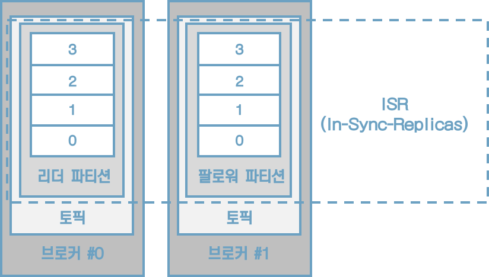

[그림] ISR은 리더 파티션과 팔로워 파티션의 오프셋이 동일한 상태를 뜻한다.

ISR이라는 용어가 나온 이유는 팔로워 파티션이 리더 파티션으로부터 데이터를 복제하는 데에 시간이 걸리기 때문이다. 프로듀서가 특정 파티션에 데이터를 저장하는 작업은 리더 파티션을 통해 처리한다. 이때 리더 파티션에 새로운 레코드가 추가되어 오프셋이 증가하면 팔로워 파티션이 위치는 브로커는 리더 파티션의 데이터를 복제한다. 리더 파티션에 데이터가 적재된 이후 팔로워 파티션이 복제하는 시간차 때문에 리더 파티션과 팔로워 파티션 간에 오프셋 차이가 발생한다. 이런 차이를 모니터링하기 위해 리더 파티션은 replica.lag,time.max.ms값만큼의 주기를 가지고 팔로워 파티션이 데이터를 복제하는지 확인한다. 만약 팔로워 파티션이 replica.lag,time.max.ms값보다 더 긴 시간 동안 데이터를 가져가지 않는다면 해당 팔로워 파티션에 문제가 생긴 것으로 판단하고 ISR그룹에서 제외한다.


[그림] 팔로워 파티션이 위치한 브로커는 리더 파티션의 데이터를 복제한다.

ISR로 묶인 리더 파티션과 팔로워 파티션은 파티션에 존재하는 데이터가 모두 동일하기 때문에 팔로워 파티션은 리더 파티션으로 새로 선출될 자격을 가진다.

일부 데이터 유실이 발생하더라도 서비스를 중단하지 않고 지속적으로 토픽을 사용하고 싶다면 ISR이 아닌 팔로워 파티션을 리더로 선출하도록 설정할 수 있다.

unclean.reader.election.enable 옵션을 false로 설정할 경우 ISR이 아닌 팔로워 파티션을 리더 파티션으로 선출하지 않는다. 이 경우에는 리더 파티션이 존재하는 브로커가 다시 시작될 때까지 기다린다. 이것은 토픽을 사용하는 서비스가 중단됨을 뜻한다. 장애가 발생한 브로커가 다시 실행될 때까지는 해당 토픽은 사용할 수 없다. 대신 데이터의 유실은 발생하지 않는다.


[그림] unclean.reader.election.enable이 false인 경우에는 리더로 선출할 팔로워 파티션이 없으므로 리더 파티션이 있는 브로커가 다시 실행될 때까지 기다린다.

unclean.reader.election.enable을 true로 설정하는 경우에는 ISR이 아닌 팔로워 파티션, 즉 동기화가 되지 않은 팔로워 파티션도 리더로 선출될 수 있다. 리더 파티션이 존재하는 브로커에서 장애가 발생하고 동기화되지 않은 팔로워 파티션이 리더로 선출되면 리더 파티션으로부터 동기화가 되지 않은 일부 데이터는 유실될 수 있다. 일부 데이터가 유실되는 대신 토픽을 사용하는 서비스의 중단은 발생하지 않는다.


[그림] unclean.reader.election.enable이 true인 경우에는 ISR이 아닌 팔로워 파티션도 리더로 선출될 수 있다. 장애가 발생한 브로커 #0의 오프셋 3의 레코드는 유실된다.

unclean.reader.election.enable을 true로 할지 false로 할지 정하는 것은 서비스의 운영 정책에 따라 달라진다.

unclean.reader.election.enable 옵션은 토픽별로 설정할 수 있으며 토픽 생성 시 설정하는 방법은 다음과 같다.

```sh
$ bin/kafka-topics.sh --bootstrap-server localhost:9092 \
	--create --topic my-topic \
	--config unclean.reader.election.enable=false
```


## 4.2 카프카 프로듀서

### 4.2.1 acks 옵션

카프카 프로듀서의 acks 옵션은 0, 1, all(또는 -1) 값을 가질 수 있다.

#### acks=0

acks를 0으로 설정하는 것은 프로듀서가 리더 파티션으로 데이터를 전송했을 때 리더 파티션으로 데이터가 저장되었는지 확인하지 않는다는 뜻이다. 리더 파티션은 데이터가 저장된 이후에 데이터가 몇 번째 오프셋에 저장되었는지 리턴하는데, acks가 0으로 설정되어 있다면 프로듀서는 리더 파티션에 데이터가 저장되었는지 여부에 대한 응답 값을 받지 않는다. 그렇기 때문에 프로듀서가 데이터를 보낸 이후에 이 데이터가 몇 번째 오프셋에 저장되었는지 확인할 수 없다.


[그림] acks=0인 경우 프로듀서의 동작, 리더 파티션에 데이터가 적재되지 않더라도 성공으로 판단한다.

프로듀서에는 데이터의 전송이 실패했을 때 재시도를 할 수 있도록 retries 옵션을 설정할 수 있는데, acks가 0일 때 프로듀서는 전송을 하자 마자 저장되었음을 가정하고 다음 데이터를 전송하기 때문에 데이터 전송이 실패한 경우를 알 수 없다. 따라서 retries가 2이상으로 설정되어 있더라도 재시도를 하지 않기 때문에 retries 옵션값은 무의미하다.

acks를 0으로 설정했을 경우, 프로듀서와 브로커 사이의 네트워크 오류나 브로커의 이슈 등으로 인해 데이터가 유실되더라도 프로듀서는 리더 파티션으로부터 응답값을 받지 않기 때문에 지속적으로 다음 데이터로 보낸다. 그렇기 때문에 데이터의 전송 속도는 acks를 1 또는 all로 했을 경우보다 훨씬 빠르다. 데이터가 일부 유실이 발생하더라도 전송 속도가 중요한 경우에는 이 옵션값을 사용하면 좋다.

#### acks=1

acks를 1로 설정할 경우 프로듀서는 보낸 데이터가 리더 파티션에만 정상적으로 적재되었는지 확인한다. 만약 리더 파티션에 정상적으로 적재되지 않았다면 리더 파티션에 적재될 때까지 재시도할 수 있다. 그러나 리더 파티션에 적재되었음을 보장하더라도 데이터는 유실될 수 있다. 왜냐하면 복제 개수를 2이상으로 운영할 경우 리더 파티션에 적재가 완료되어 있어도 팔로워 파티션에는 아직 데이터가 동기화되지 않을 수 있는데, 팔로워 파티션이 데이터를 복제하기 직전에 리더 파티션이 있는 브로커에 장애가 발생하면 동기화되지 못한 일부 데이터가 유실될 수 있기 때문이다.

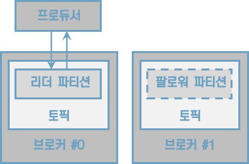

[그림] acks=1인 경우 프로듀서의 동작, 리더 파티션에 데이터가 저장되었으면 성공으로 판단한다.

acks를 1로 설정하면 리더 파티션에 데이터가 적재될 때까지 기다린 뒤 응답 값을 받기 때문에 acks를 0으로 설정하는 것에 비해 전송 속도가 느리다.

#### acks=all 또는 acks=-1

acks를 all 또는 -1로 설정할 경우 프로듀서는 보낸 데이터가 리더 파티션과 팔로워 파티션에 모두 정상적으로 적재되었는지 확인한다. 리더 파티션뿐만 아니라 팔로워 파티션까지 데이터가 적재되었는지 확인하기 때문에 0또는 1 옵션보다도 속도가 느리다. 그럼에도 불구하고 팔로워 파티션에 데이터가 정상 적재되었는지 기다리기 때문에 일부 브로커에 장애가 발생하더라도 프로듀서는 안전하게 데이터를 전송하고 저장할 수 있음을 보장할 수 있다.

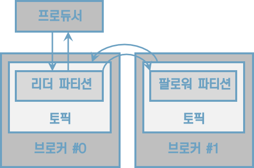

[그림] acks=all인 경우 프로듀서의 동작

acks를 all로 설정할 경우 토픽 단위로 설정 가능한 min.insync.replicas 옵션값에 따라 데이터의 안정성이 달라진다. all 옵션값은 모든 리더 파티션과 팔로워 파티션의 적재를 뜻하는 것은 아니고 ISR에 포함된 파티션들을 뜻하는 것이기 때문이다. min.insync.replicas 옵션은 프로듀서가 리더 파티션과 팔로워 파티션에 데이터가 적재되었는지 확인하기 위한 최소 ISR 그룹의 파티션 개수이다. 예를 들면 min.insync.replicas의 옵션값이 1이라면 ISR 중 최소 1개 이상의 파티션에 데이터가 적재되었음을 확인하는 것이다. 이 경우 acks를 1로 했을 때와 동일한 동작을 하는데, 왜냐하면 ISR 중 가장 처음 적재가 완료되는 파티션은 리더 파티션이기 때문이다.


[그림] acks=all, min.insync.replicas=1인 경우 프로듀서의 동작. acks를 1로 했을 때와 동일하다.

min.insync.replicas의 옵션값을 2로 설정했을 때부터 acks를 all로 설정하는 의미가 있다. 이 경우 ISR의 2개 이상의 파티션에 데이터가 정상 적재되었음을 확인한다는 뜻이다. ISR의 2개 이상의 파티션에 적재되었음을 확인한다는 뜻은 적어도 리더 파티션과 1개의 팔로워 파티션에 데이터가 정상적으로 적재되었음을 보장한다.


min.insync.replicas를 설정할 때는 복제 개수도 함께 고려해야 한다. 왜냐하면 운영하는 카프카의 브로커 개수가 min.insync.replicas의 옵션값보다 작은 경우에는 프로듀서는 더는 데이터를 전송할 수 없기 때문이다. 복제 개수를 3으로 설정하고 min.insync.replicas를 3으로 설정하는 경우를 예로 들 수 있다. 브로커 3대 중 1대에 이슈가 발생하여 동작하지 못하는 상황이 생기면 프로듀서는 데이터를 해당 토픽에 더는 전송할 수 없다. 왜냐하면 최소한의 복제되어야 하는 파티션 개수가 3인데 팔로워 파티션이 위치할 브로커의 개수가 부족하기 때문이다. 이 경우에는 NotEmoughReplicasException 또는 NotEnoughtReplicasAfterAppendException이 발생하여 더는 토픽으로 데이타를 전송할 수 없다.

min.insync.replicas 옵션을 설정할 때 추가로 주의해야 할 점은 절대로 브로커 개수와 동일한 숫자로 설정하면 안 된다는 것이다. 브로커 3대로 클러스터를 운영하면서 min.insyncs.replicas 옵션을 3으로 설정하는 경우를 예로 들 수 있다. 이런 상황에서 카프카 클러스터의 버전 업그레이드와 같은 상황이 발생하면 블로커는 롤링 다운 타임이 생기는데, 브로커가 1개라도 중단되면 프로듀서는 데이터를 추가할 수 없다. 그러므로 토픽별 min.insync.replicas 옵션값은 브로커 개수 미만으로 설정해서 운영해야 한다.

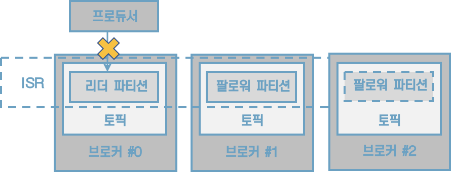

[그림] acks=all, replication.factor=3, min.insync.replicas=3인 경우 브로커 중 1대가 고장나면 더는 토픽에 데이터를 보낼 수 없다.

상용환경에서는 일반적으로 브로커를 3대 이상으로 묶어 클러스터를 운영하는데, 이 점을 고려하여 프로듀서가 데이터를 가장 안정적으로 보내려면 토픽의 복제 개수는 3, min.insync.replicas를 2로 설정하고 프로듀서는 acks를 all로 설정하는 것을 추천한다.


### 4.2.2 멱등성(idempotence) 프로듀서

멱등성이란 여러 번 연산을 수행하더라도 동일한 결과를 나타내는 것을 뜻한다. 이러한 의미에서 멱등성 프로듀서는 동일한 데이터를 여러 번 전송하더라도 카프카 클러스터에 단 한 번만 저장됨을 의미한다. 기본 프로듀서의 동작 방식은 적어도 한번 전달(at least once delivery)을 지원한다. 적어도 한번 전달이란 프로듀서가 클러스터에 데이터를 전송하여 저장할 때 적어도 한 번 이상 데이터를 적재할 수 있고 데이터가 유실되지 않음을 뜻한다. 다만, 두 번 이상 적재할 가능성이 있으므로 데이터의 중복이 발생할 수 있다.

프로듀서가 보내는 데이터의 중복 적재를 막기 위해 0.11.0 이후 버전부터는 프로듀서에서 enable.idempotence옵션을 사용하여 정확히 한번 전달(exactly once delivery)을 지원한다. enable.idempotence옵션의 기본값은 false이며 정확히 한번 전달을 위해서는 true로 옵션값을 설정해서 멱등성 프로듀서로 동작하도록 만들면 된다. 멱등성 프로듀서는 기본 프로듀서와 달리 데이터를 브로커로 전달할 때 프로듀서 PID(Producer unique ID)와 시퀀스 넘버를 함께 전달한다. 그러면 브로커는 프로듀서의 PID와 시퀀스 넘버를 확인하여 동일한 메시지의 적재 요청이 오더라도 단 한 번만 데이터를 적재함으로써 프로듀서의 데이터는 정확히 한번 브로커에 적재되도록 동작한다.

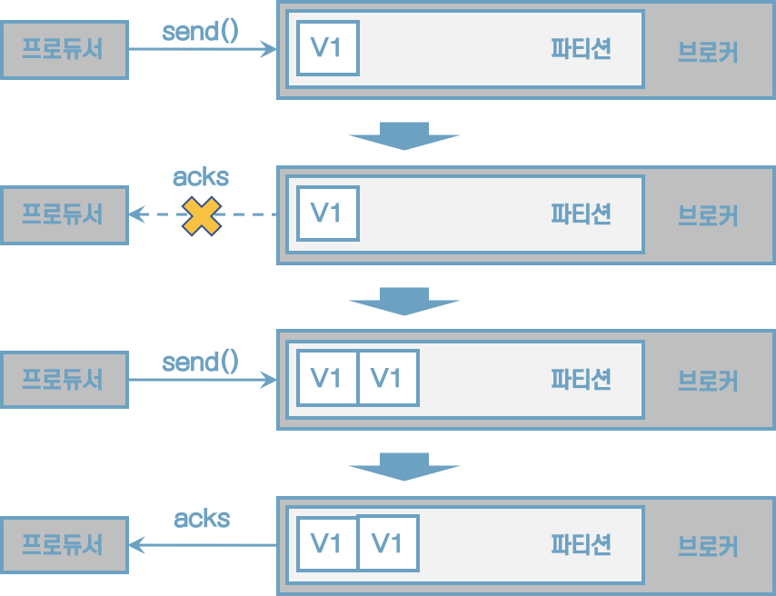

[그림] 프로듀서와 브로커 사이의 네트워크 장애로 데이터는 한 번 이상 전달될 수 있다.

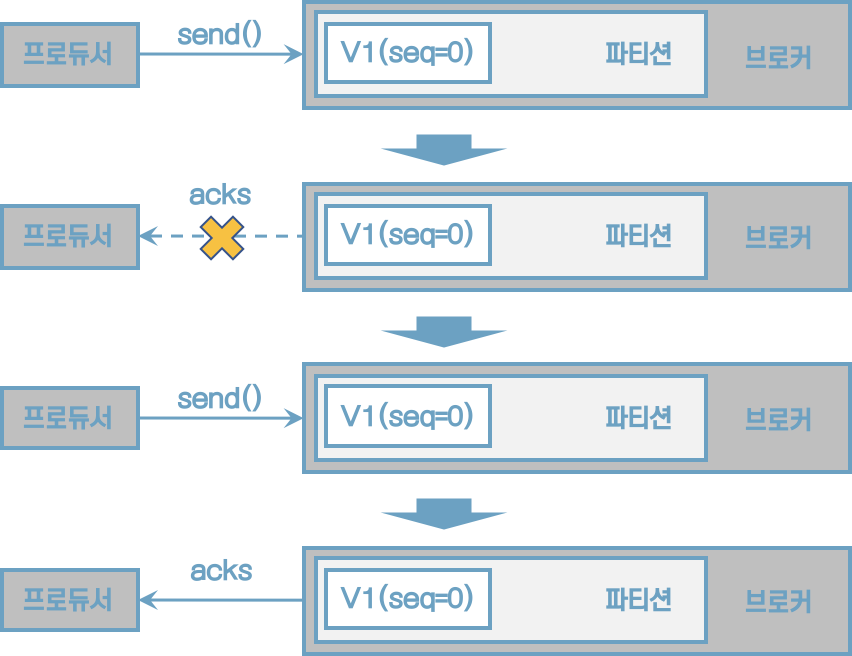

[그림] 멱등성 프로듀서로 동작할 경우 네트워크 장애가 발생하더라도 브로커에 동일한 메시지는 적재하지 않는다. 멱등성 프로듀서가 전송하는 데이터에 PID와 시퀀스 넘버가 있는데, 브로커는 PID와 시퀀스 넘버로 중복을 체크하기 때문이다.

단, 멱등성 프로듀서는 동일한 세션에서만 정확히 한번 전달을 보장한다. 여기서 말하는 동일한 세션이란 PID의 생명주기를 뜻한다. 만약 멱등성 프로듀서로 동작하는 프로듀서 애플리케이션에 이슈가 발생하여 종료되고 애플리케이션을 재시작하면 PID가 달라진다.


### 4.2.3 트랜잭션(transaction) 프로듀서

xxx


## 4.3 카프카 컨슈머

### 4.3.1 멀티 스레드 컨슈머

카프카는 처리량을 늘리기 위해 파티션과 컨슈머 개수를 늘려서 운영할 수 있다. 파티션을 여러 개로 운영하는 경우 데이터를 병렬처리하기 위해서 파티션 개수와 컨슈머 개수를 동일하게 맞추는 것이 가장 좋은 방법이다. 토픽의 파티션은 1개 이상으로 이루어져 있으며 1개의 파티션은 1개 컨슈머가 할당되어 데이터를 처리할 수 있다. 파티션 개수가 n개라면 동일 컨슈머 그룹으로 묶인 컨슈머 스레드를 최대 n개 운영할 수 있다. 그러므로 n개의 스레드를 가진 1개의 프로세스를 운영하거나 1개의 스레드를 가진 프로세서를 n개 운영하는 방법도 있다.


[그림] 3개의 프로세서로 동작하는 컨슈머 그룹 A, 1개 프로세스와 3개 스레드로 동작하는 컨슈머 그룹 B

컨슈머를 멀티 스레드로 활용하는 방식은 크게 두 가지로 나뉜다. 첫 번째는 컨슈머 스레드는 1개만 실행하고 데이터를 처리를 담당하는 워크 스레드를 여러 개 실행하는 방법인 멀티 워크 스레드 전략이다. 두 번째는 컨슈머 인스턴스에서 poll() 메서드를 호출하는 스레드를 여러 개 띄워서 사용하는 컨슈머 멀티 스레드 전략이다.


#### 카프카 컨슈머 멀티 워크 스레드 전략

브로커로부터 전달받은 레코드들을 병렬로 처리한다면 1개의 컨슈머 스레드로 받은 데이터들을 더욱 향상된 속도로 처리할 수 있다. 멀티 스레드를 사용하면 각기 다른 레코드들의 데이터 처리를 동시에 실행할 수 있기 때문에 처리 시간을 현저히 줄일 수 있다.


[그림] 반복구문으로 처리를 완료하는 시간(T1)보다 병렬처리로 완료하는 시간(T2)이 더 적게 걸린다.


#### 카프카 컨슈머 멀티 스레드 전략

하나의 파티션은 동일 컨슈머 중 최대 1대까지 할당된다. 그리고 하나의 컨슈머는 여러 파티션에 할당될 수 있다. 이런 특징을 가장 잘 살리는 방법은 1개의 애플리케이션에 구독하고자 하는 토픽의 파티션 개수만큼 컨슈머 스레드 개수를 늘려서 운영하는 것이다. 컨슈머 스레드를 늘려서 운영하면 각 스레드에 각 파티션이 할당되며, 파티션의 레코드들을 병렬처리할 수 있다.


[그림] 파티션 개수만큼 컨슈머 스레드를 운영하는 애플리케이션

여기서 주의해야 할 점은 구독하고자 하는 토픽의 파티션 개수만큼만 컨슈머 스레드를 운영하는 것이다. 컨슈머 스레드가 개수보다 많아지면 할당할 파티션 개수가 더는 없으므로 파티션에 할당되지 못한 컨슈머 스레드는 데이터를 처리를 하지 않게 된다. 


### 4.3.2 컨슈머 랙

컨슈머 랙(LAG)은 토픽의 최신 오프셋(LOG-END-OFFSET)과 컨슈머 오프셋(CURRENT-OFFSET) 간의 차이다. 프로듀서는 계속해서 새로운 데이터를 파티션에 저장하고 컨슈머는 자신이 처리할 수 있는 만큼 데이터를 가져간다. 컨슈머 랙은 컨슈머가 정상 동작하는지 여부를 확인할 수 있기 때문에 컨슈머 애플리케이션을 운영한다면 필수적으로 모니터링해야 하는 지표이다.

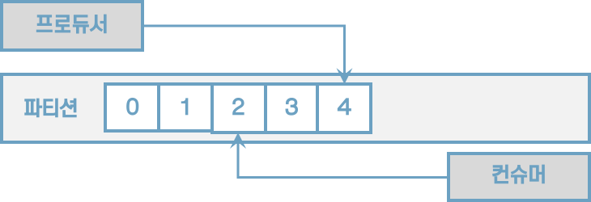

[그림] 컨슈머 랙은 가장 최신 오프셋과 컨슈머 오프셋 간의 차이이다. LOG-END-OFFSET)은 4, CURRENT-OFFSET은 2, LAG은 2이다. 

컨슈머 랙은 컨슈머 그룹과 토픽, 파티션별로 생성된다. 1개의 토픽에 3개의 파티션이 있고 1개의 컨슈머 그룹이 토픽을 구독하여 데이터를 가져가면 컨슈머 랙은 총 3개가 된다.

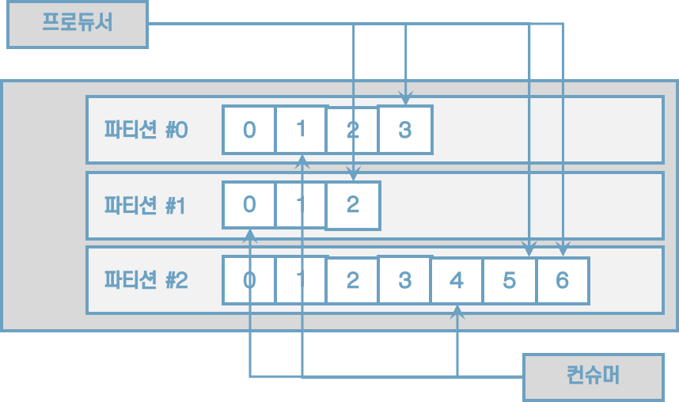

[그림] 파티션 3개로 구성된 토픽에 컨슈머가 할당되면 컨슈머 랙은 총 3개가 된다. 여기서 모든 파티션의 컨슈머 랙은 2로 동일하다.

프로듀서가 보내는 데이터양이 컨슈머의 데이터 처리량보다 크다면 컨슈머 랙은 늘어난다. 반대로 프로듀서가 보내는 데이터 양이 컨슈머의 데이터 처리량보다 적으면 컨슈머 랙은 줄어들고 최솟값은 0으로 지연이 없음을 뜻한다.


[그림] 프로듀서의 데이터 전송량이 컨슈머의 데이터 처리량보다 많으면 컨슈머 랙은 계속해서 늘어난다


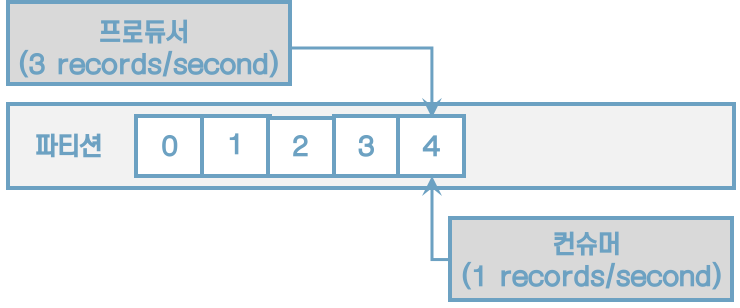

[그림] 프로듀서의 데이터 전송량보다 컨슈머의 데이터 처리량이 많으면 컨슈머 랙은 0으로 떨어진다


컨슈머 랙을 확인하는 방법은 총 3가지가 있다. 첫 번째는 카프카 명령어를 사용하는 방법, 두 번째는 컨슈머 애플리케이션에서 metrics() 메서드를 사용하는 방법, 세 번째는 외부 모니터링 툴을 사용하는 방법이다.


#### 카프카 명령어를 사용하여 컨슈머 랙 조회

kafka-consumer-groups.sh 명령어를 사용하면 컨슈머 랙을 포함한 특정 컨슈머 그룹의 상태를 확인할 수 있다.

```sh
$ bin/kafka-consumer-groups.sh --bootstrap-server localhost:9092 \
	--group my-group --describe
```


#### 컨슈머 metrics() 메서드를 사용하여 컨슈머 랙 조회


#### 외부 모니터링 툴을 사용하여 컨슈머 랙 조회

버로우는 링크드인에서 개발하여 오픈소스로 공개한 컨슈머 랙 체크 툴로 REST API를 통해 컨슈머 그룹별로 컨슈머 랙을 확인할 수 있다.


#### 4.3.2.1 카프카 버로우


## 4.4. 스프링 카프카


