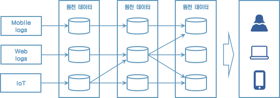
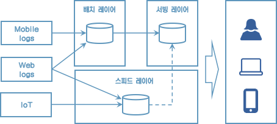
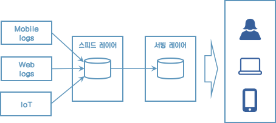
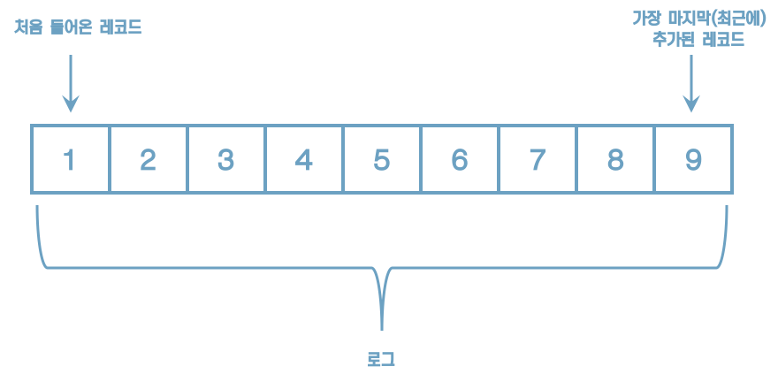
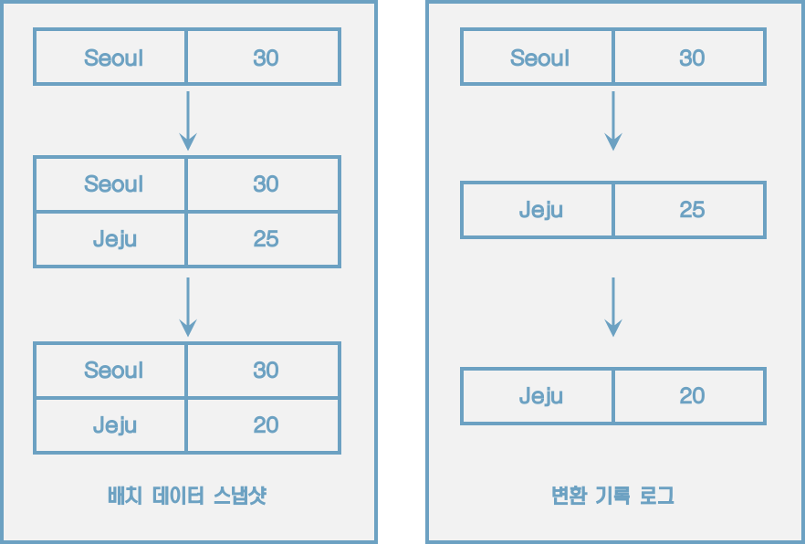

# 1 들어가며

## 1.1 카프카의 탄생

* 링크드인에서는 파편화된 데이터 수집 분배 아키텍처 운영에 어려움
* 데이터를 생성하는 소스 애플리케이션과 타켓 애플리케이션을 연결해야 한다.
* 처음에는 어렵지 않았지만 점점 많아지면서 문제가 생김.
* 파편화된 데이터 파이프라인의 복잡도를 낮추기는 어려웠다.
* 결국, 신규 시스템을 만들기로 결정했고 그 결과물이 바로 아파치 카프카다.

* 카프카를 중앙에 배치하여 애플리케이션 사이의 의존도를 최소화하여 커플링을 완화했다.

## 1.2 빅데이터 파이프라인에서 카프카의 역할

데이터 파이프라인: 엔드 투 엔드 방식의 데이터 수집 및 적재를 개선하고 안정성을 추구하며, 유연하면서도 확장가능하게 자동화한 것을 말한다.

아파치 카프카가 왜 데이터 파이프라인으로 적합한가?

### 높은 처리량

* 많은 양의 데이터를 묶음 단위로 처리한다.
* 파티션 단위로 동일 목적의 데이터를 여러 파티션에 분배하고 데이터를 병렬 처리

### 확장성

* 클러스터의 브로커 개수를 자연스럽게 늘려 스케일 아웃할 수 있다.
* 반대로 스케일 인 할수도 있다.

### 영속성

* 카프카는 데이터를 메모리에 저장하지 않고 파일 시스템에 저장한다.
* 운영체제에서는 파일 I/O 향상을 위해 페이지 캐시 영역을 메모리에 따로 생성하여 사용한다. (한번 읽은 파일 내용은 메모리에 저장시켰다가 다시 사용하는 방식)

### 고가용성

* 데이터의 복제를 통해 고가용성의 특징을 가진다.

> **카프카 클러스터를 1대, 2대가 아닌 3대 이상의 브로커들로 구성해야 하는 이유**
>
> 1대를 운영할 경우 브로커의 장애는 서비스의 장애로 이어지므로 테스트 목적으로만 사용한다.
>
> 2대로 운영할 경우 한 대의 브로커에 장애가 발생하더라도 나머지 한 대 브로커가 살아있으므로 안정적으로 데이터를 처리할 수 있다. 하지만 브로커 간에 데이터가 복제되는 시간 차이로 인해 일부 데이터가 유실될 가능성이 있다. 유실을 막기 위해 min.insync.replicas 옵션을 사용해야 하는데 min.insync.replicas 옵션을 2로 설정하면 브로커를 3대 이상으로 운영해야만 한다.

## 1.3 데이터 레이크 아키텍처와 카프카의 미래

데이터 레이크 아키텍처의 종류는 2가지가 있다.

1. 람다 아키텍처
2. 카파 아키텍처

[레거시 데이터 플랫폼 아키텍처]

* 데이터를 배치로 모으는 구조는 유연하지 못하며
* 실시간으로 생성되는 데이터에 대한 인사이트를 서비스 애플리케이션에 빠르게 전달하지 못하는 단점
* 파생된 데이터의 히스토리를 파악하기 어렵고
* 이를 개선하기 위해 스피드 레이어를 만듦

[람다 아키텍처]

람다 아키텍처는 3가지 레이어로 나뉜다.

* 배치 레이어는 배치 데이터를 모아서 특정 시간, 타이밍마다 일괄 처리한다.
* 서빙 레이어는 가공된 데이터를 데이터 사용자, 서비스 애플리케이션이 사용할 수 있도록 데이터가 저장된 공간이다.
* 스피드 레이어는 서비스에서 생성되는 원천 데이터를 실시간으로 분석하는 용도로 사용한다.

람다 아키텍처에서 카프카는 스피드레이어에 위치한다.

람다 아키텍처는 레이어가 2개로 나뉘기 때문에 로직이 2벌로 존재해야 한다는 점과 배치와 실시간 데이터를 융합하여 처리할때는 유연하지 못한 파이프라인을 생성해야 한다.

이런 담점을 해소하기 위해 제이 크렙스는 카파 아키텍처를 제안했다.

[카파 아키텍처]

로직의 파편화, 디버깅, 배포, 운영 분리에 대한 이슈를 제거

그런데 카파 아키텍처는 스피드 레이어에서 모든 데이터를 처리해야 하므로 모든 종류의 데이터를 스트림으로 처리해야 한다.

> **배치 데이터와 스트림 데이터**
>
> '배치 데이터'는 초, 분, 시간, 일 등으로 한정된(bounded) 기간 단위 데이터를 뜻한다.
>
> '스트림 데이터'는 한정되지 않은(unbounded) 데이터로 시작과 끝 데이터가 명확히 정해지지 않은 데이터를 뜻한다.

로그는 텍스트 로그가 아닌 데이터의 집합을 뜻한다. 이 데이터는 지속적으로 추가가 가능하며 각 데이터에는 일정한 번호가 붙는다.

로그는 배치 데이터를 스트림으로 표현하기에 적합하다.

로그로 배치 데이터와 스트림 데이터를 저장하고 사용하기 위해서는 변환 기록이 일정기간 동안 삭제되어서는 안 되고 지속적으로 추가되어야 한다. 그리고 모든 데이터가 스피드 레이어에 들어오는 것을 감안하면 데이터 플랫폼은 SPOF(Single Point Of Failure)가 될 수 있으므로 반드시 내결함성(High Availability)과 장애 허용(fault tolerant) 특징을 지녀야 했다.

