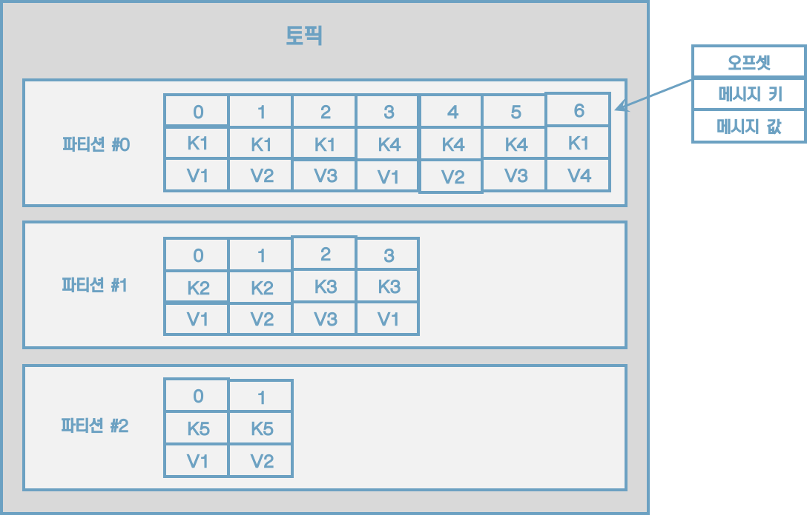

# 2 카프카 빠르게 시작해보기

## 2.2 카프카 커맨드 라인 툴

### 2.2.1 kafka-topics.sh

> 토픽을 생성하는 2가지 방법
>
> 1. 카프카 컨슈머 또는 프로듀서가 카프카 브로커에 생성되지 않은 토픽에 대해 데이터를 요청할 때
> 2. 커맨드 라인 툴로 명시적으로 토픽을 생성하는 것


#### 토픽 생성

```sh
$ bin/kafka-topics.sh \
	--create \
	--bootstrap-server localhost:9092 \
	--topic hello.kafka \
```

파티션 개수, 복제 개수, 토픽 데이터 유지 기간 옵션들을 지정하여 토픽을 생성하고 싶다면 다음과 같이 하면 된다.

```sh
$ bin/kafka-topics.sh \
	--create \
	--bootstrap-server localhost:9092 \
	--partitions 3 \
	--replication-factor 1 \
	--config retention.ms=172800000 \
	--topic hello.kafka.2 \
```


#### 토픽 리스트 조회

```sh
$ bin/kafka-topics.sh --bootstrap-server localhost:9092 --list
```


#### 토픽 상세 조회

```sh
$ bin/kafka-topics.sh --bootstrap-server localhost:9092 --describe --topic hello.kafka.2
```


#### 토픽 옵션 수정

파티션 개수를 3개에서 4개로 늘리고, 리텐션 기간은 172800000ms에서 86400000ms(1일)로 변경해 보자.

```sh
$ bin/kafka-topics.sh --bootstrap-server localhost:9092 \
	--topic hello.kafka \
	--alter \
	--partitions 4
	
$ bin/kafka-configs.sh --bootstrap-server localhost:9092 \
	--entity-type topics \
	--entity-name hello.kafka \
	--alter --add-config retention.ms=86400000
```


### 2.2.2 kafka-console-producer.sh

```sh
$ bin/kafka-console-producer.sh --bootstrap-server localhost:9092 \
	--topic hello.kafka
```

메시지 키 없이 메시지 값만 보내도록 하자. 메시지 키는 자바의 null로 기본 설정되어 브로커로 전송된다.


이제 메시지 키를 가지는 레코드를 전송해보자.

```sh
$ bin/kafka-console-producer.sh --bootstrap-server localhost:9092 \
	--topic hello.kafka \
	--property "parse.key=true" \
	--property "key.separator=:"
```





