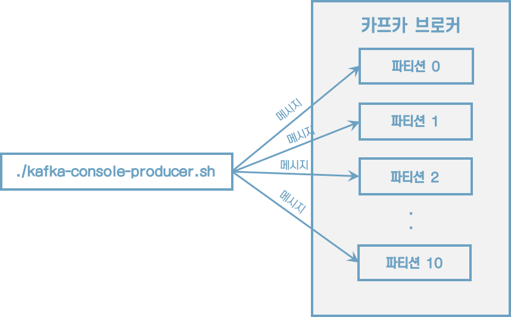
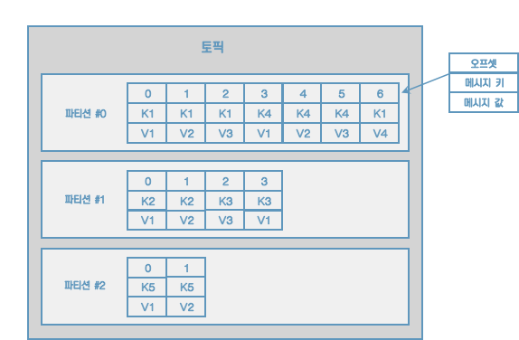

# 2 카프카 빠르게 시작해보기

## 2.2 카프카 커맨드 라인 툴

### 2.2.1 kafka-topics.sh

> **토픽을 생성하는 2가지 방법**
>
> 1. 카프카 컨슈머 또는 프로듀서가 카프카 브로커에 생성되지 않은 토픽에 대해 데이터를 요청할 때
> 2. 커맨드 라인 툴로 명시적으로 토픽을 생성하는 것


#### 토픽 생성

```sh
$ bin/kafka-topics.sh \
	--create \
	--bootstrap-server localhost:9092 \
	--topic hello.kafka \
```

파티션 개수, 복제 개수, 토픽 데이터 유지 기간 옵션들을 지정하여 토픽을 생성하고 싶다면 다음과 같이 하면 된다.

```sh
$ bin/kafka-topics.sh \
	--create \
	--bootstrap-server localhost:9092 \
	--partitions 3 \
	--replication-factor 1 \
	--config retention.ms=172800000 \
	--topic hello.kafka.2 \
```


#### 토픽 리스트 조회

```sh
$ bin/kafka-topics.sh --bootstrap-server localhost:9092 --list
```


#### 토픽 상세 조회

```sh
$ bin/kafka-topics.sh --bootstrap-server localhost:9092 --describe --topic hello.kafka.2
```


#### 토픽 옵션 수정

파티션 개수를 3개에서 4개로 늘리고, 리텐션 기간은 172800000ms에서 86400000ms(1일)로 변경해 보자.

```sh
$ bin/kafka-topics.sh --bootstrap-server localhost:9092 \
	--topic hello.kafka \
	--alter \
	--partitions 4
	
$ bin/kafka-configs.sh --bootstrap-server localhost:9092 \
	--entity-type topics \
	--entity-name hello.kafka \
	--alter --add-config retention.ms=86400000
```


### 2.2.2 kafka-console-producer.sh

```sh
$ bin/kafka-console-producer.sh --bootstrap-server localhost:9092 \
	--topic hello.kafka
```

메시지 키 없이 메시지 값만 보내도록 하자. 메시지 키는 자바의 null로 기본 설정되어 브로커로 전송된다.





이제 메시지 키를 가지는 레코드를 전송해보자.

```sh
$ bin/kafka-console-producer.sh --bootstrap-server localhost:9092 \
	--topic hello.kafka \
	--property "parse.key=true" \
	--property "key.separator=:"
```




메시지 키와 메시지 값을 함께 전송한 레코드는 토픽의 파티션에 저장된다.  메시지 키가 null인 경우에는 프로듀서가 피티션으로 전송할 때 레코드 배치 단위로 라운드로빈으로 전송한다. 메시지 키가 존재하는 경우에는 키의 해시값을 작성하여 존재하는 파티션 중 한 개에 할당된다. 이로 인해 메시지 키가 동일한 경우에는 동일한 파티션으로 전송된다.


> **파티션 개수가 늘어나면 새로 프로듀싱되는 레코드들은 어느 파티션으로 갈까?**
>
> 이전에 메시지 키가 파티션 0번에 들어갔다면 파티션을 늘린 뒤에는 파티션 0번으로 간다는 보장이 없다. 만일 파티션을 추가하더라도 이전에 사용하던 메시지 키의 일관성을 보장하고 싶다면 커스텀 파티셔너를 만들어서 운영해야 한다.


### 2.2.3 kafka-console-consumer.sh

```sh
$ bin/kafka-console-consumer.sh --bootstrap-server localhost:9092 \
	--topic hello.kafka \
	--from-beginning
```

데이터의 메시지 키와 메시지 값을 확인하고 싶다면 --property 옵션을 사용하면 된다.

```sh
$ bin/kafka-console-consumer.sh --bootstrap-server localhost:9092 \
	--topic hello.kafka \
	--property print.key=true \
	--property key.separator="-" \
	--group hello-group \
	--from-beginning
	
key1-no1
null-4
null-5
null-0
null-1
null-2
null-3
null-hello
null-kafka
key2-no2
key3-no3
```

* 메시지 키를 확인하기 위해 print.key를 true로 설정했다.
* 메시지 키 값을 구분하기 위해 key.separator를 설정했다.
* --group 옵션을 통해 컨슈머 그룹을 생성했다. 이 컨슈머 그룹을 통해 가져간 토픽의 메시지는 가져간 메시지에 대해 커밋을 한다. 커밋 정보는 __consumer_offsets 이름의 내부 토픽에 저장된다.


전송했던 데이터의 순서가 현재 출력되는 순서와 다르다는 것이다. 이는 카프카의 핵심인 파티션 개념때문에 생기는 현상이다. kafka-console-consumer.sh 명령어를 통해 토픽의 데이터를 가져가게 되면 토픽의 모든 파티션으로부터 동일한 중요도로 데이터를 가져간다.


### 2.2.4 Kafka-consumer-groups.sh

컨슈머 그룹의 리스트를 확인

```sh
$ bin/kafka-consumer-groups.sh --bootstrap-server localhost:9092 --list
```


```sh
$ bin/kafka-consumer-groups.sh --bootstrap-server localhost:9092 \
	--group hello-group \
	--describe


### 2.2.5 kafka-verifiable-producer.sh, consumer.sh

```sh
$ bin/kafka-verifiable-producer.sh --bootstrap-server localhost:9092 \
	--max-messages 10 \
	--topic verify-test
```


전송한 데이터는 Kafka-verifiable-consumer.sh로 확인할 수 있다.

```sh
$ bin/kafka-verifiable-consumer.sh --bootstrap-server localhost:9092 \
	--topic verify-test \
	--group-id test-group
```


### 2.2.6 kafka-delete-records.sh

이미 적재된 토픽의 데이터를 지우는 방법

```sh
vi delete-topic.json
{"partitions":  [{"topic": "hello.kafka", "partition": 0, "offset": 50}], "version": 1}

$ bin/kafka-delete-records.sh --bootstrap-server localhost:9092 \
	--offset-json-file delete-topic.json
```

토픽의 특정 레코드 하나만 삭제되는 것이 아니라 파티션에 존재하는 가장 오래된 오프셋부터 지정한 오프셋까지 삭제된다는 점이다.


