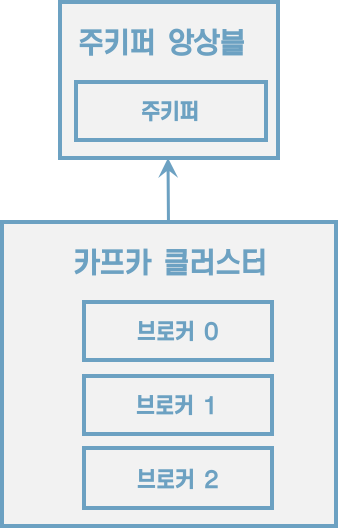
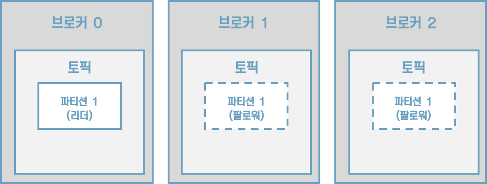
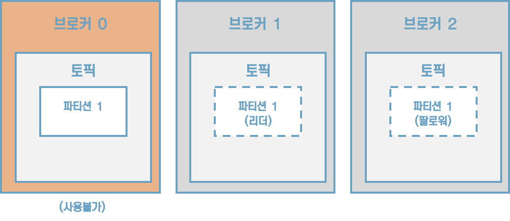
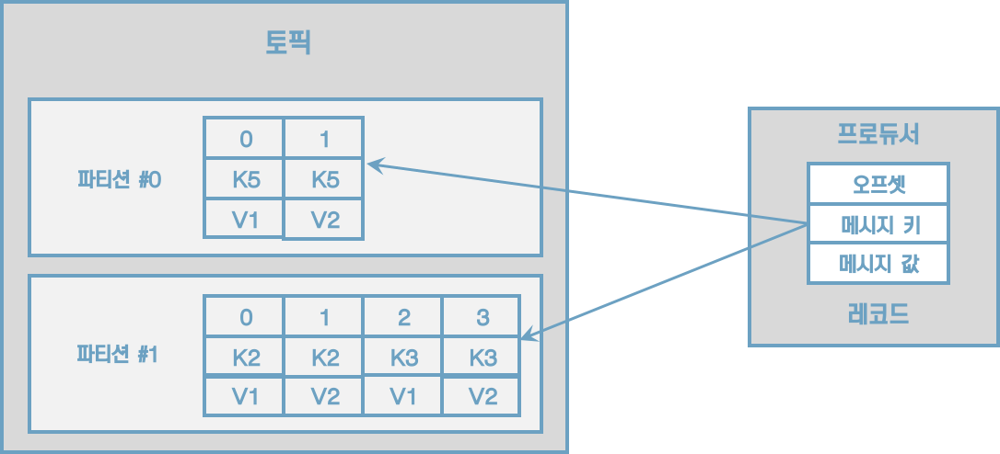
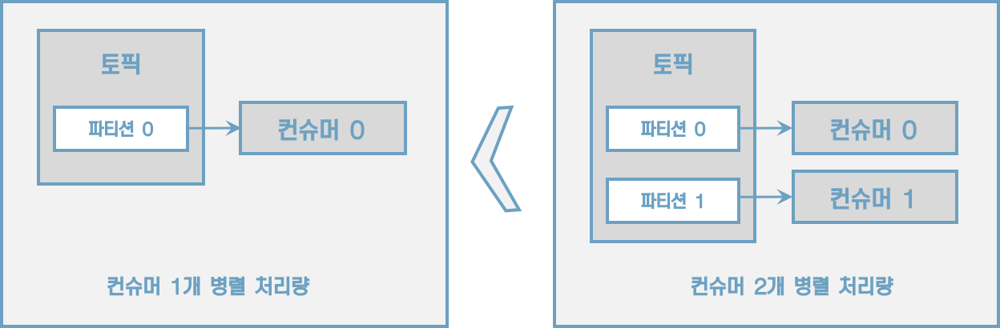

# 3 카프카 기본 개념 설명

## 3.1 카프카 브로커, 클러스터, 주키퍼

하나의 서버에는 한 개의 카프카 브로커 프로세스가 실행된다. 카프카 브로커 서버 1대로도 기본 기능이 실행되지만 데이터를 안전하게 보관하고 처리하기 위해 3대 애상의 브로커 서버를 1개의 클러스터로 묶어서 운영한다. 카프카 클러스터로 묶인 브로커들은 프로듀서가 보낸 데이터를 안전하게 분산 저장하고 복제하는 역할을 수행한다.





#### 데이터 저장, 전송

```sh
$ ls /tmp/kafka-logs # ------------ 1
drwxr-xr-x   6 macbookpro  wheel  192  5 13 20:16 hello.kafka-0
drwxr-xr-x   6 macbookpro  wheel  192  5 13 20:17 hello.kafka.2-0
drwxr-xr-x   6 macbookpro  wheel  192  5 13 20:17 hello.kafka.2-1
drwxr-xr-x   6 macbookpro  wheel  192  5 13 20:17 hello.kafka.2-2

$ ls /tmp/kafka-logs/hello.kafka-0 # --------2
 macbookpro  /tmp/kafka-logs  ls hello.kafka-0
00000000000000000000.index     00000000000000000000.timeindex
00000000000000000000.log       leader-epoch-checkpoint
```

1. config/server.properties의 log.dir 옵션에 정의한 디렉토리에 데이터를 저장한다. 토픽 이름과 파티션 번호의 조합으로 하위 디렉토리를 생성하여 데이터를 저장한다.
2. hello.kafka 토픽의 0번 파티션에 존재하는 데이터를 확인할 수 있다.
    * log: 메시지와 메타데이터를 저장
    * index: 메시지의 오프셋을 인덱싱한 정보
    * timeindex: 메시지에 포함된 timestamp값을 기준으로 인덱싱한 정보가 담겨 있다.
    * Timestamp: 브로커가 적재한 데이터를 삭제하거나 압축하는데 사용한다.


카프카는 메모리나 데이터베이스에 저장하지 않으며 따로 캐시 메모리를 구현하지도 않는다. 파일 시스템에 저장하기 때문에 파일 입출력으로 인해 속도 이슈가 발생하지 않을까 의문을 가질 수 있다.

카프카는 페이지 캐시를 사용하여 디스크 입출력 속도를 높여서 이 문제를 해결했다. 페이지 캐시란 OS에서 파일 입출력의 성능 향상을 위해 만들어 놓은 메모리 영역을 뜻한다. 한번 읽은 내용은 메모리의 페이지 캐시 영역애 저장시킨다. 추후 동일한 파일의 접근이 일어나면 디스크에서 읽지 않고 메모리에서 직접 읽는 방식이다.


#### 데이터 복제, 싱크

복제의이유는 클러스터로 묶인 브로커 중 일부에 장애가 발생하더라도 데이터를 유실하지 않고 안전하게 사용하기 위함이다.

카프카의 데이터 복제는 파티션 단위로 이루어진다.




[그림] 토픽의 파티션의 복제 개수가 3인 경우

프로듀서 또는 컨슈머와 직접 통신하는 파티션을 리더, 나머지 복제 데이터를 가지고 있는 파티션을 팔로워라고 부른다.

팔로워 파티션들은 리더 파티션의 오프셋을 확인하여 현재 자신이 가지고 있는 오프셋과 차이가 나는 경우 리더 파티션으로부터 데이터를 가져와서 자신의 파티션에 저장하는데, 이 과정을 복제라고 부른다. 복제를 통해 데이터를 안전하게 사용할 수 있다는 강력한 장점 때문에 카프카를 운영할 때 2 이상의 복제 개수를 정하는 것이 중요하다.




[그림] 브로커 0에 장애가 발생한 경우


#### 컨트롤러(controller)

클러스터의 다수 브로커 중 한 대가 컨트롤러의 역할을 한다. 컨트롤러는 다른 브로커들이 상태를 체크하고 브로커가 클러스터에서 빠지는 경우 해당 브로커에 존재하는 리더 파티션을 재분배한다.


#### 데이터 삭제

카프카는 컨슈머가 데이터를 가져가더라도 토픽의 데이터는 삭제되지 않는다. 또한, 컨슈머나 프로듀서가 데이터 삭제를 요청할 수도 없다. 오직 브로커만이 데이터를 삭제할 수 있다. 데이터 삭제는 파일 단위로 이루어지는데 이 단위를 '로그 세그먼트(log segment)'라고 부른다.


#### 컨슈머 오프셋 저장

컨슈머 그룹은 토픽이 특정 파티션으로부터 데이터를 가져가서 처리하고 이 파티션의 어느 레코드까지 가져갔는지 확인하기 위해 오프셋을 커밋한다. 커밋한 오프셋은 __consumer_offsets 토픽에 저장한다.


#### 코디네이터(coordinator)

클러스터의 다수 브로커 중 한 대는 코디네이터의 역할을 수행한다. 코디네이터는 컨슈머 그룹의 상태를 체크하고 파티션을 컨슈머와 매칭되도록 분배하는 역할을 한다. 컨슈머가 컨슈머 그룹에서 빠지면 매칭되지 않은 파티션을 정상 동작하는 컨슈머로 할당하여 끊임없이 데이터가 처리되도록 도와준다. 이렇게 파티션을 컨슈머로 재할당하는 과정을 '`리밸런스`(rebalance)'라고 부른다.

주키퍼는 카프카의 메타데이터를 관리하는 데에 사용된다.

```sh
$ bin/zookeeper-shell.sh localhost:2181
Connecting to localhost:2181
Welcome to ZooKeeper!
JLine support is disabled

WATCHER::

WatchedEvent state:SyncConnected type:None path:null

ls /
[admin, brokers, cluster, config, consumers, controller, controller_epoch, isr_change_notification, latest_producer_id_block, log_dir_event_notification, zookeeper]

get /brokers/ids/0
{"listener_security_protocol_map":{"PLAINTEXT":"PLAINTEXT"},"endpoints":["PLAINTEXT://localhost:9092"],"jmx_port":-1,"port":9092,"host":"localhost","version":4,"timestamp":"1620904358029"}

get /controller
{"version":1,"brokerid":0,"timestamp":"1620904358147"}

ls /brokers/topics
[hello.kafka, hello.kafka.2]
```


## 3.2 토픽과 파티션

토픽은 카프카에서 데이터를 구분하기 위해 사용하는 단위이다. 토픽은 1개 이상의 파티션을 소유하고 있다. 파티션에는 프로듀서가 보낸 데이터들이 들어가 저장되는데 이 데이터를 '`레코드`(record)'라고 부른다.




[그림] 프로듀서가 전송한 레코드는 파티션에 저장된다.

파티션은 카프카의 병렬처리의 핵심으로써 그룹으로 묶인 컨슈머들이 레코드를 병렬로 처리할 수 있도록 매칭된다. 컨슈머의 처리량이 한정된 상황에서 많은 레코드를 병렬로 처리하는 가장 좋은 방법은 컨슈머의 개수를 늘려 스케일 아웃하는 것이다. 컨슈머 개수를 늘림과 동시에 파티션 개수를 늘리면 처리량이 증가하는 효과를 볼 수 있다.




파티션은 자료구조에서 접하는 큐와 비슷한 구조라고 생각하면 쉽다.


#### 의미있는 토픽 이름 작명 방법

> 토픽 작명의 템플릿과 예시
>
> * <환경>.<팀-명>.<애플리케이션-명>.<메시지-타입>
>
>     예시) prd.marketing-team.sms-platform.json
>
> * <프로젝트-명>.<서비스-명>.<환경>.<이벤트-명>
>     예시) commerce.payment.prd.notification
>
> * <환경>.<서비스-명>.<JIRA-번호>.<메시지-타입>
>     예시) dev.email-sender.jira-1234.email-vo-custom
>
> * <카프카-클러스터-명>.<환경>.<서비스-명>.<메시지-타입>
>     예시) aws-kafka.live.marketing-platform.json


## 3.3 레코드

레코드는 타임스탬프, 메시지 키, 메시지 값, 오프셋으로 구성되어 있다.

* 타임스탬프
    * 브로커 기준 유닉스 시간이 설정
* 메시지 키
    * 메시지 값을 순서대로 처리하거나 메시지 값의 종류를 나타내기 위해 사용
    * 메시지 키의 해시값을 토대로 파티션을 지정하게 된다. 즉, 동일한 메시지 키라면 동일 파티션에 들어가는 것이다.
    * 메시지 키를 사용하지 않는다면 레코드는 기본 설정 파티셔너에 따라 파티션에 분배된다.
* 메시지 값
    * 실질적으로 처리할 데이터가 들어 있다.
    * 메시지 키와 메시지 값은 직렬화되어 브로커로 전송되기 때문에 동일한 형태로 역질렬화를 수행해야 한다.
* 오프셋
    * 0 이사으이 숫자
    * 이전에 전송된 레코드의 오프셋+1 값으로 생성된다.


## 3.4 카프카 클라이언트

### 3.4.1 프로듀서 API

### 3.4.2 컨슈머 API

