# 3 카프카 기본 개념 설명

## 3.1 카프카 브로커, 클러스터, 주키퍼

* 하나의 서버에는 한 개의 카프카 브로커 프로세스가 실행된다. 
* 카프카 브로커 서버 1대로도 기본 기능이 실행되지만 데이터를 안전하게 보관하고 처리하기 위해 3대 애상의 브로커 서버를 1개의 클러스터로 묶어서 운영한다. 
* 카프카 클러스터로 묶인 브로커들은 프로듀서가 보낸 데이터를 안전하게 분산 저장하고 복제하는 역할을 수행한다.


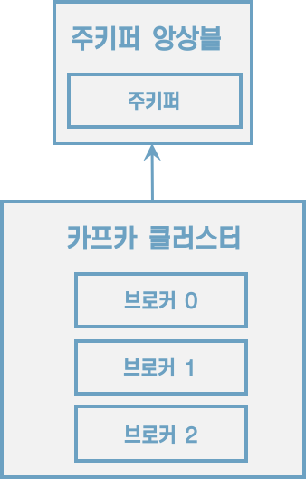

주키퍼와 연동하여 동작하는 카프카 클러스터


#### 데이터 저장, 전송

```sh
$ ls /tmp/kafka-logs # ------------ 1
drwxr-xr-x   6 macbookpro  wheel  192  5 13 20:16 hello.kafka-0
drwxr-xr-x   6 macbookpro  wheel  192  5 13 20:17 hello.kafka.2-0
drwxr-xr-x   6 macbookpro  wheel  192  5 13 20:17 hello.kafka.2-1
drwxr-xr-x   6 macbookpro  wheel  192  5 13 20:17 hello.kafka.2-2

$ ls /tmp/kafka-logs/hello.kafka-0 # --------2
 macbookpro  /tmp/kafka-logs  ls hello.kafka-0
00000000000000000000.index     00000000000000000000.timeindex
00000000000000000000.log       leader-epoch-checkpoint
```

1. config/server.properties의 <u>log.dir 옵션</u>에 정의한 디렉토리에 데이터를 저장한다. 토픽 이름과 파티션 번호의 조합으로 하위 디렉토리를 생성하여 데이터를 저장한다.
2. hello.kafka 토픽의 0번 파티션에 존재하는 데이터를 확인할 수 있다.
    * log: 메시지와 메타데이터를 저장
    * index: 메시지의 오프셋을 인덱싱한 정보
    * timeindex: 메시지에 포함된 timestamp값을 기준으로 인덱싱한 정보가 담겨 있다.
    * timestamp: 브로커가 적재한 데이터를 삭제하거나 압축하는데 사용한다.


* 카프카는 메모리나 데이터베이스에 저장하지 않으며 따로 캐시 메모리를 구현하지도 않는다. 
* 파일 시스템에 저장하기 때문에 파일 입출력으로 인해 속도 이슈가 발생하지 않을까 의문을 가질 수 있다.

* 카프카는 `페이지 캐시`를 사용하여 디스크 입출력 속도를 높여서 이 문제를 해결했다. 
* 페이지 캐시란 OS에서 파일 입출력의 성능 향상을 위해 만들어 놓은 메모리 영역을 뜻한다. 
* 한번 읽은 내용은 메모리의 페이지 캐시 영역애 저장시킨다. 
* 추후 동일한 파일의 접근이 일어나면 디스크에서 읽지 않고 메모리에서 직접 읽는 방식이다.


#### 데이터 복제, 싱크

복제의이유는 클러스터로 묶인 브로커 중 일부에 장애가 발생하더라도 데이터를 유실하지 않고 안전하게 사용하기 위함이다.
<u>카프카의 데이터 복제는 파티션 단위</u>로 이루어진다.


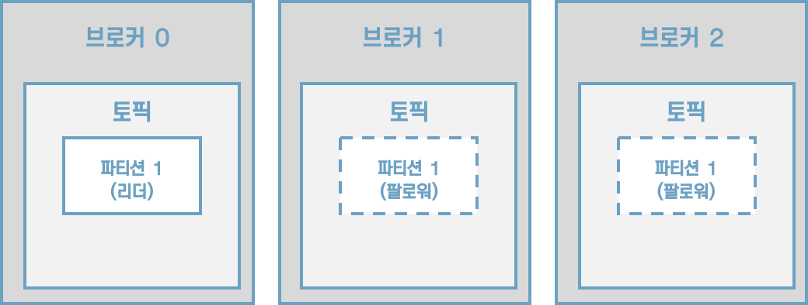

[그림] 토픽의 파티션의 복제 개수가 3인 경우

프로듀서 또는 컨슈머와 직접 통신하는 파티션을 리더, 나머지 복제 데이터를 가지고 있는 파티션을 팔로워라고 부른다.

팔로워 파티션들은 리더 파티션의 오프셋을 확인하여 현재 자신이 가지고 있는 오프셋과 차이가 나는 경우 <u>리더 파티션으로부터 데이터를 가져와서 자신의 파티션에 저장</u>하는데, 이 과정을 `복제`라고 부른다. 복제를 통해 데이터를 안전하게 사용할 수 있다는 강력한 장점 때문에 카프카를 운영할 때 <u>2 이상의 복제 개수</u>를 정하는 것이 중요하다.


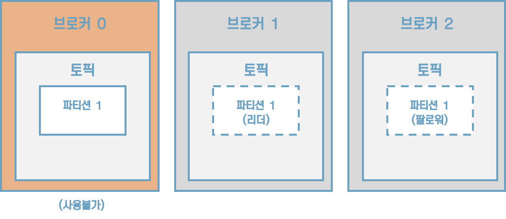

[그림] 브로커 0에 장애가 발생한 경우


#### 컨트롤러(controller)

클러스터의 <u>다수 브로커 중 한 대가 컨트롤러의 역할</u>을 한다. <u>컨트롤러는 다른 브로커들의 상태를 체크</u>하고 브로커가 클러스터에서 빠지는 경우 해당 브로커에 존재하는 <u>리더 파티션을 재분배</u>한다. 만약 컨트롤러 역할을 하는 브로커에 장애가 생기면 다른 브로커가 컨트롤러 역할을 한다.


#### 데이터 삭제

카프카는 컨슈머가 데이터를 가져가더라도 토픽의 데이터는 삭제되지 않는다. 또한, 컨슈머나 프로듀서가 데이터 삭제를 요청할 수도 없다. 오직 브로커만이 데이터를 삭제할 수 있다. 데이터 삭제는 파일 단위로 이루어지는데 이 단위를 '로그 세그먼트(log segment)'라고 부른다.


#### 컨슈머 오프셋 저장

컨슈머 그룹은 토픽이 특정 파티션으로부터 데이터를 가져가서 처리하고 이 파티션의 어느 레코드까지 가져갔는지 확인하기 위해 오프셋을 커밋한다. 커밋한 오프셋은 __consumer_offsets 토픽에 저장한다.


#### 코디네이터(coordinator)

클러스터의 다수 브로커 중 한 대는 코디네이터의 역할을 수행한다. `코디네이터`는 컨슈머 그룹의 상태를 체크하고 파티션을 컨슈머와 매칭되도록 분배하는 역할을 한다. 컨슈머가 컨슈머 그룹에서 빠지면 매칭되지 않은 파티션을 정상 동작하는 컨슈머로 할당하여 끊임없이 데이터가 처리되도록 도와준다. 이렇게 파티션을 컨슈머로 재할당하는 과정을 '`리밸런스`(rebalance)'라고 부른다.

주키퍼는 카프카의 메타데이터를 관리하는 데에 사용된다.

```sh
$ bin/zookeeper-shell.sh localhost:2181
Connecting to localhost:2181
Welcome to ZooKeeper!
JLine support is disabled

WATCHER::

WatchedEvent state:SyncConnected type:None path:null

ls /
[admin, brokers, cluster, config, consumers, controller, controller_epoch, isr_change_notification, latest_producer_id_block, log_dir_event_notification, zookeeper]

get /brokers/ids/0
{"listener_security_protocol_map":{"PLAINTEXT":"PLAINTEXT"},"endpoints":["PLAINTEXT://localhost:9092"],"jmx_port":-1,"port":9092,"host":"localhost","version":4,"timestamp":"1620904358029"}

get /controller
{"version":1,"brokerid":0,"timestamp":"1620904358147"}

ls /brokers/topics
[hello.kafka, hello.kafka.2]
```


## 3.2 토픽과 파티션

토픽은 카프카에서 데이터를 구분하기 위해 사용하는 단위이다. 토픽은 1개 이상의 파티션을 소유하고 있다. 파티션에는 프로듀서가 보낸 데이터들이 들어가 저장되는데 이 데이터를 '`레코드`(record)'라고 부른다.


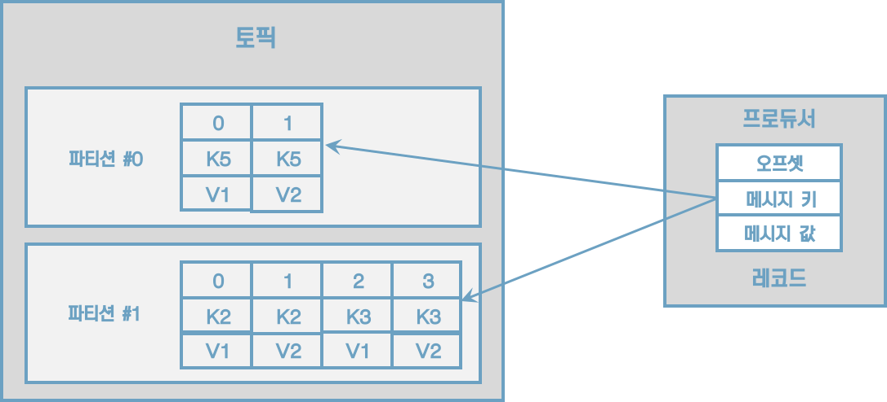

[그림] 프로듀서가 전송한 레코드는 파티션에 저장된다.

파티션은 카프카의 병렬처리의 핵심으로써 그룹으로 묶인 컨슈머들이 레코드를 병렬로 처리할 수 있도록 매칭된다. 컨슈머의 처리량이 한정된 상황에서 많은 레코드를 병렬로 처리하는 가장 좋은 방법은 컨슈머의 개수를 늘려 스케일 아웃하는 것이다. 컨슈머 개수를 늘림과 동시에 파티션 개수를 늘리면 처리량이 증가하는 효과를 볼 수 있다.


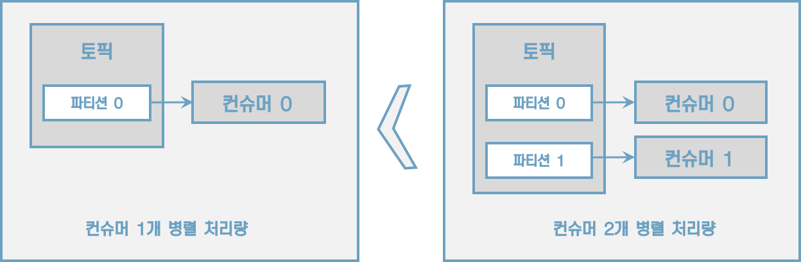

파티션은 자료구조에서 접하는 큐와 비슷한 구조라고 생각하면 쉽다.


#### 의미있는 토픽 이름 작명 방법

> 토픽 작명의 템플릿과 예시
>
> * <환경>.<팀-명>.<애플리케이션-명>.<메시지-타입>
>
>     예시) prd.marketing-team.sms-platform.json
>
> * <프로젝트-명>.<서비스-명>.<환경>.<이벤트-명>
>     예시) commerce.payment.prd.notification
>
> * <환경>.<서비스-명>.<JIRA-번호>.<메시지-타입>
>     예시) dev.email-sender.jira-1234.email-vo-custom
>
> * <카프카-클러스터-명>.<환경>.<서비스-명>.<메시지-타입>
>     예시) aws-kafka.live.marketing-platform.json


## 3.3 레코드

레코드는 타임스탬프, 메시지 키, 메시지 값, 오프셋으로 구성되어 있다. 레코드는 수정할 수 없고 로그 리텐션 기간 또는 용량에 따라서만 삭제된다.

* 타임스탬프
    * 브로커 기준 유닉스 시간이 설정
* 메시지 키
    * 메시지 값을 순서대로 처리하거나 메시지 값의 종류를 나타내기 위해 사용
    * 메시지 키의 해시값을 토대로 파티션을 지정하게 된다. 즉, 동일한 메시지 키라면 동일 파티션에 들어가는 것이다.
    * 메시지 키를 사용하지 않는다면 레코드는 기본 설정 파티셔너에 따라 파티션에 분배된다.
* 메시지 값
    * 실질적으로 처리할 데이터가 들어 있다.
    * 메시지 키와 메시지 값은 직렬화되어 브로커로 전송되기 때문에 동일한 형태로 역직렬화를 수행해야 한다.
* 오프셋
    * 0 이상의 숫자
    * 이전에 전송된 레코드의 오프셋+1 값으로 생성된다.


## 3.4 카프카 클라이언트

### 3.4.1 프로듀서 API

```java
public class SimpleProducer {
    private final static Logger logger = LoggerFactory.getLogger(SimpleProducer.class);
    private final static String TOPIC_NAME = "test";
    private final static String BOOTSTRAP_SERVERS = "localhost:9092";

    public static void main(String[] args) {
        Properties configs = new Properties();
        configs.put(ProducerConfig.BOOTSTRAP_SERVERS_CONFIG, BOOTSTRAP_SERVERS);
        configs.put(ProducerConfig.KEY_SERIALIZER_CLASS_CONFIG, StringSerializer.class.getName());
        configs.put(ProducerConfig.VALUE_SERIALIZER_CLASS_CONFIG, StringSerializer.class.getName());

        KafkaProducer<String, String> producer = new KafkaProducer<String, String>(configs);

        String messageKey = "key1";
        String messageValue = "testMessage";
        ProducerRecord<String, String> record = new ProducerRecord(TOPIC_NAME, messageKey, messageValue);
        producer.send(record);
        logger.info("{}", record);
        producer.flush();
        producer.close();
    }
}
```


### 3.4.2 컨슈머 API

```java
public class SimpleConsumer {
    private final static Logger logger = LoggerFactory.getLogger(SimpleProducer.class);
    private final static String TOPIC_NAME = "test";
    private final static String BOOTSTRAP_SERVERS = "localhost:9092";
    private final static String GROUP_ID = "test-group";

    public static void main(String[] args) {
        Properties configs = new Properties();
        configs.put(ConsumerConfig.BOOTSTRAP_SERVERS_CONFIG, BOOTSTRAP_SERVERS);
        configs.put(ConsumerConfig.GROUP_ID_CONFIG, GROUP_ID);
        configs.put(ConsumerConfig.KEY_DESERIALIZER_CLASS_CONFIG, StringDeserializer.class.getName());
        configs.put(ConsumerConfig.VALUE_DESERIALIZER_CLASS_CONFIG, StringDeserializer.class.getName());

        KafkaConsumer<String, String> consumer = new KafkaConsumer<>(configs);
        consumer.subscribe(Arrays.asList(TOPIC_NAME));

        while (true) {
            ConsumerRecords<String, String> records = consumer.poll(Duration.ofSeconds(1));
            for (ConsumerRecord<String, String> record: records) {
                logger.info("{}", record);
            }
        }
    }
}
```


#### 컨슈머 중요 개념

토픽의 파티션으로부터 데이터를 가져가기 위해 컨슈머를 운영하는 방법은 크게 2가지가 있다.

1. 1개 이상의 컨슈머로 이루어진 컨슈머 그룹을 운영하는 것
2. 토픽의 특정 파티션만 구독하는 컨슈머를 운영하는 것

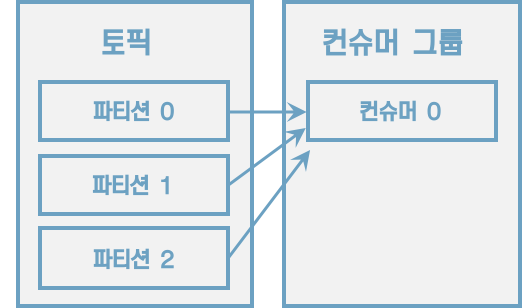

[그림] 컨슈머 1개로 이루어진 컨슈머 그룹이 3개의 파티션에 할당

컨슈머 그룹으로 묶인 컨슈머가 토픽을 구독해서 데이터를 가져갈 때, 1개의 파티션은 최대 1개의 컨슈머에 할당 가능하다. 그리고 1개 컨슈머는 여러 개의 파티션에 할당될 수 있다. 이러한 특징으로 컨슈머 그룹의 컨슈머 개수는 가져가고자 하는 토픽의 파티션 개수보다 같거나 작아야 한다.


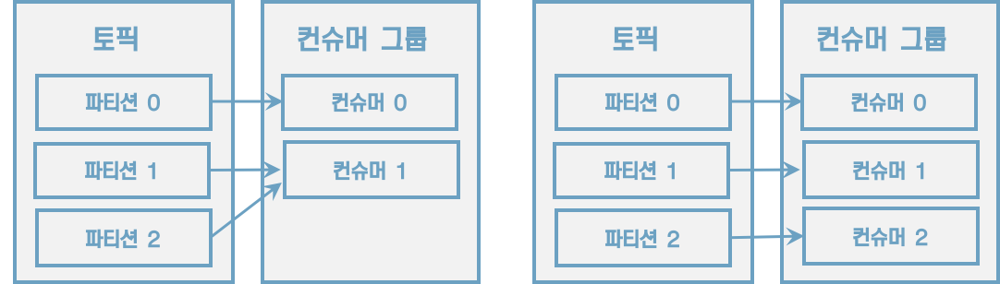

[그림] 컨슈머 2개, 컨슈머 3개인 경우


3개의 파티션을 가진 토픽을 효과적으로 처리하기 위해서는 3개 이하의 컨슈머 그룹으로 운영해야 한다. 만약 4개의 컨슈머로 이루어진 컨슈머 그룹으로 3개의 파티션을 가진 토픽에서 데이터를 가져가기 위해 할당하면 1개의 컨슈머는 파티션을 할당받지 못하고 유휴상태로 남게 된다.

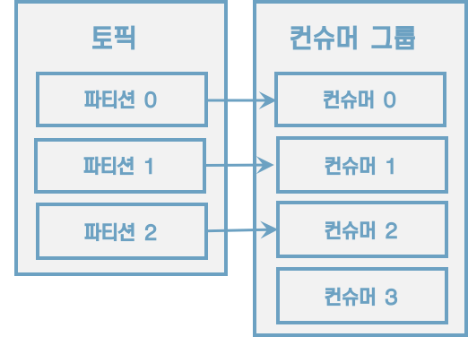

[그림] 컨슈머 1개가 놀고 있는 모습


컨슈머 그룹은 다른 컨슈머 그룹과 격리되는 특징을 가지고 있다.

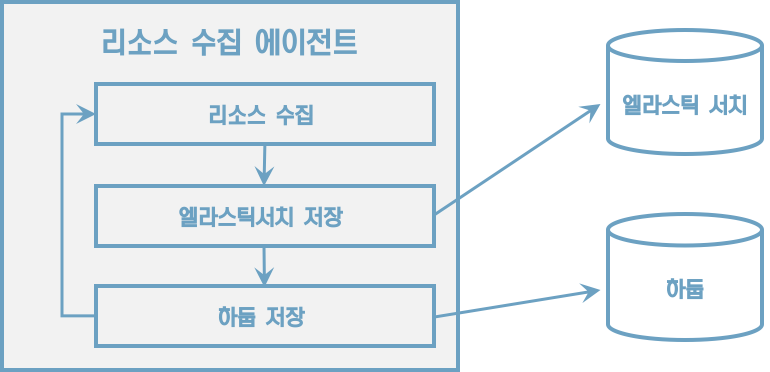

[그림] 동기 로직으로 돌아가는 에이전트 애플리케이션


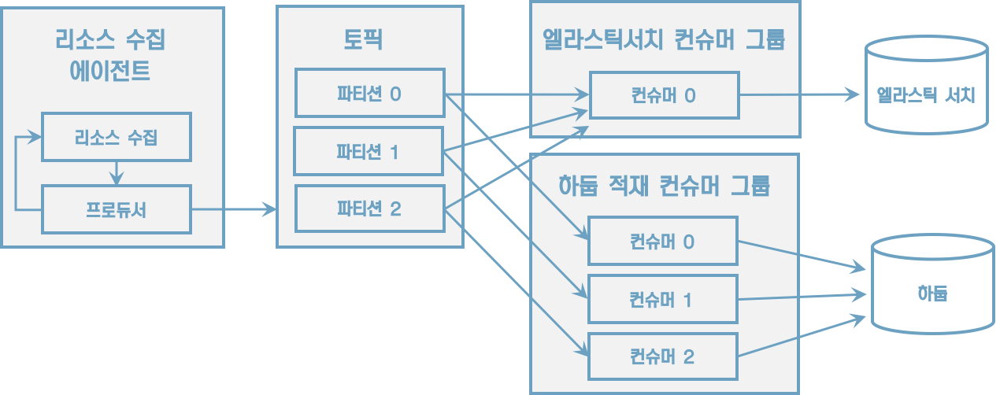

[그림] 컨슈머 그룹으로 적재 로직을 분리하여 운영

컨슈머 그룹의 컨슈머에 장애가 발생하면 어떻게 될까? 컨슈머 그룹으로 이루어진 컨슈머들 중 일부 컨슈머에 장애가 발생하면, 장애가 발생한 컨슈머에 할당된 파티션은 장애가 발생하지 않은 컨슈머에 소유권이 넘어간다. 이러한 과정을 '`리밸런싱`(relalancing)'이라고 부른다.

리밸런싱은 크게 두 가지 상황에서 일어난다.

1. 컨슈머가 추가되는 상황
2. 컨슈머가 제외되는 상황


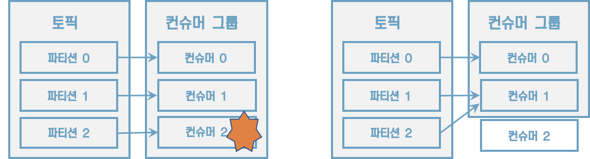

[그림] 컨슈머 장애 발생 시 리밸런싱 발생

리밸런싱은 유용하지만 자주 이러나서는 안 된다. 리밸런싱이 발생할 때 파티션의 소유권을 컨슈머로 재할당하는 과정에서 해당 컨슈머 그룹의 컨슈머들이 토픽의 데이터를 읽을 수 없기 때문이다. 그룹 조정자(group coordinator)는 리밸런싱을 발동시키는 역할을 하는데 컨슈머 그룹의 컨슈머가 추가되게 삭제될 때 감지한다. 카프카 브로커 중 한 대가 그룹 조정자의 역할을 수행한다.

컨슈머는 카프카의 브로커로부터 데이터를 어디까지 가져갔는지 커밋을 통해 기록한다.

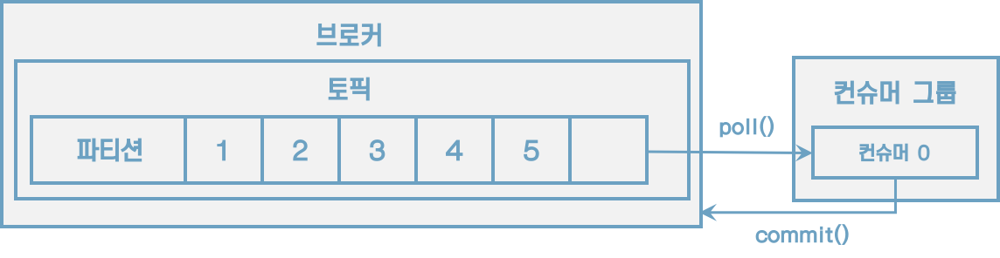

[그림] 컨슈머는 처리 완료한 레코드의 오프셋을 커밋한다.

오프셋 커밋은 컨슈머 애플리케이션에서 명시적, 비명시적으로 수행할 수 있다. 기본 옵션은 poll() 메서드가 수행될 때 일정 간격마다 오프셋을 커밋하도록 enable.auto.commit=true로 설정되어 있다. 이렇게 일정 간격마다 자동으로 커밋되는 것을 <u>비명시적 '오프셋 커밋'</u>이라고 부른다. 이 옵션은 auto.commit.interval.ms에 설정된 값 이상이 지났을 때 그 시점까지 읽은 레코드를 오프셋을 커밋한다. 하지만 poll() 메서드 호출 이후 리밸런싱 또는 컨슈머 강제 종료 시 컨슈머가 처리하는 데이터가 중복 또는 유실될 수 있는 가능성이 있는 취약한 구조를 가지고 있다.

명시적 오프셋을 커밋하려면 poll() 메서드 호출 이후에 반환받는 데이터의 처리가 완료되고 commitSync() 메서드를 호출하면 된다. commitSync() 메서드는 poll() 메서드를 통해 반환된 레코드의 가장 마지막 오프셋을 기준으로 커밋을 수행한다. commitSync() 메서드는 브로커에 커밋 요청을 하고 커밋이 정상적으로 처리되었는지 응답하기까지 기다리는데 이는 컨슈머의 처리량에 영향을 끼친다. 데이터 처리 시간에 비해 커밋 요청 및 응답에 시간이 오래 걸린다면 동일 시간당 데이터 처리량이 줄어들기 때문이다. 이를 해결하기 위해 commitAsync() 메서드를 사용하여 커밋 요청을 전송하고 응답이 오기 전까지 데이터 처리를 수행할 수 있다. 하지만 비동기 커밋은 커밋 요청이 실패했을 경우 현재 처리 중인 데이터의 순서를 보장하지 않으며 데이터의중복 처리가 발생할 수 있다.

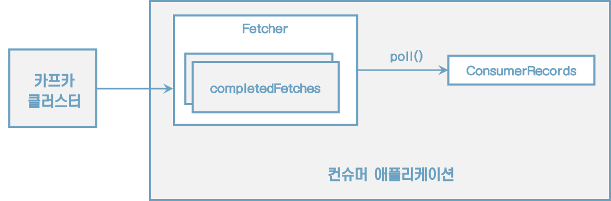

[그림] 컨슈머 내부구조

컨슈머는 poll() 메서드를 통해 레코드들을 반환받지만 <u>poll() 메서드를 호출하는 시점에 클러스터에서 데이터를 가져오는 것은 아니다</u>. 컨슈머 애플리케이션을 실행하게 되면 내부에서 Fetcher 인스턴스가 생성되어 poll() 메서드를 호출하기 전에 미리 레코드들을 내부 큐로 가져온다. 이후에 사용자가 명시적으로 poll() 메서드를 호출하면 컨슈머는 내부 큐에 있는 레코드들을 반환받아 처리를 수행한다.


#### 컨슈머 주요 옵션

* 필수 옵션
    * bootstrap.servers
    * key.deserializer
    * value.deserializer
* 선택 옵션
    * `group.id`:  컨슈머 그룹 아이디를 지정한다. subscribe 메서드로 토픽을 구독하여 사용할 때는 이 옵션을 필수로 넣어야 한다. <u>기본값은 null</u>이다.
    * `auto.offset.reset`:  컨슈머 그룹이 특정 파티션을 읽을 때 저장된 컨슈머 오프셋이 없는 경우 어느 오프셋부터 읽을지 선택하는 옵션이다. 이미 컨슈머 오프셋이 있다면 이 옵션값은 무시된다. 이 옵션은 lastest, earliest, none 중 1개를 설정할 수 있다.
        * latest(<u>기본값</u>): 가장 높은(가장 최근에 넣은) 오프셋부터 읽기 시작한다.
        * earliest: 가장 낮은(가장 오래전에 넣은) 오프셋부터 읽기 시작한다.
        * none: 컨슈머 그룹이 커밋한 기록이 있는지 찾아본다. 컨슈머 그룹이 커밋한 기록이 있는지 찾아본다. 없다면 오류를 반환하고, 있다면 기존 커밋이후 오프셋 부터 읽기 시작하다.
    * `auto.commit.interval.ms`: 자동 커밋(enable.auto.commit=true)일 경우 오프셋 커밋 간격을 지정한다. <u>기본값은 5000(5초)</u>이다.
    * `max.poll.records`: poll() 메서드를 통해 반환되는 레코드 개수를 지정한다. <u>기본값은 500</u>이다.
    * `session.timeout.ms`: 컨슈머가 브로커와 연결이 끊기는 최대 시간이다. 이 시간 내에 하트비트를 전송하지 않으면 브로커는 컨슈머에 이슈가 발생했다고 가정하고 리밸런싱을 시작한다. 보통 하트비트 시간 간격의 3개로 설정한다. <u>기본값은 10000(10초)</u>이다.
    * `heartbeat.interval.ms`: 하트비트를 전송하는 시간 간격이다. <u>기본값은 3000(3초)</u>이다.
    * `max.poll.interval.ms`: poll() 메서드를 호출하는 간격의 최대 시간을 지정한다. poll() 메서드를 호출한 이후에 데이터를 처리하는 데에 시간이 너무 많이 걸리는 경우 비정상으로 판단하고 리밸런싱을 시작한다. <u>기본값은 300000(5분)</u>이다.
    * `isolation.level`: 트랜잭션 프로듀서가 레코드를 드랜잭션 단위로 보낼 경우 사용한다. <u>기본값은 read_uncommited</u>이다.


#### 컨슈머의 안전한 종료

정상적으로 종료되지 않은 컨슈머는 세션 타임아웃이 발생할 때까지 컨슈머 그룹에 남게 된다. 이로 인해 실제로는 종료되었지만 더는 동작을 하지 않는 컨슈머가 존재하기 때문에 파티션의 데이터는 소모되지 못하고 컨슈머 랙이 늘어나게 된다. 컨슈머 랙이 늘어나면 데이터 처리 지연이 발생하게 된다.

컨슈머를 안전하게 종료하기 위해 KafkaConsumer 클래스는 wakeup() 메서드를 지원한다. 


## 3.5 카프카 스트림즈

카프카 스트림즈는 토픽에 적재된 데이터를 실시간으로 변환하여 다른 토픽에 적재하는 라이브러리이다.


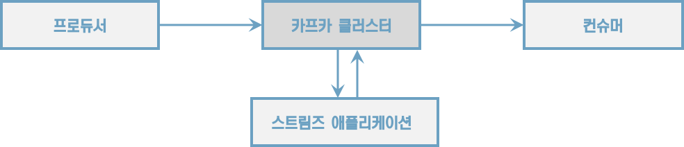

[그림] 카프카 스트림즈 모식도

> **프로듀서와 컨슈머를 조합해서 사용하지 않고 스트림즈를 사용해야 하는 이유**
>
> 스트림 데이터 처리에 있어 필요한 다양한 기능을 스트림즈 DSL로 제공하며 필요하다면 프로세서 API를 사용하여 기능을 확장할 수 있기 때문이다. 컨슈머와 프로듀서를 조합하여 스트림즈가 제공하는 기능을 유사하게 만들 수 있다. 그러나 스트림즈 라이브러리를 통해 제공하는 단 한 번의 데이터 처리, 장애 허용 시스템 등의 특징들은 컨슈머와 프로듀서의 조합만으로는 완벽하게 구현하기는 어렵다.