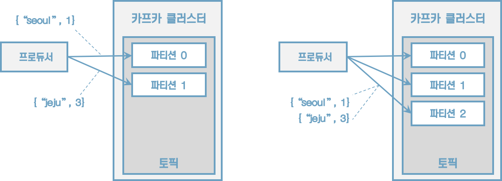
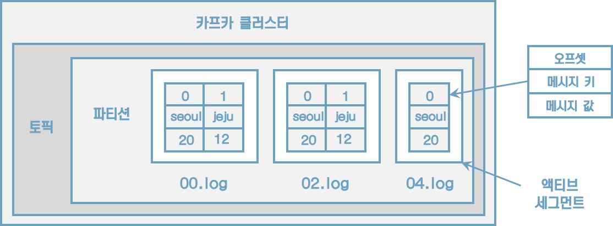
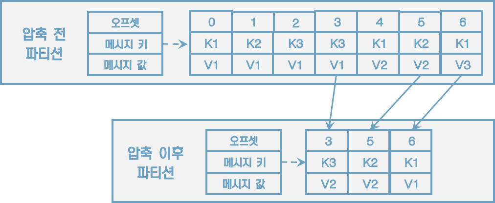
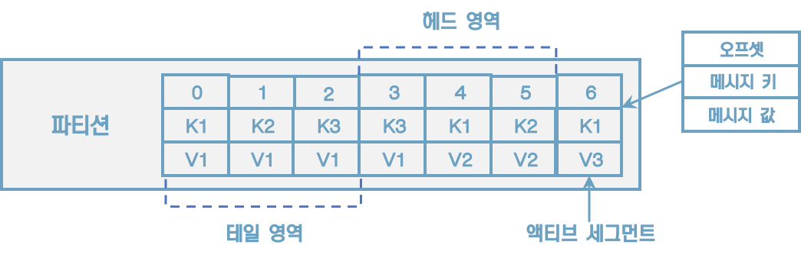
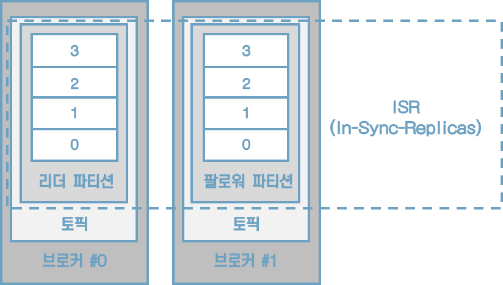
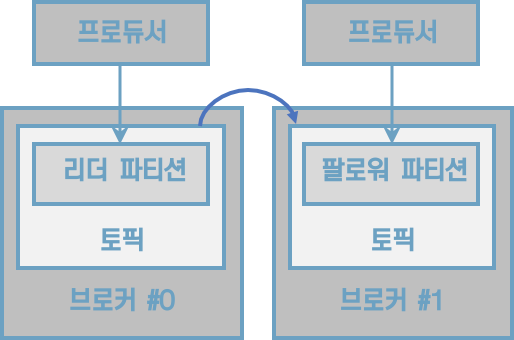
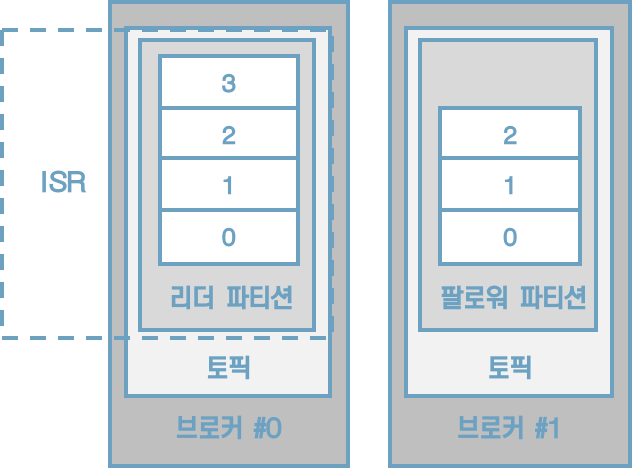
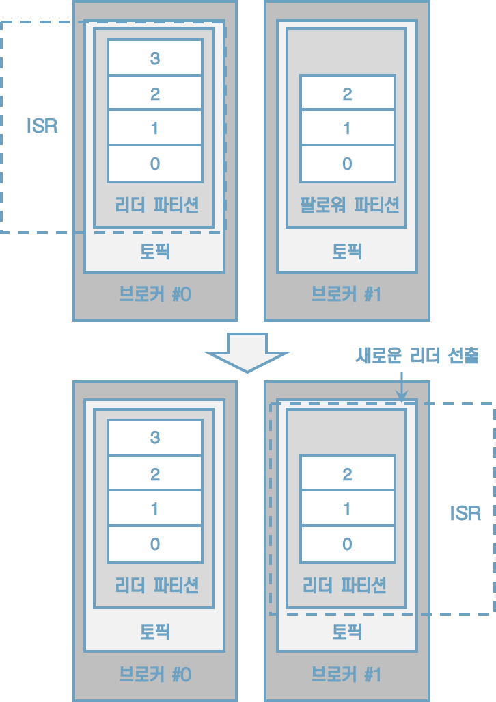

# 4 카프카 상세 개념 설명

## 4.1 토픽과 파티션

토픽은 카프카의 시작과 끝이다. 카프카를 사용하는 것은 토픽을 만들면서 시작된다.

토픽에 대해 잘 이해하고 설정을 잘하는 것이 카프카를 통한 데이터 활용도를 높이는 길이다.


### 4.1.1 적정 파티션 개수

**토픽 생성 시 파티션 개수 고려사항 3가지**

* 데이터 처리량
* 메시지키 사용 여부
* 브로커, 컨슈머 영향도

데이터 처리 속도를 올리는 방법은 2가지다. 

1. 컨슈머의 처리량을 늘리는 것
    * 서버의 사양을 올리는 스케일 업
    * gc 튜닝
2. 컨슈머를 추가해서 병렬처리량을 늘리는 것
    * 데이터 처리량을 늘리는 가장 확실한 방법이다.
    * 프로듀서가 보내는 데이터가 초당 1,000레코드일고 컨슈머가 처리할 수 있는 데이터가 초당 100레코드라면 최소한 필요한 파티션 개수는 10개이다.
    * 
    * 만약 컨슈머 데이터 처리량이 프로듀서가 보내는 데이터보다 적다면 컨슈머 랙이 생기고, 데이터 처리 지연이 발생한다.
    * 카프카 컨슈머를 개발할 때 내부 로직을 고민하여 시간 복잡도를 줄이기 위해 다양한 노력을 하는 것도 좋다.


파티션 개수를 무조건 늘리는 것만이 능사가 아니다. 파티션 개수를 늘리게 됨에 따라 컨슈머, 브로커의 부담이 있기 때문이다.

메시지 키를 사용함과 동시에 데이터 처리 순서를 지켜야 하는 경우에 대해 고려해야 한다. 메시지 키 사용 여부는 데이터 처리 순서와 밀접한 연관이 있다. 프로듀서가 기본 파티셔너를 사용하는 경우를 가정하자. 메시지 키를 사용하면 프로듀서가 토픽으로 데이터를 보낼 때 메시지 키를 해시 변환하여 메시지 키를 파티션에 매칭시킨다. 만약 파티션 개수가 달라지면 이미 매칭된 파티션과 메시지 키의 매칭이 깨지고 전혀 다른 파티션에 데이터가 할당된다.



[그림] 파티션 개수가 달라지기 이전과 이후 메시지 키와 파티션의 매칭 변화. 파티션이 2개일 때 메시지 키 seoul은 0번, jeju는 1번 파티션으로 할당되었다. 파티션이 3개일 때는 seoul, jeju 두 개의 메시지 키 모두 2번 파티션으로 할당되었다.

메시지 키를 사용하고 컨슈머에서 메시지 처리 순서가 보장되어야 한다면 최대한 파티션의 변화가 발생하지 않는 방향으로 운영해야 한다. 메시지 키별로 처리 순서를 보장하기 위해서는 파티션 개수를 프로듀서가 전송하는 데이터양보다 더 넉넉하게 잡고 생성하는 것이 좋다.

마지막으로 고려해야 할 점은 브로커와 컨슈머의 영향도이다. 카프카에서 파티션은 각 브로커의 파일 시스템을 사용하기 때문에 파티션이 늘어나는 만큼 브로커에서 접근하는 파일 개수가 많아진다. 그런데 운영체제에서는 프로세스당 열 수 있는 파일 최대 개수를 제한하고 있다. 그러므로 카프카 브로커가 접근하는 파일 개수를 안정적으로 유지하기 위해서는 각 브로커당 파티션 개수를 모니터링해야 한다.


### 4.1.2 토픽 정리 정책(cleanup.policy)

토픽의 데이터는 시간 또는 용량에 따라 삭제 규칙을 적용할 수 있다.
데이터를 오래동안 삭제하지 않으면 저장소 사용량이 지속적으로 늘어나게 된다.

cleanup.policy 옵션을 사용하여 데이터를 삭제할 수 있는 2가지 삭제 정책을 제공한다.

1. delete(삭제): 데이터의 완전 삭제
2. compact(압축): 동일 메시지 키의 가장 오래된 데이터를 삭제하는 것


#### 토픽 삭제 정책(delete.policy)

토픽을 운영하면 일반적으로 대부분의 토픽의 cleanup.policy를 delete로 설정한다. 토픽의 데이터를 삭제할 때는 세그먼트 단위로 삭제를 진행하다. 세그먼트는 토픽의 데이터를 저장하는 명시적인 파일 시스템 단위이다. 세그먼트는 파티션마다 별개로 생성되며 세그먼트의 파일 이름은 오프셋 중 가장 작은 값이 된다. 세그먼트는 여러 조각으로 나뉘는데 segment.bytes 옵션으로 1개의 세그먼트 크기를 설정할 수 있다. segment.bytes 크기보다 커질 경우 기존에 적재하던 세그먼트 파일을 닫고 새로운 세그먼트를 열어서 데이터를 저장한다. 데이터를 저장하기 위해 사용 중인 세그먼트를 액티브 세그먼트라고 한다.



[그림] 토픽과 세그먼트

삭제 정책이 실행되는 시점은 시간 또는 용량이 기준이 된다. retention.ms는 토픽의 데이터를 유지하는 기간을 밀리초로 설정할 수 있다. 카프카는 일정 주기마다 세그먼트 파일의 마지막 수정 시간과 retention.ms를 비교하는데, 세그먼트 파일의 마지막 수정 시간이 retention.ms를 넘어가면 세그먼트는 삭제된다. retention.bytes는 토픽의 최대 데이터 크기를 제어한다. retention.bytes를 넘어간 세그먼트 파일들은 삭제된다. 삭제된 데이터는 복구할 수 없다.


#### 토픽 압축 정책(compact.policy)

압축이란 메시지 키별로 해당 메시지 키의 레코드 중 오래된 데이터를 삭제하는 정책을 뜻한다. 메시지 키를 기준으로 오래된 데이터를 삭제하기 때문에 삭제 정책과 다르게 1개 파티션에서 오프셋의 증가가 일정하지 않을 수 있다. 즉, 1부터 10까지 오프셋이 있고, 4,5,6이 동일한 메시지 키를 가질 경우, 오프셋과 관계없이 중간에 있는 4번, 5번 오프셋의 레코드가 삭제될 수 있다는 뜻이다. 4,5,6이 동일한 메시지 키를 가지고 있는데, 6번에 비해 4번, 5번 오프세스이 레코드는 오래된 데이터이기 때문이다.



[그림] 토픽 압축에 따른 데이터의 변화. 가장 최근의 메시지 키 레코드만 남기고 나머지는 삭제한다.

압축 정책은 액티브 세그먼트를 제외한 나머지 세그먼트들에 한해서 데이터를 처리한다. 데이터의 압축 시작 시점은 min.cleanable.dirty.ratio 옵션값을 따른다. min.cleanable.dirty.ratio 옵션값은 액티브 세그먼트를 제외한 세그먼트에 남아 이쓴ㄴ 데이터의 테일 영역의 레코드 개수와 헤드 영역의 레코드 개수의 비율을 뜻한다. 테일 영역은 브로커의 압축 정책에 의해 압축이 완료된 레코들을 뜻한다. 테일 영여그이 레코드들은 '클린(clean) 로그'라고 부르고 압축이 완료됐기 때문에 테일 영역에는 중복된 메시지 키가 없다. 헤드 영역의 레코드들은 '더티(dirty) 로그'라고 부르고 압축이 되기 전 레코드를이 있으므로 중복된 메시지 키를 가진 레코드들이 있다.



[그림] 테일, 헤드 영역의 레코드를 표시한 파티션

'더티 비율(dirty ratio)'은 더티 영역의 메시지 개수를 압축 대상 세그먼트에 남아있는 데이터의 총 레코드 수(더티 영역 메시지 개수 + 클린 영역 메시지 개수)로 나눈 비율을 뜻한다. 만약 클릭 영역에 3개의 레코드가 있고 더티 영역에 레코드가 3개 있다면 더티 비율은 0.5이다.

토픽의 압축은 min.cleanable.dirty.ratio값에 따라 수행된다. 만약 min.cleanable.dirty.ratio 옵션값을 0.5로 설정할 경우에 더티 비율이 0.5가 넘어가며 압축이 수행된다. min.cleanable.dirty.ratio값을 0.9와 같이 크게 설정하면 한번 압축을 할 때 많은 데이터가 줄어들므로 압축 효과가 크다. min.cleanable.dirty.ratio를 0.1과 같이 작게 설정하면 압축이 더 자주 일어나기 때문에 계속해서 메시지 키의 최신 데이터만 유지할 수 있다. 하지만 압축이 자주 발생하는 만큼 브로커에 부담을 줄 수 있다.


### 4.1.3 ISR(In-Sync-Replicas)

ISR은 리더 파티션과 팔로워 파티션이 모두 싱크가 된 상태를 뜻한다. 복제 개수가 2인 토픽을 가정해보자. 이 토픽에는 리더 파티션 1개와 팔로워 파티션이 1개가 존재할 것이다. 리더 파티션에 0부터 3의 오프셋이 있다고 가정할 때, 팔로워 파티션에 동기화가 완료되려면 0부터 3까지 오프셋이 존재해야 한다. 리더 파티션과 팔로워 파티션이 동기화된 상태에서는 리더 또는 팔로워 파티션이 위치하는 브로커에 장애가 발생하더라도 데이터를 안전하게 사용할 수 있다.



[그림] ISR은 리더 파티션과 팔로워 파티션의 오프셋이 동일한 상태를 뜻한다.

ISR이라는 용어가 나온 이유는 팔로워 파티션이 리더 파티션으로부터 데이터를 복제하는 데에 시간이 걸리기 때문이다. 프로듀서가 특정 파티션에 데이터를 저장하는 작업은 리더 파티션을 통해 처리한다. 이때 리더 파티션에 새로운 레코드가 추가되어 오프셋이 증가하면 팔로워 파티션이 위치는 브로커는 리더 파티션의 데이터를 복제한다. 리더 파티션에 데이터가 적재된 이후 팔로워 파티션이 복제하는 시간차 때문에 리더 파티션과 팔로워 파티션 간에 오프셋 차이가 발생한다. 이런 차이를 모니터링하기 위해 리더 파티션은 replica.lag,time.max.ms값만큼의 주기를 가지고 팔로워 파티션이 데이터를 복제하는지 확인한다. 만약 팔로워 파티션이 replica.lag,time.max.ms값보다 더 긴 시간 동안 데이터를 가져가지 않는다면 해당 팔로워 파티션에 문제가 생긴 것으로 판단하고 ISR그룹에서 제외한다.



[그림] 팔로워 파티션이 위치한 브로커는 리더 파티션의 데이터를 복제한다.

ISR로 묶인 리더 파티션과 팔로워 파티션은 파티션에 존재하는 데이터가 모두 동일하기 때문에 팔로워 파티션은 리더 파티션으로 새로 선출될 자격을 가진다.

일부 데이터 유실이 발생하더라도 서비스를 중단하지 않고 지속적으로 토픽을 사용하고 싶다면 ISR이 아닌 팔로워 파티션을 리더로 선출하도록 설정할 수 있다.

unclean.reader.election.enable 옵션을 false로 설정할 경우 ISR이 아닌 팔로워 파티션을 리더 파티션으로 선출하지 않는다. 이 경우에는 리더 파티션이 존재하는 브로커가 다시 시작될 때까지 기다린다. 이것은 토픽을 사용하는 서비스가 중단됨을 뜻한다. 장애가 발생한 브로커가 다시 실행될 때까지는 해당 토픽은 사용할 수 없다. 대신 데이터의 유실은 발생하지 않는다.



[그림] unclean.reader.election.enable이 false인 경우에는 리더로 선출할 팔로워 파티션이 없으므로 리더 파티션이 있는 브로커가 다시 실행될 때까지 기다린다.

unclean.reader.election.enable을 true로 설정하는 경우에는 ISR이 아닌 팔로워 파티션, 즉 동기화가 되지 않은 팔로워 파티션도 리더로 선출될 수 있다. 리더 파티션이 존재하는 브로커에서 장애가 발생하고 동기화되지 않은 팔로워 파티션이 리더로 선출되면 리더 파티션으로부터 동기화가 되지 않은 일부 데이터는 유실될 수 있다. 일부 데이터가 유실되는 대신 토픽을 사용하는 서비스의 중단은 발생하지 않는다.



[그림] unclean.reader.election.enable이 true인 경우에는 ISR이 아닌 팔로워 파티션도 리더로 선출될 수 있다. 장애가 발생한 브로커 #0의 오프셋 3의 레코드는 유실된다.

unclean.reader.election.enable을 true로 할지 false로 할지 정하는 것은 서비스의 운영 정책에 따라 달라진다.

unclean.reader.election.enable 옵션은 토픽별로 설정할 수 있으며 토픽 생성 시 설정하는 방법은 다음과 같다.

```sh
$ bin/kafka-topics.sh --bootstrap-server localhost:9092 \
	--create --topic my-topic \
	--config unclean.reader.election.enable=false
```


## 4.2 카프카 프로듀서


