# 4 카프카 상세 개념 설명

## 4.1 토픽과 파티션

토픽은 카프카의 시작과 끝이다. 카프카를 사용하는 것은 토픽을 만들면서 시작된다.

토픽에 대해 잘 이해하고 설정을 잘하는 것이 카프카를 통한 데이터 활용도를 높이는 길이다.


### 4.1.1 적정 파티션 개수

**토픽 생성 시 파티션 개수 고려사항 3가지**

* 데이터 처리량
* 메시지키 사용 여부
* 브로커, 컨슈머 영향도

데이터 처리 속도를 올리는 방법은 2가지다. 

1. 컨슈머의 처리량을 늘리는 것
    * 서버의 사양을 올리는 스케일 업
    * gc 튜닝
2. 컨슈머를 추가해서 병렬처리량을 늘리는 것
    * 데이터 처리량을 늘리는 가장 확실한 방법이다.
    * 프로듀서가 보내는 데이터가 초당 1,000레코드이고 컨슈머가 처리할 수 있는 데이터가 초당 100레코드라면 최소한 필요한 파티션 개수는 10개이다.
    * 
    * 만약 컨슈머 데이터 처리량이 프로듀서가 보내는 데이터보다 적다면 컨슈머 랙이 생기고, 데이터 처리 지연이 발생한다.
    * 카프카 컨슈머를 개발할 때 내부 로직을 고민하여 시간 복잡도를 줄이기 위해 다양한 노력을 하는 것도 좋다.


파티션 개수를 무조건 늘리는 것만이 능사가 아니다. 파티션 개수를 늘리게 됨에 따라 컨슈머, 브로커의 부담이 있기 때문이다.

메시지 키를 사용함과 동시에 데이터 처리 순서를 지켜야 하는 경우에 대해 고려해야 한다. 메시지 키 사용 여부는 데이터 처리 순서와 밀접한 연관이 있다. 프로듀서가 기본 파티셔너를 사용하는 경우를 가정하자. 메시지 키를 사용하면 프로듀서가 토픽으로 데이터를 보낼 때 메시지 키를 해시 변환하여 메시지 키를 파티션에 매칭시킨다. 만약 파티션 개수가 달라지면 이미 매칭된 파티션과 메시지 키의 매칭이 깨지고 전혀 다른 파티션에 데이터가 할당된다.


[그림] 파티션 개수가 달라지기 이전과 이후 메시지 키와 파티션의 매칭 변화. 파티션이 2개일 때 메시지 키 seoul은 0번, jeju는 1번 파티션으로 할당되었다. 파티션이 3개일 때는 seoul, jeju 두 개의 메시지 키 모두 2번 파티션으로 할당되었다.

메시지 키를 사용하고 컨슈머에서 메시지 처리 순서가 보장되어야 한다면 최대한 파티션의 변화가 발생하지 않는 방향으로 운영해야 한다. 메시지 키별로 처리 순서를 보장하기 위해서는 파티션 개수를 프로듀서가 전송하는 데이터양보다 더 넉넉하게 잡고 생성하는 것이 좋다.

마지막으로 고려해야 할 점은 브로커와 컨슈머의 영향도이다. 카프카에서 파티션은 각 브로커의 파일 시스템을 사용하기 때문에 파티션이 늘어나는 만큼 브로커에서 접근하는 파일 개수가 많아진다. 그런데 운영체제에서는 프로세스당 열 수 있는 파일 최대 개수를 제한하고 있다. 그러므로 카프카 브로커가 접근하는 파일 개수를 안정적으로 유지하기 위해서는 각 브로커당 파티션 개수를 모니터링해야 한다.


### 4.1.2 토픽 정리 정책(cleanup.policy)

토픽의 데이터는 시간 또는 용량에 따라 삭제 규칙을 적용할 수 있다.
데이터를 오래동안 삭제하지 않으면 저장소 사용량이 지속적으로 늘어나게 된다.

cleanup.policy 옵션을 사용하여 데이터를 삭제할 수 있는 2가지 삭제 정책을 제공한다.

1. delete(삭제): 데이터의 완전 삭제
2. compact(압축): 동일 메시지 키의 가장 오래된 데이터를 삭제하는 것


#### 토픽 삭제 정책(delete policy)

토픽을 운영하면 일반적으로 대부분의 토픽의 cleanup.policy를 delete로 설정한다. 토픽의 데이터를 삭제할 때는 세그먼트 단위로 삭제를 진행하다. 세그먼트는 토픽의 데이터를 저장하는 명시적인 파일 시스템 단위이다. 세그먼트는 파티션마다 별개로 생성되며 세그먼트의 파일 이름은 오프셋 중 가장 작은 값이 된다. 세그먼트는 여러 조각으로 나뉘는데 segment.bytes 옵션으로 1개의 세그먼트 크기를 설정할 수 있다. segment.bytes 크기보다 커질 경우 기존에 적재하던 세그먼트 파일을 닫고 새로운 세그먼트를 열어서 데이터를 저장한다. 데이터를 저장하기 위해 사용 중인 세그먼트를 액티브 세그먼트라고 한다.


[그림] 토픽과 세그먼트

삭제 정책이 실행되는 시점은 시간 또는 용량이 기준이 된다. retention.ms는 토픽의 데이터를 유지하는 기간을 밀리초로 설정할 수 있다. 카프카는 일정 주기마다 세그먼트 파일의 마지막 수정 시간과 retention.ms를 비교하는데, 세그먼트 파일의 마지막 수정 시간이 retention.ms를 넘어가면 세그먼트는 삭제된다. retention.bytes는 토픽의 최대 데이터 크기를 제어한다. retention.bytes를 넘어간 세그먼트 파일들은 삭제된다. 삭제된 데이터는 복구할 수 없다.


#### 토픽 압축 정책(compact policy)

압축이란 메시지 키별로 해당 메시지 키의 레코드 중 오래된 데이터를 삭제하는 정책을 뜻한다. 메시지 키를 기준으로 오래된 데이터를 삭제하기 때문에 삭제 정책과 다르게 1개 파티션에서 오프셋의 증가가 일정하지 않을 수 있다. 즉, 1부터 10까지 오프셋이 있고, 4,5,6이 동일한 메시지 키를 가질 경우, 오프셋과 관계없이 중간에 있는 4번, 5번 오프셋의 레코드가 삭제될 수 있다는 뜻이다. 4,5,6이 동일한 메시지 키를 가지고 있는데, 6번에 비해 4번, 5번 오프셋의 레코드는 오래된 데이터이기 때문이다.


[그림] 토픽 압축에 따른 데이터의 변화. 가장 최근의 메시지 키 레코드만 남기고 나머지는 삭제한다.

압축 정책은 액티브 세그먼트를 제외한 나머지 세그먼트들에 한해서 데이터를 처리한다. 데이터의 압축 시작 시점은 min.cleanable.dirty.ratio 옵션값을 따른다. min.cleanable.dirty.ratio 옵션값은 액티브 세그먼트를 제외한 세그먼트에 남아 있는 데이터의 테일 영역의 레코드 개수와 헤드 영역의 레코드 개수의 비율을 뜻한다. 테일 영역은 브로커의 압축 정책에 의해 압축이 완료된 레코드를 뜻한다. 테일 영역의 레코드들은 '클린(clean) 로그'라고 부르고 압축이 완료됐기 때문에 테일 영역에는 중복된 메시지 키가 없다. 헤드 영역의 레코드들은 '더티(dirty) 로그'라고 부르고 압축이 되기 전 레코드를이 있으므로 중복된 메시지 키를 가진 레코드들이 있다.


[그림] 테일, 헤드 영역의 레코드를 표시한 파티션

'더티 비율(dirty ratio)'은 더티 영역의 메시지 개수를 압축 대상 세그먼트에 남아있는 데이터의 총 레코드 수(더티 영역 메시지 개수 + 클린 영역 메시지 개수)로 나눈 비율을 뜻한다. 만약 클릭 영역에 3개의 레코드가 있고 더티 영역에 레코드가 3개 있다면 더티 비율은 0.5이다.

토픽의 압축은 min.cleanable.dirty.ratio값에 따라 수행된다. 만약 min.cleanable.dirty.ratio 옵션값을 0.5로 설정할 경우에 더티 비율이 0.5가 넘어가며 압축이 수행된다. min.cleanable.dirty.ratio값을 0.9와 같이 크게 설정하면 한번 압축을 할 때 많은 데이터가 줄어들므로 압축 효과가 크다. min.cleanable.dirty.ratio를 0.1과 같이 작게 설정하면 압축이 더 자주 일어나기 때문에 계속해서 메시지 키의 최신 데이터만 유지할 수 있다. 하지만 압축이 자주 발생하는 만큼 브로커에 부담을 줄 수 있다.


### 4.1.3 ISR(In-Sync-Replicas)

ISR은 리더 파티션과 팔로워 파티션이 모두 싱크가 된 상태를 뜻한다. 복제 개수가 2인 토픽을 가정해보자. 이 토픽에는 리더 파티션 1개와 팔로워 파티션이 1개가 존재할 것이다. 리더 파티션에 0부터 3의 오프셋이 있다고 가정할 때, 팔로워 파티션에 동기화가 완료되려면 0부터 3까지 오프셋이 존재해야 한다. 리더 파티션과 팔로워 파티션이 동기화된 상태에서는 리더 또는 팔로워 파티션이 위치하는 브로커에 장애가 발생하더라도 데이터를 안전하게 사용할 수 있다.


[그림] ISR은 리더 파티션과 팔로워 파티션의 오프셋이 동일한 상태를 뜻한다.

ISR이라는 용어가 나온 이유는 팔로워 파티션이 리더 파티션으로부터 데이터를 복제하는 데에 시간이 걸리기 때문이다. 프로듀서가 특정 파티션에 데이터를 저장하는 작업은 리더 파티션을 통해 처리한다. 이때 리더 파티션에 새로운 레코드가 추가되어 오프셋이 증가하면 팔로워 파티션이 위치는 브로커는 리더 파티션의 데이터를 복제한다. 리더 파티션에 데이터가 적재된 이후 팔로워 파티션이 복제하는 시간차 때문에 리더 파티션과 팔로워 파티션 간에 오프셋 차이가 발생한다. 이런 차이를 모니터링하기 위해 리더 파티션은 replica.lag,time.max.ms값만큼의 주기를 가지고 팔로워 파티션이 데이터를 복제하는지 확인한다. 만약 팔로워 파티션이 replica.lag,time.max.ms값보다 더 긴 시간 동안 데이터를 가져가지 않는다면 해당 팔로워 파티션에 문제가 생긴 것으로 판단하고 ISR그룹에서 제외한다.


[그림] 팔로워 파티션이 위치한 브로커는 리더 파티션의 데이터를 복제한다.

ISR로 묶인 리더 파티션과 팔로워 파티션은 파티션에 존재하는 데이터가 모두 동일하기 때문에 팔로워 파티션은 리더 파티션으로 새로 선출될 자격을 가진다.

일부 데이터 유실이 발생하더라도 서비스를 중단하지 않고 지속적으로 토픽을 사용하고 싶다면 ISR이 아닌 팔로워 파티션을 리더로 선출하도록 설정할 수 있다.

unclean.reader.election.enable 옵션을 false로 설정할 경우 ISR이 아닌 팔로워 파티션을 리더 파티션으로 선출하지 않는다. 이 경우에는 리더 파티션이 존재하는 브로커가 다시 시작될 때까지 기다린다. 이것은 토픽을 사용하는 서비스가 중단됨을 뜻한다. 장애가 발생한 브로커가 다시 실행될 때까지는 해당 토픽은 사용할 수 없다. 대신 데이터의 유실은 발생하지 않는다.


[그림] unclean.reader.election.enable이 false인 경우에는 리더로 선출할 팔로워 파티션이 없으므로 리더 파티션이 있는 브로커가 다시 실행될 때까지 기다린다.

unclean.reader.election.enable을 true로 설정하는 경우에는 ISR이 아닌 팔로워 파티션, 즉 동기화가 되지 않은 팔로워 파티션도 리더로 선출될 수 있다. 리더 파티션이 존재하는 브로커에서 장애가 발생하고 동기화되지 않은 팔로워 파티션이 리더로 선출되면 리더 파티션으로부터 동기화가 되지 않은 일부 데이터는 유실될 수 있다. 일부 데이터가 유실되는 대신 토픽을 사용하는 서비스의 중단은 발생하지 않는다.


[그림] unclean.reader.election.enable이 true인 경우에는 ISR이 아닌 팔로워 파티션도 리더로 선출될 수 있다. 장애가 발생한 브로커 #0의 오프셋 3의 레코드는 유실된다.

unclean.reader.election.enable을 true로 할지 false로 할지 정하는 것은 서비스의 운영 정책에 따라 달라진다.

unclean.reader.election.enable 옵션은 토픽별로 설정할 수 있으며 토픽 생성 시 설정하는 방법은 다음과 같다.

```sh
$ bin/kafka-topics.sh --bootstrap-server localhost:9092 \
	--create --topic my-topic \
	--config unclean.reader.election.enable=false
```


## 4.2 카프카 프로듀서

### 4.2.1 acks 옵션

카프카 프로듀서의 acks 옵션은 0, 1, all(또는 -1) 값을 가질 수 있다.

#### acks=0

acks를 0으로 설정하는 것은 프로듀서가 리더 파티션으로 데이터를 전송했을 때 리더 파티션으로 데이터가 저장되었는지 확인하지 않는다는 뜻이다. 리더 파티션은 데이터가 저장된 이후에 데이터가 몇 번째 오프셋에 저장되었는지 리턴하는데, acks가 0으로 설정되어 있다면 프로듀서는 리더 파티션에 데이터가 저장되었는지 여부에 대한 응답 값을 받지 않는다. 그렇기 때문에 프로듀서가 데이터를 보낸 이후에 이 데이터가 몇 번째 오프셋에 저장되었는지 확인할 수 없다.

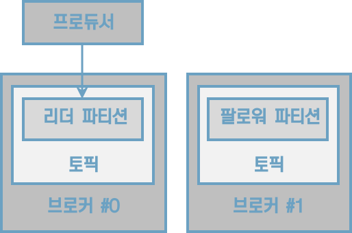

[그림] acks=0인 경우 프로듀서의 동작, 리더 파티션에 데이터가 적재되지 않더라도 성공으로 판단한다.

프로듀서에는 데이터의 전송이 실패했을 때 재시도를 할 수 있도록 retries 옵션을 설정할 수 있는데, acks가 0일 때 프로듀서는 전송을 하자 마자 저장되었음을 가정하고 다음 데이터를 전송하기 때문에 데이터 전송이 실패한 경우를 알 수 없다. 따라서 retries가 2이상으로 설정되어 있더라도 재시도를 하지 않기 때문에 retries 옵션값은 무의미하다.

acks를 0으로 설정했을 경우, 프로듀서와 브로커 사이의 네트워크 오류나 브로커의 이슈 등으로 인해 데이터가 유실되더라도 프로듀서는 리더 파티션으로부터 응답값을 받지 않기 때문에 지속적으로 다음 데이터로 보낸다. 그렇기 때문에 데이터의 전송 속도는 acks를 1 또는 all로 했을 경우보다 훨씬 빠르다. 데이터가 일부 유실이 발생하더라도 전송 속도가 중요한 경우에는 이 옵션값을 사용하면 좋다.

#### acks=1

acks를 1로 설정할 경우 프로듀서는 보낸 데이터가 리더 파티션에만 정상적으로 적재되었는지 확인한다. 만약 리더 파티션에 정상적으로 적재되지 않았다면 리더 파티션에 적재될 때까지 재시도할 수 있다. 그러나 리더 파티션에 적재되었음을 보장하더라도 데이터는 유실될 수 있다. 왜냐하면 복제 개수를 2이상으로 운영할 경우 리더 파티션에 적재가 완료되어 있어도 팔로워 파티션에는 아직 데이터가 동기화되지 않을 수 있는데, 팔로워 파티션이 데이터를 복제하기 직전에 리더 파티션이 있는 브로커에 장애가 발생하면 동기화되지 못한 일부 데이터가 유실될 수 있기 때문이다.


[그림] acks=1인 경우 프로듀서의 동작, 리더 파티션에 데이터가 저장되었으면 성공으로 판단한다.

acks를 1로 설정하면 리더 파티션에 데이터가 적재될 때까지 기다린 뒤 응답 값을 받기 때문에 acks를 0으로 설정하는 것에 비해 전송 속도가 느리다.

#### acks=all 또는 acks=-1

acks를 all 또는 -1로 설정할 경우 프로듀서는 보낸 데이터가 리더 파티션과 팔로워 파티션에 모두 정상적으로 적재되었는지 확인한다. 리더 파티션뿐만 아니라 팔로워 파티션까지 데이터가 적재되었는지 확인하기 때문에 0또는 1 옵션보다도 속도가 느리다. 그럼에도 불구하고 팔로워 파티션에 데이터가 정상 적재되었는지 기다리기 때문에 일부 브로커에 장애가 발생하더라도 프로듀서는 안전하게 데이터를 전송하고 저장할 수 있음을 보장할 수 있다.


[그림] acks=all인 경우 프로듀서의 동작

acks를 all로 설정할 경우 토픽 단위로 설정 가능한 min.insync.replicas 옵션값에 따라 데이터의 안정성이 달라진다. all 옵션값은 모든 리더 파티션과 팔로워 파티션의 적재를 뜻하는 것은 아니고 ISR에 포함된 파티션들을 뜻하는 것이기 때문이다. min.insync.replicas 옵션은 프로듀서가 리더 파티션과 팔로워 파티션에 데이터가 적재되었는지 확인하기 위한 최소 ISR 그룹의 파티션 개수이다. 예를 들면 min.insync.replicas의 옵션값이 1이라면 ISR 중 최소 1개 이상의 파티션에 데이터가 적재되었음을 확인하는 것이다. 이 경우 acks를 1로 했을 때와 동일한 동작을 하는데, 왜냐하면 ISR 중 가장 처음 적재가 완료되는 파티션은 리더 파티션이기 때문이다.

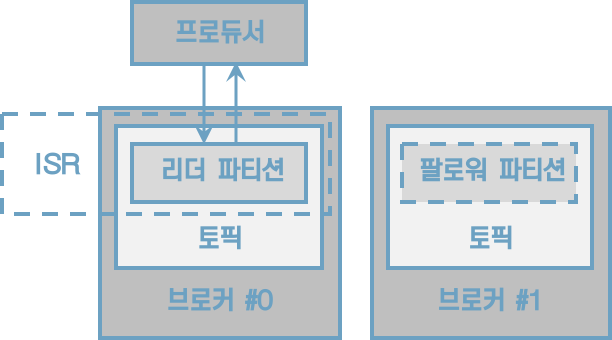

[그림] acks=all, min.insync.replicas=1인 경우 프로듀서의 동작. acks를 1로 했을 때와 동일하다.

min.insync.replicas의 옵션값을 2로 설정했을 때부터 acks를 all로 설정하는 의미가 있다. 이 경우 ISR의 2개 이상의 파티션에 데이터가 정상 적재되었음을 확인한다는 뜻이다. ISR의 2개 이상의 파티션에 적재되었음을 확인한다는 뜻은 적어도 리더 파티션과 1개의 팔로워 파티션에 데이터가 정상적으로 적재되었음을 보장한다.


min.insync.replicas를 설정할 때는 복제 개수도 함께 고려해야 한다. 왜냐하면 운영하는 카프카의 브로커 개수가 min.insync.replicas의 옵션값보다 작은 경우에는 프로듀서는 더는 데이터를 전송할 수 없기 때문이다. 복제 개수를 3으로 설정하고 min.insync.replicas를 3으로 설정하는 경우를 예로 들 수 있다. 브로커 3대 중 1대에 이슈가 발생하여 동작하지 못하는 상황이 생기면 프로듀서는 데이터를 해당 토픽에 더는 전송할 수 없다. 왜냐하면 최소한의 복제되어야 하는 파티션 개수가 3인데 팔로워 파티션이 위치할 브로커의 개수가 부족하기 때문이다. 이 경우에는 NotEmoughReplicasException 또는 NotEnoughtReplicasAfterAppendException이 발생하여 더는 토픽으로 데이타를 전송할 수 없다.

min.insync.replicas 옵션을 설정할 때 추가로 주의해야 할 점은 절대로 브로커 개수와 동일한 숫자로 설정하면 안 된다는 것이다. 브로커 3대로 클러스터를 운영하면서 min.insyncs.replicas 옵션을 3으로 설정하는 경우를 예로 들 수 있다. 이런 상황에서 카프카 클러스터의 버전 업그레이드와 같은 상황이 발생하면 블로커는 롤링 다운 타임이 생기는데, 브로커가 1개라도 중단되면 프로듀서는 데이터를 추가할 수 없다. 그러므로 토픽별 min.insync.replicas 옵션값은 브로커 개수 미만으로 설정해서 운영해야 한다.

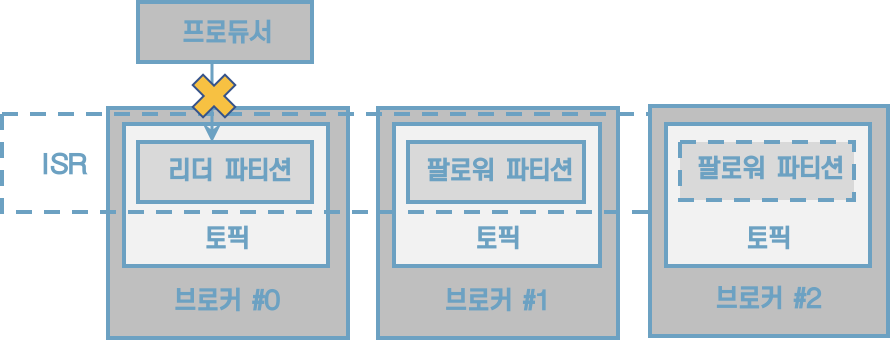

[그림] acks=all, replication.factor=3, min.insync.replicas=3인 경우 브로커 중 1대가 고장나면 더는 토픽에 데이터를 보낼 수 없다.

상용환경에서는 일반적으로 브로커를 3대 이상으로 묶어 클러스터를 운영하는데, 이 점을 고려하여 프로듀서가 데이터를 가장 안정적으로 보내려면 토픽의 복제 개수는 3, min.insync.replicas를 2로 설정하고 프로듀서는 acks를 all로 설정하는 것을 추천한다.


### 4.2.2 멱등성(idempotence) 프로듀서

멱등성이란 여러 번 연산을 수행하더라도 동일한 결과를 나타내는 것을 뜻한다. 이러한 의미에서 멱등성 프로듀서는 동일한 데이터를 여러 번 전송하더라도 카프카 클러스터에 단 한 번만 저장됨을 의미한다. 기본 프로듀서의 동작 방식은 적어도 한번 전달(at least once delivery)을 지원한다. 적어도 한번 전달이란 프로듀서가 클러스터에 데이터를 전송하여 저장할 때 적어도 한 번 이상 데이터를 적재할 수 있고 데이터가 유실되지 않음을 뜻한다. 다만, 두 번 이상 적재할 가능성이 있으므로 데이터의 중복이 발생할 수 있다.

프로듀서가 보내는 데이터의 중복 적재를 막기 위해 0.11.0 이후 버전부터는 프로듀서에서 enable.idempotence옵션을 사용하여 정확히 한번 전달(exactly once delivery)을 지원한다. enable.idempotence옵션의 기본값은 false이며 정확히 한번 전달을 위해서는 true로 옵션값을 설정해서 멱등성 프로듀서로 동작하도록 만들면 된다. 멱등성 프로듀서는 기본 프로듀서와 달리 데이터를 브로커로 전달할 때 프로듀서 PID(Producer unique ID)와 시퀀스 넘버를 함께 전달한다. 그러면 브로커는 프로듀서의 PID와 시퀀스 넘버를 확인하여 동일한 메시지의 적재 요청이 오더라도 단 한 번만 데이터를 적재함으로써 프로듀서의 데이터는 정확히 한번 브로커에 적재되도록 동작한다.

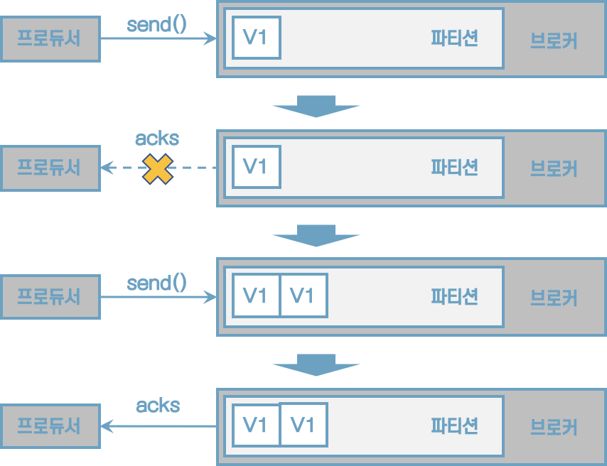

[그림] 프로듀서와 브로커 사이의 네트워크 장애로 데이터는 한 번 이상 전달될 수 있다.


[그림] 멱등성 프로듀서로 동작할 경우 네트워크 장애가 발생하더라도 브로커에 동일한 메시지는 적재하지 않는다. 멱등성 프로듀서가 전송하는 데이터에 PID와 시퀀스 넘버가 있는데, 브로커는 PID와 시퀀스 넘버로 중복을 체크하기 때문이다.

단, 멱등성 프로듀서는 동일한 세션에서만 정확히 한번 전달을 보장한다. 여기서 말하는 동일한 세션이란 PID의 생명주기를 뜻한다. 만약 멱등성 프로듀서로 동작하는 프로듀서 애플리케이션에 이슈가 발생하여 종료되고 애플리케이션을 재시작하면 PID가 달라진다.


### 4.2.3 트랜잭션(transaction) 프로듀서

xxx


## 4.3 카프카 컨슈머

### 4.3.1 멀티 스레드 컨슈머

카프카는 처리량을 늘리기 위해 파티션과 컨슈머 개수를 늘려서 운영할 수 있다. 파티션을 여러 개로 운영하는 경우 데이터를 병렬처리하기 위해서 파티션 개수와 컨슈머 개수를 동일하게 맞추는 것이 가장 좋은 방법이다. 토픽의 파티션은 1개 이상으로 이루어져 있으며 1개의 파티션은 1개 컨슈머가 할당되어 데이터를 처리할 수 있다. 파티션 개수가 n개라면 동일 컨슈머 그룹으로 묶인 컨슈머 스레드를 최대 n개 운영할 수 있다. 그러므로 n개의 스레드를 가진 1개의 프로세스를 운영하거나 1개의 스레드를 가진 프로세서를 n개 운영하는 방법도 있다.

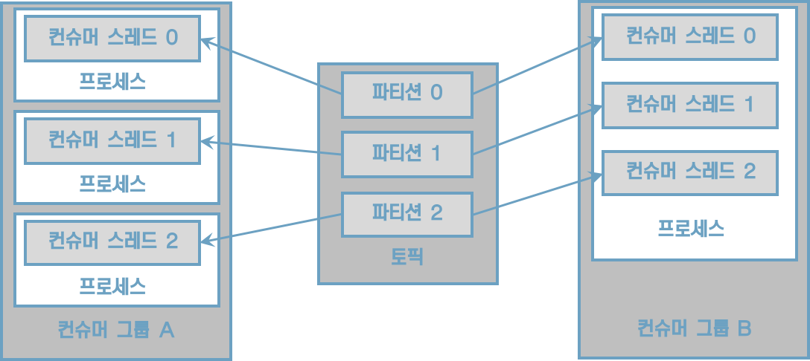

[그림] 3개의 프로세서로 동작하는 컨슈머 그룹 A, 1개 프로세스와 3개 스레드로 동작하는 컨슈머 그룹 B

컨슈머를 멀티 스레드로 활용하는 방식은 크게 두 가지로 나뉜다. 첫 번째는 컨슈머 스레드는 1개만 실행하고 데이터를 처리를 담당하는 워크 스레드를 여러 개 실행하는 방법인 멀티 워크 스레드 전략이다. 두 번째는 컨슈머 인스턴스에서 poll() 메서드를 호출하는 스레드를 여러 개 띄워서 사용하는 컨슈머 멀티 스레드 전략이다.


#### 카프카 컨슈머 멀티 워크 스레드 전략

브로커로부터 전달받은 레코드들을 병렬로 처리한다면 1개의 컨슈머 스레드로 받은 데이터들을 더욱 향상된 속도로 처리할 수 있다. 멀티 스레드를 사용하면 각기 다른 레코드들의 데이터 처리를 동시에 실행할 수 있기 때문에 처리 시간을 현저히 줄일 수 있다.

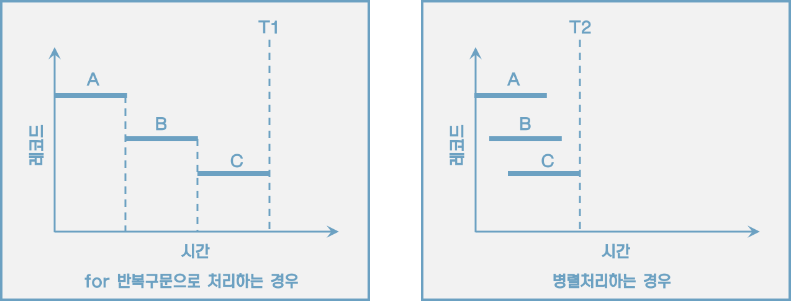

[그림] 반복구문으로 처리를 완료하는 시간(T1)보다 병렬처리로 완료하는 시간(T2)이 더 적게 걸린다.


#### 카프카 컨슈머 멀티 스레드 전략

하나의 파티션은 동일 컨슈머 중 최대 1대까지 할당된다. 그리고 하나의 컨슈머는 여러 파티션에 할당될 수 있다. 이런 특징을 가장 잘 살리는 방법은 1개의 애플리케이션에 구독하고자 하는 토픽의 파티션 개수만큼 컨슈머 스레드 개수를 늘려서 운영하는 것이다. 컨슈머 스레드를 늘려서 운영하면 각 스레드에 각 파티션이 할당되며, 파티션의 레코드들을 병렬처리할 수 있다.

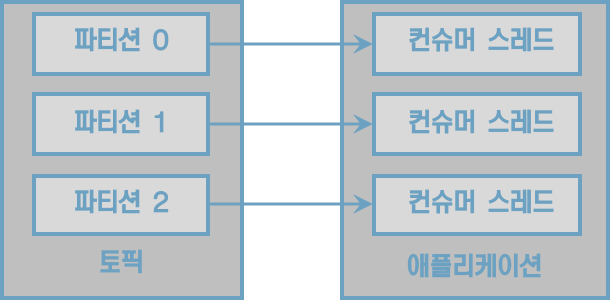

[그림] 파티션 개수만큼 컨슈머 스레드를 운영하는 애플리케이션

여기서 주의해야 할 점은 구독하고자 하는 토픽의 파티션 개수만큼만 컨슈머 스레드를 운영하는 것이다. 컨슈머 스레드가 개수보다 많아지면 할당할 파티션 개수가 더는 없으므로 파티션에 할당되지 못한 컨슈머 스레드는 데이터를 처리를 하지 않게 된다. 


### 4.3.2 컨슈머 랙

컨슈머 랙(LAG)은 토픽의 최신 오프셋(LOG-END-OFFSET)과 컨슈머 오프셋(CURRENT-OFFSET) 간의 차이다. 프로듀서는 계속해서 새로운 데이터를 파티션에 저장하고 컨슈머는 자신이 처리할 수 있는 만큼 데이터를 가져간다. 컨슈머 랙은 컨슈머가 정상 동작하는지 여부를 확인할 수 있기 때문에 컨슈머 애플리케이션을 운영한다면 필수적으로 모니터링해야 하는 지표이다.

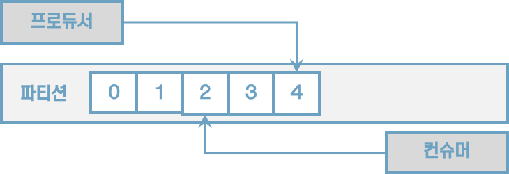

[그림] 컨슈머 랙은 가장 최신 오프셋과 컨슈머 오프셋 간의 차이이다. LOG-END-OFFSET)은 4, CURRENT-OFFSET은 2, LAG은 2이다. 

컨슈머 랙은 컨슈머 그룹과 토픽, 파티션별로 생성된다. 1개의 토픽에 3개의 파티션이 있고 1개의 컨슈머 그룹이 토픽을 구독하여 데이터를 가져가면 컨슈머 랙은 총 3개가 된다.

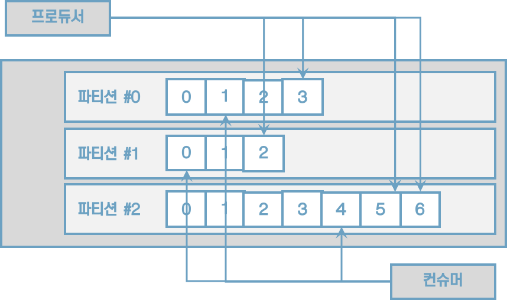

[그림] 파티션 3개로 구성된 토픽에 컨슈머가 할당되면 컨슈머 랙은 총 3개가 된다. 여기서 모든 파티션의 컨슈머 랙은 2로 동일하다.

프로듀서가 보내는 데이터양이 컨슈머의 데이터 처리량보다 크다면 컨슈머 랙은 늘어난다. 반대로 프로듀서가 보내는 데이터 양이 컨슈머의 데이터 처리량보다 적으면 컨슈머 랙은 줄어들고 최솟값은 0으로 지연이 없음을 뜻한다.

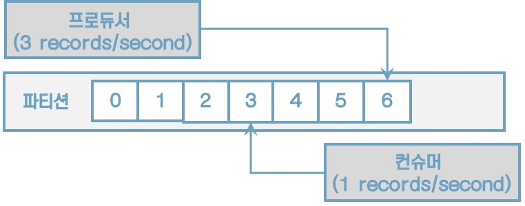

[그림] 프로듀서의 데이터 전송량이 컨슈머의 데이터 처리량보다 많으면 컨슈머 랙은 계속해서 늘어난다


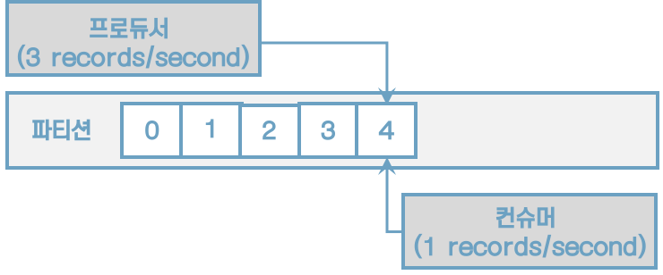

[그림] 프로듀서의 데이터 전송량보다 컨슈머의 데이터 처리량이 많으면 컨슈머 랙은 0으로 떨어진다


컨슈머 랙을 확인하는 방법은 총 3가지가 있다. 첫 번째는 카프카 명령어를 사용하는 방법, 두 번째는 컨슈머 애플리케이션에서 metrics() 메서드를 사용하는 방법, 세 번째는 외부 모니터링 툴을 사용하는 방법이다.


#### 카프카 명령어를 사용하여 컨슈머 랙 조회

kafka-consumer-groups.sh 명령어를 사용하면 컨슈머 랙을 포함한 특정 컨슈머 그룹의 상태를 확인할 수 있다.

```sh
$ bin/kafka-consumer-groups.sh --bootstrap-server localhost:9092 \
	--group my-group --describe
```


#### 컨슈머 metrics() 메서드를 사용하여 컨슈머 랙 조회


#### 외부 모니터링 툴을 사용하여 컨슈머 랙 조회

버로우는 링크드인에서 개발하여 오픈소스로 공개한 컨슈머 랙 체크 툴로 REST API를 통해 컨슈머 그룹별로 컨슈머 랙을 확인할 수 있다.


#### 4.3.2.1 카프카 버로우


## 4.4. 스프링 카프카


