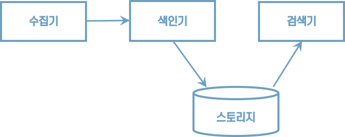

# 01 검색 시스템 이해하기

## 1.1 검색 시스템의 이해

### 1.1.1 검색 시스템이란?

* 검색엔진
    * 광활한 웹에서 정보를 수집해 검색 결과를 제공하는 프로그램이다.
    * 야후는 디렉터리 기반의 검색 결과를 세계 최초로 제공했다.
* 검색 시스템
    * 대용량 데이터를 기반으로 시노리성 있는 검색 결과를 제공하기 위해 검색엔진을 기반으로 구축된 시스템을 통칭하는 용어다.
* 검색 서비스는 검색 앤젠을 기반으로 구축한 검색 시스템을 활용해 검색 결과를 서비스로 제공한다.


>  검색 서비스 > 검색 시스템 > 검색 엔진


### 1.1.2 검색 시스템의 구성 요소

##### 수집기

수집기는 웹사이트, 블로그, 카페 등 웹에서 필요한 정보를 수집하는 프로그램이다.

##### 스토리지

데이터베이스에서 데이터를 저장하는 물리적인 장소다.

##### 색인기

검색엔진이 수집한 정보에서 사용자 질의와 일치하는 정보를 찾으려면 수집된 데이터를 검색 가능한 구조로 가공하고 저장해야 한다. 그 역할을 하는 것이 색인기다. 색인기는 다양한 형태소 분석기를 조합해 정보에서 의미가 있는 용어를 추출하고 검색에 유리한 <u>역색인 구조로 데이터를 저장한다.</u>

##### 검색기

검색기는 사용자 질의를 받아 색인기에서 저장한 역색인 구조에서 일치하는 문서를 찾아 결과로 반환한다.





### 1.1.3 관계형 데이터베이스와의 차이점

엘라스틱서치와 관계형 데이터베이스 비교

| 엘라스틱서치 | 관계형 데이터베이스 |
| :----------- | :------------------ |
| 인덱스       | 데이터베이스        |
| 샤드         | 파티션              |
| 타입         | 테이블              |
| 문서         | 행                  |
| 필드         | 열                  |
| 매핑         | 스키마              |
| Query DSL    | SQL                 |


추가,검색,삭제, 수정 기능 비교
| 엘라스틱서치에서 사용하는 HTTP 메서드 |기능 | 데이터베이스 질의문법|
| :----------- | :------------------ | :------------------ |
| GET    | 데이터 조회   |SELECT        |
| `PUT`     | `데이터 생성`       |INSERT        |
| POST      | 인덱스 업데이트, 데이터 조회 |UPDATE, SELECT        |
| DELETE    | 데이터 삭제             |DELETE        |
| HEAD      | 인덱스 정보 확인         |-        |


다음은 엘라스틱서치를 사용하기 위한 간단한 API 요청 구조다.

```http
curl -X(메서드) http://host:port/(인덱스)/(타입)/(문서 id) -d '{json 데이터}'
```


리눅스에서는 엘라스틱 서버의 정보를 다음 명령으로 확인할 수 있다.

```http
curl -XGET http://localhost:9200
```

실행결과

```json
{
  "name" : "JJN9Ar1",
  "cluster_name" : "docker-cluster",
  "cluster_uuid" : "rNQde4FrQBiFouVrBHfGfQ",
  "version" : {
    "number" : "6.8.6",
    "build_flavor" : "oss",
    "build_type" : "docker",
    "build_hash" : "3d9f765",
    "build_date" : "2019-12-13T17:11:52.013738Z",
    "build_snapshot" : false,
    "lucene_version" : "7.7.2",
    "minimum_wire_compatibility_version" : "5.6.0",
    "minimum_index_compatibility_version" : "5.0.0"
  },
  "tagline" : "You Know, for Search"
}
```


엘라스틱서치와 관계형 데이터베이스의 쿼리를 비교해보자.

| ID | Name        | Location | Gender | Date|
| :--- |  :--- | :--- | :--- | :--- |
| 1 | 가마돈 | 서울 | 남 | 2018-05-12 |
| 2 |로이드 | 도쿄 | 여 | 2018-05-11 |

SQL문

```sql
SELECT * FROM USER WHERE Name like '%가마돈%'
```

엘라스틱서치 API

```http
GET http://localhost:9200/user/_search/q=Name:가마돈
```


## 1.2 검색 시스템과 엘라스틱서치

### 1.2.1 엘라스틱서치가 강력한 이유

#### 오픈소스 검색엔진

엘라스틱서치는 루씬을 기반으로 개발된 오프소스 검색엔진이다.


#### 전문 검색

PostgreSQL, MongoDB 같은 대부분 데이터베이스는 기본적인 텍스트 검색 기능만 제공한다. 하지만 엘라스틱서치는 좀 더 고차원적인 전문 검색(Full Text)이 가능하다. 전문 검색이란 내용 전체를 색인해서 특정 단어가 포함된 문서를 검색하는 것을 말한다.


#### 통계 분석

비정형 로그 데이터를 수집하고 한곳에 모아 통계 분석을 할 수 있다. 엘라스틱서치와 키바나를 연결하면 실시간으로 쌓이는 로그를 시각화하고 분석할 수 있다.


#### 스키마리스

정형화되지 않은 다양한 형태의 문서도 자동으로 색인하고 검색할 수 있다.


#### RESTFul API

HTTP 기반의 RESTFul API를 지원하고 응답에도 JSON 형식을 사용해 개발언어, 운영체제, 시스템에 관계없이 이기종 플랫폼에서도 이용 가능하다.


#### 멀티테넌시

서로 상이한 인덱스일지라도 검색할 필드만 같으면 여러 개의 인덱스를 한번에 조회할 수 있다.


#### Document-Oriented

여러 계층의 데이터를 JSON 형식의 구조화된 문서로 인덱스에 저장할 수 있다. 계층 구조로 문서도 한번의 쿼리로 쉽게 조회할 수 있다.


#### 역색인

엘라스틱서치는 역색인을 지원한다. 반면 MongoDB, 카산드라 같은 일반적인 NoSQL은 역색인을 지원하지 않는다.

| 단어         | 문서 번호 |
| :----------- | :-------- |
| 엘라스틱서치 | 1         |
| 검색엔진     | 1,2       |
| 역색인       | 2,3       |
| 데이터베이스 | 3         |

'검색엔진'이란 단어가 포함된 모든 문서를 찾아야 한다고 하자. 일반적으로는 처음부터 끝까지 모든 문서를 읽어야만 원하는 결과를 얻을 수 있을 것이다. 하지만 역색인 구조는 해당 단어만 찾으면 단어가 포함된 모든 문서의 위치를 알 수 있기 때문에 빠르게 찾을 수 있다.


#### 확장성과 가용성

데이터는 샤드라는 작은 단위로 나뉘어 제공되면 데이터를 분산해서 빠르게 처리할 수 있다.


### 1.2.2 엘라스틱서치의 약점

1. 실시간이 아니다. 일반적으로 색인된 데이터는 1초 뒤에나 검색이 가능하다. 색인된 데이터는 내부적으로 커밋과 플러시 같은 복잡한 과정을 거치기 때문에 실시간이 아니다. 엄밀히 따지자면 준 실시간(Near Realtime)이라고 할 수 있다.
2. 트랜잭션과 롤백 기능을 제공하지 않는다.
3. 데이터의 업데이트를 제공하지 않는다. 엄밀히 말하자면 엘라스틱서치는 업데이트 명령이 요청될 경우 기존 문서를 삭제하고 변경된 내용으로 새로운 문서를 생성하는 방식을 사용한다.


# 02 엘리스틱서치 살펴보기

## 2.1 엘라스틱서치를 구성하는 개념

### 2.1.1 기본 용어

엘라스틱서치의 데이터는 인덱스, 타입, 문서, 필드 구조로 구성된다.


#### 인덱스

* 인덱스는 데이터 저장 공간이다.
* 하나의 인덱스는 하나의 타입만 가지며 하나의 물리적인 노드에 여러 개의 논리적인 인덱스를 생성할 수 있다.
* 검색 시 인덱스 이름으로 문서 데이터를 거색하며, 여러 개의 인덱스를 동시에 검색하는 것도 가능하다.
* 분산환경으로 구성하면 하나의 인덱스가 여러 노드에 분산되어 관리된다.
* 인덱스 이름은 모두 소문자여야 한다.
* 인덱스가 없는 상태에서 데이터가 추가된다면 데이터를 이용해 인덱스가 자동으로 생성된다.


#### 샤드

* 색인된 문서는 하나의 인덱스에 담긴다.
* 인덱스 내부에 색인된 데이터는 물리적인 공간에 여러 개의 파티션으로 나뉘어 구성되는데, 이 파티션을 엘라스틱서치에서는 샤드라고 부른다.


#### 타입

* 타입은 인덱스의 논리적인 구조를 의미한다.


#### 문서

문서는 엘라스틱서치에서 데이터가 저장되는 최소 단위다. 기본적으로 JSON 포맷으로 데이터가 저장된다.


#### 필드

필드는 문서를 구성하기 위한 속성이라고 할 수 있다.


#### 매핑

매핑은 문서의 필드와 필드의 속성을 정의하고 그에 따른 색인 방법을 정의하는 프로세스다.


### 노드의 종류

엘라스틱서치는 각 설정에 따라 4가지 유형의 노드를 제공한다.

* 마스터 노드
    * 클러스터를 관리한다.
    * <u>노드 추가와 제거</u> 같은 클러스터의 전반적인 관리를 담당한다.
* 데이터 노드
    * <u>실질적인 데이터를 저장</u>한다.
    * 검색과 통계 같은 데이터 관련 작업을 수행한다.
* 코디네이팅 노드
    * <u>사용자의 요청</u>만 받아서 처리한다.
    * 클러스터 관련 요청은 마스터 노드에 전달하고 데이터 관련 요청은 데이터 노드에 전달한다.
* 인제스트 노드
    * 문서의 전처리 작업을 담당한다.
    * 인덱스 생성 전 문서의 형식을 다양하게 변경할 수 있다.


#### 마스터 노드

* 마스터 노드는 인덱스를 생성, 삭제하는 등 클러스터와 관련된 전반적인 작업을 담당한다.
* 다수의 노드를 마스터 노드로 설정할 수 있지만 결과적으로 하나의 노드만이 마스터 노드로 선출되어 동작한다.
* 노드를 마스터 노드 전용으로 설정하고자 한다면 elasticsearch.yml 파일을 열고 다음과 같이 설정하면 된다.

```yaml
node.master: true
node.data: false
node.ingest: false
search.remote.connect: false
```


#### 데이터 노드

* 데이터 노드는 문서가 실제로 저장되는 노드다.
* 데이터 노드는 가능한 한 마스터 노드와 분리해서 구성하는 게 좋다.

```yaml
node.master: false
node.data: true
node.ingest: false
search.remote.connect: false
```


#### 코디네이팅 노드

* 데이터 노드, 마스터 노드, 인제스트 노드의 역할을 하지 않고, 들어온 요청을 단순히 라운드로빈 방식으로 분산시켜 주는 노드다.

```yaml
node.master: false
node.data: false
node.ingest: false
search.remote.connect: false
```


#### 인제스트 노드

* 색인에 앞서 데이터를 전처리하기 위한 노드다.
* 데이터 포맷을 변경하기 위해 스크립트로 전처리 파이프라인을 구성하고 실행할 수 있다.

```yaml
node.master: false
node.data: false
node.ingest: true
search.remote.connect: false
```


### 2.1.3 클러스터, 노드, 샤드


## 2.2 엘라스틱서치에서 제공하는 주요 API

#### API의 종류

* 인덱스 관리 API
* 문서 관리 API
* 검색 API
* 집계 API


#### 스키마리스 기능은 가급적이면 사용하지 말자

인덱스를 생성하지 않고 바로 데이터를 색인해보자.

```http
PUT /movie/_doc/1
{
    "movieCd": "1",
    "movieNm": "살아남은 아이",
    "movieNmEn": "Last Child",
    "prdtYear": "2017",
    "openDt": "",
    "typeNm": "장편",
    "prdtStatNm": "기타",
    "nationAlt": "한국",
    "genreAlt": "드라마,가족",
    "repNationNm": "한국",
    "repGenreNm": "드라마"
}
```

실행결과는 다음과 같다.

```json
{
  "_index" : "movie",
  "_type" : "_doc",
  "_id" : "1",
  "_version" : 1,
  "result" : "created",
  "_shards" : {
    "total" : 2,
    "successful" : 1,
    "failed" : 0
  },
  "_seq_no" : 0,
  "_primary_term" : 1
}
```

인덱스가 자동으로 생성되어 세부적인 필드 정보가 매핑되지 않은 것이다. 이런 식으로 인덱스를 자동으로 생성할 경우 특정 단어를 검색할 때 검색 결과에서 누락되는 등 문제가 발생할 가능성이 높아진다.

생성된 인덱스의 구성 정보를 조회해보자.

```http
GET /movie
```

결과는 다음과 같다.

```json
{
  "movie" : {
    "aliases" : { },
    "mappings" : {
      "_doc" : {
        "properties" : {
          "genreAlt" : {
            "type" : "text",
            "fields" : {
              "keyword" : {
                "type" : "keyword",
                "ignore_above" : 256
              }
            }
          },
          "movieCd" : {
            "type" : "text",
            "fields" : {
              "keyword" : {
                "type" : "keyword",
                "ignore_above" : 256
              }
            }
          },
          ...
    "settings" : {
      "index" : {
        "creation_date" : "1621601145957",
        "number_of_shards" : "5",
        "number_of_replicas" : "1",
        "uuid" : "8A699zeAR0ikI-mF_lZhxA",
        "version" : {
          "created" : "6080699"
        },
        "provided_name" : "movie"
      }
    }
  }
}
```

<u>기본적으로 모든 필드가 text 타입과 keyword 타입을 동시에 제공하는 멀티필드 기능으로 구성된다</u>. 이러한 경우 데이터 공간의 낭비를 초래한다.


다음과 같은 문장을 색인한다고 가정해보자.

>  원문: 아버지가 방에 들어 가신다.

* 스키마리스를 이용해 색인한다면 기본적으로 text 타입의 standard Analyzer를 사용하는 데이터 타입으로 정의된다.
* "아버지가", "방에", "들어", "가신다" 라는 토큰으로 분리된다.
* "아버지"라는 키워드가 입력되더라도 해당 문서는 검색되지 않을 것이다.


### 2.2.1 인덱스 관리 API

#### 인덱스 생성

다음은 movie 인덱스를 생성하고 매핑 정보를 추가한 예다.

``` http
PUT /movie
{
 	 "settings": {
		"number_of_shards": 3,
	     "number_of_replicas": 2
	},
 	 "mappings": {
		"_doc": {
			"properties": {
				"movieCd": {"type": "integer"},
				"movieNm": {"type": "text"},
		         "movieEn": {"type": "text"},
       		    "prdtYear": {"type": "integer"},
		         "openDt": {"type": "date"},
		         "typeNm": {"type": "keyword"},
		         "prdtStatNm": {"type": "keyword"},
		         "nationAlt": {"type": "keyword"},
		         "genreAlt": {"type": "keyword"},
		         "repNationNm": {"type": "keyword"},
		         "repGenreNm": {"type": "keyword"}
			}
		}
	}
}
```

* 단순 문자열열로 저장하고 싶을 경우 keyword 타입을 사용하고 형태소 분석을 원할 경우 text 타입을 사용한다.


#### 인덱스 삭제

```http
DELETE /movie
```


### 2.2.2 문서 관리 API

[Single document API]

* Index API: 한 건의 문서를 색인한다.
* Get API: 한 건의 문서를 조회한다.
* Delete API: 한 건의 문서를 삭제한다.
* Update API: 한 건의 문서를 업데이트 한다.

[Multi-document API]

* Multi Get API: 다수의 문서를 조회한다.
* Bulk API: 대량의 문서를 색인한다.
* Delete By Query API: 다수의 문서를 삭제한다.
* Update By Query API: 다수의 문서를 업데이트한다.
* Reindex API: 인덱스의 문서를 다시 색인한다.


#### 문서 생성

movie 인덱스에 문서를 추가해보자. id로 1을 지정했다.

```http
POST /movie/_doc/1
{
    "movieCd": "1",
    "movieNm": "살아남은 아이",
    "movieNmEn": "Last Child",
    "prdtYear": "2017",
    "openDt": "2017-10-20",
    "typeNm": "장편",
    "prdtStatNm": "기타",
    "nationAlt": "한국",
    "genreAlt": "드라마,가족",
    "repNationNm": "한국",
    "repGenreNm": "드라마"
}
```


#### 문서 조회

생성한 문서를 조회해보자.

```http
GET /movie/_doc/1
```

실행된 결과는 다음과 같다.

```json
{
  "_index" : "movie",
  "_type" : "_doc",
  "_id" : "1",
  "_version" : 1,
  "_seq_no" : 0,
  "_primary_term" : 1,
  "found" : true,
  "_source" : {
    "movieCd" : "1",
    "movieNm" : "살아남은 아이",
    "movieNmEn" : "Last Child",
    "prdtYear" : "2017",
    "openDt" : "2017-10-20",
    "typeNm" : "장편",
    "prdtStatNm" : "기타",
    "nationAlt" : "한국",
    "genreAlt" : "드라마,가족",
    "repNationNm" : "한국",
    "repGenreNm" : "드라마"
  }
}
```


#### 뮨서 삭제

생성된 문서를 삭제해보자.

```http
DELETE /movie/_doc/1
```


#### Id를 지정하지 않고 문서를 생성

```http
POST /movie/_doc
{
    "movieCd": "1",
    "movieNm": "살아남은 아이",
    "movieNmEn": "Last Child",
    "prdtYear": "2017",
    "openDt": "2017-10-20",
    "typeNm": "장편",
    "prdtStatNm": "기타",
    "nationAlt": "한국",
    "genreAlt": "드라마,가족",
    "repNationNm": "한국",
    "repGenreNm": "드라마"
}
```

실행 결과는 다음과 같다.

```json
{
  "_index" : "movie",
  "_type" : "_doc",
  "_id" : "mlGTkXkB4Yb9KPKyQQcM",
  "_version" : 1,
  "result" : "created",
  "_shards" : {
    "total" : 3,
    "successful" : 1,
    "failed" : 0
  },
  "_seq_no" : 0,
  "_primary_term" : 1
}
```


### 2.2.3 검색 API

엘라스틱서치 검색 API의 사용방식은 다음과 같이 크게 두 가지로 나뉜다.

1. HTTP URI 형태의 파라미터를 URI에 추가해 검색하는 방법
2. RESTFul API 방식인 QueryDSL을 사용해 요청 본문에 질의 내용을 추가해 검색하는 방법


#### URI 방식의 검색 질의

```http
GET /movie/_doc/mlGTkXkB4Yb9KPKyQQcM?pretty=true
```

다음은 q 파라미터를 사용해 해당 용어와 일치하는 문서만 조회한다.

```http
POST /movie/_search?q=장편
```

특정 필드만 조회하고 싶으면

```http
POST /movie/_search?q=typeNm:장편
```


#### Request Body 방식의 검색 질의

movie 인덱스의 typeNm 필드를 검색하는 예

```http
POST movie/_search
{
    "query": {
        "term": {
            "typeNm": "장편"
        }
    }
}
```

쿼리 구문은 다음과 같이 여러 개의 키를 조합해 객체의 키 값으로 사용할 수 있다.

```http
{
	size: # 몇 개의 결과를 반환할지 결정 (기본값: 10)
	
	from: #어느 위치부터 반환할지 (기본값 0)
	_source: #특정 필드만 결과를 반환하고 싶을 때 사용
	
	sort: #특정 필드를 기준으로 정렬
	
	query: {
		#검색될 조건을 정의한다.
	}
	
	filter: {
		# 검색 결과 중 특정한 값을 다시 보여준다.
		# filter를 사용하면 자동으로 score 값이 정렬되지 않는다.
	}
}
```


### 2.2.4 집계 API

terms키워드를 이용해 genreAlt라는 필드의 데이터를 그룹화한다.

```http
POST /movie/_search?size=0
{
  "aggs": {
    "genre": {
      "terms": {
        "field": "genreAlt"
      }
    }
  }
}
```


#### 데이터 집계 타입

* 버킷 집계
* 메트릭 집계
* 매트릭스 집계
* 파이프라인 집계


# 03 데이터 모델링

## 3.1 매핑 API 이해하기

매핑은 색인 시 데이터가 어디에 어떻게 저장될지를 결정하는 설정이다. (데이터베이스의 스키마에 대응하는 개념)

스키마리스로 생성할 경우 다음과 같은 문제가 발생할 수도 있다.

```
# 문서1

{
	"movieCd": "20173732",
	"movieNm": "캡틴 아메리카"
}

# 문서2

{
	"movieCd": "XT001",
	"movieNm": "아이언맨"
}
```

* 첫 번째 문서를 매핑 설정 없이 색인하면 movieCd 필드는 숫자 타입으로 매핑되고 movieNm은 문자 타입으로 매핑된다. 
* 바로 두 번째 문서를 색인해보자. 아마도 색인에 실패할 것이다. 
* movieCd 필드가 이미 숫자 타입으로 매핑됐기 때문에 문자열 형태인 두 번째 문서의 movieCd값은 색인이 불가능하기 때문이다. 


매핑 정보를 설정할 때는 다음과 같은 사항을 고민해야 한다.

* 문자열을 분석할 것인가?
* _source에 어떤 필드를 정의할 것인가?
* 날짜 필드를 가지는 필드는 무엇인가?
* 매핑에 정의되지 않고 유입되는 필드는 어떻게 처리할 것인가?


### 3.1.1 매핑 인덱스 만들기

movie_search는 개봉 영화의 세부 정보를 제공하는 인덱스다.

| 매핑명         | 필드명              | 필드 타입         |
| :------------- | :------------------ | :---------------- |
| 인덱스 키      | movieCd             | keyword           |
| 영화제목_국문  | movieNm             | text              |
| 영화제목_영문  | movieNmEn           | text              |
| 제작연도       | prdtYear            | integer           |
| 개봉연도       | openDt              | integer           |
| 영화유형       | typeNm              | keyword           |
| 제작상태       | prodtStatNm         | keyword           |
| 제작국가(전체) | nationAlt           | keyword           |
| 장르(전체)     | genreAlt            | keyword           |
| 대표 제작국가  | repNationNm         | keyword           |
| 대표 장르      | repGenreNm          | keyword           |
| 영화감독명     | directors.peopleNm  | object -> keyword |
| 제작사코드     | companies.companyCd | object -> keyword |
| 제작사명       | companies.companyNm | object -> keyword |

실제 데이타는 다음과 같다.

```json
{
	"movieCd": "20173732",
  "movieNm": "살아남은 아이",
  "movieNmEn": "Last Child",
  "prdtYear": "2017",
  "openDt": "",
  "typeNm": "장편",
  "prdtStatNm": "기타",
  "nationAlt": "한국",
  "genreAlt": "드라마,가족",
  "repNationNm": "한국",
  "repGenreNm": "한국",
  "directors": [{
  	"peopleNm": "신동석"
  }],
  "companies": [
  	"companyCd": "",
  	"companyNm" ""
  ]
}
```

다음과 같이 인덱스를 생성한다.

```http
PUT movie_search
{
  "settings": {
    "number_of_shards": 5,
    "number_of_replicas": 1
  },
  "mappings": {
    "_doc": {
      "properties": {
        "movieCd": {
          "type": "keyword"
        },
        "movieNm": {
          "type": "text",
          "analyzer": "standard"
        },
        "movieNmEn": {
          "type": "text",
          "analyzer": "standard"
        },
        "prdtYear": {
          "type": "integer"
        },
        "openDt": {
          "type": "date"
        },
        "typeNm": {
          "type": "keyword"
        },
        "prdtStatNm": {
          "type": "keyword"
        },
        "nationAlt": {
          "type": "keyword"
        },
        "genreAlt": {
          "type": "keyword"
        },
        "repNationNm": {
          "type": "keyword"
        },
        "repGenreNm": {
          "type": "keyword"
        },
        "companies": {
          "properties": {
            "companyCd": {
              "type": "keyword"
            },
            "companyNm": {
              "type": "keyword"
            }
          }
        },
        "directors": {
        	"properties": {
        		"peopleNm": {
        			"type": "keyword"
        		}
        	}
        }
      }
    }
  }
}
```

### 3.1.2 매핑 확인

매핑을 확인하려면 _mapping AP를 사용할 수 있다.

```http
GET movie_search/_mapping
```


### 3.1.3 매핑 파라미터

##### analyzer

* 해당 필드의 데이터를 형태소 분석하겠다는 의미  
* text 타입의 필드는 analyzer 매핑 파라미터를 기본적으로 사용해야 한다.  
* 별도의 분석기를 지정하지 않으면 Standard Analyzer로 형태로 분석을 수행한다.

##### normalizer

* normalizer 매핑 파라미터는 term query에 분석기를 사용하기 위해 사용된다.  
* keyword 데이터 타입의 경우 원문을 기준으로 문서가 색인되기 때문에 cafe,Cafe는 서로 다른 문서로 인식된다.  
* 하지만 normalizer를 통해 분석기에 asciifolding과 같은 필터를 사용하면 같은 데이터로 인식되게 할 수 있다.

##### boost

* 필드에 가중치를 부여한다.  
* 가중치에 따라 유사도 점수가 달라지기 때문에 boost 설정 시 검색 결과의 노출 순서에 영향을 준다.

> 최신 엘라스틱서치는 색인 시 boost 설정을 할 수 없도록 바뀌었다.

##### coerce

* 색인 시 자동 변환을 허용할 지 여부를 설정하는 파라미터다.  
* 예를 들어 "10"과 같은 숫자 형태의 문자열이 integer 타입의 필드에 들어온다면 엘라스틱 서치는 자동으로 형변환을 수행해서 정상적으로 처리한다.  
* 하지만 coerce 설정을 미사용으로 변경한다면 색인에 실패할 것이다.

##### copy_to

* 매핑 파라미터를 추가한 필드의 값을 지정한 필드로 복사한다. 
* keyword 타입의 필드에 copy_to 매핑 파라미터를 사용해 다른 필드로 값을 복사하면 복사된 필드에서는 text 타입을 지정해 형태소 분석을 할 수도 있다.

##### fielddata

* 힙 공간에 생성하는 메모리 캐시다. 
* 최신 버전의 엘라스틱서치는 doc_values라는 새로운 형태의 캐시를 제공하고 있으며 text타입의 필드를 제외한 모든 필드는 기본적으로 doc_values 캐시를 사용한다.

text타입의 필드에서 집계나 정렬을 수행하는 경우에 부득이하게 fielddata를 사용할 수 있다. 하지만 fielddata는 메모리에 생성되는 캐시이기 때문에 최소한으로 사용해야 한다는 사실에 주의해야 한다.
fielddata는 메모리 소모가 크기 때문에 기본적으로 비활성화돼 있다.  

사용법은 다음과 같다.

```http
PUT movie_search_mapping/_mapping/_doc
{
    "properties": {
        "nationAltEn": {
            "text": "text",
            "fielddata": true
    }
}
```

##### doc_values

* 엘라스틱서치에서 사용하는 기본 캐시다. 
* text 타입을 제외한 모든 타입에서 기본적으로 doc_values 캐시를 사용한다. 
* doc_values는 루씬을 기반으로 하는 캐시방식이다.
* 과거에는 캐시를 모두 메모리에 올려 사용했으나 doc_values를 사용함으로써 힙 사용에 대한 부담을 없애고 운영체제의 파일 시스템 캐시를 통해 디스크에 있는 데이터에 빠르게 접근할 수 있다.
* 이로 인해 GC의 비용이 들지 않으면서도 메모리 연산과 비슷한 성능을 보여준다.

##### dynamic

* 매핑에 필드를 추가할 때 동적으로 생성할지, 생성하지 않을지를 결정한다.

| 값     | 의미                                                         |
| ------ | :----------------------------------------------------------- |
| true   | 새로 추가되는 필드를 매핑에 추가한다.                        |
| false  | 새로 추가되는 필드를 무시한다. 해당 필드는 색인되지 않아 검색할 수 없지만 _source에는 표시된다. |
| strict | 새로운 필드가 감지되면 예외가 발생하고 문서 자체가 색인되지 않는다. 새로 유입되는 필드는 사용자가 매핑에 명시적으로 추가해야 한다. |

##### enabled

* 검색 결과에는 포함하지만 색인은 하고 싶지 않은 경우도 있다. 메타 성격의 데이터가 그렇다. 
* 일반적인 게시판이라면 제목과 요약 글만 색인하고 날짜와 사용자 ID는 색인하지 않는 경우다.

##### format

* 날짜/시간을 문자열로 표시한다.

| 포캣       | 날짜 형식 | 비고       |
| :--------- | :-------- | :--------- |
| basic_date | yyyyMdd   | 년도/월/일 |
| ...        | ...       | ...        |

##### ignore_above

* 필드에 저장되는 문자열이 지정한 크기를 넘어서면 빈 값으로 색인한다. 
* <u>지정한 크기만큼의 색인되는 것이 아니라 빈 값으로 저장되므로 주의해야 한다.</u>

##### ignore_malformed

* 잘못된 데이터 타입을 색인하려고 하면 예외가 발생하고 해당 문서 전체가 색인되지 않는다. 
* 이 매핑 파라미터를 사용하면 해당 필드만 무시하고 문서는 색인할 수 있다.

##### index

* 필드값을 색인할 지를 결정한다. 
* 기본값은 true이며, false로 변경하면 해당 필드를 색인하지 않는다.

##### fields

* 다중 필드를 설정할 수 있는 옵션이다.
* 필드 안에 또 다른 필드의정보를 추가할 수 있어 같은 string값을 다른 분석기로 처리하도록 설정할 수 있다.

##### norms

* 문서의 _scores 값 계산에 필요한 정규화 인수를 사용할지 여부를 설정한다. 기본값은 true이다. 
* _score 계산이 필요없거나 단순 필터링 용도로 사용하는 필드는 비활성화해서 디스크 공간을 절약할 수 있다.

##### null_value

* 엘라스틱서치는 색인 시 문서에 필드가 없거나 필드의 값이 null이면 색인 시 필드를 생성하지 않는다.
* 이 경우 null_value를 설정하면 문서의 값이 null이더라도 필드를 생성하고 그에 해당하는 값(default)으로 저장한다.

##### position_increment_gap

* 배열 형태의 데이터를 색인할 때 검색의 정확도를 높이기 위해 제공하는 옵션이다. 
* 필드 데이터 중 단어와 단어 사이의 간격을 허용하지를 결정한다.
* 검색 시 단어와 단어 사이의 간격을 기준으로 일치하는 문서를 찾는 데 필요하다.
* 예를 들어, 데이터가 ["John Abraham", "Lincon Smith"] 일때 "Abraham Lincon"으로 검색하더라도 검색이 가능하다.

##### properties

* Object 타입이나 Nested 타입의 스키마를 정의할 때 사용되는 옵션으로 필드의 타입을 매핑한다.
* Object 필드 및 Nested 필드에는 properties라는 서브 필드가 있다.

##### search_analyzer

* 일반적으로 색인과 검색 시 같은 분석기를 사용한다. 
* 만약 다른 분석기를 사용하고 있은 경우 search_analyzer를 설정해서 검색 시 사용할 분석기를 별도로 지정할 수 있다.

##### similarity

* 유사도 측정 알고리즘을 지정한다. 유사도 측정 방식을 기본 알고리즘인 BM25에서 다른 알고리즘으로 변경할 수 있다.

##### store

* 필드의 값을 저장해 검색 결과에 값을 포함하기 위한 매핑 파라미터다.
* 기본적으로 엘라스틱서치에서는 _source에 색인된 문서가 저장된다. 
* 하지만 store 매핑 파라미터를 사용하면 해당 필드를 자체적으로 저장할 수 있다.
* 예를 들어 10개의 필드가 존재하고 해당 필드에 데이터를 매핑한 상태라면 _source를 로딩해서 해당 필드를 찾는 것보다 사용할 각 필드만 로드해서 사용하는 편이 효율적이다.
* 하지만 매핑 파라미터를 사용하면 디스크를 더 많이 사용한다.

##### term_vector

* 루씬에서 분석된 용어의 정보를 포함할지 여부를 결정하는 매핑 파라미터이다.


## 3.2 메타 필드

메타 필드는 엘라스틱서치에서 생성한 문서에서 제공하는 특별한 필드다. 이것은 메타데이터를 저장하는 특수 목적의 필드로서 이를 이용하면 검색 시 문서를 다양한 형태로 제어하는 것이 가능해진다.

### 3.2.1 _index 메타 필드

해당 문서가 속한 인덱스의 이름을 담고 있다.

### 3.2.2 _type 메타 필드

해당 문서가 속한 매핑의 타입 정보를 담고 있다.

### 3.2.3 _id 메타 필드

문서를 식별하는 유일한 키 값이다.

### 3.2.4 _uid 메타 필드

특수한 목적의 식별자다. "#"태그를 사용해 _type과 _id 값을 조합해 사용한다. 내부적으로만 사용한다.

### 3.2.5 _source 메타 필드

문서의 원본 데이터를 제공한다.

### 3.2.6 _all 메타 필드

모든 필드의 정보를 가진 메타 필드다.

데이터 크기를 많이 차기해서 6.0이상부터 deprecated 되었다.

### 3.2.7 _routing 메타 필드

특정 문서를 특정 샤드에 저장하기 위해 사용자가 지정하는 메타필드다.

```http
PUT movie_routing/_doc/1?routing=ko
{
  "repGenreNm": "한국어",
  "movieNm": "살아남은 아이"
}
```

검색할 때도 _routing 값을 지정해야 한다.

```http
POST movie_routing/_doc/_search?routing=ko
```


## 3.3 필드 데이터 타입

### 3.3.1 Keyword 데이터 타입

* 말 그대로 키워드 형태로 사용할 데이터에 적합한 데이터 타입이다.
* Keyword 타입을 사용할 경우 별도의 분석기를 거치지 않고 원문 그대로 색인하기 때문에 특정 코드나 키워드 등 정형화된 콘텐츠에 주로 사용된다.
* 엘라스틱서치의 일부 기능은 형태소 분석을 하지 않아야만 사용이 가능한데 이 경우에도 Keyword 데이터 타입이 사용된다.

```http
PUT movie_search_datatype/_mapping/_doc
{
  "properties": {
    "multiMovieYn": {
      "type": "keyword"
    }
  }
}
```

Keyword 데이터 타입은 아래에 해당하는 항목에 많이 사용된다.

* 검색 시 필터링 되는 항목
* 정렬이 필요한 항목
* 집계해야 하는 항목

만약 'elastic search'라는 문자열이 keyword 타입으로 설정되면 'elastic'이나 'search'라는 질의로는 절대 검색되지 않는다. 
정확히 'elastic search'라고 질의해야만 검색된다.

Keyword 타입에서 설정 가능한 주요 파라미터를 아래와 같다.

| 파라미터   | 설명                                                         |
| :--------- | :----------------------------------------------------------- |
| boost      | 필드의 가중치로, 검색 결과 정렬에 영향을 준다. 기본값은 1.0으로서 1보다 크면 점수가 높게 오르고, 적으면 점수가 낮게 오른다. 이를 이용해 검색에 사용된 키워드와 문서 간의 유사도 스코어 값을 계산할 때 필드의 가중치 값을 얼마나 더 줄 것인지를 판단한다. |
| doc_values | 필드를 메모리에 로드해 캐시로 사용한다. (기본값: true)       |
| index      | 해당 필드를 검색에 사용할지를 설정한다. (기본값: true)       |
| null_value | 기본적으로 엘라스틱 서치는 데이터의 값이 없으면 필드를 생성하지 않는다. 데이터의 값이 없는 경우 null로 필드의 값을 대체할지를 설정한다. |
| store      | 필드 값을 필드와 별도로 _source에 저장하고 검색 가능하게 할지를 설정한다. (기본값: false) |


### 3.3.2 Text 데이터 타입

* Text 데이터 타입을 이용하면 색인 시 저정된 분석기가 칼럼의 데이터를 문자열 데이터로 인식하고 이를 분석한다.
* 만일 별도의 분석기를 정의하지 않았다면 기본적으로 Standard Analyzer를 사용한다.
* 영화의 제목이나 영화의 설명글과 같이 문장 형태의 데이터에 사용하기 적합한 데이터 타입이다.
* Text 데이터 타입은 전문 검색이 가능하다는 점이 가장 큰 특징이다.
* Text 타입으로 데이터를 색인하면 전체 텍스트가 토큰화되어 생성되며 특정 단어를 검색하는 것이 가능해진다.

다음은 Text 데이터 타입을 사용하는 예다.

```http
PUT movie_text/_mapping/_doc
{
  "properties": {
    "movieComment": {
      "type": "text"
    }
  }
}
```

Text 타입과 Keyword 타입을 동시에 갖도록 멀티 필드로 설정할 수 있다.

```http
PUT movie_search/_mapping/_doc
{
  "properties": {
    "movieComment": {
      "type": "text",
      "fields": {
        "movieComment_keyword": {
          "type": "keyword"
        }
      }
    }
  }
} 
```

Text 타입에서 설정 가능한 주요 파라미터는 아래와 같다.

| 파라미터        | 설명                                                         |
| :-------------- | :----------------------------------------------------------- |
| analyzer        | 인덱스와 검색에 사용할 형태소 분석기를 선택한다. 기본값은 Standard Anaylzer다. |
| boost           | 필드의 가중치로, 검색 결과 정렬에 영향을 준다. 기본값은 1.0으로서 1보다 크면 점수가 높게 오르고, 적으면 점수가 낮게 오른다. |
| fielddata       | 정렬, 집계, 스크립트 등에서 메모리에 저장된 필드 데이터를 사용할지를 설정한다. 기본값은 false다. |
| index           | 해당 필드를 검색에 사용할지를 설정한다. (기본값: true)       |
| norms           | 유사도 점수를 산정할 때 필드 길이를 고려할지를 결정한다. (기본값: true) |
| store           | 필드 값을 필드와 별도로 _source에 저장하고 검색 가능하게 할지를 설정한다. (기본값: false) |
| search_analyzer | 검색에 사용할 형태소 분석기를 선택한다.                      |
| similarity      | 유사도 점수를 구하는 알고리즘을 선택한다. (기본값: BM25)     |
| term_vector     | Analyzed 필드에 텀벡터를 저장할지를 결정한다. (기본값: no)   |


### 3.3.3 Array 데이터 타입

* 데이터는 대부분 1차원(하나의 필드에 하나의 값이 매핑)으로 표현되지만 2차원(하나의 필드에 여러 개의 값이 매핑)으로 존재하는 경우도 있을 것이다.
* Array 타입은 문자열이나 숫자처럼 일반적인 값을 지정할 수도 있지만 객체 형태로 정의할 수도 있다.
* 한가지 주의할 점은 Array 타입에 저장되는 값은 모두 같은 타입으로만 구성해야 한다는 점이다.
    * 문자열 배열: ["one", "two"]
    * 정수 배열: [1,2]
    * 객체 배열: [{"name": "Marry", "age": 12}, {"name": "John", "age": 10}]

Array 데이터 타입을 사용하는 예다.

```http
PUT movie_search_datatype/_doc/1
{
  "title": "해리포터와 마법사의 돌",
  "subtitleLang": ["ko", "en"]
}
```


### 3.3.4 Numeric 데이터 타입

* 엘라스틱서치에서 숫자 데이터 타입은 여러 가지 종류가 제공된다. 
* 숫자 데이터 타입이 여러 개 제공되는 이유는 데이터의 크기에 알맞은 타입을 제공함으로써 색인과 검색을 효율적으로 처리하기 위해서다.

| 데이타 타입 | 설명                                           |
| :---------- | :--------------------------------------------- |
| long        | 최소값과 최대값을 가지는 부호 있는 64비트 정수 |
| integer     | 최소값과 최대값을 가지는 부호 있는 32비트 정수 |
| short       | 최소값과 최대값을 가지는 부호 있는 16비트 정수 |
| byte        | 최소값과 최대값을 가지는 부호 있는 8비트 정수  |
| double      | 64비트 부동 소수점을 갖는 수                   |
| float       | 32비트 부동 소수점을 갖는 수                   |
| half_float  | 16비트 부동 소수점을 갖는 수                   |

다음은 컬럼에 Integer 데이터 타입을 사용하는 예다.

```http
PUT movie_text/_mapping/_doc
{
  "properties": {
    "year": {
      "type": "integer"
    }
  }
}
```

#### 

### 3.3.5 Date 데이터 타입

* Date 타입은 JSON 포맷에서 문자열로 처리된다. 
* 기본 형식은 "yyyy-MM-0ddTHH:mm:ssZ"로 지정된다.
* Date 타입은 세 가지 형태를 제공한다. 세 가지 중 어느 것을 사용해도 내부적으로 UTC 밀리초 단위로 변환해 저장한다.
    * 문자열이 포함된 날짜 형식: "2018-04-20", "2018/04.20", "2018/04/20 10:50:00"
    * ISO_INSTANT 포맷의 날짜 형식: "2018-04-10T10:50:00Z"
    * 밀리초: 1524449145579

다음은 컬럼에 Date 타입을 사용하는 예다.

```http
PUT movie_text/_mapping/_doc
{
	"properties": {
		"date": {
			"type": "date", "format": "yyyy-MM-dd HH:mm:ss"
		}
	}
}
```


### 3.3.6 Range 데이터 타입

* Range 데이터 타입은 범위가 있는 데이터를 저장할 때 사용하는 데이터 타입이다. 

* 만약 데이터의 범위가 10~20의 정수라면 10, 11, 12 ... 20까지의 숫자를 일일이 지정하는 것이 아니라 데이터의 시작과 끝만 정의하면 된다.

다음과 같이 숫자뿐 아니라 IP에 대한 범위도 Range 데이터 타입으로 정의할 수 있다.

| 데이타 타입   | 설명                                               |
| :------------ | :------------------------------------------------- |
| integer_range | 최소값과 최대값을 갖는 부호있는 32비트 정수 범위   |
| float_range   | 부동 소수점 값을 갖는 32비트 실수 범위             |
| long_range    | 최소값과 최대값을 갖는 부호있는 64비트 정수 범위   |
| double_range  | 부동 소수점 값을 갖는 64비트 실수 범위             |
| date_range    | 64비트 정수 형태의 밀리초로 표시되는 날짜값의 범위 |
| ip_range      | IPv4, IPv6 주소를 지원하는 IP값                    |

Range 데이터 타입을 사용해 개봉일과 종료일까지를 표시해 보자, 다음과 같이 필드를 date_range 타입으로 정의한다.

```http
PUT movie_search_datatype/_mapping/_doc
{
  "properties": {
    "showRange": {
      "type": "date_range"
    }
  }
}
```

데이터를 입력할 때 showRange 컬럼에 다음과 같이 시작값과 종료값의 범위를 지정해 줄 수 있다.

```http
PUT movie_search_datatype/_doc/1
{
  "showRange": {
    "gte": "2001-01-01",
    "lte": "2001-12-31"
  }
}
```


### 3.3.7 Boolean 데이터 타입

* Boolean 데이터 타입은 참과 거짓이라는 두 논리값을 가지는 데이터 타입이다. 참과 거짓 값을 문자열로 표현하는 것도 가능하다.

| 데이타 타입 | 설명           |
| :---------- | :------------- |
| 참          | true, "true"   |
| 거짓        | false, "false" |

다음은 컬럼에 Boolean 데이터 타입을 사용하는 예다.

```http
PUT movie_text/_mapping/_doc
{
  "properties": {
    "check": {
      "type": "boolean"
    }
  }
}
```

#### 

### 3.3.8 Geo-Point 데이터 타입

* 위도, 경도 등 위치정보를 담은 데이터를 저장할 때 Geo-Point 데이터 타입을 사용할 수 있다.

다음은 영화 촬영장소 정보를 저장하기 위해 Geo-Point 데이터 타입을 사용한 예다.

```http
PUT movie_search_datatype/_mapping/_doc
{
  "properties": {
    "filmLocation": {
      "type": "geo_point"
    }
  }
}
```

데이터를 색인할 때 위도와 경도값을 직접 지정하면 된다.

```http
PUT movie_search_datatype/_doc/1
{
  "title": "해리포터와 마법사의 돌",
  "filmLocation": {
    "lat": 55.4155828,
    "lon": -1.7081091
  }
}
```

#### 

#### 3.3.9 IP 데이터 타입

* IP 주소와 같은 데이터를 저장하는 데 사용한다. IPv4나 IPv6를 모두 지정할 수 있다.

```http
PUT movie_search_datatype/_mapping/_doc
{
  "properties": {
    "ipAddr": {
      "type": "ip"
    }
  }
}

```

데이터를 저장할 때 실제 IP 주소를 지정한다.

```http
PUT movie_search_datatype/_doc/2
{
  "ipAddr": "127.0.0.1"
}
```

#### 

#### 3.3.10 Object 데이터 타입

* JSON 포맷의 문서는 내부 객체를 계층적으로 포함할 수 있다. 
* 문서의 필드는 단순히 값을 가질 수도 있지만 복잡한 형태의 또 다른 문서를 포함하는 것도 가능하다.
* 이 처럼 값으로 문서를 가지는 필드의 데이터 타입을 Object 데이터 타입이라고 한다.
* Object 데이터 타입을 정의할 때는 다른 데이터 타입과 같이 특정 키워드를 이용하지 않는다. 단지 필드값으로 다른 문서의 구조를 입력하면 된다.

companies라는 컬럼은 또 다른 문서 정의를 값으로 가진다.

```http
PUT movie_search_datatype/_mapping/_doc
{
  "properties": {
    "companies": {
      "properties": {
        "companyName": {
          "type": "text"
        }
      }
    }
  }
}  
```

데이터를 입력할 때는 문서의 계층 구조에 따라 데이터를 입력해야 한다.

```http
PUT movie_search_datatype/_doc/3
{
  "title": "해리포터와 마법사의 돌",
  "companies": {
    "companyName": "워너브라더스"
  }
}
```

#### 

### 3.3.11 Nested 데이터 타입

* Nested 데이터 타입은 Object 객체 배열을 독립적으로 색인하고 질의하는 형태의 데이터 타입이다.
* 앞서 살펴본 바와 같이 특정 필드 내에 Object 형식으로 JSON 포맷을 표현할 수 있다.
* 그리고 필드에 객체가 배열 형태로도 저장될 수 있다.

```http
PUT movie_search_datatype/_doc/6
{
  "title": "해리포터와 마법사의 돌",
  "companies": [
    {
      "companyName": "워너브라더스"
    }, {
      "companyName": "Heyday Films"
    }
  ]
}
```

`데이터가 배열 형태로 저장되면 한 필드 내의 검색은 기본적으로 OR 조건으로 검색된다.`
이러한 특성탓에 저장되는 데이터의 구조가 조금만 복잡해지면 모호한 상황이 일어날 수 있다.

예를 들어, 다음과 같은 문서를 생각해보자. companies 컬럼에 2건의 영화사 정보가 배열로 저장된다.

```http
PUT movie_search_datatype/_doc/7
{
  "title": "해리포터와 마법사의 돌",
  "companies": [
    {
      "companyCd": "1",
      "companyName": "워너브라더스"
    }, {
      "companyCd": "2",
      "companyName": "Heyday Films"
    }
  ]
}
```

검색 시 companyName이 "워너브라더스"이고 companyCd가 "1"인 조건에서는 이 문서가 잘 검색된다.
그런데 companyName이 "워너브라더스"이고 companyCd가 "2"인 조건으로 검색하면 어떻게 될까?
아마도 이 문서가 검색결과로 나오지 않길 바랄 것이다.
그 이유는 배열 내부에 2개의 조건을 모두 만족하는 데이터가 존재하지 않기 때문이다.
하지만 우리의 의도와는 달리 위 조건으로 검색하면 이 문서가 검색결과로 출력된다.
그 이유는 companies 필드의 데이터 타입이 Array이기 때문이다.
앞에서 설명한 것처럼 Array 데이터 타입 내부에서의 검색은 모든 데이터를 기준으로 OR 연산이 이뤄진다.

object 타입으로 검색하면 검색이 된다.

```http
POST movie_search_datatype/_search
{
  "query": {
    "bool": {
      "must": [
        {
          "match": {
            "companies.companyName": "워너브라더스"
          }
        },
        {
          "match": {
            "companies.companyCd": "2"
          }
        }
      ]
    }
  }
}
```

이런 문제를 해결하기 위해 nested 데이타 타입이 고안됐다.
이 데이터 타입은 Array 데이터 타입과 어떤 차이가 있는지 예제로 확인해보자.

```http
PUT movie_search_datatype/_mapping/_doc
{
  "properties": {
    "companies_nested": {
      "type": "nested"
    }
  }
}
```

생성된 인덱스에 데이터를 색인한다.

```http
PUT movie_search_datatype/_doc/8
{
  "title": "해리포터와 마법사의 돌",
  "companies_nested": [
    {
      "companyCd": "1",
      "companyName": "워너브라더스"
    }, {
      "companyCd": "2",
      "companyName": "Heyday Films"
    }
  ]
}
```

이전에 문자가 됐던 쿼리를 다시 실행해 보자.

```http
POST movie_search_datatype/_search
{
  "query": {
    "nested": {
      "path": "companies_nested",
      "query": {
        "bool": {
          "must": [
            {
              "match": {
                "companies.companyName": "워너브라더스"
              }
            },
            {
              "match": {
                "companies_nested.companyCd": "2"
              }
            }
          ]
        }
      }
    }
  }
}
```

이처럼 Nested 데이터 타입을 이용하면 검색할 때 일치하는 문서만 정확하게 출력할 수 있다.


## 3.4 엘라스틱서치 분석기

#### 3.4.1 텍스트 분석 개요

* 엘라스틱서치는 루씬을 기반으로 구축된 텍스트 기반 검색엔진이다.
* 텍스트 분석을 이해하려면 루씬이 제공하는 분석기가 어떻게 동작하는지를 먼저 이해하는 것이 중요하다.

다음과 같은 문장이 있다고 해보자.

> "우리나라가 좋은나라, 대한민국 파이팅"

* 일반적으로 특정 단어가 포함된 문서를 찾으려면 검색어로 찾을 단어를 입력하면 될 것이라고 생각할 것이다.
* 하지만 엘러스틱 서치는 텍스트를 처리하기 위해 기본적으로 분석기를 사용하기 때문에 생각하는 대로 동작하지 않는다.
* 예를 들어, 위 문장을 검색하기 위해 "우리나라"라고 입력한다면 검색이 될까? 결론부터 이야기하자면 검색되지 않는다.
* 분석기를 이용해 해당 텍스트를 분석해보면 알겠지만 "우리나라"라는 단어는 존재하지 않기 때문에 해당 문서는 검색되지 않는다.
* 엘라스틱서치는 문서를 색인하기 전에 해당 문서의 필드 타입이 무엇인지 확인하고 텍스트 타입이면 분석기를 이용해 이를 분석한다.
* 텍스트가 분석되면 개별 텀으로 나누어 형태소 형태로 분석된다.
* 해당 형태소는 특정 원칙에 의해 필터링되어 단어가 삭제되거나 추가, 수정되고 최종적으로 역색인된다.
* 이러한 방식의 텍스트 분석은 언어별로 조금씩 다르게 동작한다. 
* 이러한 이유로 엘라스틱서치는 각각 다른 언어의 형태소를 분석할 수 있도록 언어별 분석기를 제공한다.
* 만약 원하는 언어의 분석기가 없다면 직접 개발하거나 커뮤니티에서 개발한 Custom Analyzer를 설치해서 사용할 수 있다.

그럼 위 문장이 실제로 어떻게 분석되는지 살펴보자. 엘라스틱서치에서 제공하는 Analyzer API를 이용해 손쉽게 분석 결과를 확인할 수 있다.

```http
POST _analyze
{
  "analyzer": "standard",
  "text": "우리나라가 좋은나라, 대한민국 화이팅"
}
```

분석 결과는 다음과 같이 token 값으로 표시된다.

```json
{
  "tokens" : [
    {
      "token" : "우리나라가",
      "start_offset" : 0,
      "end_offset" : 5,
      "type" : "<HANGUL>",
      "position" : 0
    },
    {
      "token" : "좋은나라",
      "start_offset" : 6,
      "end_offset" : 10,
      "type" : "<HANGUL>",
      "position" : 1
    },
    {
      "token" : "대한민국",
      "start_offset" : 12,
      "end_offset" : 16,
      "type" : "<HANGUL>",
      "position" : 2
    },
    {
      "token" : "화이팅",
      "start_offset" : 17,
      "end_offset" : 20,
      "type" : "<HANGUL>",
      "position" : 3
    }
  ]
}
```

Standard Analyzer를 사용했기 때문에 별도의 형태소 분석은 이뤄지지 않았다.


#### 3.4.2 역색인 구조

역색인 구조를 간단하게 정리하자면 다음과 같아.

* 모든 문서가 가지는 단어의 고유 단어 목록
* 해당 단어가 어떤 문서에 속해 있는지에 대한 정보
* 전체 문서에 각 단어가 몇개 들어있는지에 대한 정보
* 하나의 문서에 단어가 몇 번씩 출현했는지에 대한 빈도

예를 들어 다음과 같은 텍스트를 가진 2개의 문서가 있다고 해보자.

* 문서1
    * elasticsearch is cool

* 문서2
    * Elasticsearch is great

토큰 정보

| 토큰          | 문서번호    | 텀의 위치(position) | 텀의 빈도 (term frequency) |
| :------------ | :---------- | :------------------ | :------------------------- |
| elasticsearch | 문서1       | 1                   | 1                          |
| Elasticsearch | 문서2       | 1                   | 1                          |
| is            | 문서1,문서2 | 2,2                 | 2                          |
| cool          | 문서1       | 3                   | 1                          |
| great         | 문서2       | 3                   | 1                          |

"elasticsearch"를 검색어로 지정하면 어떻게 될까? 문서2만 출력이 된다.
이러한 문제를 해결하기 위해서 어떻게 해야 할까?

가장 간단한 방법은 색인 전에 텍스트 전체를 소문자로 변환한 다음 색인하는 것이다. 그렇게 되면 두 개의 문서가 "elasticsearch"라는 토큰으로 나올 것이다.

| 토큰          | 문서번호    | 텀의 위치(position) | 텀의 빈도 (term frequency) |
| :------------ | :---------- | :------------------ | :------------------------- |
| elasticsearch | 문서1,문서2 | 1,1                 | 2                          |
| is            | 문서1,문서2 | 2,2                 | 2                          |
| cool          | 문서1       | 3                   | 1                          |
| great         | 문서2       | 3                   | 1                          |


### 3.4.3 분석기의 구조

분석기는 기본적으로 다음과 같은 프로세스로 동작한다.

1. 문장을 특정한 규칙에 의해 수정한다.
2. 수정한 문장을 개별 토큰으로 분리한다.
3. 개별 토큰을 특정한 규칙에 의해 변경한다.

이 세가지 동작은 특성에 의해 각각 다음과 같은 용어로 불린다.

* **CHARACTER FILTER**

문장을 분석하기 전에 입력 텍스트에 대한 특정한 단어를 변경하거나 HTML과 같은 태그를 제거하는 역할을 하는 필터다.
해당 내용은 텍스트를 개별 토큰화하기 전의 전처리 과정이며, ReplaceAll() 함수처럼 패턴으로 텍스트를 변경하거나 사용자가 정의한 필터를 적용할 수 있다.

* **TOKENIZER FILTER**

Tokenizer Filter는 분석기를 구성할 때 하나만 사용할 수 있으며 텍스트를 어떻게 나눌 것인지를 정의한다. 
한글을 분해할 때는 한글 형태로 분석기의 Tokenizer를 사용하고, 영문을 분석할 때는 영문 형태소 분석기의 Tokenizer를 사용하는 등 상황에 맞게 적절한 Tokenizer를 사용하면 된다.

* **TOKEN FILTER**

토큰화된 단어를 하나씩 필터링해서 사용자가 원하는 토큰으로 변환한다.
예를 들어, 불필요한 단어를 제거하거나 동의어 사전을 만들어 단어를 추가하거나 영문 단어를 소문자로 변환하는 등의 작업을 수행할 수 있다.
Token Filter는 여러 단계가 순차적으로 이뤄지며 순서를 어떻게 지정하느냐에 따라 검색의 질이 달라질 수 있다.


예를 들어, 다음과 같은 문서가 있다고 해보자.

> < B >Elasticsearch</B> is cool

이 문서에서 불필요한 HTML 태그를 제거하고 문장의 대문자를 모두 소문자로 변형해서 인덱스 저장하는 프로세스를 구성해야 할 것이다.

```http
PUT movie_analyzer
{
  "settings": {
    "number_of_shards": 5,
    "number_of_replicas": 1
  },
  "analysis": {
    "analyzer": {
      "custom_movie_analyzer": {
        "type": "custom",
        "char_filter": [
          "html_strip"
        ],
        "tokenizer": "standard",
        "filter": [
          "lowercase"
        ]
      }
    }
  }
}
```


#### 3.4.3.1 분석기 사용법

##### 분석기를 이용한 분석

엘라스틱서치에서는 형태소가 어떻게 분석되는지를 확인할 수 있는 _analyzer API를 제공한다.

```http
POST _analyze
{
  "analyzer": "standard",
  "text": "캐리비안의 해적"
}
```

##### 필드를 이용한 분석

```http
POST movie_analyzer/_analyze
{
  "field": "title",
  "text": "캐리비안의 해적"
}
```

##### 색인과 검색 시 분석기를 각각 설정

분석기는 색인할 때 사용되는 Index Analyzer와 검색할 때 사용되는 Search Analyzer로 구분해서 구성할 수도 있다.

```http
PUT movie_analyzer
{
    "settings": {
        "index": {
            "number_of_shards": 5,
            "number_of_replicas": 1
        },
        "analysis": {
            "analyzer": {
                "movie_lower_test_analyzer": {
                    "type": "custom",
                    "tokenizer": "standard",
                    "filter": [
                        "lowercase"
                    ]
                },
                "movie_stop_test_analyzer": {
                    "type": "custom",
                    "tokenizer": "standard",
                    "filter": [
                        "lowercase",
                        "english_stop"
                    ]
                }
            },
            "filter": {
                "english_stop": {
                    "type": "stop",
                    "stopwords": "_english_"
                }
            }
        }
    },
    "mappings": {
        "_doc": {
            "properties": {
                "title": {
                    "type": "text",
                    "analyzer": "movie_stop_test_analyzer",
                    "search_analyzer": "movie_lower_test_analyzer"
                }
            }
        }
    }
}
```


#### 3.4.3.2 대표적인 분석기

##### Standard Analyzer

* 인덱스를 생성할 때 settings에 analyzer를 정의하게 된다. 
* 하지만 아무런 정의를 하지 않고 필드의 데이터 타입을 Text 데이터 타입으로 사용한다면 기본적으로 Standard Analyzer를 사용한다.
* 이 분석기는 <u>공백 혹은 특수 기호를 기준으로 토큰을 분리</u>하고 <u>모든 문자를 소문자로 변경</u>하는 토큰 필터를 사용한다.

*Standard Analyzer의 구성요소*

| Tokenizer          | Token Filter            |
| :----------------- | :---------------------- |
| Standard Tokenizer | Standard Token Filter   |
|                    | Lower Case Token Filter |

Standard Analyzer의 옵션

| 파라미터         | 설명                                                         |
| :--------------- | :----------------------------------------------------------- |
| max_token_length | 최대 토큰 길이를 초과하는 토큰이 보일 경우 해당 length 간격으로 분할한다. (기본값: 255자) |
| stopwords        | 사전 정의된 불용어 사전을 사용한다. (기본값: 사용하지 않음)  |
| stopwords_path   | 불용어가 포함된 파일을 사용할 경우의 서버의 경로를 사용한다. |

다음은 Standard Analyzer를 이용해 문장을 분석한 예다.

```http
POST movie_analyzer/_analyze
{
  "analyzer": "standard",
  "text": "Harry Potter and the Chamber of Secrets"
}
```

분석 결과는 다음과 같다.

[harry, potter, and, the, chamber, of, secrets]


##### Whitespace 분석기

이 분석기는 공백 문자열을 기준으로 토큰을 분리하는 간단한 분석기다.

*Whitespace 분석기의 구성 요소*

| Tokenizer            | Token Filter |
| :------------------- | :----------- |
| Whitespace Tokenizer | 없음         |

다음은 Whitespace 분석기를 이용해 문장을 분석한 예다.

```http
POST movie_analyzer/_analyze
{
  "analyzer": "whitespace",
  "text": "Harry Potter and the Chamber of Secrets"
}
```

분석 결과는 다음과 같다.

[Harry, Potter, and, the, Chamber, of, Secrets]


##### Keyword 분석기

전체 입력 문자열을 하나의 키워드 처럼 처리한다. 토큰화 작업을 하지 않는다.

*Keyword 분석기의 구성 요소*

| Tokenizer         | Token Filter |
| :---------------- | :----------- |
| Keyword Tokenizer | 없음         |

다음은 Keyword 분석기를 이용해 문장을 분석한 예다.

```http
POST movie_analyzer/_analyze
{
  "analyzer": "keyword",
  "text": "Harry Potter and the Chamber of Secrets"
}
```

분석 결과는 다음과 같다.

[Harry Potter and the Chamber of Secrets]


### 3.4.4 전처리 필터

* 엘라스틱서치에서 제공하는 분석기는 전처리 필터(Character Filter)를 이용한 데이터 정제 후 토크나이저를 이용해 본격적인 토큰 분리 작업을 수행한다.
* 그런 다음, 생성된 토큰 리스트를 토큰 필터를 통해 재가공하는 3단계 방식으로 동작한다.
* 하지만 토크나이저 내부에서도 일종의 전처리가 가능하기 때문에 전처리 필터를 상대적으로 활용도가 많이 떨어진다.


##### Html strip char 필터

문장에서 HTML을 제거하는 전처리 필터다. 

*HTML strip char 필터 옵션*

| 파라미터     | 설명                                                        |
| :----------- | :---------------------------------------------------------- |
| escaped_tags | 특정 태그만 삭제한다. 기본적으로 HTML 태그를 전부 삭제한다. |

전처리 필터를 테스트하기 위해 다음과 같이 movie_html_analyzer라는 인덱스를 하나 생성한다.

```http
PUT movie_html_analyzer
{
  "settings": {
    "analysis": {
      "analyzer": {
        "html_strip_analyzer": {
          "tokenizer": "keyword",
          "char_filter": [
            "html_strip_char_filter"
          ]
        }
      },
      "char_filter": {
        "html_strip_char_filter": {
          "type": "html_strip",
          "escaped_tags": [
            "b"
          ]
        }
      }
    }
  }
}
```

생성한 인덱스에 HTML이 포함된 문장을 입력하여 HTML 태그가 잘 제거되는지 확인해보자.
다음과 같이 <span> 태그와 <b>태그가 포함된 문장을 분석해 보자.

```http
POST movie_html_analyzer/_analyze
{
  "analyzer": "html_strip_analyzer",
  "text": "<span>Harry Potter</span> and the <b>Chamber</b> of Secrets"
}
```

분석결과는 다음과 같다.

[Harry Potter and the <b>Chamber</b> of Secrets]

전처리 필터를 활성화 하고 테스트 문장을 분석하면 span 태그는 제거되고 b태그는 유지된다.
escaped_tags 옵션을 사용하지 않으면 기본적으로 모든 HTML 태그가 제거되지만 해당 옵션을 사용해서 제거되는 태그의 종류를 선택적으로 선택할 수 있다.


### 3.4.5 토크나이저 필터

* 토크나이저 필터는 분석기를 구성하는 가장 핵심 구성요소다. 
* 전처리 필터를 거쳐 토크나이저 필터로 문서가 넘어오면 해당 텍스트는 Tokenizer의 특성에 맞게 적절히 분해된다.
* 분석기에서 어떠한 토크나이저를 사용하느냐에 따라 분석기의 전체적인 성격이 결정된다.

엘라스틱서치에서 제공하는 대표적인 토크나이저로 어떤 것이 있는지 알아보자.


##### Standard 토크나이저

엘라스틱서치에서 일반적으로 사용하는 토크나이저로서 대부분의 기호를 만나면 토큰으로 나눈다.

*Standard 토크나이저 옵션*

| 파라미터         | 설명                                                         |
| :--------------- | :----------------------------------------------------------- |
| max_token_length | 최대 토큰 길이를 초과하는 경우 해당 간격으로 토큰을 분할한다. (기본값: 255) |

다음은 Standard 토크나이저를 이용해 문장을 분리한 예다.

```http
POST movie_analyzer/_analyze
{
  "tokenizer": "standard",
  "text": "Harry Potter and the Chamber of Secrets"
}
```

결과는 다음과 같다.

[Harry, Potter, and, the, Chamber, of, Secrets]


##### WHITESPACE TOKENIZER

공백을 만나면 텍스트를 토큰화한다.

| 파라미터         | 설명                                                         |
| :--------------- | :----------------------------------------------------------- |
| max_token_length | 최대 토큰 길이를 초과하는 경우 해당 간격으로 토큰을 분할한다. (기본값: 255) |

다음은 Whitespace 토크나이저를 이용해 문장을 분리한 예다.

```http
POST movie_analyzer/_analyze
{
  "tokenizer": "whitespace",
  "text": "Harry Potter and the Chamber of Secrets"
}
```

결과는 다음과 같다.

[Harry, Potter, and, the, Chamber, of, Secrets]


##### Ngram 토크나이저

Ngram은 기본적으로 한 글자씩 토큰화한다. 
Ngram에 특정 문자를 지정할 수도 있으며, 이 경우 지정된 문자의 목록 중 하나를 만날 때마다 단어를 자른다.
그 밖에도 다양한 옵션을 조합해서 자동완성을 만들 때 유용하게 활용할 수 있다.

| 파라미터    | 설명                                                         |
| :---------- | :----------------------------------------------------------- |
| min_gram    | Ngram을 적용할 문자의 최소 길이를 나타낸다. (기본값: 1)      |
| max_gram    | Ngram을 적용할 문자의 최대 길이를 나타낸다. (기본값: 2)      |
| token_chars | 토큰에 포함할 문자열을 지정한다. 다음과 같은 다양한 옵션을 제공한다. <br> * letter (문자) <br> * digit (숫자) <br> * whitepace (공백) <br> * punctuatoin (구둣점) <br> * symbol (특수기호) |

Ngram 토크나이저를 테스트하기 위해 다음과 같이 movie_ngram_analyzer라는 인덱스를 하나 생성한다.

```http
PUT movie_ngram_analyzer
{
  "settings": {
    "analysis": {
      "analyzer": {
        "ngram_analyzer": {
          "tokenizer": "ngram_tokenizer"
        }
      },
      "tokenizer": {
        "ngram_tokenizer": {
          "type": "ngram",
          "min_gram": 3,
          "max_gram": 3,
          "token_chars": [
            "letter"
          ]
        }
      }
    }
  }
}
```

다음은 Ngram 토크나이저를 이요해 문장을 분리한 예다.

```http
POST movie_ngram_analyzer/_analyze
{
  "tokenizer": "ngram_tokenizer",
  "text": "Harry Potter and the Chamber of Secrets"
}
```

결과는 다음과 같다.
[Har, arr, rry, Pot, ott, tte, ter, and, the, Cha, ham, amb, mbe, ber, Sec, ecr, cre, ret, ets]


##### Edge Ngram 토크나이저

지정된 문자의 목록 중 하나를 만날 때마다 시작 부분을 고정시켜 단어를 자르는 방식으로 사용하는 토크나이저다.
해당 Tokenizer 역시 자동 완성을 구현할 때 유용하게 활용할 수 있다.

| 파라미터    | 설명                                                         |
| :---------- | :----------------------------------------------------------- |
| min_gram    | Ngram을 적용할 문자의 최소 길이를 나타낸다. (기본값: 1)      |
| max_gram    | Ngram을 적용할 문자의 최대 길이를 나타낸다. (기본값: 2)      |
| token_chars | 토큰에 포함할 문자열을 지정한다. 다음과 같은 다양한 옵션을 제공한다. <br> * letter (문자) <br> * digit (숫자) <br> * whitepace (공백) <br> * punctuatoin (구둣점) <br> * symbol (특수기호) |

Edge Ngram 토크나이저를 테스트하기 위해 다음과 같이 movie_engram_analyzer라는 인덱스를 하나 생성한다.

```http
PUT movie_engram_analyzer
{
  "settings": {
    "analysis": {
      "analyzer": {
        "ngram_analyzer": {
          "tokenizer": "edge_ngram_tokenizer"
        }
      },
      "tokenizer": {
        "edge_ngram_tokenizer": {
          "type": "edge_ngram",
          "min_gram": 2,
          "max_gram": 10,
          "token_chars": [
            "letter"
          ]
        }
      }
    }
  }
}
```

다음은 Edge Ngram 토크나이저를 이용해 문장을 분리한 예다.

```http
POST movie_engram_analyzer/_analyze
{
  "tokenizer": "edge_ngram_tokenizer",
  "text": "Harry Potter and the Chamber of Secrets"
}
```

결과는 다음과 같다.

[Ha, Har, Harr, Harry, Po, Pot, Pott, Potte, Potter, an, and, th, the, Ch, Cha, Cham, Chamb, Chambe, Chamber, of, Se, Sec, Secr, Secre, Secret, Secrets]


##### Keyword 토크나이저

텍스트를 하나의 토큰으로 만든다.

| 파라미터    | 설명                                                    |
| :---------- | :------------------------------------------------------ |
| buffer_size | 텀을 버퍼로 읽어 들일 문자 수를 지정한다. (기본값: 256) |

다음은 Keyword 토크나이저를 이용해 문장을 분리한 예다.

```http
POST movie_analyzer/_analyze
{
  "tokenizer": "keyword",
  "text": "Harry Potter and the Chamber of Secrets"
}
```

결과는 다음과 같다.

[Harry Potter and the Chamber of Secrets]

##### 

### 3.4.6 토큰 필터

* 토큰 필터는 토크나이저에서 분리된 토큰들을 변형하거나 추가, 삭제할 때 사용하는 필터다.
* 토크나이저에 의해 토큰이 모두 분리되면 분리된 토큰은 배열 형태로 토큰 필터로 전달된다.
* 토크나이저에 의해 토큰이 모두 분리돼야 비로소 동작하기 때문에 독립적으로 사용할 수없다.

##### Ascii Folding 토큰 필터

아스키 코드에 해당하는 127개의 알파벳, 숫자, 기호에 해당하지 않는 경우 문자를 ASCII 요소로 변경한다. 
예제에서는 아스키 코드가 아닌 "javacafé"라는 단어가 어떻게 변경되는지 확인해보자.

Ascii Folding 토큰 필터를 테스트하기 위해 다음과 같이 movie_af_analyzer라는 인덱스를 하나 생성한다.

```http
PUT movie_af_analyzer
{
  "settings": {
    "analysis": {
      "analyzer": {
        "asciifolding_analyzer": {
          "tokenizer": "standard",
          "filter": [
            "standard",
            "asciifolding"
          ]
        }
      }
    }
  }
}
```

다음은 Ascii Folding 토큰 필터를 이용해 토큰을 변경한 예다.

```http
POST movie_af_analyzer/_analyze
{
  "analyzer": "asciifolding_analyzer",
  "text": "Hello javacafé"
}
```

결과는 다음과 같다.

[hello, javacafe]


##### Lowercase 토큰 필터

이 토큰 필터는 토큰을 구성하는 전체 문자열을 소문자로 변환한다.

Lowercase 토큰 필터를 테스트하기 위해 다음과 같이 movie_lower_analyzer라는 인덱스를 하나 생성한다.

```http
PUT movie_lower_analyzer
{
  "settings": {
    "analysis": {
      "analyzer": {
        "lowercase_analyzer": {
          "tokenizer": "standard",
          "filter": [
            "lowercase"
          ]
        }
      }
    }
  }
}
```

다음은 Lowercase 토큰 필터를 이용해 토큰을 변경한 예다.

```http
POST movie_lower_analyzer/_analyze
{
  "analyzer": "lowercase_analyzer",
  "text": "Harry Potter and the Chamber of Secrets"
}
```

결과는 다음과 같다.

[harry, potter, and, the, chamber, of, secrets]


##### Uppercase 토큰 필터

Lowercase 토큰 필터와는 반대로 전체 문자열을 대문자로 변환한다.

Uppercase 토큰 필터를 테스트하기 위해 다음과 같이 movie_upper_analyzer라는 인덱스를 하나 생성한다.

```http
PUT movie_upper_analyzer
{
  "settings": {
    "analysis": {
      "analyzer": {
        "uppercase_analyzer": {
          "tokenizer": "standard",
          "filter": [
            "uppercase"
          ]
        }
      }
    }
  }
}
```

다음은 Uppercase 토큰 필터를 이용해 토큰을 변경한 예다.

```http
POST movie_upper_analyzer/_analyze
{
  "analyzer": "uppercase_analyzer",
  "text": "Harry Potter and the Chamber of Secrets"
}
```

결과는 다음과 같다.

[HARRY, POTTER, AND, THE, CHAMBER, OF, SECRETS]


##### Stop 토큰 필터

불용어도 등록할 사전을 구축해서 사용하는 필터를 의미한다.
인덱스로 만들고 싶지 않거나 검색되지 않게 하고 싶은 단어를 등록해서 해당 단어에 대한 불용어 사전을 구축한다.

| 파라미터       | 설명                                                         |
| :------------- | :----------------------------------------------------------- |
| stopwords      | 불용어를 매핑에 직접 등록해서 사용한다.                      |
| stopwords_path | 불용어 사전이 존재하는 경로를 지정한다. 해당 경로는 엘라스틱서치 서버가 있는 config 폴더 안에 생성한다. |
| ignore_case    | true로 지정할 경우 모든 단어를 소문자로 변경해서 저장한다. (기본값: false) |

Stop 토큰 필터를 테스트하기 위해 다음과 같이 movie_stop_analyzer라는 인덱스를 하나 생성한다.

```http
PUT movie_stop_analyzer
{
  "settings": {
    "analysis": {
      "analyzer": {
        "stop_filter_analyzer": {
          "tokenizer": "standard",
          "filter": [
            "standard",
            "stop_filter"
          ]
        }
      },
      "filter": {
        "stop_filter": {
          "type": "stop",
          "stopwords": [
            "and", 
            "is",
            "the"
          ]
        }
      }
    }
  }
}
```

다음은 Stop 토큰 필터를 이용해 토큰을 변경한 예다.

```http
POST movie_stop_analyzer/_analyze
{
  "analyzer": "stop_filter_analyzer",
  "text": "Harry Potter and the Chamber of Secrets"
}
```

결과는 다음과 같다.

[Harry, Potter, Chamber, of, Secrets]


##### Stemmer 토큰 필터

Stemming 알고리즘을 사용해 토큰을 변형하는 필터다. 
예제에서는 영어 문장을 토큰으로 분리하고 분리된 토큰이 *영단어 원형*으로 변환되는지 확인한다.

| 파라미터 | 설명                                                         |
| :------- | :----------------------------------------------------------- |
| name     | english, light_english, minimal_english, possessive_english, porter2, lovins 등 다른 나라의 언어도 사용 가능하다. 하지만 아쉽게도 한글은 지원하지 않는다. |

Stemmer 토큰 필터를 테스트하기 위해 다음과 같이 movie_stem_analyzer라는 인덱스를 하나 생성한다.

```http
PUT movie_stem_analyzer
{
  "settings": {
    "analysis": {
      "analyzer": {
        "stemmer_eng_analyzer": {
          "tokenizer": "standard",
          "filter": [
            "standard",
            "lowercase",
            "stemmer_eng_filter"
          ]
        }
      },
      "filter": {
        "stemmer_eng_filter": {
          "type": "stemmer",
          "name": "english"
        }
      }
    }
  }
}
```

다음은 Stemmer 토큰 필터를 이용해 토큰을 변경한 예다.

```http
POST movie_stem_analyzer/_analyze
{
  "analyzer": "stemmer_eng_analyzer",
  "text": "Harry Potter and the Chamber of Secrets"
}
```

결과는 다음과 같다.

[harri, potter, and, the, chmber, of, secret]

##### Synonym 토큰 필터

동의어를 처리할 수 있는 필터다. 

| 파라미터      | 설명                                                         |
| :------------ | :----------------------------------------------------------- |
| synonyms      | 동의어로 사용할 단어를 등록한다.                             |
| synonyms_path | 파일로 관리할 경우 엘라스틱서치 서버의 config 폴더 아래에 생성한다. |

Synonym 토큰 필터를 테스트하기 위해 다음과 같이 movie_syno_analyzer라는 인덱스를 하나 생성한다.

```http
PUT movie_syno_analyzer
{
  "settings": {
    "analysis": {
      "analyzer": {
        "synonym_analyzer": {
          "tokenizer": "whitespace",
          "filter": [
            "synonym_filter"
          ]
        }
      },
      "filter": {
        "synonym_filter": {
          "type": "synonym",
          "synonyms": [
            "Harry => 해리"
          ]
        }
      }
    }
  }
}
```

다음은 Synonym 토큰 필터를 이용해 토큰을 변경한 예다.

```http
POST movie_syno_analyzer/_analyze
{
  "analyzer": "synonym_analyzer",
  "text": "Harry Potter and the Chamber of Secrets"
}
```

결과는 다음과 같다.

[해리, Potter, and, the Chamber, of, Secrets]


##### Trim 토큰 필터

앞뒤 공백을 제거하는 토큰 필터다.

Trim 토큰 필터를 테스트하기 위해 다음과 같이 movie_syno_analyzer라는 인덱스를 하나 생성한다.

```http
PUT movie_trim_analyzer
{
  "settings": {
    "analysis": {
      "analyzer": {
        "trim_analyzer": {
          "tokenizer": "keyword",
          "filter": [
            "lowercase",
            "trim"
          ]
        }
      }
    }
  }
}
```

다음은 Synonym 토큰 필터를 이용해 토큰을 변경한 예다.

```http
POST movie_trim_analyzer/_analyze
{
  "analyzer": "trim_analyzer",
  "text": "    Harry Potter and the Chamber of Secrets    "
}
```

결과는 다음과 같다.

[harry potter and the chamber of secrets]


### 3.4.7 동의어 사전

* 토크나이저에 의해 토큰이 모두 분리되면 다양한 토큰 필터를 적용해 토큰을 가공할 수 있다.
* 토큰 필터를 이용하면 토큰을 변경하는 것은 물론이고 토큰을 추가하거나 삭제하는 것도 가능해진다.
* 동의어는 검색 기능을 풍부하게 할 수 있게 도와주는 도구 중 하나다. 
* 원문에 특정 단어가 존재하지 않더라도 색인 데이터를 토큰화해서 저장할 때 동의어나 유의어에 해당하는 단어를 저장해서 검색이 가능해지게 하는 기술이다.
* 예를 들어, "Elasticsearch"라는 단어가 포함된 원문이 필터를 통해 인덱스에 저장된다면 "엘라스틱서치"라고 검색했을 때 검색되지 않을 것이다.
* 하지만 동의어 기능을 이용해 색인할 때 "엘라스틱서치"도 함께 저장한다면 "Elasticsearch"로도 검색이 가능하고 "엘라스틱서치"로도 검색이 가능해질 것이다.

동의어를 추가하는 방식에는 크게 두 가지가 있다.
첫 번째는 동의어를 매핑 설정 정보에 미리 파라미터로 등록하는 방식이고 두 번째는 특정 파일을 별도로 생성해서 관리하는 방식이다.
앞서 살펴본 예제가 첫 번째 방식이었는데 사실 이러한 방식은 실무에서 잘 사용되지 않는다.
매핑 정보에서 동의어를 관리할 경우 운영 중에는 동의어를 변경하기가 사실상 어렵기 때문이다.


##### 동의어 사전 만들기

동의어 파일은 엘라스틱서치가 설치된 서버 아래의 config 디렉토리에 생성해야 한다.
예제로 쓸 동의어 파일을 생성해보자.
config 디렉토리 아래에 analysis라는 디렉토리를 만들고 synonym.txt라는 파일을 생성하자.

```
<엘라스틱서치 설치 디렉토리>/config/analysis/synonym.txt
```

여기에서는 synonym.txt라는 동의어 사전을 생성했다. 이곳에서 다음의 두 가지 방법으로 데이터를 추가하겠다.

* 동의어 추가
* 동의어 치환

##### 동의어 추가

동의어를 추가할 때 단어를 쉼표(,)로 분리해 등록하는 방법이다. 
예를 들어, "Elasticsearch"와 "엘라스틱서치"를 동의어로 지정하고 싶다면 동의어 사전 파일에 "Elasticsearch,엘라스틱서치"라도 등록하면 된다.

```
Elasticsearch, 엘라스틱서치
```

여기서 주의해야 할 부분이 하나 있다. 동의어 처리 기준은 앞서 동작한 토큰 필터의 종류가 무엇이고, 어떤 작업을 했느냐에 따라 달라질 수 있다는 점이다.
예를 들어 "Elasticsearch"라는 토큰이 분리된 후 lowercase 필터를 실행했다면 "Elasticsearch"라는 토큰은 "elasticsearch"라는 토큰으로 변경될 것이다.

> 최신 버전의 엘라스틱서치에서는 동의어를 처리할 때 영문 대소문자가 사전에 등록된 단어와 일치하지 않더라도 자동으로 인식해서 동의어 처리를 한다.
> 앞서 설명한 예와 같이 동의어 사전에 [Elasticsearch, 엘라스틱서치]라고 등록돼 있을 경우 원문이 "Elasticsearch"든 "elasticsearch"든 모두 "엘라스틱서치"로 처리된다.

##### 동의어 치환하기

특정 단어를 어떤 단어로 변경하고 싶다면 동의어 치환 기능을 이용하면 된다.
동의어를 치환하면 원본 토큰이 제거되고 변경될 새로운 토큰이 추가된다.
동의어 치환은 동의어 추가와 구분하기 위해 화살표(=>)로 표시한다.
예를 들어, "Harry => 해리"라고 한다면 "Harry"를 "해리"로 변경해서 색인하겠다는 의미다.

```
Elasticsearch, 엘라스틱서치
Harry => 해리
```

동의어 사전은 실시간으로 적용되지 않는다.
수정된 동의어를 적용하고 싶다면 해당 동의어 사전을 사용하고 있는 인덱스를 Reload해야 한다.
이 때 한 가지 주의해야 할 점이 있다.
동의어 사전은 색인 시점에 사용될 수 있고 검색 시점에도 사용될 수 있다는 점이다.
검색 시점에는 사전의 내용이 변경되더라도 해당 내용이 반영된다.
하지만 색인 시점에 동의어 사전이 사용됐다면 사전의 내용이 변경되더라도 색인이 변경되지 않는다. 
이 경우 기존 색인을 모두 삭제하고 색인을 다시 생성해야만 변경된 사전의 내용이 적용된다.
이러한 문제점 때문에 동의어 사전이 빈번하게 수정되는 인덱스의 경우 색인 시점에는 적용하지 않고 검색 시점에만 적용하는 방식으로 이러한 문제점을 해결하기도 한다.

이번에는 예제를 통해 알아보자.
인덱스를 생성할 때 매핑 정보에 동의어 사전을 등록하는 설정을 했다.

```http
PUT movie_analyzer
{
  "settings": {
    "index": {
      "analysis": {
        "analyzer": {
          "synonym_analyzer": {
            "tokenizer": "standard",
            "filter": [
              "lowercase",
              "synonym_filter"
            ]
          }
        },
        "filter": {
          "synonym_filter": {
            "type": "synonym",
            "ignore_case": true,
            "synonyms_path": "analysis/synonym.txt"
          }
        }
      }
    }
  }
}
```

이어서 다음 문장을 테스트해 보자.

```http
POST movie_analyzer/_analyze
{
  "analyzer": "synonym_analyzer",
  "text": "Elasticsearch Harry Potter"
}
```

결과는 다음과 같다. "Elasticsearch"토큰과 일치하는 동의어로 "엘라스틱서치"가 새롭게 토큰을 추가됐고 "Harry" 토큰은 "해리"로 바뀌었다.

```json
{
  "tokens" : [
    {
      "token" : "elasticsearch",
      "start_offset" : 0,
      "end_offset" : 13,
      "type" : "<ALPHANUM>",
      "position" : 0
    },
    {
      "token" : "엘라스틱서치",
      "start_offset" : 0,
      "end_offset" : 13,
      "type" : "SYNONYM",
      "position" : 0
    },
    {
      "token" : "해리",
      "start_offset" : 14,
      "end_offset" : 19,
      "type" : "SYNONYM",
      "position" : 1
    },
    {
      "token" : "potter",
      "start_offset" : 20,
      "end_offset" : 26,
      "type" : "<ALPHANUM>",
      "position" : 2
    }
  ]
}
```

이번에는 동의어 사전을 추가해보자. "potter"를 "포터"로 치환하도록 규칙을 추가했다.

```
Elasticsearch, 엘라스틱서치
Harry => 해리
Potter => 포터
```

방금 추가한 규칙이 적용되지 않는다.
동의어 사전이 변경될 경우 이를 인식시키기 위해서 인덱스를 Reload해야 한다.
인덱스에 설정된 동의어 사전의 모든 데이터는 Config 형태로 메모리에서 관리되는 인덱스를 Reload해야만 이 정보가 갱신되기 때문이다.

먼저 인덱스를 Close한다. 인덱스가 Close 상태가 되면 검색도 불가능해진다.

```
POST movie_analyzer/_close
```

인덱스를 Open한다.

```
POST movie_analyzer/_open
```

다시 한번 분석 쿼리를 실행해보자.

```json
{
  "tokens" : [
    {
      "token" : "elasticsearch",
      "start_offset" : 0,
      "end_offset" : 13,
      "type" : "<ALPHANUM>",
      "position" : 0
    },
    {
      "token" : "엘라스틱서치",
      "start_offset" : 0,
      "end_offset" : 13,
      "type" : "SYNONYM",
      "position" : 0
    },
    {
      "token" : "해리",
      "start_offset" : 14,
      "end_offset" : 19,
      "type" : "SYNONYM",
      "position" : 1
    },
    {
      "token" : "포터",
      "start_offset" : 20,
      "end_offset" : 26,
      "type" : "SYNONYM",
      "position" : 2
    }
  ]
}
```


## 3.5 Document API 이해하기

엘라스틱서치에서 제공하는 대표적인 Document API

* Index API: 문서를 생성
* Get API: 문서를 조회
* Delete API: 문서를 삭제
* Update API: 문서를 수정
* Bulk API: 대량의 문서를 처리
* Reindex API: 문서를 복사


### 3.5.1 문서 파라미터

##### 문서 ID 자동 생성

문서를 생성할 때는 기본적으로 ID가 반드시 필요하다.
만약 문서를 추가할 때 ID를 지정하지 않으면 엘라스틱서치가 자동으로 ID를 부여한다.

```http
POST movie_dynamic/_doc
{
  "movieCd": "20173732",
  "movieNm": "살아남은 아이",
  "movieNmEn": "Last Child",
  "typeNm": "장편"
}
```

요청 결과를 살펴보면 _id필드에 UUID값이 생성된 것을 확인할 수 있다.

```json
{
  "_index" : "movie_dynamic",
  "_type" : "_doc",
  "_id" : "gZMao3UBYB3jj090dKWi",
  "_version" : 1,
  "result" : "created",
  "_shards" : {
    "total" : 2,
    "successful" : 1,
    "failed" : 0
  },
  "_seq_no" : 0,
  "_primary_term" : 1
}
```

##### 버전 관리

색인된 모든 문서는 버전 값을 가지고 있다.
최초 1을 갖게 되고 문서에 변경이 일어날 때마다 버전 값이 증가한다.
Update API를 이용할 경우 내부적으로 스냅샷을 생성해서 문서를 수정하고 인덱스에 다시 재색인하게 되는데, 이때 버전 정보를 이용한다.
스냅샷이 생성된 사이에 버전 값이 달라졌다면 실패로 처리한다.

문서를 하나 생성해보자.

```http
PUT movie_dynamic/_doc/1
{
  "nationAlt": "한국"
}
```

처음 생성됐기 때문에 결과로 _version값이 1이 된다.

```json
{
  "_index" : "movie_dynamic",
  "_type" : "_doc",
  "_id" : "1",
  "_version" : 1,
  "result" : "created",
  "_shards" : {
    "total" : 2,
    "successful" : 1,
    "failed" : 0
  },
  "_seq_no" : 0,
  "_primary_term" : 1
}
```

같은 ID로 다시 색인하면 _version값이 2로 변경된다.

```json
{
  "_index" : "movie_dynamic",
  "_type" : "_doc",
  "_id" : "1",
  "_version" : 2,
  "result" : "updated",
  "_shards" : {
    "total" : 2,
    "successful" : 1,
    "failed" : 0
  },
  "_seq_no" : 1,
  "_primary_term" : 1
}
```

현재 버전은 2가 됐다. 존재하지 않는 과거의 버전 값 1을 불러보자.

```http
POST movie_dynamic/_doc/1?version=1
{
  "nationAlt": "한국"
}
```

엘라스틱서치가 다음과 같이 버전 정보가 일치하지 않는다는 에러를 반환한다.

```json
{
  "error": {
    "root_cause": [
      {
        "type": "version_conflict_engine_exception",
        "reason": "[_doc][1]: version conflict, current version [2] is different than the one provided [1]",
        "index_uuid": "wM4NN15CRdStB7tqFbv0Ow",
        "shard": "3",
        "index": "movie_dynamic"
      }
    ],
    "type": "version_conflict_engine_exception",
    "reason": "[_doc][1]: version conflict, current version [2] is different than the one provided [1]",
    "index_uuid": "wM4NN15CRdStB7tqFbv0Ow",
    "shard": "3",
    "index": "movie_dynamic"
  },
  "status": 409
}
```

##### 오퍼레이션 타입

일반적으로 ID가 이미 존재하는 경우에는 update 작업이 일어나고, ID가 없을 경우에는 create 작업이 일어난다.
이때 데이터가 존재할 경우 update하지 않고 색인이 실패하길 원한다면 어떻게 해야 할까?
이럴 때 op_type을 이용하면 된다.
Index API를 호출할 때 op_type 파라미터를 이용하면 수행되는 작업의 유형을 강제로 지정할 수 있다.

다음은 op_type 파라미터를 이용해 유형을 create로 강제하는 예이다.

```http
POST movie_dynamic/_doc/1?op_type=create
{
  "movieCd": "20173732",
  "movieNm": "살아남은 아이",
  "movieNmEn": "Last Child",
  "typeNm": "장편"
}
```

이미 문서가 존재할 때는 에러가 발생한다.

```json
{
  "error": {
    "root_cause": [
      {
        "type": "version_conflict_engine_exception",
        "reason": "[_doc][1]: version conflict, document already exists (current version [2])",
        "index_uuid": "wM4NN15CRdStB7tqFbv0Ow",
        "shard": "3",
        "index": "movie_dynamic"
      }
    ],
    "type": "version_conflict_engine_exception",
    "reason": "[_doc][1]: version conflict, document already exists (current version [2])",
    "index_uuid": "wM4NN15CRdStB7tqFbv0Ow",
    "shard": "3",
    "index": "movie_dynamic"
  },
  "status": 409
}
```

##### 인덱스 매핑 정보 자동 생성

Index API로 문서를 색인할 때 기존에 정의되지 않은 필드의 정보가 존재할 경우 어떻게 해야 할지 결정해야 한다.
기본적으로 동적 매핑을 허용하기 때문에 색인 즉시 새로운 필드가 생성된다.
동적 매핑을 허용할 경우 원하지 않는 오류가 발생할 수도 있기 때문에 상황에 따라서는 기능을 비활성화해야 한다.

```
action.auto_create_index
인덱스의 자동생성 여부를 설정한다. (기본값: true)

index.mapper.dynamic
동적 매핑 사용여부를 설정한다. (기본값: true)
```

해당 옵션은 elasticsearch.yml에서 설정하면 된다.


### 3.5.2 Index API

Index API는 문서를 특정 인덱스에 추가하는 데 사용된다.

```http
POST movie_dynamic/_doc/1
{
  "movieCd": "20173732",
  "movieNm": "살아남은 아이",
  "movieNmEn": "Last Child",
  "typeNm": "장편"
}
```

결과는 다음과 같다.

```json
{
  "_index" : "movie_dynamic",
  "_type" : "_doc",
  "_id" : "1",
  "_version" : 3,
  "result" : "created",
  "_shards" : {
    "total" : 2,
    "successful" : 1,
    "failed" : 0
  },
  "_seq_no" : 2,
  "_primary_term" : 1
}
```

_shards 항목은 몇 개의 샤드에서 명령이 수행됐는지에 대한 정보를 나타낸다.
여기서 total 항목은 복제돼야 하는 전체 샤드 개수를 나타낸다.
successful은 성공적으로 복제된 샤드 개수를 나타낸다.
failed는 복제에 실패한 샤드 건수를 나타낸다.
Index API는 최소 한 개 이상의 successful 항목이 있어야 성공한 것으로 간주한다.


### 3.5.3 Get API

Get API는 특정 문서를 인덱스에서 조회할 때 사용하는 API이다.

먼저 다음과 같은 인덱스를 생성한다.

```http
PUT movie_dynamic
{
  "mappings": {
    "_doc": {
      "properties": {
        "movieCd": {
          "type": "text"
        },
        "movieNm": {
          "type": "text"
        },
        "movieNmEn": {
          "type": "text"
        }
      }
    }
  }
}
```

ID가 1인 문서를 추가한다.

```http
PUT movie_dynamic/_doc/1
{
  "movieCd": "20173732",
  "movieNm": "살아남은 아이",
  "movieNmEn": "Last Child"  
}
```

Get API를 이용해 문서를 조회한다.

```http
GET movie_dynamic/_doc/1
```

조회 결과는 다음과 같다

```json
{
  "_index" : "movie_dynamic",
  "_type" : "_doc",
  "_id" : "1",
  "_version" : 1,
  "_seq_no" : 0,
  "_primary_term" : 1,
  "found" : true,
  "_source" : {
    "movieCd" : "20173732",
    "movieNm" : "살아남은 아이",
    "movieNmEn" : "Last Child"
  }
}
```

#### 

### 3.5.4 Delete API

Delete API를 이용하면 문서를 삭제할 수 있다.
그 결과, result 항목에 "deleted"라는 값이 반환되며, _version 값이 1만큼 증가한 것을 확인할 수 있다.

예제를 통해 알아보자.

```http
DELETE movie_dynamic/_doc/1
```

결과는 다음과 같다.

```json
{
  "_index" : "movie_dynamic",
  "_type" : "_doc",
  "_id" : "1",
  "_version" : 2,
  "result" : "deleted",
  "_shards" : {
    "total" : 2,
    "successful" : 1,
    "failed" : 0
  },
  "_seq_no" : 1,
  "_primary_term" : 1
}
```

특정 문서가 아니라 인덱스 전체를 삭제하고 싶을 때는 인덱스명을 입력하면 된다.

```http
DELETE movie_dynamic
```

#### 3.5.5 Delete By Query API

특정 인덱스에서 검색을 수행한 후 그 결과에 해당하는 문서만 삭제하고 싶을 경우 Delete By Query API를 사용하면 된다.

다음과 같이 movieCd가 "20173732"인 문서를 하나 생성한다.

```http
PUT movie_dynamic/_doc/1
{
  "movieCd": "20173732",
  "movieNm": "살아남은 아이",
  "movieNmEn": "Last Child"  
}
```

Delete By Query API를 이용해 movieCd가 "20173732"인 문서를 검색한 후 검색된 문서를 삭제한다.

```http
POST movie_dynamic/_delete_by_query
{
  "query": {
    "term": {
      "movieCd": "20173732"
    }
  }
}
```

결과로 다음과 같이 몇 건이 조회됐고, 몇 건의 데이터가 삭제됐는지 등의 정보를 자세히 보여준다.

```json
{
  "took" : 3,
  "timed_out" : false,
  "total" : 1,
  "deleted" : 1,
  "batches" : 1,
  "version_conflicts" : 0,
  "noops" : 0,
  "retries" : {
    "bulk" : 0,
    "search" : 0
  },
  "throttled_millis" : 0,
  "requests_per_second" : -1.0,
  "throttled_until_millis" : 0,
  "failures" : [ ]
}
```

Delete By Query API를 호출하면 해당 인덱스의 스냅샷을 불러와 스냅샷이 있는 문서의 버전을 기반으로 삭제를 수행한다.
만일 대량의 수정 작업이 수행 중일때 삭제를 수행하면 버전이 서로 일치하지 않게 되고 version_conflicts 항목을 통해 삭제에 실패한 문서의 건수를 출력한다.

#### 3.5.6 Update API

Update API를 이용하면 스크립트를 바탕으로 문서를 수정할 수 있다.
스크립트를 통해 "ctx._source.필드명"과 같은 형태로 접근할 수 있다.

다음과 같이 문서를 하나 색인해보자.

```http
PUT movie_dynamic/_doc/1
{
  "counter": 1000,
  "movieNmEn": "Last Child"  
}
```

Update API를 이용해 해당 여오하의 관객 수를 1만큼 증가시킬 수 있다.

```http
POST movie_dynamic/_doc/1/_update
{
  "script": {
    "source": "ctx._source.counter += params.count",
    "lang": "painless",
    "params": {
      "count": 1
    }
  }
}
```

결과를 조회해보자.

```http
GET movie_dynamic/_doc/1
```

관객 수가 1만큼 증가한 것을 확인할 수 있다.

```json
{
  "_index" : "movie_dynamic",
  "_type" : "_doc",
  "_id" : "1",
  "_version" : 2,
  "_seq_no" : 7,
  "_primary_term" : 1,
  "found" : true,
  "_source" : {
    "counter" : 1001,
    "movieNmEn" : "Last Child"
  }
}
```

엘라스틱서치에서 제공하는 Update는 엄밀히 말하면 Update가 아니다.
Update API가 호출되면 엘라스틱 서치는 Index에서 문서를 가져와 스크립트를 수행한 후, 이를 다시 재색인(Rebuild)한다.

#### 3.5.7 Bulk API

Get/Delete/Update API는 한 번에 하나의 문서만을 대상으로 동작한다. 
하지만 Bulk API는 한 번의 API호출로 다수의 문서를 색인하거나 삭제할 수 있다.
특히 색인 작업의 경우 한 번에 처리함으로써 색인 속도를 크게 향상시킬 수 있다.
그러므로 대량 색인이 필요한 경우에는 bulk API를 사용하는 것이 좋다.

다음은 대량 색인을 수행하는 예다.

```http
POST _bulk
{"index": {"_index": "movie_dynamic", "_type": "_doc", "_id": "1"}}
{"title": "살아남은 아이"}
{"index": {"_index": "movie_dynamic", "_type": "_doc", "_id": "2"}}
{"title": "해리포터와 비밀의 방"}
{"index": {"_index": "movie_dynamic", "_type": "_doc", "_id": "3"}}
{"title": "어벤저스"}
```

한 번에 여러 가지 작업을 다양하게 수행할 수도 있다.

```http\
POST _bulk
{"index": {"_index": "movie_dynamic", "_type": "_doc", "_id": "1"}}
{"title": "살아남은 아이"}
{"delete": {"_index": "movie_dynamic", "_type": "_doc", "_id": "2"}}
{"index": {"_index": "movie_dynamic", "_type": "_doc", "_id": "3"}}
{"title": "프렌즈: 문스터섬의비밀"}
{"update": {"_index": "movie_dynamic", "_type": "_doc", "_id": "3"}}
{"doc": {"movieNmEn": "Last Child"}}
```

위 예제에서는 인덱스를 생성하면서 ID가 1, 3인 문서를 추가하고 ID가 2인 문서를 삭제한다.
그리고 ID가 1인 문서의 속성을 수정한다.
bulk API를 이용해 여러 번에 걸쳐 API를 호출해야 할 작업을 한 번의 API호출로 깔끔하게 처리하는 것이 가능해진다.

bulk API에도 단점이 있다. 여러 건의 데이터가 한 번에 처리되기 때문에 도중에 실패가 발생하더라도 이미 갱신되었거나 수정된 결과는 롤백되지 않는다는 점이다.

#### 3.5.8 Reindex API

Reindex API를 사용하는 가장 일반적인 상황은 한 인덱스에서 다른 인덱스로 문서를 복사할 때다.
다음은 movie_dynamic 인덱스의 문서를 movie_dynamic_new 인덱스로 복사하는 예다.

```http
POST /_reindex
{
  "source": {
    "index": "movie_dynamic"
  },
  "dest": {
    "index": "movie_dynamic_new"
  }
}
```

특정 조회 결과와 일치하는 문서만 복사하고 싶은 경우도 있을 것이다.
이 경우 source 항목에 쿼리를 포함시켜 쿼리 결과에 일치하는 문서만 복사할 수 있다.

```http
POST /_reindex
{
  "source": {
    "index": "movie_dynamic",
    "type": "_doc",
    "query": {
      "term": {
        "title.keyword": "프렌즈: 몬스터섬의 비밀"
      }
    }
  },
  "dest": {
    "index": "movie_dynamic_new"
  }
}
```

검색 시 정렬 작업은 리소스를 많이 사용하기 때문에 색인할 때 정렬된 상태로 색인할 수 있다면 좋을 것이다.
Reindex API를 이용해 특정 문서를 복사해서 새로운 인덱스를 만들 때 새로운 정렬 방식으로 데이터를 정렬한 후 복사하는 것도 가능하다.

다음은 가장 많은 관객 수를 기준으로 정렬해서 movie_dynamic 인덱스에서 movie_dynamic_new 인덱스로 문서를 복사하는 예다.

```http
POST /_reindex
{
  "size": 10000,
  "source": {
    "index": "movie_dynamic",
    "type": "_doc",
    "sort": {
      "counter": "desc"
    }
  },
  "dest": {
    "index": "movie_dynamic_new"
  }
}
```

# 04 데이터 검색 

* 문서는 색인 시 설정한 분석기에 의해 분석 과정을 거쳐 토큰을 분리
* 분석기는 색인 시점에 사용할 수도 있지만 검색 시점에 사용하는 것도 가능하다.
* 특정 문장이 검색어로 요청되면 분석기를 통해 분석된 토큰의 일치 여부를 판단해서 그 결과에 점수(score)를 매긴다.
* 이를 기반으로 순서를 적용해 결과를 사용자에게 최종적으로 출력하게 된다.


## 4.1 검색 API

### 4.1.1 검색 질의 표현 방식

* URI 검색
* Request Body 검색

##### URI 검색

HTTP GET 요청을 활용하는 방식으로 파라미터를 'Key=Value'형태로 전달하는 방식이다.

파라미터를 이용한 간단한 URI 검색 쿼리의 예다.

```http
GET movie_search/_search?q=prdtYear:2018
```

##### Request Body 검색

```http
POST movie_search/_search
{
	"query": {
		"term": { "prdtYear": "2018"}
	}
}
```


### 4.1.2 URI 검색

```http
POST movie_search/_search?q=movieNmEn:Family
```

```http
POST movie_search/_search?q=movieNmEn:* AND prdtYear:2017&analyze_wildcard=true&from=0&size=5&sort=_score:desc&_source_includes=movieCd,movieNm,movieNmEn,typeNm
```


### 4.1.3 Request Body 검색

```http
POST movie_search/_search
{
	"query": {
		"query_string": {
			"default_field": "movieNmEn",
			"query": "family"
		}
	}
}
```

```http
POST movie_search/_search
{
	"query": {
		"query_string": {
			"default_field": "movieNmEn",
			"query": "movieNmEn:* OR prdtYear:2017"
		}
	},
	"from": 0,
	"size": 5,
	"sort": [{
	    "_score": {
	      "order": "desc"
	    },
	    "movieCd": {
	      "order": "asc"
	    }
	 }],
	 "_source": [
	   "movieCd",
	   "movieNm",
	   "movieNmEn",
	   "typeNm"
	 ]
}
```


## 4.2 Query DSL 이해하기

Query DSL로 쿼리를 작성하려면 미리 정의된 문법에 따라 JSON 구조를 작성해야 한다.

```http
{
	"size":  // 리턴받는 결과의 개수. 기본값: 10
	"from": // 몇 번째 문서부터 가져올 지정. 기본값: 0
	"timeout": // 검색을 요청해서 결과를 받는데까지 걸리는 시간. 기본값: 무한대
	
	"_source": {} // 검색 시 필요한 필드만 출력하고 싶을 때
	"query": {} // 검색 조건문이 들어가는 공간
	"aggs": {} // 통계 및 집계 데이터를 사용할 때 사용
	"sort": {} // 문서 결과를 어떻게 출력할 지에 대한 조건
}
```

응답 JSON 구조는 아래와 같다.

```http
{
	"took": // 쿼리를 실행한 시간
	"time_out": // 쿼리 시간이 초과할 경우
	"_shards": {
		"total": // 쿼리를 요청한 전체 샤드의 개수
		"sucessful": // 성공적으로 응답한 샤드의 개수
		"failed": // 실패한 샤드의 개수
	},
	
	"hits": {
		"total": // 매칭된 문서의 전체 개수
		"max_score": // 문서의 스코어 값 중 가장 높은 값
		"hits": [] //각 문서 정보와 스코어 값
	}
}
```


### 4.2.2 Query DSL 쿼리와 필터

* 실제 분석기에 의한 전문 분석이 필요한 경우와 단순히 'Yes/No'로 판단할 수 있는 조건 검색의 경우
* 전자를 쿼리(Queries) 컨텍스트라 하고, 후자를 필터(Filter) 컨텍스트라는 용어로 구분한다.


|     | 쿼리 컨텍스트  | 필터 컨텍스트 |
| :-------- | :------ | :-------- |
| 용도 | 전문 검색 시 사용 | 조건 검색 시 사용(예: Yes/No) |
| 특징 | 분석기에 의해 분석이 수행됨<br />연관성 관련 Score를 계산<br />루씬 레벨에서 분석 과정을 거쳐야 하므로 상대적으로 느림 | Yes/No로 단순 판별 가능<br />연관성 관련 계산을 하지 않음<br />엘라스틱서치 레벨에서 처리가 가능하므로 상대적으로 빠름 |
| 사용 예 | "Harry Potter" 같은 문장 분석 | "create_year"필드의 값이 2018년인지 여부<br />"status" 필드에 'use'라는 코드 포함 여부 |


#### 쿼리 컨텍스트

* 문서가 쿼리와 얼마나 유사한지 스코어로 계산한다.
* 질의가 요청될 때마다 엘라스틱서치에서 내부의 루씬을 이용해 계산을 수행한다.(이때 결과가 캐싱되지 않는다)
* 일반적으로 전문 검색에 많이 사용한다.
* 캐싱되지 않고 디스크 연산을 수행하기 때문에 상대적으로 느리다.

다음 예제는 '기묘한 가족'이라는 문장을 대상으로 형태소 분석을 수행하여 movieNm 필드를 검색한다. <u>이때 검색 결과를 얻기 위해 모든 문서의 movieNm 필드 데이터를 분석하는 과정을 거친다.</u>

```http
POST movie_search/_search
{
	"query": {
	  "match": {
	    "movieNm": "기묘한 가족"
	  }
	}
}
```


#### 필터 컨텍스트

* 쿼리의 조건과 문서가 일치하는지(Yes/No)를 구분한다.
* 별도의 스코어를 계산하지 않고 단순 매칭 여부를 검사한다.
* 자주 사용되는 필터의 결과는 엘라스틱서치가 내부적으로 캐싱한다.
* 기본적으로 메모리 연산을 수행하기 때문에 상대적으로 빠르다.

다음 예제에서는 전체 문서 중 repGenreNm 필드의 값이 '다큐멘터리'인 문서만 필터링해서 검색한다. <u>검색하기 전에 필터링 과정을 미리 거치게 되며 검색 대상 문서의 수가 줄어들기 때문에 빠르게 결과를 얻을 수 있다.</u>

```http
POST movie_search/_search
{
	"query": {
	  "bool": {
	    "must": [
	      {
	        "match_all": {}
	      }
	    ],
	    "filter": {
	      "term": {
	        "repGenreNm": "다큐멘터리"
	      }
	    }
	  }
	}
}
```


### 4.2.3 Query DSL의 주요 파라미터

##### Multi Index 검색

기본적으로 모든 검색 요청은 Multi Index 및 Multi Type 검색이 가능하다.

```http
POST movie_search,movie_auto/_search
{
	"query": {
		"term": {
			"repGenreNm": "다큐멘터리"
		}
	}
}
```

검색 요청 시 인덱스 이름을 지정할 때 "*"를 와일드카드로 사용할 수 있다.

```http
POST /logs-2019-*/_search
```


##### 쿼리 결과 페이징

문서의 시작을 나타내기 위해 from 파라미터를 사용하고 문서의 개수를 나타내기 위해 size 파라미터를 사용하면 된다.

```http
# 첫 번째 페이지 요청
POST movie_search/_search
{
	"from": 0,
	"size": 5,
	"query": {
		"term": {
			"repNationNm": "한국"
		}
	}
}
```

두 번째 페이지를 요청하기 위해서는 from값을 조정하면 된다.

```http
# 두 번째 페이지 요청
POST movie_search/_search
{
	"from": 5,
	"size": 5,
	"query": {
		"term": {
			"repNationNm": "한국"
		}
	}
}
```

엘라스틱서치는 관계형 데이터베이스와 다르게 페이징된 해당 문서만 선택적으로 가져오는 것이 아니라 모든 데이터를 읽게 된다. 예를 들어, 예제와 같이 5건씩 페이징한 검색 결과의 2페이지를 요청하더라도 총 10건의 문서를 읽어야 한다. 설정된 페이지를 제공하기 위해서는 전체를 읽어서 사이즈만큼 필터링해서 제공하는 구조이기 때문에 페이지 번호가 높아질수록 쿼리 비용은 덩달아 높아질 수밖에 없다는 점에 주의해야 한다.


##### 쿼리 결과 정렬

```http
POST movie_search/_search
{
	"query": {
		"term": {
			"repNationNm": "한국"
		}
	},
	"sort": {
		"prdtYear": {
			"order": "asc"
		}
	}
}
```

1번째 정렬값이 같은 경우 2번째 값으로 정렬

```http
POST movie_search/_search
{
	"query": {
		"term": {
			"repNationNm": "한국"
		}
	},
	"sort": {
		"prdtYear": {
			"order": "asc"
		},
		"_score": {
		  "order": "desc"
		}
	}
}
```


##### _source 필드 필터링

movieNm 필드만 필터링하여 출력

```http
POST movie_search/_search
{
	"_source": [
		"movieNm"
	],
	"query": {
		"term": {
			"repNationNm": "한국"
		}
	}
}
```


##### 범위 검색

* lt: <
* gt: >
* lte: <=
* gte: >=


2016년부터 2017년까지 조회

```http
POST movie_search/_search
{
	"query": {
		"range": {
			"prdtYear": {
				"gte": "2016",
				"lte": "2017"
			}
		}
	}
}
```


##### operator 설정

엘라스틱서치는 검색 시 문장에 들어올 경우 기본적으로 OR 연산으로 동작한다.

```http
POST movie_search/_search
{
  "query": {
    "match": {
      "movieNm": {
        "query": "자전차왕 엄복동"
        , "operator": "and"
      }
    }
  }
}
```

operator 파라미터를 생략하면 OR 연산으로 동작해서 "저전차왕"이라는 단어 혹은 "엄복동"이라는 단어가 들어있는 모든 문서가 검색될 것이다. 하지만 예제에서는 operator 파라미터를 이용해 "and" 값을 명시했으므로 두 개의 텀이 모두 존재하는 문서만 결과로 제공한다.


##### minimum_should_match 설정

일반적으로 OR 연산을 수행할 경우 검색 결과가 너무 많아질 수 있다. 이 경우 텀의 개수가 몇 개 이상 매칭될 때만 결과로 나오게 할 수 있는데 이때 사용하는 파라미터가 minimum_should_match다.

```http
POST movie_search/_search
{
  "query": {
    "match": {
      "movieNm": {
        "query": "자전차왕 엄복동",
        "minimum_should_match": 2
      }
    }
  }
}
```


##### fuziness 설정

fuziness 파라미터를 사용하면 단순히 같은 값을 찾는 Match Query를 유사한 값을 찾는 Fuzzy Query로 변경할 수 있다. 이는 레벤슈타인(Levenshtein) 편집 거리 알고리즘을 기반으로 문서의 필드 값을 여러 번 변경하는 방식으로 동작한다. 유사한 검색 결과를 찾기 위해 허용 범위의 텀으로 변경해 가며 문서를 찾아 결과로 출력한다.


```http
POST movie_search/_search
{
  "query": {
    "match": {
      "movieNmEn": {
        "query": "Fli",
        "fuzziness": 1
      }
    }
  }
}
```


##### boost 설정

이 파라미터는 관련성이 높은 필드나 키워드에 가중치를 더 줄 수 있게 해준다. 영화 데이터의 경우 한글 영화 제목과 영문 영화 제목으로 두 가지 제목 필드를 제공하고 있다. 이때 한글 영화 제목에 좀 더 가중치를 부여해서 검색 결과를 좀 더 상위로 올리고 싶을 때 사용할 수 있다.

```http
POST movie_search/_search
{
  "query": {
    "multi_match": {
      "query": "Fly",
      "fields": ["movieNm^3", "movieNmEn"]
    }
  }
}
```


## 4.3 Query DSL의 주요 쿼리

### 4.3.1 Match All Query

match_all 파라미터를 사용하는 Match All Query는 색인에 모든 문서를 검색하는 쿼리다. 가장 단순한 쿼리로서 일반적으로 색인에 저장된 문서를 확인할 때 사용된다.

```http
POST movie_search/_search
{
  "query": {
    "match_all": {}
  }
}
```


### 4.3.2 Match Query

Match Query는 텍스트, 숫자, 날짜 등이 포함된 문장을 형태소 분석을 통해 텀을 분리한 후 이 텀들을 이용해 검색 질의를 수행한다. 그러므로 검색어가 분석돼야 할 경우에 사용해야 한다.

```http
POST movie_search/_search
{
  "query": {
    "match": {
      "movieNm": "그대 장미"
    }
  }
}
```

* "그대 장미"라는 검색어를 Match Query로 요청하면
* 엘라스틱서치는 해당 검색어에 대해 형태소 분석을 통해 "그대", "장미"라는 2개의 텀으로 분리한다.
* 별도 operator가 지정돼 있지 않기 때문에 두 개의 텀을 대상으로 OR 연산을 이용해 검색을 수행한다.


### 4.3.3 Multi Match Query

Match Query와 기본적인 사용법은 동일하나 단일 필드가 아닌 여러 개의 필드를 대상으로 검색할 때 사용하는 쿼리다.

```http
POST movie_search/_search
{
  "query": {
    "multi_match": {
      "query": "가족",
      "fields": ["movieNm", "movieNmEn"]
    }
  }
}
```


### 4.3.4 Term Query

텍스트 형태의 값을 검색하기 위해 엘라스틱서치는 두 가지 매핑 유형을 지원한다.

| 타입                | 설명                                                         |
| :------------------ | :----------------------------------------------------------- |
| Text 데이터 타입    | 필드에 데이터가 저장되기 전에 데이터가 분석되어 역색인 구조로 저장된다. |
| Keyword 데이터 타입 | 데이터가 분석되지 않고 그대로 필드에 저장된다.               |

Term Query는 Keyword 데이터 타입을 대상으로 하기 때문에 일반적으로 숫자, Keyword, 날짜 데이터를 쿼리하는 데 사용한다.

```http
POST movie_search/_search
{
  "query": {
    "term": {
      "genreAlt": "코미디"
    }
  }
}
```

* Term Query는 필드에 텀이 정확히 존재하지 않는 경우 검색이 되지 않는다.
* 영문의 경우 대소문자가 다를 경우 검색되지 않으므로 주의해야 한다.


### 4.3.5 Bool Query

관계형 데이터베이스에서는 AND, OR로 묶은 여러 조건을 Where 절에서 사용할 수 있다. 이처럼 엘라스틱서치에서도 여러 개의 쿼리를 조합해서 사용하고 싶을 때는 어떻게 해야 할까?

엘라스틱서치에서는 하나의 쿼리나 여러 개의 쿼리를 조합해서 더 높은 스코어를 가진 조건으로 검색을 수행할 수 있다. 이러한 유형의 쿼리를 Compound Query라 하는데, 엘라스틱서치에서는 Bool Query를 제공한다.

```http
{
	"query": {
		"bool": {
			"must": []
			"must_not": [],
			"should": [],
			"filter": []
		}
	}
}
```

| Elasticsearch    | SQL                  |설명|
| :------------------ | :------------- |:---------------------- |
| must : [필드] | AND 칼럼 = 조건  | 반드시 조건에 만족하는 문서만 검색된다.                      |
| must_not : [필드] | AND 칼럼 != 조건 | 조건을 만족하지 않는 문서가 검색된다.                        |
| should : [필드]   | OR 칼럼 = 조건   | 여러 조건 중 하나 이상을 만족하는 문서가 검색된다.           |
| filter : [필드]   | 칼럼 IN (조건)   |조건을 포함하고 있는 문서를 출력한다. 해당 파라미터를 사용하면 스코어별로 정렬되지는 않는다.|

대표 장르가 "코미디"이고, 제작 국가에 "한국"이 포함돼 있으며, 영화 타입 중 "단편"이 제외된 문서를 검색한다.

```http
POST movie_search/_search
{
  "query": {
    "bool": {
      "must": [
        {
          "term": {
            "repGenreNm": "코미디"
          }
        },
        {
          "match": {
            "repNationNm": "한국"
          }
        }
      ],
      "must_not": [
        {
          "match": {
            "typeNm": "단편"
          }
        }
      ]
    }
  }
}
```


### 4.3.6 Query String

엘라스틱서치에는 기본적으로 내장된 쿼리 분석기가 있다. query_string 파라미터를 사용하는 쿼리를 작성하면 내장된 쿼리 분석기를 이용하는 질의를 작성할 수 있다.

```http
POST movie_search/_search
{
  "query": {
    "query_string": {
      "default_field": "movieNm",
      "query": "(가정) AND (어린이 날)"
    }
  }
}
```

'가정'과 '어린이날'이 각각 형태소 분석기를 통해 분석되며, 분석된 텀을 대상으로 AND 조건과 만족하는 문서를 찾아 돌려준다. 여기서 주의해야 할 점은 기존 텀 쿼리와 다르게 공백은 연산자로 사용되지 않으며 입력된 텍스트 그대로 형태소 분석기에 전달된다는 점이다.


### 4.3.7 Prefix Query

해당 접두어가 있는 모든 문서를 검색하는 데 사용한다.

```http
POST movie_search/_search
{
  "query": {
    "prefix": {
      "movieNm": "자전차"
    }
  }
}
```


### 4.3.8 Exists Query

실제 값이 존재하는 문서만 찾고 싶다면 Exists Query를 사용하면 된다.

```http
POST movie_search/_search
{
  "query": {
    "exists": {
      "field": "movieNm"
    }
  }
}
```


### 4.3.9 Wildcard Query

검색어가 와일드카드와 일치하는 구문을 만든다. 이때 검색된 검색어는 형태소 분석이 이뤄지지 않는다.


| 와일드카드 옵션 | 설명                                                         |
| :-------------- | :----------------------------------------------------------- |
| *               | 문자의 길이와 상관없이 와일드카드와 일치하는 모든 문서를 찾는다. |
| ?               | 지정된 위치의 한 글자가 다른 경우의 문서를 찾는다.           |

와일드카드 옵션은 두 가지를 선택적으로 사용할 수 있다. 와일드카드를 사용할 경우 단어의 첫 글자로는 절대 사용해서는 안 된다. 첫 글자로 와일드카드가 사용될 경우 색인된 전체 문서를 찾아야 하는 불상사가 발생할 수 있기 때문이다.

```http
POST movie_search/_search
{
  "query": {
    "wildcard": {
      "movieNm": "장?"
    }
  }
}
```


### 4.3.10 Nested Query

* 분산 시스템에서 SQL에서 지원하는 조인과 유사한 기능을 수행하려면 엄청나게 많은 비용이 소모될 것이다.
* 수평적으로 샤드가 얼마나 늘어날지 모르는 상황에서 모든 샤드를 검색해야 할 수도 있기 때문이다.
* 업무를 수행하다 보면 문서 간의 부모/자식 관계의 형태로 모델링이 되는 경우가 종종 발생할 것이다.
* 이러한 경우에 대비해 엘라스틱서치에서는 분산 데이터 환경에서도 SQL 조인과 유사한 기능을 수행하는 Nested Query를 제공한다.


Nested 형태의 스키마를 이용해 인덱스를 생성한다.

```http
PUT movie_nested
{
  "settings": {
    "number_of_replicas": 1,
    "number_of_shards": 5
  },
  "mappings": {
    "properties": {
      "repGenreNm": {
        "type": "keyword"
      },
      "companies": {
        "type": "nested",
        "properties": {
          "companyCd": {
            "type": "keyword"
          },
          "companyNm": {
            "type": "keyword"
          }
        }
      }
    }
  }
}
```

생성된 인덱스에 문서를 하나 추가한다.

```http
PUT movie_nested/_doc/1
{
  "movieCd": "20184623",
  "movieNm": "바람난 아내들2",
  "movieNmEn": "",
  "prdtYear": "2018",
  "openDt": "",
  "typeNm": "장편",
  "prdtStatNm": "개봉예정",
  "nationAlt": "한국",
  "genreAlt": "멜로/로맨스",
  "repNationNm": "한국",
  "repGenreNm": "멜로/로맨스",
  "companies": [
    {
      "companyCd": "20173401",
      "companyNm": "(주)케이피에이기획"
    }
  ]
}
```

Nested Query를 이용해 Child로 저장된 문서의 특정 필드를 검색할 수 있다.

```http
GET movie_nested/_search
{
  "query": {
    "bool": {
      "must": [
        {
          "term": {
            "repGenreNm": "멜로/로맨스"
          }
        },
        {
          "nested": {
            "path": "companies",
            "query": {
              "bool": {
                "must": [
                  {
                    "term": {
                      "companies.companyCd": "20173401"
                    }
                  }
                ]
              }
            }
          }
        }
      ]
    }
  }
}
```

참고로 엘라스틱서치는 성능상의 이유로 Parent 문서와 Child 문서를 모두 동일한 샤드에 저장한다. 이러한 방식을 통해 네트워크 비용을 대폭 줄이는 것이 가능해진다.


## 4.4 부가적인 검색 API

### 4.4.1 효육적인 검색을 위한 환경설정

* 엘라스틱서치는 대량의 데이터를 처리하기 위해 기본적으로 데이터를 분산해서 처리한다.
* 그렇다면 빠른 검색을 위해 내부적으로는 어떻게 동작하는 것일까?
* 검색 요청이 발생하면 엘라스틱서치는 모든 샤드에 검색 요청을 브로드캐스팅해서 전달하고 기다린다.
* 각 샤드는 자신이 가지고 있는 데이터를 기준으로 검색을 수행하고 그 결과를 리턴한다.
* 그리고 모든 샤드로부터 검색 결과가 도착하면 도착한 모든 결과를 조합해서 최종 질의 결과를 출력한다.


#### 동적 분배 방식의 샤드 선택

* 엘라스틱서치는 부하 분산과 장애극복을 위해 원본 샤드의 데이터를 복제한 레플리카 샤드를 함께 운영한다.
* 검색 시 모든 샤드에서 검색을 수행하게 되면 사용자에게 중복된 결과를 전달하게 될 수 있을 것이다.
* 이러한 문제를 방지하기 위해 엘라스틱서치는 검색을 수행할 때 동일 데이터를 가지고 있는 샤드 중 하나만 선택해 검색을 수행한다.
* 만일 특별히 설정하지 않는다면 검색 요청의 적절한 분배를 위해 기본적으로 라운드로빈 방식의 알고리즘을 사용한다.
* 라운드로빈은 순차적으로 샤드를 선택하는 방식이다. 엘라스틱서치에서는 라운드로빈 말고도 동적 분배 방식의 알고리즘도 제공한다.
* 동적 분배 방식은 검색 요청의 응답시간,, 검색 요청을 수행하는 스레드 풀의 크기 등을 고려해 최적의 샤드를 동적으로 결정하는 방식이다.

다음 예제는 동적으로 요청을 분배하도록 설정하는 예다.

```http
PUT _cluster/settings
{
  "transient": {
    "cluster.routing.use_adaptive_replica_selection": true
  }
}
```


#### 글로벌 타임아웃 설정

개별 검색 요청의 경우에는 Request Body에 직접 타임아웃을 설정할 수 있다. 이러한 방식을 많은 불편을 초래하기 때문에 모든 검색 쿼리에 동일하게 적용되도록 정책으로 설정하는 것이 좋다.

글로벌로 적용되는 타임아웃의 기본 정책은 무제한(-1)이다. 이를 변경하려면 다음과 같이 설정한다.

```http
PUT _cluster/settings
{
  "transient": {
    "search.default_search_timeout": "1s"
  }
}
```


### 4.2.2 Search Shards API

movie_search 인덱스의 정보를 확인해 보자.

```http
POST movie_search/_search_shards
```


### 4.4.3 Multi Search API

Multi Search API는 여러 건의 검색 요청을 통합해서 한번에 요청하고 한번에 결과를 종합해서 받을 때 사용되는 API다.

```http
POST _msearch
{"index": "movie_auto"}
{"query": {"match_all": {}}, "from": 0, "size": 10}
{"index": "movie_search"}
{"query": {"match_all": {}}, "from": 0, "size": 10}
```

Multi Search API를 사용하면 동시에 여러 개의 색인에서 검색을 수행할 수 있다.


### 4.4.4 Count API

```http
POST movie_search/_count?q=prdtYear:2017
```


```http
POST movie_search/_count
{
  "query": {
    "query_string": {
      "default_field": "prdtYear",
      "query": "2017"
    }
  }
}
```


### 4.4.5 Validate API

Validate API를 사용하면 쿼리를 실행하기에 앞서 쿼리가 유효하게 작성됐는지 검증하는 것이 가능하다.

```http
POST movie_search/_validate/query?q=prdtYear:2017
```

```http
POST movie_search/_validate/query
{
  "query": {
    "match": {
      "prdtYear": "2017"
    }
  }
}
```

만약 쿼리에 오류가 발생하는 경우는 자세한 정보를 보기 위해 URL 파라미터로 rewrite=true 파라미터를 추가하면 된다.

```http
POST movie_search/_validate/query?rewrite=true
{
  "query": {
    "match": {
      "prdtYear": "2017-01-01"
    }
  }
}
```


### 4.4.6 Explain API

문서가 가진 _score 값이 어떻게 계산된 것인지 자세한 정보를 알고 싶다면 Explain API를 사용하면 된다.

스코어 값이 어떤 방식으로 계산됐는지 알아보자.

```http
POST movie_search/_doc/eDzJqmkBjjM-ebDb8PsR/_explain
{
  "query": {
    "term": {
      "prdtYear": 2017
    }
  }
}
```


### 4.4.7 Profile API

Profile API는 쿼리에 대한 상세한 수행 계획과 각 수행 계획별로 수행된 시간을 돌려주므로 성능을 튜닝하거나 디버깅할 때 유용하게 활용할 수 있다.

```http
POST movie_search/_search
{
  "profile": "true", 
  "query": {
    "match_all": {}
  }
}
```


> "내 질의 결과에 대한 스코어가 어떻게 계산됐는가?"를 확인할 때는 
> ==> Explain API를 사용
>
> "내 질의를 실행하는 과정에서 각 샤드별로 얼마나 많은 시간이 소요됐는가?"를 알고 싶을 때는
> ==> Profile API를 사용


# 05 데이터 집계

# 06 고급 검색

## 6.1 한글 형태소 분석기 사용하기

### 6.1.1 은전한닢 형태소 분석기

```http
./bin/elasticsearch-plugin install https://github.com/javacafe-project/elastic-book-etc/raw/master/plugin/elasticsearch-analysis-seunjeon-6.4.3.zip
```


### 6.1.2 Nori 형태소 분석기

* Nori는 엘라스틱서치 6.4버전에서 공식적으로 릴리스됐다.
* 기존 형태소 분석기에 비해 30%이상 빠르고 메모리 사용량도 현저하게 줄었다.

#### 6.1.2.1 nori_tokenizer 토크나이저

토크나이저는 형태소를 토큰 형태로 분리하는 데 사용한다.

* decompound_mode: 복합명사를 토크나이저가 처리하는 방식
* user_dictionary: 사용자 사전 정의

##### 1) decompound_mode

decompound_mode는 토크나이저가 복합명사를 처리하는 방식을 결정한다. 복합명사가 있을 경우 단어를 어떻게 쪼갤지 결정한다. 단어를 쪼개는 방법은 다음과 같이 세 가지 중에서 설정할 수 있다.

| 파라미터명 | 파라미터 값 | 설명 | 예제 |
| :--- | :--- | :--- |:--- |
| decompound_mode | none | 복합명사로 분리하지 않는다 |월미도<br />영종도|
|      | discard | 복합명사로 분리하고 원본 데이터는 삭제한다. |잠실역=>[잠실,역]|
|      | mixed | 복합명사로 분리하고 원본 데이터는 유지한다. |잠실역=>[잠실,역,잠실역]|

##### 2) user_dictionary

* Nori 토크나이저는 내부적으로 세종 말뭉치와 mecab-ko-dic 사전을 사용한다.
* user_dictionary를 이용해 사용자가 정의한 명사를 사전에 추가로 등록할 수 있다.
* user_dictionary는 엘라스틱서치 서버가 설치된 데이터 아래에 config/userdic_ko.txt 형태로 생성해서 사용할 수 있으며 인덱스 매핑 시 분석기의 파라미터로 사전 경로를 등록하면 된다.

userdic_ko.txt 파일에 명사를 추가하는 방법은 다음과 같다.

- 삼성전자
- 삼성전자 삼성 전자

userdict_ko.txt 사용자 사전을 추가한 예다.

```http
PUT nori_analyzer
{
  "settings": {
    "index": {
      "analysis": {
        "tokenizer": {
          "nori_user_dict_tokenizer": {
            "type": "nori_tokenizer",
            "decompound_mode": "mixed",
            "user_dictionary": "userdict_ko.txt"
          }
        },
        "analyzer": {
          "nori_token_analyzer": {
            "type": "custom",
            "tokenizer": "nori_user_dict_tokenizer"
          }
        }
      }
    }
  }
}
```

생성된 nori_analyzer 인덱스에 설정된 nori_token_analyzer를 테스트해보자.

```http
POST nori_analyzer/_analyze
{
  "analyzer": "nori_token_analyzer",
  "text": "잠실역"
}
```


#### 6.1.2.2 nori_part_speech 토큰 필터

* nori_part_speech 토큰 필터는 품사 태그 세트와 일치하는 토큰을 찾아 제거하는 토큰 필터다.
* 이를 이용하면 문서에 존재하는 모든 명사를 역색인으로 생성하는 것이 아니라 역색인될 명사를 선택적으로 고를 수 있다.
* 이를 통해 사용하고 싶지 않은 형태소를 제거할 수 있다.
* 해당 토큰 필터는 stoptags라는 파라터를 제공하는데, 이 파라미터를 이용해 분리된 토큰에서 제거할 특정 형태소를 지정하는 것이 가능하다.


## 6.2 검색 결과 하이라이트하기

하이라이트는 문서 검색 결과를 웹상에서 출력할 때 사용자가 입력한 검색어를 강조하는 기능이다.

간단한 데이터를 하나 생성해보자.

```http
PUT movie_highlighting/_doc/1
{
  "title": "Harry Potter and the Deathly Hallows"
}
```

데이터를 검색할 때 "highlight" 옵션을 이용해 하이라이트를 수행할 필드를 지정하면 검색 결과로 하이라이트된 데이터의 일부가 함께 리턴된다.

```http
POST movie_highlighting/_search
{
  "query": {
    "match": {
      "title": {
        "query": "harry"
      }
    }
  },
  "highlight": {
    "fields": {
      "title": {}
    }
  }
}
```

<em> 태그가 아닌 별도의 태그를 이용하려면 "highlight" 옵션 내부에 원하는 태그를 정의하면 된다.

```http
POST movie_highlighting/_search
{
  "query": {
    "match": {
      "title": {
        "query": "harry"
      }
    }
  },
  "highlight": {
    "pre_tags": [
      "<strong>"
    ], 
    "post_tags": [
      "</strong>"
    ], 
    "fields": {
      "title": {}
    }
  }
}
```


## 6.3 스크립트를 이용해 동적으로 필드 추가하기

* 엘라스틱서치는 스크립트를 이용해 사용자가 특정 로직을 삽입하는 것이 가능하다.
* 이러한 방식을 스크립팅(Scripting)이라 한다.
* 스크립팅을 이용하면 두 개 이상의 필드 스코어를 하나로 합하거나 계산된 스코어를 특정 수식으로 재계산하는 등의 작업이 가능해진다.

> 참고
>
> 엘라스틱서치에서 스크립팅을 사용하는 두 가지 방법이 있다.
>
> 1. config 폴더에 스크립팅을 저장하는 방식: 스크립트 파일을 config 폴더에 저장한 다음, 이름을 지정해 코드에서 호출한다.
> 2. in-requests 방식: 동적 스크립팅이라고 하며 API를 호출할 때 코드 내에서 스크립트를 직접 정의해서 사용한다.
>
> 일반적으로 동적 스크립팅 방식이 많이 사용되며 elasticsearch.yml 파일에 다음과 같은 설정을 추가해야 한다.
>
> script.disable_dynamic: false


##### 필드 추가

영화 평점을 정의한 문서가 하나 있고 movieList 필드 내부에는 총 3건의 영화 평점이 존재한다고 해보자.

```http
```


## 6.4 검색 템플릿을 이용한 동적 쿼리 제공


## 6.5 별칭을 이용해 항상 최신 인덱스 유지하기

_reindex API를 사용해 movie_info 인덱스를 생성해 보자.

```http
POST _reindex
{
  "source": {
    "index": "movie_search"
  },
  "dest": {
    "index": "movie_info"
  }
}
```

인덱스가 만들어지면 _alias를 통해 두 인덱스를 movie라는 별칭으로 만들어 보자.

```http
POST _aliases
{
  "actions": [
    {
      "add": {"index": "movie_search", "alias": "movie"}
    },
    {
      "add": {"index": "movie_info", "alias": "movie"}
    }
  ]
}
```

이제 movie라는 별칭으로 문서를 조회해 보자.

```http
POST movie/_search
```


## 6.6 스냅숏을 이용한 백업과 복구


# 07 한글 검색 확장 기능

## 7.1 Suggest API 소개

Suggest API는 총 4가지 방식을 제공한다.

* Term Suggest API: 추천 단어 제안
* Completion Suggest API: 자동완성 제안
* Phrase Suggest: API 추천 문장 제안
* Context Suggest API: 추천 문맥 제안

이런한 기능은 영문에서는 잘 동작하지만 한글에서는 잘 동작하지 않는다.


### 7.1.1 Term Suggest API

```http
PUT movie_term_suggest/_doc/1
{
  "movieNm": "lover"
}

put movie_term_suggest/_doc/2
{
  "movieNm": "Fall love"
}

put movie_term_suggest/_doc/3
{
  "movieNm": "lovely"
}

put movie_term_suggest/_doc/4
{
  "movieNm": "lovestory"
}
```

검색어로 "lave"를 입력했다.

```http
POST movie_term_suggest/_search
{
  "suggest": {
    "spell-suggest": {
      "text": "lave",
      "term": {
        "field": "movieNm"
      }
    }
  }
}
```


### 7.1.2 Completion Suggest API

```http
put movie_term_completion
{
  "mappings": {
    "properties": {
      "movieNmEnComple": {
        "type": "completion"
      }
    }
  }
}
```

생성된 인덱스에 문서 추가

```http
PUT movie_term_completion/_doc/1
{
  "movieNmEnComple": "After love"
}
PUT movie_term_completion/_doc/2
{
  "movieNmEnComple": "Lover"
}
PUT movie_term_completion/_doc/3
{
  "movieNmEnComple": "Love for a mother"
}
PUT movie_term_completion/_doc/4
{
  "movieNmEnComple": "Fall love"
}
PUT movie_term_completion/_doc/5
{
  "movieNmEnComple": "My lovely wife"
}
```

"L"로 시작하는 모든 영화 제목을 검색해보자.

```http
POST movie_term_completion/_search
{
  "suggest": {
    "movie_completion": {
      "prefix": "l",
      "completion": {
        "field": "movieNmEnComple",
        "size": 5
      }
    }
  }
}
```


## 7.2 맞춤법 검사기

### 7.2.1 Term Suggester API를 이용한 오타 교정


## 7.3 한글 키워드 자동완성

### 7.3.1 Completion Suggest API를 이용한 한글 자동완성

#### 1) 인덱스 생성

```http
PUT /ac_test
{
  "settings": {
    "index": {
      "number_of_shards": 5,
      "number_of_replicas": 1
    }
  }
}
```


#### 2) 매핑 설정

```http
PUT /ac_test/_mapping/ac_test
{
  "properties": {
    "itemSrc": {
      "type": "keyword"
    },
    "itemCompletion": {
      "type": "completion"
    }
  }
}
```


#### 3) 자동완성 데이터 색인

```http
PUT /ac_test

{"index": {"_index": "ac_test", "_type": "ac_test", "_id": "1"}}
{"itemSrc": "신혼", "itemCompletion": "신혼"}

{"index": {"_index": "ac_test", "_type": "ac_test", "_id": "2"}}
{"itemSrc": "신혼가전", "itemCompletion": "신혼가전"}

{"index": {"_index": "ac_test", "_type": "ac_test", "_id": "3"}}
{"itemSrc": "신혼가전특별전", "itemCompletion": "신혼가전특별전"}
```


#### 4) 자동완성 요청


# 09 엘라스틱서치와 루씬 이야기

## 9.1 클러스터 관점에서 구성요소 살펴보기

* 엘라스틱서치는 기본적으로 클러스터라는 단위로 데이터를 제공한다.
* 각 노드는 모두 색인 및 검색 기능을 제공하는 일종의 물리적인 서버이기도 하다.
* 내부에는 루씬 라이브러리가 있다.


### 9.1.1 클러스터

* 클러스터는 데이터를 실제로 가지고 있는 노드의 모음이다.
* 관련된 모든 노드들을 논리적으로 확장해서 클러스터라고 부른다.
* 같은 클러스터 내부의 데이터만 서로 공유가 가능하다.


### 9.1.2 노드

* 물리적으로 실행된 런타임 상태의 엘라스틱서치를 노드라고 부른다.
* 엘라스틱서치 인스턴스를 노드라고 한다.
* 노드는 논리적인 클러스터를 이루는 구성원의 일부이다.


### 9.1.3 인덱스

* 인덱스는 유사한 특성을 가지고 있는 문서를 모아둔 문서들의 컬렉션이다.

* 인덱스명은 모두 소문자로 설정해야 한다.

    

> 루씬 인덱스
>
> 루씬에서는 전문(Full-Text)을 분석하고 분석된 결과를 물리적인 디스크로 저장한다. 이러한 과정을 루씬 입장에서는 색인(indexing) 과정이라고 부른다. 이 과정에 의해 생성된 데이터를 인덱스라고 하기 때문에 엘라스틱서치 인덱스와 잘 구분해서 이해해야 한다.


### 9.1.4 문서

* 문서는 검색 대상이 되는 실제 물리적인 데이터를 뜻한다.
* 문서는 인덱스를 생성할 수 있는 기본적인 정보 단위이고 엘라스틱서치에서는 JSON 형식으로 표현된다.


### 9.1.5 샤드

* 일반적으로 하드웨어에서 제공되는 리소스 이상의 데이터를 저장할 수 없지만 물리적인 한계를 뛰어넘기 위해 샤드라는 개념을 도입했다.
* 인덱스에 쿼리를 요청하면 인덱스가 가지고 있는 모든 샤드로 검색 요청이 전달되고 각 샤드에서 1차적으로 검색이 이뤄진 후 그 결과를 취합해서 최종 결과로 제공한다.


> 샤딩이 중요한 이유
>
> 1. 지속적으로 증가하는 콘텐츠가 수평적으로 분할되어 하드웨어의 한계를 극복할 수 있다.
> 2. 여러 노드에서 샤드를 통해 분산 처리되므로 성능이나 처리량을 향상시킬 수 있다.


### 9.1.6 레플리카

* 샤드의 복제본을 레플리카(Replica)라고 한다.
* 레플리카를 이용한 페일오버 메커니즘을 제공하고 있고 이를 이용해 안정적인 클러스터 운영을 보장한다.


### 9.1.7 세그먼트

* 샤드 내부에는 루씬 라이브러리를 포함하고 있는데, 이를 이용해 대부분의 검색 기능을 제공한다.
* 루씬에 데이터가 색인되면 데이터는 최소한의 단위인 토큰으로 분리되고 특수한 형태의 자료구조로 저장되는데 이렇게 저장된 자료구조를 `세그먼트`라고 한다.


## 9.2 엘라스틱서치 샤드 vs. 루씬 인덱스

* 엘라스틱서치는 루씬 라이브러리를 샤드 내부에 가지고 있으며, 이 루씬 라이브러리가 핵심 모듈이라고 설명했다.
* 루씬은 다수의 클래스로 구성돼 있는 검색 라이브러리이고, 이중 가장 중요한 클래스가 바로 IndexWriter와 IndexSearcher이다.


* 루씬 인덱스 내부에는 세그먼트라는 특수한 자료구조가 다수 존재한다.
* 루씬 인덱스는 세그먼트를 이용해 검색을 수행한다.
* 루씬 인덱스는 자기 자신이 가지고 있는 세그먼트 내에서만 검색이 가능하다는 것과 달리 샤드는 모든 샤드가 가지고 있는 세그먼트들을 논리적으로 통합해서 검색할 수 있다.


> **세그먼트**
>
> * 루씬 내부에 존재하는 자료구조다.
> * 역색인 구조로 생성되어 읽기에 최적화돼 있다.
> * 하나의 루씬 내부에서만 존재할 수 있고 확장이 불가능하다.
>
> **루씬 인덱스**
>
> * 검색과 색인 기능을 가진 쵷소한의 검색엔진이다.
> * IndexWriter로 색인 과정을 통해 세그먼트를 생성한다.
> * IndexSearcher를 이용해 세그먼트를 검색한다.
> * 자신이 가진 세그먼트 내에서만 검색이 가능하다.
>
> **엘라스틱서치 샤드**
>
> * 엘라스틱서치에서 제공하는 가장 작은 단위의 검색엔진이다.
> * 내부적으로 루씬을 확장해서 검색엔진 역할을 수행한다.
> * 다수의 샤드가 협력해서 존재하는 모든 세그먼트를 검색할 수 있다.


## 9.3 엘라스틱서치가 근실시간 검색을 제공하는 이유

엘라스틱서치에서는 색인과 검색이 매우 빠르게 일어나는데, 색인 결과가 물리적인 디스크에 생성되는데도 불구하고 사용자에게 실시간에 가까운 검색이 제공될 수 있는 이유는 무엇일까?


### 9.3.1 색인 작업 시 세그먼트의 기본 동작 방식

* 세그먼트는 역색인 구조를 지닌 파일 자체를 의미하는데 세그먼트 내부에는 실제로 색인된 데이터가 역색인 구조로 저장돼 있다.
* 루씬에는 세그먼트들을 관리하기 위한 용도로 커밋 포인트라는 자료구조를 제공한다.
* 루씬의 IndexSearcher는 검색 요청 시 커밋 포인트를 이용해 가장 오래된 세그먼트부터 차례로 검색한 후 각 결과를 하나로 합쳐서 제공한다.
* 최초 색인 작업 요청이 루씬에 들어오면 IndexWriter에 의해 색인 작업이 이뤄지고 결과물로 하나의 세그먼트가 생성된다.
* 그 후 색인 작업이 추가로 요청될 때마다 새로운 세그먼트가 추가로 생성되고 커밋포인트에 기록된다.
* 색인 작업이 일어날 때마다 이런 식으로 세그먼트의 개수는 점점 늘어난다.
* 너무 많은 세그먼트가 생성되면 읽기 성능이 저하될 수 있기 때문에 루씬은 백그라운드에서 주기적으로 세그먼트 파일을 병합하는 작업을 수행하고 이를 통해 모든 세그먼트들을 물리적으로 하나의 파일로 병합한다.

루씬에 데이터 추가 작업이 요청되면 IndexWriter는 다음과 같이 동작한다.

##### (1) 최초 색인이 요청된 경우

1. IndexWriter가 세그먼트를 생성한다.
2. IndexSearcher가 생성된 세그먼트를 읽어 검색을 제공한다.

##### (2) 추가 색인이 요청된 경우

1. IndexWriter가 세그먼트를 추가 생성한다.
2. 세그먼트가 추가 생성되는 동안 기존 세그먼트만 읽어 검색 결과를 제공한다.
3. 세그먼트 생성이 완료되면 생성된 모든 세그먼트를 읽어 검색결과를 제공한다.

##### (3) 주기적으로 세그먼트 Merge 작업이 일어날 경우

1. IndexWriter가 Merge 대상이 되는 세그먼트들을 복제한다.
2. IndexWriter가 복제한 세그먼트들을 하나의 세그먼트로 합친다.
3. 복제된 세그먼트들이 하나로 합쳐지는 동안 IndexSearcher는 원본 세그먼트를 읽어 검색 결과를 제공한다.
4. 복제본 통합 작업이 완료되면 원본 세그먼트와 교체하고 교체된 원본 세그먼트들은 삭제한다.
5. IndexSearcher는 새로운 세그먼트를 읽어 검색 결과를 제공한다.


### 9.3.2 세그먼트 불변성

* 루씬에서 수정을 허용하지 않는 세그먼트의 이러한 동작 방식을 불변성이라고 부른다.

    

* 세그먼트 불변성의 여러 가지 장점

    * 동시성 문제를 회피할 수 있다.
    * 시스템 캐시를 적극적으로 활용할 수 있다.
    * 높은 캐시 적중률을 유지할 수 있다.
    * 리소스를 절감할 수 있다.

* 단점

    * 수정이 불가능하다는 점
    * 일부 데이터가 변경되더라도 전체 역색인 구조가 다시 만들어져야 한다.
    * 실시간 반영이 상대적으로 어려워진다.
    * 변경사항을 반영하려면 역색인을 새롭게 만드는 작업이 동반되어야 하는데 변경이 많은 경우 실시간 반영 자체가 불가능해진다.

* 이러한 단점을 극복하기 위해 루씬에서는 다수의 세그먼트를 생성해서 제공하는 방식을 택했다.
* 변경이 일어날 때마다 세그먼트를 다시 만드는 것이 아니라 기존 세그먼트를 그대로 두고 추가로 세그먼트를 생성하는 것이다.
* 그리고 검색 요청 시 생성된 모든 세그먼트를 읽어서 검색 결과를 제공한다.
* 상대적으로 읽기 연산의 비중이 큰 루씬에서는 세그먼트에 불변성을 부여함으로써 읽기 연산의 성능을 대폭 끌어올릴 수 있었다.


### 9.3.3 세그먼트 불변성과 업데이트

* 수정 연산의 경우 세그먼트의 불변성을 유지하기 위해 해당 데이터를 삭제한 후 다시 추가하는 방식으로 동작한다.
* 기존 데이터는 삭제 처리되어 검색 대상에서 제외되고 변경된 데이터는 새로운 세그먼트로 추가되어 검색 대상에 포함된다.
* 수정 연산이지만 내부적으로는 삭제 후 추가하는 방식을 사용함으로써 불변성을 지키면서도 검색엔젠에 수정 기능을 부여할 수 있는 것이다.
* 삭제 연산도 단순히 데이터를 삭제하는 것이 아니다. 
* 사실 모든 문서에는 삭제 여부를 표시하는 비트 배열이 내부적으로 존재하는데, 삭제 요청이 들어오면 삭제될 대상 데이터의 비트 배열을 찾아 삭제여부만 표시하고 끝낸다.
* 그렇다면 검색 시 삭제 표시된 데이터는 어떻게 될까?
* 비트 배열에 삭제 여부만 표시했기 때문에 실제 데이터는 여전히 세그먼트 내부에 물리적으로 남아있다.
* 하지만 검색 시 비트 배열에 설정된 삭제여부 값을 항상 먼저 판단하기 때문에 불변성을 훼손하지 않고도 빠르게 검색 대상에서 제외시킬 수 있다.


루씬에 데이터 수정 작업이 요청되면 IndexWriter는 다음과 같이 동작한다.

##### (1) 세그먼트에서 일부 데이터가 삭제될 경우

1. 루씬은 삭제될 데이터가 포함된 세그먼트의 삭제 여부 비트 배열을 확인한다.
2. 삭제 여부 비트 배열의 flag를 삭제로 표시한다.
3. 세그먼트에 직접적인 변경사항은 없으므로 세그먼트의 불변성을 해치치 않으며 캐시도 그대로 유지된다.
4. IndexSearcher는 검색 작업 시 삭제 여부 비트 배열을 항상 먼저 확인하고 삭제 여부가 체크된 데이터를 검색 결과에서 제외한다.

##### (2) 세그먼트에서 일부 데이터가 수정될 경우

1. 앞의 작업(세그먼트에서 일부 데이터가 삭제될 경우)으로 삭제 처리를 먼저 수행한다.
2. 수정된 데이터를 새로운 세그먼트로 생성한다.
3. IndexSearcher는 모든 세그먼트를 읽어 검색 결과를 제공한다.


* 삭제될 데이터가 실제 물리적으로 삭제되는 시점은 언제일까?
* 바로 백그라운에서 주기적으로 일어나는 Merge 작업이 수행될 때다.
* 루씬이 삭제 데이터를 바로 삭제하지 않고 Merge 작업을 통해 실행하는 이유는 내부의 세그먼트가 가지는 역색인 구조와 관련이 깊다.
* 문서를 하나 삭제하려면 전체 역색인 구조를 뒤져서 관련된 모든 텀을 제거해야 하기 때문에 세그먼트를 다시 생성하는 것과 별반 다를 바가 없어지낟. 
* 그래서 즉시 삭제하는 것이 아니라 주기적으로 세그먼트가 재생성되는 Merge 작업을 기다렸다가 물리적인 삭제 처리를 함께 진행하는 것이다.


